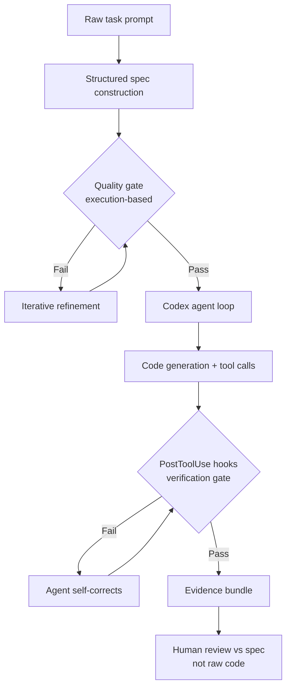

# Spec-Driven Development: Escaping the Agentic Productivity Paradox with Codex CLI


Two papers landed in the cs.SE queue this week that, read together, diagnose one of the most frustrating patterns in modern agentic development: the agent produces more output than any developer ever could, yet the team ships slower, reviews longer, and accumulates more defects. Diaz et al.'s "Spec-Driven Development for Agentic Software Engineering" (arXiv:2609.00252)[^1] names the syndrome the *productivity paradox* and maps the structural causes; Zhao Tian's "WiseSpec: Requirements-Driven Agents for Code Generation" (arXiv:2609.00568)[^2] shows that correcting just the *specification quality* upstream of the agent loop recovers a 13.17% improvement in resolution rate — without changing the model or tools at all. This article unpacks both papers and maps the actionable patterns directly to Codex CLI configuration.

## The Productivity Paradox

The SDD paper opens with three industrial data points that are worth reading twice:

- **Faros AI** (10,000-developer survey): AI-assisted developers completed 21% more individual tasks — yet PR review time increased 91% and defects increased 9%.[^1]
- **DORA 2024**: Higher AI adoption correlates with *reduced* delivery performance when controlling for other factors.[^1]
- **METR trial**: Experienced developers took 19% *longer* to complete tasks when using AI assistance, while *believing* they were 20% faster.[^1]

The mechanism is not mysterious. Individual velocity outpaces team review capacity. Generated code lacks the refactoring discipline that human authors apply; GitClear analysis showed refactoring work falling from 25% to below 10% of commits while duplicated code increased eightfold.[^1] The agent ships — the team inherits.

The SDD paper's diagnosis: informal development practices fail at agent scale because they rely on shared tacit knowledge that agents cannot carry. Specifications — written contracts that govern what an agent is supposed to produce — are the missing infrastructure.

## Specification Quality as the Leverage Point

WiseSpec quantifies the other half of this story. Zhao Tian's paper targets repository-level code generation, where task descriptions are "frequently incomplete, ambiguous, or lack critical contextual information."[^2] Rather than improving the agent's tools or the model itself, WiseSpec tackles the upstream problem: automatically constructing, evaluating, and iteratively refining the specification *before* the agent begins its work.

The result — a 13.17% improvement in `%Resolved` across baselines[^2] — is significant because it comes entirely from better problem statements, not better models. This is consistent with parallel research on task description defects: under-specification is the most severe defect class, and tasks with richer context demonstrate substantially better benchmark resilience.[^3]

## The WiseSpec Three-Stage Pipeline

WiseSpec operates through three stages before any code generation begins:[^2]

**Stage 1 — Structured Specification Construction.** Natural language requirements are parsed and organised into a structured specification that makes implicit expectations explicit: functional requirements, acceptance constraints, quality criteria, and contextual scope boundaries. The goal is a machine-readable contract that leaves no critical aspect underspecified.

**Stage 2 — Execution-Based Quality Assessment.** The specification itself is evaluated before being handed to the code generation agent. Validation checks probe for completeness, internal consistency, and testability — failing fast on ambiguous clauses rather than letting them propagate into ambiguous code.

**Stage 3 — Iterative Refinement.** Failed validations trigger targeted spec repairs. The loop continues until the specification passes all quality gates. Only then does the code generation agent receive its task.

The architectural implication is that specification quality is a *pre-condition*, not an afterthought. WiseSpec applies requirements engineering as a first-class phase — a discipline that software teams practised for decades before skipping it in the rush to agentic velocity.

## The SDD Framework: Five Patterns and Eight Mechanisms

The Diaz et al. paper formalises what healthy human-agent collaboration looks like, organising it around five *interaction patterns* and eight *methodological harness mechanisms*.

### Five Interaction Patterns

1. **Briefing** — Humans write specifications; agents consume them as operational contracts rather than prompts to interpret freely.
2. **Consultation** — Agents raise scoped questions on ambiguous clauses rather than hallucinating intent. The question has bounded consequences and explicit options.
3. **Review** — Humans audit structured evidence bundles (test results, coverage reports, diff summaries) against the original specification, not raw code.
4. **Norm Encoding** — Standing team conventions are materialised into machine-readable rule files so agents inherit them without re-learning per session.
5. **Orchestration** — Humans coordinate parallel agents, route tasks to the right specialist, and select among candidate implementations.[^1]

### Eight Methodological Harness Mechanisms

The SDD paper groups eight mechanisms into three functions:

| Function | Mechanism |
|---|---|
| Knowledge Management | Context engineering, persistent shared knowledge, normative specifications |
| Production Support | Executable specifications, N-version parallel agents, structured consultation |
| Governance | Evidence-backed acceptance, graduated autonomy |

The paper makes one strongly counter-intuitive point: the technical harness (the orchestration loop, tools, context windows) *depreciates* as models improve, whereas the methodological harness *appreciates* — the norms, specs, and evidence discipline become more valuable as agent autonomy increases.[^1]

## Mapping to Codex CLI

The two papers' recommendations map cleanly onto existing Codex CLI primitives.



### Stage 1: Specification Construction via Plan Mode and AGENTS.md

Plan mode (`codex --plan`) is Codex CLI's built-in briefing mechanism. Before any file edits happen, the agent produces a structured plan that humans can review and accept. Combined with an AGENTS.md structured task template, this forces explicit specification before action:

```markdown
## Task Template (AGENTS.md)

When opening a new task, state:

### Objective
[Single sentence: what outcome is being produced]

### Desired Behaviour
[Detailed description of correct system behaviour post-change]

### Acceptance Criteria
- [ ] Criterion 1 (testable, pass/fail)
- [ ] Criterion 2
- [ ] Criterion 3

### Scope
- Files in scope: [list]
- Files NOT in scope: [explicit exclusions]

### Constraints
[Performance bounds, API compatibility, backwards-compat requirements]
```

This mirrors WiseSpec's Stage 1: the structured template forces the human to make implicit requirements explicit before handing off to the agent.[^2]

### Stage 2: Quality Gates via PreToolUse Hooks

A PreToolUse hook can enforce a spec-completeness check before the agent begins editing. Add to `~/.codex/config.toml`:

```toml
[[hooks]]
trigger = "PreToolUse"
tool = "apply_patch"
run = "bash -c 'python3 ~/.codex/scripts/spec_gate.py'"
blocking = true
```

The `spec_gate.py` script parses the session context for the required AGENTS.md fields (`Desired Behaviour`, `Acceptance Criteria`, `Scope`) and exits non-zero if any are missing or appear templated but unfilled. This implements WiseSpec's Stage 2 — the specification quality assessment — as a hard gate before code generation proceeds.

### Stage 3: Iterative Refinement via PostToolUse Hooks

PostToolUse hooks running after `apply_patch` implement Stage 3's validation-and-refinement loop:

```toml
[[hooks]]
trigger = "PostToolUse"
tool = "apply_patch"
run = "bash -c 'pytest --tb=short -q 2>&1 | head -50'"
blocking = true
```

Exit code 2 signals a blocking failure that prevents the agent from proceeding; the agent receives the test output and must revise its patch before continuing. This operationalises the iterative refinement that WiseSpec applies at the specification level — except applied to code correctness at each edit step.

### SDD Norm Encoding: AGENTS.md as Machine-Readable Rule File

The SDD paper's *norm encoding* pattern maps directly to AGENTS.md's role in Codex CLI. Standing conventions that developers re-state in every PR review comment should instead be materialised in AGENTS.md so agents inherit them automatically:

```markdown
## Norms (AGENTS.md)

- Never suppress errors with bare `except:` — always log with `logger.exception()`
- New public API surface requires docstrings with `:raises:` documented
- Database migrations must include a rollback plan comment
- Test file names must match `test_<module_name>.py` exactly
```

The SDD paper notes that every decision documented in agent-readable context converts a recurring review burden into a one-time encoding cost.[^1] This compound return is why investing in AGENTS.md quality pays dividends across every subsequent task.

### SDD Evidence-Backed Acceptance

Rather than reviewing generated code line-by-line, the SDD framework recommends reviewing a *structured evidence bundle* — the artefacts that prove the spec was met. In Codex CLI terms, this means your PR description (or the `/recap` output) should contain:

- Test suite run results with coverage delta
- Linter output (zero new violations)
- Manual acceptance criteria checklist (each criterion marked pass)
- Diff summary scoped to the declared in-scope files

This shifts the review from "is this code correct?" to "does this evidence prove the spec was met?" — a substantially faster human cognitive task.

## Configuration Summary

The following `config.toml` wires the full SDD + WiseSpec pattern into Codex CLI:

```toml
[shell]
default_shell = "bash"

# Enforce spec completeness before any file edit
[[hooks]]
trigger = "PreToolUse"
tool = "apply_patch"
run = "python3 ~/.codex/scripts/spec_gate.py"
blocking = true

# Run tests after every patch
[[hooks]]
trigger = "PostToolUse"
tool = "apply_patch"
run = "bash -c 'pytest --tb=short -q 2>&1 | head -50'"
blocking = true

# Run linter after every patch
[[hooks]]
trigger = "PostToolUse"
tool = "apply_patch"
run = "bash -c 'ruff check . --select E,F,W --output-format=concise 2>&1 | head -30'"
blocking = true

[tools.update_plan]
enabled = true  # Keep plan visible for structured consultation
```

## What This Means in Practice

The combined message of both papers is that agentic development has a debt problem hiding as a velocity problem. WiseSpec demonstrates that the highest-leverage intervention is not a better model or more tools — it is a better specification arriving at the agent loop's entry point.[^2] The SDD paper provides the organisational framework for maintaining that discipline at team scale.[^1]

The 13.17% resolution rate improvement from WiseSpec corresponds to roughly one additional successfully resolved issue per eight attempts — and that gain requires no infrastructure change, no model upgrade, and no new tool integration. It requires only the discipline to write down what you actually want before asking the agent to produce it.

For Codex CLI practitioners, the practical implication is straightforward: if your agent's resolution rate is disappointing, instrument the specification rather than blame the model. Audit your AGENTS.md task templates for missing Desired Behaviour fields, missing Acceptance Criteria, and unbounded scope. The research suggests that investment will return more than switching models.

## Citations

[^1]: Diaz, J., Gayoso, J., Cimminio, A., & Perez, J. (2026). *Spec-Driven Development for Agentic Software Engineering: Harnessing Human–Agent Teamwork*. arXiv:2609.00252. <https://arxiv.org/abs/2609.00252>

[^2]: Tian, Z. (2026). *WiseSpec: Requirements-Driven Agents for Code Generation*. Accepted at ASE 2026 (SRC). arXiv:2609.00568. <https://arxiv.org/abs/2609.00568>

[^3]: Zeng, Y. et al. (2026). *Defective Task Descriptions in LLM-Based Code Generation: Detection and Analysis*. arXiv:2604.24703. <https://arxiv.org/abs/2604.24703>

[^4]: Orchid benchmark: ambiguity study showing performance degradation across lexical, syntactic, semantic, and vagueness categories in 1,304 function-level tasks. arXiv:2604.21505. <https://arxiv.org/abs/2604.21505>

[^5]: OpenAI. *Codex CLI AGENTS.md documentation and best practices*. <https://learn.chatgpt.com/docs/changelog>
