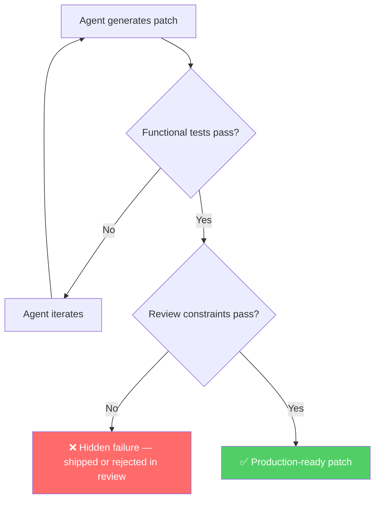

# SWE-Gate: Why 34% of Your Agent's 'Fixed' Patches Are Wrong — and How to Catch Them in Codex CLI


SWE-bench tells you whether a patch passes the tests. SWE-Gate asks whether it passes code review. The difference, according to a new benchmark from Sun Yat-sen University, is 34 percentage points worth of patches you thought were fixed but weren't.[^1]

## The Gap SWE-Gate Exposes

Software engineering benchmarks have converged on a single success signal: does the generated patch cause the test suite to go green? That signal is cheap to compute and easy to compare across leaderboards. It is also insufficient.

Real repositories come with acceptance constraints that are not captured in tests: error message semantics, strict typing conventions, encoding rules, interface compatibility requirements, ordered output guarantees. These constraints live in pull-request comments, contribution guides, and the tacit knowledge of maintainers. Tests rarely encode them.

He et al. built SWE-Gate to measure the gap.[^1] The benchmark assembles **303 repository-level repair instances across 75 open-source Python repositories**. Each instance includes:

- A failing issue paired with a functional test suite
- One or more *review constraints* derived directly from real PR comments in those repositories
- A constraint test suite that verifies constraint compliance independently of functional tests
- A non-compliant reference patch (passes functional tests, fails constraint tests)
- A gold patch (passes both)

The constraint derivation is the hard part. Rather than synthesising hypothetical quality rules, the authors mined actual reviewer feedback from merged PRs, then converted that feedback into executable tests. The result is a benchmark grounded in what senior engineers actually push back on during review.

## The Numbers

Running four LLM backends against SWE-Gate produces a table that should make any team relying on functional-only evaluation uncomfortable:

| Model | Functional pass rate | Constraint pass rate | Joint pass rate |
|-------|---------------------|---------------------|----------------|
| GPT-5.5 | 74.9% | 70.5% | 52.8% |
| DeepSeek-V4-Flash | 66.7% | 64.4% | 42.9% |
| GPT-5.4-mini | 61.7% | 64.2% | 39.6% |
| GPT-4o-mini | 9.2% | 46.4% | 4.3% |

Across all four models, **221 of 644 patches that passed functional tests failed their constraint tests** — a 34.3% hidden failure rate.[^1] Joint success rates are uniformly lower than functional rates because the two signal types are only weakly correlated.

The GPT-4o-mini row is particularly striking: 46.4% constraint compliance against 9.2% functional success. That model is, on balance, better at following conventions than it is at actually resolving bugs — the inverse of the standard leaderboard story.

## Constraint Taxonomy

SWE-Gate's constraint taxonomy groups requirements into six categories:[^1]

- **Error Semantics** (152 instances, 50.2%) — error message wording, exception types, error codes
- **Schema / Metadata / Typing** (143 instances, 47.2%) — return-type contracts, data shapes, annotation requirements
- **Ordering Preservation** — deterministic or documented ordering of sequences
- **Encoding / Escaping** — character encoding, HTML/URL escaping, binary safety
- **Scope Generalisation** — fix must handle more than the minimal case
- **Resource Lifecycle** — connection cleanup, file handle release, lock ordering

Error Semantics and Schema dominate because these are precisely what reviewers catch that linters do not: "The error message should say `not found` not `missing`," "This should return a `list`, not a `tuple`," "You need to preserve insertion order here."[^1]

## Why This Matters for Codex CLI Workflows

Codex CLI's default feedback loop is identical to SWE-Gate's functional-only baseline: Codex generates a patch, runs the test suite, iterates until green, stops. If the repository does not encode its review constraints as executable tests — and most do not — Codex has no signal to act on.[^2]

The implication is structural. Benchmark scores computed against functional-only evaluation systematically overstate the production readiness of agent-generated patches. A 74.9% functional rate for GPT-5.5 translates to a 52.8% joint rate once review constraints are applied — a 22-point gap that does not appear in any leaderboard.



## Enforcing Review Constraints in Codex CLI

The fix is to make review constraints executable and wired into Codex's feedback loop before the session ends. Three complementary approaches work today:

### 1. AGENTS.md Acceptance Criteria

Codex reads `AGENTS.md` at session start and treats it as authoritative context.[^3] Adding an explicit constraint section gives the model a signal before it writes a single line:

```markdown
## Acceptance Criteria

All patches must satisfy the following review constraints in addition to passing tests:

- **Error Semantics**: Exception messages must match the patterns in `docs/error-catalogue.md`.
  Do NOT use generic phrases like "not found" — use the catalogue entry.
- **Typing**: All public functions must have complete return-type annotations.
  `tuple` and `list` are not interchangeable; use the type the interface documents.
- **Ordering**: Any function returning a collection must preserve insertion order unless
  explicitly documented otherwise. Do not rely on set or dict ordering as a side-effect.
- **Resource Lifecycle**: Every file handle, database connection, and lock must be released
  in the same scope that acquired it. Use context managers.

Run `python scripts/check_constraints.py` after every patch to verify.
```

### 2. PostToolUse Constraint Hook

PostToolUse hooks fire after `apply_patch` completes, before Codex considers the turn done.[^4] A constraint checker script run at this point gives Codex immediate feedback to iterate against:

```toml
# ~/.codex/config.toml
[[hooks.post_tool_use]]
event = "PostToolUse"
tool_name = "apply_patch"
command = "python scripts/check_constraints.py --patch $CODEX_PATCH_PATH"
timeout_ms = 15000
```

The script exits 0 for compliant patches and 2 for violations (which Codex treats as a blocking signal).[^4] A minimal implementation:

```python
#!/usr/bin/env python3
# scripts/check_constraints.py
import subprocess, sys, re, pathlib

violations = []

# Error semantics: check for banned generic error messages
diff = pathlib.Path(sys.argv[sys.argv.index("--patch") + 1]).read_text()
if re.search(r'["\'](not found|missing|error)["\']', diff, re.IGNORECASE):
    violations.append("Error Semantics: generic error message detected — see docs/error-catalogue.md")

# Type annotations: run mypy on changed files
changed = [l[2:] for l in diff.splitlines() if l.startswith("+++ b/") ]
if changed:
    result = subprocess.run(["mypy", "--strict"] + changed, capture_output=True, text=True)
    if result.returncode != 0:
        violations.append(f"Schema/Typing: mypy violations:\n{result.stdout[:500]}")

if violations:
    for v in violations:
        print(f"CONSTRAINT VIOLATION: {v}", file=sys.stderr)
    sys.exit(2)
```

### 3. PreToolUse Review Gate

For patches destined for main, a PreToolUse hook on `shell` commands that invoke your CI can enforce a mandatory constraint gate before the session closes:[^4]

```toml
[[hooks.pre_tool_use]]
event = "PreToolUse"
tool_name = "shell"
command = "python scripts/gate_constraint_check.py"
timeout_ms = 30000
```

This is distinct from PostToolUse: PreToolUse can block the turn with `permissionDecision: "deny"`, forcing the agent to resolve the violation before proceeding. PostToolUse is observational; PreToolUse is enforcement.

## Model Selection Implications

SWE-Gate's data suggests a non-obvious routing strategy. GPT-4o-mini's inversion — high constraint compliance, low functional success — implies it has absorbed stylistic conventions but lacks the reasoning depth for complex bug resolution. GPT-5.5 leads on both axes but still drops 22 percentage points from functional to joint.[^1]

For Codex CLI with model routing configured via `config.toml`, this suggests:

```toml
# Route by constraint sensitivity, not just task complexity
[model]
default = "gpt-5.5"  # Highest joint success rate

# For style-only patches (formatting, annotation fixes):
# gpt-5.4-mini has comparable constraint rate at lower cost
```

For tasks where constraint compliance is paramount and functional complexity is modest — annotation-only passes, error message corrections, encoding fixes — the cheaper models may be appropriate. The joint success rate is the metric to optimise, not the functional rate alone.

## Verifying Currency

The SWE-Gate benchmark was submitted in September 2026 and tests models that are current at time of writing.[^1] The constraint categories it identifies — Error Semantics, Schema/Typing, Ordering, Encoding, Scope, Resource Lifecycle — are stable software engineering concerns that will not be superseded by model updates. The specific pass rates will evolve as frontier models improve, but the structural gap between functional and joint success is a property of how test suites are constructed, not of model capability.

SWE-bench itself has acknowledged this limitation: the benchmark's curators have noted that test suites are a proxy for correctness, not a complete specification.[^5] SWE-Gate makes that gap quantitative and actionable.

## Summary

SWE-Gate demonstrates that **one in three patches an agent considers fixed will fail code review**. The failure modes are not random: they cluster in error message semantics and type/schema contracts — exactly the categories that linters miss and reviewers reliably catch. Adding executable constraint checks to Codex CLI's feedback loop via AGENTS.md acceptance criteria and PostToolUse hooks converts a silent failure mode into an iterable signal. The joint success rate is the metric that matters.

## Citations

[^1]: He, X., Wang, Y., Liu, M., Chen, J., Zhang, H., & Li, G. (2026). *SWE-Gate: Passing Functional Tests Is Not Enough for Software Engineering Agents*. arXiv:2609.04167. https://arxiv.org/abs/2609.04167

[^2]: Jimenez, C. E., Yang, J., Wettig, A., Yao, S., Lieret, K., Press, O., & Narasimhan, K. (2023). *SWE-bench: Can Language Models Resolve Real-World GitHub Issues?* arXiv:2310.06770. https://arxiv.org/abs/2310.06770

[^3]: OpenAI. (2026). *Codex CLI: AGENTS.md reference*. https://github.com/openai/codex

[^4]: OpenAI. (2026). *Codex CLI lifecycle hooks: PreToolUse, PostToolUse, Interrupt*. Codex CLI documentation. https://github.com/openai/codex/blob/main/docs/hooks.md

[^5]: Allahverdiyev, T. (2026). *Beyond SWE-Bench: How to Actually Evaluate AI Coding Agents in 2026*. Medium. https://medium.com/@allahverdiyev.tural/beyond-swe-bench-how-to-actually-evaluate-ai-coding-agents-in-2026-8233940530f1
