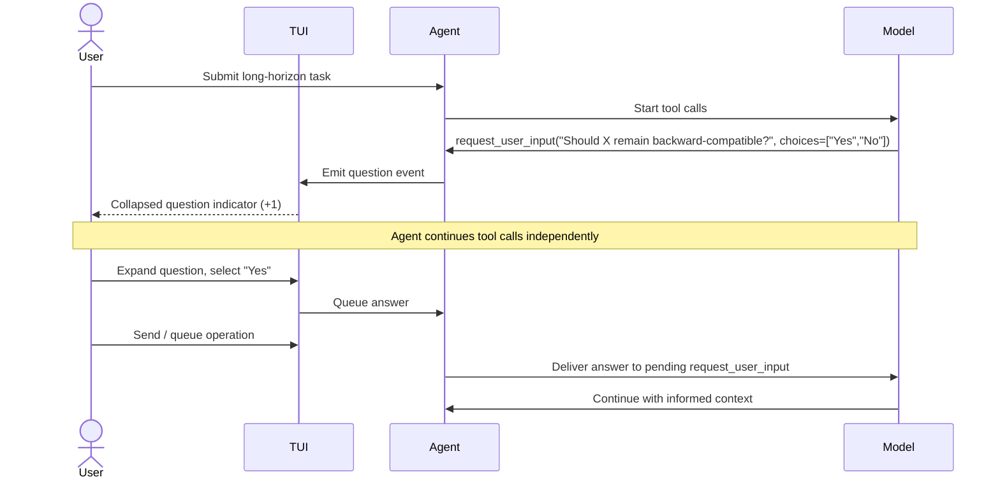

# Asynchronous TUI Questions in Codex CLI v0.154: A New Paradigm for Human-Agent Collaboration


---

The canonical Codex CLI interaction model is sequential: you write a prompt, the agent works, you review what it did and respond. That model breaks down under two common conditions. First, when a task is genuinely long-running (hours of compute, multi-file changes, dependency resolution chains), waiting for it to finish before answering a clarifying question is expensive. Second, when the agent discovers mid-task that it needs guidance it could not anticipate — the approval boundary is too coarse to capture the decision, but stopping the entire session is too disruptive.

The v0.154.0-alpha series, now accumulating in a cluster of six merged PRs, replaces the sequential model with **asynchronous TUI questions**: the agent can surface a clarifying question inline, the user can answer (or defer) at leisure, and the main workflow continues uninterrupted. This document covers the mechanics of the feature, its model-level requirements, the TUI interaction model, and the practical configuration surface it exposes.

---

## What Changed and Why

Existing approval surfaces in Codex CLI handle binary decisions — permit a tool call or block it. The `approval_policy` and Guardian reviewer address *actions*, not *choices*. When an agent working on a repository refactor needs to know whether a renamed symbol should remain backward-compatible, there is no existing primitive for surfacing that question without either halting the turn or encoding it as a comment in a generated file that the user may never read in time.

Asynchronous questions fill this gap by introducing a new first-class interaction primitive backed by a model-level tool: `request_user_input`.[^1] The tool is present in the session's tool set when the feature is enabled; the agent invokes it with a question string and an optional list of suggested answer labels; and the response is routed to the user via the TUI without any blocking of subsequent tool calls. The agent continues its work; the question pends.

---

## The TUI Interaction Model

The feature was built in two phases. PR #42889 landed the foundational components: a per-question draft editor with replay deduplication, an `AnsweredQuestion` framing component that truncates question text at UTF-8 boundaries and prepends it to the answer, and two new keymap actions — `prompt_stack_back` and `skip_question`.[^2] A new TUI setting, `tui.question_esc_back`, controls whether Escape navigates back through the question stack or returns to the main composer.

PR #42891 connected those components to the live TUI event flow.[^3] Questions arrive from agent messages and are displayed as a collapsed indicator showing a count of pending questions. Expanding one opens the answer editor. Users can:

- **Navigate** forward and backward through multiple pending questions without losing drafts
- **Queue** an answer for delivery on the next send operation
- **Skip** a question to defer it (the agent receives no reply for that question)
- **Return** to the main composer draft at any point — nothing in the question stack disturbs what the user was typing

Answers are routed through the existing input delivery pipeline and consumed only after the user accepts a send or queue operation, preventing accidental submission.[^3]

### Multiple-Choice Questions

PR #42894 adds a structured answer surface alongside freeform text.[^4] When the agent supplies suggested answer labels, the TUI renders them as a numbered list. Users invoke a choice by pressing its digit shortcut. Constraints applied at render time:

- Maximum 32 option entries (excess is discarded)
- Maximum 512 bytes per label (oversized labels are dropped)
- If choices are clipped by terminal height, submission is blocked until the terminal is expanded
- If no usable choices survive filtering, the interface falls back to freeform input

PR #42897 appends an editable **Other** entry to the choice list.[^5] Pressing a digit shortcut submits the named choice immediately; typing or pasting text opens the Other field. Arrow keys still navigate the named choices; the Other field supports Vim editing mode and history search. Blank Other submissions are rejected. Draft text in the Other field is preserved when the user navigates between named choices and returns.

### State Durability

PR #42903 ensures that question state — drafts, selections, expanded/collapsed status, message identifiers — survives across thread reconnections, input restoration, and session refresh.[^6] Specific behaviours:

- Buffered live questions are not replayed with their message text after reconnection — only their state is restored
- Recalled history entries strip image attachments and placeholder text
- Vim mode persists in the Other field when the user navigates away without accepting an answer
- **Forward navigation past the final question restores the most recent queued message** as an editable draft in the main composer — bridging the question stack and the pending work queue
- Newly arrived collapsed questions display a countdown timer; the timer clears when the editor opens or receives input
- Submit and Skip operations are disabled while the thread is unavailable, preventing stale deliveries

---

## Model-Level Requirements

Asynchronous questions are not a pure TUI feature — they require the model to support the `request_user_input` tool. Two hotfixes shipped in v0.153.3 and v0.153.4 refined GPT-6-Astra's guidance around this:

- PR #42809 (v0.153.3) corrected the async clarification guidance to recognise GPT-6-Astra's **text-only input constraint** — the model cannot embed images in its question text, so the guidance was tightened to enforce prose-only question bodies.[^7]
- PR #42878 (v0.153.4) qualified all Astra async-question guidance by whether `request_user_input` is actually present in the active tool set.[^8] When the tool is absent (e.g., in headless or CI sessions where the server strips it), the model now falls back to synchronous clarification rather than hallucinating a question delivery that will never be displayed.

PR #42904 reinforces this by writing Default and Plan collaboration mode instructions statically into the models-manager layer rather than through template rendering.[^1] The test suite for this PR explicitly retains checks for `request_user_input` availability guidance, confirming that the presence of the tool governs which instruction branch the model receives.



---

## Configuration Reference

```toml
# ~/.codex/config.toml

[tui]
# Controls Escape key in question editor:
# true  → navigate back in question stack
# false → return to main composer (default)
question_esc_back = true

[tui.keymap]
# Custom bindings (defaults shown)
prompt_stack_back = "ctrl+["   # also Ctrl+5
skip_question     = "ctrl+s"   # example override
```

Note that `Ctrl+]` and `Ctrl+5` are normalised to the same binding slot, so either key activates `prompt_stack_back` by default.[^2] If you assign another action to these keys explicitly, the question shortcut yields to your binding.

To strip `request_user_input` from the tool set entirely — disabling async questions for headless or CI sessions — use the `disable_tools` key:

```toml
[session]
disable_tools = ["request_user_input"]
```

⚠️ The `disable_tools` key's availability in production builds should be verified against your installed version; the PRs in the v0.154.0-alpha series are not yet in a stable release as of 5 September 2026.

---

## Practical Implications

**For long-running goal sessions:** async questions allow the agent to surface a design decision mid-task without halting the turn. You answer when your attention frees; the agent incorporates the answer at its next opportunity. Sessions that previously required multiple interruptions can now run closer to completion before demanding input.

**For CI and headless use:** strip `request_user_input` from the tool set. Without it, the model falls back to synchronous clarification or encodes ambiguity in its output — which is the existing behaviour and remains supported.

**For AGENTS.md:** if you want to suppress async questions at the instruction level rather than the tool level, add an explicit policy:

```markdown
## Workflow
- Do not use request_user_input during automated runs.
  Resolve ambiguity by applying the most conservative interpretation
  and annotating the decision with a TODO comment.
```

**For Guardian configuration:** async questions arrive as model-generated events, not tool calls from user input. If you run `approval_policy = "ask"` for all tool calls, `request_user_input` invocations will appear in the Guardian review stream — consider adding them to your auto-approve list if you want questions to surface immediately.

---

## Summary

The async TUI question cluster in v0.154.0-alpha represents the first significant change to the Codex CLI interaction model since approval policies were introduced. Rather than treating human input as a session-level gate, it introduces a per-question async channel: the agent asks, you answer when ready, and neither party blocks the other. The feature is fully keyboard-driven, resilient across disconnections and reconnections, and backed by model-level tool guidance that differentiates between sessions where the primitive is available and those where it is not.

The stable release incorporating this cluster is expected as v0.154.0; no date has been confirmed as of this writing.[^8]

---

## Citations

[^1]: PR #42904 "Use static instructions for the Default collaboration mode", merged 5 September 2026. <https://github.com/openai/codex/pull/42904>
[^2]: PR #42889 "Add TUI building blocks for inline async question editing", merged ~3 September 2026. <https://github.com/openai/codex/pull/42889>
[^3]: PR #42891 "Integrate asynchronous questions into the TUI", merged ~4 September 2026. <https://github.com/openai/codex/pull/42891>
[^4]: PR #42894 "Support selectable answers for asynchronous TUI questions", merged ~4 September 2026. <https://github.com/openai/codex/pull/42894>
[^5]: PR #42897 "Add inline Other answers to async question choices", merged ~4 September 2026. <https://github.com/openai/codex/pull/42897>
[^6]: PR #42903 "Preserve TUI question state and integrate history and queue navigation", merged ~5 September 2026. <https://github.com/openai/codex/pull/42903>
[^7]: PR #42809 "Corrected async clarification guidance for GPT-6-Astra text-only constraint", v0.153.3, merged 5 September 2026. <https://github.com/openai/codex/pull/42809>
[^8]: PR #42878 "[0.153 hotfix] Qualify Astra async-question guidance by tool availability", v0.153.4, merged 5 September 2026. <https://github.com/openai/codex/pull/42878>
