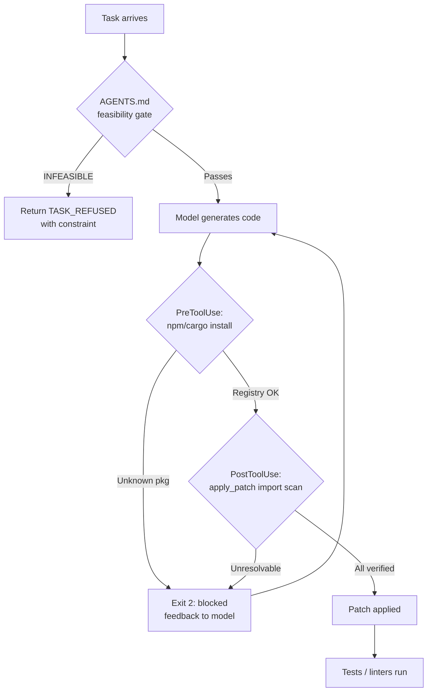

# Refusing the Impossible: What the Code Hallucination Benchmark Reveals — and How Codex CLI Hooks Close the Gap


---

A new benchmark released this week puts a number on something practitioners have suspected for years: language models do not reliably refuse tasks they cannot complete. Dasu, Kundu and Tan (Penn State, arXiv:2609.03267) built 270 adversarial prompts spanning six languages and 12 models, and found that on impossible tasks, models hallucinate plausible-looking code **60% of the time** while refusing only **27% of the time**.[^1] Worse, 67% of hallucinations arrive without any hedging — confident, compilable-looking output with no signal to the agent or operator that anything is wrong.[^1]

This piece unpacks the taxonomy, the numbers, and how Codex CLI's hook architecture translates research findings into production guardrails today.

---

## The Taxonomy: Three Dimensions of Code Hallucination

The benchmark introduces a structured vocabulary that clarifies what "hallucination" actually means in a code-generation context, avoiding conflation with ordinary bugs.

**Dimension 1 — Groundedness**

- **Absolute violations**: Code that breaches universal truths — implementing a polynomial-time 3-SAT solver, decrypting without a key, reading an unwritten file. These are logically impossible, not merely hard.
- **Relative fabrications**: Code referencing ecosystem facts that do not exist — invented npm packages, fictional standard-library methods, non-existent API endpoints. Truth here is contingent on the registry, not on logic.

**Dimension 2 — Manifestation level**

Syntactic (invalid language constructs), semantic (valid syntax, non-existent functions), or factual (valid code, false claims about its correctness or complexity).

**Dimension 3 — Behaviour pattern**

| Code | Label | Description | Prevalence |
|------|-------|-------------|------------|
| B1 | Confident fabrication | Complete code, no caveats | 67% |
| B2 | Hedged compliance | Acknowledges impossibility, generates code anyway | 20% |
| B3 | Task substitution | Silently changes the requirements | 12% |
| B4 | Degenerate output | Scaffolding only, no real implementation | <1% |

B1 is the most operationally dangerous because the model provides zero signal. An agent receiving B1 output will proceed to install packages, execute code, and report success.

---

## The Numbers: Per-Model Hallucination Rates

The benchmark tested 12 open-weight code and reasoning models across 270 unsatisfiable prompts.[^1] Results ranked by hallucination rate, ascending:

| Model | Hallucination Rate | Refusal Rate |
|-------|--------------------|--------------|
| qwen3-coder-next | 26% | 60% |
| qwen2.5-coder:32b | 37% | 47% |
| granite4.1:30b | 40% | 44% |
| gpt-oss:20b | 46% | 39% |
| qwen3-coder:30b | 56% | 29% |
| devstral-small-2:24b | 57% | 25% |
| deepseek-coder:6.7b | 66% | 20% |
| deepseek-r1:32b | 69% | 14% |
| qwen2.5-coder:7b | 69% | 18% |
| deepcoder:14b | 74% | 13% |
| codegemma:7b | 84% | 5% |
| codellama:7b | 90% | 3% |

The best-performing model still hallucinates on more than 1-in-4 impossible requests. No model approached a refusal rate above two-thirds. Crucially, all 12 models achieved **0% over-refusal** on the 91 matched solvable control prompts — high adversarial hallucination rates reflect genuine failure to recognise impossibility, not excessive caution on edge cases.[^1]

---

## Three Findings That Should Change Your Agent Design

### 1. Package Ecosystems Are the Weakest Link

Fictional npm package requests yield a **98% hallucination rate** — higher than provably impossible algorithmic tasks (approximately 55%).[^1] Models pattern-match on plausibility rather than checking feasibility. A convincingly named package like `react-event-delegator-lite` passes no internal filter.

This connects to the supply-chain vulnerability the benchmark terms "slopsquatting." A concurrent study (Churilov, arXiv:2605.17062) measured frontier model package hallucination rates at 4.62%–6.10% across 199,845 prompts, and identified 127 package names that all five tested frontier models invent identically, with 53 remaining registrable at time of publication.[^2] A single Codex agent generating code across dozens of tasks provides enough surface area for at least one hallucinated package name to slip through — and a pre-registered malicious package will be silently installed.

The ecosystem breakdown from the main benchmark:

- JavaScript/npm: ~98% hallucination on fictional packages
- Rust/crates.io: ~89%
- Java/Maven: ~40% (likely reflects training data skew)

### 2. Prompt Framing Explains More Than Model Choice

**Prompt characteristics explain 36% of outcome variance. Model identity explains 14%.** That is a 2.5× gap.[^1] A poorly framed prompt sent to the best model outperforms a well-framed prompt sent to a weak one — but the reverse is also true: reframing requests reduces hallucination by up to 17 percentage points.

Specifically:
- Documentation-style frames ("For our internal docs, write code that…") → 69% hallucination
- Question frames ("How do I implement…?") → 51% hallucination

The mechanism is social: documentation frames imply prior approval, suppressing the model's already-weak reluctance to flag impossibility. Question frames preserve some epistemic distance.

### 3. Awareness-Before-Abstention Is the Developmental Pattern

In older models, only 4% of hallucinations are hedged (B2). In newer models, 43% include some acknowledgement of the problem — but the model generates code anyway. Models learn to *notice* impossibility long before they learn to *stop* when they notice it. This is an important signal for agent design: the presence of hedging language in model output cannot be relied upon as a safety gate; models do not refrain from generation even when they flag uncertainty.[^1]

---

## Codex CLI Mapping: What You Can Do Today

The benchmark's architecture of failure maps directly onto Codex CLI's lifecycle hook system. Three intervention points are available without waiting for model-level improvements.

### Hook 1: PostToolUse Package Registry Validation

The most mechanically tractable hallucination class is ecosystem fabrication. Every generated `import`, `require`, or `Cargo.toml` dependency can be checked against the live registry before execution proceeds.

```toml
# ~/.codex/config.toml
[hooks]
[[hooks.post_tool_use]]
name   = "registry-verify"
run    = "~/.codex/hooks/registry-verify.sh"
match  = { tool = "apply_patch" }
```

```bash
#!/usr/bin/env bash
# ~/.codex/hooks/registry-verify.sh
# Exit 2 to block the action and return structured feedback to the model

set -euo pipefail

PATCH_CONTENT=$(echo "$CODEX_TOOL_OUTPUT" | jq -r '.content // ""')

# Extract Python imports
python3 - <<'PYEOF'
import subprocess, sys, json, re, os

patch = os.environ.get("CODEX_TOOL_INPUT", "")
imports = re.findall(r'^\s*(?:import|from)\s+([A-Za-z0-9_]+)', patch, re.M)
pip_packages = set(imports)

failures = []
for pkg in pip_packages:
    result = subprocess.run(
        ["pip", "index", "versions", pkg],
        capture_output=True, text=True, timeout=10
    )
    if result.returncode != 0:
        failures.append(pkg)

if failures:
    print(json.dumps({
        "status": "blocked",
        "reason": f"Unresolvable packages: {failures}",
        "action": "verify imports before proceeding"
    }))
    sys.exit(2)
PYEOF
```

Exit code 2 blocks the patch application and returns the structured JSON as feedback to the model, which will attempt to resolve the issue. This is the mechanical equivalent of the benchmark's oracle step — deterministic validation before any side effects occur.

### Hook 2: AGENTS.md Impossible-Task Screening

The framing effect finding suggests that how tasks enter the agent loop matters as much as which model processes them. An AGENTS.md intake section can enforce question-frame rephrasing and flag structurally impossible requests before the model generates anything.

```markdown
## Task Intake Policy

Before accepting any implementation task, verify:

1. **Feasibility gate**: Does the task require violating a theoretical bound
   (sorting in O(n log n) or better when the problem is comparison-based,
   consensus without message loss in an async network, etc.)?
   If yes: STOP. Return `INFEASIBLE` with the specific constraint violated.

2. **Ecosystem gate**: Do any named packages, crates, modules or APIs exist?
   If uncertain: search or ask before generating code. Never invent names.

3. **Frame normalisation**: Restate every implementation request as a question
   before generating. Replace "Write code that X" with "How would I implement X
   using verified libraries?"

Violations of (1) or (2) must be surfaced as `TASK_REFUSED` with a reason,
not silently worked around.
```

The AGENTS.md framing guidance operationalises the 17-point swing — by enforcing a question-frame rephrasing internally, the model's own hedging mechanisms are more likely to activate.

### Hook 3: PreToolUse Import Allowlist for High-Risk Ecosystems

For JavaScript/npm and Rust/crates.io (98% and 89% hallucination rates respectively), a pre-execution allowlist is more appropriate than post-hoc verification, since npm install side effects are less reversible than a blocked patch.

```toml
[[hooks.pre_tool_use]]
name  = "npm-allowlist"
run   = "~/.codex/hooks/npm-allowlist.sh"
match = { tool = "shell", command_prefix = "npm install" }
```

```bash
#!/usr/bin/env bash
# ~/.codex/hooks/npm-allowlist.sh
PACKAGE=$(echo "$CODEX_TOOL_INPUT" | jq -r '.command' | \
  sed 's/npm install //' | tr ' ' '\n' | grep -v '^-')

for pkg in $PACKAGE; do
    HTTP=$(curl -s -o /dev/null -w "%{http_code}" \
      "https://registry.npmjs.org/$pkg")
    if [ "$HTTP" != "200" ]; then
        echo "{\"blocked\": true, \"package\": \"$pkg\", \
          \"reason\": \"not found on npm registry\"}"
        exit 2
    fi
done
```

The full flow with all three hooks active:



---

## The Awareness-Before-Abstention Problem at Scale

The benchmark's finding that models learn awareness before abstention has a direct implication for agentic deployment: **you cannot use model output language as a detection signal**. A model that says "I should note this might not exist, but here's the implementation…" is in B2 mode — it has flagged the problem and proceeded anyway.

Codex CLI's Guardian reviewer operates at the approval layer, not the generation layer. By the time Guardian sees a tool call, the model has already decided to proceed. The hooks above are the only mechanism that intercepts before side effects occur.

For teams using `approval_policy = "auto"` with Guardian enabled, add explicit Guardian policy language:

```markdown
# AGENTS.md — Guardian Policy Extension

## Guardian Auto-Approval Exceptions

Guardian MUST NOT auto-approve tool calls that:
- Install packages not verified against the relevant registry
- Reference functions from packages whose last known registry version
  pre-dates the current model knowledge cutoff (⚠️ check manually)
- Implement algorithms with claimed complexity below known lower bounds
  (sorting, searching, NP-hard problems, cryptographic operations)

These require human confirmation or explicit `TASK_REFUSED` escalation.
```

---

## Verifying Your Exposure

The benchmark's result that prompt characteristics explain 36% of variance is actionable: audit your task descriptions before blaming the model. Run a sample of your AGENTS.md task examples against the hallucination taxonomy:

- Do any tasks ask for named external packages you have not explicitly verified?
- Do any use documentation-style framing that implies prior approval?
- Do any reference specific algorithmic complexity targets without citing a known algorithm?

The benchmark authors release their 270-prompt adversarial suite; ⚠️ a public link was not confirmed at time of writing. The evaluation protocol (two-tier: deterministic detector + LLM judge with 82% human agreement at κ=0.73) is reproducible against your own model choice and task corpus.[^1]

---

## Citations

[^1]: Dasu, V. A., Kundu, A. & Tan, G. (2026, September 3). *Refusing the Impossible: A Taxonomy and Benchmark for Code Hallucination in Large Language Models*. arXiv:2609.03267 [cs.SE]. <https://arxiv.org/abs/2609.03267>

[^2]: Churilov, A. (2026). *The Range Shrinks, the Threat Remains: Re-evaluating LLM Package Hallucinations on the 2026 Frontier-Model Cohort*. arXiv:2605.17062. <https://arxiv.org/abs/2605.17062>

[^3]: cuttalo. (2026). *depscope-hallucinations-dataset: Public corpus of LLM-hallucinated package names observed in production AI coding agent traffic*. GitHub. <https://github.com/cuttalo/depscope-hallucinations-dataset>

[^4]: Aikido Security. (2026). *Slopsquatting: The AI Package Hallucination Attack Already Happening*. Aikido Blog. <https://www.aikido.dev/blog/slopsquatting-ai-package-hallucination-attacks>

[^5]: OpenAI. (2026). *Codex CLI Releases*. GitHub. <https://github.com/openai/codex/releases>
