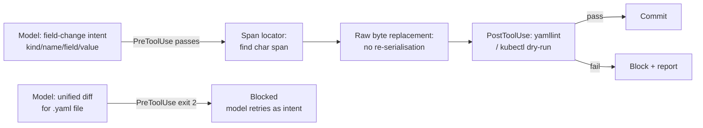

# Don't Let the Model Write the YAML: Deterministic GitOps Remediation and the Codex CLI Configuration Safety Problem


---

A new paper makes an uncomfortable claim about every coding agent that edits infrastructure configuration files: none of the text-generation strategies in common use are safe for unattended automation. Pruthvi Davineni (arXiv:2609.00227, August 2026) ran 83 real-world Kubernetes field-change tasks through three approaches — full-file rewrite, unified diff, and a new deterministic span-edit — and found correctness rates that should give any practitioner pause.[^1]

The span-edit pipeline achieved **100% correctness** on every run. The unified diff approach used by Codex CLI's `apply_patch` tool achieved **1.2–3.6%** depending on frontier model. Full-file rewrite oscillated between **2.4% and 97.6%** — wide enough to be useless for any workflow requiring reliability rather than luck.[^1]

---

## Why Text Generation Fails on YAML

YAML is uniquely hostile to language model editing: whitespace is semantically load-bearing. A single misplaced space collapses a mapping to a string; a shifted indentation level silently promotes a nested key to the root. Davineni's benchmark tested this concretely.

When Claude Sonnet 5 rewrote a 9,300-token Kubernetes manifest from scratch to change a single `replicas` field, it succeeded 97.6% of the time — but introduced collateral changes in 2.4% of cases and was non-deterministic (correct on some seeds, corrupt on others) for 6 of 83 tasks.[^1] Gemini Flash on the same corpus achieved only 2.4% correctness.[^1]

### The Fuzzy Patch Problem

The unified diff approach is worse than it looks. Davineni re-applied 415 Sonnet 5–generated diffs across four patch configurations:[^1]

| Tool | Applied | Silently misapplied |
|---|---|---|
| Strict context-exact | 2.7% | 0% |
| YAML-safe offset-tolerant | 67.5% | 0% |
| `patch --fuzz=3` | **96.4%** | **14.0%** |
| `patch --fuzz=3 -l` (whitespace-ignored) | 96.4% | **20.2%** |

The fuzzy patching practitioners use to get diffs to apply at all silently misapplies one in seven.[^1] When whitespace is also ignored, one in five. Since YAML indentation is structural, the "applied" result can move a field to the wrong nesting level with no diff rejection, no exception, and no operator alert.

---

## The Span-Edit Approach

Davineni's alternative reframes what the model produces. Instead of a diff or a complete file, the agent emits a **structured field-change declaration**:

```json
{
  "resource": {"kind": "Deployment", "name": "api-server"},
  "field": "spec.replicas",
  "value": "5"
}
```

A deterministic pipeline then parses the manifest, locates the target scalar's exact character span via YAML parser node-position marks, and replaces only that span in the raw bytes — no re-serialisation, no reformatting. Comments, block scalars, and quoting styles are preserved at 100%. Correctness follows from the algorithm, not the model.[^1]

Fail-closed behaviour on adversarial inputs (absent resources, missing fields, duplicate identifiers) achieved refusal precision 1.00, control coverage 1.00, recall 0.889.[^1]

**Generation cost comparison:**[^1]

| Approach | Output tokens/edit | Cost per correct edit |
|---|---|---|
| Span-edit | ~50–150 | ~50–150 tokens |
| Unified diff | ~200 | ~16,700 tokens |
| Full-file rewrite | ~9,300 | ~9,500 tokens |

Span-edit is O(1) in file size; full-file rewrite scales linearly with the manifest. The complete benchmark — 83 tasks × 5 seeds × 3 baselines × 2 models — cost $34.69 to run.[^1] The implementation ships as KubeAstra (Apache 2.0): ~150 lines for the safety-critical span-editor core, 520 lines total.[^1][^2]

---

## Codex CLI Mapping

Codex CLI agents encounter YAML editing frequently: Kubernetes manifests, Helm values files, GitHub Actions workflows, Docker Compose files, and the `config.toml` that configures Codex itself. The `apply_patch` tool is the primary mechanism — and it uses unified diff format, which carries every failure mode above.

### PreToolUse Hook: Block YAML Diffs

```toml
# ~/.codex/config.toml
[[hooks]]
event = "pre_tool_use"
tool_name = "apply_patch"
command = "bash ~/.codex/hooks/yaml-patch-guard.sh"
```

```bash
#!/usr/bin/env bash
# yaml-patch-guard.sh
set -euo pipefail
TARGET=$(cat | python3 -c "
import json, sys, re
d = json.load(sys.stdin)
patch = d.get('input', {}).get('patch', '')
m = re.search(r'^\+\+\+ b/(.+)$', patch, re.MULTILINE)
print(m.group(1) if m else '')
")
if [[ "$TARGET" == *.yaml ]] || [[ "$TARGET" == *.yml ]]; then
  echo "YAML diff blocked — emit field-change intent instead." >&2
  exit 2  # exit 2 = block and surface error to model
fi
```

`exit 2` signals Codex CLI to surface the error to the model and halt the tool call.[^3] The model then has the opportunity to emit a structured intent instead.

### AGENTS.md Policy

```markdown
## Configuration File Policy

- **Never emit unified diffs for `.yaml` or `.yml` files.**
- For Kubernetes: emit structured field-change declarations (kind, name, field, value).
- For Helm values: supply the minimal `key: value` pair to merge, not a full rewrite.
- For GitHub Actions: add or replace a named step by ID, not a full workflow rewrite.
- The `apply_patch` hook will block YAML diffs. This is intentional.
```

Hook + AGENTS.md is the standard Codex CLI governance pairing: the hook provides a hard boundary, the AGENTS.md gives the model the rationale, reducing how often it attempts the blocked action.[^3]

### PostToolUse Validation

For permitted YAML writes (greenfield generation), validate structure before commit:

```toml
[[hooks]]
event = "post_tool_use"
tool_name = "apply_patch"
command = "bash ~/.codex/hooks/yaml-validate.sh"
```

```bash
#!/usr/bin/env bash
TARGET=$(cat | python3 -c "
import json, sys, re
d = json.load(sys.stdin)
m = re.search(r'^\+\+\+ b/(.+)$', d.get('input',{}).get('patch',''), re.MULTILINE)
print(m.group(1) if m else '')
")
if [[ "$TARGET" == *.yaml ]] || [[ "$TARGET" == *.yml ]]; then
  python3 -c "import yaml, sys; yaml.safe_load(open('$TARGET'))" \
    || { echo "YAML parse failed after patch." >&2; exit 1; }
fi
```

The flow with both hooks in place:



---

## Practical Priorities

**Prefer `kubectl patch` over file edits for in-cluster resources.** `kubectl patch --type=json` applies a machine-readable change through the Kubernetes API, bypassing the YAML-on-disk problem entirely. AGENTS.md should instruct Codex to prefer shell tools over `apply_patch` for live cluster resources.[^4]

**Use `apply_patch` only for greenfield generation**, not for editing existing manifests. Generating a new manifest is safer than diffing one, because there is no pre-existing structure to corrupt. ⚠️ Correctness still depends on model quality.

**For MCP-based infrastructure tools**, design tool schemas to accept field-level intents rather than raw diffs. This is the software-interface equivalent of KubeAstra's architecture — and aligns with the intent/execution separation principle the paper demonstrates.[^2]

---

## Summary

Davineni's empirical result is unambiguous: unified diffs applied with fuzzy matching silently misapply at 14–20%, full-file rewrites are non-deterministic and model-dependent, and deterministic span-editing achieves 100% correctness at a fraction of the token cost. A PreToolUse hook blocking YAML diffs, paired with an AGENTS.md policy requiring structured field-change intent, implements the right division of labour for Codex CLI: the model reasons about _what_ to change, the algorithm decides _how_.

---

## Citations

[^1]: Davineni, P. "Don't Let the Model Write the YAML: Deterministic, Minimal-Diff GitOps Remediation from LLM-Proposed Field Changes." arXiv:2609.00227 [cs.SE], August 31, 2026. https://arxiv.org/abs/2609.00227

[^2]: KubeAstra — AI-powered Kubernetes troubleshooting and deterministic YAML remediation. Apache 2.0. https://github.com/astraverse-io/KubeAstra

[^3]: Codex CLI Hooks Reference — PreToolUse, PostToolUse, exit codes, hook configuration. Agentic Control Plane, 2026. https://agenticcontrolplane.com/blog/codex-cli-hooks-reference

[^4]: Kubernetes documentation: `kubectl patch`. https://kubernetes.io/docs/reference/kubectl/generated/kubectl_patch/
