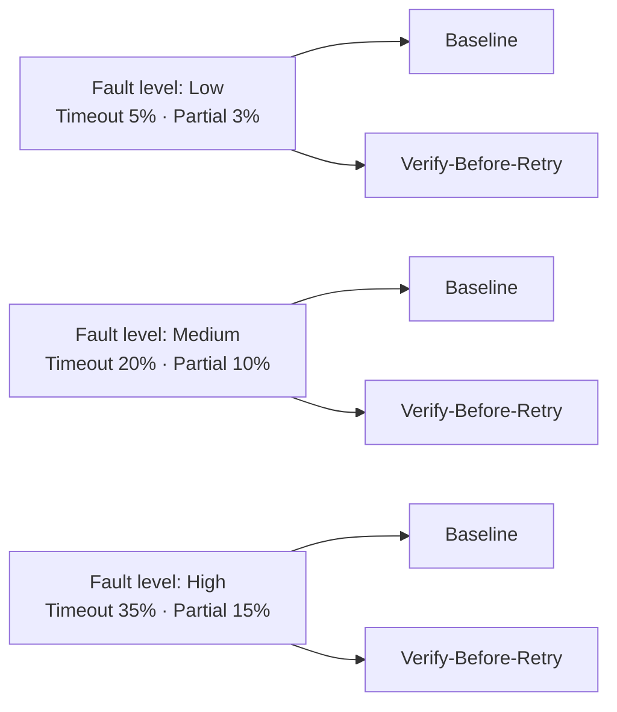

# Non-Atomic Tool Failures: Verified Tool Calls, Idempotency Keys, and the 52pp Duplicate-Reduction Pattern for Codex CLI Agents


---

Every Codex CLI agent observes the world only through tool calls. When those calls behave atomically — execute, return a clear signal — agent logic stays tractable. When they do not, a silent reliability crisis begins: the action commits on the server but the network drops the acknowledgement, an eventually-consistent store returns stale state for two seconds, or a compound write half-succeeds before the connection times out. The agent, seeing "ambiguous", retries. The duplicate side effect is already in flight.

A July 2026 paper by Mansoor, Phadke, and Rana[^1] formalises this problem class as **non-atomic tool failure** and demonstrates that a lightweight verification wrapper — requiring no model changes — eliminates duplicate side effects at high fault rates by **52 percentage points** while driving task success from 64% to 100%.

---

## The Assumption No Framework Questions

Every major agentic framework — ReAct, LangGraph, the Codex CLI harness — treats tool calls as producing one of two outcomes: success or failure. HTTP, TCP, and eventual consistency guarantee a third regime: **ambiguous**. A response may not arrive even though the server processed the request. A compound operation may return a partial-success envelope because one subordinate call failed after the primary effect committed.

Mansoor et al. identify four concrete failure modes[^1]:

| Failure mode | What happens |
|---|---|
| **Timeout-After-Dispatch** | Network timeout fires after the server begins processing. The effect commits; the agent never sees confirmation. |
| **Delayed Visibility** | Action succeeds (S → S′) but the verification query still observes stale state S due to eventual consistency lag. |
| **Partial Success** | A compound operation executes incompletely. The API returns 200 or a success envelope despite incomplete effects. |
| **Stale Conflicts** | Concurrent modifications invalidate assumptions from the agent's last read. |

These are not exotic edge cases. Codex CLI agents running against MCP servers — Stripe, GitHub, Sentry, PagerDuty — encounter all four routinely. Without verification before retry, the agent issues a duplicate action against an already-committed effect.

---

## The Verified Tool Wrapper

The paper's core contribution is a three-component wrapper that sits between the agent's tool-call invocation and the network, requiring no changes to the LLM itself[^1]:

### 1. Postcondition Verifier

Verification returns **three-valued** logic: `TRUE`, `FALSE`, or `UNKNOWN`. A binary verifier would coerce an eventually-consistent "stale state" read into `FALSE`, triggering a spurious retry. `UNKNOWN` signals that the state has not yet converged; the wrapper waits and re-queries rather than retrying the action.

Postconditions are specified as Boolean predicates over post-action state S′. For a customer activation flow:

```python
# Postcondition for activate_customer
def verify_activate_customer(state, action_args):
    customer = state.get_customer(action_args["customer_id"])
    if customer is None:
        return Verdict.UNKNOWN  # not yet visible
    if customer.status == "ACTIVE" and customer.activated_at is not None:
        return Verdict.TRUE
    return Verdict.FALSE
```

For a write-heavy invoice workflow:

```python
# Postcondition for record_invoice
def verify_record_invoice(state, action_args):
    row = state.get_invoice_row(action_args["invoice_id"])
    if row is None:
        return Verdict.UNKNOWN
    if row.exists and row.invoice_id == action_args["invoice_id"] \
       and row.amount == action_args["amount"]:
        return Verdict.TRUE
    return Verdict.FALSE
```

### 2. Idempotency Keys

Before dispatching any tool call, the wrapper constructs an idempotency key:

```python
k = hash(agent_id, action_type, payload, timestamp_bucket)
```

The key is transmitted with every call — and with any retry. A server that supports idempotency keys (Stripe's APIs, for example) deduplicates at the server layer. For servers that do not, the verify-before-retry logic serves as the deduplication gate. The two mechanisms are complementary, not redundant.

### 3. Verify-Before-Retry Algorithm

```
Input:  action a, verifier V, idempotency key k, max_retries N
Output: success | failure

dispatch(a, key=k)
for i in range(N):
    response ← await_response(timeout=T)
    if response == SUCCESS:
        return success
    elif response == DEFINITIVE_FAILURE:
        return failure
    else:  # AMBIGUOUS / TIMEOUT
        wait(exponential_backoff(i))
        verdict ← V(current_state, a.args)
        if verdict == TRUE:
            return success        # effect already committed
        elif verdict == UNKNOWN:
            continue              # wait for convergence
        elif verdict == FALSE:
            dispatch(a, key=k)    # safe retry with dedup key
return failure
```

The critical insight: **consult the verifier before authorising a retry**. The paper's ablation confirms this ordering. A "verify-only" configuration (no retry) achieves ~80% task success and ~20% duplicate rate. A "retry-only" configuration — which is what every baseline framework does — can actually *increase* duplicate rates because it is blind to already-committed effects.

---

## Experimental Results

The evaluation ran 300 agent episodes (2 task templates × 3 fault levels × 2 methods × 25 runs) with deterministic fault injection seeded at 42[^1]:



### Task success rate — activate_customer

| Fault level | Baseline | Verify-Before-Retry | Δ |
|---|---|---|---|
| Low | 92% | 100% | +8pp |
| Medium | 84% | 100% | +16pp |
| High | 64% | 100% | **+36pp** |

### Duplicate side-effect rate — activate_customer

| Fault level | Baseline | Verify-Before-Retry | Δ |
|---|---|---|---|
| Low | 20% | 0% | −20pp |
| Medium | 44% | 16% | −28pp |
| High | 72% | 20% | **−52pp** |

The `record_invoice` workflow is inherently more resilient (96% baseline at high fault), but even there the duplicate rate drops from 76% to 20% — a 56pp reduction — at high fault injection[^1].

The divergence reflects structure: `activate_customer` is a single state transition (INACTIVE → ACTIVE); `record_invoice` spans multiple rows, making postconditions harder to evaluate definitively.

---

## Why "Callability Is Not Operability"

A concurrent paper by Wang (arXiv:2608.23628)[^2] frames the same problem at the interface design level: a tool call that succeeds at the HTTP layer may leave the agent unable to proceed correctly. Wang defines **Agent-First Tooling (AFT)** as a contract exposing explicit external-effect semantics, machine-readable result schemas, execution lifecycle primitives, and built-in postcondition hooks.

The Mansoor et al. wrapper is a client-side AFT implementation for servers that don't supply these primitives natively. The design principle that follows: **MCP servers exposed to Codex CLI agents should surface idempotency support, effect lifecycle state, and machine-readable postcondition schemas in their tool definitions**, not buried in prose.

---

## Codex CLI Implementation Patterns

The Codex CLI hook system introduced in v0.148.0 provides three integration points for the verified tool wrapper pattern[^3]:

### Pattern 1 — PostToolUse as Postcondition Verifier

```toml
# ~/.codex/config.toml

[[hooks]]
event = "post_tool_use"
tool_name = "mcp__payments__record_invoice"
command = "python3 ~/.codex/hooks/verify-invoice.py"
timeout = 10

# Exit 0 → TRUE (verified, proceed)
# Exit 1 → UNKNOWN (not yet visible, surface warning)
# Exit 2 → FALSE (effect absent, block agent, request replan)
```

The hook receives the full tool result via `CODEX_TOOL_RESULT` environment variable in JSON form. The postcondition script queries the same data source the MCP server writes to and returns the three-valued verdict via exit code.

### Pattern 2 — Idempotency Key Injection via PreToolUse

```toml
[[hooks]]
event = "pre_tool_use"
tool_name = "mcp__payments__*"
command = "python3 ~/.codex/hooks/inject-idempotency-key.py"
timeout = 5
```

```python
#!/usr/bin/env python3
# inject-idempotency-key.py
# Reads CODEX_TOOL_INPUT, adds an idempotency_key field, writes amended JSON to stdout.
import json, hashlib, os, sys, time

tool_input = json.loads(os.environ["CODEX_TOOL_INPUT"])
session_id = os.environ.get("CODEX_SESSION_ID", "unknown")
action_type = os.environ.get("CODEX_TOOL_NAME", "unknown")

bucket = int(time.time() // 300)  # 5-minute window
key_material = f"{session_id}:{action_type}:{json.dumps(tool_input, sort_keys=True)}:{bucket}"
tool_input["idempotency_key"] = hashlib.sha256(key_material.encode()).hexdigest()[:32]

print(json.dumps(tool_input))
```

### Pattern 3 — AGENTS.md Postcondition Contracts

Document postconditions inline so the model can reason about verification requirements before calling a tool:

```markdown
## Tool Contracts

### mcp__payments__record_invoice
**Effect:** Creates or updates an invoice row in the ledger database.
**Postcondition:** `ledger.invoice_row.exists AND row.invoice_id = args.invoice_id AND row.amount = args.amount`
**Idempotency:** Supported. Pass `idempotency_key` (SHA-256 of session+action+payload).
**Ambiguity budget:** Wait up to 3 s for eventual consistency before concluding UNKNOWN.
**On FALSE result:** Do NOT retry without verification. Flag for human review.
```

This gives the model explicit semantics to cite when the PostToolUse hook returns a non-zero exit code. Without this, the model will improvise a retry strategy that is blind to the already-committed effect.

---

---

## Summary

Non-atomic tool failures are endemic to agents running against real HTTP backends. The verified tool wrapper — postcondition verification with three-valued logic, idempotency keys, verify-before-retry ordering — cuts duplicate side effects by 52pp at high fault rates while recovering task success from 64% to 100%[^1]. No LLM changes required. It maps directly onto Codex CLI's PostToolUse and PreToolUse hooks; AGENTS.md postcondition contracts give the model the semantics to treat verification failures as information rather than noise.

---

## Citations

[^1]: Mansoor, I. K., Phadke, A., & Rana, P. (2026). *Verified Tool Calls Improve LLM Agent Reliability Under Non-Atomic Failures*. arXiv:2608.02645. https://arxiv.org/abs/2608.02645

[^2]: Wang, Z. (2026). *Callability Is Not Operability: Controlled Interface Interventions for LLM Agents*. arXiv:2608.23628. https://arxiv.org/abs/2608.23628

[^3]: OpenAI. (2026). *Codex CLI v0.148.0 Release — Async Hooks and MCP Tool Hooks*. GitHub. https://github.com/openai/codex/releases/tag/rust-v0.148.0

[^4]: OpenAI. (2026). *Codex CLI v0.153.0 Release*. GitHub. https://github.com/openai/codex/releases/tag/rust-v0.153.0

[^5]: OpenAI. (2026). *Model Context Protocol — Tool Result Handling*. MCP Specification. https://modelcontextprotocol.io/docs/concepts/tools
