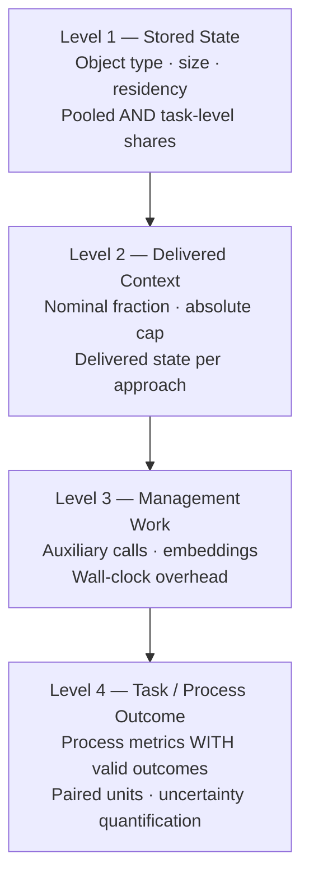

# Working Memory Is Not a Token Count: Coherence Debt, Heterogeneous Memory Objects, and Codex CLI's Experimental Context Management Mode


Most developers reach for a bigger context window when their coding agent starts making errors mid-session. Three papers from summer 2026 show that is the wrong diagnostic frame. The constraint is rarely raw capacity — it is what sits in the window, whether the right facts are available at the moment an edit is written, and whether your compression strategy actually transfers from the tasks you tuned it on to the tasks you run in production. Codex CLI's experimental context management mode (PR #42385, merged in v0.153.0) is a direct response to these findings.[^1]

## The Coherence Debt Model

Mohammadi, Klein, Chadha, Arora, and Bindschaedler (Max Planck Institute for Software Systems / EPFL / Apple / Aarhus University) introduce the concept of **coherence debt** in their August 2026 paper "The Working Set of a Coding Agent: Coherence Debt in Repository-Scale Tasks".[^2]

Their model treats a repository-scale coding task as the reconstruction of a *coupled-fact graph* — a set of symbols, tests, configuration values, and import relationships that must remain mutually consistent. When an agent writes an edit without a required fact in context, it incurs coherence debt: the gap between facts needed and facts available at write time.

The empirical results are stark. Across 154 closed-book trials on fictional v1→v2 API migrations (designed to be invisible to parametric memory), agents scored **zero** without workspace access. Supplying the same facts in prompt raised 299 of 300 trials to at least 75% success. Distance from the edit location made no difference — facts supplied 128,000 characters away worked identically to facts immediately adjacent.[^2]

Two findings deserve special attention for practitioners:

1. **Stale conventions hurt more than absence.** When outdated convention files contradicted working code, agents followed the documentation in 39 of 39 trials. Written standards carry authority regardless of accuracy.
2. **Harness inefficiency hides inside identical outcomes.** Configurations reaching the same test-pass rate consumed **12.8× different token amounts** while maintaining only 1.8× different peak context. The difference lay in rebuild rates — agents re-fetching facts they had previously read.

The takeaway is not "supply more tokens" but "supply the *right* facts, once, and keep them accurate".

## Memory Objects Are Not Uniform

Chen, Wan, Sun, Ma, Yang, Yan, Di, Cappello, and Thakur (Argonne National Laboratory / Columbia University / University of Houston) take a complementary angle in "Measure Before You Manage: Evaluating Agent Working Memory in Coding Agents".[^3] Their central claim: treating the context window as a homogeneous token pool misrepresents the actual structure of agent memory.

Analysing 55 archived full-context trajectories from SWE-bench Lite across eight repositories (using Claude-Opus-4.8 with a 25-step ceiling), they identify four object categories with dramatically different characteristics:

| Object type | Share of pooled volume | Compression ratio | Mean residency (steps) |
|---|---|---|---|
| Tool outputs | 55.5% | 0.673 | 8.61 |
| Artefacts | 28.3% | **0.150** | 10.71 |
| Instructions | — | 0.518 | — |
| Agent state | — | **0.970** | — |

Artefacts (source files, patches) compress to one-seventh of their raw size. Agent state (reasoning traces, intermediate notes) is nearly incompressible. Tool outputs sit in the middle and dominate by volume.

The practical consequence: a FIFO eviction policy that drops the oldest tokens first will preferentially evict artefacts — the most compressible objects — when it should instead compress them in place and protect residency.

### The Four-Level Evaluation Framework

The paper's most actionable contribution is a hierarchy for evaluating memory management strategies before claiming they work:



The paper's core warning is that nearly all prior work stops at Level 4 and skips Levels 1–3. This produces misleading comparisons:

- **Budget labels are deceptive.** In the study's earlier sweeps, a 6,000-token floor made 25% and 50% nominal budget arms identical in practice. 18 of 24 tasks in the later study exceeded the nominal 15% allocation.
- **Shared caps do not imply shared context.** Across eight complete trajectory blocks, no capped-arm pair maintained less than 10% median managed-state variance. The FIFO–UC pair diverged by up to 88.8%.
- **Management overhead is real and measurable.** The retrieval-based (GA) strategy added 285 importance-rating calls and a mean +67.45 seconds wall-time over FIFO — cost that nominal budget comparisons make invisible.[^3]

Critically, the object-aware compression strategy that looked promising in calibration (−1.633 repeated calls vs. FIFO, p=0.0049) produced a non-significant result on held-out tasks (−0.500 calls, p=0.5000). Calibration gains did not transfer.

## Adaptive Memory as a Learned Capability

SWE-MeM (Gao, Zeng, Yu, Wangni, Wang, Cai, He, and Lyu — Chinese University of Hong Kong / Shanghai Jiao Tong University / Tsinghua University / ByteDance) attacks the transfer problem differently: instead of hand-crafting compression heuristics, train the agent to decide when, what, and how to compress.[^4]

The central tool exposes five arguments:

```python
compress(
    analysis="progress and remaining work assessment",
    start_step=int,      # first step to compress
    end_step=int,        # last step to compress
    content=str,         # compressed summary
    remaining_work=str   # task continuity anchor
)
```

Agents trained with Memory-aware GRPO — which splits trajectories at compression boundaries and applies step-level credit masking — learn to trigger compression proactively at natural task boundaries rather than reactively when context pressure hits.

Results on SWE-bench Verified under a strict **32K context budget**:

| Model | Resolve rate |
|---|---|
| Qwen3-4B-Instruct (SFT+RL) | 43.4% |
| Qwen3-Coder-30B-A3B (SFT+RL) | **60.2%** |
| Context Folding (Seed-OSS-36B) baseline | 58.0% |

The 30B model surpasses Context Folding on a larger model while using 94.7% of baseline token volume. On SWE-bench Multilingual, the 30B model reaches 40.7%; on SWE-bench Pro, 31.7%.[^4]

The implication for Codex CLI users is that compaction quality depends on the model's learned behaviour, not just the compaction configuration. A model that has not been trained to compress adaptively will compress opportunistically or too late.

## Codex CLI's Experimental Context Management Mode

PR #42385, merged in v0.153.0 (3 September 2026), introduces an opt-in context management layer that directly addresses the problems identified above.[^1] Enable it in `config.toml`:

```toml
[features.context_management]
experimental_mode = true
```

**Eligibility:** ChatGPT Plus, Pro, and Pro Lite sessions using the Codex backend. API-key sessions, custom providers, non-Codex endpoints, and temporary structured threads remain excluded.

When active, three capabilities unlock:

- **Token-budget context** — the runtime tracks cumulative consumption against a declared budget and makes remaining capacity visible to the model, enabling it to reason about compression timing rather than reacting to context overflow.
- **History notes** — compressed session history is stored as structured notes rather than raw transcript summaries, preserving semantic structure across compaction boundaries.
- **`new_context` tool** — the model can explicitly request a fresh context window, carrying forward only the notes it selects. This is a direct implementation of the coherence debt insight: supply the right facts, freshly, at the right moment.

The PR notes that product teams should not make customer-facing guarantees that depend on the configuration key name or behaviour remaining stable — the feature is described as under active development.

## Practical Implications

These three papers converge on four recommendations that apply to Codex CLI workflows today, with or without the experimental mode enabled:

**1. Audit your AGENTS.md conventions regularly.** The coherence debt study found stale written standards actively harmful — agents prefer documented conventions over working code patterns in every trial. Treat `AGENTS.md` as a live accuracy contract, not a one-time write.[^2]

**2. Measure delivered context, not just nominal budget.** Before tuning `model_auto_compact_token_limit`, verify what is actually in context at each step using PostToolUse hooks that log object counts by type. A token budget that looks identical across two sessions may deliver wildly different artefact coverage.[^3]

```toml
[[hooks]]
hook = "PostToolUse"
run = "python3 scripts/log_context_objects.py"
```

**3. Treat artefacts as high-priority compression candidates.** With a 0.150 compression ratio, source files and patches compact to one-seventh of raw size. If your compaction strategy evicts them instead of compressing them, you are discarding the most recoverable objects. The `new_context` tool in experimental mode lets the model carry forward compressed artefact summaries explicitly.[^3]

**4. Size your rollout token budget against task coupling, not task length.** The working set study shows that tightly coupled tasks (high coherence debt) fail even with abundant context if the *right* facts are absent. For refactoring tasks that touch interconnected modules, use a named profile that reduces subagent parallelism and keeps the coupled-fact graph in a single session:[^2]

```toml
[profiles.refactor]
model = "gpt-6-astra"
approval_policy = "on-failure"

[profiles.refactor.rollout_budget]
token_limit = 500_000
reminder_interval = 50_000
```

The experimental context management mode is the first Codex CLI feature that operationalises the research insights directly — making the model an active participant in memory governance rather than a passive consumer of whatever sits in the window.

## Citations

[^1]: OpenAI. "Add experimental context management activation." Codex CLI PR #42385. GitHub, 3 September 2026. <https://github.com/openai/codex/pull/42385>

[^2]: Mohammadi, B., Klein, L., Chadha, A., Arora, A., and Bindschaedler, L. "The Working Set of a Coding Agent: Coherence Debt in Repository-Scale Tasks." arXiv:2608.16630, August 2026. <https://arxiv.org/abs/2608.16630>

[^3]: Chen, L., Wan, Z., Sun, B., Ma, X., Yang, C.-H., Yan, F., Di, S., Cappello, F., and Thakur, R. "Measure Before You Manage: Evaluating Agent Working Memory in Coding Agents." arXiv:2608.31057, August 2026. <https://arxiv.org/abs/2608.31057>

[^4]: Gao, S., Zeng, W., Yu, Z., Wangni, J., Wang, C., Cai, K., He, S., and Lyu, M. R. "SWE-MeM: Learning Adaptive Memory Management for Long-Horizon Coding Agents." arXiv:2606.28434, June 2026. <https://arxiv.org/abs/2606.28434>
