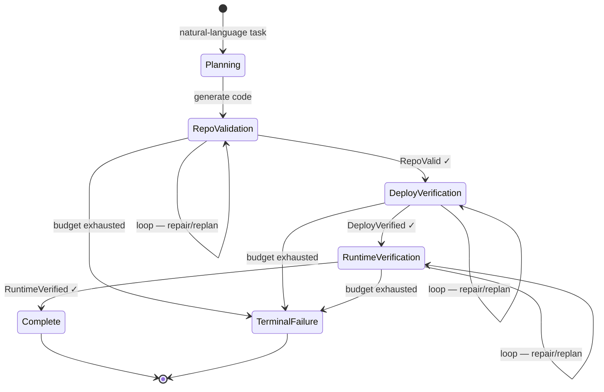

# Agentic Cloud Engineering: How Graph, Loop, and Zero-Trust Harness Abstractions Make Bounded Autonomous Work Provable


---

The implicit assumption behind most coding-agent deployments is that a capable model and a reasonable prompt are sufficient to produce reliable autonomous work. A new empirical framework from Tata Research Development and Design Centre challenges that assumption directly: Sakhinana and Runkana's "Towards Agentic Cloud Engineering: Graph and Loop Engineering with a Zero-Trust Agent Harness" (arXiv:2609.00050)[^1] demonstrates that three complementary structural abstractions — not model capability — determine whether an autonomous agent produces bounded, auditable outcomes or drifts into unbounded, unverifiable ones.

The stakes are concrete. In their ablation, removing the recovery loop drops verified task-completion rate from 95.0% to 12.9% across the same model and task set.[^1] The model doesn't change. The harness does.

---

## The Three Abstractions

The framework decomposes autonomous agent execution into three orthogonal concerns:

- **Graph engineering** — controls *where* execution proceeds via evidence-gated state transitions
- **Loop engineering** — controls *how many times* an agent may attempt recovery under bounded resources
- **Zero-trust harness engineering** — controls *what* an agent may do under identity, authorisation, and policy constraints

Each abstraction is model-independent. The evidence gate does not ask the model whether the deployment succeeded; it runs `kubectl get pods` and checks exit codes. The loop does not ask the model whether it has tried enough; it consults an attempt counter. The harness does not ask the model whether it has the right permissions; it queries OPA Gatekeeper.

---

## Graph Engineering: Evidence-Gated State Machines

A graph-engineered workflow is a directed state machine where transitions fire only when machine-checkable evidence satisfies a predicate. The completeness condition is formal:[^1]

> Complete ⟺ RepoValid(R\*, ℤ\*) ∧ DeployVerified(D\*, ℤ\*) ∧ RuntimeVerified(D\*, ℤ\*)

All three conditions must hold simultaneously. A model claiming completion without satisfying all three cannot advance the state.



The key property: an execution that reaches `TerminalFailure` is as auditable as one that reaches `Complete`. Both states are bounded. Neither requires human intervention to halt.

In the experiment, Evidence-Gated Execution Rate (EGER) — the fraction of transitions that required passing evidence before advancing — was 100.0% across all four models tested.[^1] When the authors replaced machine-checkable gates with model-reported completion, EGER degraded to 99.0%, yielding four invalid progressions. Four invalid progressions in 840 executions may sound negligible; in a production pipeline they represent phantom deployments that pass CI and corrupt downstream state.

---

## Loop Engineering: Bounded Recovery With Teeth

Loop engineering governs the iterative inner cycle at each graph node: diagnose, repair or replan, retry, re-verify. The critical word is *bounded*. Each loop carries an explicit budget:[^1]

- **Maximum 20 recovery attempts** per workflow execution
- **120 minutes** wall-clock time
- **10,000,000 model tokens** cumulative
- **500 tool calls**
- Per-task cost ceilings and blast-radius restrictions

A companion empirical study (arXiv:2608.21884)[^2] establishes the practitioner consensus on what a well-engineered loop requires: triggering and scheduling, machine-checkable stop conditions, persistent state across runs, domain-specific skills, parallel isolation via git worktrees, a maker/checker verification split, human escalation gates, explicit budgets, and structured observability.

The ablation result is the sharpest argument for bounded loops. Without recovery, Gemini 2.5 Pro achieves 82.1% Verified Task Completion Rate and GPT-5.6 Sol achieves 95.0%. Without *any* recovery loop, GPT-5.6 Sol drops to 12.9%.[^1] The 500-tool-call budget is not a resource constraint — it is the mechanism that converts an unbounded search into a bounded computation.

Recovery success also stratifies by verification stage. For GPT-5.6 Sol: repository-validation recovery succeeds 95.7% of the time, deployment-verification recovery 93.6%, runtime-verification recovery 90.0%.[^1] Runtime failures are harder to recover from because they involve live infrastructure state rather than static code analysis.

---

## Zero-Trust Agent Harness Engineering

The harness mediates every external action the agent can take. In the Agentic Cloud Engineering framework this means:[^1]

- **Workload Identity Federation** — agents carry cryptographic identities; tool calls are attributed to a specific identity
- **RBAC/ABAC** — roles and attribute-based policies gate capability grants
- **OPA Gatekeeper** — policy evaluation runs out-of-process and is not bypassable by the model
- **MCP capability scoping** — tools are registered per-agent with explicit permission sets; no ambient capability inheritance
- **GKE with gVisor sandboxing** — deployment actions execute in isolated kernel-mode sandboxes
- **Cilium NetworkPolicy** — egress is restricted to declared service endpoints
- **Falco runtime detection** — syscall anomalies surface as evidence that can trigger loop re-evaluation

Unauthorised Capability Denial Rate was 100.0% across all 840 executions — every unauthorized tool invocation was blocked. Authorized Capability Permission Rate was 99.3% (139/140 authorized requests succeeded).[^1] The one failed authorised request was a configuration edge case in the IAM role binding, not a policy error.

---

## Experimental Scope and Results

The benchmark covers 140 natural-language tasks across 14 cloud-engineering domains — DevOps, CloudOps, SRE/AIOps, SecOps, FinOps, DataOps, MLOps/LLMOps, AgentOps, RAG/GraphRAG, Database Ops, Network Ops, IAM, Governance/Compliance, and Inference Ops — with six controlled failure conditions per task.[^1]

| Model | VTCR | RSR | EGER | BTR |
|---|---|---|---|---|
| Gemini 2.5 Flash-Lite | 56.4% | 51.0% | 100% | 100% |
| Gemini 2.5 Flash | 68.6% | 66.2% | 100% | 100% |
| Gemini 2.5 Pro | 82.1% | 76.4% | 100% | 100% |
| GPT-5.6 Sol | 95.0% | 93.1% | 100% | 100% |

VTCR (Verified Task Completion Rate) varies by model. EGER (Evidence-Gated Execution Rate) and BTR (Bounded Termination Rate) hold at 100% regardless of model — these are framework-enforced properties.[^1] The separation is the core claim: model capability determines how often you succeed; the framework determines whether failure is bounded and auditable.

---

## The Adoption Reality

The companion loop-engineering study[^2] provides a sobering counterpoint. Mining 36,710 repositories, the authors confirmed autonomous agent loop operation in only 217 (0.59%). Of those 217 confirmed loop repositories:

- **Claude Code: 189** (87%)
- OpenAI Codex: 11 (5%)
- OpenCode: 6, Gemini CLI: 5, Cursor: 4

The gap between the prescriptive framework and practice is stark. The study found virtually zero committed state files despite practitioner consensus that loops require persistent state: zero goal or stop-condition definitions, two state files (both rejected as false positives), zero budget files, zero verifier subagent references.[^2]

The 0.59% prevalence and the near-total absence of committed state artefacts suggest that most teams running agent loops are operating unbounded cycles — no explicit stop conditions, no persisted recovery state, no observable budget consumption. This is precisely the condition the Agentic Cloud Engineering framework is designed to eliminate.

---

## Mapping to Codex CLI

Codex CLI exposes primitives for all three abstractions, though not yet as a unified system.

**Graph engineering via codex queue and hooks:**

```toml
# config.toml
[tools.post_tool_use]
# evidence gate: block transition unless verifier exits 0
command = "bash -c 'pytest --tb=short -q && exit 0 || exit 2'"
```

Exit code 2 from a PostToolUse hook blocks the current action and prevents the agent from advancing — the closest available analogue to an evidence-gated transition.

**Loop engineering via rollout_budget and max_turns:**

```toml
[session]
max_turns = 50           # per-session tool-call ceiling (loop bound)
rollout_budget = 40      # aggregate token/turn budget per codex queue task
```

The `rollout_budget` parameter, introduced in v0.152.0, applies a configurable ceiling to each task in a `codex queue` pipeline — giving each inner loop its own budget without terminating the outer orchestration.

**Zero-trust harness via sandbox and approval policy:**

```toml
[sandbox]
writable_roots = ["/workspace/repo"]     # blast-radius restriction
network_mode   = "allowlist"
allowed_hosts  = ["api.github.com", "registry.npmjs.org"]

[approval]
policy = "untrusted"    # all shell commands require explicit approval
```

For harness-grade authorisation — the OPA/Falco/gVisor tier — Codex CLI currently relies on the host container environment (Kubernetes + gVisor, macOS sandbox-exec, or bubblewrap). The framework itself does not ship an OPA integration, but PreToolUse hooks can perform policy-as-code checks before any tool invocation proceeds.

**Bounded termination:**

A Codex session that exceeds `max_turns` terminates with a structured exit rather than running indefinitely. Paired with `codex exec resume`, a series of bounded sessions can implement the outer graph loop with explicit audit trails in each session's JSONL transcript.

---

## Takeaways

The Agentic Cloud Engineering framework reframes the autonomous agent reliability question. Model capability is necessary but not sufficient; execution architecture determines whether failure is bounded. EGER and BTR at 100% across all four model tiers — including the weakest — demonstrate that architectural enforcement of evidence gating and bounded termination is model-independent. The adoption data from the companion study[^2] suggests that most deployed loops currently lack both properties.

---

## Citations

[^1]: Sakhinana, S. S., & Runkana, V. (2026). *Towards Agentic Cloud Engineering: Graph and Loop Engineering with a Zero-Trust Agent Harness*. arXiv:2609.00050. Tata Research Development and Design Centre. https://arxiv.org/abs/2609.00050

[^2]: Anonymous. (2026). *Loop Engineering: Building Blocks, Adoption, and Impact*. arXiv:2608.21884. https://arxiv.org/abs/2608.21884

[^3]: OpenAI. (2026). *Codex CLI v0.152.0 Release Notes*. GitHub. https://github.com/openai/codex/releases/tag/rust-v0.152.0

[^4]: OpenAI. (2026). *Codex CLI v0.153.0 Release Notes*. GitHub. https://github.com/openai/codex/releases/tag/rust-v0.153.0

[^5]: Model Context Protocol. (2026). *The 2026-07-28 Specification*. https://blog.modelcontextprotocol.io/posts/2026-07-28/
