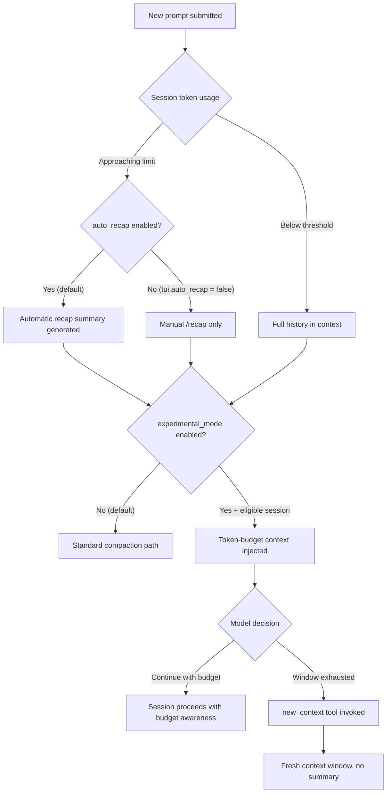

# Codex CLI v0.153.0: Three-Tier Context Management, Experimental Token-Budget Mode, and Guardian History Fencing


Long-running Codex sessions have always had a quiet failure mode: the model gradually loses grip on decisions made hours earlier, repeats questions it already asked, and produces subtly inconsistent edits. The problem is not context-window size — GPT-5.6 Sol has a nominal one-million-token window[^1] — but context *quality*. v0.153.0 (released 3 September 2026) makes context management an explicit, configurable concern rather than a background heuristic, introducing three distinct tiers of control.[^2]

This article covers what changed, why it matters, and how to configure each tier correctly.

## Why Context Quality Degrades

Before the mechanics, it helps to understand the failure model. Concurrent research from Alibaba and Columbia University frames session history as a resource-allocation problem, not a retrieval problem.[^3] Their Scroll system treats the agent session as an executable environment — an append-only event log backed by a persistent Python kernel — where the model writes code to materialise only the spans it actually needs. The core insight: **the model should decide what to bring into view, not receive everything and hope for the best**.

Scroll achieves 94.8% on LongMemEvalS, 73.1% on BEAM_10M (+5.1 points above the prior best), and 86.7% on LOCA_256K (+37.4 points above the prior best long-horizon agent), all without lossy compression.[^3] These are research-scale numbers, not Codex CLI production numbers, but they establish the ceiling that well-managed context can reach.

Codex CLI v0.153.0 does not ship Scroll. What it ships is a set of primitives that move in the same direction: giving the model — and the operator — more deliberate control over what history is loaded, summarised, or discarded.

## The Three-Tier Model



### Tier 1 — Automatic Recaps (configurable since v0.153.0)

Prior to this release, automatic recaps were always on. When Codex detected the session approaching its effective context limit, it generated a summary and replaced the preceding history. The recap was invisible in the sense that users could not disable the automatic trigger while retaining the manual `/recap` command.

v0.153.0 PR #42101 decouples the two.[^2] Add the following to your config:

```toml
# ~/.codex/config.toml
[tui]
auto_recap = false
```

With `auto_recap = false`, Codex never triggers a recap automatically. The `/recap` slash command remains available for explicit invocation. This is useful in short-context workflows where you want precise control over the summary point, or in environments where automatic compaction interferes with state machines that depend on complete history.

**Do not disable auto_recap in sessions that run for hours without supervision.** Without it, you bear full responsibility for preventing context exhaustion.

### Tier 2 — Experimental Context Management Mode

PR #42385 adds a disabled-by-default feature flag:[^4]

```toml
# ~/.codex/config.toml
[features.context_management]
experimental_mode = true
```

When enabled, three sub-features activate for *eligible* sessions:

**Token-budget context.** The session receives explicit remaining-capacity information alongside each model call — not an approximation, but a machine-readable budget the model can reason against. This shifts from implicit "the model knows its window is big" toward deliberate accounting. The model can pace its outputs, skip low-value elaborations, or decide to compact early.

**History notes.** Structured continuity annotations are injected describing what happened earlier in the session. The schema is internal to OpenAI and not publicly documented; do not build tooling that depends on parsing or editing these notes.[^5]

**`new_context` tool.** When the model determines the current window is no longer useful — not just full, but actively counter-productive — it can invoke `new_context` to start a fresh context window. Crucially, this is a *no-summary compaction checkpoint*: it discards history rather than summarising it. The session continues from only the initial context (system prompt, AGENTS.md, active files). This is aggressive and intentional: the model is saying the slate should be wiped, not compressed.

#### Eligibility Constraints

Experimental mode is **only active** when all of the following hold:

| Condition | Requirement |
|---|---|
| Account tier | ChatGPT Plus, Pro, or Pro Lite |
| Backend | Codex backend (not custom providers) |
| Session type | Standard (not temporary structured threads) |
| API-key sessions | Excluded |
| Custom provider credentials | Excluded |

If any condition is unmet, the flag is silently ignored. Check with a short test session before writing deployment documentation that references this feature.[^5]

This is under-development infrastructure. Do not design production workflows that depend on `new_context` being available unless you have verified eligibility and confirmed the feature is behaving as expected in your environment.

### Tier 3 — Guardian History Fencing

Context management is not only about what the *model* can see — it is also about what the *safety reviewer* can see. PRs #41879 and #42065 address a class of bugs where Guardian review history was silently dropped during compaction, restarts, and forks.[^2]

After v0.153.0:

- **Compaction** — recap and compaction events no longer evict Guardian review history. The reviewer retains awareness of prior approvals and rejections across summary boundaries.
- **Restarts** — on app-server reconnection (a new reliability fix covered below), review history is rehydrated alongside the conversation transcript.
- **User-created forks** — forking a session (`/fork`) preserves the Guardian review context rather than starting a fresh review slate.
- **Rollback boundaries** — if a session is rolled back, Guardian history respects the rollback point. History from after the rollback origin is discarded, consistent with the conversation state.
- **Subagent isolation** — subagent Guardian history is strictly isolated from the parent session's review log, preventing cross-contamination in nested agentic workflows.

The practical consequence: Guardian's approval memory is now durable. Before this fix, a recap could reset Guardian's awareness such that actions it had previously refused would be reconsidered in the next window — a subtle safety regression. Operators running Full Access mode with Guardian review as the primary safeguard should treat this fix as significant.

## Session Reconnection

PR #41911, #41916, and #41918 add automatic session reconnection after app-server disconnects.[^2] When the connection drops, Codex:

1. Pauses pending submissions and flags them for review before continuing.
2. Preserves the draft buffer.
3. Restores the full transcript on reconnect.

The pause-for-review on reconnect is deliberate: the model cannot know whether actions dispatched just before disconnect were received and executed, or were silently dropped. Rather than assuming success or failure, Codex surfaces the uncertainty. This aligns with the same verified-tool-call philosophy that the broader agent reliability literature has converged on for 2026.

## Practical Configuration Reference

A production-oriented `~/.codex/config.toml` incorporating v0.153.0 context management features:

```toml
[tui]
# Keep automatic recaps on unless you are deliberately
# managing compaction yourself via /recap
auto_recap = true

[features.context_management]
# Only enable if you are on Plus/Pro/Pro Lite with Codex backend
# and you have verified the feature is active in your environment
experimental_mode = false
```

For operators running supervised, bounded sessions (CI pipelines, single-task agent loops, worktree-scoped tasks), disabling `auto_recap` and using explicit `/recap` at known safe checkpoints gives tighter control. For open-ended interactive sessions on eligible accounts, enabling `experimental_mode` lets the model participate in its own context hygiene.

## What to Watch

The `new_context` tool is the most architecturally significant addition: it is the first mechanism in Codex CLI where the *model* — not the operator or the client — can initiate a context reset. This is a meaningful shift in responsibility. If your AGENTS.md contains context-sensitive state (accumulated decisions, file-edit history, inter-tool contracts), a model-invoked `new_context` will discard all of that from the working window. Consider whether your AGENTS.md should be structured to survive a cold-start compaction — essentially, whether it contains all the invariants the model would need to reconstruct useful state from scratch.

The Scroll research suggests that agents which treat context management as an active concern — choosing what to load and when to reset — outperform those that passively receive everything.[^3] v0.153.0's experimental mode is a first step toward giving Codex CLI agents that same active control.

## Citations

[^1]: OpenAI, "The Context Window Gap: Why Codex CLI Caps GPT-5.6's Million-Token Window at 272K", Codex Knowledge Base, July 2026. <https://codex.danielvaughan.com/2026/07/20/context-window-gap-codex-cli-gpt56-advertised-vs-effective-budget-compaction-strategy/>

[^2]: OpenAI, "Release rust-v0.153.0", GitHub openai/codex Releases, 3 September 2026. <https://github.com/openai/codex/releases/tag/rust-v0.153.0>

[^3]: Lin, Y., Ang, E., Zhu, E., Ding, B., and Zhou, J. (Alibaba / Columbia University), "Context as an Environment: Programmatic Context Management for Long-Horizon Agents", arXiv:2608.21690v1, 21 August 2026. <https://arxiv.org/abs/2608.21690>

[^4]: OpenAI, "Add experimental context management activation", GitHub openai/codex Pull Request #42385, merged September 2026. <https://github.com/openai/codex/pull/42385>

[^5]: ChatGPT AI Hub, "Codex Automatic Recaps vs Experimental Context Management: Token Budgets, History Notes, New Context, and Session Eligibility", September 2026. <https://chatgptaihub.com/codex-automatic-recaps-vs-experimental-context-management-token-budgets-history-notes>
