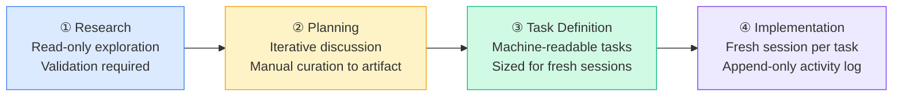

# Front-Load or Fail: The Four-Phase Coding Agent Workflow and Its Codex CLI Implementation


The most common belief about coding agent failures is that they come down to model capability — use a better model and get better results. Research from the Infobip AI team, published at CIKM '26, challenges that assumption directly: "effectiveness on non-trivial tasks depends less on the choice of foundation model than on how practitioners configure the agent's harness."[^1]

Their paper (arXiv:2608.30701, August 2026) presents a four-phase workflow developed through production use of LLM coding agents at scale. The architecture is straightforward: **front-load human effort in the early phases where compounding is dangerous, and delegate progressively as artifacts solidify**. What makes it worth close attention for Codex CLI practitioners is how precisely it maps to the tools already available in the CLI.

## The Compound Error Problem

The paper makes a specific claim about error propagation that runs counter to how most teams operate: upstream mistakes in research and planning compound across later phases, while patching generated code introduces bloat and fragility rather than clean resolution.[^1]

This is the mechanism behind a failure mode most senior developers will recognise. A planning session produces a slightly wrong architectural assumption. The implementation agent builds faithfully on that assumption for several hours. The practitioner notices the issue late, asks the agent to correct it, and gets back a patch layered over the original structure. The codebase now carries both the original mistake and the correction, often with duplicated logic and unclear ownership. Reviewing it costs more time than writing it from scratch would have.

The workflow's answer is not to review implementation more carefully — it is to invest in research and planning with enough rigour that implementation can proceed with minimal human intervention.

## The Four Phases



### Phase 1 — Research

The practitioner and agent explore the problem space together with **access restricted to read operations** — codebase search, documentation retrieval, domain-specific tools. No writes, no environment changes. All findings undergo practitioner validation before moving forward. The output is a curated research document, not a conversation transcript.

Codex CLI mapping:

```bash
# Start a read-only research session with no shell execution approved
codex --approval-policy on-failure
```

Or, for a research profile that enforces read-only constraints via sandbox:

```toml
# ~/.codex/config.toml
[profiles.research]
model = "gpt-5.6-sol"
[profiles.research.sandbox]
writable_roots = []   # no filesystem writes
network = true        # document retrieval allowed
```

Use `/save` or export with `/recap` to produce the research document as a file. The document replaces the conversation as the durable artifact — the session transcript is disposable.

### Phase 2 — Planning

Using the research document as input, planning happens through iterative discussion between practitioner and agent. The paper makes a specific note against using dedicated "planning modes" at this phase: they cause premature finalisation before the approach is properly understood.[^1]

Codex CLI mapping: keep the model in its default mode. Bring in the research document as context, work through the design iteratively, and **manually curate the decisions** into a persistent planning artifact before moving on. Do not rely on the model to summarise the planning session — it will flatten the reasoning.

```bash
# Load research artifact as context, iterate on plan
codex --input-file research-doc.md
```

At the end of planning, write the agreed decisions to a file explicitly. The conversation state is then discarded. A good planning artifact includes the architectural decision record (why alternatives were rejected), not just what was decided.

### Phase 3 — Task Definition

Tasks are defined as **machine-readable units**, each containing:[^1]

- A stable identifier
- Goal statement
- Dependencies (which tasks must complete first)
- Relevant code paths
- Acceptance criteria
- Validation method

Tasks must be sized to complete within a single fresh session. If defining a task requires more context than can fit in the agent's effective operating range, it is split. This sizing constraint is what makes implementation parallelisable and auditable.

Codex CLI mapping — a task registry in AGENTS.md or a companion file:

```markdown
## Task Registry

### TASK-004: Migrate auth middleware to OAuth2
**Status:** pending
**Depends on:** TASK-001, TASK-003
**Paths:** src/middleware/auth.ts, src/routes/login.ts
**Criteria:** All existing session tests pass; new OAuth2 flow passes e2e/auth.spec.ts
**Validation:** `npm test -- --grep auth`
```

The task registry becomes the source of truth across sessions. Codex reads it via AGENTS.md, executes the task, and appends outcomes to an activity log.

### Phase 4 — Implementation

Each task runs in **a fresh session**, provided only with the project-level instructions and the task definition — not the full conversation history from prior phases. The workflow maintains three persistent artefacts:[^1]

1. **Task registry** — status, dependencies, acceptance criteria, outcomes
2. **Append-only activity log** — actions taken, validations run, failures encountered
3. **Git** — code state

Conversation state is explicitly treated as disposable and reconstructible from the above three. This is the inversion of how most teams operate, where the session history is the primary record.

Codex CLI mapping:

```bash
# Launch a fresh implementation session for a specific task
codex --session "TASK-004-auth-migration" \
      --input-file task-004.md \
      --approval-policy untrusted

# Or via codex queue for fire-and-forget dispatch
codex queue --session "TASK-004" --text-file task-004.md
```

Post-task, the agent appends to the activity log via a PostToolUse hook or a final commit message convention. This keeps the record independent of session memory.

## Context Management Strategies

The paper frames context management — not model capability — as the central concern of the workflow.[^1] It draws on Martin's (2025) taxonomy of four strategies:[^2]

```mermaid
quadrantChart
    title Context Management Strategies
    x-axis Internal --> External
    y-axis Active --> Passive
    quadrant-1 Write (external storage)
    quadrant-2 Compress (summarise/prune)
    quadrant-3 Select (retrieval into window)
    quadrant-4 Isolate (split across sessions/agents)
    Write: [0.75, 0.75]
    Compress: [0.25, 0.75]
    Select: [0.25, 0.25]
    Isolate: [0.75, 0.25]
```

| Strategy | Description | Codex CLI mechanism |
|---|---|---|
| **Write** | Persist information outside the context window | `/recap` to file, AGENTS.md, task registry, activity log |
| **Select** | Retrieve only relevant context into the window | `--input-file` per task, targeted `@path` references |
| **Compress** | Retain only required tokens | `tui.auto_recap`, `/recap` before implementation starts |
| **Isolate** | Split context across sessions or agents | Fresh session per task; `codex agents` dashboard for parallel tasks |

Each phase of the workflow applies all four strategies but in different proportions. Research is heavy on **Write** (curating findings) and **Select** (targeted doc retrieval). Implementation is heavy on **Isolate** (fresh sessions) and **Select** (task definition injected, nothing else).

## The Four Failure Modes

The workflow addresses Breunig's (2025) taxonomy of context failure modes[^3] at the phase level rather than reactively:

| Failure mode | Mechanism | Workflow mitigation |
|---|---|---|
| **Distraction** | Over-reliance on accumulated context patterns | Fresh sessions per task; implementation context is task-definition only |
| **Confusion** | Irrelevant content competing for attention | Phase-scoped context; research doc replaces full transcript |
| **Poisoning** | Hallucinations persisting and reproducing across turns | Practitioner validation gate between Research and Planning |
| **Clash** | Contradictory data accumulating across a long session | Planning artifact replaces planning conversation; no half-formed plans in context |

Context poisoning deserves emphasis. The workflow's validation gate between Research and Planning is specifically designed to catch hallucinated facts before they become the basis of an architectural decision. Once a false assumption enters a planning document, it becomes very hard to excise cleanly — the implementation will be built on it.

## Project-Level Instructions

The paper includes an important implementation note about AGENTS.md (or equivalent project-level instruction files): **instruction-following accuracy degrades with instruction count**.[^1] Adding more rules does not produce better adherence; it produces selective adherence and priority conflicts.

The recommended approach is to add targeted single-line corrections when the agent repeats a specific mistake, rather than expanding a general ruleset. Instructions should be as few and as concrete as possible.

```toml
# ~/.codex/config.toml — keep AGENTS.md instructions minimal
# Prefer: "Use snake_case for Rust module files"
# Avoid: exhaustive style guides that the model will partially ignore
```

This is a counterintuitive finding for practitioners who reach for AGENTS.md as a policy document. The practical advice is to treat it as a set of behavioural corrections, each motivated by an observed failure, and to review it periodically for stale entries.

## Open Problems

The Infobip team identifies two unresolved challenges that no current tooling, including Codex CLI, adequately addresses:[^1]

**1. Absence of workflow metrics.** There is no established measure for whether a four-phase workflow is being applied well. Candidate metrics — task success rate per session, instruction correction rate, context utilisation at task completion — are all unexplored in the literature. Teams have no principled basis for comparing their workflow configuration against alternatives.

**2. Component-to-pattern gap.** Research formalises individual context management components (Write, Select, Compress, Isolate) but not the workflow-level patterns practitioners need. Teams lack shared vocabulary for how components combine across phases.

For Codex CLI specifically: `codex agents` provides session visibility and the activity log pattern gives an audit trail, but neither generates workflow-level metrics. A PostToolUse hook that records token usage, validation outcome, and session duration per task would begin to close this gap.

## Summary

The Infobip phased workflow's central claim — that structuring *how* you work with coding agents matters more than which model you choose — is directly applicable to Codex CLI. The four phases map cleanly onto existing CLI primitives: read-only research sessions, iterative planning with manual curation to AGENTS.md artifacts, machine-readable task definitions sized for fresh sessions, and isolated implementation sessions via `codex queue` or `codex exec`. The two unsolved problems (workflow metrics and component-to-pattern vocabulary) represent real gaps that neither the research community nor the tooling has addressed yet.

## Citations

[^1]: Kapetanovic, A., Duricic, T., Mercep, A., & Lacic, E. (2026). *A Phased Workflow for Operating LLM-Based Coding Agents*. arXiv:2608.30701. To appear in Proceedings of CIKM '26. <https://arxiv.org/abs/2608.30701>

[^2]: Martin, L. (2025). *Context engineering for agents*. LangChain Blog. <https://www.langchain.com/blog/context-engineering-for-agents>

[^3]: Breunig, D. (2025). *How Contexts Fail and How to Fix Them*. dbreunig.com. <https://www.dbreunig.com/2025/06/22/how-contexts-fail-and-how-to-fix-them.html>

[^4]: OpenAI. (2026). *Codex CLI v0.153.0 Release Notes*. GitHub. <https://github.com/openai/codex/releases/tag/rust-v0.153.0>

[^5]: OpenAI. (2026). *AGENTS.md reference documentation*. OpenAI Developers. <https://developers.openai.com/codex/reference/agentsmd>
