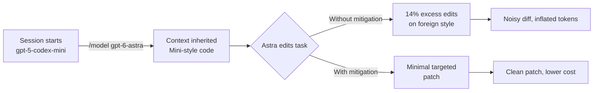

# CROCODIL: The 14% Cross-Model Edit Tax and What It Means for Codex CLI Multi-Model Workflows


## The Problem Nobody Talks About in Mixed-Model Pipelines

Every Codex CLI team that runs subagents at scale eventually hits the same invisible drag: a model tasked with editing another model's code rewrites far more than the task demands. It reformats, renames, restructures — not because it found bugs, but because the code "looks wrong" relative to its training distribution. The result is noisy diffs, inflated token counts, merge conflicts, and review fatigue.

CROCODIL (Cross-model Code Editing with LLMs), accepted at EMNLP 2026 Findings,[^1] is the first systematic study of this phenomenon. The findings are precise and uncomfortable: across 14 of 16 model pairings tested, a model editing foreign code (code originally generated by a different LLM) makes measurably more edits than when editing its own output — up to 14% more by normalised edit distance. Prompt engineering cannot fix it.

## The Experiment

The authors sourced 4,514 Rust pull requests from 356 repositories on GitHub and crates.io.[^1] Each task was scoped to per-function edits on functions of 20–200 non-empty lines, producing 1,881 tasks across five models: Qwen3.5 35B A3B (603 tasks), GPT-OSS 20B (456), Olmo3 7B (79), Olmo3.1 32B (225), and Haiku 4.5 (518).[^1]

The setup mirrors a realistic mixed-model workflow: one model generates the original implementation, a different model receives the function and a change request, and the researchers measure how much of the original function survives the edit.

The core metric is normalised edit distance — min-max scaled across editors per task, so every task contributes equally regardless of function length.

**The finding:** on 14 of 16 model pairings, the editor makes more changes to foreign code than to self-generated code. Seven of those 16 pairs are statistically significant at p < 0.05 by Mann-Whitney U test.[^1] Build success rates across implementor-editor pairs ranged from 28% to 45%, independent of edit volume — meaning excessive edits do not produce functional gains.

### Prompt Engineering Fails

The researchers tested a strict system prompt explicitly instructing each model to make the smallest possible edit. The result: prompt engineering cannot consistently reduce edit size or improve edit success rates on foreign code.[^1]

This is the uncomfortable corollary. You cannot instruct your way out of the problem. A Codex CLI AGENTS.md section that reads "make minimal diffs" has the same failure mode: the model will acknowledge the instruction and then proceed to reformat your Rust trait implementations anyway.

## The CROCODIL Fix: A Multiplicative Reward Function

CROCODIL is a post-training framework. The authors fine-tune Olmo3 7B using GRPO optimisation with LoRA (rank 32, alpha 64).[^1] The reward function is:

```
R_CROCODIL = R_sim × R_exec
```

Where:

```
R_sim  = 1 / (1 + α · D_m / D_h)    α = 0.33
R_exec = 0.2·build + 0.4·pre_tests + 0.4·post_tests
```

`D_m` is the model's edit distance normalised by task size; `D_h` is the human edit distance for the same task from the PR data. The similarity reward penalises deviating from how humans edited comparable functions. The execution reward drives functional correctness — build success counts for 20%, pre-existing tests for 40%, new tests for 40%.[^1]

The multiplicative structure is key: the model cannot trade away edit minimalism for test passage, or vice versa. Both must improve together.

### Results on Olmo3 7B

```mermaid
bar
    title Normalised Edit Distance (Olmo3 7B editor on foreign code)
    x-axis [Implementor]
    y-axis 0 → 0.6
    "Qwen (baseline)" : 0.54
    "Qwen (CROCODIL)" : 0.20
    "Olmo3.1 (baseline)" : 0.48
    "Olmo3.1 (CROCODIL)" : 0.22
```

The normalised edit distance on Qwen-generated code drops from 0.54 to 0.20 — a 62.9% reduction.[^1] Pass rates improve simultaneously: 16.92% → 19.07% on Qwen implementations, 20.00% → 25.33% on Olmo3.1 implementations.[^1] When the CROCODIL-trained model and the baseline both succeed on a task, the CROCODIL model makes smaller edits — confirming the improvement is not an artefact of the model refusing harder tasks.

**Current limitation:** the evaluation is Rust-only and function-scoped. Multi-file edits and Python/TypeScript generalisations are left for future work. Closed-source frontier models (GPT-6-Astra, Sonnet 5) are not evaluated.[^1]

## The Asymmetric Review Companion

A companion paper from July 2026[^2] examines the flip side of the cross-model interaction — review rather than editing — and finds a similarly asymmetric pattern.

Across 116 competitive programming problems from LiveCodeBench, with Claude Opus 4.7 and Codex GPT-5.5:

| Scenario | Pass Rate | Delta |
|---|---|---|
| Codex writes, Claude reviews | 89.7% | +18.1pp |
| Codex writes, Codex self-reviews | 84.5% | +12.9pp |
| Claude writes, Codex reviews | 82.8% | **−8.6pp** |
| Claude writes, Claude self-reviews | 91.4% | 0pp |

Claude reviewing Codex output recovers most of the gap between the two models' solo performance.[^2] Codex reviewing Claude output is actively harmful. The practical implication: when your Codex CLI subagent is writing initial drafts and a higher-capability model is reviewing, that asymmetry works in your favour. Reverse the assignment and you lose ground.

## Mapping to Codex CLI Multi-Model Pipelines

Codex CLI's multi-model architecture as of v0.153.4 (GPT-6-Astra as bundled default)[^3] makes the cross-model edit problem structural, not hypothetical.

### The Standard Subagent Pattern

```toml
# ~/.codex/profiles/mixed-fleet.toml
[subagents.implement]
model = "gpt-5.6-sol"
writable_roots = ["src/"]

[subagents.review]
model = "gpt-6-astra"
approval_policy = "suggest-only"
```

Here the implementor (Sol) and the reviewer (Astra) are different models. When the reviewer's feedback triggers an edit pass, it is working on Sol-generated code. The CROCODIL findings apply directly: Astra will tend to over-edit Sol's implementations beyond what the review comment requires.

### The Mid-Session /model Switch

Since v0.117.0, Codex CLI supports mid-session model switching via `/model`.[^4] When a session begins with a cheaper model and escalates to a frontier model for a hard sub-problem, the frontier model inherits a context full of code shaped by the cheaper model's distribution. The 14% edit-inflation tax applies to every edit pass after the switch.



### Mitigations Available Now

**1. AGENTS.md style contracts with canonical examples**

Prompt engineering cannot close the gap alone, but precise style anchors reduce drift. Instead of prose instructions, provide an idiomatic example of the codebase's conventions directly in AGENTS.md:

```markdown
## Code Style Contract

When editing Rust, preserve the following patterns:
- Error propagation via `?` — never introduce `.unwrap()` or `.expect()`
- Trait objects with `dyn` — do not rewrite to generics
- Module structure: one `pub use` per file, avoid re-exporting internals

### Canonical Example

```rust
pub fn process(input: &str) -> Result<Output, Error> {
    let parsed = parse(input)?;
    Ok(transform(parsed))
}
```
```

**2. PostToolUse hook to gate excessive diffs**

```bash
#!/usr/bin/env bash
# .codex/hooks/post-tool-use/check-edit-size.sh
# Fires after apply_patch; blocks if diff exceeds threshold
if [[ "$CODEX_TOOL_NAME" == "apply_patch" ]]; then
    lines_changed=$(echo "$CODEX_TOOL_OUTPUT" | grep -c "^[+-]" 2>/dev/null || echo 0)
    if [[ "$lines_changed" -gt "${CODEX_EDIT_THRESHOLD:-200}" ]]; then
        echo "Edit size ${lines_changed} lines exceeds threshold. Review before proceeding." >&2
        exit 2
    fi
fi
```

Exit code 2 blocks the agent's next iteration and surfaces the warning as a tool result, giving the model a chance to produce a targeted re-edit.[^3]

**3. Model-aware routing in codex queue**

```json
{
  "tasks": [
    {
      "id": "impl-001",
      "model": "gpt-5.6-sol",
      "prompt": "Implement the parse() function per the spec in AGENTS.md"
    },
    {
      "id": "review-001",
      "model": "gpt-6-astra",
      "depends_on": ["impl-001"],
      "prompt": "Review impl-001 output. Return a PASS/FAIL verdict and a minimal patch if failing. Do not restructure passing code."
    }
  ]
}
```

Keeping the review model's scope explicit — "minimal patch if failing" — narrows the edit surface. It does not eliminate cross-model style inflation, but it reduces the probability of unrequested rewrites by constraining the task framing.[^4]

**4. Separate implementor and editor models to exploit asymmetry**

The cross-model review paper's finding translates directly to pipeline design: route stronger models as reviewers of weaker models' output, not the reverse. In practice this means:

- Sol or mini writes the initial implementation
- Astra reviews and, if needed, patches
- Never route mini to review Astra-generated code

The +18.1pp gain from having the stronger model review is real. The −8.6pp from the reverse assignment is equally real.[^2]

## What CROCODIL Means for Future Codex CLI Tooling

CROCODIL's post-training approach is currently evaluated only at Olmo3 7B scale and on Rust. Its practical applicability to frontier closed-source models in Codex CLI is limited today. What it establishes is the research baseline: the excessive-edit phenomenon is measurable, reproducible, and addressable by targeted RL rather than prompt engineering.

Teams running mixed-model pipelines at scale should treat cross-model edit inflation as a token-cost and diff-quality issue, instrument it with PostToolUse hooks, and design their codex queue task definitions to minimise the edit surface exposed to model switches.

## Citations

[^1]: Unspecified Authors (2026). *CROCODIL: Cross-Model Code Editing with LLMs*. Accepted at EMNLP 2026 Findings. arXiv:2609.03894. <https://arxiv.org/abs/2609.03894>

[^2]: Unspecified Authors (2026). *Cross-Model LLM Code Review: Should you use Claude to review Codex or vice versa?* arXiv:2607.21656. <https://arxiv.org/html/2607.21656v1>

[^3]: OpenAI (2026). *Codex Updates — September 2026*. Releasebot. <https://releasebot.io/updates/openai/codex>

[^4]: Codex Knowledge Base (2026). *Dynamic Session Control in Codex CLI: Mid-Session Switching of Models, Permissions, and Workflow Modes*. <https://codex.danielvaughan.com/2026/04/13/codex-cli-dynamic-session-control-mid-session-switching/>

[^5]: OpenAI (2026). *Codex CLI GitHub Repository*. <https://github.com/openai/codex>
