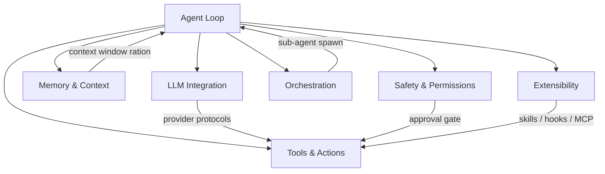
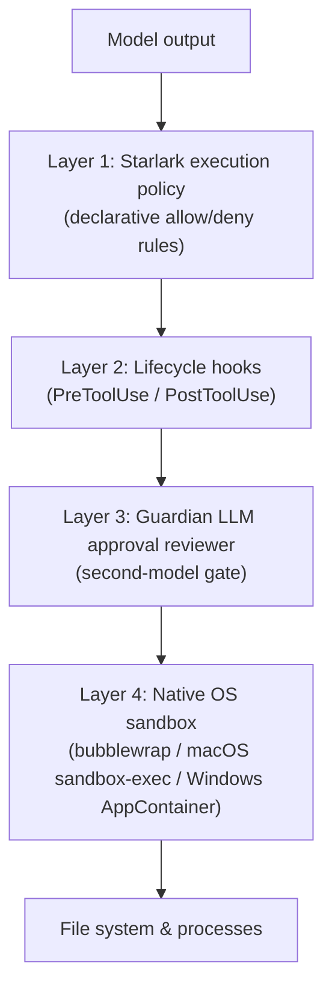

# Harness Engineering: Anatomy, Architecture, and the Seven Subsystems Underpinning Codex CLI


---

A new 83-page source-code audit of eleven production coding harnesses has crystallised something practitioners have sensed for months: the runtime that wraps an LLM is no longer scaffolding — it is the product.[^1] Barbaste, Darrigol, Vu, and Wiltberger analysed roughly four million lines of Python, TypeScript, and Rust across Claude Code, Codex CLI, Gemini CLI, Mistral Vibe, OpenHands, Aider, Mini-SWE-Agent, Hermes, Pi, OpenCode, and OpenClaw, plus the Databricks meta-harness Omnigent as a contrast point.[^1] The result is a taxonomy of seven canonical subsystems, a catalogue of 29 recurring design patterns, and the empirical confirmation of two industry-wide absences that should change how you think about building on top of Codex CLI.

## What a Harness Is

The paper's opening definition is precise: *a harness is the runtime that couples an LLM to the world through a loop, tools, context management, safety controls, orchestration, and extension surfaces.*[^1] Note the absence of "framework" — harness engineering, named as a discipline in early 2026, deliberately excludes third-party orchestration libraries. The twin absences the authors document across all four million lines are striking:

- **No general-purpose agentic framework imports.** Not LangChain, not AutoGen, not LangGraph. Every loop is hand-rolled.
- **No vector-embedding retrieval.** Code search uses ripgrep, tree-sitter, glob, and auto-discovered Markdown files — deterministic tooling throughout.[^1]

These are not gaps; they are choices. Production harnesses optimise for predictability and debuggability over framework flexibility.

## The Seven Canonical Subsystems

Every harness — however large or small — implements the same seven subsystems, ranging from a 5 K-line linear while-loop (Mini-SWE-Agent) to a 1.1 M-line Tokio async state machine (Codex CLI):[^1]



| Subsystem | Minimal implementation | Codex CLI implementation |
|---|---|---|
| **Agent Loop** | Linear `while` (Mini-SWE-Agent) | Tokio async state machine |
| **LLM Integration** | Single LiteLLM call | Server-delivered per-model prompt data |
| **Tools & Actions** | Bash only | 25–30 tools; calls executed as V8-interpreted code |
| **Memory & Context** | Unbounded linear history | Agent-maintained cross-session memory pipeline |
| **Safety & Permissions** | Cost/step limits | Four-layer stack (see below) |
| **Orchestration** | Absent (Aider) | Thread tree: AgentControl + AgentRegistry + SpawnAgentForkMode |
| **Extensibility** | Structural typing | Skills, lifecycle hooks, plugin marketplace, MCP |

The scale differences are dramatic but the subsystem map holds across three orders of magnitude. Critically, the authors found that loop sophistication does not predict benchmark performance — a finding that should temper investment in loop complexity for its own sake.[^1]

## Codex CLI's Four-Layer Safety Stack

The audit gives particular attention to safety architecture. Codex CLI's implementation is the deepest in the corpus:[^1]



The Starlark policy layer enables expressive allow/deny rules without arbitrary code execution. Lifecycle hooks (PreToolUse, PostToolUse) provide the interception points most practitioners already use. The Guardian reviewer adds a model-level second opinion for ambiguous actions. The OS sandbox enforces at kernel level, independent of all three layers above it. Each layer failing independently is the point — defence in depth rather than a single policy gate.[^1]

## The Platform Convergence: SKILL.md, MCP, and ACP

The paper's central thesis — that harnesses completed a *turn from tool to platform* in H1 2026 — rests on three convergence metrics:[^1]

| Extension mechanism | Systems adopting | Notes |
|---|---|---|
| SKILL.md / skills | **9 / 11** | Deferred loading dominant; gating/conditional activation standard |
| Model Context Protocol (MCP) | **8 / 11** | Cross-system extensibility; adopted alongside skills, not replacing them |
| Agent Context Protocol (ACP) | **6 / 11** | New third role: harness *hosting* (OpenHands runs Codex, Claude Code, Gemini CLI as backends) |

Skills edge out MCP in adoption rate. The reason is latent capacity: a skill teaches the agent what it can do without bloating the active context — the agent loads the full SKILL.md only when the skill name is selected as relevant. This is the deferred-loading pattern the audit documents as universal among skill-adopting harnesses.[^1]

ACP's harness-hosting role is the more architecturally significant development. Systems like OpenHands now treat Codex CLI, Claude Code, and Gemini CLI as interchangeable backends behind a unified API surface — exactly the meta-harness model Omnigent formalised when Databricks launched it in June 2026.[^2]

## Longitudinal Convergence in Ninety Days

The paper ran a controlled longitudinal comparison using April 2026 and July 2026 snapshots. Three convergence signals stood out:[^1]

1. **Hook vocabulary cross-pollination.** Codex CLI adopted Claude Code's hook vocabulary verbatim within the 90-day window. Once one major harness stabilises a naming convention, competitors absorb it rather than competing.
2. **Policy migration from prose to configuration.** Behavioural constraints that lived in system prompt prose in April had migrated to structured configuration files by July.
3. **Harness mimicry.** One of the 29 design patterns — *harness mimicry* — describes this convergence: smaller systems replicate the interface conventions of dominant ones to reduce user switching cost.

## The 90-Line Minimum Viable Harness

The paper closes with a 90-line scaffold that implements all seven subsystems in their minimal form:[^1]

```python
# Minimum Viable Harness (condensed from paper's Appendix A)
import asyncio, json
from typing import AsyncIterator

SYSTEM = "You are a coding assistant. Use tools to complete tasks."

async def run_loop(model_fn, tools: dict, max_turns: int = 40, max_cost: float = 5.0):
    history, turns, cost = [], 0, 0.0
    while turns < max_turns and cost < max_cost:
        response = await model_fn(SYSTEM, history)          # LLM Integration
        history.append({"role": "assistant", **response})
        if response.get("stop_reason") == "end_turn":       # Agent Loop stop condition
            break
        for call in response.get("tool_calls", []):
            if call["name"] not in tools:                   # Safety: deny unknown tools
                result = {"error": "unknown tool"}
            else:
                result = await tools[call["name"]](**call["args"])  # Tools & Actions
            history.append({"role": "tool", "name": call["name"], "content": result})
        turns += 1
        cost += response.get("usage", {}).get("cost_usd", 0)
    return history
```

Production harnesses add safety depth, context-window management, orchestration, and extension surfaces on top of this skeleton. The skeleton itself never disappears — it is the invariant centre of all eleven systems the paper analysed.

## What This Means for Codex CLI Practitioners

The audit surfaces three actionable implications:

**1. Understand your subsystem exposure.** When something goes wrong in a Codex CLI session, the seven-subsystem map is your debugging taxonomy. Context failures → Memory & Context subsystem. Unexpected tool execution → Safety & Permissions. Session coordination issues → Orchestration. Naming the subsystem narrows the search space immediately.

**2. Skill-first extensibility beats tool-first.** Skills edge out MCP in adoption precisely because they scale context cost gracefully — the agent infers when to reach for a skill, rather than enumerating every capability upfront. If you are adding capability to a Codex CLI workflow, write a SKILL.md before wiring an MCP server.

**3. The meta-harness layer is production-ready.** Omnigent's existence — and ACP's harness-hosting role in six systems — means treating Codex CLI as a swappable backend is no longer experimental.[^2] Teams building multi-agent pipelines should design against ACP interfaces rather than Codex CLI specifics where portability matters.

The field runs on hand-rolled async loops and deterministic retrieval. That is not a limitation — it is a deliberate engineering decision, replicated independently across ~4 million lines of code by teams that had every framework available and chose none of them.

## Citations

[^1]: Barbaste P, Darrigol T, Vu G, Wiltberger T. "Harness Engineering: Anatomy, Architecture, and Evolution of Coding Agents — A Source-Code Study of Eleven Systems." arXiv:2609.00006, 15 July 2026. <https://arxiv.org/abs/2609.00006>

[^2]: Databricks. "Introducing Omnigent: A Meta-Harness to Combine, Control and Share Your Agents." Databricks Blog, June 2026. <https://www.databricks.com/blog/introducing-omnigent-meta-harness-combine-control-and-share-your-agents>

[^3]: OpenAI Codex CLI releases v0.153.0–v0.153.4. GitHub Releases, September 2026. <https://github.com/openai/codex/releases>

[^4]: Releasebot. "Codex Updates by OpenAI — September 2026." <https://releasebot.io/updates/openai/codex>

[^5]: Software Mansion. "Harness Engineering." Agentic Engineering Guide, 2026. <https://agentic-engineering.swmansion.com/becoming-productive/harness-engineering/>
