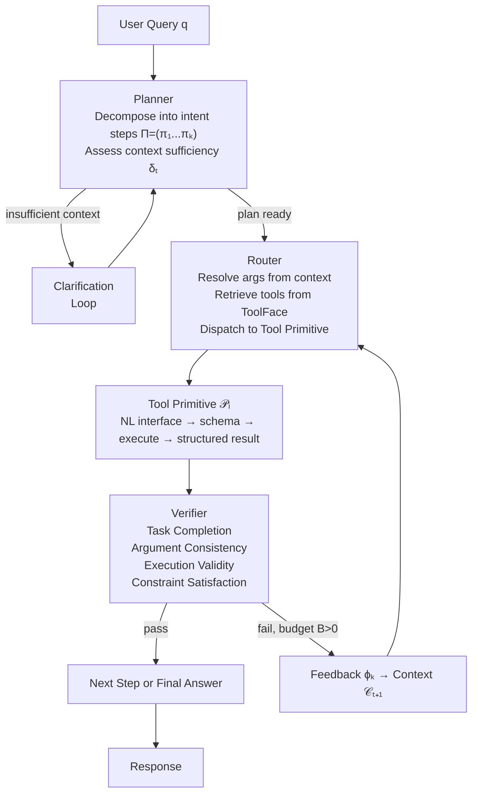

# HEART: Why Natural Language Tool Interfaces Outperform Raw API Schemas — and What It Means for Codex CLI MCP Design


A new paper from Jin, Wang, Yu, Luo, and Wang introduces HEART — *Harness Engineering in LLM Tool Use via Agent-Native Reusable Tool Primitives* — and the results are uncomfortable reading if you have a collection of MCP servers exposing raw JSON schemas to Codex CLI.[^1] On a 50-task real-world evaluation spanning travel, healthcare, e-commerce, finance, and local services, HEART achieves 84% task completion against 20–24% for GPT-5.4, Claude-4.6-Sonnet, and Gemini-3.1-Pro. The 3.8× performance gap does not come from a bigger model: the backbone is Qwen3-8B. It comes from how tools are defined, retrieved, and verified.

---

## The Two Failure Modes the Paper Formalises

Before examining the solution, the failure modes are worth naming precisely.

**Failure mode 1 — Schema brittleness in multi-step reasoning.** When tool outputs must be plumbed into the inputs of downstream tools, the LLM must mentally translate one tool's return schema into another's parameter schema. Benchmark performance on nested API sequences drops to 28% under standard API-schema invocation.[^1] The model is not struggling with reasoning; it is struggling with schema translation.

**Failure mode 2 — Large-catalogue degradation.** As the number of tools in context grows, accuracy drops 7–85% as the tool catalogue scales from 8K to 120K tokens.[^1] Codex CLI users who have accumulated a dozen MCP servers, each exposing tens of tools, are operating at exactly this pressure point. The model is spending attention on raw schema text that could be spent on the task.

---

## Tool Primitives: The Core Abstraction

HEART's primary contribution is *Tool Primitives*, formalised as:

```
𝒫ᵢ(x; c) = ℳ([sᵢ; c; x])
```

Where `x` is a natural language request from an upstream caller, `c` is optional context from a prior primitive's result, `sᵢ` is the tool schema, and `ℳ` is the base LLM. Critically: **the schema `sᵢ` is consumed inside the primitive, not exposed in the orchestrator's input prompt**.

Each Tool Primitive:

- Accepts natural language invocation requests rather than typed parameter dicts
- Internally resolves the schema, executes the function, and returns a structured result
- Enables inter-tool communication through natural language, so nested and multi-turn tool calling requires no explicit schema knowledge in the calling context

The ablation study is unambiguous about where the gains live. Removing Tool Primitives and ToolFace together collapses ToolBench Pass Rate from 75.1% to 16.1% — the largest single degradation in the ablation table.[^1] Removing only the Verifier drops it to 47.6%. Removing only the Planner drops it to 57.2%.

---

## ToolFace: Dynamic Tool Retrieval at Scale

Tool Primitives solve the schema-in-context problem, but only if the right tools are retrieved in the first place. HEART introduces *ToolFace*, a centralised repository of 25,519 schema–function pairs drawn from ToolBench (16,464 live APIs across 49 categories), NESTFUL, τ²-Bench, ACEBench, and BFCLv4.[^1]

At inference time, the Router performs semantic search over ToolFace descriptors and pulls only the tools relevant to the current invocation step. The LLM never sees the full catalogue — it sees a dynamically assembled, task-specific subset.

---

## The HEART Orchestration Loop



The re-planning budget `B` caps retries. Performance saturates at B=3: 47.6% with no re-planning, 65.9% at B=2, 75.1% at B=3, 75.3% at B=5.[^1] The second round (B=1→B=2) delivers the largest increment, suggesting the majority of recoverable failures resolve within two re-planning cycles.

---

## Benchmark Numbers

### Real-World Task Evaluation (50 tasks across 5 domains)

| Domain | HEART (Qwen3-8B) | GPT-5.4 | Claude-4.6-Sonnet | Gemini-3.1-Pro |
|---|---|---|---|---|
| Finance | **100%** | 30% | 30% | 30% |
| Travel Planning | **80%** | 20% | 20% | 10% |
| E-commerce | **80%** | 10% | 10% | 20% |
| Local Services | **90%** | 20% | 30% | 20% |
| Healthcare | **70%** | 20% | 30% | 30% |
| **Overall** | **84%** | 20% | 24% | 22% |

### Benchmark Suite Results

| Benchmark | Metric | HEART | Best Baseline | Δ |
|---|---|---|---|---|
| ToolBench | Pass Rate | 75.1% | 73.4% (Claude-4.6) | +1.7pp |
| NESTFUL | Full Accuracy | 0.47 | 0.42 (GPT-5.4) | +12% |
| τ²-Bench Retail | Pass₄ | 0.73 | 0.60 (Claude-4.6) | +22% |
| τ²-Bench Airline | Pass₄ | 0.63 | 0.51 (Claude-4.6) | +24% |
| τ²-Bench Telecom | Pass₄ | 0.50 | 0.33 (Claude-4.6) | +52% |
| ACEBench | Overall | 86.9% | 86.0% (GPT-5.4) | +0.9pp |

HEART consumes ~22,367 tokens per task (versus ~7,762 for GPT-5.4) but costs $0.0157 per task versus $0.1164 — a 7.4× reduction — because Qwen3-8B's $0.18/$0.70 per-million-token pricing dominates.[^1] The 85% cost reduction figure cited in the abstract refers to this ratio.

---

## The Security Dividend: 0% Prompt Injection ASR

This finding deserves its own heading. Evaluated against ToolHijacker on ToolBench:[^1]

| Model | Gradient-Free ASR | Gradient-Based ASR |
|---|---|---|
| GPT-5.4 | 82.2% | 70.6% |
| Claude-4.6-Sonnet | 74.4% | 66.0% |
| Gemini-3.1-Pro | 78.8% | 72.2% |
| **HEART** | **0.0%** | **0.0%** |

The 0% ASR is structural, not the result of defensive prompting. Tool schemas are stored in ToolFace and invoked via Tool Primitives; they never appear in the orchestrator's input prompt.[^1] An injected schema in a malicious tool result has no surface to attach to — the Verifier evaluates the result, not the schema.

---

## Mapping HEART Principles to Codex CLI

Codex CLI does not implement HEART. But several of HEART's design principles have direct analogues in current Codex tooling, and the paper's findings suggest concrete changes to how you configure and expose tools.

### Principle 1 — Prefer natural language in AGENTS.md tool sections

HEART demonstrates that schema-in-prompt degrades performance as catalogue size grows. Codex CLI exposes MCP tool schemas to the model via system context. You can push back against this by writing explicit tool guidance in AGENTS.md that gives the model natural language descriptions of *when* and *how* to use each tool, reducing dependence on raw schema parsing:

```markdown
## Tool Usage Policy

### search_codebase
Use to find symbol definitions, grep for patterns, or locate files.
Do NOT use it to check file existence — use read_file for that.
Returns: list of {file, line, snippet}.

### apply_patch
Use for all file modifications. Pass a unified diff.
```

This mirrors the Tool Primitive pattern: the model receives natural language guidance that supplements the raw schema, reducing attention spent on parameter parsing.

### Principle 2 — Cap catalogue exposure with `output_token_limit`

Codex CLI v0.152.0 introduced per-tool `output_token_limit` configuration.[^2] This is a direct mechanism for managing the large-catalogue degradation problem HEART documents. Verbose tools that return oversized JSON blobs compete with task-relevant context:

```toml
[mcp_servers.my_analytics_server.tools.get_full_report]
output_token_limit = 2000

[mcp_servers.my_analytics_server.tools.get_summary]
output_token_limit = 500
```

The hook fires before the truncated result is prepared for the model, so a PostToolUse hook can inspect or rewrite the result before truncation is applied — a partial analogue to HEART's Verifier evaluating results before they re-enter context.

### Principle 3 — Verifier via PostToolUse hooks

HEART's Verifier evaluates results against four criteria: task completion, argument consistency, execution validity, and constraint satisfaction. PostToolUse hooks implement the same pattern in Codex CLI. Exit code 2 blocks the result from the agent and triggers a retry, replicating HEART's `{fail → feedback → re-plan}` loop:

```json
{
  "postToolUse": [
    {
      "name": "verify-tool-result",
      "type": "command",
      "command": ["/usr/local/bin/verify-result.sh"],
      "match": { "tool": "bash" }
    }
  ]
}
```

The verify script checks execution validity (non-zero exit) and task completion (empty output) and emits exit code 2 on failure, which Codex treats as a retriable error. The re-planning budget B=3 maps naturally to this cycle: HEART saturates at three re-plan rounds, and AGENTS.md can specify equivalent retry ceilings per task type.

### Principle 4 — Dynamic tool retrieval via the Plugin Marketplace CLI

HEART's ToolFace provides dynamic tool retrieval — the right subset of tools for the current task, not the full catalogue. Codex CLI v0.153.0 shipped plugin CLI marketplace support, enabling dynamic installation and removal of plugins from remote catalogues.[^3] In practice this enables task-scoped tool loading:

```bash
# Load analytics tools for this session
codex plugin install marketplace:analytics-suite

# Run the task
codex --input-file task-analytics.md

# Remove after session
codex plugin remove analytics-suite
```

This approximates ToolFace's per-inference retrieval at session granularity. The `/plugins` command in TUI organises remote plugins into curated, workspace, and shared sections, allowing the model to reason about available tool namespaces rather than enumerating raw schemas.

### Principle 5 — Planner mapping to Codex plan mode

HEART's Planner decomposes queries into ordered invocation steps and assesses context sufficiency before committing to execution. Codex CLI plan mode (`Shift+Tab`) serves this role: the model produces a structured plan, you review it, and tool use begins only on approval. The Planner's clarification loop maps directly to the `ask` approval policy in AGENTS.md.

---

## Limitations and Open Questions

HEART uses Qwen3-8B as its backbone throughout. The 85% cost reduction is contingent on a small, cheap model doing the Tool Primitive wrapping — a different cost calculus applies if you run o3 or GPT-6-Astra as the primitive executor.[^1] The 0% prompt injection ASR is a structural property of the architecture, but it requires full control over tool schema exposure; MCP servers that return schema descriptions in their result payloads reintroduce attack surface.

The ToolFace repository (25,519 tools) is a research artefact, not a production system. Building an equivalent for a team's internal tooling — with version control, access policies, and drift detection — is non-trivial. The Codex CLI plugin marketplace is the closest current analogue, and it operates at coarser granularity (plugins, not individual functions).

---

## Citations

[^1]: Jin, H., Wang, S., Yu, X., Luo, H., & Wang, H. (2026). *Harness Engineering in LLM Tool Use via Agent-Native Reusable Tool Primitives*. arXiv:2609.01736. <https://arxiv.org/abs/2609.01736>

[^2]: OpenAI. (2026, September 1). *Codex CLI v0.152.0 release notes — per-tool MCP output token limits, planning tool opt-in*. GitHub. <https://github.com/openai/codex/releases/tag/rust-v0.152.0>

[^3]: OpenAI. (2026, September 3). *Codex CLI v0.153.0 release notes — plugin CLI marketplace support, Vim undo/redo*. GitHub. <https://github.com/openai/codex/releases/tag/rust-v0.153.0>

[^4]: ToolBench benchmark: Qin, Y., et al. (2024). *ToolLLM: Facilitating Large Language Models to Master 16000+ Real-world APIs*. ICLR 2024. Referenced via HEART evaluation. <https://arxiv.org/abs/2307.16789>

[^5]: τ²-Bench: Zhang, S., et al. (2025). *τ²-Bench: Benchmarking Tool-Agent-User Interaction in Real-World Domains*. Referenced via HEART evaluation. <https://arxiv.org/abs/2406.12045>
