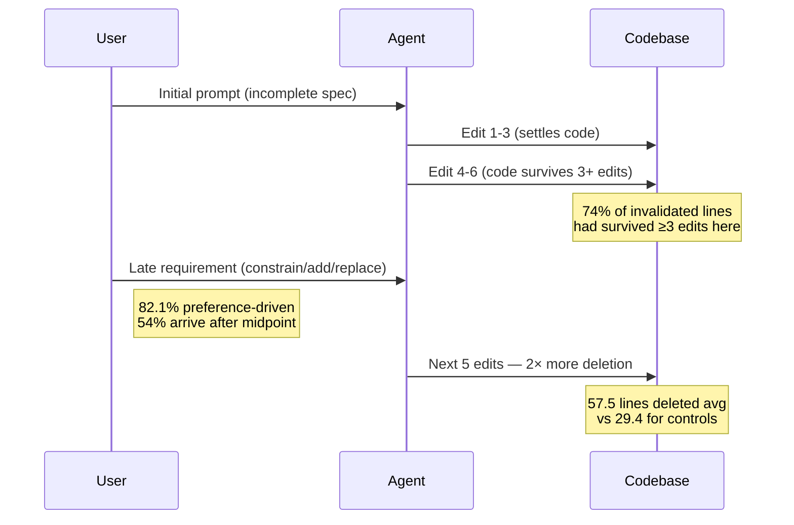
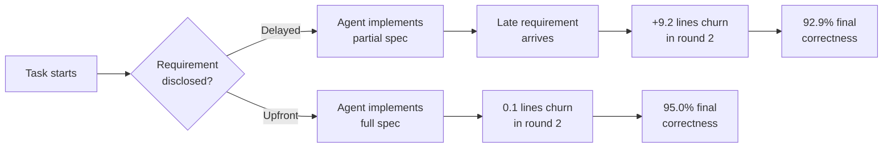

# The 2× Rework Tax: Late-Arriving Requirements and Code Invalidation in Coding-Agent Sessions


A new empirical study by Jiang, Cheng, Fu, Koziolek, Li, and Zhang (Karlsruhe Institute of Technology / Waseda University / Adelaide University, arXiv:2609.03028) quantifies something practitioners already suspect but have rarely measured: when users articulate requirements *after* a coding agent has already started editing, the resulting rework is roughly twice as expensive as matched non-requirement edits.[^1] The study mines 3,553 real-world sessions from the SWE-chat corpus[^2] and runs two controlled experiments to isolate the causal mechanism, producing the most rigorous measurement of late-requirement cost in the coding-agent literature to date.

## The Dataset and Methodology

The SWE-chat corpus[^2] is a collection of opt-in sessions gathered via Entire.io, a CLI shim that logs coding-agent interactions with full conversation transcripts, tool calls, and line-level attribution of human versus agent-authored code. The Jiang et al. study started from 5,851 sessions linked to Git repositories, filtered to 3,553 eligible sessions based on operation-recovery fidelity (≥90%), and reconstructed intermediate file states by replaying recorded file-writing operations. This replay step is what makes the analysis tractable: rather than relying on final diffs, the researchers can observe what the agent had written at the precise moment a new requirement arrived.

Requirement segmentation used a two-model pipeline (GPT-5.6-Sol and Claude Sonnet 5) with adjudication on disagreements. The interrater reliability figures are honest about the task's difficulty — unit-detection agreement reached α=0.65, AC1=0.80, with stronger agreement on the destructive-operation dimension (AC1=0.89) than on fine-grained trigger categories (AC1=0.65). Each detected requirement event was matched to up to three pseudo-events (non-requirement edits in the same session) controlling for the pre-event live-line count. Inference used repository-clustered bootstrap intervals across 2,000 draws to avoid session-level pseudoreplication.

## The Core Finding: 1.96× Invalidation Ratio

The primary result is sharp. Requirement arrivals after implementation begins trigger a **canonical invalidation ratio of 1.96** (95% CI [1.31, 2.82]) — that is, agent-written lines deleted or replaced in the five edits following a late requirement are almost twice as numerous as those deleted following matched non-requirement edits.[^1]

In absolute terms: **57.5 lines** invalidated after requirement events versus **29.4 lines** after controls, a mean difference of +28.2 lines ([+10.1, +44.4]). The pipeline-specific ratios are consistent: 2.06 for GPT-5.6-Sol sessions and 2.06 for Sonnet sessions. Three robustness checks preserve the direction and magnitude — a conservative net-deletion measure (movement and reindentation immune) yields ratio 2.28, non-overlapping event analysis yields 1.82–1.67, and a Mahalanobis rematch tightens the estimate to 1.66 but leaves the lower confidence bound just short of 1.0.

The settled-code diagnostic is notable: **74% of invalidated lines had survived at least three prior edits**. The agent had written, kept, and presumably integrated that code — and then it was deleted because the user said something new. This is not churn from the agent changing its mind; it is stable agent output overturned by information the user held but did not surface until late.



## Taxonomy of Late Requirements

The study codes each requirement event on three dimensions:

**Relation to prior specification:**
- **Neutral** (no logical entailment or contradiction): 89.3% of events
- **Contradicts** (logically incompatible with prior spec): 10.7%

**Operation type** (resolved cases, n=698):
- Constrain: 340 events (48.7%) — the user narrows the solution space *after* the agent has already committed to an implementation
- Add: 224 events (32.1%) — genuinely new functionality
- Replace: 66 events (9.5%)
- Remove: 64 events (9.2%)
- Relax: 4 events (0.6%)

**Trigger** (resolved cases, n=730):
- **Preference**: 599 events (82.1%) — the user chose not to say this upfront, not because they lacked the information
- Implementation feedback: 117 events (16.0%) — the user saw the partial output and reacted
- External: 14 events (1.9%)

The dominance of *preference* as a trigger is the finding that most directly implicates session design. These are not requirements the user could not have stated — they are requirements the user *did not state*, typically because the interaction model did not prompt for them. The coding agent's eager-implementation pattern, beginning file edits within the first few turns, forecloses the requirement-gathering window that would exist with a human collaborator.

## Timing: 54% Arrive After the Session Midpoint

Late requirement arrivals are distributed throughout sessions rather than clustered at any particular point, with 54% occurring after the session midpoint. The mean edit index for emergence events is approximately 27.9 edits into the session. Proportional disruption (the fraction of recently-written lines deleted) declines as the codebase grows, but **absolute invalidation does not reliably decline** — a late-session requirement that touches a core module can still delete dozens of lines.

Observable-window analysis for the timing comparison is inconclusive (late-to-early ratio 1.19, CI [0.87, 1.64]), but a post-hoc complete-window analysis restricted to events with full five-edit follow-up shows late events carry greater burden (ratio 1.48, CI [1.10, 1.99]).

## Controlled Experiment: The Cost of Delayed Disclosure

Study 2 ran 200 controlled execution pairs (25 tasks × 2 agents × 2 seed replicates × 2 arm configurations) to test whether *when* a requirement is revealed causally affects rework. Experiment E1 compared upfront versus delayed disclosure of an additional constraint:

- Round-2 churn (the round when the delayed arm received the withheld constraint): **0.1 lines** (upfront arm) vs **9.3 lines** (delayed arm), difference +9.2 ([+6.4, +12.8]).[^1]
- Cumulative two-round churn was *lower* under delay for one agent (−4.4 lines for GPT-5.6-Sol) — the agent in the upfront arm partially over-implemented the constraint speculatively
- Final test correctness: 95.0% upfront versus 92.9% delayed — a small correctness penalty attributable to the rework overhead

Experiment E2 tested whether an advance warning ("a constraint will be disclosed next round") reduced rework. The result was inconclusive (difference +0.16 lines, CI [−0.56, +1.06]), suggesting that awareness of a forthcoming constraint does not help agents stage their work to minimise later disruption.



## Prevalence: 18–22% of Sessions

Between 18% and 22% of clean-start sessions in the SWE-chat corpus contained at least one detected emergence event under the study's definition. Given the prevalence of vibe-coding workflows in the corpus (41% of sessions have agents author virtually all committed code[^2]), these figures likely understate the phenomenon in sessions where the user is more passive and requirements arrive even more gradually.

## Codex CLI Implications

The study does not test Codex CLI specifically — it uses the SWE-chat corpus, which covers multiple agents — but its findings translate directly into concrete harness-level responses.

### Plan Mode as a Requirements Gate

Codex CLI's plan mode (`/plan` or `Shift+Tab`) is the primary mechanism for deferring implementation until the requirement surface has been explored.[^3] The study's E1 data supports using plan mode proactively rather than waiting for ambiguity to become apparent: a constraint withheld until round 2 added 9.3 lines of churn versus 0.1 when disclosed upfront.

Encoding requirement-elicitation behaviour into `AGENTS.md` ensures it persists across sessions:

```markdown
## Task Acceptance Policy

Before editing any file, confirm the following are explicitly stated in the task:
- [D] Desired behaviour: what the code should do after the change
- [C] Constraints: performance, API surface, backwards-compatibility scope, style limits
- [M] Motivation: why this change is needed now

If any field is absent, ask for it before proceeding.
```

### PreToolUse Hook as a Hard Gate

A `PreToolUse` hook can enforce the policy at the tool-call level, preventing file edits until the requirement record is present. The hook exits with code 2 (block and explain) if the AGENTS.md task header lacks a `[C]` (Constraints) field — the most commonly late-arriving requirement type (48.7% of emergence events are Constrain operations):

```toml
# ~/.codex/hooks.json
[[hooks]]
event = "PreToolUse"
matcher = "apply_patch|write_file|str_replace"
command = "bash -c 'grep -q \"\\[C\\]\" AGENTS.md || { echo \"Constraints not declared — add [C] field before editing\"; exit 2; }'"
```

This is a blunt instrument but one grounded in the study's data: constraints are the dominant late-arriving requirement type, and they are 82.1% preference-driven, meaning the user almost always *could* have provided them.

### startup\_prompt\_template for Requirement Elicitation

The `startup_prompt_template` configuration key injects text into every session's initial system context. Use it to prime the agent for active requirement elicitation:

```toml
# ~/.codex/config.toml
[profiles.default]
startup_prompt_template = """
Before writing any code, identify whether the task has explicitly stated:
1. Desired behaviour (what changes and how it should work)
2. Constraints (what must not change, performance bounds, API compatibility)
3. Out-of-scope items (what this task explicitly does not cover)

If any of these are absent, ask for them. Do not begin editing until all three are confirmed.
"""
```

### codex queue JSON Format

When queuing tasks for batch or CI execution, use a structured JSON format that makes the constraint field mandatory at parse time:

```json
{
  "id": "TASK-042",
  "goal": "Add pagination to the user listing endpoint",
  "desired_behaviour": "GET /users returns max 50 items; includes next_cursor in response",
  "constraints": "Must not change response schema for existing fields; no new DB migrations",
  "out_of_scope": "Front-end pagination controls are handled in a separate task"
}
```

Codex CLI's `--text-file` flag can accept this format when passed through `codex queue`, keeping the requirement record machine-readable and version-controlled alongside the task.

## Limitations and Caveats

The study's authors are careful about what the data can and cannot show. The invalidation measure is an upper bound — formatting commits and file renames can present as false deletions, and the line-level precision on the validation set was 0.40. The matched analysis after Mahalanobis rematch weakens the estimate to 1.66 (CI [0.97, 2.71]), just touching 1.0 at the lower bound. The E2 result (advance warning) was genuinely inconclusive, which matters: agents cannot currently restructure their implementation to hedge against disclosed forthcoming constraints.

The 18–22% prevalence figure applies to the SWE-chat corpus specifically, which skews toward open-source developers using Claude Code, Codex, and Gemini CLI on public repositories. Internal enterprise sessions, where task specifications are typically less complete, may show higher prevalence.

## Summary

For practitioners designing Codex CLI workflows, the study provides an empirical foundation for two intuitions that were previously just rule-of-thumb:

1. **Require requirements before code.** The 2× rework multiplier and the 74% settled-code invalidation rate establish that eager implementation is not free. Plan mode and requirement-gate hooks are not bureaucracy — they are measurable cost reduction.

2. **Constrain is the most common late-arriving type.** When users add constraints after implementation has begun (48.7% of emergence events), they are typically narrowing something the agent already decided. The agent's initial decision was not wrong — the user just had not said it yet. Surfacing constraints at session start (via AGENTS.md templates or startup prompts) eliminates the most prevalent rework trigger.

## Citations

[^1]: Jiang B, Cheng H, Fu Y, Koziolek A, Li J, Zhang W. "Requirements After the First Edit: Mining Late Requirement Emergence and Rework in Real-World Coding-Agent Sessions." arXiv:2609.03028. September 2026. <https://arxiv.org/abs/2609.03028>

[^2]: Antoniades A et al. "SWE-chat: Coding Agent Interactions From Real Users in the Wild." arXiv:2604.20779. April 2026. <https://arxiv.org/abs/2604.20779>

[^3]: "Planning Mode in Practice: When to Use It and When to Skip It." Codex Knowledge Base. March 2026. <https://codex.danielvaughan.com/2026/03/27/planning-mode-in-practice/>

[^4]: "OpenAI Codex Best Practices for 2026: Workflows, Governance, and Multi-Provider Routing." Maxim AI. 2026. <https://www.getmaxim.ai/articles/openai-codex-best-practices-for-2026-workflows-governance-and-multi-provider-routing/>

[^5]: Kim J et al. "RealSWE: A Compositional Evaluation of Coding Agents under Realistic User Requests." arXiv:2608.27831. August 2026. <https://arxiv.org/abs/2608.27831>
