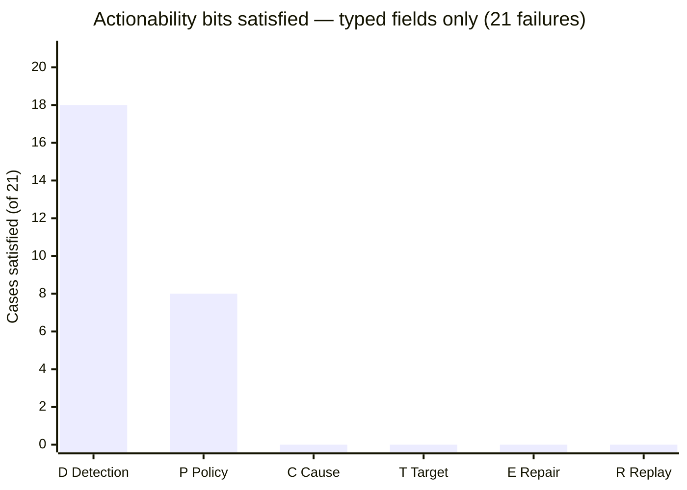

# MCP Error Actionability: Why `isError:true` Is Not Enough and How Codex CLI Closes the Gap


A coding agent that can detect a tool failure is not the same as one that can recover from it. Rishabh Mehan's "Can MCP Clients Decide What to Do After Failure? A Result-Only Actionability Audit" (arXiv:2609.00072, August 2026)[^1] probes exactly this gap: given only the completed MCP result object — no request arguments, no schema, no application context — how much recovery can a client actually perform? The answer is sobering, and it maps directly onto decisions you make when configuring Codex CLI's `on_mcp_tool_result` hook.

## The Six-Part Actionability Profile

Mehan formalises recovery capacity as a tuple **a(o) = (D, P, C, T, E, R) ∈ {0,1}⁶** applied independently to each observed failure result[^1]:

| Bit | Name | Question answered |
|-----|------|-------------------|
| **D** | Detection | Does the client distinguish failure from success? |
| **P** | Coarse Policy | Can it select among: repair, auth, retry-later, alternate, stop? |
| **C** | Cause/Subtype | Can it distinguish unknown-tool vs bad-type vs rate-limit vs upstream? |
| **T** | Repair Target | Does it know which tool, parameter, credential, or dependency to fix? |
| **E** | Executable Repair | Can it construct the replacement request without guessing? |
| **R** | Replay Constraints | Does it know replay timing, safety, and committed side-effects? |

D and P are coarse — they tell you *something is wrong* and *broadly what class of response makes sense*. C through R are what actually drive deterministic recovery: they identify the offending value, tell you how to fix it, and confirm whether retrying the same request is safe.

## What the Audit Found

Mehan induced 21 safely-controlled failures across 10 live MCP servers drawn from a 23,569-record registry snapshot[^1]. The failures comprised 10 nonexistent-tool calls, 7 invalid argument types, 3 invalid values, and 1 authentication failure — mapped to 8 protocol errors, 10 `isError` results, and 3 success-shaped errors (non-zero exit but no error flag).



The control view — typed fields alone — scores D=18, P=8, C=0, T=0, E=0, R=0[^1]. A content-assisted view (allowing the client to read prose in the `content` array) recovers C to 19 and T to 18, but **E and R remain zero in both views**. No single observation in the study provided a complete replacement request, explicit retry timing, unchanged-request safety assurance, or side-effect state.

The lexical source audit reinforces this: 16 `isError` construction paths were found across 10 sampled repositories; 12 unique semantic paths collapsed to 7 prose-only patterns and 5 mixed JSON-in-text patterns[^1]. None provided a standard action code. The MCP protocol's `isError: true` flag is a presence/absence marker, not an error taxonomy.

## The Prose Dependency Problem

The content-assisted view's gains reveal the real failure mode: **cause and target information exists in prose, not in typed fields**. The model can usually infer what went wrong by reading the `text` content block — but now the recovery path runs through unstructured natural language, making it model-dependent, non-deterministic, and untestable.

Mehan's exploratory policy-selection test (840 decisions across two small local models) quantifies this. Llama 3.2 3.2B achieved 42/105 strict matches on normalised results but 105/105 when prose explicitly named the recovery action[^1]. Qwen 0.8B scored 6/105 on normalised and 30/105 on prose. The gap between models is large; neither is reliable enough for production recovery logic.

The conclusion the paper draws is precise: **"Do not ask one error string to serve both software and people."**

## The Fail-Closed Prototype

Mehan proposes a two-plane architecture that separates machine-readable control from human-readable content. The structured error envelope looks like this[^1]:

```json
{
  "resultType": "complete",
  "isError": true,
  "error": {
    "schema": "urn:example:mcp-error:1",
    "code": "example.mcp.arguments.invalid_type",
    "target": { "kind": "parameter", "pointer": "/walletAddress" },
    "policy": "revise_arguments",
    "retry": { "sameRequest": "unsafe" },
    "sideEffects": "none_committed"
  },
  "content": [{ "type": "text", "text": "walletAddress must be a string." }]
}
```

The `error` block covers bits C (code discriminates cause subtype), T (target identifies the parameter by JSON Pointer), P (policy names the recommended action class), and R (retry and sideEffects make replay safety explicit). Bit E remains absent — the client still has to construct the corrected value — but everything else is machine-readable and model-independent.

This prototype validated all 21 counterfactual controls as designed[^1]. It is not a proposed MCP specification amendment; it is a demonstration that the information gap is bridgeable with a thin schema layer.

## Codex CLI's Recovery Surface

Codex CLI v0.148.0 introduced the `mcp_tool` handler type, giving hooks first-class access to MCP server tools[^2]. Codex CLI v0.151.0 added the ability for extensions to inspect or replace MCP tool results before they reach the model (PR #41202), and preserved structured MCP tool and resource errors in responses (PR #41196)[^3].

These two capabilities together give you the primary recovery surface: the `PostToolUse` hook on any MCP server call, reading `tool_output` to check `isError` and acting before the agent sees the result.

### Pattern 1 — Typed-field triage with prose fallback

For MCP servers you do not own (and cannot retrofit with a structured error envelope), a hook can parse the typed fields first and fall back to a regex scan of the prose content:

```toml
# ~/.codex/config.toml
[hooks.PostToolUse]
[[hooks.PostToolUse]]
matcher = "mcp:*"           # all MCP tool calls
command = "codex-mcp-triage"
timeout = 10
```

```bash
#!/usr/bin/env bash
# codex-mcp-triage — on stdin: PostToolUse JSON payload
input=$(cat)
is_error=$(echo "$input" | jq -r '.tool_output.isError // false')

if [ "$is_error" != "true" ]; then exit 0; fi

# Try typed fields first (bits D+P available)
code=$(echo "$input" | jq -r '.tool_output.error.code // empty')

if [ -n "$code" ]; then
  # Structured: emit systemMessage with cause code for the agent
  jq -n --arg code "$code" '{"systemMessage": ("MCP error code: " + $code + " — consult AGENTS.md tool-error policy")}'
else
  # Prose fallback: surface the text block verbatim
  prose=$(echo "$input" | jq -r '.tool_output.content[0].text // "unknown error"')
  jq -n --arg prose "$prose" '{"systemMessage": ("MCP prose error (unstructured): " + $prose)}'
fi
```

### Pattern 2 — Replay safety gate

When `sameRequest: "unsafe"` is absent from the error envelope, you cannot know whether retrying is safe. A PreToolUse hook can enforce a one-retry ceiling and log the attempt[^2]:

```toml
[[hooks.PreToolUse]]
matcher = "mcp:*"
command = "codex-retry-gate"
timeout = 5
```

```bash
#!/usr/bin/env bash
# codex-retry-gate — block a second attempt on the same (server, tool, args) triple
input=$(cat)
server=$(echo "$input" | jq -r '.tool_name' | cut -d: -f1)
tool=$(echo "$input" | jq -r '.tool_name' | cut -d: -f2)
args_hash=$(echo "$input" | jq -c '.tool_input' | sha256sum | cut -c1-16)
key="$server:$tool:$args_hash"
lock="/tmp/codex-mcp-retry-$key"

if [ -f "$lock" ]; then
  rm "$lock"
  jq -n '{"permissionDecision": "deny",
          "systemMessage": "MCP retry blocked: replay safety unknown. Add explicit retry logic or switch to an alternate tool."}'
  exit 0
fi

touch "$lock"
exit 0
```

### Pattern 3 — Retrofitting servers you own

For MCP servers under your control, emit the structured error envelope directly. In Python:

```python
# In your MCP tool handler
from mcp.server import MCPError

def call_tool(name: str, arguments: dict):
    if arguments.get("walletAddress") is None:
        raise MCPError(
            code="example.mcp.arguments.missing",
            target={"kind": "parameter", "pointer": "/walletAddress"},
            policy="revise_arguments",
            retry={"sameRequest": "unsafe"},
            sideEffects="none_committed",
            message="walletAddress is required and must be a non-empty string.",
        )
```

This turns your server's errors from P-only (coarse policy only) to C+T+P+R, giving Codex CLI's hook chain enough signal to act deterministically.

## AGENTS.md Error Policy Declaration

The study found that recovery decisions that rely on prose are model-dependent — Qwen and Llama diverge significantly. Declaring your tool error policy in `AGENTS.md` moves at least some of the C→P mapping out of inference and into deterministic lookup:

```markdown
## MCP Tool Error Policy

| Error code prefix | Action |
|---|---|
| `*.arguments.*` | Revise the argument; do not retry with identical input |
| `*.auth.*` | Stop and ask the user to re-authenticate |
| `*.rate_limit` | Pause 30 s, then retry once |
| `*.upstream.*` | Log and skip; mark task as blocked |
| (no code, isError:true) | Surface prose to the user; do not auto-retry |
```

## The Broader Pattern

Mehan's core finding is that the MCP protocol's current error surface covers detection reliably and coarse policy partially, but provides no standard path to bits C, T, E, or R[^1]. The MCP 2026-07-28 specification finalised paginated discovery, multi-round requests, and non-blocking startup[^4], but did not amend error message structure — the gap documented in arXiv:2609.00072 applies to all protocol versions in the audit (2025-03-26 through 2026-07-28).

For Codex CLI operators, the practical takeaway is a layered stance: use `on_mcp_tool_result` hooks to triage structured errors where available, surface prose explicitly where not, enforce replay-safety gates, and retrofit owned servers with the two-plane envelope pattern. Detection is free; recovery has to be engineered.

## Citations

[^1]: Mehan, R. "Can MCP Clients Decide What to Do After Failure? A Result-Only Actionability Audit." arXiv:2609.00072, August 31, 2026. <https://arxiv.org/abs/2609.00072>

[^2]: "Async Hooks and MCP Tool Hooks in Codex CLI v0.148.0." Codex Knowledge Base, August 25, 2026. <https://codex.danielvaughan.com/2026/08/25/codex-cli-v0148-async-hooks-mcp-tool-hooks-background-execution-mcp-integration/>

[^3]: OpenAI. "Codex CLI v0.151.0 Release Notes." GitHub, 2026. <https://github.com/openai/codex/releases/tag/rust-v0.151.0>

[^4]: Model Context Protocol. "The 2026-07-28 Specification." MCP Blog, July 28, 2026. <https://blog.modelcontextprotocol.io/posts/2026-07-28/>

[^5]: "MCP Debugging and Diagnostics in Codex CLI: The Complete Troubleshooting Guide." Codex Knowledge Base, April 24, 2026. <https://codex.danielvaughan.com/2026/04/24/codex-cli-mcp-debugging-diagnostics-troubleshooting-guide/>
