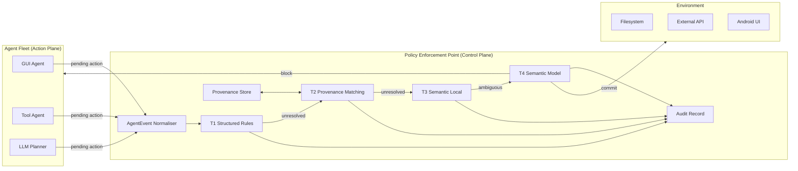
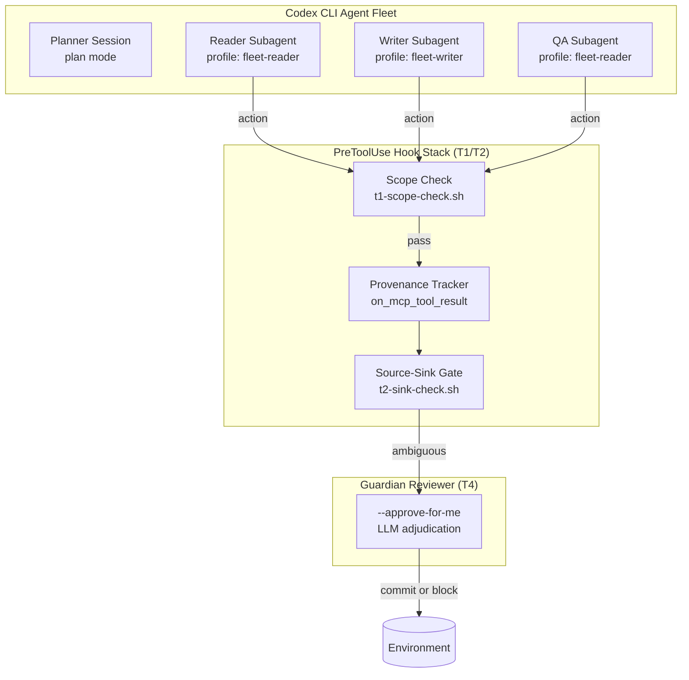

# OpenAgentFlow: Centralised Action Governance for Heterogeneous Agent Fleets — and What It Means for Codex CLI


As coding-agent deployments scale from a single terminal session to fleets of concurrent subagents spanning GUI, API, and shell execution paths, the naïve approach of embedding safety checks inside each individual agent collapses under its own contradictions. Every agent has its own prompt-level guardrails, its own tool restrictions, its own escape hatch for edge cases. The result is a patchwork of policies that drift apart under operational pressure, overlap in ways that waste tokens, and silently contradict each other when one agent's permitted output becomes another's restricted input.

OpenAgentFlow (arXiv:2609.00015)[^1] attacks this problem from first principles: treat agent safety as **system-level action governance** rather than per-agent prompt engineering. The framework establishes a single enforcement boundary — the action-commit interface — at which every action, regardless of its origin or execution channel, is normalised, evaluated against policy, and either committed or blocked. The result is 97.62% accuracy and 96.59% unsafe-action recall on the 1,220-case AgentDojo-Traj split of TS-Bench[^1], a +5.90 percentage point improvement over the prior state of the art, with a 1.96% safe false-intervention rate.

## The Core Insight: Separate Control from Action

The architecture separates concerns that most harnesses conflate:



Every pending action — whether it is a tap on an Android screen, a REST call, a shell invocation, or an LLM-planned operation — is normalised into a common `AgentEvent` before the PEP sees it[^1]:

```text
e = ⟨s, a, c, τ, o, p, π, m, t⟩
```

| Field | Meaning |
|-------|---------|
| `s` | Session identifier |
| `a` | Agent identifier |
| `c` | Execution channel (`gui` / `api` / `tool` / `llm-call`) |
| `τ` | Action type (`tap`, `text_input`, `tool_call`, …) |
| `o` | Target object or endpoint |
| `p` | Payload content |
| `π` | Provenance metadata (source lineage) |
| `m` | Auxiliary policy context |
| `t` | Timestamp |

This unified representation is the foundation that makes a single policy language applicable to otherwise incompatible executors.

## The T1–T4 Enforcement Pipeline

The PEP stages decisions through four tiers with sharply different cost profiles[^1]:

| Stage | Function | P99 Latency |
|-------|----------|-------------|
| T1 | Structured rules, scope checks, high-risk operations | 0.0992 ms |
| T2 | Payload / provenance source-sink detection | 0.4725 ms |
| T3 | Semantic assessment via local models | Variable |
| T4 | Final adjudication via full semantic model | Model-dependent |

The key operational finding: **T1 and T2 resolve 93.33% of all policy-covered decisions** without ever reaching T3 or T4[^1]. Only 41.15% of the 1,220 TS-Bench cases reach T4 semantic adjudication — but that subset contains 98.30% of all unsafe actions. The pipeline concentrates expensive inference exactly where ambiguity lives.

## Enforcement-Observed Provenance

Rather than trusting agent self-reports of data lineage, the PEP maintains its own provenance store derived from instrumented observation points[^1]:

- When a sensitive value (contacts, payment data, credentials) flows through an instrumented GUI screen, API result, or tool wrapper, the PEP records source application, data classification, field-level bindings, and the originating event reference.
- Downstream sink actions are checked against this store using field-aware matching with whitespace normalisation and pattern matching.
- Cross-agent flows — where Agent A extracts data that Agent B transmits — are caught at the sink, not by inspecting the planner's intent.

This matters for multi-agent coding workflows where a research subagent's tool output becomes a write subagent's input. Policy-relevant provenance travels with the value, not with the agent.

## Dynamic FlowRules

The `FlowRule` mechanism allows administrators to install or update policies without modifying any protected agent, prompt, or model[^1]. Administrators match on:

- Source provenance (originating tool or application)
- Target object type
- Sensitive data classification
- Action type

Testing across a 30-case dynamic policy suite yielded 27/30 passes (90.0%), with three failures attributable to matcher boundary edge cases rather than propagation failures. All 6/6 core rule insertions were enforced at T1 — the fast deterministic tier — on the next turn following installation.

## Evaluation Results

### Controlled Suites

| Suite | Cases | Accuracy | Attack-Block | False-Block |
|-------|-------|----------|-------------|-------------|
| Broad 300-case | 300 | 94.00% | 95.35% | 7.81% |
| Threat 200-case | 200 | 95.50% | 96.08% | 6.38% |

Threat categories covered: high-risk intra-app operations, cross-app/tool/agent propagation, prompt-injection consequences, and payment boundaries.

### AgentDojo-Traj / TS-Bench (External Benchmark)

| Metric | OpenAgentFlow | TS-Guard (prior SOTA) | Δ |
|--------|--------------|-----------------------|---|
| Accuracy | **97.62%** | 91.72% | +5.90 pp |
| Unsafe-action recall | **96.59%** | — | — |
| Safe false-intervention | **1.96%** | 7.37% | −5.41 pp |
| F1 | **95.91%** | — | — |

### Real Android Execution

On a 100-case emulator suite spanning GUI, API, and LLM-planned execution paths[^1]:

- Raw accuracy: 90.82% (excluding 2 untraced cases)
- Trace-adjusted accuracy: 92.86%
- Attack-block rate: 82.50%
- False-block rate: 3.45%

The trace-adjusted metric separates PEP enforcement errors from upstream GUI-agent drift, confirming the action-commit interface operates consistently across heterogeneous execution channels even when the upstream agent misbehaves.

## Mapping to Codex CLI

Codex CLI does not ship a centralised PEP, but its hook architecture allows practitioners to construct an equivalent enforcement layer. The mapping is close enough to implement the core T1/T2 tiers today.

### T1 Equivalent: PreToolUse Hooks

Structured deterministic rules — scope checks, high-risk operation gates, action-type restrictions — map directly to `PreToolUse` hooks in `hooks.json`[^2]:

```toml
# config.toml
[hooks]
pre_tool_use = [
  { match = { tool = "shell" }, command = "~/.codex/hooks/t1-scope-check.sh" },
  { match = { tool = "write_file" }, command = "~/.codex/hooks/t1-write-gate.sh" },
  { match = { tool = "mcp_*" }, command = "~/.codex/hooks/t1-mcp-scope.sh" }
]
```

The `t1-scope-check.sh` script exits `2` to block, `0` to pass — exactly the T1 deterministic fast-path behaviour. At sub-millisecond latency this adds negligible overhead per turn.

### T2 Equivalent: on_mcp_tool_result + PostToolUse Provenance

Provenance tracking — recording that a sensitive value was observed in tool result X and should not reach sink Y — can be implemented as an in-process `on_mcp_tool_result` hook (available since v0.151.0)[^2] combined with a `PostToolUse` logger:

```python
# provenance_tracker.py (MCP tool result hook)
import json, hashlib, pathlib, sys

def handle(result):
    payload = json.load(sys.stdin)
    if has_sensitive_pattern(payload["content"]):
        entry = {
            "source_tool": payload["tool_name"],
            "fingerprint": hashlib.sha256(payload["content"].encode()).hexdigest()[:16],
            "session": payload["session_id"],
        }
        pathlib.Path("~/.codex/provenance.jsonl").expanduser().open("a").write(
            json.dumps(entry) + "\n"
        )
    return payload  # pass through unchanged
```

A subsequent `PreToolUse` hook for write tools checks the provenance store before committing any value that originated from an instrumented source — the T2 source-sink detection pattern.

### Scope Enforcement: approval_policy Tiers

OpenAgentFlow's scope-violation category maps to Codex CLI's `approval_policy` levels[^3]:

```toml
# Strict fleet policy — require explicit approval for all writes and shell
[profiles.fleet-audit]
approval_policy = "on-request"

# Research-only subagent — read-only, no shell
[profiles.fleet-reader]
approval_policy = "on-request"
sandbox.writable_roots = []
sandbox.network_denied = true
```

Each agent profile expresses its permitted action scope as a first-class configuration artefact rather than prompt instructions that can be overridden.

### T4 Equivalent: Guardian LLM Reviewer

For the semantically ambiguous 6.67% of cases that T1/T2 cannot resolve, Codex CLI's Guardian reviewer (available via `--approve-for-me`)[^3] provides an LLM-based second opinion before commit — the T4 analogue. The architectural parity is intentional: a fast deterministic layer handles the easy cases; the expensive model layer handles only genuine ambiguity.

### Fleet Architecture



### AGENTS.md as Policy Source

Fleet policies — sensitive-data categories, scope boundaries, cross-agent communication rules — belong in a root `AGENTS.md` section that all subagents inherit[^3]:

```markdown
## Fleet Safety Policy

**Provenance rules**: Any value extracted from an external API result is
classified `external-provenance` and must not be written to `.env`,
`config.*`, or committed to git without explicit human approval.

**Scope boundaries**:
- Reader agents: no shell, no write_file, no git operations
- Writer agents: no outbound network, no MCP servers beyond filesystem tools
- QA agents: read-only, can run test commands, cannot modify source files

**High-risk gates**: Deletion of more than 3 files requires pause and
human review regardless of approval_policy setting.
```

This is the Codex CLI equivalent of OpenAgentFlow's FlowRule store: a version-controlled, audit-traceable, centrally maintained policy artefact.

## What OpenAgentFlow Does That Codex CLI Cannot (Yet)

Honest assessment: the hook-based T1/T2 approximation misses two capabilities that OpenAgentFlow delivers natively.

**Session-level provenance tracking**: Codex CLI has no built-in mechanism to record that a value seen in turn 3's tool result appeared in turn 17's write operation. The `provenance_tracker.py` sketch above requires practitioners to build and maintain this store themselves, with all the edge cases that entails.

**Cross-agent provenance**: When subagent A's output becomes subagent B's input via `codex queue`, Codex CLI does not automatically annotate the value's lineage. OpenAgentFlow's field-aware matching operates on a single provenance store shared across all agents in the fleet — an architectural capability that Codex CLI's per-session model does not replicate.

These are genuine gaps. The practical mitigation is conservative scope enforcement: restrict Writer subagents from receiving unrestricted Reader output directly, routing sensitive values through human review instead.

## When to Apply This

The OpenAgentFlow model is most valuable when:

1. **Multiple concurrent subagents** run with different trust levels over a shared workspace
2. **MCP servers** bring external data into the session that must not flow to certain sinks
3. **CI/CD agent pipelines** require auditable, policy-stable governance that survives model upgrades
4. **Prompt-injection risk** is material — the action-commit boundary blocks injection consequences even when the planner is compromised

For single-agent, single-session workflows the hook overhead is unnecessary. The architecture earns its complexity at fleet scale.

## Citations

[^1]: Chen, D., Zhao, X., Yao, X., & Wei, X. (2026). *OpenAgentFlow: Enabling System-Wide Safety Boundaries for Heterogeneous AI Agent Fleets*. arXiv:2609.00015. <https://arxiv.org/abs/2609.00015>

[^2]: OpenAI. (2026). *Codex CLI v0.151.0 release notes — on_mcp_tool_result hook*. GitHub. <https://github.com/openai/codex/releases/tag/v0.151.0>

[^3]: OpenAI. (2026). *Codex CLI configuration reference — hooks, approval_policy, profiles*. GitHub. <https://github.com/openai/codex/blob/main/docs/configuration.md>

[^4]: Debenedetti, E., et al. (2024). *AgentDojo: A Dynamic Environment to Evaluate Attacks and Defences for LLM Agents*. arXiv:2406.13352. <https://arxiv.org/abs/2406.13352>

[^5]: OpenAI. (2026). *Codex CLI v0.153.0 release notes — Guardian review improvements, MCP tool approval scoping*. GitHub. <https://github.com/openai/codex/releases/tag/v0.153.0>
