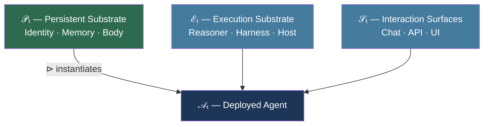

# Runtime-Independent Persistent Agents: What the Enoch Architecture Means for Codex CLI Model Upgrades


Every production Codex CLI deployment eventually faces the same awkward moment: the default model changes — GPT-4o becomes GPT-5, o3 gives way to o4-mini, and now GPT-6 Astra ships as the bundled default in v0.153.4.[^1] The session continues, a new reasoning engine takes over, and the agent has no formal mechanism to assert that it is the same agent. It just… continues.

That informality is the problem Zhao and Zhao (arXiv:2609.00546, 31 August 2026) formalise in "Runtime-Independent Persistent Agents: Preserving Identity, Memory, and Code Across Models, Harnesses, and Servers."[^2] Their architecture — implemented in an open-source agent called Enoch — provides a principled two-layer split that separates what must persist from what is legitimately replaceable. Codex CLI is explicitly named as a provider surface in Enoch's reference implementation.

## The Two-Layer Model

The core insight is simple but frequently violated: most agent descriptions conflate ephemeral execution machinery with the durable substance of the agent itself.

Zhao and Zhao formalise a deployed agent as:

$$\mathcal{A}_t = \mathcal{P}_t \triangleright (\mathcal{E}_t, \mathcal{S}_t)$$

where ⊳ denotes instantiation without ownership. The **persistent substrate** (𝒫ₜ) contains three durable components:

- **Iₜ** — installed identity: designation, relationships, values, and lineage metadata
- **Mₜ** — private durable memory: versioned, schema-registered state
- **Bₜ** — versioned executable body: code, tools, policies, provider contracts

The **replaceable deployment binding** decomposes into execution substrate ℰₜ = (Rₜ, Hₜ, Dₜ) — reasoning model, harness, host — and interaction surfaces 𝒮ₜ (chat, API, UI). The key claim: *any component of ℰₜ or 𝒮ₜ can be substituted without constituting a new agent, provided the substitution satisfies six continuity invariants.*



## Six Continuity Invariants

The invariants constrain what a migration is permitted to silently alter:[^2]

| Invariant | Constraint |
|-----------|-----------|
| **I1 — Identity and Lineage** | Installed identity version and attributable lineage are preserved; updates require declared governance |
| **I2 — Memory** | Memory extends or validly migrates recorded ancestry; no silent reset |
| **I3 — Body** | Target executes same body revision unless separately governed evolution occurs |
| **I4 — Authority** | At most one execution within the deployment boundary holds continuation authority at a time |
| **I5 — Capability** | Environmental capability deltas are visible and do not masquerade as identity changes |
| **I6 — Self-description** | Runtime environment labels do not overwrite installed identity |

I4 matters most for concurrent Codex sessions. When you run two `codex` processes against the same `~/.codex/` directory, neither process asserts an authority epoch — there is no fencing mechanism preventing both from writing to `~/.codex/memory/` simultaneously.[^3] Enoch solves this with daemon epochs: a stale process that attempts to claim or finalise work after a handoff is rejected.

## The Migration Protocol

When a legitimate substitution occurs — model upgrade, host migration, harness replacement — Enoch enforces six ordered phases:

```mermaid
sequenceDiagram
    participant S as Source Execution
    participant O as Orchestrator
    participant T as Target Execution

    S->>O: 1. Quiesce and Fence (advance authority epoch)
    S->>O: 2. Checkpoint (identity, body revision, memory versions, pending work)
    O->>O: 3. Validate (schemas, hashes, lineage, capability requirements)
    O->>T: 4. Bind (resolve target providers via body contracts)
    O->>T: 5. Rehydrate (install private state atomically; load body + identity separately)
    T->>O: 6. Verify and Resume (continuity checks; acquire new authority epoch)
```

The **separation of body from identity in step 5** is architecturally critical. Enoch loads `body.yaml` (mission, principles, repository lineage) and `self.json` (installed identity record, lineage metadata) as distinct, explicitly-labelled inputs. Behavioural self-representation — "I am Andy, I work on Daniel's knowledge base" — is treated as a *post-migration test*, not an assumption. Multiple agents can share a body revision while remaining distinct in identity, memory, and authority; copying the body does not copy the agent.

## What the Memory Portability Study Adds

Zhao and Zhao assert the need for memory continuity invariant I2, but a companion study published the same week quantifies what happens when it is violated. Goyal and Ray (arXiv:2609.05339, LinkedIn) conducted a controlled memory portability experiment using 48 synthetic histories, 160 questions per history, and a fixed model pair (Llama-3.1-8B-Instruct and Qwen2.5-7B-Instruct-1M).[^4]

Their retained-performance-after-swap (RPAS) metric revealed sharp format dependency:

| Memory Format | Δ Accuracy After Model Swap |
|--------------|----------------------------|
| **KG-fixed** (structured subject-predicate-object) | ±0.0004 — effectively zero |
| **NOTES** (model-compressed summaries) | +9.91 pp (Llama→Qwen) / **−13.28 pp** (Qwen→Llama) |
| **RAG** (chunked retrieval) | 81% of deficit from retrieval failure alone |
| **LC-RAW** (full transcript) | Highest reconstruction cost |

The embedding migration finding is particularly sharp: re-using a mixed index (50% old vectors, 50% new) captures only 4.96 of a possible 11.90 pp accuracy gain because "old and new vectors occupy different spaces" despite matching dimensionality — cross-space cosine similarity falls to 0.904, well below the 0.999 identity threshold. Mixed indexes **fail silently**, with no dimensional compatibility errors.[^4]

## Mapping to Codex CLI's Current Architecture

Codex CLI's persistence mechanisms map onto the Enoch framework, but incompletely:

| Enoch Component | Codex CLI Analogue | Gap |
|----------------|--------------------|-----|
| **Iₜ** (identity) | `AGENTS.md` persona section | No formal lineage record; no installation version |
| **Mₜ** (private memory) | `~/.codex/memory/*.md` | No schema registry; no versioned ancestry tracking |
| **Bₜ** (body) | `AGENTS.md` + `~/.codex/config.toml` | Conflated with identity; no `body.yaml`/`self.json` split |
| **Rₜ** (reasoner) | Model picker (`model = "gpt-6-astra"`) | No authority-epoch handoff on model swap |
| **Hₜ** (harness) | `codex` binary version | No continuity assertion across binary upgrades |
| **Dₜ** (host) | Machine running `codex` | No cross-host migration protocol |
| **𝒮ₜ** (surfaces) | TUI, `codex exec`, MCP | Each surface is independent; no normalised event log |

The Enoch runtime contract explicitly names Codex as its reference implementation: "Runtime: Codex; external contract (respond, execute, cancel)." This means Enoch's persistent substrate can drive a Codex session as a replaceable execution surface — identity, memory, and body live outside the Codex process, which becomes a reasoning-and-execution provider rather than the locus of agent state.[^2]

### Practical Mitigations for Codex CLI Today

Given that Codex CLI does not implement the full Enoch protocol, engineers can approximate the invariants manually:

**Memory format (I2):** Store durable facts in `~/.codex/memory/` as structured key-value Markdown rather than prose summaries. Structured notes survive model swaps; summarised prose does not.[^4] Prefer explicit claims (`project: codex-resources`, `owner: danielvaughan`) over narratively-embedded facts.

**Body/identity separation (I3/I6):** Keep `AGENTS.md` split into a stable `## Identity` section (persona, name, relationships) and a separately-versioned `## Mission` section. When updating mission or tools, treat the identity section as read-only.

**Authority fencing (I4):** Use `codex queue` with `--session` flags for concurrent workloads rather than running two bare `codex` processes against shared `~/.codex/memory/`. Named sessions create implicit separation even without epoch fencing.

**Capability visibility (I5):** When upgrading from an earlier model to GPT-6 Astra in `~/.codex/config.toml`, annotate the change in `AGENTS.md` with a date-stamped entry — "2026-09-04: upgraded to gpt-6-astra, 1M-token context, ARC-AGI-3 capable." This provides the observable capability delta that I5 requires.

**Embedding re-index (for RAG users):** If using an MCP memory server with vector retrieval, re-index the full corpus after any model upgrade. Never use a partial or mixed index — the silent accuracy loss is substantial.[^4]

## The Broader Implication

Enoch's 833 core tests validate individual-axis substitutions (reasoner swap, host migration, chat surface replacement) but explicitly acknowledge the absence of controlled all-axis combined migration testing.[^2] The architecture is a research contribution, not a production-hardened system. But the conceptual decomposition it provides — persistent substrate versus replaceable deployment — is immediately applicable as an organisational discipline.

The GPT-6 Astra launch on 3 September 2026 made this concrete: every Codex CLI installation that ran `npm update -g @openai/codex` performed a Rₜ substitution the same day without awareness of it. Whether the agent on the other side of that substitution is "the same agent" is, under the current architecture, an undefined question. Enoch proposes that it should not be.

## Citations

[^1]: OpenAI. *Codex CLI v0.153.4 Release Notes.* GitHub, 4 September 2026. <https://github.com/openai/codex/releases/tag/v0.153.4>

[^2]: Zhao, Z. and Zhao, R. "Runtime-Independent Persistent Agents: Preserving Identity, Memory, and Code Across Models, Harnesses, and Servers." arXiv:2609.00546, 31 August 2026. <https://arxiv.org/abs/2609.00546>

[^3]: OpenAI. "Codex CLI Memory Documentation: ~/.codex/memory/." *Codex Knowledge Base.* 2026. <https://codex.danielvaughan.com/2026/05/01/codex-cli-memories-persistent-context-session-memory-ecosystem/>

[^4]: Goyal, A. and Ray, J. "Does Your Agent's Memory Survive a Model Upgrade? A Controlled Study of Memory Portability." arXiv:2609.05339, LinkedIn, 2026. <https://arxiv.org/abs/2609.05339>

[^5]: OpenAI. *Codex CLI v0.153.0 Release Notes.* GitHub, 3 September 2026. <https://github.com/openai/codex/releases/tag/v0.153.0>
