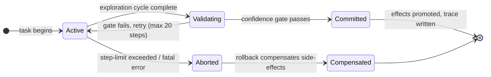

# ACID for AI Agents: Applying Transactional Guarantees to Codex CLI Workflows


Database engineers have had ACID guarantees since the 1970s. A bank transfer either completes in full or rolls back — it never leaves the ledger half-written. LLM coding agents, by contrast, routinely exit mid-task, corrupt state with partial writes, and race against their own subagents without any notion of commit or rollback. Three 2026 papers — ACID-Agent [^1], Mnemosyne [^2], and MemTxn [^3] — independently converge on the same fix: import transactional semantics into the agent harness. This article unpacks what they found and maps each guarantee to a concrete Codex CLI primitive.

## Why Agents Need Transactions

An agent executing a multi-step data pipeline will read source files, run transformation code, write intermediate artefacts, and call external APIs. If the host process crashes after the write but before the API call, the system is in an undefined state that no amount of re-running the same prompt can reliably repair. The agent has no way to distinguish "I completed step 3" from "the environment says step 3 happened" — a distinction databases have formalised as the difference between durability and eventual consistency.

The core insight across all three papers is that *agent execution already forms transaction-shaped units of work* — the problem is that the harness exposes no boundary for commit, rollback, or recovery. Model invocations, tool calls, document mutations, and external side-effects arrive as a stream of events with no scope delimiter.[^1]

## Semantic ACID: The Four Properties Redefined

Sun, Wang, and Li at Tsinghua University (arXiv:2608.13900, August 2026) map each classical ACID property onto agent-specific semantics:[^1]

**Semantic Atomicity** — A dependency-aware sequence of model invocations, tool calls, and external actions forms a single transaction unit. Effects only become visible after a validation gate passes. If the agent is mid-way through a ten-step workflow and a code-confidence check fails, the entire exploration cycle is retried, not committed in its partial state.

**Semantic Consistency** — Committed outcomes must satisfy task objectives, execution constraints, and available evidence, even when intermediate reasoning traces vary across runs. The system enforces this through *confidence-divergence-based validation*: a lightweight local model (Qwen 0.6B by default) scores decision confidence and code confidence against a threshold; divergence beyond that threshold triggers a retry rather than a commit.

**Semantic Isolation** — Concurrent agent transactions must not produce semantically invalid interference. ACID-Agent supports three sub-agent coordination strategies: *independent* (no shared state), *collaborative* (shared read, versioned writes), and *competitive* (adversarial review). Versioned workspaces implement the physical boundary; the coordination strategy governs which writes from one agent are visible to another.[^1]

**Semantic Durability** — Committed execution states, supporting evidence, and recovery metadata survive beyond the transaction's lifetime. The implementation uses an append-only workspace log, externalised as `acid_trace.jsonl`, `acid_trace_summary.json`, and `result.json`.[^1]



## ACID-Agent on KramaBench

KramaBench is a representative data-agent benchmark comprising 104 natural-language tasks over 1,700 real-world data files drawn from 24 data sources across six domains.[^1] It is deliberately heterogeneous: tabular data, JSON APIs, time-series, and unstructured text appear in the same task.

Against this benchmark, ACID-Agent powered by Qwen3.5-397B-A17B scores **74.6%**, compared to 64.0% for a Claude Code baseline — a **10.6 percentage-point improvement**.[^1] Critically, ACID-Agent also delivers lower task-level score variance than the baseline, demonstrating that confidence-guided exploration reduces the non-determinism inherent in long-horizon agent work. The cost: 22.8 code steps per task versus 9.4 for the baseline, roughly 2.4× more computation per task.

## Mnemosyne: Formal Safety Properties via ATP

Chang and Geng (arXiv:2607.00269, June–August 2026) attack the same problem from a formal verification angle.[^2] Their Agentic Transaction Processing (ATP) framework treats every LLM-generated action as an *untrusted proposal* until a deterministic admission gate accepts it under an executable constraint set. The core principle: *a proposal is not truth*. Anything may propose, but only the runtime admits and commits; unforeseen disruptions trigger bounded reactive repair whose output re-enters admission.

Mnemosyne proves four safety properties under this framework:[^2]

1. **Authority Separation** — the admission gate is strictly separated from the generative model, preventing the proposing LLM from influencing admission decisions about its own output.
2. **Serial-Equivalent Generative Admission** — concurrent proposals admitted under ATP are logically equivalent to some serial ordering.
3. **Evidence-Preserving Repair** — reactive repair operations cannot discard observational data that influenced prior committed steps.
4. **Obligation Containment** — repair scope is bounded; a failed step cannot cascade repairs beyond its declared dependency set.

In evaluation across nine safety benchmarks, ATP "rejects every targeted violation while admitting valid work" with only a 5.2–6.6% incremental throughput cost over a baseline local durable commit path.[^2] In production pilots, 80 proposals from four heterogeneous LLMs passed through a single gate with zero invalid commits.[^2]

## MemTxn: Transactional Boundaries for Agent Memory

The third paper (arXiv:2607.27834) focuses specifically on persistent memory stores.[^3] Long-running agents that reuse information across sessions face a distinct hazard: a corrupt or stale memory write can silently propagate errors across hundreds of future tasks. MemTxn adds a governance layer with three components:

- **Ordered PatchTest** — verifies each memory write against its source evidence before committing.
- **Temporal Resolver** — selects the visible version when conflicting facts are written by concurrent agents.
- **Durable Snapshot Journal** — enables complete-state recovery after persistent multi-key faults.

On MemoryAgentBench FactConsolidation, MemTxn achieves the highest average F1 across twelve answer-model configurations, outperforming the dense-retrieval baseline by **17.06–24.07 F1 points** in five representative settings.[^3] Critically, the system accepted all 60 supported originals and rejected all 179 hard negatives in item-disjoint audits — a 100% precision/recall result.[^3]

## Mapping to Codex CLI Primitives

Codex CLI has no explicit transaction manager, but its hook system and workspace design map naturally onto the transactional concepts above.

```toml
# ~/.codex/config.toml — sketch of a transaction-aware harness profile
[profile.data-agent]
approval_policy = "untrusted"
writable_roots = ["/workspace/data-agent/scratch"]

[hooks.post_tool_use]
# Semantic Atomicity gate: reject write if confidence divergence detected
command = "scripts/confidence_gate.sh"

[hooks.pre_tool_use]
# Semantic Isolation: idempotency key injection for external API calls
command = "scripts/idempotency_inject.sh"
```

| ACID Property | Codex CLI Primitive | Mechanism |
|---|---|---|
| Semantic Atomicity | `PostToolUse` hook, exit code 2 | Block promotion of partial writes; trigger retry |
| Semantic Consistency | AGENTS.md validation contract | Explicit acceptance criteria checked at commit boundary |
| Semantic Isolation | Git worktrees per concurrent agent | Versioned filesystem; no shared mutable workspace |
| Semantic Durability | Git commit log + `~/.codex/memories/` | Append-only history; session resume on reconnect |

### PostToolUse as a Commit Gate

The closest Codex CLI primitive to Semantic Atomicity is a `PostToolUse` hook that exits with code 2 (blocking the next tool call) when a validation condition fails.[^4] In practice this means writing a confidence-scoring script that inspects the most recent tool result — say, the output of a code execution — and refuses to advance the agent loop until the result passes a correctness criterion.

```bash
#!/usr/bin/env bash
# scripts/confidence_gate.sh — minimal Semantic Atomicity gate
TOOL_NAME="${CODEX_TOOL_NAME:-}"
EXIT_CODE="${CODEX_TOOL_EXIT_CODE:-0}"

if [[ "$TOOL_NAME" == "shell" && "$EXIT_CODE" != "0" ]]; then
  echo "gate: non-zero exit on shell tool — blocking commit" >&2
  exit 2   # Codex blocks the next turn; agent must retry or replan
fi
exit 0
```

### Git Worktrees as Semantic Isolation

Codex CLI's `codex queue` dispatches tasks to parallel agents. Without isolation, two concurrent data-transformation agents can race on shared intermediate files. The fix is structurally identical to ACID-Agent's versioned workspace strategy: each queued task receives its own git worktree, rooted in a subdirectory scoped to the task ID.[^4]

```bash
# Allocate an isolated workspace per queued task
git worktree add /workspace/run-$(uuidgen) --detach HEAD
codex queue --session "task-$(uuidgen)" --text-file task.txt --worktree /workspace/run-...
```

### AGENTS.md as an Active Contract Record

Mnemosyne's *active contract records* — machine-readable declarations of what a transaction is allowed to write and which prior facts it depends upon — map directly to AGENTS.md constraint sections.[^2] A well-structured AGENTS.md for a data-agent task declares the exact output files, the source datasets considered authoritative, and the validation commands that constitute the commit gate.

### Persistent Memory as a Durable Snapshot Journal

Codex CLI's `~/.codex/memories/` directory (memory_summary.md, MEMORY.md, raw_memories.md) acts as the durable snapshot journal that MemTxn theorises.[^3] The gap the research identifies — no source-supported write verification — suggests a natural extension: a `PostToolUse` hook on memory-write operations that checks each write against the raw session evidence before appending to `raw_memories.md`.

## Remaining Gaps

None of these papers fully bridge to Codex CLI's real-time interactive model. ACID-Agent runs offline batch tasks; Mnemosyne's gate assumes a synchronous admission API; MemTxn targets session-resumed long-running agents rather than sub-minute interactive tasks. The practical takeaway for Codex CLI users is not to wait for a native transaction manager but to compose the above primitives deliberately: hooks as gates, worktrees as isolation, git log as durability, and AGENTS.md as the contract record.

The research also surfaces a cost reality: ACID-Agent's 2.4× compute overhead per task is non-trivial.[^1] At the Codex CLI level, that cost manifests as additional hook invocations, retry turns, and quota consumption. Confidence-scoring with a local lightweight model (analogous to ACID-Agent's Qwen 0.6B scorer) would need to run outside the Codex quota boundary to be cost-effective — a solvable but currently user-configured arrangement.

## Citations

[^1]: Sun, Z., Wang, X., & Li, G. (2026). *Agentic Transaction: Towards ACID-Compliant Agent Systems*. arXiv:2608.13900. Tsinghua University. https://arxiv.org/abs/2608.13900

[^2]: Chang, E. Y., & Geng, L. (2026). *Mnemosyne: Agentic Transaction Processing for Validating and Repairing AI-generated Workflows*. arXiv:2607.00269. https://arxiv.org/abs/2607.00269

[^3]: (2026). *MemTxn: A Transaction Boundary for Source-Supported Updates and Complete-State Recovery in Agent Memory*. arXiv:2607.27834. https://arxiv.org/abs/2607.27834

[^4]: Codex CLI documentation — hooks reference. OpenAI. https://github.com/openai/codex
