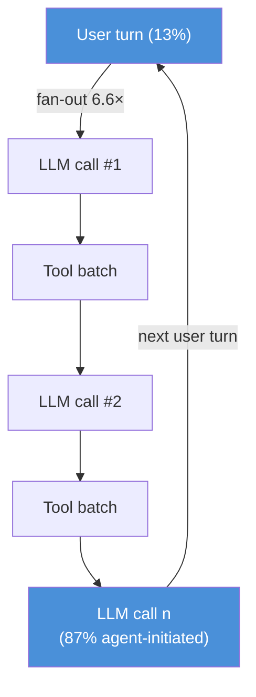
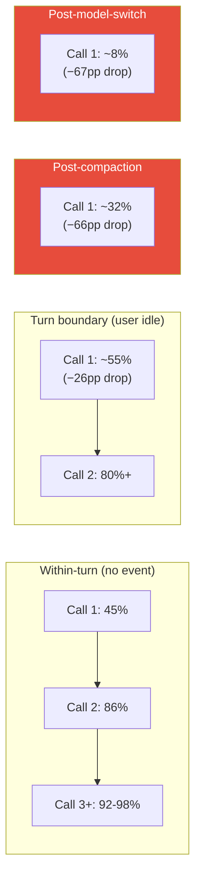
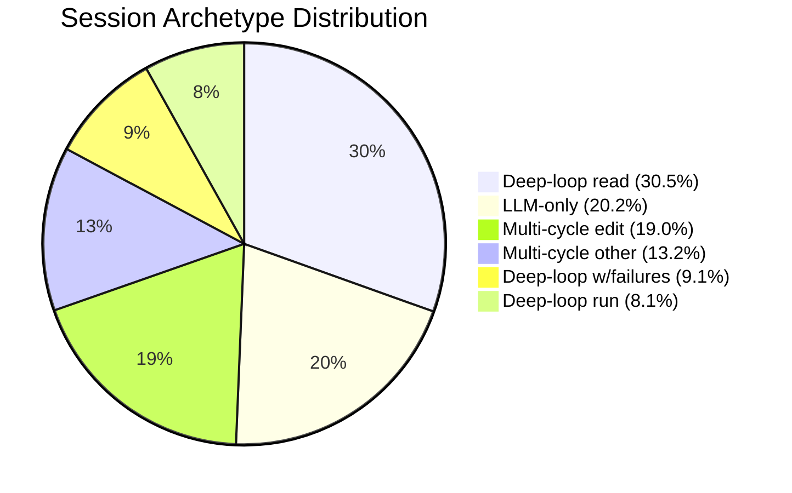

# Agentic Coding in the Wild: What 95 Trillion Tokens Reveal About Codex CLI Workloads


Production telemetry is rare in AI engineering. Benchmarks proliferate; real-world characterisation does not. That changed in August 2026 when Microsoft Research published a study analysing 13.5 million GitHub Copilot sessions from a single week in June 2026 — 760.5 million LLM calls, 774.7 million tool invocations, and 95 trillion tokens.[^1] The dataset covers 27+ models and 45+ tools. The findings challenge several assumptions baked into default Codex CLI configurations and expose three specific configuration risks that warrant immediate attention: context compaction cache wipeout, reactive model switching, and failure-driven compute amplification.

## The Workload Is Not a Chatbot Workload

The canonical framing of LLM serving — a user sends a message, the model responds — does not describe agentic coding. In the production data, **87% of LLM calls are agent-initiated**, not user-initiated.[^1] A single user turn fans out into an average of 6.6 autonomous LLM calls. The observe→reason→act loop runs continuously: the session-level ratio of LLM calls to tool invocations is 40.6 versus 43.6 — nearly 1:1 — reflecting the canonical structure of read-context, reason about it, mutate or execute, then read again.[^1]

Distribution is violently long-tailed. The median session has 3 turns and 15 LLM calls; the mean has 6.1 turns and 40.6 LLM calls — a 2.7× skew for calls and a **14.9× skew for session duration** (4.2 minutes median versus 62.6 minutes mean).[^1] The tail matters for infrastructure, but the skew also matters for per-session Codex CLI configuration: a single deep-loop session can consume 1.1M prompt tokens per turn (P90 user archetype), placing it firmly in the experimental context management tier.



## KV Cache Dynamics: Three Cliff Edges

KV cache behaviour is the single most important performance characteristic of agentic coding workloads, and the data reveals three distinct cliff edges.

### Within-Turn Cache Ramp-Up

The first LLM call in a turn starts cold: ~45% hit rate. By call #2 it jumps to ~86%, and by call #3 it plateaus at 92–94%, reaching a median of 98% within-turn.[^1] This ramp-up is invisible in single-call benchmarks but matters for short agentic loops where most of the value is in calls 2–6.

### Turn-Boundary Degradation

At turn boundaries — where the user submits a new message after thinking for a median of 25.2 minutes — the same-model cache hit rate drops 26 percentage points on average, falling to 55%.[^1] The median KV cache idle at turn boundaries is 2.9 minutes; at P95 it is 75 minutes. Any infrastructure that evicts KV cache entries after a few minutes of inactivity will cold-start the next turn, restoring the ramp-up cost across every new user prompt.

### Catastrophic Compaction Events

Context compaction is the most severe disruption. It occurs in **7.8% of sessions**, but in those sessions it affects 44.2% of total tokens, removing a median of **72.8%** of context.[^1] After compaction, the median cache hit rate drops **66.1 percentage points**. In 34.3% of compaction events, more than 90% of the cache is erased. Compaction overhead consumes a median 22% of turn execution time and P90 34%.



### Model Switch: Near-Total Cache Invalidation

Model switches occur in 6.4% of sessions. They are almost never planned: 36% of calls before a switch have non-success status, indicating the switch is a reactive response to rate limiting or errors. The average cache hit rate after a model switch is **8%** — a 67-percentage-point drop from the within-turn plateau.[^1] The session essentially cold-starts.

**Codex CLI implication:** The default model picker and reactive switching logic in Codex CLI can destroy KV cache state accumulated over dozens of LLM calls. Explicitly pinning `model = "gpt-6-astra"` in `config.toml` and configuring a fallback profile that does *not* switch models mid-session (instead queuing or refusing) preserves cache coherence:

```toml
# ~/.codex/config.toml
model = "gpt-6-astra"

[profiles.fallback]
model = "gpt-6-astra"       # intentionally same — no cache wipe
approval_policy = "suggest"
```

For compaction, the v0.153.0 experimental context management feature (`features.context_management.experimental_mode`) introduces a `new_context` tool that allows the agent to checkpoint at a chosen moment with no summary, replacing context before the automatic compaction threshold is reached.[^2] Triggering `new_context` proactively — after a coherent sub-task completes — is a lower-trauma alternative to reactive compaction.

## Tool Execution: The Extreme Variance Problem

Tool calls account for 28% of total prompt token input (function-call messages), but their execution time distribution is almost completely bimodal.[^1]

| Metric | Value |
|---|---|
| Median tool execution time | 166 ms |
| Mean tool execution time | 16.7 s |
| P90 tool execution time | 4.4 s |
| P99 tool execution time | 79 s |
| Mean-to-median ratio | ~100× |

Read/search tools (`get_file`, file search) execute in tens of milliseconds with ~100% success rates. Build and terminal tools have a median of seconds and a mean of 68–78 seconds.[^1] Failed terminal commands at P95 take **48× longer** than successful ones. The implication is that a single failed build in a deep-loop session can block the entire turn for over a minute.

Tool concurrency is lower than intuition suggests: 93% of tool batches contain exactly one tool invocation; only 7% dispatch multiple tools concurrently, with a median parallelism width of 2.[^1] Read-only tools are occasionally batched; write/execute tools are almost always serial. Critically, **only 7.7% of aggregate tool wall-clock time is hidden behind LLM execution** — long-running tools remain fully exposed on the critical path regardless of any LLM-tool overlap optimisation.[^1] Infrastructure-side tool-LLM overlap (as proposed by Sutradhara[^3]) can help at the serving layer, but from within Codex CLI the levers are timeout budgets and pre-emptive failure detection.

```toml
# config.toml — per-tool token budget caps (v0.152.0+)
[tools.run_command]
output_token_limit = 8192   # avoid runaway build output filling context

[tools.bash]
output_token_limit = 4096
```

PostToolUse hooks can abort immediately on non-zero exit codes, preventing the 48× latency tail from a failing tool from propagating into additional LLM calls:

```bash
#!/usr/bin/env bash
# .codex/hooks/post_tool_use.sh
# Abort the turn if a shell command returns non-zero to avoid retry amplification
if [[ "$CODEX_TOOL_NAME" == "run_command" || "$CODEX_TOOL_NAME" == "bash" ]]; then
  if [[ "$CODEX_TOOL_EXIT_CODE" -ne 0 ]]; then
    echo "Tool failed: aborting turn to prevent compute amplification" >&2
    exit 2   # signal Codex CLI to stop the current turn
  fi
fi
```

## Six Workflow Archetypes

The paper clusters production sessions into six archetypes.[^1] Three have direct Codex CLI configuration implications.



**Deep-loop with failures (9.1%)** is the pathological archetype: 36 LLM calls per turn, failure-driven retry loops, and compute amplification up to **4×** standard load.[^1] These sessions consume disproportionate tokens (failed builds generate 7–8× more completion tokens than successful ones) and are the primary source of the long-tailed distribution. AGENTS.md retry budgets and PostToolUse abort hooks are the primary mitigation.

**Deep-loop read (30.5%)** — 9 LLM calls and 7 tool batches with read-heavy patterns — is the "exploration" archetype. This is where `get_file` (35% of all tool invocations) dominates. Context grows rapidly from conversation history (48% of input) and function-call messages (28%). `tui.auto_recap = false` combined with manual `/recap` invocations at exploration milestones prevents premature compaction in these sessions.[^2]

**Multi-cycle edit (19.0%)** — 5 LLM calls, read+edit+build — is the typical implementation loop and aligns with the highest KV cache efficiency: it is short enough to stay within the within-turn plateau and rarely triggers compaction.

## The User Archetype Skew

Five user archetypes reveal a 50× resource gap between the most and least intensive users.[^1]

| Archetype | % Users | Tools/Turn | Tokens/Turn |
|---|---|---|---|
| Readers | 41.7% | 4.8 | 203K |
| Coders | 30.4% | 6.2 | 417K |
| Terminal users | 11.0% | 4.0 | 213K |
| Deep-loop | 9.2% | 20.0 | 1.1M |
| Chat-only | 7.6% | 0.0 | 23K |

Deep-loop users (9.2%) consume **1.1M tokens per turn** — 50× the chat-only baseline and more than 2× the coder baseline.[^1] This places deep-loop Codex CLI sessions squarely in the experimental context management tier and makes rollout token budget caps (`rollout_budget` in `config.toml`, v0.153.0) the primary cost-control mechanism.

```toml
# config.toml — budget guardrails for deep-loop sessions
[session]
rollout_budget = 2000000    # 2M token hard ceiling per rollout
```

## Idle Time and Session Reconnection

Cross-turn idle dominates session wall-clock time in multi-turn sessions: user idle is the dominant activity at 80.1% of total session duration (median 25.2 minutes between turns).[^1] The KV cache survives a median 2.9 minutes of idle; the container survives a median 4.1 minutes before eviction.

This directly motivated Codex CLI v0.153.0's session auto-reconnect feature (PRs #41911, #41916, #41918), which preserves drafts and transcripts across app-server drops and pauses uncertain submissions on reconnection.[^2] The 26-percentage-point turn-boundary cache drop is infrastructure-side and outside CLI control, but reconnect stability ensures at least that context transmitted to the server is not double-sent or lost, avoiding spurious compaction events triggered by resynchronisation.

## Codex CLI Configuration Checklist

Translating the production findings into actionable configuration:

| Risk | Finding | Mitigation |
|---|---|---|
| KV cache wipeout on model switch | 8% hit rate post-switch (−67pp) | Pin `model` in `config.toml`; no reactive switching |
| Compaction trauma | 66.1pp cache drop, 22–34% turn overhead | `experimental_mode` + proactive `new_context` |
| Failure amplification | 4× compute in deep-loop w/failures | PostToolUse abort hook (exit 2 on non-zero) |
| Context overflow in deep-loop | 1.1M tokens/turn for 9.2% of users | `rollout_budget` cap + `/recap` milestones |
| Long-running tool tail latency | P95 failed commands 48× longer | `output_token_limit` per tool |
| Turn-boundary cache degradation | 55% hit rate vs 90%+ within-turn | Session reconnection stability (v0.153.0) |

The production data makes clear that Codex CLI workloads are qualitatively different from chatbot workloads — not incrementally so, but structurally. The 87% agent-initiated call share, the 14.9× session duration skew, and the three compaction/switch/boundary cliff edges in KV cache efficiency all point to the same conclusion: the configurations that suit a conversation-oriented assistant will systematically under-serve a deep-loop coding agent.

## Citations

[^1]: Liu, B., Qiu, H., Goiri, Í., Fonseca, R., Bianchini, R., & Choukse, E. (2026). *Agentic Coding in the Wild: Characterizing GitHub Copilot Traces at Production Scale*. arXiv:2608.00101. Microsoft Research. <https://arxiv.org/abs/2608.00101>

[^2]: OpenAI. (2026, September 3). *Codex CLI v0.153.0 Release Notes*. GitHub. <https://github.com/openai/codex/releases>

[^3]: Biswas, S. et al. (2026). *Sutradhara: An Intelligent Orchestrator-Engine Co-design for Tool-based Agentic Inference*. arXiv:2601.12967. Microsoft Research. <https://arxiv.org/abs/2601.12967>

[^4]: OpenAI. (2026). *The Shift to Agentic AI: Evidence from Codex*. arXiv:2606.26959. <https://arxiv.org/abs/2606.26959>

[^5]: Liu, B. et al. (2026). *Agentic Coding in the Wild* — full HTML version. arXiv. <https://arxiv.org/html/2608.00101v1>
