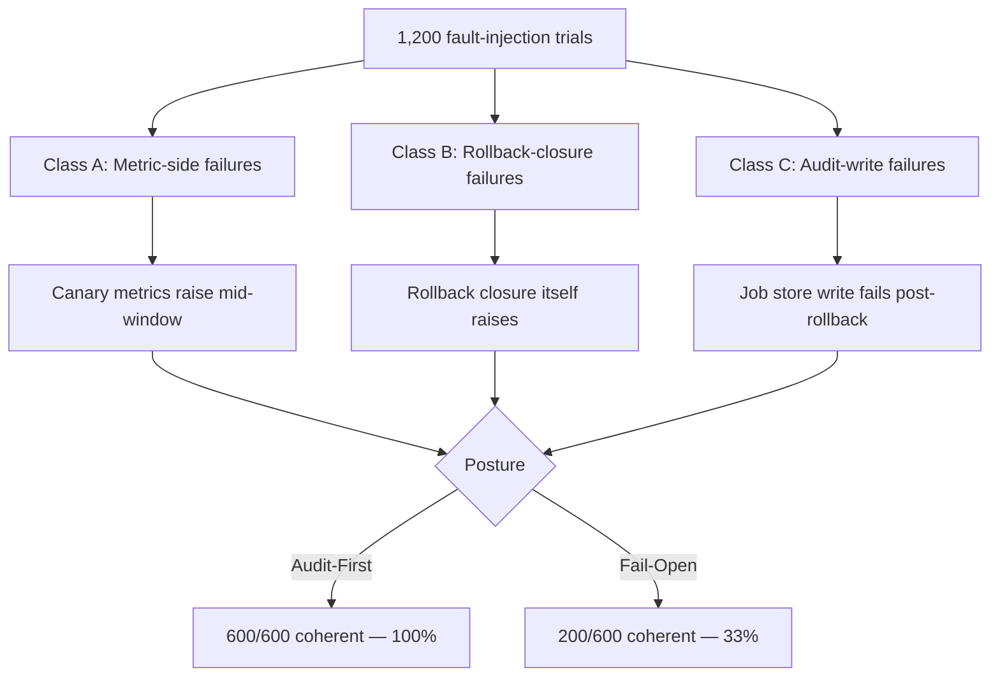
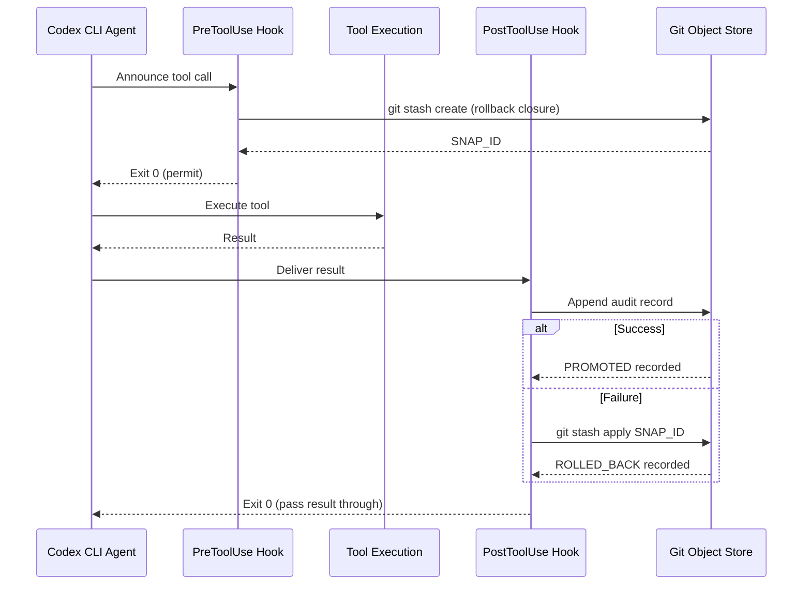

# Audit-First Rollback Semantics: What Deployment Pipeline Research Means for Codex CLI


A paper from Harbin Institute of Technology and Soochow University published in July 2026 addresses a deceptively narrow problem: what happens to a deployment pipeline's audit trail when it crashes mid-transition?[^1] The answer — a formal mechanism called *audit-first rollback semantics* — turns out to map cleanly onto patterns already available in Codex CLI's hook system, and the core insight reframes how agents should treat every tool call that mutates state.

## The Problem: Audit/Live-State Divergence

A deployment pipeline maintains two things simultaneously: the *live state* of the system (what is actually running) and an *audit chain* recording how it got there. Under normal conditions these are identical. Under failure they can diverge — a crash after the live state has mutated but before the audit record has been written leaves the two out of sync. Downstream systems reading the audit chain draw incorrect conclusions about what is deployed.

This divergence class is not exotic. Qin et al. formalise it as a configuration triple **(v, L, A)** where v ∈ 𝒱 is the current pipeline state, L is the live-state value, and A is the append-only audit chain.[^1] Transitions partition into three kinds: Σ_progress (advancing the deployment), Σ_rollback (reverting live state), and Σ_failure (recording explicit divergence). Coherence is defined as: at every committed terminal, the audit chain record matches L or explicitly signals a FAILED outcome. The research question is whether that invariant can hold under arbitrary fail-stop crashes anywhere in the transition sequence.

The same structure appears in any agent tool call that has side effects. The tool changes the world (L mutates), and something must record what happened (A updates). If the recording step is skipped — because the process crashes, times out, or raises an unhandled exception — observers downstream get stale, incorrect, or absent information about what the agent actually did.

## The Audit-First Guard Pattern

The mechanism Qin et al. propose is conceptually simple. Before any live-state mutation:

1. Construct a **rollback closure** — a complete snapshot of the pre-transition state sufficient to undo the mutation.
2. Execute the provisional mutation.
3. On success: write an audit record marking the state PROMOTED.
4. On exception: execute the rollback closure, then write an audit record marking the state ROLLED_BACK (or FAILED if the closure itself raises).

The critical ordering constraint is that the rollback closure is *constructed before* the mutation and *executed before* the audit write. This ordering means the audit chain never records a terminal it cannot actually reach, and the live state never strays further from a known-good snapshot than one bounded step.[^1]

Expressed as a guard pattern:

```python
def audited_transition(pipeline, action, rollback_closure, audit_chain, deadline):
    """Execute action under audit-first semantics."""
    pipeline.enter_provisional(rollback_closure, deadline)
    try:
        result = action()
        audit_chain.append({"state": "PROMOTED", "result": result})
        return result
    except Exception as exc:
        try:
            rollback_closure()
            audit_chain.append({"state": "ROLLED_BACK", "exception": str(exc)})
        except Exception as rollback_exc:
            audit_chain.append({"state": "FAILED", "exception": str(rollback_exc)})
        raise
    finally:
        pipeline.exit_provisional()
```

Each provisional state carries a `deadline(p)` — a bounded duration after which the state machine must reach a committed terminal regardless of coordinator availability. This prevents provisional states from lingering indefinitely when the coordinator itself is unavailable.[^1]

Three propositions follow from the construction:[^1]

- **Termination**: every provisional state reaches a committed terminal within its bounded deadline.
- **Coherence at terminals**: at terminal states the audit record matches L (PROMOTED or ROLLED_BACK) or explicitly signals FAILED — there is no silent divergence.
- **Crash-safety inside the guard**: any exception routes through the rollback path; the audit write occurs after the closure outcome is known.

## Empirical Results

The paper evaluates the mechanism through 1,200 fault-injection trials across 50 runs × 2 postures (audit-first vs fail-open) × 12 injection points covering the three structural failure classes.[^1]



Audit-first achieves 100% audit/live-state coherence (Wilson 95% CI [0.994, 1.000]); fail-open achieves 33% (Wilson 95% CI [0.297, 0.372]).[^1] The latency overhead is minimal: p95 latency of 335 ms for audit-first versus 325 ms for fail-open, with all 12 test cells meeting the 500 ms SLO.[^1]

The implementation uses an append-only audit chain backed by SQLite in WAL mode — a design that maps directly to git's append-only object store — with per-capability `asyncio.Lock` instances to prevent concurrent upgrade races.[^1]

## Agentic CI/CD: The Authority Transfer Frame

A complementary paper from AIware 2026 (Burak et al., arXiv:2605.07062) situates these concerns in the broader agentic CI/CD context.[^2] The authors distinguish two authority planes:

- **Data-plane authority**: localised actions such as patch generation and test reruns.
- **Control-plane authority**: configuration modifications, deployment policies, and approval gates.

Most current agentic systems — including Codex CLI in its default configuration — operate at the data plane with bounded autonomy, relying on external governance (sandbox policies, approval gates, hooks) rather than built-in agent guarantees.[^2] The research agenda they identify is urgent: control-plane safety requires formalising the *transfer* of authority, not just constraining individual actions. The audit-first mechanism from Qin et al. is precisely such a formalisation applied at the deployment-state level.

## Mapping to Codex CLI

Codex CLI's hook system provides three natural anchoring points for audit-first semantics.

### PostToolUse as the Audit Gate

The PostToolUse hook fires after every tool execution and can inspect the tool result, write audit records, and — via exit code 2 — replace the result the model sees.[^3] This maps to the audit-write step in the guard pattern:

```toml
# ~/.codex/config.toml
[hooks]
post_tool_use = [
  { type = "command", command = "~/.codex/hooks/audit-write.sh" }
]
```

```bash
#!/usr/bin/env bash
# audit-write.sh — append tool call to append-only audit log
TOOL_NAME="${CODEX_TOOL_NAME}"
TOOL_RESULT_EXIT="${CODEX_TOOL_EXIT_CODE}"
TIMESTAMP=$(date -u +"%Y-%m-%dT%H:%M:%SZ")
SESSION_ID="${CODEX_SESSION_ID}"

printf '%s\t%s\t%s\t%s\n' \
  "$TIMESTAMP" "$SESSION_ID" "$TOOL_NAME" "$TOOL_RESULT_EXIT" \
  >> ~/.codex/audit/audit.log

# Exit 0 — pass result through unchanged
exit 0
```

### PreToolUse as the Rollback-Closure Constructor

The rollback closure must be constructed *before* the mutation. PreToolUse fires before the tool executes, making it the correct location to snapshot state:

```bash
#!/usr/bin/env bash
# pre-snapshot.sh — capture pre-mutation state for destructive tools
TOOL_NAME="${CODEX_TOOL_NAME}"

if [[ "$TOOL_NAME" == "shell" ]] || [[ "$TOOL_NAME" == "write_file" ]]; then
  SNAP_ID="$(git -C "${CODEX_WORKSPACE_ROOT}" stash create 2>/dev/null || true)"
  if [[ -n "$SNAP_ID" ]]; then
    printf '%s\t%s\n' "$SNAP_ID" "$TOOL_NAME" \
      >> ~/.codex/audit/snapshots.log
  fi
fi

exit 0  # Permit the tool call to proceed
```

If the PostToolUse hook subsequently records a FAILED outcome, the snapshot ID in `snapshots.log` provides the rollback closure: `git stash apply "$SNAP_ID"`.

### Git as the Append-Only Audit Chain

Git's object store is append-only by construction: objects are content-addressed, commits form an immutable linked list, and WAL-mode SQLite is unnecessary because the reflog itself is crash-safe.[^3] The audit chain Qin et al. implement in SQLite is already present in any git-tracked workspace. Each `git commit` is a committed terminal in their formalism; each `git stash create` snapshot is a provisional state with an implicit rollback closure.



### AGENTS.md as the Rollback Policy

The formal mechanism requires each provisional state to carry an explicit `rollback(p)` contract and `deadline(p)`. In Codex CLI terms, these belong in `AGENTS.md` as per-tool rollback policies:

```markdown
## Tool Rollback Policy

| Tool | Rollback Contract | Deadline |
|------|-------------------|----------|
| `shell` (write ops) | `git stash apply` from pre-snapshot | 30 s |
| `write_file` | `git checkout HEAD -- <path>` | 10 s |
| `run_python` | Process kill; no filesystem side effects assumed | 5 s |
| MCP tools (external APIs) | PostToolUse compensating call logged to audit.log | 60 s |

Agents MUST NOT proceed past a PostToolUse hook that exits non-zero without
recording the FAILED state to audit.log with timestamp and tool name.
```

## Failure Class Coverage

The three failure classes from the paper each have a natural Codex CLI analogue:

| Failure Class | Paper Definition | Codex CLI Analogue |
|---|---|---|
| **Class A** (metric-side) | Metrics provider raises mid-canary | MCP server errors mid-tool-call |
| **Class B** (rollback-internal) | Rollback closure itself raises | `git stash apply` conflict |
| **Class C** (audit-write) | Job store write fails post-rollback | `audit.log` write fails (disk full) |

Class B — rollback closure failures — is the hardest to handle. Qin et al. record a FAILED terminal in this case, accepting that the audit chain truthfully reflects an unknown live state rather than asserting a coherence it cannot guarantee.[^1] The corresponding Codex CLI pattern is to exit the PostToolUse hook with code 2 (replacing the model's result with an explicit error message) and halt the session, preventing further mutations on a workspace in an unknown state.

## What 33% Baseline Coherence Means

The fail-open baseline in the paper achieves 33% coherence — not 0% — because many crash points occur either before the live-state mutation or after the audit write, so both sides happen to agree.[^1] The dangerous cases are the 67% where they diverge silently. An agent operating on stale audit information proceeds with incorrect beliefs about what has already been deployed, generating follow-on actions that compound the error.

The same dynamic applies to Codex CLI sessions that lose connection mid-task. Codex v0.153.0 introduced session auto-reconnect (PRs #41911, #41916) that pauses uncertain submissions on reconnect.[^4] The audit-first framing suggests this is insufficient alone: the reconnect behaviour prevents *new* mutations, but does not resolve whether in-flight tool calls at disconnect time reached a committed terminal. A PostToolUse hook that writes to an append-only log before returning — rather than relying on the harness to reconstruct state — provides the missing guarantee.

## Practical Configuration

Combining the patterns above into a minimal audit-first config:

```toml
# ~/.codex/config.toml
[hooks]
pre_tool_use = [
  { type  = "command",
    command = "~/.codex/hooks/pre-snapshot.sh",
    timeout_ms = 5000 }
]
post_tool_use = [
  { type  = "command",
    command = "~/.codex/hooks/audit-write.sh",
    timeout_ms = 10000 }
]

[sandbox]
writable_roots = ["/tmp/codex-workspace"]
network_mode = "workspace-only"
```

```bash
# Directory structure
~/.codex/
  audit/
    audit.log          # append-only, one record per tool call
    snapshots.log      # pre-mutation snapshot IDs
  hooks/
    pre-snapshot.sh    # constructs rollback closure
    audit-write.sh     # writes committed terminal record
```

The audit log format should be structured for machine consumption:

```bash
# audit.log format: TSV with fixed columns
# TIMESTAMP  SESSION_ID  TOOL_NAME  EXIT_CODE  TERMINAL_STATE  SNAP_ID
2026-09-08T14:23:01Z  sess-abc123  write_file  0  PROMOTED   snap-def456
2026-09-08T14:23:15Z  sess-abc123  shell       1  ROLLED_BACK  snap-ghi789
```

## Limitations and Caveats

The paper's evaluation runs in a single Python process; it explicitly notes that OS-level signals (SIGKILL) bypass the guard and leave the system in an indeterminate provisional state.[^1] ⚠️ Codex CLI's sandbox does not currently provide a kernel-enforced guarantee that PostToolUse hooks fire before the process is killed. For safety-critical deployments, the hook should write its rollback closure to disk in PreToolUse and read it back in PostToolUse, so that an out-of-band process can complete the audit write if the main process is killed.

The multi-bridge extension — distributing the guarantee across a fleet of agents — is designed but not empirically evaluated in the paper.[^1] ⚠️ Mapping this to `codex queue` multi-agent sessions would require a coordinator-level audit channel not currently present in the CLI.

## Citations

[^1]: Qin, X., Luan, S., Yang, C., & Li, Z. (2026). *Audit-First Rollback Semantics for Safety-Critical Deployment Pipelines*. arXiv:2609.00406. [https://arxiv.org/abs/2609.00406](https://arxiv.org/abs/2609.00406)

[^2]: Burak, M. et al. (2026). *From Assistance to Agency: Rethinking Autonomy and Control in CI/CD Pipelines*. AIware 2026. arXiv:2605.07062. [https://arxiv.org/abs/2605.07062](https://arxiv.org/abs/2605.07062)

[^3]: OpenAI. (2026). *Codex CLI Hooks Reference*. [https://github.com/openai/codex](https://github.com/openai/codex)

[^4]: OpenAI. (2026). *Codex CLI v0.153.0 Release Notes* — session auto-reconnect (PRs #41911, #41916, #41918). [https://github.com/openai/codex/releases](https://github.com/openai/codex/releases)

[^5]: Releasebot. (2026). *Codex CLI September 2026 Changelog*. [https://releasebot.io/updates/openai/codex](https://releasebot.io/updates/openai/codex)
