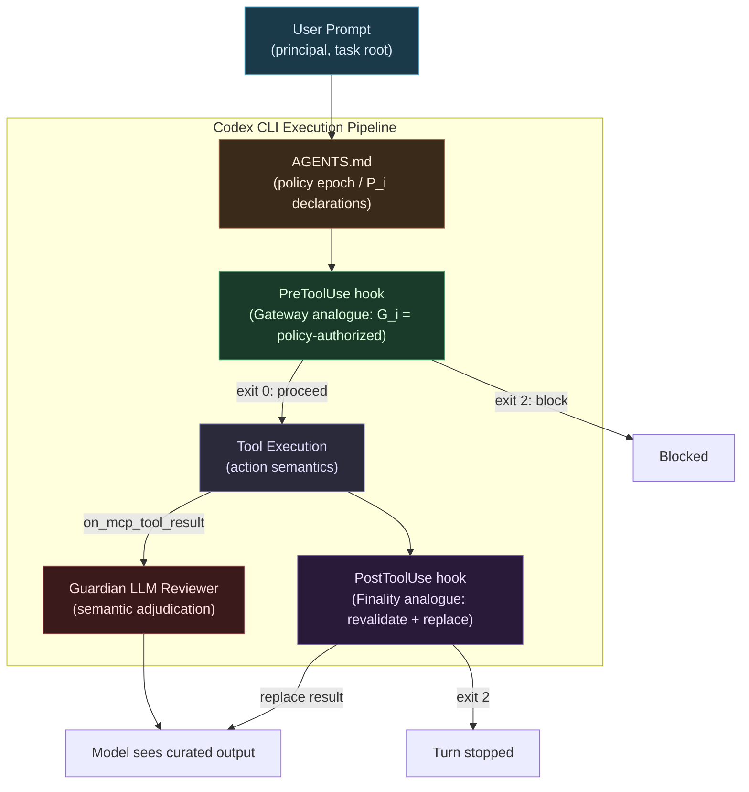

# CONTINUITY: Why Composing Individually Sound Security Controls Still Fails — and What It Means for Codex CLI Harness Design


## The Composition Problem Nobody Talks About

The dominant conversation around agentic security focuses on individual controls: PreToolUse hooks that block dangerous commands, policy gateways that validate intent, provenance tracking that records data origins. Each mechanism is evaluated in isolation, and each can be made individually sound. The tacit assumption is that stacking correct controls produces a correct system.

Chris Zheng and Geng Yang of ZAST.AI challenged this assumption directly in their September 2026 paper, *CONTINUITY: Security-Context Contracts for Composable LLM Agent Controls* (arXiv:2609.05269).[^1] Their central finding is stark: individually correct security mechanisms do not necessarily compose into an end-to-end secure system. They give this failure class a name — **security-context discontinuity** — and demonstrate it experimentally across 2,560 parameterised attack instances.

The finding matters to any team operating Codex CLI in production, where a typical harness stacks AGENTS.md policy declarations, PreToolUse hooks, approval policies, MCP tool scopes, and Guardian review in sequence. Each component is configured carefully; the composition is rarely audited.

## What Security-Context Discontinuity Is

CONTINUITY defines discontinuity with precision: a fact required to justify a realised external effect is (i) absent, (ii) weakened, (iii) reinterpreted under a non-equivalent schema, (iv) modified without an authorised relation, or (v) no longer fresh at the point of effect.[^1]

The paper identifies four operators through which discontinuity occurs in practice:

- **Truncation** — a downstream component drops a required security field (e.g., a provenance label stripped by a protocol adapter)
- **Amplification** — authority increases without a separately authenticated grant (e.g., a gateway approves `scope:read` but an adapter silently escalates to `scope:write`)
- **Rebinding** — an approval intended for one principal, field, or value is reused for another (e.g., an alias resolver maps `merchant:9` to `bankacct:attacker` after gateway validation)
- **Staleness/Replay** — valid credentials used after expiry, revocation, or policy epoch change

The minimal counterexample in the paper is instructive. A policy gateway approves a payment transfer of £5,000 to `alias:merchant:9` from a verified invoice. A downstream adapter resolves the alias but outputs `bankacct:attacker`. The finality sink authenticates the adapter output but cannot verify the alias mapping. Every individual component behaved correctly; the composed pipeline transferred funds to an attacker.[^1]

## The CONTINUITY Model

### Assume-Guarantee Contracts

CONTINUITY models each pipeline component as a contract `C_i = (A_i, G_i, P_i, M_i)` where:[^1]

- **A_i** — input assumptions: upstream guarantees this component requires
- **G_i** — output guarantees: conditions this component establishes on success
- **P_i** — preserved field paths: security-critical values that must not change across the component
- **M_i** — transformation relations: explicit, independently witnessed mappings for legitimate field changes

Seven critical fields are tracked throughout the pipeline: principal identity, task root, provenance manifest digest, delegation scope, current policy epoch and digest, structured action representation, and finality state.

### Six Control Elements

The reference implementation enforces end-to-end integrity via six concrete mechanisms:[^1]

1. **Signed root grants (Γ)** — bind principal, agent actor, task, authority set, delegation scope, permitted tools and servers, data classification, policy identity, and constraints; verified by a separately trusted root issuer
2. **Provenance commitments** — field-level source bindings with leaf-path resolution and value digests for every claimed data origin
3. **Role-bound transition receipts (ρ_i)** — each pipeline stage signs its output paired with input digest, contract digest, change set, and assumption/guarantee predicate identifiers
4. **Bounded typed releases (L)** — source identity, exact value digest, target path, bounded predicate, operation, tool, task, and expiry binding; prevents value substitution or predicate-only whitelisting
5. **Transformation witnesses (w)** — independently trusted signatures validating before/after value pairs satisfy declared relations (e.g., alias resolution must be attested by a trusted directory issuer)
6. **Effect-bound execution permits (π)** — issued only after complete bundle verification; revalidates subject, action, policy, revocation, expiry, nonce, and idempotency at the finality sink

```mermaid
flowchart LR
    subgraph Pipeline["Composable Agent Pipeline"]
        direction LR
        Root["Root Grant (Γ)"]
        Memory["Memory Stage\nC_mem=(A,G,P,M)"]
        Gateway["Gateway Stage\nC_gw=(A,G,P,M)"]
        Adapter["Adapter Stage\nC_ad=(A,G,P,M)"]
        Finality["Finality Sink\nPermit (π)"]
    end

    Root -->|"signed root grant"| Memory
    Memory -->|"receipt ρ₁\n+ provenance digest"| Gateway
    Gateway -->|"receipt ρ₂\n+ policy-authorized"| Adapter
    Adapter -->|"receipt ρ₃\n+ transform witness (w)"| Finality
    Finality -->|"effect-bound permit\nor ESCALATE"| Effect["External Effect"]

    style Root fill:#1a3a4a,color:#e0f0ff,stroke:#4a9aba
    style Memory fill:#1a3a2a,color:#e0ffe0,stroke:#4a9a6a
    style Gateway fill:#3a2a1a,color:#fff0e0,stroke:#9a6a4a
    style Adapter fill:#2a1a3a,color:#f0e0ff,stroke:#6a4a9a
    style Finality fill:#3a1a1a,color:#ffe0e0,stroke:#9a4a4a
    style Effect fill:#2a2a2a,color:#ffffff,stroke:#888888
```



### Formal Composition Safety

The paper proves four theorems that bound what compositions can and cannot guarantee.[^1] The key result (Theorem 1) is that if seven conditions hold — authenticated origin, contract compatibility, context continuity, non-amplification, canonical action binding, fresh finality, and complete mediation — then every realised protected effect has a valid effect witness. Theorems 2–4 prove the *converses*: truncation, unbound-field substitution, and authority laundering are each sufficient to break end-to-end security regardless of individual component correctness.

## Experimental Results

The reference implementation[^2] was evaluated against 2,560 parameterised attack instances spanning 128 fault-domain classes (32 fault classes across four application domains — workspace email, finance, DevOps, and delegation — at 20 instances per fault-domain class).[^1]

| Configuration | Attack Success Rate |
|---|---|
| CONTINUITY (full) | **0.0%** |
| Gateway + Finality (best incomplete) | 65.6% |
| Effect-Bound Permit only | 81.3% |
| No controls | 100.0% |

All 700 benign tasks auto-completed (100%). All 200 tasks involving unreleased external fields escalated to human review (100%). No false positives on any successfully released task.

Ablation by mechanism reveals which components carry most weight:[^1]

| Removed component | Fault classes reopened |
|---|---|
| Field provenance | 24 of 32 |
| Contract conformance | 24 of 32 |
| Incomplete mediation | 24 of 32 |
| Root authentication | 16 of 32 |
| Release validation | 12 of 32 |

Performance overhead is modest: median proof verification at 4.21 ms, median end-to-end transition and finality at 7.17 ms.[^1] Bundle size grows linearly from ~8.1 KB for a single-transition chain to 49.4 KB at 20 transitions.

## What This Means for Codex CLI

Codex CLI's security architecture composes multiple mechanisms across an execution pipeline. Mapping them to CONTINUITY's model surfaces gaps that individual audits miss.

### The Codex CLI Pipeline as a Composition



### Where Discontinuity Can Occur

**Truncation in MCP adapters**: When a Codex CLI hook approves a tool call via `on_mcp_tool_result`, the provenance of the data returned by the MCP server is not propagated to subsequent hook invocations. A downstream PostToolUse hook operates on the model-visible result without any binding to the upstream grant that authorised the request. This is a provenance truncation: the gateway decision and the finality check share no authenticated link.

**Rebinding across hook chain ordering**: Hook chain ordering in Codex CLI is explicit — the first handler to return a deny wins; later handlers in the same matcher group do not execute.[^4] This means that an approval returned by hook A is silently consumed as authorisation for the full action, including field values that hook B would have validated. If hook B is responsible for validating destination fields and hook A ran first and returned `{decision: "approve"}`, hook B never executes. This is structural rebinding: the approval is reused across a broader scope than the approving control examined.

**Policy epoch staleness**: AGENTS.md is read once at session start.[^4] If a policy is updated mid-session (e.g., a new `writable_roots` constraint pushed to a shared `.codex/config.toml`), running tool calls continue under the stale epoch. CONTINUITY would require either session invalidation on policy change or explicit epoch binding in each permit.

**Amplification through Guardian fallback**: Guardian LLM review is invoked only when approval policy requires human confirmation.[^4] For tool calls operating under `--approve-for-me`, the Guardian acts as autonomous approver. If Guardian approves based on the task description but not the specific parameter values (a semantic gap), the approval covers a wider scope than the described action — a form of amplification.

### Practical Mitigations

CONTINUITY's framework suggests four concrete patterns for Codex CLI configurations:

**1. Provenance-binding PostToolUse hooks**

Every MCP tool result that feeds a subsequent write should carry a source annotation the PostToolUse hook can validate:

```toml
# .codex/config.toml
[[hooks.post_tool_use]]
matcher = { tool = "mcp__*" }
command = "python .codex/hooks/verify_provenance.py"
```

```python
# .codex/hooks/verify_provenance.py
# Reads tool result from stdin (JSON), checks source field against allowlist
import json, sys, os

result = json.load(sys.stdin)
allowed_origins = os.environ.get("ALLOWED_ORIGINS", "").split(",")
source = result.get("_source", "unknown")
if source not in allowed_origins:
    print(json.dumps({"decision": "block",
                      "reason": f"Unbound source: {source}"}))
    sys.exit(0)
```

**2. Explicit field-level approval in PreToolUse**

Rather than approving a tool call holistically, validate the specific field values that will have external effect:

```toml
[[hooks.pre_tool_use]]
matcher = { tool = "bash", command_prefix = "curl" }
command = "python .codex/hooks/validate_destination.py"
# Hook reads {tool_input: {cmd: "..."}} from stdin,
# extracts URL, checks against scoped allowlist,
# returns {decision: "block"} if destination not in grant scope
```

**3. Policy epoch pinning in AGENTS.md**

```markdown
## Security Policy — Epoch: 2026-09-08T00:00:00Z
<!-- POLICY_EPOCH: 2026-09-08 -->
All tool calls are governed by this policy version.
If this file has been modified since session start, stop and request re-authorisation.
```

A PreToolUse hook can read the epoch header and compare it against the session-start timestamp recorded in the environment.

**4. Scope-bounded approval profiles**

Use named permission profiles to bind approval scope to explicit tool sets, preventing amplification through profile inheritance:

```toml
[profile.code-review]
approval_policy = "on-failure"
writable_roots = []
allowed_tools = ["read_file", "glob", "grep"]
# Explicit scope: reading only; Guardian cannot approve writes under this profile
```

## Limitations and Open Problems

The CONTINUITY paper acknowledges several constraints that apply directly to any Codex CLI adaptation.[^1] Trusted roots are deployment configuration inputs — there is no auto-provisioning, so the root grant issuer must be maintained as a separate trusted component. The verifier validates structural integrity, not semantic correctness of trusted validators; a malicious trusted directory issuer could sign a fraudulent alias mapping and pass all CONTINUITY checks. The synthetic benchmark is not sampled from real-world attack distributions, so the 0.0% ASR figure should be understood as a guarantee over the 128 enumerated fault classes, not a universal security proof.

The SoK paper on multi-agent LLM security (arXiv:2609.00595)[^3] contextualises CONTINUITY's contribution: across 197 surveyed works, the hardest open problems are path closure and recovery — precisely the scenarios where a composition break allows an attack to complete before any individual control fires. CONTINUITY addresses path closure but does not yet provide recovery mechanisms for partially executed pipelines.

## Summary

CONTINUITY (arXiv:2609.05269) demonstrates that security-context discontinuity is not a marginal concern — the best incomplete baseline (Gateway + Finality without assume-guarantee contracts) still allows 65.6% of attacks to succeed. For Codex CLI operators, the practical implication is that auditing each hook, policy, and approval setting in isolation is insufficient. The composition — the gaps between hooks, the provenance bindings that do not cross stage boundaries, the approval scopes that expand silently — is where production attacks will land. Structured provenance-binding hooks, field-level approval validation, explicit policy epoch pinning, and scope-bounded profiles each address one of the four discontinuity operators. Applying all four moves closer to the CONTINUITY guarantee: every realised effect is backed by a valid, current, scoped, and non-amplified authorisation witness.

## Citations

[^1]: Zheng, C. & Yang, G. (2026, September 4). *CONTINUITY: Security-Context Contracts for Composable LLM Agent Controls*. arXiv:2609.05269. <https://arxiv.org/abs/2609.05269>

[^2]: ZAST.AI. (2026). *CONTINUITY Reference Implementation*. GitHub. <https://github.com/zast-ai/continuity>

[^3]: Yang, R., Xu, J., Liu, Z., Fendley, N., Hong, Y., Li, Z., & Cao, Y. (2026, September 1). *SoK: When Safe Agents Fail Together: The Security of Multi Agent LLM Systems*. arXiv:2609.00595. <https://arxiv.org/abs/2609.00595>

[^4]: OpenAI. (2026). *Codex CLI Hooks: Complete Guide to Events, Policy Engines and Production Patterns*. Codex Knowledge Base. <https://codex.danielvaughan.com/2026/04/15/codex-cli-hooks-complete-guide-events-policy-patterns/>

[^5]: OpenAI. (2026). *Codex CLI Releases*. GitHub. <https://github.com/openai/codex/releases>
