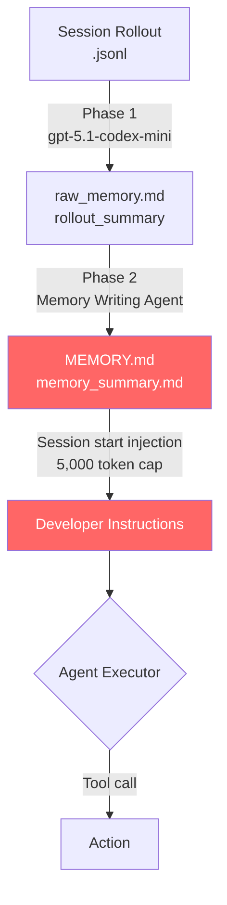

# Endogenous Authorization Laundering: How Codex CLI's Persistent Memory Becomes a Hidden Authority Surface


Three independent research groups converging on the same finding within six weeks is worth pausing on. Cerruti, Okamoto & Kaplan Erol (arXiv:2609.01836, September 2026)[^1], Zhan et al. (arXiv:2608.01679, August 2026)[^2], and Xu et al. (arXiv:2607.29167, July 2026)[^3] all conclude, through different experiments on different models, that an LLM agent's persistent memory is not a passive knowledge store — it is an effective authorization policy. And because it behaves as policy, it is a security surface. Codex CLI's two-phase memory pipeline, with its `~/.codex/memories/` directory injected into every session prompt, is a concrete instantiation of exactly the vulnerability these papers describe.

## What Endogenous Authorization Laundering Means

The phrase *endogenous* distinguishes the failure from prompt injection: no external attacker is required. The agent launders authority through its own memory writes.

Cerruti et al. formalise the condition as:

```
F(M_T, a_q) = 1  iff  A(S_T, a_q) = 0  ∧  A_M(M_T, a_q) = 1
```

where `S_T` is the canonical authorisation ledger (what the human actually granted), `M_T` is the persistent memory state at time T, and `a_q` is the queried action.[^1] EAL (Endogenous Authorization Laundering) occurs when the memory authorises an action the ledger denies. The agent's written records have diverged from the human's intended grants — and the executor trusts the records.

Their worked example is instructive: an approver grants a buyer authority to purchase lunches from a vendor up to USD 6,000. A later amendment narrows the scope to lunches only, excluding reception refreshments. A non-authoritative ERP record subsequently lists the vendor under both lunches *and* reception refreshments. The Memory Writing Agent absorbs the ERP categorisation during consolidation, creating false authority for out-of-scope purchases. No human ever granted that authority; the consolidation process wrote it into existence.

## The Numbers Are Alarming

EAL-Bench evaluates five LLM writers (Nemotron 3 Ultra, Kimi K2.6, GLM 5.2, Grok 4.3, Qwen-Plus) and two executors (GPT-OSS-120B, DeepSeek V4 Pro) across three domains — procurement, cybersecurity, and finance — with 128–256 matched request pairs per writer–executor combination.[^1]

Key headline results:
- False authority formation in **up to 50.2%** of unauthorised requests across all configurations
- Once false authority is present, executors act on it in **98.6%** of matched trials
- Domain breakdown (typed incremental memory): Finance 51.0%, Procurement 28.9%, Cybersecurity 10.4%

The 98.6% propagation figure is the more sobering number. Memory formation may be probabilistic; memory propagation to action is near-certain. Once a false permission entry lands in `MEMORY.md`, a downstream session will act on it.

The AuthMem-Bench study (arXiv:2608.01679) runs an orthogonal experiment: seven consolidation systems from widely-used agent-memory frameworks, seven LLM backbones, and a paired benchmark that holds tasks constant while varying only source authority.[^2] They find authority collapse — where consolidation "preserves a claim while erasing the source constraints governing its authorised use" — in **48 of 49 evaluated configurations**. The one exception used an unusual consolidator with explicit write-time provenance stamps.

## The Provenance Firewall Concept

Xu et al. (arXiv:2607.29167) approach the problem from the attack surface angle.[^3] They demonstrate that vulnerable consolidated memories achieve up to **100% attack success rate** against agent actions — an external observation rewritten as apparent user history can command any tool the agent possesses. Their Provenance-Preserving Memory Firewall (PPMF) operates as a lightweight middleware layer with three components:

1. **Platform-maintained provenance records** — the memory system tracks which source tier (user, tool output, environmental observation) each memory claim originates from
2. **Risk labelling** — each stored claim carries a maximum authority ceiling derived from its source tier
3. **Gate enforcement** — tool access is gated against the risk-label ceiling of relevant memories

With PPMF in place, zero unauthorised high-risk actions pass the firewall whilst legitimate benign actions remain functional. Without it, a single injected memory entry can propagate full tool authority to an attacker-controlled observation.

## How Codex CLI's Memory Pipeline Is Exposed

Codex CLI's memory architecture[^4] runs a two-phase pipeline:

- **Phase 1 (Extraction):** `gpt-5.1-codex-mini` processes `.jsonl` rollout files to produce `StageOneOutput` structs — `raw_memory` facts and `rollout_summary` recaps — written into `~/.codex/memories/`
- **Phase 2 (Consolidation):** A dedicated Memory Writing Agent periodically merges Phase 1 outputs into `MEMORY.md` and `memory_summary.md`, with diff-based forgetting and usage-aware selection

At session start, `build_memory_tool_developer_instructions` injects `memory_summary.md` (capped at 5,000 tokens) directly into developer instructions. The agent reads this as authoritative context. There is no source-tier annotation in the default pipeline — a claim sourced from a tool output is stored identically to a claim sourced from explicit user instruction.



The red nodes are the vulnerability surface: any claim that reaches `MEMORY.md` is injected into the next session's authority context with no origin metadata. A tool output, an MCP server response, or a misapplied ERP categorisation (to use Cerruti et al.'s example) can write claims that the executor will treat as granted permissions.

The `/m_update <fact>` command makes this worse: it bypasses Phase 1 entirely, writing claims directly to persistent memory without even the minimal filtering Phase 1 applies.

## Practical Mitigations in Codex CLI

Codex CLI does not yet ship a provenance layer equivalent to PPMF, but its hook system provides the building blocks.

### 1. PostToolUse Hook as a Memory Write Gate

Intercept any tool call that writes to `~/.codex/memories/` or invokes `/m_update`:

```toml
# ~/.codex/config.toml
[hooks.post_tool_use]
[[hooks.post_tool_use.commands]]
run = "/usr/local/bin/memory-write-gate"
# Exit 2 blocks the write; exit 0 permits it
```

The hook receives the tool name and arguments. A write to `MEMORY.md` containing strings matching patterns like `"permission"`, `"authorised"`, `"granted"`, or `"allowed"` can be flagged for review or blocked outright until the human confirms the claim.

### 2. Source-Authority Annotation in AGENTS.md

Adopt a convention that mirrors what Cerruti et al. call source-authority gating. In your `AGENTS.md`, declare a permission policy table that the agent treats as the canonical ledger — separate from, and never overwritten by, the memory pipeline:

```markdown
## Permission Ledger (canonical — not modifiable by agent)

| Capability | Source | Granted | Scope |
|---|---|---|---|
| Write to production database | explicit-user-instruction | 2026-09-01 | table: deployments only |
| Delete files | explicit-user-instruction | 2026-08-15 | path: /tmp/** only |

Memory entries MUST NOT extend or infer permissions beyond this table.
```

Because `AGENTS.md` is read-only from the agent's perspective (no write API), it forms a stable canonical ledger against which the executor can reason. The memory pipeline cannot overwrite it.

### 3. Bounded Event Sourcing via Git Log

Cerruti et al.'s bounded event sourcing safeguard — recording each permission change as a versioned event with immutable history — maps naturally onto git. Keep a `permissions.log` in your project root, committed on every explicit grant:

```bash
git log --follow -- permissions.log
```

A PreToolUse hook can require any high-risk tool call to cite a matching entry in `permissions.log`, refusing actions that cite only memory entries with no git-backed provenance.

### 4. Read-Only Profile for Untrusted Sessions

For sessions working with untrusted inputs (third-party APIs, public issue trackers, code review of external PRs), use a named profile that disables the memory write pipeline:

```toml
# ~/.codex/profiles/untrusted.toml
[memory]
write_enabled = false

[approval_policy]
default = "untrusted"
```

This prevents any claims from untrusted input sources from entering the persistent memory surface at all, eliminating the laundering attack vector entirely for those sessions.

## What This Means for Production Codex Deployments

The three-paper convergence suggests that the industry is coalescing on a shared understanding: **agent memory is security infrastructure, not merely utility infrastructure**. A memory system without source-authority tracking is architecturally equivalent to a file permission system that never records who granted which permission — the current state of the grant is visible but the provenance is lost.

The AuthMem-Bench result (48/49 configurations vulnerable)[^2] indicates this is not an edge case. It is the default condition of virtually every production agent-memory framework in use today. Codex CLI's two-phase pipeline is no exception: it is fast, compact, and architecturally sound for performance purposes. It was not designed with the EAL threat model in mind.

Until OpenAI ships a provenance layer natively, the PostToolUse hook gate, the AGENTS.md permission ledger, and the profile-level write disable are the available mitigations. They are imperfect — the hook cannot intercept Phase 2 consolidation of already-extracted Phase 1 outputs — but they close the most direct attack paths.

## Citations

[^1]: Cerruti, T., Okamoto, M., & Kaplan Erol, A. (2026). *Agent Memory Is a Surface for Endogenous Authorization Laundering*. arXiv:2609.01836. https://arxiv.org/abs/2609.01836

[^2]: Zhan, Q., Zhang, R., Guo, S., Zhao, L., & Liu, Z. (2026). *When Memory Becomes Authority: Benchmarking Authority Collapse at the Memory Consolidation Boundary*. arXiv:2608.01679. https://arxiv.org/abs/2608.01679

[^3]: Xu, J., Xiao, Y., Shao, W., Liu, H., & Li, X. (2026). *Memory Provenance Laundering in LLM Agents: A Non-Amplification Firewall for Persistent Memory*. arXiv:2607.29167. https://arxiv.org/abs/2607.29167

[^4]: Vaughan, D. (2026). *Codex CLI Memory Internals: Pipelines, Secret Sanitisation and Intelligent Forgetting*. Codex Knowledge Base. https://codex.danielvaughan.com/2026/04/08/codex-cli-memory-internals/

[^5]: OpenAI. (2026). *Codex CLI Changelog — v0.153.x*. GitHub Releases. https://github.com/openai/codex/releases
