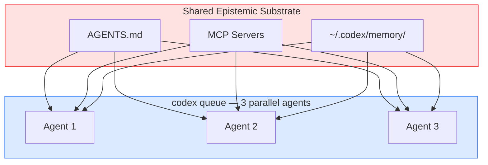

# The Illusion of Independent Quorums: Epistemic Fault Domains and What They Mean for Codex CLI Multi-Agent Safety


## The Problem Nobody Is Talking About

You run three Codex agents in parallel via `codex queue` to review a security-policy mutation. They all agree. The change ships. Infrastructure breaks.

The agents weren't rogue — they shared a corrupted evidence package (the same MCP backend, the same cached telemetry, the same AGENTS.md) and failed simultaneously in the same direction.

He and Yu's "The Illusion of Independent Quorums: Epistemic Fault Domains and Correlated Cognitive Failures in Agentic Quorums" (arXiv:2609.02925)[^1] formalises this failure mode with a 120-task benchmark. The core finding: distinct reviewers that share upstream dependencies don't compose into a resilient quorum — they collapse into a single point of failure that merely *looks* robust. Every Codex CLI operator using Guardian review, `--approve-for-me`, or parallel `codex queue` agents should understand the metric it introduces.

## Epistemic Fault Domains: The Formal Model

### What an EFD Is

An **Epistemic Fault Basis** (ℬ) is the set of modelled exogenous fault events — corrupted telemetry, poisoned tool outputs, compromised document stores — against which you measure a quorum's resilience.[^1]

An **Epistemic Fault Domain** (EFD) is the set of agents structurally reachable from a single fault in that basis. Formally, the exposure map D: ℬ → 2^Q maps each modelled fault *c* to the reviewers it can reach.

### The κ_E Metric

The key metric is the **Structural Epistemic Cut** (κ_E):

```
κ_E^{ℬ,D}(Q,ϕ,t,Γ) = min{|C| : C ⊆ ℬ,
                       ∃ minimal decisive coalition W,
                       W ⊆ ⋃_{c∈C} D_Q(c)}
```

In plain English: κ_E is the minimum number of distinct fault roots that, when activated, can compromise a decisive coalition. A 3-of-5 quorum where three reviewers share a single telemetry feed has **κ_E = 1** — one corrupted feed breaks three votes simultaneously, and the quorum authorises an unsafe action.[^1]

The paper proves two theorems that should make every multi-agent designer uncomfortable:

- **Cardinality Insufficiency (Theorem 2):** Adding more agents cannot repair a structural deficit. Arbitrarily large quorums retain κ_E = 1 when their exposure graphs overlap sufficiently.[^1]
- **Fixed-Threshold Monotonicity (Corollary 1):** If κ_E < k_min at quorum size q, then every compatible extension (bigger quorum, same threshold) also has κ_E < k_min. You cannot vote your way to independence.[^1]

### The Four Quorum Protocols (Q1–Q4)

The authors ran their 120-task benchmark (covering infrastructure deletion, security policy mutation, IAM authorisation, deployment rollback, and document compliance) across four quorum configurations under a 2-of-3 majority rule:

| Protocol | Models | Evidence | κ_E | Unsafe commit rate |
|----------|--------|----------|-----|-------------------|
| Q1 | same model × 3 | shared E1 | 1 | 97.3% |
| Q2 | diverse models × 3 | shared E1 | 1 | 96.8% |
| Q3 | same model × 3 | separated E1/E2/E3 | 2 | 6.7% |
| Q4 | diverse models × 3 | separated E1/E2/E3 | 2 | 6.7% |

The striking finding: Q1 → Q2 (adding model diversity, keeping shared evidence) reduces unsafe commit rate by only **0.5 percentage points**. Model diversity alone is nearly worthless. Evidence-path separation alone (Q3) reduces failure **14.5×**; both together (Q4) achieves **670×** reduction under unanimity.[^1] Using GPT-6-Astra for one reviewer and Codex Sol for another provides negligible safety unless they also draw on independent evidence sources.

## Where Codex CLI Exposes κ_E = 1

### Guardian Review: Shared Context, Shared Failure Mode

Codex CLI's Guardian reviewer (the LLM that audits agent actions before execution) has been strengthened in recent releases: v0.153.0 added Guardian history persistence across compaction, restarts, and user-forks (PRs #41879, #42065).[^2] That's operationally useful — the reviewer retains a continuous record of agent actions — but it also means Guardian shares an increasingly rich context history with the agent it reviews.

Under the EFD framework: if the agent's reasoning and the Guardian's reasoning both derive from the same conversation history, compacted context, and AGENTS.md snapshot, they share an epistemic fault domain. A corrupted AGENTS.md instruction or a silently wrong tool result in the shared context will propagate to *both* sides of the review. κ_E = 1.

### `--approve-for-me`: A Quorum of One

The `--approve-for-me` flag (introduced in v0.147.0) spawns a Guardian sub-agent to automatically approve low-risk actions.[^3] This is a guardian pattern designed for efficiency, not resilience. The approving agent reads from the same session context, tool backends, and environment as the acting agent. The approval is not an independent epistemic check — it's a stylised self-review. Per the paper's formal model, this is Q1 at best: same model family, same evidence, κ_E = 1.

For automation workflows, this is often acceptable: you're not seeking fault tolerance, you're reducing friction. But engineers who configure `--approve-for-me` believing it adds a safety layer need to understand what it actually provides — speed, not independence.

### Parallel Agents via `codex queue`: Shared Backend Risk

`codex queue` (introduced in v0.149.0) enables multiple agents running concurrently, each working on independent tasks.[^4] Each agent operates in its own session, but unless explicitly configured otherwise, all agents share:

- The same MCP server backends
- The same AGENTS.md from the repository
- The same plugin catalogue (v0.153.0)
- The same `~/.codex/memory/` state

If any of those shared resources are compromised — a poisoned memory entry, a lying MCP tool — every concurrent agent inherits the fault. The quorum formed by N parallel agents has κ_E = 1 with respect to that shared backend.



A fault in the shared substrate reaches all three agents simultaneously. Cardinality doesn't help.

## Implementing DAQC Patterns in Codex CLI

The paper's **Dependency-Aware Quorum Controller (DAQC)** separates prospective selection (choose reviewers with disjoint planned exposure) from commit-time admission (block authorisation if realised exposure is insufficient). Here's how to approximate this within Codex CLI's current primitives:

### Separate Evidence Paths with Agent Profiles

Use AGENTS.md named profiles to give Guardian and agent different MCP server access:

```toml
# .codex/config.toml

[profile.worker]
mcp_servers = ["primary-db", "tool-api"]

[profile.reviewer]
mcp_servers = ["audit-db", "readonly-api"]  # distinct backends
```

When Guardian review uses `reviewer` profile, its tool calls resolve against different backends than the acting agent. If `primary-db` is compromised, `audit-db` remains clean — evidence paths separate, κ_E improves.

### PostToolUse Hook as DAQC Admit Gate

Implement a lightweight commit-time admission check as a PostToolUse hook that blocks `apply_patch` when the reviewer and agent share tool-call history. Inspecting `CODEX_TOOL_METADATA` for overlap and returning exit code 2 forces a replan, replicating the DAQC `RECONFIGURE_REQUIRED` state.[^1]

### Separate Model Backends for Review

Per He and Yu's Q3/Q4 results, evidence-path separation matters more than model diversity. But when both are achievable:

```toml
# Use a different model for Guardian review
[guardian]
model = "gpt-6-astra"         # or: codex-sol, o4-mini

[tools.agent]
model = "codex-sol"
```

Codex CLI's Guardian respects per-session model configuration. Running Guardian on a model with a different training distribution from the acting agent marginally reduces correlated failure under shared evidence; it becomes meaningfully useful when combined with evidence separation.

### Worktrees as EFD Boundaries

Git worktrees provide the most robust shared-substrate isolation in Codex CLI today. Each worktree gets its own AGENTS.md and workspace state, and can point at distinct MCP server configurations. Run the acting agent on the feature branch and the reviewer on `main` — they share git history but not workspace state, giving a practical partial separation at κ_E = 2.

## The Right Question to Ask

Codex CLI's `approval_policy` tiers — `auto`, `on-failure`, and `manual` — are not just about human oversight; they define how much epistemic independence you can guarantee. PostToolUse hooks are process-isolated from the agent and cannot inherit a corrupted agent context, making them the closest Codex CLI currently gets to a DAQC admit gate. Human `manual` review is a fully independent epistemic path — provided the reviewer consults different evidence than the agent presented.

Before deploying any multi-agent workflow — `codex queue` parallelism, Guardian review, or `--approve-for-me` automation — the right question is not "how many agents are reviewing this?" It is: **what is the minimum number of upstream faults that could compromise all reviewers simultaneously?**

If the answer is one, you have a single point of failure regardless of headcount. The fix is evidence-path separation, not more agents.

## Citations

[^1]: He, J. & Yu, D. (2026). "The Illusion of Independent Quorums: Epistemic Fault Domains and Correlated Cognitive Failures in Agentic Quorums." arXiv:2609.02925. <https://arxiv.org/abs/2609.02925>

[^2]: OpenAI. (2026). Codex CLI v0.153.0 release notes. Guardian history persistence (PRs #41879, #42065). <https://github.com/openai/codex/releases/tag/rust-v0.153.0>

[^3]: OpenAI. (2026). Codex CLI v0.147.0 release notes. `--approve-for-me` Guardian sub-agent. <https://github.com/openai/codex/releases/tag/rust-v0.147.0>

[^4]: OpenAI. (2026). Codex CLI v0.149.0 release notes. `codex queue` and Codex agents dashboard. <https://github.com/openai/codex/releases/tag/rust-v0.149.0>

[^5]: He, J. & Yu, D. (2026). "The Honest Quorum Problem: Epistemic Byzantine Fault Tolerance for Agentic Infrastructure." arXiv:2607.16109. <https://arxiv.org/abs/2607.16109>
