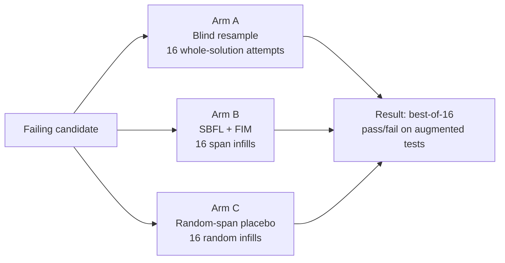
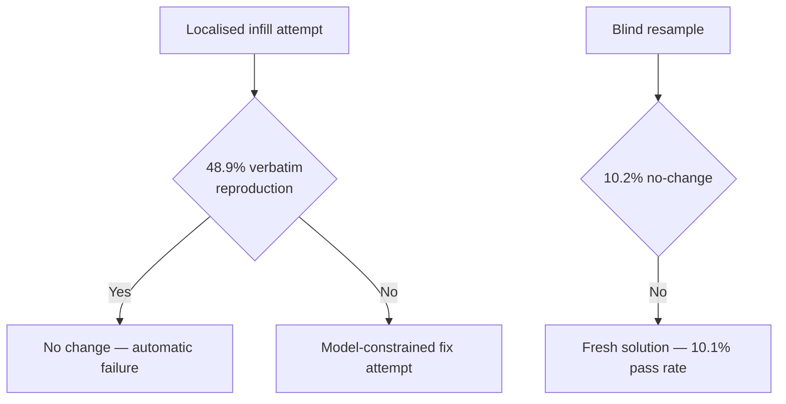

# Fresh Beats Focused: The Placebo-Controlled Study That Should Reshape How Codex CLI Agents Retry Code Repair


The intuition is hard to argue with: if a test fails, pinpoint the guilty statement using coverage data, then have the model infill just that span. Targeted repair must outperform spraying whole solutions at the wall. A September 2026 paper by Jha puts that intuition through a three-arm, placebo-controlled trial and finds the opposite. Blind resampling — generating a fresh complete solution with no failure information — wins decisively, and at a fraction of the token cost.[^1]

The implications for Codex CLI's repair loop design are direct and uncomfortable.

## The Experimental Design

Jha's study (arXiv:2609.00854) tests three arms on the same set of failing code candidates, each arm receiving K=16 stochastic samples at temperature 0.8, nucleus probability 0.95:[^1]

- **Arm A — Blind resampling**: Generate a fresh complete solution, no failure context provided.
- **Arm B — SBFL+FIM**: Run spectrum-based fault localisation (SBFL) on available test traces, identify the highest-suspicion span, replace it via fill-in-the-middle (FIM) prompting.
- **Arm C — Random-span placebo**: Replace an equally-sized span at a randomly chosen location — the control for whether *any* span replacement helps, regardless of localisation quality.

Four model families were tested: Qwen2.5-Coder-32B-Instruct-AWQ, Qwen3.6-27B, Gemma-4-26B-A4B-it, with an independent replication on Mistral-Small-3.2-24B. The corpus was 488 failing candidates drawn from HumanEval+, MBPP+, and LiveCodeBench. All tests used augmented hidden test suites unavailable to the model at generation time.[^1]



## The Spectrum Availability Problem

Before Arm B can run, SBFL needs a usable failure spectrum — at least one failing public test that exercises the suspicious lines. In practice, **only 9.0% of the 488 failing candidates expose a usable spectrum**.[^1] The dominant reason: 212 candidates pass every public test and fail only hidden ones. SBFL is blind to failures it cannot observe.

This single finding has immediate operational consequences. Any Codex CLI workflow that routes failing code through a fault-localisation step is burning tokens and latency on a path that is inaccessible for over 90% of real failures. The elaborate pipeline exists for a minority case.

## The Central Result

Within the 9% where spectra are available, localised infilling still lost decisively to blind resampling when matched for attempt count: **3 wins to 40 losses, p = 3.0 × 10⁻⁹**.[^1]

| Strategy | Success rate (per attempt) |
|---|---|
| Blind resampling | 10.1% |
| SBFL + FIM | 4.4% |
| Random-span placebo | ~4% (pooled) |

The Mistral-Small-3.2-24B replication confirmed the direction: **0.6% for localised vs 11.9% for blind**, a −11.3 percentage point gap. The localisation step is anti-helpful on these benchmarks. The random-span placebo showed marginal advantage over the localised arm (pooled 11:1, Holm p = .019), but this effect "resolves in no individual model under per-model attempt-level analysis."[^1]

## Why Localised Infilling Fails: Verbatim Reproduction

The mechanism is not mysterious. Fill-in-the-middle prompting fixes both the prefix and the suffix context. When the model infills between a fixed start and fixed end, it frequently regenerates the removed span character for character: **48.9% of localised attempts and 41.4% of placebo attempts leave the programme unchanged**.[^1] The model sees both sides of the cut and infers the most probable bridge — which is usually what was already there.

By contrast, blind whole-solution resampling produced unchanged output in only **10.2% of attempts**. Distinct programme production rates make the gap stark: blind resampling 0.83, random-span placebo 0.31, localised infilling 0.23.[^1]



## Token Economics Invert the Calculation

Localised infilling looks cheaper per call: a span replacement averages **21.7 generated tokens** vs **371.1 for a whole solution**.[^1] But this apparent efficiency evaporates when you account for effectiveness. A single blind attempt achieves 10.1% success; 16 localised attempts collectively only reach 6.8%. Even re-pricing all attempts as equivalent token budgets, the whole-solution arm dominates below the 372-token threshold — one fresh attempt outperforms 16 targeted infills in expected pass rate per token spent.

This is the standard best-of-N insight applied cleanly: if the sampling distribution has reasonable coverage of correct solutions, the cheapest path to a passing programme is maximising distinct attempts, not constraining the generation space.

## Five Implementation Defects Hiding in Your Repair Loop

Jha identified five defects in the study's own implementation that *silently changed measured results* before correction:[^1]

1. **Unconstrained placebo spans landing in docstrings** — weakened the control arm, making localisation look relatively better than it was.
2. **Single-line selection by ordering rather than evidence** — selected the wrong suspect line, weakening SBFL quality.
3. **Indefensible flat timeout rule** — changed candidate classification in a non-evidence-based way.
4. **Unregistered FIM terminators** causing unparseable splices in **13.4% of localised attempts** — silently misclassified as failures.
5. **Closed-fence extraction returning truncated completions** — misclassified partial outputs as failures.

Practitioners building repair pipelines face the same class of defect. A PostToolUse hook that parses test output to identify failing lines and generates a targeted infill will silently misbehave on the same edge cases unless each path is explicitly tested. The paper's lesson is not just "don't use SBFL" — it is "your repair loop has unexamined failure modes you are not measuring."

## What Fault Localisation Context *Does* Help With

The Jha result should not be generalised to "localisation is always useless." A companion empirical study on SWE-bench (arXiv:2604.05481) found that **file-level localisation delivers a 15–17× improvement over a no-file baseline**.[^2] The contrast is instructive:

- **File-level context**: tells the model *which files* are relevant — huge positive effect.
- **Line-level suspect spans**: tells the model *exactly which lines* are wrong and constrains the solution space via FIM — negative or negligible effect.

Element-level context (function/class) showed conditional benefit, while line-level expansion "frequently degrades performance due to noise amplification."[^2] The implication is that routing Codex CLI to the right files is valuable; routing it to a specific infill target is counterproductive.

## Codex CLI Configuration Implications

### Prefer `--attempts` Over Targeted Infill Pipelines

The `--attempts N` flag (available in `codex cloud exec`) implements best-of-N semantics natively.[^3] For CI pipelines where tests fail, prefer:

```bash
codex cloud exec --attempts 3 "Fix the failing test in $(git diff --name-only)"
```

over constructing a SBFL-driven infill prompt. The former generates three independent whole-session attempts; the latter likely wastes tokens on verbatim reproduction.

### Use PostToolUse Hooks as Test Gates, Not Repair Routers

A common pattern routes failing test output back into a targeted fix loop:

```toml
# config.toml — avoid this pattern for test failures
[hooks.post_tool_use]
  [[hooks.post_tool_use.hooks]]
    name = "test-gate"
    command = ["bash", "-c", "pytest --tb=short 2>&1 | head -50"]
    on_output = "inject_failing_spans"  # 🚩 likely counterproductive
```

The evidence suggests a simpler hook: run tests, exit with code 2 if they fail, let the agent determine its next action from the full test output without pre-filtering to suspect spans.

```toml
[hooks.post_tool_use]
  [[hooks.post_tool_use.hooks]]
    name = "test-gate"
    command = ["bash", "-c", "pytest --tb=short && exit 0 || exit 2"]
    run = ["apply_patch"]
```

Exit code 2 signals the agent to reconsider its last action. Providing the full test output — not a pre-extracted suspect span — leaves the model free to resample a whole-solution approach or take a different fix path.

### AGENTS.md Repair Strategy Declaration

Declare the preferred repair strategy explicitly so the model does not invent a complex localisation loop:

```markdown
## Repair Strategy

When tests fail after a patch:
1. Read the full test output.
2. Generate a fresh replacement for the entire function or class under test.
3. Do not attempt line-level infilling into an existing implementation.
4. If three fresh attempts fail, escalate to the user rather than continuing to retry.
```

This is a direct encoding of the paper's finding into the agent's operating contract. It also prevents the five silent-failure modes that plague infill pipelines: unconstrained placebo zones, mis-selected suspect lines, and FIM terminator gaps.

### File-Level Localisation Remains Valuable

Consistent with arXiv:2604.05481, file-level routing is worth preserving.[^2] A PreToolUse hook that extracts the failing file name from pytest output and passes it as context gives the agent the beneficial half of localisation — narrowed scope without constrained generation:

```bash
# Extract failing file from pytest JSON report
FAILING_FILE=$(jq -r '.tests[] | select(.outcome=="failed") | .nodeid | split("::")[0]' report.json | head -1)
echo "Focus repair on: $FAILING_FILE"
```

## The Wider Lesson

The study is an argument for measuring your retry strategy rather than assuming it is helpful. Organisations that have instrumented repair loops with SBFL often find them sophisticated, interpretable, and apparently principled. But sophistication is not the same as effectiveness. A controlled baseline — even a random-span placebo — can stop you deploying a complex pipeline where a fresh attempt does as well or better, cutting engineering and inference cost simultaneously.[^1]

For Codex CLI, this translates to a preference for short, independent sessions with fresh context over complex intra-session repair choreography. The agent's ability to reconstitute the problem from scratch, without the cognitive bias of a fixed prefix and suffix, is precisely what best-of-N whole-solution resampling exploits.

## Citations

[^1]: Jha, S. (2026). *Does Fault Localization Beat a Fresh Attempt? A Placebo-Controlled Study of Test-Guided Code Repair*. arXiv:2609.00854. https://arxiv.org/abs/2609.00854

[^2]: Kang, S., Liu, S., & Li, Z. (2026). *On the Role of Fault Localization Context for LLM-Based Program Repair*. arXiv:2604.05481. https://arxiv.org/abs/2604.05481

[^3]: PahVenture. (2026). *Automated Code Repair with Codex CLI and GitHub Actions*. GitHub. https://github.com/PahVenture/example-codex-ci

[^4]: OpenAI. (2026). *Codex CLI Releases*. GitHub. https://github.com/openai/codex/releases

[^5]: Tamoyan, G. et al. (2026). *SHERLOC: Structured Diagnostic Localization for Code Repair Agents*. arXiv:2606.24820. https://arxiv.org/abs/2606.24820
