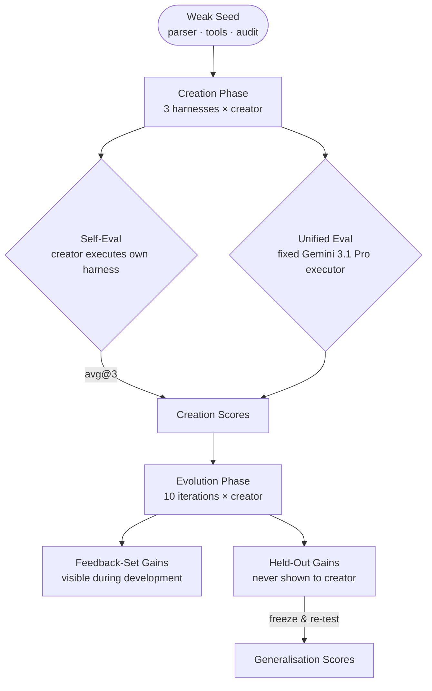

# HarnessDev: Can LLMs Build Their Own Scaffolding — and What the Results Say About Codex CLI Design


## The Question Behind the Benchmark

Every coding agent is a product of two things: model weights and the harness — the loop, tools, memory, and control flow that wrap them. Changing the harness while holding weights fixed can shift benchmark performance by 30 points or more.[^1] What has remained unanswered is the inverse: can the model itself author a harness that is good enough to matter?

That is the question posed by **HarnessDev** (arXiv:2609.01437), submitted to arXiv on 8 September 2026 by Wu, Zhang, Shi, Lei and 15 co-authors.[^2] The paper introduces a two-stage benchmark — *Creation* and *Evolution* — and evaluates six frontier models across four domains and 2,207 downstream task instances. Its findings are immediately actionable for anyone designing Codex CLI workflows, because Codex served as one of the two reference harnesses for the study's own development environment.[^3]

## Benchmark Architecture

HarnessDev gives each creator model the same starting point: a **weak seed** — a minimal, runnable harness that scores zero on every benchmark. The seed supplies parsing, a tool registry, and an audit log, but deliberately omits an execution loop, tool policy, state management, and verification logic. From that base the model must build a complete agent harness.

The four domains and their corresponding benchmarks:

| Domain | Benchmark | Human reference |
|---|---|---|
| Code | SWE-Pro | 80.0% |
| Code | Terminal-Bench 2.1 | 88.8% |
| Writing | EQ-Bench3 | 83.7 |
| Data analysis | MLE-bench (medal rate) | 24.0 |
| Search / research | BrowseComp | 92.2% |

The six **creator LLMs** are Opus 4.8, GPT-5.5, Gemini 3.1 Pro, DeepSeek V4 Pro, Qwen 3.7 Max, and Seed 2.0 Pro. Each model was given Claude Code 2.1.177 as its harness development environment; GPT-5.5 used Codex CLI 0.144.3 — making Codex a first-class tool in the study itself.[^3]



## Creation: Where Models Succeed and Where They Fall Short

Under **self-evaluation** (each creator executes its own harness), Opus 4.8 leads the field with an overall score of 67.8 against a human-engineered reference of 86.2. The full ranking:[^2]

| Creator | Self-eval score | vs. Human (86.2) |
|---|---|---|
| Opus 4.8 | 67.8 | −18.4 |
| Gemini 3.1 Pro | 55.6 | −30.6 |
| GPT-5.5 | 55.1 | −31.1 |
| DeepSeek V4 Pro | 45.2 | −41.0 |
| Qwen 3.7 Max | 44.0 | −42.2 |
| Seed 2.0 Pro | 22.8 | −63.4 |

Domain performance is asymmetric: Opus's EQ-Bench3 score of 84.6 exceeds the human reference of 83.7, and MLE-bench medal rate 32.9 beats the human 24.0.[^2] Code and research run the other direction — Opus on BrowseComp reaches 52.4% against a human 92.2%. The 18 generated code harnesses added a median of 17,111 net lines, and only **1 of 18** implemented periodic checkpointing.[^2]

## The Executor Dependence Problem

The most operationally significant finding is what happens when you remove self-evaluation bias. When the paper locks the executor to a **fixed Gemini 3.1 Pro runtime** (the same model evaluates every harness), scores collapse:

| Creator | SWE-Pro self-eval | SWE-Pro unified | Delta |
|---|---|---|---|
| Opus 4.8 | 69.3% | 33.0% | **−36.3pp** |
| GPT-5.5 | (code benchmark) | substantial drop | — |
| Qwen 3.7 Max | BrowseComp 32.3% | 49.9% | **+17.6pp** |

Opus's SWE-Pro score more than halves under unified evaluation.[^2] Qwen's BrowseComp score *improves*, because Qwen had inadvertently tuned for its own reasoning patterns — which happened to match Gemini's on search tasks. A harness that scores well when its creator runs it is evidence of self-optimisation, not general quality.

This maps directly to the `codex queue` model-routing problem: a harness authored under o3 may degrade when submitted to GPT-5.5 Sol, and vice versa.

## Evolution: Gains That Do Not Generalise

In the Evolution phase, each model refines its harness over ten rounds using execution feedback from a visible development set. Visible gains are real:[^2]

- Qwen: +13.9 points on the paired benchmark
- DeepSeek: +13.4 points
- GPT-5.5: +5.9 points
- Opus: +3.0 points

Lock the executor to Gemini and evaluate on a held-out set, and most gains evaporate:

| Creator | Held-out (self-runtime) | Held-out (Gemini runtime) |
|---|---|---|
| Opus 4.8 | +4.44 | +2.70 |
| Qwen 3.7 Max | +1.43 | **−1.11** |
| DeepSeek V4 Pro | +3.17 | **−2.38** |
| GPT-5.5 | +3.81 | **−10.32** |

GPT-5.5 regresses by more than ten points — better on its own benchmark, worse in cross-model deployment.[^2] Of 64 official version switches examined:

- 58/64 modified execution or control flow
- 37/64 changed tool implementations
- Only 4/64 touched state mechanisms
- Only 2/9 declared "final" versions matched the creator's best held-out performance[^2]

Creators over-optimised for visible reward and failed to generalise. Only Opus showed consistent gains across both evaluation conditions.

## Companion Context

**HarnessX** (arXiv:2606.14249) shows that enforcing *compositional* structure — typed harness components assembled via a substitution algebra and trace-driven AEGIS engine — yields +14.5% average improvement across five benchmarks, with a maximum gain of +44.0%.[^4] Where HarnessDev allows unconstrained LLM authorship and observes overfitting to self-evaluation signal, HarnessX's structure prevents it.

**DemoEvolve** (arXiv:2605.24539) addresses sparse-feedback instability: injecting human expert trajectories as evolution demonstrations makes harness changes "more diagnosable, localisable, and stable" in long-horizon settings where reward signal alone misleads.[^5]

## Mapping to Codex CLI

### Executor dependence → model-aware AGENTS.md profiles

When a harness degrades under a different executor, the fix is profile isolation. Named configuration profiles in `~/.codex/config.toml` let you maintain separate instruction sets per model:

```toml
[profiles.sol-impl]
model = "o3"
approval_policy = "auto-edit"

[profiles.astra-review]
model = "gpt-6-astra"
approval_policy = "on-failure"
```

Use `codex --profile sol-impl` for implementation and `codex --profile astra-review` for verification. AGENTS.md content optimised for one model's reasoning patterns will not transfer unchanged to another.

### Evolution instability → controlled AGENTS.md versioning

Of 64 version switches in HarnessDev, 58 hit execution or control flow, only 4 touched state mechanisms, and only 2/9 final versions matched best held-out performance.[^2] The Codex CLI equivalent is undisciplined AGENTS.md editing: changes alter the implicit harness without a measurable baseline. Version AGENTS.md in git and run a fixed task suite before and after any change — treat it with the same regression discipline as production code.

### Missing checkpointing → `tui.auto_recap` and session design

Only 1 of 18 LLM-generated harnesses implemented periodic checkpointing — models assume continuous sessions.[^2] Codex CLI's `tui.auto_recap` key (v0.153.0)[^6] provides exactly this — state externalisation before context pressure forces lossy compaction:

```toml
# ~/.codex/config.toml
[tui]
auto_recap = true       # triggers recap before compaction threshold
```

For `codex queue` tasks, pair this with a PostToolUse hook that appends a structured progress record to `.codex/session-log.jsonl` on each `apply_patch` call — ensuring state survives compaction even if the session is interrupted.

### Self-evaluation inflation → objective acceptance criteria

The unified-evaluation finding — self-eval inflates Opus's SWE-Pro by 36 percentage points — has a direct Codex CLI analogue: an agent that declares its own task done is not the same as one whose output passes external tests. The standard fix is an AGENTS.md acceptance-criteria block that prohibits self-assessment:

```markdown
## Acceptance Criteria
Every task is complete ONLY when:
- All existing tests pass under `pytest -x`
- New behaviour has at least one new test
- `mypy --strict` exits 0

The agent MUST NOT mark a task done on self-assessment alone.
```

## Limitations and What Comes Next

HarnessDev covers single-model authorship only. Multi-agent co-authorship — one model writes the loop, another the tool policy, a pattern native to `codex agents` — is not in scope, nor is reinforcement-style continuous improvement. The code domain gap (best generated harness: 69.3% self-eval, 33.0% unified) suggests that the engineering discipline in Codex CLI's 1.1 million lines of Rust remains a durable advantage that automated synthesis has not closed.[^3]

## Citations

[^1]: Barbaste et al. (2026). "Harness Engineering: Anatomy, Architecture, and Evolution of Coding Agents — A Source-Code Study of Eleven Systems." arXiv:2609.00006. <https://arxiv.org/abs/2609.00006>

[^2]: Wu, Y., Zhang, J., Shi, J., Lei, X., Gu, Q., et al. (2026). "HarnessDev: Can LLMs Create and Evolve Their Own Agent Harness?" arXiv:2609.01437. <https://arxiv.org/abs/2609.01437>

[^3]: OpenAI. (2026). Codex CLI releases page. <https://github.com/openai/codex/releases>

[^4]: (2026). "HarnessX: A Composable, Adaptive, and Evolvable Agent Harness Foundry." arXiv:2606.14249. <https://arxiv.org/abs/2606.14249>

[^5]: (2026). "DemoEvolve: Overcoming Sparse Feedback in Agentic Harness Evolution with Demonstrations." arXiv:2605.24539. <https://arxiv.org/abs/2605.24539>

[^6]: OpenAI. (2026). Codex CLI v0.153.0 release notes — `tui.auto_recap` configuration key. <https://github.com/openai/codex/releases/tag/v0.153.0>
