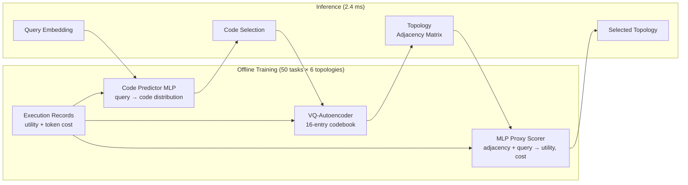
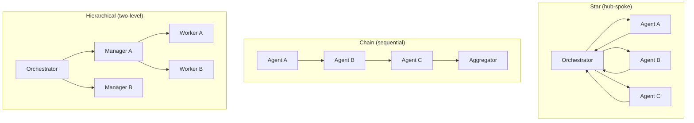

# Amortised Topology Design for Codex Multi-Agent Systems: What Codebook Agent Reveals


When you spawn three Codex subagents to tackle a codebase migration, you face an implicit topology decision: which agents talk to which other agents, and when. Most teams decide this by intuition — a hub-and-spoke pattern, a simple chain, or full-mesh "everyone knows everything". A paper published this week makes the case that topology choice is one of the highest-leverage configuration decisions you can make, and that the conventional wisdom about sparse graphs being cheaper is factually wrong.

## The Topology Problem in Multi-Agent Systems

Codex CLI's `multi_agent_v2` stack lets an orchestrator spawn subagents via `spawn_agent`, configure role-specific profiles in `.codex/agents/<role>.md`, and route results through `codex queue`[^1]. What it does not provide is any principled guidance on *how agents should be connected* — which subagent feeds its output into which other subagent before the result reaches the aggregator.

The research field has attacked this via learned topology designers: conditional graph generators that sample adjacency matrices for a given query and then rank candidates using a surrogate objective. Systems like GPTSwarm, G-Designer, ARG-Designer, TopoDIM, and GTD (a diffusion-based approach) represent the state of the art, reaching approximately 83.0% average accuracy across standard reasoning and coding benchmarks[^2].

**Codebook Agent** (Yu et al., arXiv:2609.02264, 2 September 2026)[^2] shows that the conditional-graph-generation framing rests on three empirical assumptions that are all false in practice.

## Three Observations That Break the Conventional Framing

### Observation 1: Design Space Collapse

When you filter the topologies that actually solve tasks and cluster them, they collapse to roughly **six distinct patterns**, regardless of how many entries you give the codebook (the paper tests 8, 16, 32, and 64 capacity). The encoder uses at most six codes even at K=64.

This means that prior methods spending compute to model the full N×N adjacency space are doing unnecessary work. For a four-agent team there are 2^12 = 4,096 possible directed graphs; in practice, the reward-filtering step reveals that only a handful are genuinely useful. Fixed hand-crafted topologies remain within 1.4 accuracy points of any generated topology.

For Codex CLI users: you almost certainly do not need a topology optimiser. You need a small catalogue of topology *patterns* matched to task type, and the discipline to pick the right one.

### Observation 2: Sparser Graphs Cost More Tokens

The standard surrogate objective used by prior topology designers penalises edge count, on the theory that fewer edges means fewer messages means lower cost. The paper measures actual token consumption and finds the opposite: **edge count and token consumption have a Pearson correlation of approximately −0.4**[^2]. Sparse graphs produce longer completions, apparently because agents working with less context compensate by generating more text.

This inverts one of the most common pieces of multi-agent tuning advice. The correct objective is measured token consumption, not structural sparsity.

### Observation 3: GNN Scorers Are Topology-Blind on Homogeneous Teams

Message-passing graph neural networks over agent-profile nodes are the standard candidate-ranking mechanism in prior systems. If all agents share the same profile (e.g., all are "Programming Expert"), the GNN produces *identical scores regardless of topology*, making ranking impossible without reading the adjacency matrix directly.

Homogeneous teams are the default configuration in every published benchmark, and they reflect real Codex CLI usage where you spawn multiple instances of the same base model with the same system prompt. The GNN-based ranker performs worse than random topology selection in this regime (1,711 tokens per query for GNN vs. 927 for the MLP approach vs. 1,249 for random)[^2].

## The Codebook Agent Architecture

Given these observations, the paper proposes a lightweight alternative:



The **VQ-autoencoder** compresses successful adjacency matrices into a 16-entry codebook. At inference, a reward-weighted MLP maps query embeddings to a distribution over codes, and the MLP proxy scorer (trained via regression on actual execution measurements, not structural surrogates) selects the best candidate[^2].

Results on six benchmarks using GPT-4o-mini:

| Benchmark | Codebook Agent | Prior Best (GTD) |
|-----------|---------------|-----------------|
| GSM8K     | 94.8%         | 93.5%           |
| MATH      | 56.5%         | 55.5%           |
| MultiArith| 99.4%         | 98.9%           |
| SVAMP     | 95.4%         | 93.0%           |
| MBPP      | 83.5%         | 80.4%           |
| HumanEval | 78.1%         | 77.5%           |
| **Average**| **84.62%**   | **83.02%**      |

Token savings range from 21.9% to 33.2% versus the prior best, achieved by the MLP proxy correctly optimising against measured cost rather than edge count.

## Mapping to Codex CLI

The paper's findings translate directly to practical Codex CLI multi-agent configuration, even without implementing a codebook system.

### The Six Topology Patterns

The collapsed design space suggests practitioners need roughly six canonical patterns. For a three- or four-agent Codex team using `spawn_agent` and `codex queue`:



In Codex CLI terms:

- **Star**: Orchestrator session issues tasks via `codex queue --session worker-a "..."` and aggregates results. Workers use `fork_turns: none` for clean context.[^1]
- **Chain**: Output of one `codex exec` invocation becomes `--input-file` for the next. Deterministic, cheap, no parallelism.
- **Hierarchical**: Two-level orchestration matching the `multi_agent_v2` + `codex queue` combination described in the v0.149.0 release.

The key insight from Observation 1: **pick one of these patterns per task type and stick to it**. You are almost certainly not missing gains from a more complex topology; the space has collapsed.

### Measuring Actual Token Consumption

Observation 2 demands that you measure what your topology actually costs, not what you expect it to cost. With Codex CLI's `codex exec --output-schema` and `PostToolUse` hooks, you can log token counts per turn:

```toml
# config.toml
[[hooks]]
event = "PostToolUse"
run = ["bash", "-c", "echo '{\"tokens\": $CODEX_TOKENS, \"topology\": \"$TOPOLOGY_NAME\"}' >> ~/.codex/topology-costs.jsonl"]
```

After 50 executions, a simple `jq '[group_by(.topology)[] | {topology: .[0].topology, avg: (map(.tokens) | add / length)}]' ~/.codex/topology-costs.jsonl` reveals your actual cost per pattern. You will likely find that the "lean" sparse topology you chose for economy is costing more tokens than the fuller one.

### Profile Homogeneity Warning

Observation 3 has a direct parallel: if your subagents all use the same model and the same system prompt, any scoring heuristic based on *role differentiation* is blind. If you want topology-aware optimisation to work, your agents must differ in meaningful ways — different models via named profiles, different tool subsets via `writable_roots` or `approval_policy`, or different AGENTS.md sections per `.codex/agents/<role>.md`.

```toml
# config.toml — differentiated profiles for topology-aware routing
[profiles.planner]
model = "gpt-6-astra"
instructions = ".codex/agents/planner.md"

[profiles.implementer]
model = "gpt-4o"
instructions = ".codex/agents/implementer.md"

[profiles.reviewer]
model = "o3"
instructions = ".codex/agents/reviewer.md"
```

Differentiated profiles also reduce the token-inflation effect from Observation 2, because each agent receives contextually appropriate, bounded prompts rather than generic ones that inflate completion length to compensate for missing context.

## Companion Work: Explainable Topology via Causal Inference

A companion paper, E2-Explainer (Li et al., arXiv:2608.12921)[^3], addresses a gap Codebook Agent leaves open: *why* does a particular topology work? E2-Explainer treats topology explanation as a causal attribution problem, using Granger-style masking to identify which communication edges actually drive task success versus which are redundant.

The practical value for Codex CLI users is post-hoc audit: given a topology that has been working well for three weeks, E2-Explainer's approach tells you which of the `codex queue` message routes you could remove without degrading results — reducing both complexity and cost.

## Summary

Codebook Agent (arXiv:2609.02264) makes three claims that should change how you configure Codex multi-agent sessions:

1. **Topology choice matters, but variety does not** — the effective design space has collapsed to roughly six patterns. Document your canonical topologies in AGENTS.md and stop searching.
2. **Sparse topologies are not cheap topologies** — measure actual token consumption across your patterns. The MLP proxy trained on measured cost, not edge count, finds the genuinely cheaper option.
3. **Scoring on role-homogeneous teams is blind** — if all your subagents look identical, any ranking heuristic based on agent profiles fails. Differentiate via model tier, tool scope, or role-specific instructions.

The overhead of collecting 50 calibration task executions and logging token consumption per topology is minimal. The performance gain — a 1.6-point accuracy lift and up to one-third token reduction — is not.

## Citations

[^1]: OpenAI (2026) "codex queue and Inter-Session Messaging: v0.149.0's New Primitive for Orchestration and Automation". Codex Knowledge Base. Available at: [https://codex.danielvaughan.com/2026/08/21/codex-queue-inter-session-messaging-codex-cli-v0149-orchestration-automation-agent-to-agent/](https://codex.danielvaughan.com/2026/08/21/codex-queue-inter-session-messaging-codex-cli-v0149-orchestration-automation-agent-to-agent/)

[^2]: Yu, J., Li, Y., Jiang, E.H., Zhang, Z., Liu, D., Zhao, W., Li, L., Chang, K.-W. and Wu, Y.N. (2026) "Codebook Agent: Amortized Topology Design for LLM Multi-Agent Systems", arXiv:2609.02264 [cs.AI]. Available at: [https://arxiv.org/abs/2609.02264](https://arxiv.org/abs/2609.02264)

[^3]: Li, J., He, P., Ji, Q., Wang, W., Liu, L. and Sun, C. (2026) "Discovering Efficient and Explainable Communication Topologies for LLM-based Multi-Agent Systems via Causal Inference", arXiv:2608.12921 [cs.AI]. Available at: [https://arxiv.org/abs/2608.12921](https://arxiv.org/abs/2608.12921)

[^4]: OpenAI (2026) "Codex CLI Multi-Agent Orchestration v2: Complete Guide". Codex Knowledge Base. Available at: [https://codex.danielvaughan.com/2026/04/11/codex-cli-multi-agent-orchestration-v2-complete-guide/](https://codex.danielvaughan.com/2026/04/11/codex-cli-multi-agent-orchestration-v2-complete-guide/)

[^5]: OpenAI (2026) "Subagents — Agent Configuration". ChatGPT Learn. Available at: [https://learn.chatgpt.com/docs/agent-configuration/subagents](https://learn.chatgpt.com/docs/agent-configuration/subagents)
