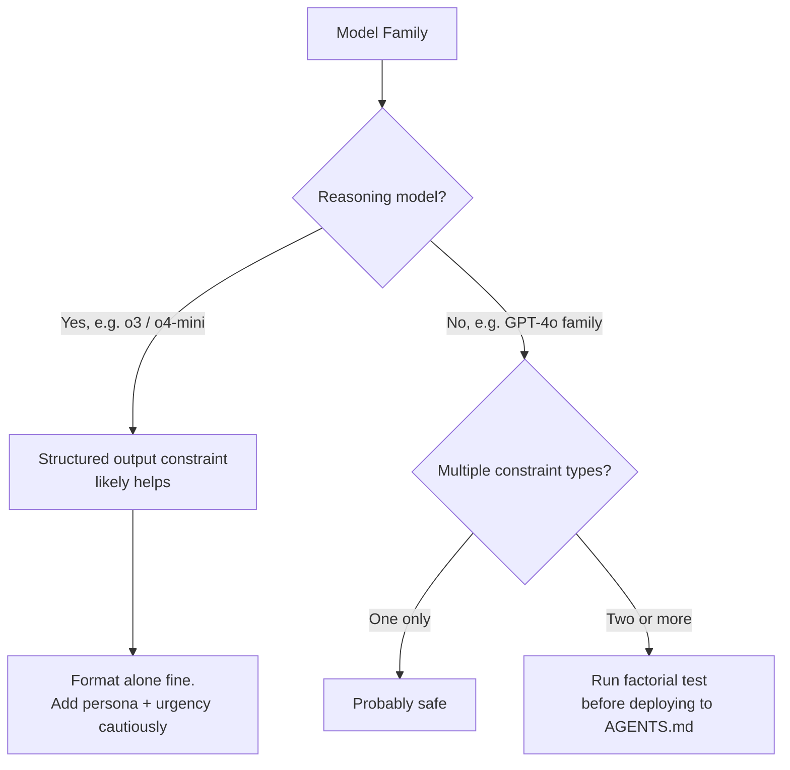

# The Compound Constraint Problem: When AGENTS.md Instructions Combine Destructively


A new empirical study from September 2026 should make anyone who has spent time tuning their `AGENTS.md` file uncomfortable. Jadhav, LaPlaca, Stone, Raja, Ochoa & Nagaraju ran a full-factorial experiment across 27 prompt constraint combinations and found that instructions which are individually harmless — or even beneficial — produce super-additive performance degradation when stacked together.[^1] The paper's name is direct: *Compound Prompt Constraints in LLM Code Generation: A Factorial Study of Format, Persona, and Urgency*. If you routinely add output-format directives, expert-persona framing, and urgency language to your agent instructions, the risk is real.

## The Experiment

The study decomposed three common instruction categories into three levels each, yielding a 3×3×3 design:

- **Format** — no constraint / JSON output / XML output
- **Persona** — none / generic developer ("experienced developer") / expert ("senior software engineer with deep expertise")
- **Urgency** — none / moderate ("ensure", "always", "carefully") / extreme ("critical", "must", "immediately")

All 27 combinations were evaluated on 164 HumanEval+ problems across five OpenAI models from three families: GPT-4o-mini, GPT-4o, GPT-4.1-mini, GPT-4.1, and o3-mini. That is 22,140 total evaluations using greedy decoding.[^1]

Each compound condition was decomposed into an *additive prediction* (the sum of individual constraint effects measured in isolation) and a *residual interaction term* that captures any deviation — positive or negative — from that prediction. When the residual is negative and large, the combination is super-additively destructive: the whole is measurably worse than the sum of its parts.

## What They Found

### Older architecture families are most vulnerable

The GPT-4o family exhibited consistent and statistically significant super-additive degradation across all eight triple-constraint combinations:

| Model | Baseline pass@1 | Worst case | Swing | Avg. interaction |
|---|---|---|---|---|
| GPT-4o-mini | 73.8% | 70.1% | −14.6 pp | −7.6 pp |
| GPT-4o | 79.3% | 75.0% | −12.8 pp | −4.2 pp |
| GPT-4.1-mini | 87.2% | 83.5% | −6.7 pp | +1.7 pp |
| GPT-4.1 | 89.6% | 84.8% | −6.1 pp | +1.3 pp |
| o3-mini | 59.8% | 59.8% | +31.7 pp | — |

The largest single interaction recorded was **−12.2 pp on GPT-4o-mini** for the combination JSON output + expert persona + moderate urgency. That is 12 percentage points of pass@1 lost — not from anything that looked dangerous when written as a standalone rule.[^1]

The GPT-4.1 family told the opposite story. Both models produced near-zero or slightly positive interaction terms. The newer architecture appears to have learned to handle layered constraints without compounding their costs.

### The o3-mini anomaly

The reasoning model was an outlier in a different direction. Its unconstrained baseline pass@1 was just 59.8% — substantially lower than the GPT-4 families — because o3-mini without structure defaults to verbose explanatory output that evaluation harnesses penalise.[^1] Add any structured output constraint (JSON or XML) and performance jumps by roughly **+11 pp** to ~88–92%. The model apparently needs an explicit format target to commit its reasoning to a final answer rather than an open-ended discussion.

This matters for Codex CLI because o3 and o4-mini are both reasoning-class models that behave analogously. A format constraint that degrades a GPT-4o session may be precisely what a reasoning-model session needs.

### JSON versus XML

Not all format constraints are equally destabilising. JSON-based combinations averaged **−10.7 pp interaction** on GPT-4o-mini; XML-based combinations averaged **−4.6 pp**. The researchers attribute this to JSON's stricter structural requirements creating more failure modes at the token level — an incomplete JSON object is syntactically invalid, whereas a partial XML document can sometimes still pass through extraction.[^1]

### Individual constraints are not the culprit

Examining main effects in isolation:

- Urgency framing alone: **+3.6 pp** on GPT-4o-mini (beneficial)
- XML alone: **+3.9 pp** on GPT-4o-mini (beneficial)
- Expert persona alone: **−1.7 pp** on GPT-4o-mini (negligible)

None of these explains the −12.2 pp observed when all three are combined. The compound interaction term is the phenomenon. Individually sound rules are destroying each other.

## Why This Matters for AGENTS.md

Standard `AGENTS.md` practice tends to accumulate exactly the three constraint categories this study isolated. A typical file might contain:

```markdown
You are a senior Rust engineer with deep expertise in async systems. Always respond
with precise, production-quality code. Carefully validate every function signature
before implementing it. Output all tool results as JSON.
```

That single paragraph combines:
- **Persona**: "senior Rust engineer with deep expertise"
- **Urgency**: "Always", "Carefully", "every"
- **Format**: "Output all tool results as JSON"

Based on the study's findings, this triple combination is precisely the pattern that produces the largest negative interaction in GPT-4o-family models. Prior research has found that developer-written `AGENTS.md` files improve task success rates by approximately 4% and reduce agent-generated bugs by 35–55% — but that LLM-generated instruction files *decrease* success rates and increase inference cost by over 20%.[^2] The compound constraint problem may partially explain both findings: LLM-generated files tend to be verbose and stack multiple constraint types automatically; developer-curated files tend to be sparse.

The instruction-count degradation effect documented in the Phased Workflow paper[^3] fits the same pattern: more rules does not mean more compliance. The interaction dynamics described by Jadhav et al. provide a mechanistic account of *why* that degradation occurs.

## The Codex CLI Model Dimension

Codex CLI as of v0.153.4 supports o3, o4-mini, and GPT-6 Astra as primary models.[^4] None of these exact models appears in the study, which tested the GPT-4x and o3-mini series. But the pattern the authors observed — reasoning-class models respond differently to constraints than standard generation models — almost certainly applies:



GPT-6 Astra is architecturally closer to the GPT-4.1 family's resilient profile — ⚠️ not empirically confirmed — and may tolerate compound constraints better than older models. But you should not assume this without testing.

## A Practical Audit Protocol

The authors' core recommendation is that "compound-prompt testing should be a standard part of reliability assessment for LLM-assisted engineering pipelines."[^1] In a Codex CLI context, this translates to a three-step audit of any `AGENTS.md` under consideration:

**Step 1 — Categorise your constraints**

Go through your `AGENTS.md` and tag every sentence with F (format), P (persona), or U (urgency). Look specifically for:

- F: JSON/XML/YAML output requirements, markdown headers, code-block fencing
- P: "You are a...", role framing, expertise claims
- U: "Always", "Never", "Carefully", "Critical", "Must", "Immediately", "Ensure"

**Step 2 — Isolate by category**

Create three stripped-down variants: one with only F constraints, one with only P, one with only U. Run your standard task suite against each variant using the same model. Record pass rates.

**Step 3 — Test compound combinations**

Combine F+P, F+U, P+U, and finally F+P+U. Compare actual performance against the additive prediction (sum of individual gains/losses). If the actual result is more than ~3 pp below the additive prediction, you have a destructive interaction that needs resolving — either by removing one constraint type or by switching to a model with a resilient architecture (GPT-4.1-equivalent or above).

In `config.toml`:

```toml
[model]
# For AGENTS.md with compound constraints, prefer models with
# resilient interaction profiles. GPT-6 Astra or o3 recommended
# over legacy GPT-4o-equivalent backends.
model = "gpt-6-astra"

[features]
# If using o3/o4-mini and relying on JSON output format,
# constraints likely help rather than hurt.
# Urgency + persona stacking should still be tested separately.
```

## What to Do Right Now

1. **Audit for triple stacking.** If your `AGENTS.md` contains format directives, persona framing, *and* urgency language in the same instruction, test whether removing one constraint type improves reliability.

2. **Separate concerns across scopes.** Format constraints often belong in AGENTS.md for the whole repo. Persona definitions may belong in a task-specific `SKILL.md`. Urgency language arguably belongs in the user prompt, not the system file — it shifts contextually and should not be made permanent.

3. **Don't trust addition.** The study's central insight is that you cannot predict compound constraint behaviour by testing constraints individually. A constraint that improves performance alone may actively harm performance when combined with others. The interaction term is empirically real and architecturally dependent.

4. **Treat o3/o4-mini differently.** These models may benefit from format constraints in ways that GPT-4o-family models do not. The safest approach is to maintain separate `AGENTS.md` variants per model profile and switch via `codex --profile`.

The compound constraint problem will not be visible in any single-constraint A/B test. It requires the same factorial discipline the authors applied in the lab — and `AGENTS.md` is now complex enough to deserve that rigour.

## Citations

[^1]: Jadhav S., LaPlaca N., Stone C., Raja A., Ochoa O. & Nagaraju V. (2026). *Compound Prompt Constraints in LLM Code Generation: A Factorial Study of Format, Persona, and Urgency*. arXiv:2609.03156. [https://arxiv.org/abs/2609.03156](https://arxiv.org/abs/2609.03156)

[^2]: Bouzenia I., Devanbu P. & Pradel M. (2026). *On the Impact of AGENTS.md Files on the Efficiency of AI Coding Agents*. arXiv:2601.20404. [https://arxiv.org/abs/2601.20404](https://arxiv.org/abs/2601.20404)

[^3]: Kapetanovic A., Duricic T., Mercep A. & Lacic E. (2026). *A Phased Workflow for Operating LLM-Based Coding Agents*. arXiv:2608.30701. CIKM '26. [https://arxiv.org/abs/2608.30701](https://arxiv.org/abs/2608.30701)

[^4]: OpenAI (2026). *Codex CLI v0.153.4 release notes*. GitHub. [https://github.com/openai/codex/releases/tag/rust-v0.153.4](https://github.com/openai/codex/releases/tag/rust-v0.153.4)

[^5]: Upsun Developer Blog (2026). *The research is in: your AGENTS.md is probably too long*. [https://developer.upsun.com/posts/ai/agents-md-less-is-more](https://developer.upsun.com/posts/ai/agents-md-less-is-more)
