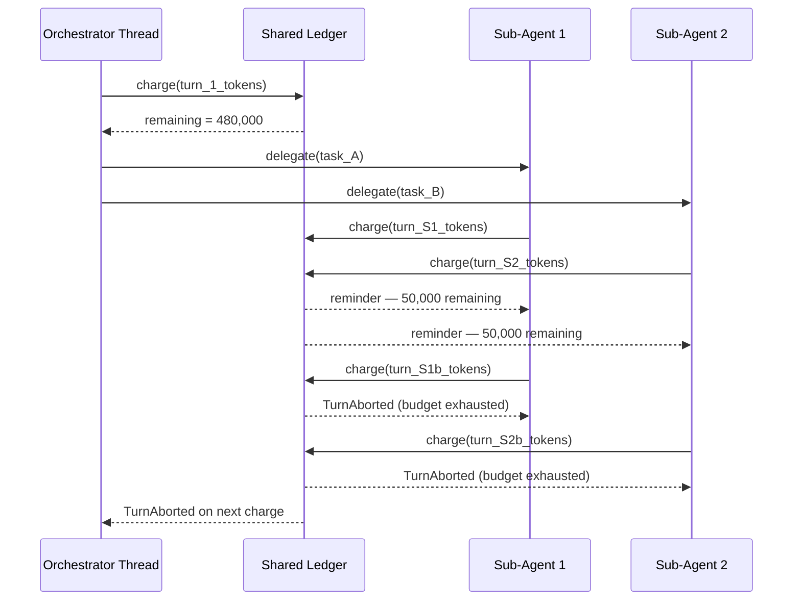

# Rollout Token Budgets and Multi-Agent Delegation: Cross-Thread Cost Governance in Codex CLI


---

Multi-agent workflows in Codex CLI introduce a cost multiplier that catches many teams off guard. A single `proactive` delegation run can spawn dozens of sub-agent threads simultaneously, each making independent LLM calls against the same usage quota. One public bug report documented 632 concurrent `session_loop` entries within a single second, with 248 sessions created over two days — depleting a weekly token budget roughly 20–50× faster than single-agent operation.[^1] The rollout token budget feature, introduced across three pull requests and subsequently refined, provides the hard ceiling that multi-agent delegation otherwise lacks. Understanding how both features interact is essential before enabling proactive delegation in any serious workflow.

---

## The Rollout Token Budget

The rollout budget is a **session-scoped shared ledger** that tracks weighted token consumption across every agent thread spawned in a single Codex session. It is distinct from the existing `token_budget` feature — the configuration key is `features.rollout_budget`, and the two coexist independently.[^2]

### Configuration Structure

```toml
[features.rollout_budget]
enabled = true
limit_tokens = 500_000

# Threshold-based reminders (PR #29423, merged June 22 2026)
reminder_at_remaining_tokens = [100_000, 50_000, 25_000, 10_000, 5_000, 1_000]

# Token weighting (defaults shown)
sampling_token_weight = 1.0
prefill_token_weight  = 0.1
```

The `limit_tokens` field sets the hard ceiling. Every response completion charges against the ledger using the formula:

```
weighted_charge = (sampling_tokens × sampling_token_weight)
                + (prefill_tokens  × prefill_token_weight)
```

The default weights — 1.0 for sampling, 0.1 for prefill — reflect the economics of autoregressive generation: output tokens cost far more than context tokens. Adjust `prefill_token_weight` upward if you are running workflows with large context re-hydration passes where prefill costs matter.[^3]

### Reminder Delivery

Two reminder mechanisms exist depending on which config key you use:

| Config key | Behaviour |
|---|---|
| `reminder_interval_tokens` (legacy) | Fires at fixed token intervals from the start |
| `reminder_at_remaining_tokens` (current, since PR #29423) | Fires when remaining budget crosses each listed threshold |

The threshold-based approach is strictly preferable for multi-agent work: a fixed interval gives no warning proportional to remaining capacity, whereas descending thresholds provide geometrically tightening warnings as the budget approaches exhaustion.

Reminders are injected as developer messages before the next LLM request in each thread. The format is:

```
You have weighted {N} tokens left in the shared session token budget.
```

Every active thread independently receives reminders when it crosses a threshold — the system tracks per-thread delivery to ensure no thread goes unwarned even when rejoining a shared session mid-run.[^4] Reminders are also restated immediately after a compaction event, because compaction resets the visible context and the model would otherwise lose awareness of the constraint.

---

## Budget Exhaustion and the Soft-Boundary Abort

When the ledger reaches zero, subsequent usage updates return `CodexErr::TurnAborted` rather than completing normally. The abort propagates to the task wrapper, which emits standard aborted-turn lifecycle events — the same path used by user-initiated interrupts.

A critical design choice is that exhaustion uses a **soft boundary**:

> "In-flight threads can finish their current response before observing the exhausted ledger, but every thread aborts at its next usage-accounting boundary."[^5]

This means the actual token spend can exceed `limit_tokens` by one response's worth of tokens per active thread. For a 10-thread parallel workflow with average response sizes of 2,000 tokens, the true ceiling is roughly `limit_tokens + 20,000`. Size your budget accordingly.

Sub-agent threads draw from the same shared ledger as the orchestrator. There is no separate sub-agent allocation — a proactive delegation that fans out to eight sub-agents will exhaust the budget eight times faster than running the same model single-threaded.



Compaction operations observe the same abort path: if budget is exhausted mid-compaction, the compaction aborts without retrying and without emitting a generic error.[^5]

---

## Multi-Agent Delegation Modes

Parallel to the rollout budget, the delegation policy is controlled by a single `multiAgentMode` field, following a June 2026 consolidation that replaced three previously conflicting settings.[^6]

Three modes are available:

### `none`

Keeps multi-agent tools technically accessible but injects no mode instructions into the model context. The model may or may not delegate depending on its base behaviour. Not recommended for production — the absence of explicit guidance produces inconsistent delegation decisions.

### `explicitRequestOnly` (default)

The model receives this instruction:

> "Do not spawn sub-agents unless the user explicitly asks for sub-agents, delegation, or parallel agent work."

New threads default to this mode. Omitting `multiAgentMode` on subsequent turns preserves the current session value. This is the correct mode for the vast majority of workflows.

### `proactive`

Enables delegation when parallel work would materially improve speed or quality. The model receives:

> "Proactive multi-agent delegation is active. Any earlier instruction requiring an explicit user request before spawning sub-agents no longer applies."

This is the mode that caused the token explosion documented in issue #30246.[^1] **Do not enable `proactive` without a `rollout_budget` ceiling.**

### Feature Gate

The delegation system sits behind a feature gate:

```toml
[features]
multi_agent_mode = true   # required to enable per-turn mode selection
```

When `multi_agent_mode = false` (the default), the field is accepted but ignored for backward compatibility, and the model receives a static no-spawn hint instead.[^7]

---

## Configuring Both Features Together

A safe configuration for a proactive multi-agent workflow that performs code review across a large codebase might look like this:

```toml
[features.rollout_budget]
enabled = true
limit_tokens = 1_000_000
reminder_at_remaining_tokens = [500_000, 200_000, 100_000, 50_000, 10_000]
sampling_token_weight = 1.0
prefill_token_weight  = 0.1

[features]
multi_agent_mode = true
```

Then, at session start via the app-server API or TUI, set the delegation mode per-turn:

```json
{
  "turn": {
    "start": {
      "multiAgentMode": "proactive"
    }
  }
}
```

Switching back to `explicitRequestOnly` on a later turn requires only omitting or overriding the field — omission retains the current value, so an explicit override is needed:

```json
{
  "turn": {
    "start": {
      "multiAgentMode": "explicitRequestOnly"
    }
  }
}
```

### Sizing the Budget

No formula perfectly predicts multi-agent consumption, but the soft-boundary arithmetic provides a floor:

```
safe_limit = expected_total_tokens
           + (max_concurrent_threads × max_response_tokens_per_turn)
```

For a review workflow expecting ~500,000 tokens of substantive work, with up to 10 concurrent sub-agents averaging 3,000 tokens per response, `safe_limit ≈ 530,000`. Add a 20% buffer for reminder overhead and compaction charges: `636,000`. Round up to `700_000` or `1_000_000` for comfort.

---

## Interaction with `output_token_limit` and Compaction

The rollout budget is additive with the per-tool `output_token_limit` introduced in v0.152.0.[^8] `output_token_limit` constrains a single tool call's output; the rollout budget constrains the cumulative session spend. Both should be configured for long-running multi-agent workflows:

```toml
[features.rollout_budget]
enabled = true
limit_tokens = 1_000_000
reminder_at_remaining_tokens = [200_000, 50_000, 10_000]

[tool_settings.shell]
output_token_limit = 8_192

[tool_settings.read_file]
output_token_limit = 16_384
```

Compaction charges are applied to the rollout ledger before the new context starts. After compaction, the next reminder always restates the post-compaction remaining balance — ensuring the model does not operate under stale budget assumptions after context has been truncated.[^4]

---

## Observability Gap

As of September 2026, Codex CLI does not expose the current rollout ledger balance as a queryable value in the TUI or via the app-server protocol. Budget state is visible only through the reminder messages injected into model context. There is no `/budget` command, no session-level metadata endpoint, and no callback hook that fires on budget update.

The practical implication: implement logging in PostToolUse hooks if you need per-turn audit trails of cumulative spend. The reminders themselves are developer messages, not user-facing events, and will not appear in the conversation history unless the model quotes them.

---

## Summary

| Concern | Configuration |
|---|---|
| Cap total session spend across all threads | `[features.rollout_budget]` with `limit_tokens` |
| Get geometric warnings as budget depletes | `reminder_at_remaining_tokens = [...]` |
| Weight prefill vs sampling costs | `sampling_token_weight`, `prefill_token_weight` |
| Allow sub-agent delegation | `[features] multi_agent_mode = true` |
| Control when delegation fires | `multiAgentMode: proactive` or `explicitRequestOnly` |

The rollout budget and multi-agent delegation are complementary controls: delegation determines whether and when sub-agents spawn; the budget determines the total resource envelope within which they operate. Enabling `proactive` delegation without a rollout budget ceiling is equivalent to running parallel processes with no resource limits — technically possible, predictably expensive.

---

## Citations

[^1]: openai/codex GitHub issue #30246 — "[Bug] Parallel multi-agent workflows exhaust weekly token budget in hours — 20-50x normal consumption with simple review tasks" (June 2026). <https://github.com/openai/codex/issues/30246>

[^2]: rka-oai, openai/codex PR #28746 — "[codex] add rollout token budget configuration (1/N)". Establishes `[features.rollout_budget]` as a distinct key from the legacy `token_budget` feature. <https://github.com/openai/codex/pull/28746>

[^3]: rka-oai, openai/codex PR #28494 — "[codex] rollout budget implementation (2/N)". Describes weighted ledger accounting: "sampling tokens and pre-fill tokens receive configurable multipliers." <https://github.com/openai/codex/pull/28494>

[^4]: rka-oai, openai/codex PR #28494 — reminder delivery: "The next reminder is appended after the compaction summary"; "every thread observes crossed thresholds" even when rejoining a shared session. <https://github.com/openai/codex/pull/28494>

[^5]: rka-oai, openai/codex PR #28707 — "[codex] abort turns when rollout budgets expire (token budget 3/3)". Soft-boundary design: "In-flight threads can finish their current response before observing the exhausted ledger, but every thread aborts at its next usage-accounting boundary." Compaction abort without retry. <https://github.com/openai/codex/pull/28707>

[^6]: jif-oai, openai/codex PR #29324 — "Simplify multi-agent mode controls" (merged June 22 2026). Consolidates policy into single `multiAgentMode` field; new threads default to `explicitRequestOnly`; deprecated fields (`features.multi_agent_mode`, `usage_hint_enabled`) accepted but ignored. <https://github.com/openai/codex/pull/29324>

[^7]: shijie-oai, openai/codex PR #28685 — "Add per-turn multi-agent mode". Describes feature gate behaviour: when disabled, static no-spawn hints are added and per-turn mode selections are ignored. <https://github.com/openai/codex/pull/28685>

[^8]: Codex CLI Changelog, gradually.ai — v0.152.x updates include "MCP tool output token limits". September 2026. <https://www.gradually.ai/en/changelogs/codex-cli/>
