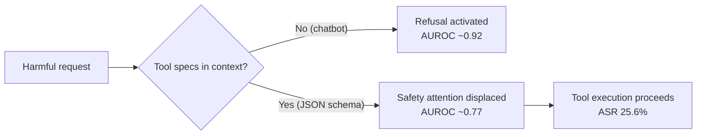

# Tool Schema Safety: How JSON Specifications Undermine Agent Refusals and What Codex CLI Can Do About It


---

You configure Codex CLI with a thoughtful `AGENTS.md`, set `approval_policy`, and add lifecycle hooks. Yet a July 2026 paper reveals a safety gap most practitioners never look for: the JSON schemas used to declare tools.

Pan, Yang, Yuan, Jiang, and Chen (Beijing University of Posts and Telecommunications / Beihang University / Tsinghua University) demonstrate in *Tool Specifications Matter: Uncovering and Mitigating Safety Risks in AI Agents* (arXiv:2607.29254)[^1] that schema-formatted tool specifications systematically degrade a model's refusal capability. The finding is stark: the *representation* of a tool, not its *semantics*, causes the safety regression.

## The Refusal Degradation Problem

When a language model operates as a chatbot — no tools in context — it maintains high harmful-benign separability. Introduce JSON schema tool specs and it drops sharply. The authors measure AUROC on AgentHarm (176 harmful + 176 benign pairs across 11 harm categories):[^1]

| Mode | Llama 3.1-8B | Qwen3-8B | Mistral-7B |
|---|---|---|---|
| Chatbot (no tools) | 0.927 | 0.901 | 0.921 |
| Agent (JSON schema tools) | 0.740 | 0.786 | 0.815 |

Average refusal rates across four LLMs fall to just **23.8%** when schema-formatted specifications are present.[^1] Root cause from white-box probing: JSON syntax, type declarations, nesting, and `required` markers occupy attention weights that would otherwise activate safety circuits. The refusal capability is still present in the model's activations — it is displaced, not deleted.



## What SafeKeep Does

The paper proposes SafeKeep — an inference-time safeguard that *decouples* safety judgment from tool execution across two phases:[^1]

**Phase 1 — Safety judgment with flattened specs.** Tool schemas are converted to natural-language descriptions: JSON syntax, schema reserved fields, nesting, type declarations, and `required` markers are stripped, while tool names, function signatures, and argument meanings are retained. A YES/NO safety predicate is generated in this lower-noise context.

**Phase 2 — Execution with original schemas.** Safe requests (NO) proceed through the original agent pipeline with schemas intact. Flagged requests (YES) are redirected toward refusal via a short prefill prompt, producing a contextually appropriate refusal rather than a canned template.

SafeKeep requires neither parameter updates nor model internals access — it applies to both open-source and proprietary LLMs, including the black-box models most Codex CLI operators use.[^1]

### Results

On AgentHarm and InjecAgent (1,054 observation-level prompt injection cases):[^1]

| Metric | Baseline | SafeKeep |
|---|---|---|
| Harmful refusal rate (avg 4 LLMs) | 23.8% | **70.6%** |
| Task accuracy (AgentHarm benign) | 60.9% | **79.6%** |
| Observation-level attack success rate | 25.6% | **2.5%** |

SafeKeep outperformed SafeJudge (schema retained in judgment), SafePrompt (appended safety instructions), and SafeHarbor (memory-augmented guardrails).[^1]

## Why This Matters for Codex CLI

Codex CLI surfaces tool definitions to the model in several places: built-in tools injected by the runtime, MCP server schemas loaded on startup, and plugin marketplace tools (v0.153.0)[^3]. All exhibit the same risk.

The v0.147.0 upgrade to support the MCP 2026-07-28 protocol — paginated discovery, multi-round requests[^4] — is relevant here. Richer tool ecosystems mean more schema tokens in context per turn, compounding refusal suppression as the tool catalogue grows.

## A SafeKeep-Inspired Pattern for Codex CLI

You cannot currently intercept Codex's internal tool schema injection, but the hook and configuration machinery provides a close approximation.

### Natural-Language Tool Summaries in AGENTS.md

Flattened textual descriptions in `AGENTS.md` arrive in context *before* schemas and prime safety circuits with the representation that preserves refusal capability:[^1]

```markdown
## Tool Safety Context

- **shell_exec**: Runs arbitrary shell commands. Do NOT use for commands that delete
  files outside the repository, modify system config, or exfiltrate data.
- **file_write**: Writes content to a file path. Refuse if the request targets
  `.env`, credential files, or any path containing `secret`.
- **mcp_tool[github]**: GitHub API. Do NOT create webhooks, deploy keys, or
  repository secrets without explicit in-turn user confirmation.
```

### PreToolUse Safety Gate

A PreToolUse hook mirrors SafeKeep's Phase 1 judgment — evaluating the proposed call against policy in natural-language terms before execution:

```bash
#!/usr/bin/env bash
# .codex/hooks/pre-tool-safety-gate.sh
set -euo pipefail

INPUT=$(cat)
TOOL_NAME=$(echo "$INPUT" | jq -r '.tool_name // .toolName // ""')
CALL_ARGS=$(echo "$INPUT" | jq -c '.tool_input // .input // {}')

# Deny destructive shell patterns
if [[ "$TOOL_NAME" == "shell" || "$TOOL_NAME" == "bash" ]]; then
  COMMAND=$(echo "$CALL_ARGS" | jq -r '.command // ""')
  if echo "$COMMAND" | grep -qE '(rm -rf|dd if=|mkfs|curl.*\|.*sh|wget.*\|.*sh)'; then
    exit 2
  fi
fi

# Deny writes to sensitive paths
if [[ "$TOOL_NAME" == "file_write" || "$TOOL_NAME" == "write_file" ]]; then
  FILE_PATH=$(echo "$CALL_ARGS" | jq -r '.path // .file_path // ""')
  if echo "$FILE_PATH" | grep -qiE '(\.env|secret|credential|\.pem|\.key|id_rsa)'; then
    exit 2
  fi
fi

exit 0
```

Register in `hooks.json`:[^5]

```json
{
  "hooks": [
    { "event": "PreToolUse", "script": ".codex/hooks/pre-tool-safety-gate.sh" }
  ]
}
```

### Lean Session Profiles

Fewer schemas in context means less refusal suppression. Define a minimal profile for sensitive operations in `.codex/config.toml`:

```toml
[profile.safe-review]
model = "codex-mini-latest"
approval_policy = "untrusted-glob"
writable_roots = []

[[profile.safe-review.mcp_servers]]
name = "github-readonly"
command = "npx"
args = ["-y", "@modelcontextprotocol/server-github"]
env = { GITHUB_PERSONAL_ACCESS_TOKEN = "${GITHUB_TOKEN_READONLY}" }
```

`writable_roots = []` combined with a read-only MCP token minimises the tool catalogue exposed to the model. Load only the servers you need.

## Limitations

The SafeKeep evaluation has scope boundaries worth noting. Benchmarks test request-level refusal — multi-turn sessions with compaction events, where schemas are re-injected after context compression, are unstudied. ⚠️ At extreme activation-steering intervention (α=8), SafeKeep produced 77.5% invalid outputs, indicating a precision ceiling for steered approaches.[^1] Results on o3/o4-mini class models — the default Codex CLI models — are not directly reported; the study covers Llama 3.1-8B, Qwen3-8B, Mistral-7B, and one proprietary model. ⚠️

The hook-based pattern described above is a defence-in-depth layer, not a guarantee of SafeKeep-equivalent safety recovery.

## Key Takeaways

The schema safety gap is not a Codex CLI bug — it is a model-level property the SafeKeep paper surfaces for the first time at scale. It is, however, a Codex CLI *configuration* responsibility:

- **JSON tool schemas suppress refusals** by displacing safety attention (AUROC −0.187 on Llama 3.1-8B).[^1]
- **More MCP servers = more schema tokens = deeper suppression.** Load lean profiles for sensitive sessions.
- **NL tool summaries in AGENTS.md** provide a SafeKeep-inspired priming layer that costs nothing to add.
- **PreToolUse hooks** implement a deterministic policy gate that operates independently of model refusal capability.

---

## Citations

[^1]: Pan, M., Yang, J., Yuan, Y., Jiang, Y., & Chen, Z. (2026, July 31). *Tool Specifications Matter: Uncovering and Mitigating Safety Risks in AI Agents*. arXiv:2607.29254. https://arxiv.org/abs/2607.29254

[^2]: Pan et al. (2026). AgentHarm benchmark — 176 harmful + 176 benign pairs, 11 harm categories. https://arxiv.org/html/2607.29254

[^3]: OpenAI. (2026, September 2). *Codex CLI v0.153.0 release notes — Plugin CLI can manage remote marketplaces* (PR #42150). https://releasebot.io/updates/openai/codex

[^4]: OpenAI. (2026). *Codex CLI v0.147.0 — MCP 2026-07-28 protocol support: paginated tool discovery, multi-round requests, non-blocking server startup*. Codex Knowledge Base. https://codex.danielvaughan.com/2026/08/07/codex-cli-v0147-release-approve-for-me-mcp-2026-07-28-project-trust-plugin-search-secrets-redaction/

[^5]: Agenticcontrolplane.com. (2026). *Codex CLI Hooks Reference — hooks.json, PreToolUse*. https://agenticcontrolplane.com/blog/codex-cli-hooks-reference
