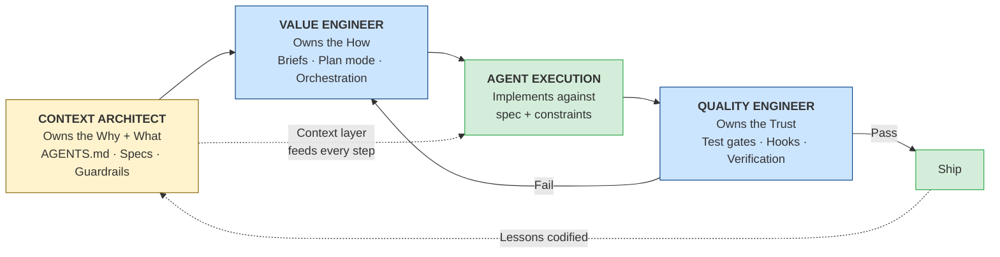
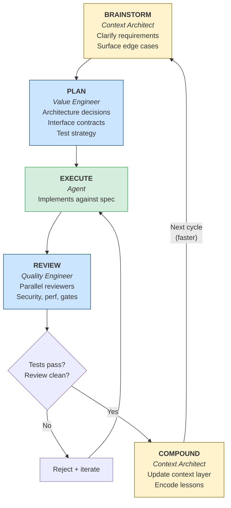
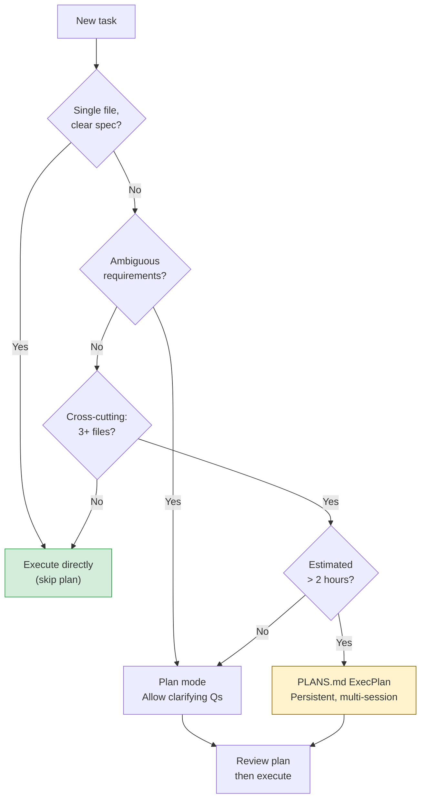
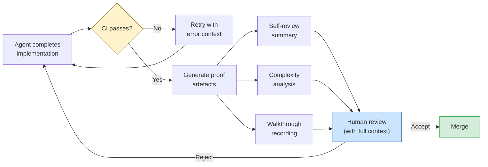

# Agentic Engineering Is Not Vibe Coding: The Framework That Separates 10x Teams from Toy Projects

> **The Agentic Engineering Series**. From experiment to enterprise. This is article one of 13.
> *This article sets the thesis: why the move from vibe coding to agentic engineering is the defining shift for enterprise teams in 2026.*
> [Next: Codex CLI at One Year](/premium/02-codex-cli-at-one-year/) | [Series overview](#series)

> **Series context:** This is article one of 13 in *From Experiment to Factory*, a series about moving from AI experiments in software engineering to a repeatable factory for agentic engineering at enterprise scale. This opening article is the wake-up call: experimentation is not enough, and the teams that treat agentic coding as engineering rather than vibes will be the teams still standing at the end of 2026.

In March 2026, Amazon's retail platform suffered a six-hour cascading outage that cost an estimated 6.3 million lost orders. Internal reporting, first disclosed by CNBC and later detailed by *The Register*, pointed to AI-assisted code reaching production without adequate human review or senior engineer approval.[^0] The code looked plausible. It passed automated checks. It still introduced a subtle service interaction that nobody had owned, because nobody had been assigned to review it. Amazon's response was blunt: a 90-day code safety reset and mandatory senior engineer sign-off for AI-generated deployments.[^0b]

That incident did not stand alone. In July 2025, Jason Lemkin described how a Replit AI agent ignored explicit instructions, deleted a production database containing records for 1,200 executives and burned through $800 in compute fees.[^0c] In early 2026, the vibe-coding platform Lovable disclosed CVE-2025-48757: 16 vulnerabilities, six of them critical, affecting 18,000 users whose AI-generated applications had reached production without security review.[^0d]

The short answer is simple: when code generation becomes cheap, the bottleneck moves to verification, design and accumulated context. That is the line between vibe coding and agentic engineering. One optimises for velocity. The other optimises for trustworthy delivery.

## The thesis

The term 'vibe coding' entered the lexicon on 2 February 2025, when Andrej Karpathy posted the now-famous line about giving in to the vibes and forgetting that the code even exists.[^1] The phrase landed because it named a real behaviour. Many teams were already working like that, prompting fast, accepting output and mistaking speed of generation for speed of delivery.

By 2026, the failure modes were visible enough that the joke stopped being funny. Karpathy's own correction, one year later, was telling: the practice had matured and needed a better name, 'agentic engineering', because the default had shifted from writing code directly to orchestrating agents while retaining engineering oversight.[^2]

That distinction matters because the economics of software work have changed. Kent Beck, speaking in a June 2025 *Pragmatic Engineer* interview, put it neatly: 'the whole landscape of what’s cheap and what’s expensive has all just shifted'.[^3] Exploring several implementations, prototyping across languages and trying ambitious side projects are cheaper than they were. Trusting code because you wrote it yourself is no longer the cheap part, because in many cases you did not write it.

The hard work now sits elsewhere. You have to specify the task clearly, constrain the agent, verify the result and preserve the lessons so the next run starts from a better place. If you do not, the savings from generation get eaten by review debt, rework and production incidents.

## Where vibe coding still fits

Vibe coding still has a place. It is useful for:

- throwaway prototypes when you need to test an idea in 20 minutes
- internal tools with no real production requirements
- non-engineers translating an idea into working software for the first time
- early exploration when the problem itself is still unclear

In those situations, the loose style is often the point. You skip the design document, accept rough output, run it locally and move on. The danger is that the same habits slide into production work, where the physics change.

Here is the cleaner comparison:

| Dimension | Vibe coding | Agentic engineering |
|---|---|---|
| Design phase | Prompt directly | Write a plan or spec first |
| Agent instructions | Ad hoc prompts | Lean `AGENTS.md` hierarchy plus on-demand skills |
| Review stance | Accept output, maybe skim it | Review every PR as if a junior submitted it |
| Testing | Optional or late | Tests define the contract, usually before implementation |
| Context management | Ignore until it breaks | Managed explicitly through compaction, delegation and persistent plans |
| Failure mode | Confident wrong output found in production | Detectable failure at the gate before merge |
| Cognitive debt | Accumulates quietly | Managed as part of the workflow |

By early 2026, 'cognitive debt', the cost of poorly managed AI interactions, context loss and unreliable agent behaviour, had emerged as one of the main risks of scaling vibe coding without discipline.[^4] Tooling improved quickly. Governance patterns did not.

## The inversion

Most teams still apply AI with the old ratio:

- 10 per cent planning
- 80 per cent watching the agent execute
- 10 per cent reviewing the output

That is not agentic engineering. It is vibe coding with a spectator in the loop.

The EveryInc team argue for what they call 'compound engineering', and the point is the inversion.[^5]

| Phase | Traditional | Compound engineering |
|---|---|---|
| Planning | 10 per cent | **40 per cent** |
| Execution | 80 per cent | **10 per cent** |
| Review | 10 per cent | **40 per cent** |
| Knowledge codification | Almost none | **10 per cent** |

The interesting line is not the execution row. The interesting line is knowledge codification. If you skip that part, every project starts from scratch and every agent repeats the same mistakes. If you keep it, the system compounds. The next task starts with better constraints, better examples and fewer blind spots.

EveryInc claims a single developer using this method can match the output of five developers using a more traditional workflow.[^6] Treat that claim with some caution, but the mechanism is coherent. Better planning removes categories of rework. Better review stops bad output before it spreads. Better codification prevents the same failure from recurring.

That leads to the next question: who owns each of those high-value activities? The same person who designed the solution is a poor judge of whether the design is sound. The person who steered the implementation has blind spots about the code they just shepherded into existence. Self-verification is not quality control.

The answer is the **Agentic Engineering Pod**, three humans using agents, each responsible for one question agents cannot answer for themselves.[^18]



The **Context Architect** owns the context layer: specifications, guardrails, the `AGENTS.md` hierarchy, scoped overrides, skills and the capture of lessons learned. The **Value Engineer** owns planning and orchestration, writing high-signal briefs, running `/plan` and steering implementation. The **Quality Engineer** owns verification, including hooks, gates and CI rules, with real veto power when the evidence is not good enough.

Three roles are enough because each person remains a producer. There is no extra coordination layer. Agents do the routine work. Humans spend their time on judgement. If demand grows, you run parallel pods on a shared platform layer rather than inflate one giant team.

This maps directly to the compound engineering loop:



The green box, agent execution, is the small part. The blue boxes belong to planning and review. The amber boxes are about context and compounding. That is the operational definition of agentic engineering.

## The framework in practice

Theory is cheap. The only useful question is how this looks with real tools and real constraints.

### Phase 1: plan before you prompt

Do not dispatch a non-trivial task without a planning pass. Codex CLI plan mode forces intent into the open before files change. The agent reads the codebase, asks clarifying questions and proposes a structured plan, which you review as you would review a design document.

```bash
# Activate plan mode in the TUI
# Press Shift+Tab to cycle: Plan -> Pair -> Execute
# Or type /plan at the prompt

# For CI/headless workflows, set it in config
```

```toml
# ~/.codex/config.toml
model_reasoning_effort         = "low"    # fast execution
plan_mode_reasoning_effort     = "high"   # thorough planning

[profiles.architecture]
plan_mode_reasoning_effort = "xhigh"      # for major refactors

[profiles.hotfix]
plan_mode_reasoning_effort = "minimal"    # for single-line fixes
```

The practical move is to set `plan_mode_reasoning_effort` high and `model_reasoning_effort` low. You pay for careful analysis where it matters, then let implementation run cheaply.[^7]

Do not turn plan mode into a religion. Skip it for a typo, a single-file fix with a clear spec or a dependency bump where the planning overhead dwarfs the execution time.[^8] Use it when the requirements are unclear, the change crosses three or more files, the codebase is unfamiliar or you can describe the goal but not the path. That is when clarifying questions save you from expensive wrong turns.



### Phase 2: treat AGENTS.md as the constitution, not the dumping ground

In the pod model, the Context Architect's core deliverable is not a slide deck or a meeting. It is the `AGENTS.md` hierarchy. Every Codex session the Value Engineer runs, and every automated check the Quality Engineer triggers, depends on the context encoded there.

`AGENTS.md` is not a bag of tips for the model. It is a version-controlled statement of how your team engineers software. But it only works if it stays lean. Root-level `AGENTS.md` should hold the commands, defaults and boundaries that are always relevant. Architectural explanations belong in specs. Service-specific rules belong in nested files or `AGENTS.override.md`. Specialised workflows belong in skills.

Here is what that looks like in practice at the repo root:

```markdown
# AGENTS.md

## Commands
- Test: `npm test`
- Lint: `npm run lint`
- Build: `npm run build`

## Always
- Add a unit test for every new public function
- If a test fails, fix the implementation, not the test

## Ask First
- Adding a dependency
- Changing database schema
- Modifying CI pipeline configuration

## Never
- Commit `.env*`, credentials, or API keys
- Delete or weaken existing tests to make them pass
- Edit generated files manually
```

Then put scoped rules where they belong:

```markdown
# services/payments/AGENTS.override.md

## Never
- Generate a new idempotency key for a retry

## Always
- Reuse the original key derived from immutable charge fields
- Run payment integration tests after touching retry logic
```

The payments lesson still gets codified, but it lands in the payments context rather than as noise in the repo root. That is how the compound effect becomes real rather than rhetorical.

`AGENTS.md` has also become portable. The format is now supported across Codex CLI, GitHub Copilot, Cursor, Gemini CLI, Windsurf, Aider and other tools, and by March 2026 more than 60,000 GitHub repositories included one.[^9] If you still start every agent session from zero, you are paying a tax you no longer need to pay.

The practical rule is simple: if an instruction is always relevant and failure-backed, keep it in `AGENTS.md`. If it applies only to one service or directory, move it to a nested file or override. If it describes a specialised workflow such as Playwright automation, deployment or release management, move it to a skill so it loads only when needed.

### Phase 3: use TDD as the agent's contract

This is where Kent Beck's point becomes operational. The Value Engineer defines what correct means. The Quality Engineer prevents the agent from cheating. Beck has described agents deleting tests to make them pass.[^3] That should end the argument. The agent's objective function is usually 'done', not 'correct', unless you give it a contract it cannot rewrite.

The contract is the failing test.

```bash
# Write the test yourself, or have the agent draft it in plan mode.
# Then dispatch implementation with a hard constraint.

codex "The test in tests/test_payment_processor.py::test_idempotent_charge
is failing. Make it pass. Do NOT modify the test file."
```

```python
# tests/test_payment_processor.py
# YOU write this. The agent implements against it.

def test_idempotent_charge_uses_stable_key():
    """Retrying the same charge must reuse the original idempotency key."""
    processor = PaymentProcessor(gateway=mock_gateway)
    charge = Charge(amount=5000, currency="usd", customer_id="cus_123")

    # First attempt
    result_1 = processor.process(charge)
    key_1 = mock_gateway.last_idempotency_key

    # Simulated retry (same charge object)
    result_2 = processor.process(charge)
    key_2 = mock_gateway.last_idempotency_key

    assert key_1 == key_2, "Idempotency key must be stable across retries"
    assert result_1.charge_id == result_2.charge_id
```

That is TDD as specification. You are not testing the code after the agent writes it. You are defining the behaviour before the implementation starts. The agent's job is to make the test green without touching the specification.

If you want to make that rule real, add a hook:

```toml
# ~/.codex/config.toml
[[hooks]]
event = "PostToolUse"
tool = "write_file"
command = """
if echo "$TOOL_ARG_PATH" | grep -q "test_"; then
  echo "BLOCKED: Agent attempted to modify a test file" >&2
  exit 1
fi
"""
```

Now the model cannot quietly rewrite the evidence. That is the difference between asking nicely and engineering a constraint.

### Phase 4: review in parallel

A single reviewer misses things. They notice the logic and overlook the security problem, or they spot the security problem and miss the performance regression. Parallel review makes that trade-off less severe.

Compound engineering handles this by running specialised reviewers at the same time.[^5]

```toml
# subagents.toml --- parallel review swarm
[[agents]]
id = "security_reviewer"
prompt = """Review the diff for security vulnerabilities.
Focus on: injection vectors, authentication bypass,
secrets exposure, dependency vulnerabilities.
Output: structured findings with severity ratings."""

[[agents]]
id = "perf_reviewer"
prompt = """Review the diff for performance issues.
Focus on: N+1 queries, unnecessary allocations,
blocking I/O on hot paths, missing indexes.
Output: findings with estimated impact."""

[[agents]]
id = "architecture_reviewer"
prompt = """Review the diff for architectural issues.
Focus on: coupling violations, layering breaches,
hidden state, missing abstractions, naming.
Output: findings with suggested alternatives."""

[[agents]]
id = "test_coverage_reviewer"
prompt = """Review the diff for test adequacy.
Focus on: untested code paths, missing edge cases,
flaky test patterns, assertion quality.
Output: list of missing test cases."""
```

The point is not to replace human review. The point is to make human review sharper. The agents do the first pass across security, performance, architecture, test coverage, accessibility, documentation and API design. The human reviewer can then spend their time on judgement, trade-offs and product consequences instead of basic scanning.

This matters because the review load on a strong engineer is no longer just code reading. It is code reading plus model scepticism. Structured parallel review gives you a way to absorb that extra load without pretending a single pair of eyes can catch everything.

### Phase 5: compound the learning

After a clean cycle, the Context Architect spends 15 minutes on the step that teams skip most often and regret most later.

1. Add universally relevant rules to the root `AGENTS.md`.
2. Add local rules to a nested `AGENTS.md` or `AGENTS.override.md`.
3. Document anything surprising in `docs/solutions/`.
4. Move recurring specialist workflows into a skill.

```markdown
<!-- services/payments/AGENTS.override.md addition after the payments incident -->

## Payments Domain Rules (added 2026-04-15)
- Idempotency keys MUST be derived from the charge object's immutable
  properties (customer_id + amount + currency + reference_id)
- NEVER generate new UUIDs for retry attempts
- All payment mutations require both unit tests AND integration tests
  against the gateway mock
- The retry handler must be tested with at least 3 sequential retries
```

This is the part that turns isolated wins into organisational memory. It takes minutes. It can remove hours of future review, debugging and re-explanation.

## Proof of work, not proof by assertion

Underneath the framework sits a broader principle that OpenAI's Symphony work makes explicit: proof of work.[^10] An agent run is not complete because the code compiles or because the model says it is finished. It is complete when it produces verifiable evidence that the task was understood and executed correctly.

That evidence usually includes four things:

1. CI passes.
2. The agent provides a structured self-review.
3. The change surface is assessed for complexity and risk.
4. There is a walkthrough artefact showing the feature working end to end.



That changes the reviewer's job. Instead of reconstructing what happened from a raw diff, you start with evidence. Instead of rubber-stamping because there is little to interrogate, you can challenge concrete claims.

You can enforce the same principle in Codex CLI without adopting Symphony itself:

```markdown
## Completion Criteria

A task is not complete until:
1. All existing tests pass (`npm test`)
2. New tests cover every new public function
3. The PR body includes:
   - What changed and why
   - What alternatives were considered
   - Known limitations or deferred work
4. No new lint warnings introduced
```

That matters because the governance gap is still large. By early 2026, 46 per cent of firms used AI to write or optimise code, but only 24 per cent had governance and accountability frameworks in place.[^11] That gap is where plausible-looking failures get shipped.

## Why this is faster, not heavier

The usual objection is familiar: this sounds heavyweight, bureaucratic and slower than prompting your way through the problem.

At the task level, sometimes it is slower. At the system level, it is usually faster. The time you invest in planning, review and codification is time you do not spend:

- debugging output that looked right and was wrong
- rebuilding an implementation that broke an architectural constraint
- writing post-mortems for avoidable incidents
- re-explaining context that should already live in `AGENTS.md`
- reviewing the same defect pattern for the fifth time this sprint

EveryInc reports defect-rate reductions of 50 per cent or more and doubled deployment frequency when teams adopt the compound engineering model.[^6] Even if you discount those numbers, the mechanism remains clear. Planning catches mistakes before they harden into code. Review catches them before they merge. Codification stops them recurring.

That is not process theatre. It is engineering adapted to a new cost structure.

## The convergence evidence

If this still sounds like one team's house style dressed up as doctrine, the stronger argument is convergence.

Across Codex CLI, Claude Code, Cursor, GitHub Copilot, Windsurf, Jules, Amazon Q Developer, JetBrains Junie, Goose, Aider, OpenCode, Cline and Roo Code, the same execution pattern keeps appearing.[^12] Different vendors, different interfaces and different model stacks have converged on the same broad loop: observe, plan, act, reflect.

Academic work looking at 13 coding-agent codebases found the same pattern. The tools differ in polish and emphasis, but the core categories recur: read, search, edit, execute; approval workflows; and explicit context-management strategies.[^13]

LangChain's Open SWE framework tells the same story from another angle. Released in April 2026, it was shaped by studying internal coding agents at Stripe, Ramp and Coinbase. Those companies built their systems independently, yet converged on the same primitives: isolated execution, curated tool surfaces, subagent delegation and middleware safety nets.[^14]

The pipeline has converged because the problem has converged. What still separates teams is not whether the model can edit files. It is whether the team has a discipline layer on top of that capability.

Addy Osmani summed it up well: 'AI does the implementation, human owns the architecture, quality, and correctness.'[^15] His Agent Skills work matters for the same reason. It tries to encode senior engineering discipline in reusable form, because raw capability without discipline produces fast messes.

That is why the investment is portable. `AGENTS.md` works across tools. Planning, review and compounding work regardless of whether the implementation comes from GPT-5.4, Claude Opus 4.6 or Gemini 3 Pro. You are not betting on one vendor. You are betting on a method that fits the underlying problem.

## What this means for careers

For senior engineers, this is an amplifier rather than a replacement story. Systems thinking, architectural judgement, risk assessment and the ability to keep designs simple become more valuable when the implementation layer is abundant. The role shifts towards direction, review and boundary-setting, which is where senior engineers should already have been strongest.

What does start to atrophy is manual coding fluency. Karpathy has said as much about his own habits, and Beck makes the same point from another direction when he says languages matter less than they used to.[^16][^3] The scarce skill is no longer typing out syntax. It is deciding what the system should do and proving that it does it safely.

For junior engineers, the picture is different but not bleak. The engineers entering the field in 2026 are learning supervisory habits early: evaluating model output, spotting confident wrong answers and navigating several generated options.[^17] That is useful. The risk is obvious too. If they only learn prompting and not planning or review, they will be fluent in delegation and weak in judgement.

The practical conclusion is the same for everyone: invest in architectural judgement and verification depth. Those are the scarce resources now. Raw implementation is plentiful.

## How to start this week

You do not need a wholesale reorganisation on Monday morning. Start with a sequence that compounds quickly.

**Week one: add a lean root `AGENTS.md`.** Start with exact commands and your `Always / Ask First / Never` boundaries. Keep it short, ideally under one to two KiB. Every future session now starts with useful context rather than a manifesto.

**Week two: use plan mode for non-trivial work.** Set `plan_mode_reasoning_effort = "high"`. Review plans before execution. Watch how many errors disappear before code exists.

**Week three: write tests first.** For the next meaningful feature, write the failing tests yourself or draft them in plan mode and then lock them. Make the agent implement against that contract.

**Week four: add parallel review.** Create reviewer agents for security, performance, architecture and test coverage. Run them on the next meaningful PR and compare the findings with what one reviewer would have caught alone.

**Week five and beyond: codify every cycle.** Spend 15 minutes after each successful run updating the right layer of context: root `AGENTS.md` for universal rules, nested files or overrides for local rules, skills for specialist workflows. After a month, your context layer will be materially stronger and your agent sessions will feel different.

The minimum viable setup is not large:

```bash
# The minimum viable agentic engineering setup
# Takes 10 minutes to configure

# 1. Create a lean AGENTS.md at repo root
cat > AGENTS.md << 'AGENTS'
# AGENTS.md
## Commands
- Test: `npm test`
- Lint: `npm run lint`

## Always
- Add a unit test for every new public function
- If a test fails, fix the implementation, not the test

## Ask First
- Adding a new dependency
- Changing database schema

## Never
- Commit `.env*`, credentials, or API keys
- Delete or weaken existing tests to make them pass
AGENTS

# 2. Configure plan mode
cat >> ~/.codex/config.toml << 'CONFIG'
model_reasoning_effort = "low"
plan_mode_reasoning_effort = "high"
CONFIG

# 3. Add test file protection hook
cat >> ~/.codex/config.toml << 'HOOK'

[[hooks]]
event = "PostToolUse"
tool = "write_file"
command = "echo $TOOL_ARG_PATH | grep -q 'test_' && echo 'BLOCKED: test file' >&2 && exit 1 || true"
HOOK
```

Ten minutes does not get you all the way to agentic engineering, but it does move you out of vibe coding and into a workflow that can improve over time.

## The shift

The payments bug was not caused by a bad model. It was caused by a team that still treated generation as the hard part after the hard part had moved.

Every major coding agent now looks broadly similar. The mechanics have converged. The models are strong. Generation is cheap. None of that helps if you do not have a discipline layer that makes the output trustworthy.

That discipline layer is agentic engineering. It is not a rebrand for vibe coding. It is a different operating model:

- plan before you prompt
- use tests as contracts
- review in parallel and with structure
- demand proof of work, not claims of completion
- codify each cycle so the next one starts stronger

The teams that adopt that model will ship faster with fewer avoidable failures. The teams that do not will keep producing plausible-looking code and discovering the flaws later, usually at the worst possible moment.

The vibes were useful for the opening phase. They are not enough for the next one.

This article is the wake-up call. In [Article 02: Codex CLI at One Year](/premium/02-codex-cli-at-one-year/), the next question is whether the platform itself is mature enough for enterprise adoption, what Codex got right, what it got wrong and what the next 12 months are likely to bring.

## Citations

## The agentic engineering series {#series}

From experiment to enterprise, building the factory for AI-assisted software engineering at scale.

| | Article | Role |
|---|---------|------|
| **1** | **[Agentic Engineering Is Not Vibe Coding](/premium/01-agentic-engineering-is-not-vibe-coding/)** | **The Wake-Up Call** |
| 2 | [Codex CLI at One Year](/premium/02-codex-cli-at-one-year/) | The Platform |
| 3 | [The AGENTS.md Playbook](/premium/03-the-agents-md-playbook/) | The Blueprint |
| 4 | [TDAD and the Testing Revolution](/premium/04-tdad-and-the-testing-revolution/) | The Quality Gate |
| 5 | [The Agentic Pod](/premium/05-the-agentic-pod/) | The Team Model |
| 6 | [Three Terminals, Three Fates](/premium/06-three-terminals-three-fates/) | The Toolchain |
| 7 | [AI Slopageddon](/premium/07-ai-slopageddon/) | The Risk |
| 8 | [Inside the Machine](/premium/08-inside-the-machine/) | The Engine |
| 9 | [Complete Guide to Codex Security](/premium/09-complete-guide-to-codex-security/) | The Guardrails |
| 10 | [Context Compaction and Memory](/premium/10-context-compaction-and-memory/) | The Efficiency Layer |
| 11 | [Token Economics and ROI](/premium/11-token-economics-and-the-roi-of-coding-agents/) | The Business Case |
| 12 | [The Scaling Playbook](/premium/12-the-scaling-playbook/) | The Rollout |
| 13 | [The Agentic Engineering Maturity Matrix](/premium/13-the-agentic-engineering-maturity-matrix/) | The Assessment |

[^0]: Palmer, A., "Amazon AI outage costs estimated 6.3 million lost orders," CNBC, March 2026; "Amazon's AI-assisted code deployment triggers six-hour retail outage," The Register, March 2026. See also Fortune, Digital Trends coverage.

[^0b]: Amazon internal memo on 90-day code safety reset requiring senior engineer sign-off for AI-generated deployments, reported by multiple outlets following the March 2026 outage.

[^0c]: Lemkin, J., "AI Coding Agents Can Wreck Your Stuff," SaaStr, July 2025. Lemkin documented how a Replit agent deleted his production database despite explicit instructions, affecting 1,200+ executive records.

[^0d]: CVE-2025-48757, Lovable platform. Sixteen vulnerabilities (six critical) in AI-generated applications affecting approximately 18,000 users. Disclosed early 2026.

[^1]: Andrej Karpathy, "Vibe coding" tweet, 2 February 2025. <https://x.com/karpathy/status/1886192184808149317>

[^2]: Andrej Karpathy, one-year anniversary thread, 4 February 2026. Quoted in "Karpathy Says 'Vibe Coding' Is Fading as 'Agentic Engineering' Becomes the New AI Coding Era," The Hans India, February 2026. <https://www.thehansindia.com/technology/tech-news/karpathy-says-vibe-coding-is-fading-as-agentic-engineering-becomes-the-new-ai-coding-era-1045758>

[^3]: Beck, K., interviewed by Orosz, G., "TDD, AI Agents, and Coding with Kent Beck," The Pragmatic Engineer, June 2025. <https://newsletter.pragmaticengineer.com/p/tdd-ai-agents-and-coding-with-kent>

[^4]: "Agentic Engineering vs. Vibe Coding," Turing College Blog, 2026. <https://www.turingcollege.com/blog/agentic-engineering-vs-vibe-coding>

[^5]: "Compound Engineering: How Every Codes With Agents," every.to. <https://every.to/chain-of-thought/compound-engineering-how-every-codes-with-agents>

[^6]: Every, Inc. internal results cited in the compound-engineering-plugin README. <https://github.com/EveryInc/compound-engineering-plugin/blob/main/README.md>

[^7]: Codex CLI Configuration Reference: `plan_mode_reasoning_effort`. <https://developers.openai.com/codex/config-reference>

[^8]: Codex CLI Best Practices: "Not needed all the time --- turn it off for simple tasks." <https://developers.openai.com/codex/learn/best-practices>

[^9]: Tessl, "The Rise of AGENTS.md: An Open Standard and Single Source of Truth for AI Coding Agents," March 2026. <https://tessl.io/blog/the-rise-of-agents-md-an-open-standard-and-single-source-of-truth-for-ai-coding-agents/>

[^10]: OpenAI, *Symphony* (GitHub repository, released March 2026). <https://github.com/openai/symphony>

[^11]: Spiceworks 2026 State of IT report, as cited in ICDEV, "Vibe Coding Is Breaking Production." <https://icdev.ai/vibe-coding-is-breaking-production-how-to-build-safe-and-trusted-software-with-agentic-ai/>

[^12]: Nadeem et al., "Inside the Scaffold: A Source-Code Taxonomy of Coding Agent Architectures," arXiv, April 2026. <https://arxiv.org/html/2604.03515>

[^13]: Tompkins et al., "Building AI Coding Agents for the Terminal," arXiv, March 2026. <https://arxiv.org/html/2603.05344v1>

[^14]: LangChain, "Open SWE: An Open-Source Framework for Internal Coding Agents," April 2026. <https://www.langchain.com/blog/open-swe-an-open-source-framework-for-internal-coding-agents/>

[^15]: Addy Osmani's formulation quoted in "It's Not Vibe Coding: Agentic Engineering," Michael Kennedy's blog. <https://mkennedy.codes/posts/its-not-vibe-coding-agentic-engineering/>

[^16]: Karpathy noting his manual coding skills atrophying in the February 2026 thread, cited in "OpenAI Cofounder Andrej Karpathy Signals the Shift," Yi Zhou, Medium. <https://medium.com/generative-ai-revolution-ai-native-transformation/openai-cofounder-andrej-karpathy-signals-the-shift-from-vibe-coding-to-agentic-engineering-ea4bc364c4a1>

[^17]: "From vibe coding to agentic engineering," Sau Sheong, Medium, February 2026. <https://sausheong.com/from-vibe-coding-to-agentic-engineering-1ca3ca72b5ac>

[^18]: Vaughan, D., "The Agentic Engineering Pod," Chapter 32 in *Codex CLI: The Definitive Guide*, 2026.
