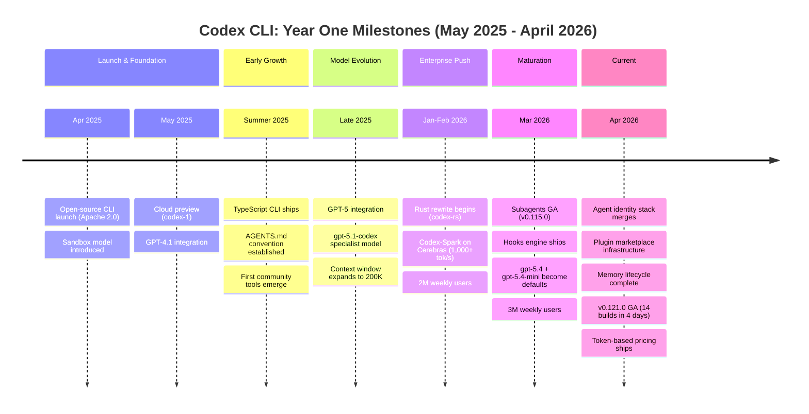
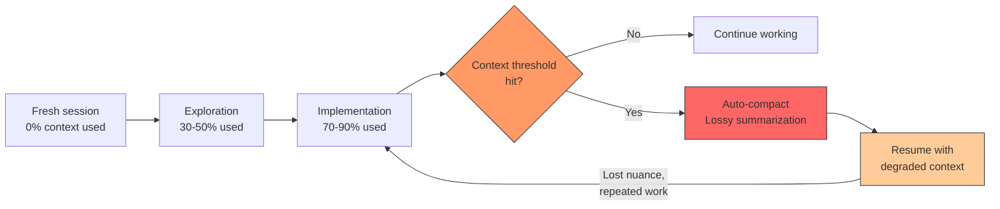
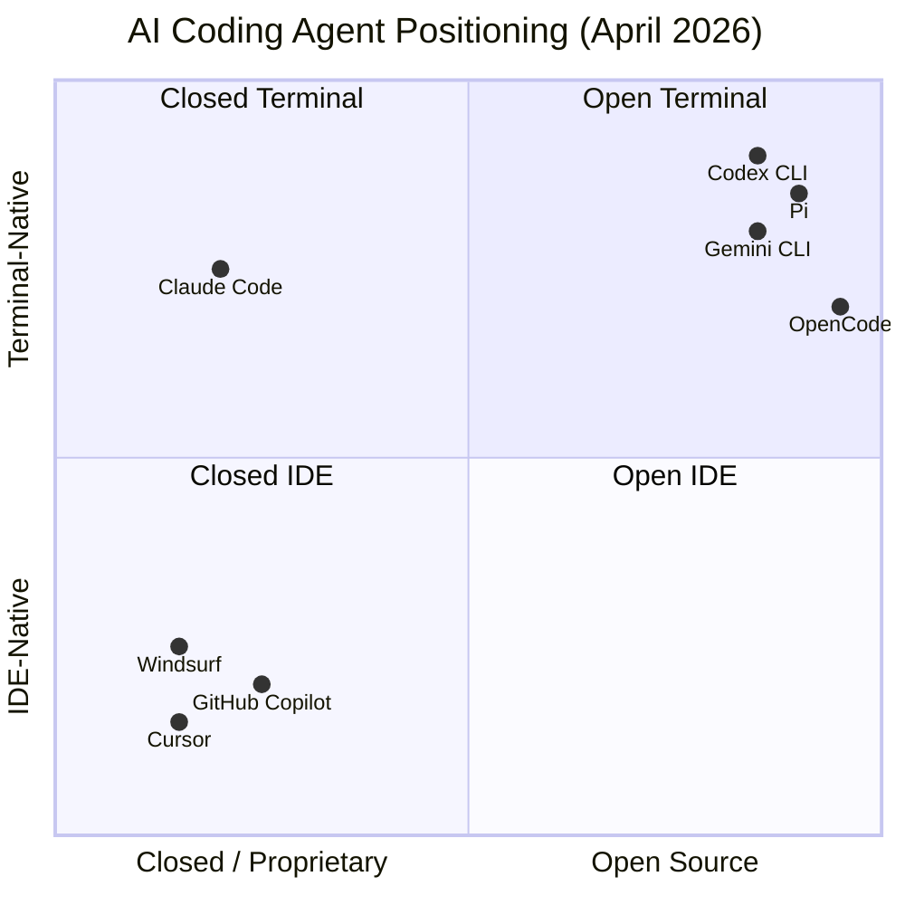

<p class="premium-pdf-download"><a href="/premium-pdfs/01-codex-cli-at-one-year.pdf"><strong>Download PDF</strong></a></p>

> **The Agentic Engineering Series** — From experiment to enterprise. This is article 1 of 13.
> *This article assesses the platform — one year of Codex CLI in production, and whether the tooling is ready for enterprise scale.*
> [Next: Agentic Engineering Is Not Vibe Coding](/premium/02-agentic-engineering-is-not-vibe-coding/) | [Series overview](#series)

> **Series context:** This is article 1 of 13 in *From Experiment to Factory*. Having established in Article 01 why experimentation is not enough, this article is **The Platform** — an honest assessment of whether Codex CLI, after one year in production, is mature enough to serve as the foundation for enterprise-scale agentic engineering.

*Written 2026-04-15. Based on one year of daily tracking: changelogs, GitHub PRs, benchmark data, community signals, and production use across dozens of codebases.*

# Codex CLI at One Year: What We Got Right, What We Got Wrong, and What's Coming Next

## One Year and 67,000 GitHub Stars Later

One year and 67,000 GitHub stars later, here is what OpenAI got right, and what they got wrong, with Codex CLI.

On April 16, 2025, OpenAI open-sourced a terminal-based coding agent under the Apache 2.0 license.[^1a] The repo hit the front page of Hacker News within hours. Three million weekly active users followed.[^1] So did a 520-comment thread about runaway token costs,[^9] a TypeScript-to-Rust rewrite that alienated contributors, and a Windows experience that still breaks in new and creative ways every release cycle.

This is not a press release. This is an honest assessment, based on tracking every changelog entry, reading every significant PR, and following daily community usage patterns over the past year, of whether the tool that bet on the terminal as the right surface for AI agents has earned that bet.

## The Timeline: Twelve Months in Milestones

Before the analysis, the facts. Here are the inflection points that defined Codex CLI's first year.



Each of these milestones deserves its own article (and many have gotten one). But the pattern they form is more interesting than any single event: Codex CLI evolved from a clever demo into production infrastructure in about ten months. That's fast by any measure. It's also incomplete, and the gaps matter.

## What We Got Right

### 1. The Sandbox Model Was the Right Call

The single best architectural decision in Codex CLI's first year was shipping with a sandbox from day one.

When the tool launched, it offered three permission levels: `suggest` (read-only), `auto-edit` (file writes with approval), and `full-auto` (autonomous execution in a sandboxed environment). The sandbox used platform-native isolation — Seatbelt on macOS, Landlock and seccomp on Linux, Windows Firewall rules on Windows — rather than Docker containers or VMs.

This was the right call for three reasons.

First, it made the "let the agent run autonomously" mode safe enough to actually use. Claude Code launched without meaningful sandboxing and spent months dealing with reports of autonomous destructive operations.[^2] Codex's sandbox meant that `full-auto` mode could delete files, run tests, and iterate on code without touching anything outside the workspace. Developers trusted it enough to leave it running overnight.

Second, platform-native sandboxing meant no Docker dependency. This sounds minor until you're on a locked-down corporate laptop where Docker Desktop requires an enterprise license and IT approval. Codex CLI worked out of the box on vanilla macOS and Linux installations. The enterprise deployment story started here.

Third, the sandbox became the foundation for everything that followed. Smart Approvals (the guardian subagent that reviews pending actions in full-auto mode) only works because the sandbox provides a meaningful security boundary. The hooks engine only makes sense when you have a sandbox to enforce its decisions. Enterprise features like managed deny-read patterns (`permissions.filesystem.deny_read` in `requirements.toml`) build directly on the sandbox's permission model.

The sandbox isn't perfect — symlinked writable roots caused issues that took months to fix[^3], Windows sandbox has ongoing isolation gaps[^4], and the macOS Seatbelt policy blocked legitimate DNS tools until April 2026[^5]. But the decision to build on native OS isolation rather than ignoring the problem was foundational.

### 2. Open Source and Apache 2.0 Created Real Ecosystem

Codex CLI shipped under Apache 2.0. Not "source available." Not "community edition with an enterprise upsell." A real open-source license that lets companies modify, redistribute, and build commercial products on top of it.

The ecosystem that emerged validated this choice:

- **awesome-codex-cli** now curates 245+ community tools[^6]
- **Agentmaxxing** became a mainstream practice — multiplexers like AMUX, dmux, and Emdash make running 10+ parallel Codex agents practical
- **codex-plugin-cc** (OpenAI's official "Codex inside Claude Code" plugin) exists because the architecture is open enough to bridge competing tools
- **MCP servers** are shipping Codex plugin manifests — `sooperset/mcp-atlassian` (4.8K stars) added a Codex manifest in early April 2026[^7]

The competitive contrast matters. Claude Code's closed-source approach led to community friction: users extracting its source code (1,906 TypeScript files in one incident), billing opacity complaints with 478+ comment threads, and migration to open alternatives like OpenCode (95K stars) and Pi.[^8] Codex's openness didn't eliminate complaints — the 520+ comment token burn thread is real[^9] — but it meant the community could diagnose, quantify, and sometimes fix the problems themselves.

### 3. The Hooks System Changed the Enterprise Conversation

When Codex shipped hooks in v0.114.0 (March 11, 2026), it transformed from a developer tool into enterprise infrastructure.

The hooks model is straightforward. Shell scripts that fire at specific lifecycle points:

| Hook | Trigger | Enterprise Use |
|------|---------|----------------|
| `SessionStart` | Session begins | Pre-flight checks, context loading |
| `Stop` | Session ends | Cleanup, audit logging, team notification |
| `UserPromptSubmit` | Before prompt enters conversation | Policy enforcement, audit trails |
| `PreToolUse` | Before a tool call executes | Command blocking, exfiltration prevention |
| `PostToolUse` | After any tool executes | Auto-testing, compliance checks |
| `PermissionRequest`* | When agent requests elevated access | Custom approval gates, progressive trust |

*PermissionRequest landed in v0.121.0-alpha.6 (April 2026) and is still in alpha alongside the five GA hooks above.

The `userpromptsubmit` hook (v0.116.0, March 19) was the one that opened doors in regulated environments. A shell script receives the raw prompt on stdin, can modify or block it, and exits with a status code. Exit 0 means allow; exit 1 means block. That's simple enough for a compliance team to audit and approve.

PermissionRequest hooks, which landed in v0.121.0-alpha.6 (April 13), took this further. Hooks can now intercept permission escalation requests with contextual suggestions, grant directory-level permissions progressively, and inject new permission rules dynamically.[^10] This turns the hook system from simple approve/deny into a programmatic policy engine — exactly what enterprise security teams want.

The hooks system isn't complete. PreToolUse and PostToolUse (shipped in v0.117.0) currently only fire for Bash tool calls, not for `apply_patch` file writes (tracked in issue #16732). PermissionRequest hooks are still in alpha. And the hook execution model is synchronous, which creates latency in multi-agent scenarios. But the architecture is sound and the trajectory is clear.

### 4. AGENTS.md Was an Underrated Innovation

The `AGENTS.md` convention — a markdown file in your repo that gives the agent project-specific context — turned out to be one of Codex CLI's most important contributions. Not because the idea is technically complex (it's a file the agent reads), but because it established a *portable convention* for AI agent context.

AGENTS.md files now work across Codex CLI, the Codex desktop app, the IDE extension, and cloud tasks. Other tools have adopted similar patterns (`.claude-project` files, `.gemini-context` directories). The convention spread because it solved a real problem: how do you give an AI agent the domain knowledge it needs without re-explaining your project in every conversation?

The hierarchical loading model — global `$CODEX_HOME/AGENTS.md`, then project root, then subdirectory-specific files — lets teams layer context. A global file sets coding standards; a project file describes the architecture; a subdirectory file explains the local conventions of a specific module. The `/status` command now shows exactly which AGENTS.md files were loaded and in what order[^11], making debugging straightforward.

The economic impact is also measurable. With token-based pricing (April 2026), well-structured AGENTS.md files that remain stable across turns benefit from the 10x cached-input discount.[^12] A stable 2,000-token AGENTS.md costs 10x less per turn than a 2,000-token prompt that changes every time.

## What We Got Wrong (Or Haven't Fixed Yet)

Honest assessment requires honest criticism. These are the areas where Codex CLI falls short of what its users need, ordered by severity.

### 1. Context Limits Are Still the Biggest Productivity Killer

The 200,000-token context window sounds enormous until you're working in a real codebase. A medium-sized TypeScript project with 200 files can exhaust that window in a single complex task. When the context fills up, Codex compacts — summarizing earlier conversation history to make room. Compaction is lossy. The agent loses nuance, forgets earlier decisions, and sometimes contradicts work it did ten minutes ago.

The compaction system has improved significantly. Prefix compaction (v0.119.0, April 2026) prewarms context summaries in the background before they're urgently needed, reducing the mid-task disruption.[^13] But the fundamental problem remains: the agent's working memory is smaller than many codebases. (For a deep dive into compaction mechanics and the strategies that mitigate context loss, see *Context Is All You Need*.)



The concurrent compaction race condition (issue #17514, April 2026) made this worse — multiple compactions could fire simultaneously, causing data loss or inconsistent state. The context meter UX was also a regression: the switch from numeric display to a progress bar drew multiple complaints from power users who needed precise at-a-glance visibility.[^14]

Real-world impact: on SWE-EVO (a benchmark testing sustained evolution of existing systems), the best models score under 20% on enterprise codebases[^15] — and context management is a primary reason. The gap between "isolated bug fix" performance (56.8% on SWE-bench Pro[^16]) and "multi-session evolution" performance (under 20%) is largely a context problem.

### 2. The TypeScript-to-Rust Migration Created Real Friction

Codex CLI launched as a TypeScript project. In early 2026, OpenAI began rewriting it in Rust (`codex-rs`). The technical rationale was sound: better performance, memory safety, and the security properties that enterprise and government customers demand (the FedRAMP compliance angle).

The execution has been rougher than it needed to be.

The Rust rewrite fragmented the codebase. The `codex-cli/` directory README was only cleaned up in April 2026[^17] — months after the Rust code became primary. Contributors who understood the TypeScript codebase had to re-learn everything in a different language. The npm install path on Windows broke repeatedly (issue #17432: `@openai/codex-win32-x64` missing from v0.120.0[^18]).

More importantly, the migration changed the project's character. The TypeScript CLI was approachable. A JavaScript developer could read the source, understand how it worked, and submit a PR. The Rust codebase — now spanning approximately 90 crates with a Bazel build system — is a significantly higher bar. The workspace now includes `codex-core`, `codex-mcp`, `codex-tools`, `codex-analytics`, and dozens of others. That's architecturally sound but community-hostile.

The compile-time improvements were impressive (48-63% reduction in codex-core rebuild times by replacing `#[async_trait]` with native async[^19]), but they only matter to contributors who can build the project at all. The TUI had a release-mode compilation failure hidden behind `#[cfg(not(debug_assertions))]` that CI missed entirely — caught by a community member building release binaries locally.[^20]

The Rust rewrite was probably the right long-term decision. But the transition cost was higher than it needed to be, and the reduced contributor accessibility is a real loss.

### 3. MCP Is Powerful but Rough

The Model Context Protocol (MCP) integration gives Codex CLI the ability to talk to external tools — databases, APIs, documentation servers, deployment systems. It's the extensibility mechanism that makes Codex useful beyond pure code editing.

It's also still rough.

The MCP tool namespace was inconsistent until April 2026 — direct and deferred MCP tools used different registration formats, causing "MCP tool not found" bugs that were difficult to diagnose.[^21] The GitHub connector shipped `create_pull_request` but not `create_issue` — a gap in the most basic Git workflow.[^22] MCP servers using Unix domain sockets didn't work inside sandboxed macOS sessions until explicit socket allowlists were added in v0.121.0.[^23]

Environment variable propagation failures, excessive approval prompts, and tool name sanitisation issues were noted as persistent gaps across the entire AI CLI ecosystem in the agents-radar digests.[^24] Codex isn't uniquely bad here — Claude Code and Gemini CLI have similar MCP friction — but being in the same category as everyone else isn't a strong position for a tool that aspires to be the best.

The deferred MCP tool loading pattern (merged April 2026) is a genuine improvement — it lazy-loads tool schemas instead of including them all in every context, reducing token overhead.[^25] Parallel MCP tool calls (the `supports_parallel_tool_calls` flag, merged April 13) showed a 46% speedup in testing.[^26] The trajectory is positive. But today, setting up a non-trivial MCP integration still requires more debugging than it should.

### 4. Windows Is Still a Second-Class Platform

A year in, Windows support remains a persistent friction point.

The April 12, 2026 issue tracker tells the story: 12 new issues in a single day, with Windows problems accounting for nearly half.[^27] The npm install failure (#17432), VS Code extension bugs (#17529), desktop app crashes (#17531), and the Windows Firewall sandbox setup regression that persisted for weeks (#17053) paint a picture of a platform that receives fixes but not enough preventive investment.

The Windows sandbox has fundamental isolation gaps (issue #17551: per-workspace capability SIDs may not isolate workspaces). Hooks were gated behind a platform check that prevented them from working on Windows at all until April 9, 2026 (PR #17268).[^28] The PowerShell exec policy wrapper could be bypassed until a security fix landed the same week.[^29]

WSL works. WSL2 works better. But "use WSL" is not a Windows strategy — it's an admission that the native experience isn't ready. Enterprise teams with Windows-first policies need a tool that works on Windows, not a tool that works on Linux-inside-Windows.

### 5. Cost Transparency Took Too Long

The token burn issue (#14593) accumulated 520+ comments over months before OpenAI shipped token-based billing in April 2026.[^30] During that period, users had limited visibility into why their quotas were draining faster than expected.

The April pricing shift to token-based credits ($40 per 1,000 credits, with model-specific rates[^12]) was the right move — it aligned Codex pricing with API pricing and made costs predictable. But it took too long to get there, and the tooling still lags behind the need.

Users can't yet see usage breakdowns beyond a 30-day window (issue #17584). The analytics pipeline for per-turn token consumption tracking only merged in April 2026.[^31] Third-party tools like ccusage, tokscale, and codextime have filled the gap, but cost visibility should be a first-party feature, not a community responsibility.

The 10x cached-input discount is a powerful lever that most users don't know about. Fast mode consuming 2x credits isn't prominently documented. The reasoning effort parameter (`model_reasoning_effort`) has a direct and significant impact on token consumption — the difference between `medium` and `xhigh` can be 3-5x — but there's no built-in way to see this in real time.

## The Competitive Landscape: Where Codex Fits

One year in, the AI coding agent market has crystallised into distinct niches. Here's where each major tool has landed.



### Codex CLI vs. Claude Code

The most common comparison, and the most interesting one.

Claude Code chose the premium closed-source path: polished experience, deep IDE integration, and Anthropic's Claude models. It has a strong following among developers who prioritize coding quality and are willing to pay for it.

But Claude Code's opacity has become a liability. The prompt cache TTL was silently reduced from one hour to five minutes in March 2026, causing unexplained quota inflation (issue #46829).[^32] The `/buddy` command removal (506-upvote consolidation thread) broke workflows that users had built around personality continuity. No new releases shipped for 24+ hours at a stretch while Codex was merging infrastructure PRs.[^8]

Codex CLI's advantage is structural: open source means transparency. When your token usage spikes, you can read the code to understand why. When a feature breaks, you can find the PR that caused it. When you need something custom, you can fork and modify.

Claude Code's advantage is model quality. Claude Opus 4.5 and 4.6 remain formidable coding models, and the tighter integration between Anthropic's agent scaffolding and its models produces a polished experience that Codex's model-agnostic architecture sometimes lacks.

### Codex CLI vs. Gemini CLI

Google's entry, still early. Gemini CLI shipped hard into Windows and WSL support (48 PRs in a single 24-hour sprint[^8]), which is exactly the area where Codex is weakest. The GCP ecosystem integration gives it a natural home in Google Cloud shops.

Gemini CLI is worth watching for enterprise customers already deep in the Google ecosystem. For everyone else, it's still catching up on the agentic capabilities (subagents, hooks, memory) that Codex has been shipping for months.

### Codex CLI vs. OpenCode and the OSS Alternatives

OpenCode hit 95K stars and represents the "fully open" approach — open-source tool, open-weight models, no vendor lock-in. Pi targets terminal-native power users with OpenRouter multi-provider support.

These tools serve an important niche: developers and organisations that can't or won't depend on OpenAI. Codex CLI's Apache 2.0 license makes it modifiable, but it still requires an OpenAI API key or ChatGPT subscription for its best experience. The custom model provider support exists, but it's not the primary path.

### The Strategic Positioning

The agents-radar ecosystem digests crystallised each tool's strategic direction as of April 2026:[^33]

| Tool | Strategic Direction | Key Differentiator |
|------|--------------------|--------------------|
| **Codex CLI** | Enterprise/FedRAMP, Rust security | Sandbox, hooks, open source |
| **Claude Code** | Premium closed-source, UI polish | Model quality, integration depth |
| **Gemini CLI** | GCP ecosystem, rapid iteration | Google Cloud native, Windows focus |
| **OpenCode** | Full OSS, privacy, voice/multimodal | No vendor lock-in, open weights |
| **Pi** | Terminal power users, multi-provider | OpenRouter, maximum flexibility |

## The State of Codex CLI Today (April 2026)

For readers who haven't looked at Codex CLI recently, here's a snapshot of the current state.

### The Model Roster

Four models are available as of April 14, 2026 (after legacy model removal[^34]):

| Model | Role | Context | Key Characteristic |
|-------|------|---------|-------------------|
| `gpt-5.4` | Default flagship | 1M tokens | Coding + reasoning + agentic workflows |
| `gpt-5.4-mini` | Subagent workhorse | 1M tokens | ~30% quota cost, 2x faster |
| `gpt-5.3-codex` | SWE specialist | 200K tokens | Deep software engineering tasks |
| `gpt-5.3-codex-spark` | Real-time pair programming | 128K tokens | 1,000+ tok/s on Cerebras hardware (Pro only) |

The recommended setup: `gpt-5.4` as your daily driver and orchestrator, `gpt-5.4-mini` for subagent workers (five parallel mini workers cost about the same as 1.5 flagship queries), and `gpt-5.3-codex` for extended autonomous SWE runs.[^35]

### Subagents Are General Available

Since v0.115.0 (March 16, 2026), up to six concurrent subagents can run in a single session. Three built-in roles (explorer, worker, default) cover common patterns. Custom agents are defined in TOML files:

```toml
# .codex/agents/test-runner.toml
name = "test-runner"
description = "Runs tests and diagnoses failures"
model = "gpt-5.4-mini"
model_reasoning_effort = "medium"
sandbox_mode = "workspace-write"
```

Smart Approvals — a lightweight guardian subagent that reviews pending actions rather than blindly auto-approving — makes `--full-auto` mode meaningfully safer for CI and overnight runs.[^36]

### The Rust Codebase

The Rust rewrite (`codex-rs`) is now the primary codebase. The workspace spans approximately 90 crates. Key architectural components:

- **codex-core**: Session management, model interaction, tool execution
- **codex-mcp**: MCP client and server support
- **codex-tools**: Tool registry, specifications, discovery
- **codex-analytics**: Telemetry, token tracking, event pipeline
- **codex-exec-server**: Headless daemon for CI/CD and remote execution

Compile times were reduced 48-63% in the v0.119.0 cycle.[^19] The exec-server (`codex exec-server`) is the foundation for headless agent execution — separating the runtime from the TUI for CI/CD and remote scenarios.

### What Shipped in the Last 30 Days

The pace of development in March-April 2026 has been extraordinary. The v0.121.0 release cycle shipped 14 builds in four days (April 11-15) before reaching GA, touching every major subsystem:[^37]

- **Agent identity stack complete** (4-PR series, fully merged April 14): Each agent now has a cryptographically attributable identity. Foundation for enterprise multi-agent audit trails.
- **Memory lifecycle complete**: Create, consolidate, clean, delete, and TUI management. First time Codex offers programmatic memory deletion and a user-facing memory menu.
- **Plugin marketplace infrastructure**: Add/remove lifecycle, local and manifest sources, async plugin loading. Plugin distribution is becoming first-class.
- **Analytics pipeline live**: Full audit trail — token usage, steering metadata, thread context denormalization.
- **PermissionRequest hooks deepening**: Turn-scoped interrupts, progressive directory access, dynamic rule injection.
- **Enterprise security**: Managed deny-read restrictions via admin-enforced `requirements.toml`.

## Benchmarks: The Honest Numbers

Benchmarks are marketing ammunition. Here are the numbers with the necessary context.

### SWE-bench Pro (The Honest Measure)

SWE-bench Verified — the benchmark everyone cited in 2025 — is contaminated. OpenAI's own audit confirmed that every frontier model can reproduce verbatim gold patches for a subset of tasks, and 59.4% of hard tasks have flawed tests. OpenAI has stopped self-reporting Verified scores.[^15]

SWE-bench Pro is the replacement: 1,865 multi-language tasks, GPL-licensed codebases (creating legal barriers to training data inclusion), and a private held-out subset. The scores are humbling:

| Agent + Model | SWE-bench Verified | SWE-bench Pro (Public) | Pro Private |
|---------------|-------------------|----------------------|-------------|
| Claude Opus 4.5 | 80.9% | 45.9% | — |
| Codex CLI + GPT-5.3-Codex | — | 56.8% (OpenAI scaffold) | — |
| GPT-5 (SEAL standardised) | — | 41.8% | 14.9% |

The 56.8% number uses OpenAI's own scaffolding, which adds 4-12 points over standardised evaluation.[^16] On the SEAL leaderboard with standardised scaffolding, the gap narrows considerably.

### Terminal-Bench 2.0 (The CLI-Native Benchmark)

Terminal-Bench 2.0 is the most relevant benchmark for Codex CLI users — 89 end-to-end tasks in Docker containers covering software engineering, ML, sysadmin, and security.[^38]

| Agent + Model | Score |
|---------------|-------|
| ForgeCode + Claude Opus 4.6 | 81.8% |
| ForgeCode + GPT-5.4 | 81.8% |
| SageAgent + GPT-5.3-Codex | 78.4% |
| Codex CLI + GPT-5.2 | 63% |

The frontier is clustered between 78-82% — no model dominates. Note: these scores were measured on Opus 4.6; Anthropic released Opus 4.7 on April 16, 2026, with improved agentic execution rigor and self-verification, which may shift the leaderboard further.[^39a] The critical finding: model capability matters more than scaffold choice. Codex CLI's resolution rate increased 52% when upgrading from GPT-5-Nano to GPT-5.2.[^39]

### The Real Benchmark

On SWE-EVO (sustained evolution of existing systems), the best models score 21% — compared to 65% on SWE-bench Verified. On commercial/enterprise codebases, under 20%.[^15]

The gap between benchmark performance and real-world performance is the most important number in this entire section. No tool has closed it. Codex CLI's sandbox, hooks, and AGENTS.md system help (good scaffolding adds 4-12 points), but the honest assessment is that we're all still early.

## What's Coming: The Next Twelve Months

Predictions are dangerous. Here are mine, grounded in the current development trajectory and observable signals.

### Near-Term (Q2 2026): The Enterprise Release

The v0.121.0 stable release, likely within days, will be the most significant enterprise feature release in Codex CLI's history. The agent identity stack, memory lifecycle management, managed deny-read restrictions, and analytics pipeline are all merged and in alpha testing.

Expect:

- **Agent identity GA**: Every subagent action attributable to a specific agent identity. This is the prerequisite for enterprise multi-agent audit trails and cost attribution.
- **Plugin marketplace GA**: Plugin distribution becomes a solved problem for teams. Private registries via local and manifest marketplace sources.
- **Memory in production**: Cross-session persistent memory transforms Codex from a stateless tool into a learning assistant. The memories menu, cleaning endpoints, and deletion API are all merged.

### Mid-Term (Q3-Q4 2026): The Platform Shift

Three architectural trends will define the second half of 2026:

**1. Codex-Spark GA.** The 1,000+ tok/s model on Cerebras hardware is currently research preview, Pro only. When it reaches general availability, it enables a qualitatively different interaction pattern — the agent feels like a live collaborator, not a batch process. The two-mode vision (Spark for real-time pair programming, GPT-5.x for deep autonomous work) is compelling, but only if Spark becomes accessible to the broader user base.

**2. Remote execution as the default.** The exec-server architecture, waypoints (multi-host remote execution via SSH[^40]), and named execution environments are all in development. The trajectory points toward a world where Codex CLI is a thin client that connects to execution environments — local, remote, cloud, or containerised. This is the infrastructure for enterprise deployment at scale.

**3. "Spud" / GPT-6.** Codenamed internally, pretraining reportedly completed around March 24, 2026. Greg Brockman called it "two years of research" and "not an incremental improvement."[^41] If GPT-6 delivers a meaningful jump in sustained multi-file reasoning (the thing that limits SWE-EVO scores), it will transform what Codex CLI can do in a single session.

### Long-Term Bet: Agent Pods as the Default Workflow

The convergence of subagents, persistent memory, agent identity, and inter-agent messaging points toward a future where the default Codex workflow isn't "one agent, one task" but "an orchestrated team of specialised agents."

The infrastructure is nearly there. Durable timers (SQLite-backed, surviving process restarts), queued external message delivery, path-based agent addressing (`/root/agent_a`), and the orchestrator/worker pattern with configurable spawn hints are all shipped or in late-stage alpha.

What's missing is the user experience. Setting up an agent pod today requires TOML configuration, mental model understanding of the subagent system, and patience for debugging inter-agent communication. The next year needs to make this as easy as `codex --team "review this PR"` — where the tool automatically spins up the right agents with the right roles.

## The Honest Summary

Codex CLI at one year is a tool that made several genuinely excellent architectural decisions (sandbox, open source, hooks, AGENTS.md) and is now dealing with the consequences of rapid growth and an ambitious rewrite.

**It's genuinely great for:**

- Terminal-native developers who want AI in their existing workflow
- Enterprise teams that need auditable, sandboxed, hook-driven agent execution
- Multi-agent workflows where cost-efficient subagent delegation matters
- Teams that value transparency and community extensibility

**It's still frustrating for:**

- Windows-first teams who need native (not WSL) support
- Developers working in large codebases that exceed context limits
- Users who need reliable MCP integrations without debugging namespace issues
- Anyone who needs detailed, real-time cost visibility

**The trajectory is strongly positive.** The development velocity — 14 alpha builds in four days, major architectural features landing weekly, 3 million weekly users with 50% month-over-month growth — indicates a tool that is being actively invested in, not coasting.

The question for the next year isn't whether Codex CLI will improve. It will. The question is whether it will improve *fast enough* in the areas where it's weakest (context management, Windows, cost transparency) to maintain its position as the competitive landscape heats up.

The assessment here: yes, but it will be closer than it should be. The Rust rewrite was necessary but expensive in community goodwill and contributor accessibility. The enterprise focus is strategically correct but risks leaving individual developers feeling like afterthoughts. And the context limit problem is ultimately a model capability issue that no amount of clever engineering can fully solve until the models get better at sustained, long-horizon reasoning.

Codex CLI at one year is not the best AI coding tool in every dimension. It is the most *architecturally sound* one. The sandbox, the hooks, the open source model, the AGENTS.md convention, the subagent system — these are the right foundations. The next year will determine whether those foundations translate into the best daily experience, or whether a competitor with worse architecture but better polish steals the moment.

The evidence favours Codex CLI, but the margin is narrower than its architectural advantages might suggest, and honesty requires saying so.

The platform is assessed. The next step in building the factory is codifying the instructions that turn ad-hoc prompting into repeatable infrastructure. In [Article 05: The AGENTS.md Playbook](/premium/05-the-agents-md-playbook/), we move from evaluating the platform to writing the blueprint that every agent session will follow.

## Citations

## The Agentic Engineering Series {#series}

From experiment to enterprise — building the factory for AI-assisted software engineering at scale.

| | Article | Role |
|---|---------|------|
| **1** | **[Codex CLI at One Year](/premium/01-codex-cli-at-one-year/)** | **The Platform** |
| 2 | [Agentic Engineering Is Not Vibe Coding](/premium/02-agentic-engineering-is-not-vibe-coding/) | The Wake-Up Call |
| 3 | [The Agentic Pod](/premium/03-the-agentic-pod/) | The Team Model |
| 4 | [TDAD and the Testing Revolution](/premium/04-tdad-and-the-testing-revolution/) | The Quality Gate |
| 5 | [The AGENTS.md Playbook](/premium/05-the-agents-md-playbook/) | The Blueprint |
| 6 | [Inside the Machine](/premium/06-inside-the-machine/) | The Engine |
| 7 | [Complete Guide to Codex Security](/premium/07-complete-guide-to-codex-security/) | The Guardrails |
| 8 | [Context Compaction and Memory](/premium/08-context-compaction-and-memory/) | The Efficiency Layer |
| 9 | [Three Terminals, Three Fates](/premium/09-three-terminals-three-fates/) | The Toolchain |
| 10 | [AI Slopageddon](/premium/10-ai-slopageddon/) | The Risk |
| 11 | [Token Economics and ROI](/premium/11-token-economics-and-the-roi-of-coding-agents/) | The Business Case |
| 12 | [The Scaling Playbook](/premium/12-the-scaling-playbook/) | The Rollout |
| 13 | [The Agentic Engineering Maturity Matrix](/premium/13-the-agentic-engineering-maturity-matrix/) | The Assessment |

[^1]: Sam Altman announced 3 million weekly active Codex users on April 8, 2026, up from 2 million in early March — 50% growth in under a month. Source: [Business Today — OpenAI Codex celebrates 3 million weekly users](https://www.businesstoday.in/technology/story/openai-codex-celebrates-3-million-weekly-users-ceo-sam-altman-resets-usage-limits-524717-2026-04-08)

[^2]: Claude Code autonomous destructive operations despite safeguards. Source: GitHub issue #46779 in the Claude Code repository; agents-radar ecosystem digest #557.

[^3]: Sandbox symlinked writable roots fix: PR #15981, merged April 11, 2026. Fixed permission handling for symlinked writable roots — resolved 7 issues including #15781, #17079, #14672.

[^4]: Windows sandbox per-workspace capability SIDs isolation gap: GitHub issue #17551.

[^5]: macOS Seatbelt DNS blocking fixed in PR #17370, merged April 11, 2026. Allowed raw DNS egress to port 53 when `allow_local_binding` is enabled.

[^6]: awesome-codex-cli tool count as of April 2026. Source: [codex-resources article — The Codex CLI Ecosystem Map: 245+ Tools](https://codex.danielvaughan.com/2026/04/11/codex-cli-ecosystem-map-245-tools/).

[^7]: MCP server Codex plugin manifest adoption trend. Source: codex-resources notes on plugin manifest adoption, April 2026.

[^8]: Competitive landscape and Claude Code friction signals. Source: agents-radar ecosystem digests #557 and #558, April 13, 2026.

[^9]: Token burn issue #14593 with 520+ comments. Source: [github.com/openai/codex/issues/14593](https://github.com/openai/codex/issues/14593).

[^10]: PermissionRequest hooks deepening: PRs #17757 (turn-scoped interrupts), #17755 (addDirectories), #17746 (addRules injection). Source: GitHub PR activity, April 14, 2026.

[^11]: AGENTS.md sources exposed via app server: PR #17506, merged April 12, 2026. Also PR #17091 (global AGENTS.md in /status), merged April 8, 2026.

[^12]: Token-based pricing effective April 2026: GPT-5.4 at 375 credits/1M output tokens ($15/1M). Cached input 10x cheaper than standard input. Source: [developers.openai.com/codex/pricing](https://developers.openai.com/codex/pricing).

[^13]: Prefix compaction prewarming: PR #17286, v0.119.0+ cycle. Background prefix compaction prewarms context summaries before they're needed.

[^14]: Context meter UX regression: GitHub issues #17313 (7 comments), #17438, #17437. PR #17420 (context percent in status line) was the response.

[^15]: SWE-EVO benchmark showing 21% vs 65% gap; enterprise codebase performance under 20%. Source: [SWE-EVO: Benchmarking Coding Agents — arXiv](https://arxiv.org/html/2512.18470v1). SWE-bench Verified contamination confirmed by OpenAI audit: [SWE-Bench Pro Leaderboard analysis](https://www.morphllm.com/swe-bench-pro).

[^16]: Codex CLI with GPT-5.3-Codex: 56.8% on SWE-bench Pro (Public) with OpenAI scaffolding. Standardised scaffolding adds 4-12 points. Source: [OpenAI debuts GPT-5.3-Codex — Neowin](https://www.neowin.net/news/openai-debuts-gpt-53-codex-25-faster-and-setting-new-coding-benchmark-records/); [Scale Labs SEAL Leaderboard](https://labs.scale.com/leaderboard/swe_bench_pro_public).

[^17]: Obsolete codex-cli README cleanup: PR #17096, merged April 7-8, 2026.

[^18]: Windows npm install failure: GitHub issue #17432 — `npm install` gets v0.120.0 but fails with missing `@openai/codex-win32-x64`.

[^19]: Codex-core compile times reduced 48-63%: PRs #16630, #16631 — native async RPITIT replacing `#[async_trait]`.

[^20]: TUI release-mode compilation failure: community contribution by davidhao3300, caught by building release binaries locally. CI missed due to debug-only build configuration.

[^21]: MCP tool namespace unification: PR #17404, addressing inconsistency between direct and deferred MCP tool registration formats.

[^22]: GitHub connector missing `create_issue`: GitHub issue #17513.

[^23]: Unix socket allowlists in macOS sandbox: PR #17654, enabling MCP servers using Unix domain sockets to work inside sandboxed sessions.

[^24]: MCP ecosystem friction documented across tools: agents-radar digest #485, April 9, 2026.

[^25]: Deferred MCP tool loading: PR #17556 (flattened deferred MCP tool calls), merged April 12, 2026.

[^26]: Parallel MCP tool calls: PR #17667 (`supports_parallel_tool_calls` flag), merged April 13, 2026. 46% speedup (59s serial to 32s parallel).

[^27]: April 12, 2026 issue volume: 12 new issues in one day, including 6 Windows-related issues. Source: github.com/openai/codex/issues.

[^28]: Windows hook gate removal: PR #17268, merged April 9, 2026.

[^29]: PowerShell exec policy bypass fix: PR #17393, unwrapping PowerShell-wrapped commands for policy evaluation.

[^30]: Token burn issue timeline: #14593 accumulated 520+ comments before token-based billing shipped in April 2026.

[^31]: Analytics pipeline PRs #16640, #16641, #16706, #16870 — all merged April 14, 2026. Full per-turn token consumption tracking.

[^32]: Claude Code prompt cache TTL reduction: agents-radar digest, March 2026; GitHub issue #46829.

[^33]: Competitive positioning analysis: agents-radar #486 (OpenClaw ecosystem digest), April 9, 2026.

[^34]: Legacy model removal effective April 14, 2026: gpt-5.2-codex, gpt-5.1-codex-mini/max, gpt-5.1, gpt-5 all removed for ChatGPT sign-in users. Source: [developers.openai.com/codex/changelog](https://developers.openai.com/codex/changelog).

[^35]: Model selection recommendations: [developers.openai.com/codex/models](https://developers.openai.com/codex/models). Five parallel `gpt-5.4-mini` subagents consume approximately the same quota as 1.5 `gpt-5.4` queries.

[^36]: Subagents GA in v0.115.0, March 16, 2026. Smart Approvals: guardian subagent reviewing pending actions in full-auto mode. Source: [developers.openai.com/codex/changelog](https://developers.openai.com/codex/changelog).

[^37]: v0.121.0 release cycle: 14 builds over 4 days (April 11-15, 2026), culminating in GA. Source: GitHub release tags `rust-v0.121.0-alpha.1` through `rust-v0.121.0-alpha.14` and GA tag.

[^38]: Terminal-Bench 2.0: 89 curated tasks in Docker containers, crowd-sourced from 93 contributors. Source: [Terminal-Bench 2.0 — tbench.ai](https://www.tbench.ai/).

[^39]: Codex CLI resolution rate 52% improvement from model upgrade: [Terminal-Bench: Benchmarking Agents on Hard, Realistic Tasks in CLI — arXiv](https://arxiv.org/abs/2601.11868).

[^39a]: Anthropic, "Introducing Claude Opus 4.7." Released April 16, 2026. Improved agentic execution rigor, self-verification, enhanced vision (3.75MP), new `xhigh` effort level. Pricing unchanged at $5/$25 per MTok. https://www.anthropic.com/news/claude-opus-4-7

[^40]: Waypoints (multi-host remote execution): PR #17362, SSH-backed remote hosts with WebSocket-over-SSH transport. Draft status as of April 11, 2026.

[^41]: "Spud" / GPT-6 signals: pretraining reportedly completed ~March 24, 2026. Greg Brockman: "two years of research — not an incremental improvement." Polymarket: 78% probability of release by April 30, 95%+ by June 30. Source: [happycapyguide.com — ChatGPT 5.5 Super App Launch](https://happycapyguide.com/blog/openai-chatgpt-55-super-app-codex-atlas-desktop-launch-april-2026).

[^1a]: "OpenAI debuts Codex CLI, an open source coding tool for terminals," TechCrunch, April 16, 2025. <https://techcrunch.com/2025/04/16/openai-debuts-codex-cli-an-open-source-coding-tool-for-terminals/>
