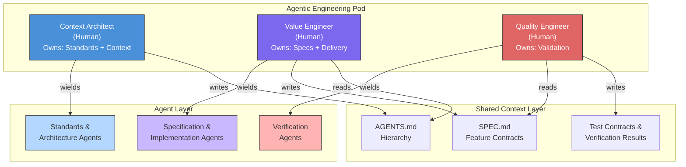
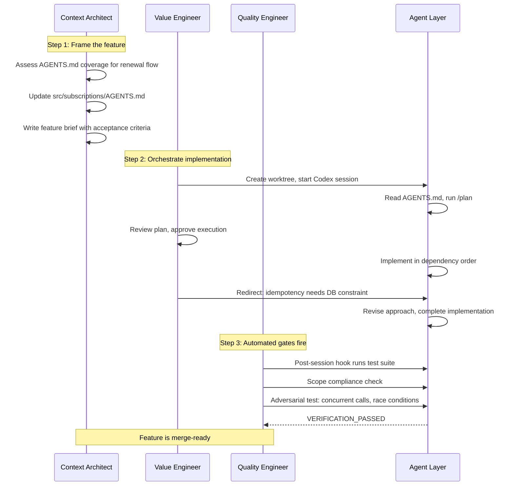
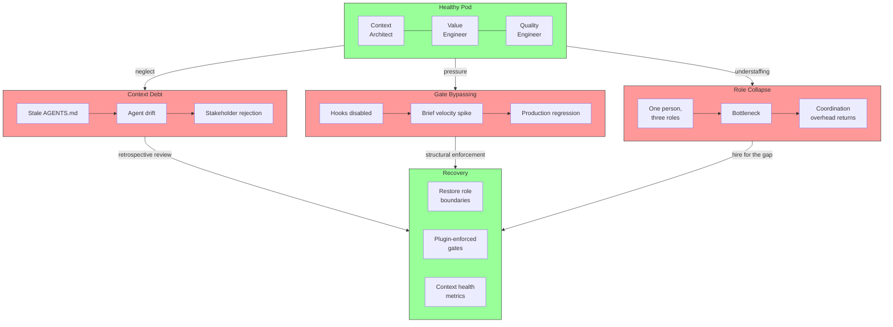
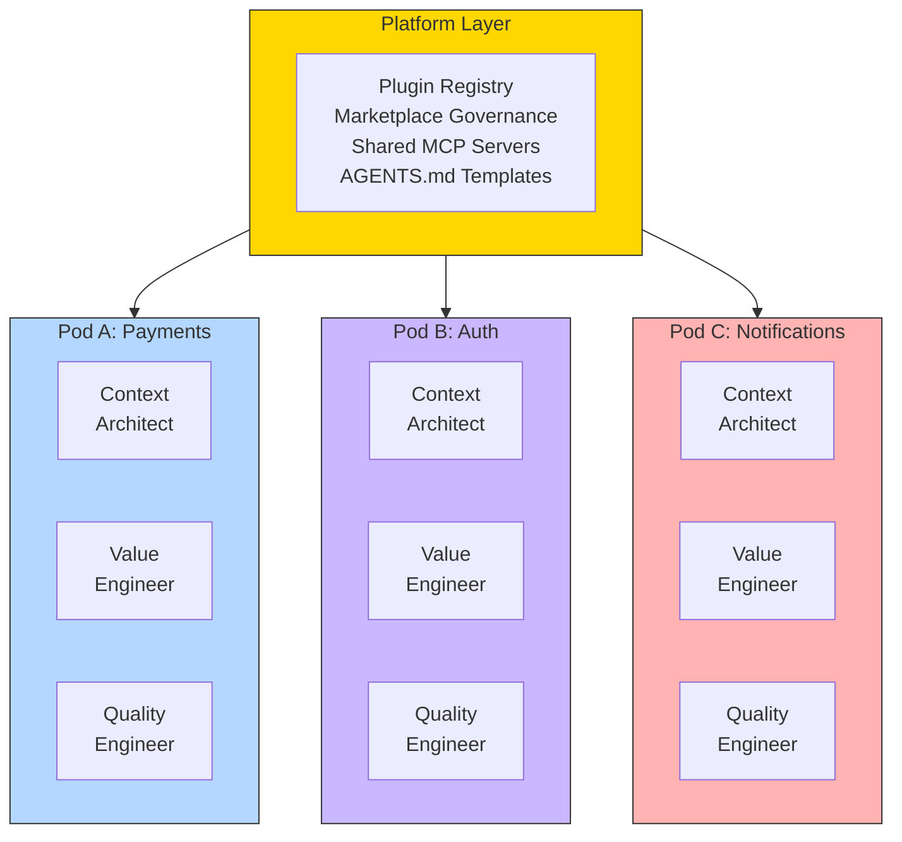

<p class="premium-pdf-download"><a href="/premium-pdfs/03-the-agentic-pod.pdf"><strong>Download PDF</strong></a></p>

> **The Agentic Engineering Series:** from experiment to enterprise. This is article 3 of 13.
> *This article defines the team, the three-person pod that turns the framework into an operating model.*
> [Previous: Agentic Engineering Is Not Vibe Coding](/premium/02-agentic-engineering-is-not-vibe-coding/) | [Next: TDAD and the Testing Revolution](/premium/04-tdad-and-the-testing-revolution/) | [Series overview](#series)

> **Series context:** This is article 3 of 13 in *From Experiment to Factory*. With the blueprint, quality gate and platform established, the factory now needs an operating model. This article is **The Team Model**, the three-person agentic pod that organises humans and agents for production, so every part of the factory has a clear owner.

# The Agentic Pod: Three Engineers, One Mission, Zero Coordinators


## The question agents cannot answer

An agent ships a feature. The tests pass. The code looks tidy. The stakeholder still says it is wrong.

That is the first problem the agentic pod is designed to solve. The issue is rarely that the model could not write the code. The issue is that nobody owned the full chain from business intent to implementation to proof. One person wrote the brief, another watched the session, someone else glanced at the tests, and the mistake slipped between the seams.

Basecamp built a large software business around small teams. Jason Fried and David Heinemeier Hansson argued in *Rework* that tight constraints force clarity, reduce coordination overhead and make fuzzy ownership harder to hide[^6]. Ryan Singer turned that instinct into a delivery model in *Shape Up*: a small team gets a shaped pitch and clear autonomy for a fixed cycle, with no project manager acting as traffic controller[^7].

That logic becomes sharper once agents handle much of the execution. OpenAI's Codex Day keynote in April 2026 gave the cleanest proof point. A team of three engineers (later growing to seven) spent five months building a production product that now serves millions of users, and they wrote none of the code themselves — an approach OpenAI calls "Harness Engineering"[^11]. Codex generated approximately one million lines of code across roughly 500 npm packages, with some agent tasks running for more than 24 hours. The humans focused on architecture, constraints and code review.

In an agentic system, the three-person constraint is not a compromise. It is the structure that keeps speed from turning into drift. Agents are fast. They are often good. They still cannot tell you whether the thing they built was the right thing to build, whether the context was stale, or whether the verification was strong enough to trust.

Traditional software teams were built for a world in which humans did the typing. Requirements moved to engineers, engineers moved work to QA, QA handed off to operations. Every handoff cost time and context. When agents are doing the typing, those handoffs become even more expensive, because the execution layer is no longer the bottleneck[^1].

The deeper problem is diffuse ownership. If no one owns the path from outcome to production verification, no one can tell you whether the system is doing the right thing, correctly and safely.

Chapter 32 of *Codex CLI: The Complete Guide* answers that with a blunt simplification: three humans, three roles, one shared context layer and zero coordinators. The agents execute. The humans judge. That is the pod. This article unpacks the roles, the configurations, the lifecycle, the operating rules, the failure modes and the infrastructure that lets the model scale across an enterprise.

## Why three? Not two, not five, three

Three is not branding. It is the smallest team that can hold business intent, technical orchestration and trust as separate responsibilities at the same time.

In a three-person pod, everybody produces. Nobody exists to coordinate the others. Agents take routine execution work, boilerplate, scaffolding, test generation and repetitive runs, which leaves the humans free to make higher-judgment decisions[^1].

Add a fourth person and you usually add either redundancy or coordination. Add a fifth and you are back in familiar territory: more handoffs, more explanation, more room for responsibility to blur.

The principle underneath the pod is simple: **people direct agents; they do not manage other people.** Coordination runs human to agent, not human to human. When demand rises, you spin up another pod that shares the same platform layer. You scale the platform, not the pod[^1].

That is not a cultural preference. It is a structural rule. The rest of the model, including the hook system, plugin packaging and marketplace governance, exists partly to make breaking that rule harder.

## The three roles

The pod's three roles map to the three questions that stay with humans even when agents do most of the execution[^1]:

| Role | Type | Owns | Answers |
|------|------|------|---------|
| **Context Architect** | **Human** | The 'why' and the standards | What standards apply? What reference architectures guide the work? What context do agents need? What guardrails apply? |
| **Value Engineer** | **Human** | The 'what' and the 'how' | What is most valuable to build? What does the feature specification look like? How do we orchestrate agents to implement it? |
| **Quality Engineer** | **Human** | The 'trust' | Is the validation in place to honour the specification? Can we demonstrate that what was built is correct, safe and reliable? |

> **All three pod roles are human.** Codex sessions, hooks and automated gates are tools. They are not roles in the org chart[^1].

These boundaries are not administrative niceties. They reflect the three ways an agentic system fails in practice: bad context, bad orchestration or bad verification. The pod makes those failures visible and attributable, which is what lets you fix them.



## Role 1: The Context Architect

### What they own

The Context Architect owns the standards, reference architectures and operating environment. They are responsible for whether agents are working from accurate context, whether the architectural direction is sound and whether the strategic guardrails still match business intent. Their leverage comes from building reusable standards, context, skills and guardrails — not from writing individual feature specifications[^1].

The role has four main responsibilities:

**Standards and reference architectures.** They own the pod's reusable production system: architectural patterns, coding standards, context templates and guardrails. They set the standard for what a well-formed specification looks like, define the RFC 2119 vocabulary the team uses, and maintain the reference architectures that prevent each feature from reinventing foundational decisions.

**Strategic context and business alignment.** They are the main interface to business sponsors for strategic direction. They turn organisational goals into architectural context, own the product narrative at the system level and frame trade-offs in terms of cost to value, including what the book calls the 'economics of agency'. The Value Engineer translates this strategic context into specific feature priorities.

**Context engineering.** They curate patterns, documentation and decision records that give agents enough background to make correct low-level decisions. Signal-to-noise matters here. If you feed agents stale or contradictory context, you get stale or contradictory output.

**Strategic guardrails and policy.** They define legal, ethical and safety boundaries. They turn compliance requirements into policy, and they define escalation thresholds for what can run automatically and what still needs a human approval step.

### AGENTS.md, the Context Architect's primary artefact

AGENTS.md is not one more configuration file on the Context Architect's list. It is their main deliverable[^1]. Every Codex session the Value Engineer runs, and every automated gate the Quality Engineer fires, reads from the hierarchy the Context Architect owns. The quality of the pod's output is capped by the quality of that hierarchy.

The production hierarchy looks like this:

```text
~/.codex/AGENTS.md                      # Personal preferences, never committed
.codex/AGENTS.md                        # Repo-level: the pod's source of truth
src/payments/AGENTS.md                  # Domain constraints for bounded contexts
src/auth/AGENTS.md                      # Tighter security constraints for auth
.codex/roles/value-engineer.md          # Role-specific instructions
.codex/roles/quality-engineer.md        # Role-specific QE instructions
```

The repo-level `.codex/AGENTS.md` carries the product description, the acceptance criteria standard, the architectural constraints, the approved dependency list and the definition of done. It is the first document every pod agent should read. Subdirectory `AGENTS.md` files capture domain constraints that stay true across features and sprints. More specific files override more general ones, so an agent working inside `src/auth/` automatically picks up tighter rules without the operator having to repeat them in the prompt[^2].

A strong repo-level file looks like this:

```markdown
# Product Context

This service is the authoritative source for user subscription state.
Agents must not introduce any path where subscription state is derived
from more than one source of truth.

# Acceptance Criteria Standard

Every feature must include:
1. A user-facing outcome statement ("A user with [state] can [action]...")
2. At least one failure scenario with expected behaviour
3. A performance bound for any user-facing path (<200ms p95)

# Architectural Constraints

- All external data validated with zod at the boundary
- No cross-module database queries; each module owns its schema
- All state changes must emit an audit event before returning

# Approved Dependencies

See .codex/approved-deps.json. Adding an unlisted dependency requires
ADR approval before the agent proceeds.

# Autonomy Level

- Read-path changes: Policy-bounded (Level 3)
- Write-path changes: Approval-required (Level 2)
- Schema changes: Approval-required (Level 2)
- Infrastructure changes: Assist (Level 1)
```

### The autonomy ladder

The Context Architect does not only write context. They set the operating boundary for autonomy. Chapter 32 defines four levels[^1]:

```text
Level 1: Assist              Agent suggests; human reviews and applies every change
Level 2: Approval-required   Agent executes; human approves each action before it fires
Level 3: Policy-bounded      Agent executes within defined boundaries; exceptions escalate
Level 4: Self-remediating    Agent detects, diagnoses, and remedies within guardrails
```

You do not move up that ladder because the team feels more confident. You move up because the evidence supports it: test coverage, review history, audit logs and a pattern of safe operation. The levels also attach to change categories, not just modules. A payment system may stay at Level 2 for schema changes and still run at Level 3 for read-path optimisation.

### Spec-driven development: the pod's shared discipline

If AGENTS.md is the *standing* context that applies to every task, a specification file is the *situational* context for a specific feature. SDD formalises how the three pod roles collaborate to produce that specification[^10].

**The Context Architect** owns the standards and reference architectures that all specifications must honour. They maintain architectural patterns, define the RFC 2119 vocabulary the team uses (`MUST`, `SHOULD`, `MAY`), set quality standards for what a well-formed spec looks like, and curate the reference architectures that prevent each feature from reinventing foundational decisions. Their deliverables are the `AGENTS.md` hierarchy and the architectural guardrails that shape every spec — not the feature specs themselves.

**The Value Engineer** owns the feature specification. They decide what is most valuable to build and write the detailed `SPEC.md` that tells agents exactly what to implement. A `SPEC.md` contains three sections: an overview (what and why), requirements written in RFC 2119 language, and a high-level design (how, without implementation detail). The modal verbs give agents explicit signal about which constraints are hard and which are flexible. A `MUST` maps to a test assertion. A `SHOULD` warrants a comment but not a rejection.

```markdown
# Feature: Subscription Renewal

## Requirements
- The `/subscriptions/renew` endpoint MUST be idempotent per renewal period.
- Renewal MUST emit an `subscription.renewed` audit event before returning.
- The endpoint SHOULD complete within 200 ms at the 95th percentile.
- The response MAY include a `next_renewal_date` field for client display.

## Design
Use the existing SubscriptionService. All state changes go through the
audit pipeline defined in AGENTS.md. Do not introduce a new caching layer.
```

**The Quality Engineer** owns the validation infrastructure that honours the specification. They derive test contracts from `MUST` requirements, build the verification gates that prove the implementation satisfies the spec, and maintain the CI pipeline that enforces compliance. Without their validation layer, a spec is a wish list; with it, the spec becomes a contract with teeth.

The spec resolves the decision space *before* the Value Engineer's first agent session. Without it, the agent will make plausible architectural choices that may not match business intent — the most common failure mode in agentic workflows[^10].

For complex, multi-hour features, the Value Engineer also produces an **ExecPlan** (`PLANS.md`) — a living document the agent updates as it works. The ExecPlan captures the step-by-step execution path, a decision log for surprises encountered during implementation, and a retrospective section completed at the end. Every ExecPlan must be fully self-contained so a fresh session can resume without reconstructing context[^10].

The pipeline is: AGENTS.md (standards and reference architectures, owned by Context Architect) → SPEC.md (feature contract, owned by Value Engineer) → test contracts derived from MUST requirements (owned by Quality Engineer) → agent implementation against failing tests (orchestrated by Value Engineer). Each role owns a distinct stage. The Quality Engineer verifies the full chain.

Community tooling supports this flow. `cc-sdd` provides staged `/kiro:spec-*` commands with human review gates at each phase boundary. `codex-spec` manages a `.codex-specs/` directory with shared project context. GitHub's `spec-kit` adds a Constitution phase for project-wide principles. All three enforce what the pod model requires: specifications before code, and human sign-off before agent execution[^10].

### The Context Architect's TOML configuration

The Context Architect's sessions are standards and architecture sessions. They produce ADRs, update AGENTS.md files, define reference architectures, set spec quality standards and assess context drift. Those sessions need a high-reasoning model, but they should not run in full auto. The Context Architect sets policy and standards; they do not write feature specs or feature code[^1].

```toml
# .codex/agents/context-architect.toml
name = "context-architect"
description = "Standards, reference architectures, ADR authoring, AGENTS.md maintenance, context quality review."
developer_instructions = """
You are assisting the Context Architect with standards, reference architectures and context work.

Tasks you handle:
- Drafting or updating AGENTS.md files at any level of the hierarchy
- Writing or reviewing ADRs (Architecture Decision Records)
- Defining and maintaining reference architectures and design patterns
- Setting specification standards (RFC 2119 vocabulary, quality criteria)
- Assessing whether existing context documents are current and accurate
- Identifying gaps or contradictions in the context layer

Rules:
- Do NOT write feature implementation code
- Do NOT write feature specifications (that is the Value Engineer's responsibility)
- Do NOT modify source files outside .codex/ or docs/
- If producing an ADR, follow the format in .codex/adr-template.md
- Flag any context gap that would require a human decision before agents can proceed
- Output CONTEXT_COMPLETE when the document set is ready for pod use
"""
model = "gpt-5.4"
model_reasoning_effort = "xhigh"
approval_policy = "suggest"
sandbox_mode = "workspace-write"
```

The `approval_policy = "suggest"` setting is deliberate. A context mistake can poison every downstream agent session. That is the kind of error you want reviewed at the point of authorship, not cleaned up later.

## Role 2: The Value Engineer

### What they own

The Value Engineer owns product value decisions and end-to-end delivery. This is not a project manager with a better prompt library. It is a strong software engineer who decides what is most valuable to build, writes the detailed feature specification, and uses agents as force multipliers to implement it. They need the technical depth to validate agent output, spot architectural drift, catch subtle correctness failures and uphold implementation standards the agents cannot enforce on their own[^1].

The role breaks into five areas:

**Product value and feature specification.** They decide which features deliver the most value and write the `SPEC.md` — the feature contract with RFC 2119 requirements that tells agents exactly what to implement. The specification follows the standards and reference architectures set by the Context Architect. This is the role's defining deliverable.

**System orchestration and technical discovery.** They are the main technical contact for subject matter experts. They turn messy domain rules into operational system behaviour.

**Briefing engineering.** They write high-signal briefs with intent, constraints, examples and edge cases. Brief quality is one of the core craft skills of the role.

**Agentic loop engineering.** They choose convergence criteria, parallelism and stop conditions. They make explicit trade-offs between speed, token cost and confidence. They know when to let an agent run, when to redirect and when to restart with better context.

**Expert judgment and implementation standards.** They provide the final human read on logic and design. They catch architectural drift, product misses and correctness failures the agent may not see.

### Briefing engineering, the difference between low signal and high signal

The difference between a bad brief and a good one is not word count. It is specificity. Compare these two versions of the same request.

**Low signal:** 'Add a renewal endpoint to the subscriptions service.'

**High signal:**

> ## Task: Subscription Renewal Endpoint
>
> **Intent:** A user with `subscription.status = "expired"` can renew their subscription via `POST /subscriptions/renew` without re-entering payment details.
>
> **Constraints:**
>
> - Reuse the payment method stored at `user.paymentMethodId`
> - The renewal must be idempotent: calling the endpoint twice must not create two charges
> - Emit a `subscription.renewed` event before returning 200
>
> **Acceptance Criteria:**
>
> - User with `status=expired` receives `status=active` after a successful call
> - User with `status=active` receives a 409 with body `{"error": "already_active"}`
> - Stripe failure returns 502 with a logged error; subscription state unchanged
> - Response time < 200ms p95 under nominal load
>
> **Out of Scope:** Do not modify the payment method storage logic. Do not add new subscription tiers.
>
> **Reference:** See `src/subscriptions/AGENTS.md` for idempotency requirements and the event schema in `src/events/types.ts`.

The second brief closes off ambiguity. It names the failure modes, the idempotency requirement, the out-of-scope boundary and the domain-specific reference file. Every ambiguity left in a brief becomes a silent choice the agent will make on the Value Engineer's behalf[^1].

### The Value Engineer's session pattern

A typical feature session follows a repeatable pattern: read the task specification and the relevant `AGENTS.md` files, run `/plan` before execution, execute inside a dedicated worktree, review output against acceptance criteria, redirect where the approach drifts and hand off to the Quality Engineer's automated gates once the implementation is clean[^1][^3]. Each feature lives in its own worktree. The main branch receives reviewed, gate-passing output only.

### The Value Engineer's TOML configuration

```toml
# .codex/agents/value-engineer.toml
name = "value-engineer"
description = "Feature implementation, orchestration, and agent supervision sessions."
developer_instructions = """
You are executing a feature implementation task for the Value Engineer.

Before starting:
1. Read .codex/AGENTS.md and any subdirectory AGENTS.md relevant to this task
2. Read the task brief and confirm you understand the acceptance criteria
3. If any constraint is ambiguous, surface it before writing code

During implementation:
- Run tests after each logical group of changes
- If a test fails, fix the failure before proceeding; never skip
- If you encounter an architectural decision the brief doesn't cover,
  write it to .codex/clarifications.md and pause for review
- Track the acceptance criteria from the brief: each one must be
  demonstrably satisfied before you signal completion

Completion signal: IMPLEMENTATION_COMPLETE with a summary of:
- Each acceptance criterion and whether it is satisfied
- Any edge cases that were handled beyond the brief
- Any items deferred for the Quality Engineer's review
"""
model = "gpt-5.4-mini"
model_reasoning_effort = "high"
approval_policy = "auto-edit"
sandbox_mode = "workspace-write"

[approval_policy_overrides]
# Architecture-changing file patterns require human approval
"src/*/migrations/**" = "suggest"
"src/*/schema.*" = "suggest"
"infrastructure/**" = "suggest"
".codex/AGENTS.md" = "suggest"
```

`auto-edit` makes sense in the Value Engineer's worktree session because the task is scoped, the acceptance criteria are explicit and the Quality Engineer's gates still stand between the worktree and the main branch. Architecture-sensitive paths override to `suggest`, which forces deliberate review before the agent touches migrations, schemas, infrastructure or the repo-level AGENTS contract[^1].

## Role 3: The Quality Engineer

### What they own

The Quality Engineer owns the validation infrastructure that honours the specification. Their domain is CI/CD, automated gates, security controls, test contracts and verification infrastructure. They hold the quality veto. The Value Engineer cannot wave their work past that gate. The Context Architect cannot do it either. The authority is structural, not political[^1].

The role has four areas of responsibility:

**Validation that honours the specification.** They derive test contracts from the `MUST` requirements in the Value Engineer's `SPEC.md`, design and build the verification systems that prove correctness, performance and reliability, and ensure that what was built actually satisfies what was specified. They also drive safe tool contracts: typed inputs and outputs, idempotence, least privilege and allowlists.

**Adversarial testing.** They actively red-team agent workflows for prompt injection, unsafe tool use and data exposure. This is continuous engineering work, not an annual audit.

**Operational backbone.** They maintain CI/CD, secure context storage, agent isolation, dependency scanning and supply-chain integrity.

**Autonomy enforcement.** They implement the hooks, gates and pipeline checks that turn the Context Architect's autonomy ladder into something operational.

### The hooks the Quality Engineer authors

Hooks are the Quality Engineer's main enforcement mechanism[^4]. Two hook points matter most.

**Pre-prompt hooks (`UserPromptSubmit`).** These run before any prompt enters the agent's context. The Quality Engineer uses them to scan for prompt injection patterns, verify that the session is running in the right worktree and confirm that the AGENTS context is current.

**Post-session hooks (`Stop`).** These run when a Codex session ends. The Quality Engineer uses them to run the test suite, check that no restricted files were changed, verify audit events and confirm that the expected completion signal appears in the session output.

Here is a production post-session verification hook from the book[^1]:

```bash
# .codex/hooks/post-session-verify.sh
# Quality Engineer's post-session verification hook
set -euo pipefail

TASK_ID="${CODEX_TASK_ID:-unknown}"
WORKTREE="${CODEX_WORKTREE:-$(pwd)}"

echo "[QE Hook] Post-session verification for task: $TASK_ID"

# 1. Run the full test suite
echo "[QE Hook] Running test suite..."
npm test --silent 2>&1 | tee ".codex/tasks/$TASK_ID/test-results.log"

# 2. Verify no files modified outside permitted scope
echo "[QE Hook] Checking file scope..."
MODIFIED=$(git diff --name-only HEAD)
VIOLATIONS=$(echo "$MODIFIED" | grep -E "^(infrastructure/|\.codex/AGENTS\.md)" || true)
if [ -n "$VIOLATIONS" ]; then
  echo "[QE Hook] SCOPE VIOLATION: agent modified restricted files:"
  echo "$VIOLATIONS"
  exit 1
fi

# 3. Check completion signal in session log
if ! grep -q "IMPLEMENTATION_COMPLETE" ".codex/tasks/$TASK_ID/session.log" 2>/dev/null; then
  echo "[QE Hook] WARNING: No IMPLEMENTATION_COMPLETE signal found in session log"
fi

echo "[QE Hook] Verification complete. Gate: PASSED"
```

### Verification economics, cost-tiered gates

The Quality Engineer is not trying to maximise verification for its own sake. They are matching verification cost to change risk[^1]. A three-tier model works well:

**Tier 1, static verification.** Linting, type-checking and schema validation. Cheap, fast and mandatory on every change.

**Tier 2, functional verification.** Full test suites, scope checks and acceptance-criteria confirmation. More expensive, still routine and appropriate for changes that touch logic.

**Tier 3, adversarial and deep verification.** Security modelling, performance benchmarking, adversarial inputs and manual red-teaming. Expensive in time and compute, so it is reserved for the work that warrants it: new auth paths, payment flows, data schema changes and other elevated-trust boundaries.

The Quality Engineer encodes that mapping in AGENTS.md, alongside the autonomy levels. A schema change is always Tier 3. A read-path refactor might require Tier 1 and Tier 2 only. The automation chooses the default tier, and the Quality Engineer can still escalate when judgment says it should.

### The Quality Engineer's TOML configuration

The Quality Engineer's automated verification runs are non-interactive. They fire in CI, not in a live terminal. That is why the model tier is lower and the sandbox is stricter[^1].

```toml
# .codex/agents/quality-engineer.toml
name = "quality-engineer"
description = "Automated verification: test execution, security review, gate enforcement."
developer_instructions = """
You are running a Quality Engineer verification pass on agent-produced output.

Your task:
1. Run the full test suite and record the results
2. Run the security scanner (npm audit --audit-level=moderate)
3. Check that all acceptance criteria from the task brief are demonstrably satisfied
4. Identify any files modified outside the task's permitted scope
5. Check that audit events are emitted for all write-path operations

Do NOT modify source files to make tests pass.
Do NOT disable or skip individual tests.
If tests fail, record the failures in full and output: VERIFICATION_FAILED
If all gates pass, output: VERIFICATION_PASSED

Write results to .codex/tasks/$TASK_ID/verification.md
"""
model = "gpt-5.4-mini"
model_reasoning_effort = "minimal"
approval_policy = "auto-edit"
sandbox_mode = "untrusted"
non_interactive = true
```

The `sandbox_mode = "untrusted"` setting matters. A verification agent should not be able to repair the source tree even if it hallucinates that this is part of the brief. Its only write target is the verification output under `.codex/tasks/`.

## The pod in practice: a feature lifecycle

The structure becomes clearer when you follow one feature all the way through. The walkthrough in Chapter 32 uses a subscription renewal feature[^1].

**The feature:** 'Users whose subscription has lapsed can renew without re-entering payment details.'



### Step 1: Context Architect frames the feature

The Context Architect first checks whether the existing AGENTS context covers the renewal flow. It does not. The subscriptions module is missing an explicit idempotency rule for payment-touching endpoints, so the Context Architect updates the file and writes the feature brief:

```markdown
## Feature: Subscription Renewal

**User Outcome:** A user with `status=expired` can call `POST /subscriptions/renew`
and receive `status=active` without re-entering payment details.

**Failure Scenarios:**
- User with `status=active`: 409, body `{"error": "already_active"}`
- Stripe failure: 502, body `{"error": "payment_failed"}`, subscription state unchanged
- Double-call: second call returns 200 with current state, no second charge

**Performance Bound:** < 200ms p95 under nominal load

**Autonomy Level:** Write-path change: approval-required (Level 2)
```

The point is not verbosity. The point is decision removal. The status codes are explicit. The response bodies are explicit. The performance target is explicit. The autonomy level is explicit. The Context Architect has stripped away every choice that does not require engineering judgment.

### Step 2: Value Engineer orchestrates implementation

The Value Engineer runs a Codex session in a dedicated worktree with an approval-required policy, because this is a write-path change with payment implications:

```bash
git worktree add ../worktrees/feature-subscription-renewal -b feature/subscription-renewal
cd ../worktrees/feature-subscription-renewal
codex --config .codex/agents/value-engineer.toml
```

The opening prompt is the high-signal brief:

```text
## Task: Subscription Renewal Endpoint

Implement `POST /subscriptions/renew` per the acceptance criteria in
src/subscriptions/AGENTS.md.

Intent: User with status=expired calls the endpoint and transitions to
status=active using their stored payment method. No new payment details needed.

Constraints:
- Idempotent: double-call must not create two Stripe charges
- Emit subscription.renewed event before returning 200
- Stripe failure: return 502, log the error, leave state unchanged
- Do not modify payment method storage logic

Acceptance Criteria: as specified in src/subscriptions/AGENTS.md

Start with /plan. Show me the affected files and dependency order before
writing any code.
```

The agent runs `/plan`. The Value Engineer reviews before approving execution, watches the session and redirects when the implementation drifts from intent. The critical moment in the example is that the agent's first idempotency design has a race condition under concurrent calls:

```text
The idempotency check needs to use a database-level unique constraint on
(user_id, renewal_date) rather than an application-level read-check-write.
See src/subscriptions/AGENTS.md for the idempotency pattern requirement.
Revise the approach.
```

That is the Value Engineer's irreplaceable contribution. The first implementation could pass a naive test suite and still fail in production. The race is invisible in a single-threaded happy path. The Value Engineer catches it because they understand the system, the failure mode and the production conditions.

### Step 3: Quality Engineer's automated gates fire

Once the implementation is complete, the Quality Engineer's post-session hook runs. It executes the test suite, checks scope compliance and writes results to `.codex/tasks/subscription-renewal/verification.md`. The Quality Engineer also runs an adversarial test:

```text
Red-team the POST /subscriptions/renew endpoint implementation.
Test for:
1. Concurrent calls from the same user_id (race condition)
2. Stripe webhook arriving during a pending renewal request
3. Any path where a second Stripe charge could be created for the same user

Report findings to .codex/tasks/subscription-renewal/security-review.md
```

The adversarial run finds no bypass because the database-level constraint holds. The Quality Engineer issues `VERIFICATION_PASSED`, and the feature is ready to merge.

Human judgment appears in four places: framing the feature, reviewing the plan, redirecting the implementation when the race condition appears and granting final merge approval. Everything else flows through the agent layer[^1].

## The pod's operating principles

Chapter 32 defines three operating principles for the pod[^1]. None of them are new. All three trace back to 37signals and to two books that turned years of small-team product work into explicit methods: *Rework* by Jason Fried and David Heinemeier Hansson in 2010, and *Shape Up* by Ryan Singer in 2019[^6][^7]. What changes in an agentic environment is not the principle itself but the cost of ignoring it. When code generation becomes cheap, the cost of building the wrong thing falls. The cost of realising it was wrong stays stubbornly human[^8].

### Principle 1: Fix the appetite, flex the scope

> *'Estimates start with a design and end with a number. Appetites start with a number and end with a design.'*
> -- Ryan Singer, *Shape Up*[^7]

Shape Up's idea of an *appetite* is simple: decide how much time you are willing to spend before you design the solution. That reverses the usual flow. Instead of designing first and then negotiating the schedule, you set the boundary first and shape the work to fit it. Singer's example is blunt: with six weeks to spend, you cannot build all of 'calendar'; you must decide which tenth matters most[^7].

The pod applies that rule directly. It works inside fixed timeboxes and budgets, then flexes scope to maximise learning and feedback. When a deadline is fixed, the pod separates the core path from the enhancements. Agents can do the lower-value extras cheaply once the core is safe. The target is the 90/10 path, 90 per cent of the useful outcome for 10 per cent of the effort.

When the deadline starts to slip, the answer is to cut scope, not extend time. *Rework* says this plainly[^6].

This matters more in an agentic system because cheap execution creates a dangerous illusion. If code is nearly free, it feels rational to build everything. The way out is to decide whether you are filling a lake or trying to drain an ocean. Within a lake, completeness and fixed time can coexist. In an ocean, they cannot. Someone has to draw the shoreline before the agents start. That is the Context Architect's job, and appetite is one of the tools they use to do it.

### Principle 2: The three-person rule

The pod will come under pressure to grow. A fourth specialist appears. A domain expert gets 'temporarily embedded'. A product manager wants to be 'looped in'. Most of the time, those moves are signs of a failure in context or orchestration, not proof that the pod is under-sized. Fix the underlying problem. Improve the context layer. Improve the brief. Improve the AGENTS hierarchy. Do not add a person[^1].

37signals built Basecamp, a product used by millions, with teams that rarely exceeded three programmers. *Rework* argues that constraints create resourcefulness and expose muddled ownership[^6]. *Shape Up* operationalises that with small teams working parallel bets from shaped pitches[^7].

When demand exceeds what one pod can handle, launch another pod on the same platform layer instead of making the first pod bigger. Two pods of three scale better than one pod of six.

### Principle 3: Sketch first, code last

> *'A fat marker sketch is a sketch made with such broad strokes that adding detail is difficult or impossible.'*
> -- Ryan Singer, *Shape Up*[^7]

Shape Up's shaping phase deliberately avoids high-fidelity detail. It uses breadboarding, words and arrows to map flows, and fat-marker sketches that physically resist premature precision[^7]. The goal is work that is rough but bounded: clear enough to reveal the problem, loose enough to leave room for the builders to solve it.

That principle protects the pod from a specific failure. As Singer notes, specific mock-ups tend to bias what other people do next[^7]. In pod terms, the Context Architect shapes and the Value Engineer builds. If the Context Architect hands over wireframes or code, the Value Engineer loses room to discover a better path.

The pod stays in sketch mode until the workflow is proved. That can mean diagrams, pseudocode or concise prompts that exercise the reasoning without producing committable output. A Value Engineer who spends an hour validating an approach with a throwaway prototype is ahead of one who spends a day implementing the wrong design.

This matters more in an agentic system because the speed of generation tempts you to skip the shaping step. Agents will happily produce polished code from a half-formed idea. The result is what Shape Up would call the wrong level of fidelity: output that looks finished while hiding unexamined assumptions. Article 01 in this series states the wider point directly: when code generation becomes nearly free, the bottleneck moves to verification, design and accumulated context[^8]. 'Sketch first, code last' protects that bottleneck. Humans stay at the fat-marker level until the direction is sound. Agents handle the fine detail afterwards.

## Failure modes and pod anti-patterns

The pod model is robust, but it does have predictable failure modes. Chapter 32 identifies five, and each comes from a structural violation[^1].

### 1. Context debt

**Symptom:** Agent output drifts away from business intent. Features are technically correct and still wrong. Internal review passes, then stakeholders reject the work.

**Cause:** The Context Architect stops tending the AGENTS hierarchy. Acceptance criteria go stale, architectural constraints drift and old decisions hang around long after they should have been replaced. Agents working from stale context will produce stale output.

**Fix:** Review AGENTS.md files as part of the sprint retrospective. Give the Context Architect an explicit context-health metric: stale decisions, mismatch between AGENTS acceptance criteria and live briefs, and the share of features that needed significant human redirection. If redirection rates rise, context debt is already forming. A `context-review` skill shipped as a plugin can catch early warning signs by running scheduled `codex exec` checks in CI before the retrospective.

### 2. Gate bypassing

**Symptom:** Delivery gets faster for a short period, then quality falls off a cliff. Security incidents or production regressions appear that the gates should have caught.

**Cause:** The Value Engineer disables hooks or bypasses CI in the name of speed. 'We'll add the tests back later.' The Quality Engineer's veto becomes advisory instead of structural.

**Fix:** Make bypass impossible, not merely discouraged. A real gate should require an explicit, audit-logged override rather than a hidden flag. Hooks shipped through a plugin with `INSTALLED_BY_DEFAULT` policy cannot be removed casually by individual developers[^5]. The marketplace's `NOT_AVAILABLE` policy can also block unofficial plugins designed to route around the gate system.

### 3. Single-point quality failure

**Symptom:** Agents ship security vulnerabilities, data exposure or correctness failures, and nobody can explain the trust model.

**Cause:** There is no real Quality Engineer, or the role has been reduced to running tests instead of engineering the trust platform. The gates exist on paper, but they are not tuned, not adversarially tested and not enforced.

**Fix:** Treat the Quality Engineer role as deep QA, DevOps and security engineering. It is not an afterthought. A pod without a serious trust platform cannot safely increase agent autonomy because it has no credible way to catch what the agents miss.

### 4. Role collapse

**Symptom:** Coordination overhead returns. One person is trying to hold context, orchestration and trust at the same time, and they become the bottleneck.

**Cause:** One person is covering two or three roles. Once the ownership boundaries collapse, so do the structural guarantees.

**Fix:** Restore the separation. Identify which domain is being neglected, usually context engineering or trust engineering, and staff for the gap. Role collapse is usually a sign that the team is underpowered for its ambition, not proof that the pod model is wrong.

### 5. Scope creep

**Symptom:** The pod starts to grow. A fourth person joins 'for now'. Coordination overhead returns.

**Cause:** Delivery pressure rises, the team expands and the properties that made the pod effective are traded away for apparent throughput.

**Fix:** Treat the three-person rule as an operating rule, not a nice idea. When demand grows, launch a parallel pod instead of expanding the current one. If three people cannot handle the demand, the problem is usually context, tooling or process rather than raw headcount.



## Distributing the pod with plugins

### The configuration problem

A production pod needs at least three role TOML files, an AGENTS hierarchy, hook scripts for policy and verification, verification skills for tiered gates, MCP server configuration and briefing templates. Run 10 pods across five product areas and you are maintaining that setup 10 times[^1]. Drift is inevitable if every pod owns a local copy.

One pod's verification hooks evolve. Another pod's AGENTS structure does not. A third pod invents a local briefing format. The more those differences grow, the more the pod loses the structural guarantees it depends on.

### The plugin as pod infrastructure

The Codex plugin system bundles three component types into one installable unit: skills, MCP servers and app connectors[^5]. That maps neatly to pod infrastructure. A pod plugin can package the role TOMLs, hook scripts, skills, MCP configuration and AGENTS templates into something the platform team can distribute in one step:

```mermaid
flowchart TD
    ROOT["agentic-pod/"]
    ROOT --> PLUGIN[".codex-plugin/<br/>plugin.json"]
    ROOT --> SKILLS["skills/"]
    ROOT --> HOOKS["hooks/"]
    ROOT --> ROLES["roles/"]
    ROOT --> TEMPLATES["templates/"]

    SKILLS --> S1["context-architect/SKILL.md<br/>Specification and AGENTS.md maintenance"]
    SKILLS --> S2["value-engineer/SKILL.md<br/>Briefing engineering and implementation"]
    SKILLS --> S3["quality-engineer/SKILL.md<br/>Verification gate execution"]
    SKILLS --> S4["office-hours/SKILL.md<br/>Pre-implementation scoping"]
    SKILLS --> S5["pod-health/SKILL.md<br/>Context drift and role collapse detection"]

    HOOKS --> H1["pre-prompt-policy.sh<br/>UserPromptSubmit: injection scanning"]
    HOOKS --> H2["post-tool-scope.sh<br/>PostToolUse: file scope enforcement"]
    HOOKS --> H3["post-session-verify.sh<br/>Stop: test suite, scope, audit events"]

    ROLES --> R1["context-architect.toml"]
    ROLES --> R2["value-engineer.toml"]
    ROLES --> R3["quality-engineer.toml"]

    TEMPLATES --> T1["agents-md-repo.md<br/>Repo-level AGENTS.md template"]
    TEMPLATES --> T2["agents-md-domain.md<br/>Subdirectory AGENTS.md template"]
    TEMPLATES --> T3["brief-template.md<br/>High-signal briefing template"]
```



Installation becomes `codex plugin install agentic-pod`. Every developer gets the same role configurations, the same hooks and the same verification defaults. That does not remove judgment. It removes avoidable configuration drift.

### Monolithic versus composable plugins

Two packaging approaches work. A monolithic plugin that contains everything is simpler and keeps consistency high. A composable approach, separate plugins for the Context Architect, Value Engineer and Quality Engineer, is more flexible. Not every team needs the full structure on day one. A team without a dedicated Quality Engineer, for example, might still install the QE plugin first to get the gate infrastructure[^1].

The sensible default is to start monolithic and split later if the pressure to diverge becomes real. Splitting too early creates exactly the coordination overhead the pod model is trying to avoid.

### Enterprise governance through the marketplace

The marketplace hierarchy maps neatly to enterprise governance. At repo level, `marketplace.json` becomes the control point[^5]:

```json
{
  "plugins": {
    "pod-quality-engineer": {
      "source": "git+https://github.com/acme/codex-pod-qe.git",
      "policy": "INSTALLED_BY_DEFAULT",
      "version": "^1.2.0"
    },
    "pod-value-engineer": {
      "source": "git+https://github.com/acme/codex-pod-ve.git",
      "policy": "INSTALLED_BY_DEFAULT",
      "version": "^1.2.0"
    }
  }
}
```

`INSTALLED_BY_DEFAULT` makes the Quality Engineer's hooks universal across the estate, not optional for teams that remember to install them. The version constraint `^1.2.0` allows patch and minor improvements to flow automatically while still requiring a deliberate decision for a major version jump. If the platform team improves the verification hooks, for example by adding a new Tier 2 API contract check, that change can propagate everywhere on the next session start.

### What plugins do not change

Plugins distribute infrastructure, not judgment. The pod's three questions, why are we building this, how should it be built and can we trust what was built, still belong to the three humans. What plugins change is the operational cost of enforcing the structure around those questions. With plugins, the pod spends more time on judgment. Without them, it spends more time on configuration, synchronisation and drift repair[^1].

## Scaling: parallel pods, not bigger pods

When one pod hits its capacity limit, the obvious instinct is to add people. The pod model pushes against that instinct.

The correct scaling pattern is a set of parallel pods sharing a platform layer. Each pod is still a three-human unit with its own context layer. The platform layer, plugin infrastructure, marketplace governance, shared MCP servers and common AGENTS templates, is maintained centrally and consumed by all pods[^1].



Two pods of three scale better than one pod of six because they preserve the properties that make the model work: clear ownership, no coordinators and human-to-agent coordination only. The platform layer gives you consistency without coupling the delivery units together.

## The developer's new job description

Working inside a pod changes the shape of a software engineer's day, but it changes it differently for each role.

The **Context Architect** spends most of the day on specification and context maintenance: writing and reviewing AGENTS hierarchies, tightening acceptance criteria, assessing context drift and translating business feedback into structured constraints. They write little implementation code. Their main output is context that makes people and agents more effective.

The **Value Engineer** spends most of the day on planning and review: writing high-signal briefs, running `/plan`, supervising agent sessions, spotting drift and redirecting when the output misses the intent. They still write some code, especially when they need to demonstrate a better path, but their main contribution is technical judgment applied at the right moments.

The **Quality Engineer** spends most of the day on the trust platform: authoring hooks, tuning CI gates, running adversarial tests and designing the verification tiers. They write code too, but it is infrastructure code rather than feature code. Their main output is confidence.

All three roles require senior judgment. The Context Architect needs enough product and architecture sense to prevent drift. The Value Engineer needs enough engineering depth to catch race conditions and design mistakes in agent output. The Quality Engineer needs enough QA, security and operations expertise to design gates that catch what agents miss. The pod amplifies judgment. It does not replace it.

### Staffing the pod: generalists who specialise

Gregor Ojstersek's research into hiring patterns across high-performing engineering organisations surfaces a striking barbell distribution: the most in-demand engineers are either **great generalists** who can build and ship end-to-end, or **extreme specialists** with rare, deep expertise. People in the middle, competent but undifferentiated, find fewer opportunities. Sulman Choudhry, Head of Engineering for ChatGPT at OpenAI, confirms this is "a strong hiring criteria" — they hire "extreme generalists" on one side and "extreme specialists" on the other. As Choudhry describes the result: "The specialists bring deep expertise, while the generalists move quickly across problems, and together they create a strong culture of mentorship and learning."[^9]

The agentic pod is a barbell within the barbell. Each pod member is a **specialised generalist**: broad enough to wield AI agents across domains, but focused on a specific domain of concern — context, value or quality. The Context Architect operates as a systems multiplier, shaping the environment that makes every agent session more effective. The Value Engineer operates as a team multiplier, translating intent into working software through directed agent collaboration. The Quality Engineer operates as a cross-team multiplier, building the verification infrastructure that scales trust across pods. None of these is a narrow specialist in the traditional sense, yet none is an undifferentiated generalist either. They sit at the productive extremes of the barbell.

AI agents themselves become the specialist layer. Ojstersek advocates separating conflicting goals into separate specialist agents — one for product thinking, one for architecture, one for security — rather than asking a single agent to hold every concern at once. This directly mirrors the pod's separation of concerns across its three roles, each orchestrating agents tuned to their domain. The pod does not ask one person to be the generalist and the specialist simultaneously. It distributes the barbell across a structure.

The pattern is already emerging in practice. Companies like PortKey run twenty-four engineers with zero product managers; the product-thinking function has been absorbed into engineering roles that look remarkably like the Context Architect and Value Engineer. The pod formalises what the barbell model predicts: when AI compresses execution, the people who thrive are those who combine breadth of agency with depth of ownership.

## When not to use the pod

The pod is not the right structure for every problem.

**Solo exploration.** If one engineer is exploring, prototyping or learning a new problem space, the overhead of three roles is unnecessary. Use a single interactive Codex session. The pod is a delivery structure, not a discovery structure.

**Two-person teams.** If you only have two engineers, you do not have a pod. You have role collapse waiting to happen. Either add a third person or accept the structural risk explicitly.

**Trivial changes.** A one-line fix does not need a Context Architect, a Value Engineer and a Quality Engineer. The pod is for features, refactors and work with real complexity or risk.

**Organisational resistance.** The pod depends on hard role boundaries and on the Quality Engineer's veto being real. In organisations where quality is treated as a suggestion, or where everybody is expected to do everything, the model will be undermined. Fix that culture first or do not pretend you are running a pod.

## Getting started

If this model fits your organisation, the path in is straightforward:

1. **Map the roles.** Work out who is already performing the Context Architect, Value Engineer and Quality Engineer functions, even if those people do not carry those titles. Identify the missing or weakest role first.
2. **Write the AGENTS.md.** Before you create TOML files or tune hooks, write the repo-level AGENTS contract. It is the Context Architect's first deliverable and the base layer for everything else.
3. **Start with the hooks.** The Quality Engineer's post-session verification hook gives immediate value even before the rest of the pod is in place. Add it to your current workflow and see what it catches.
4. **Run a pilot feature.** Pick a bounded feature and run it through the full lifecycle: Context Architect frames, Value Engineer orchestrates, Quality Engineer verifies. Watch where the handoffs work and where they still create friction.
5. **Package the pattern as a plugin.** Once the configuration is stable, ship it as a plugin so other teams can adopt the model without rebuilding it from scratch.

The agents are ready. The open question is whether the three humans around them own their layers clearly enough for the system to hold[^1].

The team model is defined. In practice, though, your pod will still need to choose the right tools and bridge them cleanly. In [Article 09: Three Terminals, Three Fates](/premium/09-three-terminals-three-fates/), we look at that toolchain choice by comparing Codex CLI, Claude Code and Gemini CLI on the factory floor.

## Citations

## The Agentic Engineering Series {#series}

From experiment to enterprise, building the factory for AI-assisted software engineering at scale.

| | Article | Role |
|---|---------|------|
| 1 | [Codex CLI at One Year](/premium/01-codex-cli-at-one-year/) | The Platform |
| 2 | [Agentic Engineering Is Not Vibe Coding](/premium/02-agentic-engineering-is-not-vibe-coding/) | The Wake-Up Call |
| **3** | **[The Agentic Pod](/premium/03-the-agentic-pod/)** | **The Team Model** |
| 4 | [TDAD and the Testing Revolution](/premium/04-tdad-and-the-testing-revolution/) | The Quality Gate |
| 5 | [The AGENTS.md Playbook](/premium/05-the-agents-md-playbook/) | The Blueprint |
| 6 | [Inside the Machine](/premium/06-inside-the-machine/) | The Engine |
| 7 | [Complete Guide to Codex Security](/premium/07-complete-guide-to-codex-security/) | The Guardrails |
| 8 | [Context Compaction and Memory](/premium/08-context-compaction-and-memory/) | The Efficiency Layer |
| 9 | [Three Terminals, Three Fates](/premium/09-three-terminals-three-fates/) | The Toolchain |
| 10 | [AI Slopageddon](/premium/10-ai-slopageddon/) | The Risk |
| 11 | [Token Economics and ROI](/premium/11-token-economics-and-the-roi-of-coding-agents/) | The Business Case |
| 12 | [The Scaling Playbook](/premium/12-the-scaling-playbook/) | The Rollout |
| 13 | [The Agentic Engineering Maturity Matrix](/premium/13-the-agentic-engineering-maturity-matrix/) | The Assessment |

[^1]: Chapter 32, 'The Agentic Engineering Pod,' in *Codex CLI: The Complete Guide* (Daniel, 2026). The chapter defines the three-role pod model, the TOML configurations, the feature lifecycle walkthrough, the operating principles and the failure modes described in this article.

[^2]: AGENTS.md hierarchy, file loading order and the override mechanism are covered in Chapter 8 of *Codex CLI: The Complete Guide*. The key property for pod use is that Codex loads AGENTS.md files from the hierarchy automatically, making it the natural shared context layer for pod agent sessions.

[^3]: Git worktrees as the structural mechanism for parallel agent sessions are covered in Chapter 19 of *Codex CLI: The Complete Guide*. Each Value Engineer feature session should run in a dedicated worktree. The main branch receives reviewed, gate-passing output only.

[^4]: The hooks system, five events: SessionStart, SessionStop, UserPromptSubmit, PreToolUse and PostToolUse, together with their configuration and enforcement semantics, is covered in Chapter 13 of *Codex CLI: The Complete Guide*.

[^5]: The plugin system, including plugin manifests, the three-component bundling model, skills, MCP servers and app connectors, and the marketplace distribution hierarchy, is covered in Chapter 14 of *Codex CLI: The Complete Guide*. Plugin installation policies (`INSTALLED_BY_DEFAULT`, `AVAILABLE`, `NOT_AVAILABLE`) and the repository marketplace governance model are described in Chapter 3.

[^6]: Jason Fried and David Heinemeier Hansson, *Rework* (Crown Business, 2010). The book distils 37signals' philosophy of small teams, constrained scope and shipping over planning. Key principles referenced here include 'cut scope, not time', 'do less' and the argument that constraints breed resourcefulness. See also the [37signals podcast](https://37signals.com/podcast/).

[^7]: Ryan Singer, *Shape Up: Stop Running in Circles and Ship Work that Matters* (Basecamp, 2019). Available free at [basecamp.com/shapeup](https://basecamp.com/shapeup). The concepts of appetite, Chapter 2: 'Set Boundaries', fat marker sketches and breadboarding, Chapter 4: 'Find the Elements', and fixed time with variable scope are central to the pod's operating principles. Singer was an early employee and head of strategy at 37signals.

[^8]: The thesis that 'when code generation becomes nearly free, the bottleneck shifts to verification, design and accumulated context' is established in Article 01 of this series, 'Agentic Engineering Is Not Vibe Coding'. The pod's operating principles are the structural response to that shift: they protect the design and verification layers that agents cannot own.

[^9]: Gregor Ojstersek, 'Become a Great Generalist or Extreme Specialist,' *Engineering Leadership* newsletter (16 April 2026), 187,000+ subscribers. [newsletter.eng-leadership.com/p/become-a-great-generalist-or-extreme](https://newsletter.eng-leadership.com/p/become-a-great-generalist-or-extreme). Ojstersek cites Sulman Choudhry (Head of Engineering for ChatGPT at OpenAI) on the barbell hiring model and advocates separating conflicting goals into separate specialist agents for AI-assisted engineering.

[^11]: OpenAI, "Harness engineering: leveraging Codex in an agent-first world," April 2026, <https://openai.com/index/harness-engineering/>. The team started as 3 engineers, grew to 7, and spent 5 months building a production product serving millions of users with zero hand-written code. Codex generated ~1M lines across ~500 NPM packages, with tasks running 24+ hours (GPT-5.1-Codex-Max system card confirms "more than 24 hours"). 1,500+ PRs merged, 3.5 PRs/engineer/day rising to 5–10 with GPT-5.2. ~1 billion tokens/day (~$2–3K daily). See also: Latent Space podcast, "Harness Engineering," April 7, 2026, <https://www.latent.space/p/harness-eng>.

[^10]: Spec-driven development (SDD) with Codex CLI. SPEC.md format with RFC 2119 requirements: [Codex GitHub Discussions #7355](https://github.com/openai/codex/discussions/7355). ExecPlan (PLANS.md) for multi-hour autonomous runs: [OpenAI Cookbook](https://developers.openai.com/cookbook/articles/codex_exec_plans). Tooling: [cc-sdd](https://github.com/gotalab/cc-sdd) (Kiro-style staged gates), [codex-spec](https://github.com/shenli/codex-spec) (automated spec workflows), [GitHub spec-kit](https://github.com/github/spec-kit) (Constitution→Specification→Planning→Tasks→Implementation→Review). See also: 'Spec-Driven Development with Codex: Writing Specifications Before Code,' codex-resources standard library, 28 March 2026.
