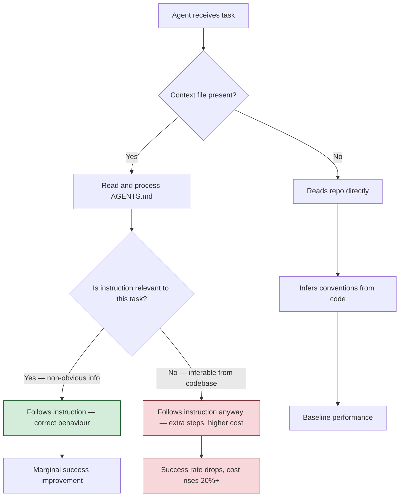
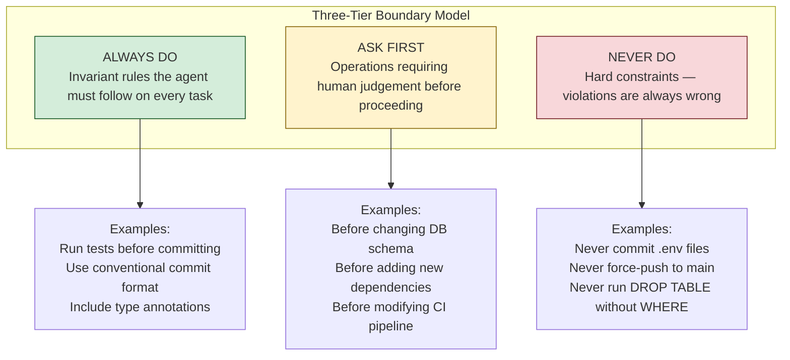
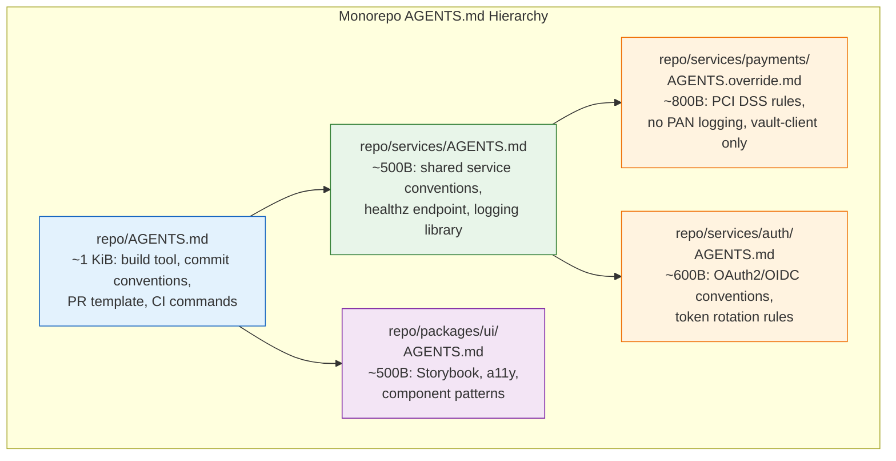
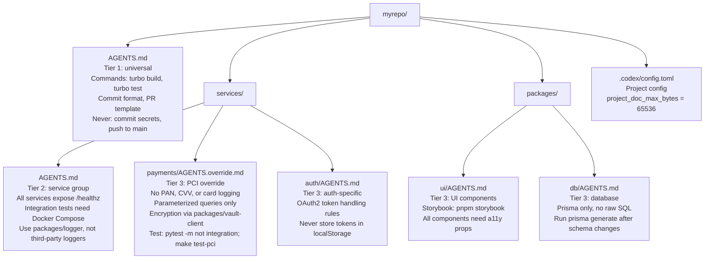
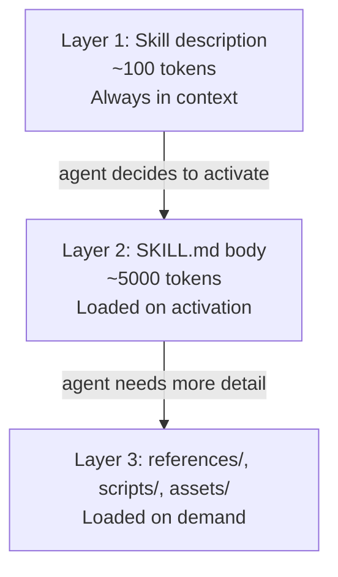
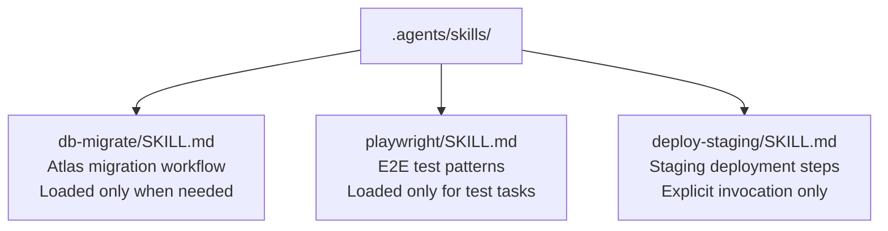
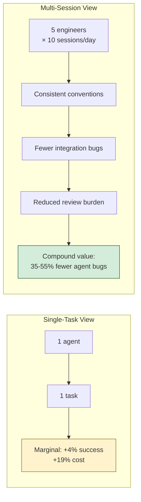
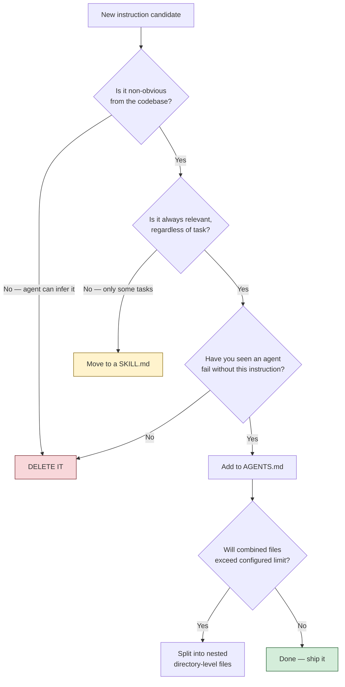

> **The Agentic Engineering Series** — From experiment to enterprise. This is article 3 of 13.
> *This article is the blueprint — how AGENTS.md becomes the single source of truth that turns ad-hoc prompting into repeatable infrastructure.*
> [Previous: Codex CLI at One Year](/premium/02-codex-cli-at-one-year/) | [Next: TDAD and the Testing Revolution](/premium/04-tdad-and-the-testing-revolution/) | [Series overview](#series)

> **Series context:** This is article 3 of 13 in *From Experiment to Factory*. With the wake-up call delivered and the platform assessed, this article is **The Blueprint** — how to codify agent instructions as version-controlled infrastructure so that every agent session starts from a known-good state rather than from zero.

# Most AGENTS.md Files Make AI Agents Worse — Here's the Science of Getting Them Right

Here is a finding that should make you uncomfortable: researchers at ETH Zurich ran a controlled experiment on AGENTS.md files and discovered that LLM-generated context files **reduce** agent task success rates by 3% while inflating inference costs by over 20%[^1]. The auto-generated instructions that half the industry is running `/init` to produce are not just unhelpful -- they are actively making agents worse.

But that is not the whole story. The same study found that human-written AGENTS.md files improved success rates by only 4%, at a cost premium of 19%[^1]. Four percent. For a file that many teams spend hours crafting and maintaining. If you stopped reading here, you might conclude that AGENTS.md is a waste of time.

You would be wrong. But you would also be wrong to keep doing what you are doing now.

The truth is more interesting and more useful: **the structure and specificity of your AGENTS.md matters far more than its existence**. A focused 800-byte file that tells the agent to use `uv` instead of `pip` will outperform a 30 KiB manifesto about your architectural philosophy every single time. The ETH Zurich paper did not test well-written context files against poorly-written ones -- it tested generic context against no context. And generic context lost.

This article is about winning.

---

## The Obedience Trap (and Why It Changes Everything)

The most important behavioural insight from the ETH Zurich paper is one that most summaries skip over: coding agents are **too obedient**[^1].

When your AGENTS.md says "run the full test suite before each commit," the agent follows that instruction religiously -- even when it is working on a task where running tests is entirely irrelevant. When your AGENTS.md includes three paragraphs about your folder structure, the agent reads those paragraphs, processes them, and factors them into its reasoning -- even though it could discover the same information by running `ls`.

Every line in your AGENTS.md is a commitment to extra agent steps. Every instruction is followed, whether or not it applies to the current task. The agent does not skim. It does not exercise judgement about which rules matter right now. It obeys.

This means the cost of a bloated AGENTS.md is not just wasted tokens -- it is wasted *actions*. The agent traverses more files, runs more commands, takes more turns, and burns more money. The ETH Zurich team measured this directly: agents with context files took longer task trajectories and performed more file traversals than agents without them[^1].



This changes the calculus completely. The question is not "what should I put in my AGENTS.md?" The question is: **"what is the minimum set of instructions that would cause a failure if omitted?"**

---

## The Redundancy Problem: Your AGENTS.md Is Probably Restating the Obvious

The ETH Zurich team ran a clever follow-up experiment. They stripped all documentation from the test repositories -- READMEs, docs folders, markdown files -- and then tested the same LLM-generated context files again. The result: those same files that *hurt* performance in a fully documented repo suddenly *improved* performance by 2.7%[^1].

The context was not useless. It was redundant. The agent could already read the information from the repository itself.

Think about what is in most AGENTS.md files you have seen:

- "This is a React application using TypeScript" (visible from `package.json` and `tsconfig.json`)
- "We use Jest for testing" (visible from the test directory and config files)
- "The project follows a standard MVC architecture" (visible from the folder structure)
- "Code should be well-documented and follow clean code principles" (means nothing to an agent)

Every one of these lines is dead weight. The agent already knows this. You are paying tokens to tell it what it can see with its own eyes.

Here is a rule of thumb from the Augment Code team worth adopting: keep a line in your AGENTS.md only if it is **failure-backed** (you have seen an agent fail without it), **tool-enforceable** (a concrete command or check), **decision-encoding** (a deliberate team choice that contradicts defaults), or **triggerable** by a real scenario[^2]. Everything else is premium context real estate occupied for no return.

---

## What Actually Works: The One Clear Win

Amid all the ambiguous results, the ETH Zurich paper found one thing that worked unambiguously: **non-standard tooling instructions**[^1].

When a context file specified `uv` instead of `pip`, agents used `uv` **160 times more frequently** -- 1.6 invocations per task versus 0.01 without the instruction[^1]. The tool was mentioned, the tool was used. Reliably.

This is the signal buried in the noise. Agents have strong priors from their training data about what tools to use. When your project uses the default tool, you do not need to say anything -- the agent will reach for `pip`, `npm`, `make`, and `pytest` on its own. But when your project uses something non-standard -- `uv`, `bun`, `just`, `pnpm`, `atlas`, `mise` -- the agent cannot guess. That is where AGENTS.md earns its keep.

The pattern that emerges from this finding is clear:

**High-value AGENTS.md content:**

- Non-default tooling: `uv` not `pip`, `bun` not `npm`, `just` not `make`
- Build commands that cannot be inferred: custom scripts, unusual flags, multi-step sequences
- Test commands with specific flags: `pytest --cov=src --cov-fail-under=80 -x`
- Team decisions encoded nowhere in code: "We use kebab-case for filenames," "Always reference JIRA tickets in commits"
- Known footguns: "Do not run migrations in dev without `--dry-run`"
- Deployment and release steps invisible from the codebase

**Zero-value AGENTS.md content:**

- Architectural overviews (the agent reads the code)
- Folder structure explanations (visible from `ls`)
- Framework conventions (baked into model training data)
- Generic best practices ("write clean, readable code")
- Language feature descriptions ("We use TypeScript generics for type safety")
- Anything auto-generated without human review

---

## The Three-Tier Boundary Pattern

GitHub's analysis of 2,500+ repositories that adopted AGENTS.md identified a structural pattern that the ETH Zurich paper's methodology entirely missed: the **three-tier boundary model**[^3]. The most effective AGENTS.md files are not instruction manuals -- they are boundary definitions.



"Never commit secrets" was the single most common constraint across all 2,500+ analysed repositories[^3]. And for good reason: an agent without this boundary will happily commit your `.env` if it thinks that helps solve the task.

The boundary pattern's value is not captured by task success metrics. Its purpose is **risk reduction** -- preventing the catastrophic failures that a 4% success rate improvement cannot offset. A single committed API key costs more than a thousand slightly-slower agent sessions.

This maps directly to Codex CLI's approval modes[^4]:

| Boundary tier | Codex approval mode | Effect |
|---|---|---|
| Always do | `full-auto` | Agent proceeds without asking |
| Ask first | `suggest` / `on-request` | Agent proposes, human approves |
| Never do | Sandbox deny / `PreToolUse` hook | Blocked at the platform level |

Here is what a boundary-oriented AGENTS.md looks like in practice:

```markdown
## Commands
- Test: `pnpm test --run`
- Lint: `pnpm lint --fix`
- Build: `pnpm build`
- Type check: `pnpm tsc --noEmit`
- Migrations: `atlas migrate diff` (NEVER edit migration files directly)

## Always
- Run `pnpm test --run` before committing
- Use conventional commits: `feat:`, `fix:`, `docs:`, `refactor:`
- Add type annotations to all function signatures

## Ask First
- Adding new npm dependencies
- Changing database schema
- Modifying CI/CD pipeline configuration
- Any change to `packages/auth/`

## Never
- Commit files matching `*.env*`, `*credentials*`, `*secret*`
- Run `DROP TABLE` or `DELETE FROM` without a WHERE clause
- Push to `main` or `production` branches
- Modify `package-lock.json` manually (run `pnpm install` instead)
```

That is 25 lines. About 900 bytes. It gives the agent everything it needs and nothing it does not.

---

## Before and After: A Real AGENTS.md Rewrite

Here is a composite example based on real AGENTS.md files observed across production repositories. The "before" version is typical of what teams produce with `/init` plus a few hours of additions.

### Before: The Kitchen Sink (2,847 words, ~14 KiB)

```markdown
# AGENTS.md

## Project Overview
This is a full-stack web application built with Next.js 14, TypeScript, and
PostgreSQL. The application serves as a customer management platform for
enterprise clients. We use a monorepo structure managed by Turborepo.

## Architecture
The project follows a clean architecture pattern with the following layers:
- **Presentation Layer**: React components in `apps/web/src/components/`
- **Application Layer**: Business logic in `apps/web/src/services/`
- **Domain Layer**: Type definitions and interfaces in `packages/types/`
- **Infrastructure Layer**: Database access in `packages/db/`

The frontend communicates with the backend through tRPC, which provides
end-to-end type safety. We use Prisma as our ORM with PostgreSQL...

[... 15 more paragraphs about architecture ...]

## Code Style
- Use TypeScript for all new code
- Follow the Airbnb JavaScript Style Guide
- Use functional components with hooks (no class components)
- Prefer named exports over default exports
- Use absolute imports with the `@/` prefix
- Write descriptive variable and function names
- Add JSDoc comments to all exported functions
- Keep functions small and focused (max 50 lines)
- Use early returns to reduce nesting
- Prefer const over let; never use var
- Use template literals instead of string concatenation
- Destructure objects and arrays when accessing multiple properties

## Testing
We use Vitest for unit tests and Playwright for end-to-end tests. All new
features must have corresponding tests. We aim for 80% code coverage on
new code. Tests should be descriptive and follow the Arrange-Act-Assert
pattern. Mock external dependencies using vi.mock()...

[... 8 more paragraphs about testing philosophy ...]

## Git Workflow
We use GitHub Flow. Create feature branches from main. Open a PR when
ready for review. Squash and merge after approval...

[... 5 more paragraphs about git workflow ...]

## Deployment
The application is deployed to Vercel. Preview deployments are created
automatically for all PRs. Production deployments happen on merge to
main...

[... 3 more paragraphs about deployment ...]
```

This file is 14 KiB of context budget (the `project_doc_max_bytes` limit was originally 32 KiB, now ~5 MB by default — but bloat is bloat regardless of ceiling). It is mostly prose. Most of it is inferable from the codebase. The agent will read every word and follow every instruction -- including "keep functions small and focused (max 50 lines)" even when refactoring a complex algorithm that genuinely needs 60 lines.

### After: The Boundary File (247 words, ~1.2 KiB)

````markdown
## Commands
- Dev: `turbo dev`
- Test: `turbo test` (Vitest). Single package: `turbo test --filter=web`
- E2E: `pnpm playwright test` (requires `pnpm playwright install` first)
- Lint: `turbo lint --fix`
- Type check: `turbo typecheck`
- DB migrate: `pnpm prisma migrate dev` (NEVER edit migration SQL directly)
- DB generate: `pnpm prisma generate` (run after any schema.prisma change)

## Code Style
Prefer early returns. One example:
```typescript
// Do this
function getUser(id: string | null): User | null {
  if (!id) return null
  return db.user.findUnique({ where: { id } })
}
```

Use `@/` import prefix. Named exports only (no default exports).

## Always
- Run `turbo test --filter=[changed packages]` before committing
- Conventional commits: `feat:`, `fix:`, `docs:`, `refactor:`
- Add return types to exported functions
- Run `pnpm prisma generate` after changing `schema.prisma`

## Ask First
- New dependencies (check `packages/` for existing utilities first)
- Changes to `schema.prisma`
- Changes to `.github/workflows/`
- Any modifications to `packages/auth/`

## Never
- Commit `.env*`, credentials, or API keys
- Push directly to `main`
- Edit files in `prisma/migrations/` — use `prisma migrate dev`
- Run `prisma migrate reset` without explicit confirmation
- Modify `pnpm-lock.yaml` manually
````

Same project. 91% smaller. Every line is either a command the agent needs, a decision the agent cannot infer, or a boundary the agent must not cross. The architectural overview is gone -- the agent can read the code. The style guide is replaced by one concrete example. The testing philosophy is replaced by the exact command to run.

---

## The Hierarchy: Thin at the Top, Specific at the Leaf

Codex CLI does not just read one AGENTS.md file. It walks the filesystem from the global config down to your current working directory, discovering and concatenating files at every level[^5]. The full resolution order:

```text
1. ~/.codex/AGENTS.override.md    (highest-precedence global override)
   OR ~/.codex/AGENTS.md          (standard global defaults)

2. <git-root>/AGENTS.override.md  (repo override)
   OR <git-root>/AGENTS.md        (standard repo rules)

3. <intermediate-dirs>/AGENTS.override.md  (each dir between root and cwd)
   OR <intermediate-dirs>/AGENTS.md

4. <cwd>/AGENTS.override.md       (current working directory)
   OR <cwd>/AGENTS.md
```

Files concatenate from root downward. Later files win on conflicts. `AGENTS.override.md` takes precedence over `AGENTS.md` at the same directory level but does not suppress parent levels[^5].

This hierarchy is the mechanism that makes AGENTS.md scale. The pattern that works -- and that OpenAI reportedly uses internally with 88 AGENTS.md files across their monorepo[^6] -- is **thin at the top, specific at the leaf**.



When Codex starts in `services/payments/`, it loads: global defaults + repo root + services group + payments override. That is a focused chain of perhaps 3 KiB, and every byte is relevant to the payments service. The UI component patterns? Not loaded. The auth conventions? Not loaded. Only what applies to the current context.

When Codex starts in `packages/ui/`, it gets a different chain: global defaults + repo root + UI conventions. Clean separation, zero noise.

### A Concrete Monorepo Layout



---

## The Silent Truncation Problem

There is a technical landmine buried in every large AGENTS.md setup. Codex CLI enforces a hard limit on the combined size of all loaded context files via `project_doc_max_bytes`[^7]. The default was originally 32 KiB — a limit that caught many teams by surprise (GitHub Issue #7138)[^8]. OpenAI has since raised it to approximately 5 MB (~5,000,000 bytes), but the silent truncation mechanism remains: exceed the configured limit and your instructions are clipped without warning. Files are read root-to-leaf, joined with blank lines, and truncated once the combined size hits the limit.

There is no warning in the TUI that your instructions have been cut off[^8].

This means the instructions you care most about -- the leaf-level, service-specific rules that carry the highest specificity -- are the ones most likely to be silently dropped. If your root-level AGENTS.md is verbose, it consumes the budget before the hierarchy reaches the service files that actually matter.

Community reports confirm the pattern[^8]:

> "The TUI should warn users within `/stats` next to the AGENTS.md -- silently truncating the text is considered bad UX."

### Diagnosing Truncation

If you suspect your instructions are being cut off, ask the agent directly:

```bash
codex --ask-for-approval never \
  "List all AGENTS.md instructions you have loaded. Quote the last line verbatim."
```

Or measure the combined byte size:

```bash
find . -name "AGENTS.md" -o -name "AGENTS.override.md" | xargs wc -c | tail -1
```

If the total exceeds your configured `project_doc_max_bytes` limit (now ~5 MB by default, originally 32 KiB), you are being truncated.

### Fixing It

You can lower or raise the limit explicitly:

```toml
# .codex/config.toml
project_doc_max_bytes = 65536   # 64 KiB — explicit is better than relying on defaults
```

But even with a ~5 MB default, the principle holds: if your AGENTS.md files are bloated, you are wasting context window tokens on content the agent does not need. The better fix is making each file leaner. Apply the boundary pattern. Delete the architectural overviews. Remove anything the agent can infer from the code itself.

---

## Override Files: Temporary Context Without Permanent Damage

`AGENTS.override.md` is one of the most underused features in the Codex CLI ecosystem. At any directory level, an `AGENTS.override.md` replaces the standard `AGENTS.md` at that scope -- without modifying the base file that everyone else depends on[^5].

Three patterns that work in practice:

### Pattern 1: Release Freeze

Drop an override at the project root during a release freeze:

```markdown
# AGENTS.override.md — DELETE after release 4.2 ships
## Release Freeze Active

- Bug fixes only. No new features.
- All changes require sign-off from @release-manager
- Do not modify package versions or dependency locks
- Run full regression: `make test-regression`
```

When the freeze lifts, delete the file. The base AGENTS.md is untouched.

### Pattern 2: Incident Mode

For a production incident, a tighter override:

```markdown
# AGENTS.override.md — SEV1 active, delete when resolved
## Incident Mode

- Limit scope to the affected service only
- No refactoring, no dependency updates
- Rollback preferred over forward-fix unless root cause confirmed
- Log every change in #incident-channel
```

### Pattern 3: CI Pipeline Override

In CI, you want different behaviour than in interactive sessions:

```bash
# In GitHub Actions:
cat > AGENTS.override.md << 'EOF'
## CI Mode
- Never ask clarifying questions — use best judgement
- Run full test suite before completing any task
- If tests fail, explain failure and stop — do not attempt a fix
- Do not make commits; only propose changes
EOF

codex exec "$TASK" --full-auto
rm AGENTS.override.md
```

---

## Skills: The Escape Hatch for Specialised Knowledge

The fundamental problem with AGENTS.md is that it is always-on context. Every instruction is loaded regardless of task relevance. If you have a 40-line section about Playwright test automation, that section is injected into the agent's context even when it is fixing a typo in a README.

Skills solve this with progressive disclosure[^9]. A skill is a directory of instructions that the agent loads *only when relevant*, triggered by keyword matching or explicit invocation.



If you find yourself writing a large section in AGENTS.md about a specialised workflow -- database migrations, Playwright automation, deployment procedures, release processes -- that content almost certainly belongs in a skill instead.



This keeps your baseline AGENTS.md lean -- focused on the universal commands and boundaries -- while preserving the ability to invoke specialised behaviours on demand.

---

## Security Boundaries: Where AGENTS.md Meets Guardrails

For teams in regulated industries, AGENTS.md is not just about productivity -- it is a first line of defence. The "Never" tier of the boundary pattern directly maps to Codex CLI's security infrastructure[^4].

An AGENTS.md instruction like "Never commit .env files" works as a soft constraint -- the agent will try to follow it. But agents are probabilistic. A `PreToolUse` hook that scans for credential patterns and exits with code 2 is a hard constraint -- the operation is blocked at the platform level regardless of what the agent intends[^10].

The most effective production setups layer both:

```markdown
## Never (enforced by AGENTS.md + hooks)
- Commit files matching `*.env*`, `*credentials*`, `*secret*`
  → Backed by PostToolUse secrets-scanner hook
- Run destructive DB operations without WHERE clause
  → Backed by PreToolUse SQL-guard hook
- Push to main or production branches
  → Backed by PreToolUse branch-guard hook
```

The AGENTS.md tells the agent what not to do. The hooks catch it if it tries anyway. Belt and suspenders.

For PCI DSS, HIPAA, or SOC 2 scoped services, use `AGENTS.override.md` at the service level to enforce compliance-specific constraints:

```markdown
# services/payments/AGENTS.override.md
## PCI DSS Scope — Payments Service

- No logging of card numbers, CVV, or full PAN in application code
- All database queries use parameterised statements (no string interpolation)
- Encryption at rest via `packages/vault-client` — no direct AES usage
- Every PR must include a SECURITY.md section describing data flow changes
- Test: `pytest -m "not integration"` (unit); `make test-pci` (PCI validation)
```

---

## The Compound Value Thesis

The ETH Zurich paper asks: "Does AGENTS.md help an agent solve this one task?" For well-documented open-source Python repositories, the answer is "marginally."

But that is the wrong question for most engineering teams.

The right question is: "Does AGENTS.md help five agents, across fifty sessions per day, maintain consistent behaviour in a proprietary codebase over six months?"

The paper's single-task benchmark cannot answer this. But the enterprise adoption data tells a story: over 60,000 repositories on GitHub have adopted AGENTS.md, and teams report 35-55% fewer agent-generated bugs after implementation[^11]. A complementary study by Lulla et al. found that focused AGENTS.md files reduced median agent runtime by 28.64% and output token consumption by 16.58%[^12].



The key difference: the Lulla et al. study tested **focused, minimal context files** -- not the bloated auto-generated manifesto that the ETH Zurich paper (rightly) criticised[^12]. The variable is not whether you have an AGENTS.md. It is whether you have a *good* one.

---

## The Decision Flowchart: What Belongs in Your AGENTS.md

For every line you consider adding, run it through this filter:



The "have you seen an agent fail without it" test is the most important filter. It is the difference between aspirational documentation and failure-backed instructions. If you cannot point to a specific session where the agent did the wrong thing because it lacked this instruction, the instruction probably does not need to exist.

---

## The Playbook: Seven Rules for AGENTS.md That Work

**1. Default to omission.** Every line you add increases agent steps and inference cost. Start with nothing. Add instructions only when you observe failures.

**2. Commands first, prose never.** Front-load exact build, test, lint, and deploy commands with their flags. One command is worth ten paragraphs of explanation.

**3. Show, do not describe.** One real code snippet demonstrating your style beats three paragraphs describing it[^13]. Instead of "use early returns to reduce nesting," show one function with an early return.

**4. Encode boundaries, not aspirations.** "Write clean code" is meaningless to an agent. "Never commit .env files" is mechanically verifiable. Use the three-tier boundary model: Always / Ask First / Never.

**5. Delete LLM-generated content.** If you ran `/init` and never edited the output, delete it now. LLM-generated context files demonstrably reduce agent performance[^1]. Start from scratch with failure-backed instructions only.

**6. Distribute context with the hierarchy.** Use nested AGENTS.md files to keep each context file small and scope-relevant. Thin at the root, specific at the leaf. The root file should be under 1 KiB for most projects.

**7. Move specialised workflows to Skills.** Anything that applies to only a subset of tasks -- Playwright automation, database migrations, deployment procedures -- belongs in a SKILL.md that loads on demand, not in an always-on AGENTS.md.

---

## One More Thing: Cross-Tool Portability

AGENTS.md is not a Codex-only format. It is an open standard governed by the Agentic AI Foundation under the Linux Foundation[^14], with native support across Codex CLI, Amp, Jules (Google), Factory, and growing support in Claude Code, Cursor, GitHub Copilot, Gemini CLI, and others.

A well-written AGENTS.md is a write-once investment. Instead of maintaining parallel `CLAUDE.md` + `AGENTS.md` + `.cursorrules` files that inevitably drift, write one canonical file and configure other tools to read it:

```toml
# ~/.codex/config.toml
project_doc_fallback_filenames = ["AGENTS.md", "CLAUDE.md", "AI_INSTRUCTIONS.md"]
```

One file. Multiple tools. Zero drift.

---

## Go Rewrite Yours

Open your AGENTS.md right now. Measure it:

```bash
wc -c AGENTS.md
```

If it is over 2 KiB, you probably have bloat. Run each line through the decision flowchart. Delete everything the agent can infer from the codebase. Replace prose with commands. Replace descriptions with code examples. Add boundaries where you have seen failures.

Then measure again. The best-performing AGENTS.md files in production are between 500 bytes and 2 KiB. They are brutally concise. They contain only what the agent cannot discover on its own. And they work better than the 15 KiB manifestos they replaced.

The ETH Zurich paper was right about one thing: most AGENTS.md files make agents worse. But that is not an argument against AGENTS.md. It is an argument for writing better ones.

The blueprint is drawn. But a factory without quality control is just a faster way to produce defects. In [Article 04: TDAD and the Testing Revolution](/premium/04-tdad-and-the-testing-revolution/), we build the quality gate — the structural testing layer that ensures your factory's output is verifiably correct at scale.

---

## Citations

---

## The Agentic Engineering Series {#series}

From experiment to enterprise — building the factory for AI-assisted software engineering at scale.

| | Article | Role |
|---|---------|------|
| 1 | [Agentic Engineering Is Not Vibe Coding](/premium/01-agentic-engineering-is-not-vibe-coding/) | The Wake-Up Call |
| 2 | [Codex CLI at One Year](/premium/02-codex-cli-at-one-year/) | The Platform |
| **3** | **[The AGENTS.md Playbook](/premium/03-the-agents-md-playbook/)** | **The Blueprint** |
| 4 | [TDAD and the Testing Revolution](/premium/04-tdad-and-the-testing-revolution/) | The Quality Gate |
| 5 | [The Agentic Pod](/premium/05-the-agentic-pod/) | The Team Model |
| 6 | [Three Terminals, Three Fates](/premium/06-three-terminals-three-fates/) | The Toolchain |
| 7 | [AI Slopageddon](/premium/07-ai-slopageddon/) | The Risk |
| 8 | [Inside the Machine](/premium/08-inside-the-machine/) | The Engine |
| 9 | [Complete Guide to Codex Security](/premium/09-complete-guide-to-codex-security/) | The Guardrails |
| 10 | [Context Compaction and Memory](/premium/10-context-compaction-and-memory/) | The Efficiency Layer |
| 11 | [Token Economics and ROI](/premium/11-token-economics-and-the-roi-of-coding-agents/) | The Business Case |
| 12 | [The Scaling Playbook](/premium/12-the-scaling-playbook/) | The Rollout |
| 13 | [The Agentic Engineering Maturity Matrix](/premium/13-the-agentic-engineering-maturity-matrix/) | The Assessment |

---

[^1]: Gloaguen, R., Mündler, N., Müller, M., Raychev, V., & Vechev, M. (2026). "Evaluating AGENTS.md: Are Repository-Level Context Files Helpful for Coding Agents?" ETH Zurich. arXiv:2602.11988. [https://arxiv.org/abs/2602.11988](https://arxiv.org/abs/2602.11988)

[^2]: Augment Code. (2026). "Your agent's context is a junk drawer." [https://www.augmentcode.com/blog/your-agents-context-is-a-junk-drawer](https://www.augmentcode.com/blog/your-agents-context-is-a-junk-drawer)

[^3]: Nigh, M. (2025). "How to write a great agents.md: Lessons from over 2,500 repositories." GitHub Blog. [https://github.blog/ai-and-ml/github-copilot/how-to-write-a-great-agents-md-lessons-from-over-2500-repositories/](https://github.blog/ai-and-ml/github-copilot/how-to-write-a-great-agents-md-lessons-from-over-2500-repositories/)

[^4]: OpenAI. (2026). "Agent approvals & security -- Codex." OpenAI Developer Docs. [https://developers.openai.com/codex/agent-approvals-security](https://developers.openai.com/codex/agent-approvals-security)

[^5]: OpenAI. (2026). "Custom instructions with AGENTS.md -- Codex." OpenAI Developer Docs. [https://developers.openai.com/codex/guides/agents-md](https://developers.openai.com/codex/guides/agents-md)

[^6]: Ngo, V. (2026). "Scaling AI-Assisted Development: How Scaffolding Solved My Monorepo Chaos." Medium. [https://medium.com/@vuongngo/scaling-ai-assisted-development-how-scaffolding-solved-my-monorepo-chaos-4838fb3b4dd6](https://medium.com/@vuongngo/scaling-ai-assisted-development-how-scaffolding-solved-my-monorepo-chaos-4838fb3b4dd6)

[^7]: OpenAI. (2026). "Advanced Configuration -- Codex." OpenAI Developer Docs. [https://developers.openai.com/codex/config-advanced](https://developers.openai.com/codex/config-advanced)

[^8]: openai/codex GitHub Issue #7138. "AGENTS.md is silently truncated without any warning within the TUI." [https://github.com/openai/codex/issues/7138](https://github.com/openai/codex/issues/7138)

[^9]: OpenAI. (2026). "Best Practices -- Codex." OpenAI Developer Docs. [https://developers.openai.com/codex/learn/best-practices](https://developers.openai.com/codex/learn/best-practices)

[^10]: OpenAI. (2026). "Hooks -- Codex." OpenAI Developer Docs. [https://developers.openai.com/codex/hooks](https://developers.openai.com/codex/hooks)

[^11]: AIMultiple Research. (2026). "Agents.md: A Machine-Readable Alternative to README." [https://research.aimultiple.com/agents-md/](https://research.aimultiple.com/agents-md/)

[^12]: Lulla, K. et al. (2026). "On the Impact of AGENTS.md Files on the Efficiency of AI Coding Agents." arXiv:2601.20404. [https://arxiv.org/abs/2601.20404](https://arxiv.org/abs/2601.20404)

[^13]: Shipyard. (2026). "Codex CLI Cheatsheet: config, commands, AGENTS.md, + best practices." [https://shipyard.build/blog/codex-cli-cheat-sheet/](https://shipyard.build/blog/codex-cli-cheat-sheet/)

[^14]: Linux Foundation. (2025). "Linux Foundation Announces the Formation of the Agentic AI Foundation (AAIF)." [https://www.linuxfoundation.org/press/linux-foundation-announces-the-formation-of-the-agentic-ai-foundation](https://www.linuxfoundation.org/press/linux-foundation-announces-the-formation-of-the-agentic-ai-foundation)
