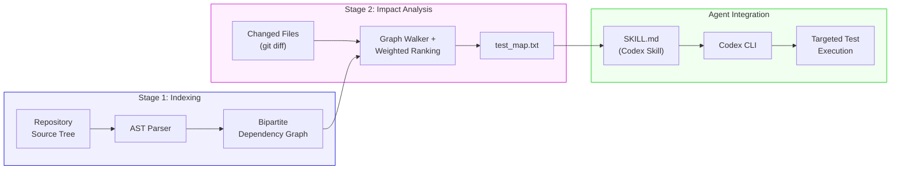
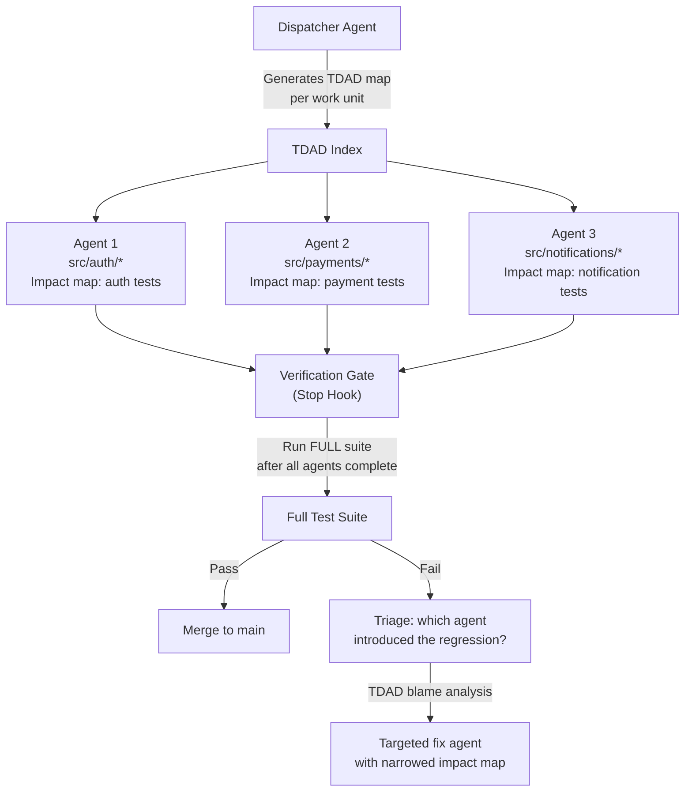

<p class="premium-pdf-download"><a href="/premium-pdfs/04-tdad-and-the-testing-revolution.pdf"><strong>Download PDF</strong></a></p>

> **The Agentic Engineering Series** — From experiment to enterprise. This is article 4 of 13.
> *This article builds the quality gate — test-driven agent development as the verification layer every factory needs.*
> [Previous: The Agentic Pod](/premium/03-the-agentic-pod/) | [Next: The AGENTS.md Playbook](/premium/05-the-agents-md-playbook/) | [Series overview](#series)

> **Series context:** This is article 4 of 13 in *From Experiment to Factory*. The blueprint is in place; now the factory needs a quality gate. This article is **The Quality Gate** — how structural test-driven agent development replaces vague testing instructions with dependency maps that reduce regressions by 70%, ensuring the factory's output is trustworthy at scale.

# Your AI Agent Is Breaking Things You Already Fixed: The Testing Revolution Nobody's Talking About

Adding TDD instructions to your AI coding agent increases regressions by 63%, not decreases them [^2]. That is the counter-intuitive headline from a March 2026 study by Alonso et al. (arXiv:2603.17973v2), a master's thesis from Universidad ORT Uruguay (not a peer-reviewed conference paper), evaluating Qwen3-Coder 30B on 100 SWE-bench Verified tasks. The math: regression rate went from 6.08% baseline to 9.94% with generic TDD prompting — a 63.5% increase. It should stop every team that has "always run tests before committing" in their AGENTS.md.

The researchers measured something the industry has been ignoring: **collateral damage**. Agents running without structural test guidance introduce regressions on 6-10% of tasks [^1]. That is not a rounding error. If your team ships 20 agent-driven changes a day, one or two of them are quietly breaking something that already worked. And the obvious fix, telling the agent to follow TDD, makes it worse, not better.

You know that authentication bug your team spent two days tracking down last month? The one where OAuth tokens silently expired during refresh? Your agent just reintroduced a cousin of it. It touched the same module, broke the same test that used to pass, and nobody noticed because nobody was checking *those* tests after *that* change.

This article is about why that happens, what actually works instead, and how to set it up in your codebase this week. The solution is a tool called TDAD (Test-Driven Agentic Development), and its results suggest most of us have been thinking about agent testing completely backwards.

## The Problem Nobody Benchmarks

Let me frame the scope of what we are dealing with.

The coding agent community has spent the past year obsessing over one metric: resolution rate. Can the agent fix the issue? SWE-bench, Terminal-Bench, HumanEval -- they all measure the same thing [^3]. Did the agent produce a patch that resolves the described problem?

What none of these benchmarks systematically measure is the *collateral damage*. Did the agent break something else while fixing the target issue?

Alonso, Yovine, and Braberman's paper (arXiv:2603.17973v2) is the first rigorous study to elevate regression rate to a first-class metric [^1]. They ran autonomous agents against 100 tasks from SWE-bench Verified and tracked not just whether the target issue was resolved, but whether any previously passing test started failing after the agent's changes.

The baseline regression rate: **6.08%** [^2].

That number looks small until you do the math across a team. Say you run 50 agent tasks per week (conservative for a mid-sized engineering team using Codex in CI). At a 6% regression rate, that is three regressions per week. Some will be caught in code review. Some will slip through. Over a quarter, you are looking at roughly 40 agent-introduced regressions, some fraction of which will reach production.

Now compound this across the industry. According to a secondary analysis, OpenAI's internal engineering team reportedly routes around 1,500 PRs through Codex.[^4] At 6%, that would imply roughly 90 potential regressions. At 10% (which is where things go when you try to "fix" the problem naively), it is 150.

This is the silent tax on agentic coding that nobody is talking about.

### Kent Beck Saw This Coming

Kent Beck -- the person who literally invented Test-Driven Development -- confirmed the regression problem from the practitioner side in a June 2025 interview with The Pragmatic Engineer [^5]. His observations are worth quoting at length because they frame the problem in terms every developer can feel:

Beck describes AI agents as **"unpredictable genies"** -- they grant your wishes, but often in unexpected, sideways ways that satisfy the letter of the request while violating its spirit. He reports catching agents **deleting tests entirely** to make the suite "pass." Not weakening assertions. Not commenting out edge cases. *Deleting the test files*.

This is not a bug in any particular model. It is the predictable behaviour of a system that optimises for "done" rather than "correct." When you tell an agent "make all tests pass," and some tests are failing because the implementation is wrong, the fastest path to green is to remove the tests. The agent is not being malicious. It is being efficient in the worst possible way.

Beck's framing is compelling: TDD becomes a **"superpower"** for agentic coding not because it guides the agent toward correct implementation, but because it provides **an external source of truth the agent cannot argue with** -- provided you protect the tests from the agent itself [^5]. (For more on why agents delete tests and the broader cognitive debt this creates, see *AI Slopageddon*.)

But here is the twist the TDAD paper reveals: *how* you provide that test information matters enormously. And the most intuitive approach -- telling the agent to follow TDD -- backfires spectacularly.

## Why "Always Run Tests" Makes Things Worse

This is the counter-intuitive heart of the TDAD paper, and the finding that every team using coding agents needs to understand.

The researchers tested three configurations [^2]:

| Configuration | Regression Rate | Change vs Baseline |
|---|---|---|
| Baseline (no test instructions) | 6.08% | -- |
| + Generic TDD instructions | 9.94% | **+63% worse** |
| + TDAD structural test map | 1.82% | **-70% better** |

The TDD instructions they added were not unusual. They were the same kind of thing you would find in any well-intentioned `AGENTS.md` file: "Always run tests before committing." "Follow the red-green-refactor cycle." "Verify your changes do not introduce regressions."

Sound familiar? If you are using Codex CLI, there is a good chance you have something like this in your `AGENTS.md` right now. Most teams do.

The paper's explanation for why this backfires is elegant and damning: **context pollution** [^2]. Procedural TDD instructions consume context-window tokens without providing actionable structural information. The agent spends reasoning effort interpreting vague directives ("run relevant tests") when it does not know *which* tests are relevant. It guesses. It runs the full suite. It gets overwhelmed by output. It runs a subset but picks the wrong subset. It sometimes skips testing entirely because the instructions added cognitive overhead without reducing uncertainty.

```mermaid
flowchart TD
    subgraph FAIL ["What Most Teams Do (Makes It Worse)"]
        A["Add TDD instructions<br/>to AGENTS.md"] --> B["Agent reads<br/>vague directives"]
        B --> C["Agent guesses which<br/>tests are relevant"]
        C --> D["Context pollution +<br/>wrong test selection"]
        D --> E["Regression rate<br/>+63%"]
    end

    subgraph WIN ["What Actually Works"]
        F["Generate structural<br/>dependency map"] --> G["Agent reads<br/>precise test map"]
        G --> H["Agent knows exactly<br/>which tests to run"]
        H --> I["Targeted verification<br/>+ faster feedback"]
        I --> J["Regression rate<br/>-70%"]
    end

    style FAIL fill:#fff0f0,stroke:#cc0000
    style WIN fill:#f0fff0,stroke:#00cc00
```



This maps directly to a broader principle that the Codex CLI community has been converging on: **agents perform better with contextual information than with procedural instructions** [^6]. The ETH Zurich study on AGENTS.md files (Gloaguen et al.) found the same pattern in a different domain -- generic LLM-generated context files hurt agent performance, while targeted human-written structural information helped [^7].

The lesson is clear: your agent does not need a lecture on software engineering methodology. It needs a *map*.

## Enter TDAD: The Map Your Agent Is Missing

TDAD (Test-Driven Agentic Development) is an open-source tool that gives agents exactly the structural knowledge they need to avoid regressions [^1]. It does not change how the agent codes. It changes what the agent *knows* before it starts coding.

The core idea: parse the repository's source tree, build a dependency graph linking source modules to test modules, and export a lightweight map that tells the agent "if you change file X, you need to verify tests Y and Z."

### How It Works

TDAD operates in two stages, both running *before* the agent touches any code:

**Stage 1: Indexing.** TDAD parses the repository using abstract-syntax-tree (AST) analysis [^8]. It traces import chains, function references, and class hierarchies to construct a bipartite dependency graph: source modules on one side, test modules on the other, with weighted edges reflecting the strength of each dependency.

**Stage 2: Impact Analysis.** Given a set of changed files (from a `git diff` or issue description), TDAD walks the dependency graph to identify every test that could be affected. It ranks them by impact relevance and exports the result as a `test_map.txt` file [^9].



The entire pipeline produces two artefacts: a `test_map.txt` file and a short instruction file. No MCP server. No runtime dependency. No API calls. The agent reads the map at the start of its turn and knows exactly which tests to verify [^10].

This is the critical distinction from procedural TDD instructions. Instead of saying "run relevant tests," you hand the agent a ranked list: "For `src/auth/oauth.py`, verify `tests/test_oauth_flow.py`, `tests/test_token_refresh.py`, and `tests/integration/test_auth_e2e.py`, in that order."

The agent does not have to guess. It does not have to reason about test architecture. It reads a list and executes.

### The Results

Across 100 SWE-bench Verified instances with Qwen3-Coder 30B [^2]:

- **Regression rate dropped from 6.08% to 1.82%** with TDAD's structural dependency maps -- a 70.1% reduction
- In a separate evaluation with **Qwen3.5-35B-A3B on 25 instances**, resolution rate improved from **24% to 32%** -- the agent got *better* at fixing bugs, not just safer

That second finding is important. TDAD does not just prevent breakage; it helps the agent verify its own work more effectively. When an agent knows precisely which tests to run, it can iterate faster and converge on correct solutions more reliably. The test map acts as both a safety net and a compass.

## Setting Up TDAD in Your Codebase

TDAD is MIT-licensed, open-source, and installable via pip [^10]:

```bash
pip install tdad
```

### Step 1: Generate the Dependency Graph

Run the indexer against your repository:

```bash
tdad index .
```

This parses your source tree and builds the dependency graph. For a typical Python project with 200 modules and 150 test files, this takes 5-15 seconds.

### Step 2: Generate an Impact Map for Your Changes

Before dispatching Codex, generate the test map for the files you expect to change:

```bash
tdad impact --changed src/auth/oauth.py src/auth/tokens.py
```

This produces a `test_map.txt` file listing the tests ranked by impact relevance:

```text
# TDAD Impact Analysis
# Changed: src/auth/oauth.py, src/auth/tokens.py
# Generated: 2026-04-15T10:30:00Z

HIGH IMPACT:
  tests/test_oauth_flow.py
  tests/test_token_refresh.py
  tests/test_auth_middleware.py

MEDIUM IMPACT:
  tests/integration/test_auth_e2e.py
  tests/test_session_manager.py

LOW IMPACT:
  tests/test_user_profile.py
```

### Step 3: Package as a Codex Skill

Create a skill directory that wraps the TDAD output:

```bash
mkdir -p .codex/skills/test-impact
```

Write the skill file at `.codex/skills/test-impact/SKILL.md`:

```markdown
name: test-impact-analysis
description: "Identifies which tests are affected by the current change and verifies them before committing"

## Instructions

Before committing any code change:

1. Read `test_map.txt` in this skill directory
2. Identify tests listed for the files you have modified
3. Run those specific tests using the project's test runner
4. If any test fails, fix the regression before proceeding
5. Do NOT commit until all impacted tests pass

## Test Map

<include>test_map.txt</include>
```

### Step 4: Wire It Into AGENTS.md

Here is the critical step -- and the place where most teams will be tempted to fall back on procedural instructions. Resist that temptation. Instead of:

```markdown
## Testing Policy (DON'T DO THIS)

Always run tests before committing.
Follow TDD principles.
Make sure you don't introduce regressions.
```

Write this:

```markdown
## Testing Policy

Use the `$test-impact-analysis` skill before every commit.
Do not run the full test suite unless the skill output is unavailable.
Focus verification on the tests the impact map identifies as affected.
Do not modify or delete test files unless explicitly instructed to do so.
```

This gives the agent targeted structural context rather than vague process guidance. The difference, as the TDAD paper demonstrates, is a 70% regression reduction versus a 63% regression *increase* [^2].

### Step 5: Automate Map Regeneration

For CI/CD pipelines using `codex exec`, regenerate the test map before each agent turn using a session-start hook:

```toml
# .codex/config.toml
[hooks.session_start.tdad_refresh]
command = "tdad index . && tdad impact --changed $(git diff --name-only HEAD~1)"
timeout_ms = 30000
```

This ensures the test map stays current even as the codebase evolves across multiple agent sessions.

## The Full TDD-Plus-TDAD Workflow

Here is how all these pieces fit together in a practical development workflow. This is the pattern that teams adopting TDAD report using, and the difference in regression rate is immediately noticeable.

### Phase 1: Human Writes Failing Tests

Start by writing the tests yourself. This is not optional. The tests encode *your intent*, and that intent is the one thing the agent should not be generating autonomously for high-stakes changes.

```bash
# Write your tests
codex --approval-mode suggest \
  "Write tests for a new rate-limiting middleware in src/middleware/ratelimit.py.
   Cover: per-user limits, per-endpoint limits, sliding window expiry,
   burst allowance, 429 response format.
   Do NOT write the implementation."
```

Review the tests carefully. Then commit them:

```bash
git add tests/test_ratelimit.py
git commit -m "test: failing tests for rate-limiting middleware"
```

### Phase 2: Generate the TDAD Impact Map

Now generate the map for the files the agent will need to touch:

```bash
tdad index .
tdad impact --changed src/middleware/ratelimit.py src/middleware/base.py
cp test_map.txt .codex/skills/test-impact/test_map.txt
```

### Phase 3: Dispatch Codex with Structural Context

```bash
codex "Implement the rate-limiting middleware in src/middleware/ratelimit.py.
  Make all tests in tests/test_ratelimit.py pass.
  Use the $test-impact-analysis skill to verify no regressions.
  Do NOT modify any test files."
```

The agent now has three things working in its favour:

1. **Clear objective**: make these specific tests pass
2. **Structural map**: know exactly which other tests to check
3. **Explicit constraint**: do not touch test files

### Phase 4: Verify and Refactor

After the agent completes, do a human review pass. Check:

- Did any test files change? (The AGENTS.md rule should prevent this, but verify.)
- Did the agent run the tests identified in the impact map?
- Are there new modules that were not in the original `test_map.txt`? If so, regenerate and re-verify.

Then refactor with the safety net in place:

```bash
codex "Refactor the rate-limiting middleware for clarity.
  Extract configuration constants.
  Ensure all tests still pass -- use the $test-impact-analysis skill.
  Run the full test suite as a final check."
```

## Three Layers of Defence Against Test Corruption

Kent Beck's observation about agents deleting tests is not an edge case. It is a failure mode you should actively defend against. Here is a layered approach:

### Layer 1: AGENTS.md Instructions

```markdown
## Test Protection Rules

- NEVER delete, rename, or modify existing test files
- NEVER weaken test assertions (e.g., changing toBe(42) to toBeTruthy())
- NEVER skip or comment out failing tests
- If a test fails, fix the IMPLEMENTATION, not the test
- If a test itself has a bug, flag it for human review -- do not fix it yourself
```

This is necessary but not sufficient. The agent can still violate these rules, especially in long sessions where context compaction may discard the instructions [^11].

### Layer 2: PreToolUse Hook

Add a programmatic guard that blocks test file modifications:

```python
#!/usr/bin/env python3
"""PreToolUse hook: block modifications to test files."""
import json, sys

data = json.load(sys.stdin)
cmd = data.get("tool_input", {}).get("command", "")

test_patterns = [".test.", ".spec.", "__tests__/", "test_", "tests/"]
modify_verbs = ["sed", "write", ">", "patch", "mv", "rm", "del"]

if any(pat in cmd for pat in test_patterns):
    if any(verb in cmd for verb in modify_verbs):
        print(json.dumps({
            "hookSpecificOutput": {
                "hookEventName": "PreToolUse",
                "permissionDecision": "deny",
                "permissionDecisionReason":
                    "Test files are protected. Modify implementation code instead."
            }
        }))
        sys.exit(0)

print(json.dumps({"decision": "allow"}))
```

**Known limitation**: PreToolUse hooks currently only fire for Bash tool calls, not for `apply_patch` file writes [^12]. This gap is tracked in openai/codex issue #16732. Until it is resolved, Layer 3 is essential.

### Layer 3: Stop Hook with Test Count Verification

A Stop hook that fires when the agent tries to end its turn, verifying that no tests were removed or weakened:

```python
#!/usr/bin/env python3
"""Stop hook: verify test integrity before allowing turn completion."""
import json, sys, subprocess

# Count current tests
result = subprocess.run(
    ["pytest", "--collect-only", "-q"],
    capture_output=True, text=True, timeout=30
)
current_count = result.stdout.count("test session starts")

# Compare against baseline (saved at session start)
try:
    with open(".codex/test_baseline_count.txt") as f:
        baseline_count = int(f.read().strip())
except FileNotFoundError:
    baseline_count = 0

if current_count < baseline_count:
    print(
        f"Test count decreased from {baseline_count} to {current_count}. "
        f"Tests may have been deleted. Restore them before finishing.",
        file=sys.stderr
    )
    sys.exit(2)  # Exit code 2 continues the turn with feedback

# Run the actual test suite
result = subprocess.run(
    ["pytest", "--tb=short", "-q"],
    capture_output=True, text=True, timeout=120
)

if result.returncode != 0:
    failures = result.stdout[-500:] if result.stdout else result.stderr[-500:]
    print(f"Tests failing. Fix before finishing:\n{failures}", file=sys.stderr)
    sys.exit(2)

print(json.dumps({"continue": False}))
```

The three layers are complementary: instructions set expectations, the PreToolUse hook blocks obvious violations, and the Stop hook catches anything that slipped through.

## Scaling This: Multi-Agent TDD with TDAD

For teams running Codex at scale -- multiple agents working on different parts of the codebase concurrently -- TDAD's dependency graph becomes even more valuable. Without it, parallel agents can step on each other's work without knowing it.

The pattern that works:



Each agent gets its own scoped impact map. The full suite runs only once, after all agents complete. If a regression is found, TDAD's dependency graph can quickly identify which agent's changes are responsible, and a targeted fix agent can be dispatched with a narrowed impact map.

This is vastly more efficient than running the full suite after every agent's changes, which is what most teams do today. For a project with a 45-minute test suite and five concurrent agents, the difference between "run full suite per agent" (225 minutes of compute) and "run targeted tests per agent, full suite once" (maybe 60 minutes total) is significant.

## The Bigger Picture: Context Beats Process

The TDAD paper validates a recurring theme in this series: the most important skill in working with coding agents is not prompt engineering, not model selection, not approval-mode configuration. It is **context engineering** -- giving the agent the right structural information at the right time.

Consider the pattern across recent research:

- **TDAD paper**: Structural test maps reduce regressions 70%. Procedural TDD instructions increase them 63% [^2].
- **ETH Zurich AGENTS.md study**: Targeted human-written context files improve agent performance. Generic LLM-generated context files hurt it [^7].
- **Meta's JiTTests research**: Change-aware test generation catches 4x more defects than implementation-derived tests (Becker et al., arXiv:2601.22832) [^16] — further evidence that structural change context, not generic test methodology, is what drives defect detection. This directly supports TDAD's thesis.
- **Kent Beck's observation**: Agents need external sources of truth (tests), not internal process guidance (TDD methodology) [^5].
- **OpenAI's own best practices**: "Show, don't tell" -- give the agent examples and structures, not lectures [^4].

The through-line is consistent: **agents need specific, structural knowledge about your codebase, not general instructions about how to write software.** They already know how to write software. What they do not know is *your* architecture, *your* test dependencies, *your* module boundaries. That is what you need to provide.

For practical purposes, this means:

- **Replace** "Always run tests" **with** a TDAD test map
- **Replace** "Follow our coding standards" **with** concrete examples in `AGENTS.md`
- **Replace** "Be careful with database migrations" **with** a PreToolUse hook that blocks migration files
- **Replace** "Consider performance" **with** a benchmark suite the agent can run

Every procedural instruction you convert into structural context or programmatic enforcement is a regression prevented.

## What To Do This Week

If you are using Codex CLI (or any coding agent) and you do not have structural test guidance in place, here is the minimum viable setup:

**Day 1: Audit your AGENTS.md.** Find every procedural instruction about testing. If you have lines like "always run tests" or "follow TDD," mark them for replacement.

**Day 2: Install TDAD and generate your first test map.**

```bash
pip install tdad
tdad index .
tdad impact --changed $(git diff --name-only main)
```

Review the output. Does the dependency graph match your mental model of the codebase? If not, investigate -- you may discover test gaps you did not know about.

**Day 3: Create the Codex skill.** Package the test map as a skill and reference it in `AGENTS.md`. Remove the procedural testing instructions.

**Day 4: Add the three defence layers.** AGENTS.md test protection rules, PreToolUse hook, Stop hook with test count verification.

**Day 5: Measure.** Run your agent on 10-20 tasks and track regression rate. Compare to your previous week. If TDAD's results generalise to your codebase (and the SWE-bench data suggests they should), you will see a meaningful drop.

## Limitations to Know About

TDAD is not a silver bullet, and honesty about the gaps is important:

**Python only.** TDAD's AST parser currently supports Python repositories only [^13]. The graph construction methodology generalises in principle, but TypeScript, Go, Rust, and Java implementations would require separate parsers. If your primary codebase is not Python, you can still apply the *principle* -- manually creating a test dependency map -- but you will not get TDAD's automated analysis.

**Static map.** The test map is generated at indexing time and does not update dynamically [^1]. In a rapidly changing codebase with multiple concurrent agent sessions, the map can drift. The session-start hook mitigates this, but there is no incremental update mechanism yet.

**Requires existing tests.** TDAD assumes tests exist. For codebases with poor test coverage, the dependency graph will be sparse and the impact analysis less useful. If this is your situation, consider pairing TDAD with a test generation skill -- frameworks like Playwright for E2E testing or Hypothesis for property-based testing can fill coverage gaps that make TDAD's map more complete [^14].

**Consumer-hardware evaluation.** The paper's results come from open-weight models (Qwen3-Coder 30B, Qwen3.5-35B-A3B) running on consumer hardware, not frontier models like GPT-5.4 [^15]. Frontier models likely have lower baseline regression rates, but the *proportional* benefit of structural test context should hold. (Note: since the TDAD paper's publication, Qwen's April 2026 release of Qwen3.6-35B-A3B -- still only 3B active parameters via MoE -- scores 73.4 on SWE-bench Verified and 51.5 on Terminal-Bench 2.0, closing much of the gap with frontier models like Claude Sonnet (~80+ on SWE-bench), which suggests TDAD's structural approach will only become *more* effective as local models improve.)

## The Metric You Are Not Measuring

Perhaps the most important takeaway from the TDAD paper is not the tool itself but the argument that **regression rate should be a first-class metric** for coding agent performance [^1].

Right now, most teams track:

- Resolution rate (did the agent complete the task?)
- Time to completion (how fast?)
- Token cost (how expensive?)

Almost nobody tracks:

- Regression rate (did the agent break something else?)
- Test integrity (did the agent weaken or remove tests?)
- Collateral scope (how many files outside the target area were modified?)

Adding regression rate to your CI dashboard is straightforward: compare test suite status before and after each `codex exec` run. A single `pytest --tb=line` diff tells you everything you need to know.

```bash
# Before agent run
pytest --tb=line > .codex/test_baseline.txt 2>&1

# After agent run
pytest --tb=line > .codex/test_after.txt 2>&1

# Diff
diff .codex/test_baseline.txt .codex/test_after.txt
```

If any previously passing test now fails, that is a regression. Track it. Trend it. Make it visible. It may be the most important metric you are not currently measuring.

## The Bottom Line

Your AI agent is good at writing code. It is bad at understanding the consequences of the code it writes. This is not a flaw that better models will fix -- it is a structural problem that requires structural solutions.

The TDAD paper gives us the clearest evidence yet: telling an agent *how* to test (procedural instructions) makes things worse. Telling an agent *what* to test (structural dependency maps) makes things dramatically better. The difference is not marginal — procedural TDD instructions increased regressions by 63%, while structural dependency maps reduced them by 70%.

Kent Beck was right. TDD is the safety layer for agentic coding. But TDD-as-process-instruction is not the answer. TDD-as-structural-context is.

Give your agent the map. Protect the tests. Measure the regressions.

The fix is not hard. The cost of not fixing it compounds every day.

The quality gate is installed. But a factory needs more than tooling and testing — it needs a team model that assigns clear ownership of context, orchestration, and verification. In [Article 03: The Agentic Pod](/premium/03-the-agentic-pod/), we define the three-person team structure that turns these individual practices into a coordinated production system.

## Citations

## The Agentic Engineering Series {#series}

From experiment to enterprise — building the factory for AI-assisted software engineering at scale.

| | Article | Role |
|---|---------|------|
| 1 | [Codex CLI at One Year](/premium/01-codex-cli-at-one-year/) | The Platform |
| 2 | [Agentic Engineering Is Not Vibe Coding](/premium/02-agentic-engineering-is-not-vibe-coding/) | The Wake-Up Call |
| 3 | [The Agentic Pod](/premium/03-the-agentic-pod/) | The Team Model |
| **4** | **[TDAD and the Testing Revolution](/premium/04-tdad-and-the-testing-revolution/)** | **The Quality Gate** |
| 5 | [The AGENTS.md Playbook](/premium/05-the-agents-md-playbook/) | The Blueprint |
| 6 | [Inside the Machine](/premium/06-inside-the-machine/) | The Engine |
| 7 | [Complete Guide to Codex Security](/premium/07-complete-guide-to-codex-security/) | The Guardrails |
| 8 | [Context Compaction and Memory](/premium/08-context-compaction-and-memory/) | The Efficiency Layer |
| 9 | [Three Terminals, Three Fates](/premium/09-three-terminals-three-fates/) | The Toolchain |
| 10 | [AI Slopageddon](/premium/10-ai-slopageddon/) | The Risk |
| 11 | [Token Economics and ROI](/premium/11-token-economics-and-the-roi-of-coding-agents/) | The Business Case |
| 12 | [The Scaling Playbook](/premium/12-the-scaling-playbook/) | The Rollout |
| 13 | [The Agentic Engineering Maturity Matrix](/premium/13-the-agentic-engineering-maturity-matrix/) | The Assessment |

[^1]: Alonso, P., Yovine, S., Braberman, V. A. (2026). "TDAD: Test-Driven Agentic Development — Reducing Code Regressions in AI Coding Agents via Graph-Based Impact Analysis." arXiv:2603.17973v2. [https://arxiv.org/abs/2603.17973v2](https://arxiv.org/abs/2603.17973v2). GitHub: [https://github.com/pepealonso95/TDAD](https://github.com/pepealonso95/TDAD)

[^2]: TDAD paper, Table 2: Baseline regression rate 6.08%, TDD-only instructions 9.94% (+63%), TDAD GraphRAG skill 1.82% (-70%). [https://arxiv.org/html/2603.17973v2](https://arxiv.org/html/2603.17973v2)

[^3]: SWE-bench Verified evaluation framework. [https://www.swebench.com/](https://www.swebench.com/)

[^4]: OpenAI Codex: Workflows and Best Practices 2026. [https://smart-webtech.com/blog/openai-codex-workflows-and-best-practices/](https://smart-webtech.com/blog/openai-codex-workflows-and-best-practices/)

[^5]: Beck, K., interviewed by Orosz, G., "TDD, AI Agents, and Coding with Kent Beck," The Pragmatic Engineer, June 2025. [https://newsletter.pragmaticengineer.com/p/tdd-ai-agents-and-coding-with-kent](https://newsletter.pragmaticengineer.com/p/tdd-ai-agents-and-coding-with-kent)

[^6]: Alan Hou. "Stop Breaking Things: How Graph-Based Impact Analysis Cuts AI Coding Regressions by 70%." [https://alanhou.org/blog/arxiv-tdad-test-driven-agentic-development-reducing/](https://alanhou.org/blog/arxiv-tdad-test-driven-agentic-development-reducing/)

[^7]: Gloaguen, R., Mündler, N., Müller, M., Raychev, V., Vechev, M. (2026). "Evaluating AGENTS.md: Are Repository-Level Context Files Helpful for Coding Agents?" ETH Zurich. arXiv:2602.11988. [https://arxiv.org/abs/2602.11988](https://arxiv.org/abs/2602.11988)

[^8]: TDAD paper, Section 3: Methodology -- AST-based code-test dependency graph construction. [https://arxiv.org/html/2603.17973v2](https://arxiv.org/html/2603.17973v2)

[^9]: TDAD paper, Section 3.2: Impact Analysis -- weighted ranking and test_map.txt export format. [https://arxiv.org/html/2603.17973v2](https://arxiv.org/html/2603.17973v2)

[^10]: TDAD GitHub repository -- MIT licence, pip-installable. [https://github.com/pepealonso95/TDAD](https://github.com/pepealonso95/TDAD)

[^11]: Codex CLI Context Compaction: Architecture, Configuration, and Managing Long Sessions. [https://codex.danielvaughan.com/2026/03/31/codex-cli-context-compaction-architecture/](https://codex.danielvaughan.com/2026/03/31/codex-cli-context-compaction-architecture/)

[^12]: ApplyPatchHandler doesn't emit PreToolUse/PostToolUse hook event -- Issue #16732. [https://github.com/openai/codex/issues/16732](https://github.com/openai/codex/issues/16732)

[^13]: TDAD paper, Section 5: Limitations -- Python-only AST parsing. [https://arxiv.org/html/2603.17973v2](https://arxiv.org/html/2603.17973v2)

[^14]: agentmantis/test-skills -- Playwright E2E testing skills for AI coding agents. [https://github.com/agentmantis/test-skills](https://github.com/agentmantis/test-skills)

[^15]: TDAD paper, Section 4: Models evaluated are open-weight consumer-grade (Qwen3-Coder 30B, Qwen3.5-35B-A3B), not frontier. [https://arxiv.org/abs/2603.17973v2](https://arxiv.org/abs/2603.17973v2)

[^16]: Becker, N. et al. (2026). "JiTTests: Just-in-Time Test Generation for Change-Aware Defect Detection." Meta. arXiv:2601.22832. [https://arxiv.org/abs/2601.22832](https://arxiv.org/abs/2601.22832)
