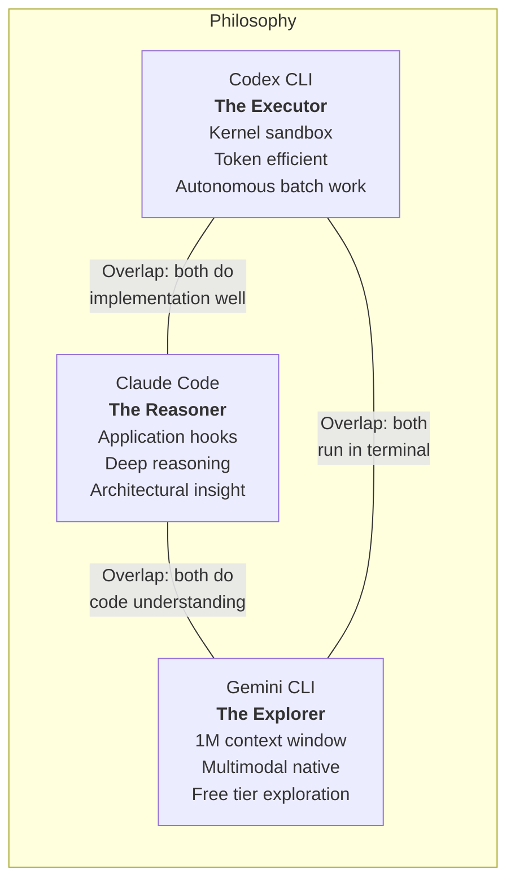
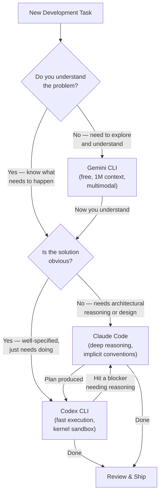
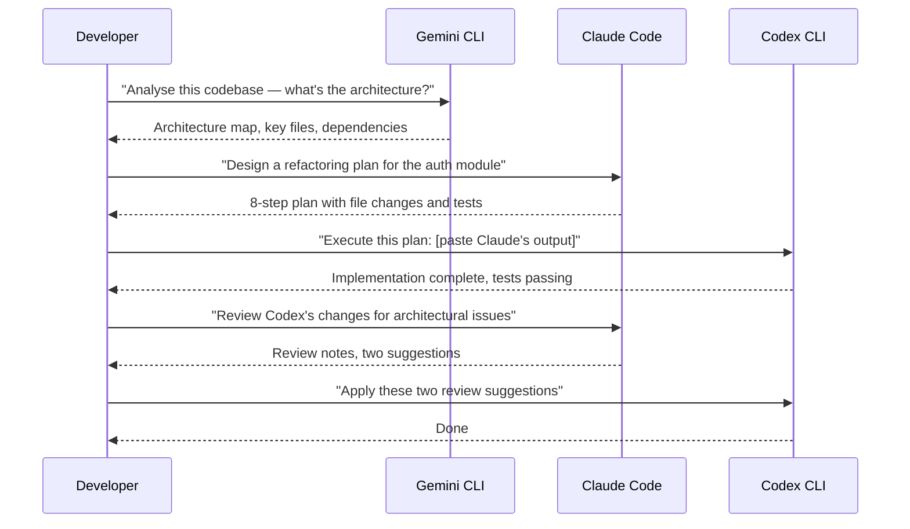
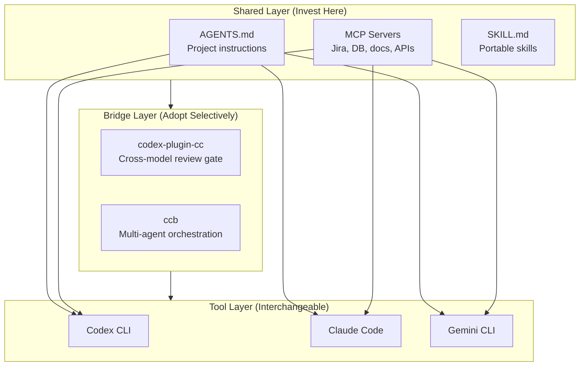
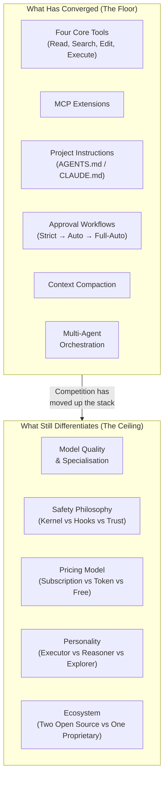

> **The Agentic Engineering Series** — From experiment to enterprise. This is article 6 of 13.
> *This article evaluates the toolchain — comparing Codex CLI, Claude Code, and Gemini CLI as enterprise platform choices.*
> [Previous: The Agentic Pod](/premium/05-the-agentic-pod/) | [Next: AI Slopageddon](/premium/07-ai-slopageddon/) | [Series overview](#series)

> **Series context:** This is article 6 of 13 in *From Experiment to Factory*. The factory's team model and processes are defined; now you need to choose the machinery. This article is **The Toolchain** — an evidence-based comparison of the three major terminal-native agents, helping enterprise teams select and bridge the right platforms for their factory floor.

# Three Terminals, Three Fates: Codex CLI vs Claude Code vs Gemini CLI — A Comparative Analysis

You have $200 per month to spend on AI coding tools. Which terminal-native agent do you pick?

This is not a hypothetical. By April 2026, every serious developer faces this question. The three major AI labs — OpenAI, Anthropic, and Google — each ship a terminal-native coding agent. Each reflects its parent company's deepest technical convictions about how AI should write code. And each will cost you real money, real context-switching overhead, and real workflow lock-in if you choose wrong.

This article draws on published benchmarks, official documentation, community reports from 500-plus Reddit threads[^2], and practitioner case studies to build a fair, evidence-based comparison. It does not pick a winner — because there is no single winner — but gives you the decision framework to pick the right tool for your specific situation.

Here is what this article covers: the architectural philosophy behind each tool, a head-to-head feature matrix, real benchmark data, actual cost breakdowns, a decision framework you can use today, and the convergence thesis that explains why these three tools are more alike than their marketing teams want you to believe.

---

## The Three Philosophies

Before comparing features, you need to understand that each tool embodies a fundamentally different theory about what an AI coding agent should be.

### Codex CLI: The Executor

OpenAI's Codex CLI is built on a simple premise: the best AI coding agent is one you can trust to run unsupervised. Its architecture optimises for autonomous execution with hard safety boundaries. The sandbox is enforced at the OS kernel level — Seatbelt on macOS, Landlock plus seccomp on Linux — meaning a compromised model literally cannot escape the filesystem boundaries you set, regardless of what instructions it receives[^1].

Codex is the tool you reach for when the task is well-specified and just needs to get done. "Add unit tests to every function in `src/auth/`." "Upgrade all Python dependencies and fix any breaking tests." "Refactor the payment module to support multiple currencies using this plan." It executes with precision, reports concisely, and stops.

Ask Codex to describe a codebase and you get three sentences: the right folders, the key entry points, done. Ask it to fix a bug and it will fix exactly that bug, run tests, check lint, note downstream impact areas, and stop. It will not change adjacent code unless asked[^2].

The personality is intentional. Codex is Apache 2.0 open source with over 67,000 GitHub stars and 400-plus contributors[^3]. It is designed as infrastructure — something you build workflows on top of — rather than as a conversational partner.

### Claude Code: The Reasoner

Anthropic's Claude Code is built on a different premise: the best AI coding agent is one that thinks before it acts. Its architecture optimises for deep reasoning about complex, ambiguous problems. The security model is application-layer hooks — 21 programmable lifecycle events that let you encode arbitrarily complex policy logic as shell scripts[^4].

Claude Code is the tool you reach for when the right action is not obvious before you start working. Architecture discussions, debugging sessions where the root cause is unknown, multi-file refactoring where changes cascade across layers. It treats every request as a collaboration, often asking clarifying questions before executing.

Ask Claude Code to describe a codebase and you get an architecture overview, key features, the technical stack, design decisions, and a suggestion for what to explore next. This exploratory nature has a concrete upside: Claude Code will sometimes fix adjacent problems without being asked. Updating a dropdown component, it may also update buttons sharing the same styling. It sees intent, not just instructions[^2].

The failure mode is the flip side of that strength. Claude Code can lose the thread in long sessions, pattern-matching to symptoms rather than root causes. But for development work that involves ambiguity — the work where you do not know exactly what to do until you start doing it — this reasoning-first approach is genuinely more productive.

### Gemini CLI: The Explorer

Google's Gemini CLI is built on a third premise: the best AI coding agent is one that can see everything at once. Its standout feature is a one-million-token context window enabled by default — matching Claude Code's 1M GA window but without requiring a Max/Team/Enterprise subscription[^5]. Combined with a genuinely free tier of 1,000 requests per day[^6] and native multimodal support for PDFs, screenshots, and images, Gemini CLI occupies a distinct niche.

As of April 15, 2026, Gemini CLI ships with native subagent support[^5d]. You delegate tasks with `@agent-name <prompt>` — each subagent runs in its own isolated context window with its own tools, system instructions, and MCP servers. Three built-in agents ship out of the box: `generalist` (a full copy of the main agent for turn-intensive tasks like batch refactoring), `codebase_investigator` (architectural mapping and root-cause analysis), and `cli_help` (Gemini CLI documentation expert). Custom agents are Markdown files with YAML frontmatter dropped into `.gemini/agents/` — shareable through version control, just like AGENTS.md. Parallel execution is supported: spin off multiple subagents simultaneously for concurrent research or multi-package refactoring, though caution is warranted for heavy parallel edits that may conflict.

Gemini CLI is the tool you reach for when you need to understand before you act. Load an entire codebase into context. Analyse a PDF specification against the current implementation. Review a UI screenshot and identify what is wrong. It excels at reconnaissance — the phase of work where you are gathering information and building a mental model.

The trade-off is execution quality. TokenCalculator's April 2026 rankings place Claude Code and Codex CLI as Tier 1 leaders, with Gemini CLI in Tier 3 but improving rapidly[^7]. For pure implementation tasks, Gemini trails the other two. But for the exploration phase that precedes implementation, its combination of massive context and zero cost is unmatched.



---

## The Feature Matrix

Here is what you actually get with each tool as of April 2026, verified against official documentation and community reports.

### Core Capabilities

| Feature | Codex CLI | Claude Code | Gemini CLI |
|---------|-----------|-------------|------------|
| **Underlying model** | GPT-5.4 / GPT-5.3-Codex | Claude Opus 4.6 / Sonnet 4.6 | Gemini 3 Pro / Flash |
| **Context window** | 1M (experimental/opt-in; default 272K)[^8] | 1M (GA for Max, Team, Enterprise)[^9] | 1M (default)[^5] |
| **Sandbox approach** | OS kernel (Seatbelt, Landlock, seccomp)[^1] | Application-layer hooks (21 events)[^4] | OS kernel (Seatbelt on macOS, bwrap on Linux, Windows native) plus Docker/gVisor/LXC options[^5b] |
| **Approval modes** | Suggest / Auto Edit / Full Auto[^10] | Suggest / Auto-accept / Full-auto | Default / Auto Edit / YOLO (Full Auto) / Plan |
| **Open source** | Yes (Apache 2.0)[^3] | No (source-available components) | Yes (Apache 2.0)[^5a] |
| **MCP support** | Yes[^11] | Yes[^11] | Yes[^11] |
| **AGENTS.md** | Native[^12] | Via fallback / symlink | Native[^12] |
| **Project instruction file** | AGENTS.md | CLAUDE.md (5-layer hierarchy) | GEMINI.md (hierarchical; configurable to read AGENTS.md)[^5c] |
| **Subagents** | TOML-defined, parallel execution[^13] | Task tool, Agent Teams (peer-to-peer)[^14] | `@agent` syntax, parallel execution, 3 built-in + custom agents (GA April 2026)[^5d] |
| **CI/CD mode** | `codex exec` (first-class)[^10] | `claude -p` (headless) | `gemini -p` (headless) |
| **Background/cloud agents** | Yes (Codex Cloud)[^15] | Yes (Managed Agents + Routines, April 2026)[^20a] | No |
| **Multimodal input** | Text only | Text, images | Text, images, PDFs, video |
| **Skills (SKILL.md)** | First-class | Supported | Supported |
| **Hooks** | SessionStart, Stop, UserPromptSubmit, PreToolUse, PostToolUse[^16] | 21 lifecycle events[^4] | 10 event types: BeforeTool, AfterTool, BeforeAgent, AfterAgent, BeforeModel, AfterModel, BeforeToolSelection, SessionStart, SessionEnd, Notification, PreCompress[^5e] |
| **Memory system** | Yes (create, consolidate, clean, delete — GA April 2026) | `/memory` command | Gemini memory |
| **Model flexibility** | OpenAI models only | Anthropic models only | Google models only |

### Security Comparison

This deserves its own section because it is the single biggest architectural divergence between the three tools, and it matters enormously for enterprise adoption.

| Security Dimension | Codex CLI | Claude Code | Gemini CLI |
|-------------------|-----------|-------------|------------|
| **Isolation mechanism** | Kernel-enforced sandbox | Application-layer hooks | Multi-layered: Seatbelt (macOS), bwrap (Linux), Windows native, Docker/gVisor/LXC[^5b] |
| **Network access** | Disabled by default | Configurable via hooks | Configurable per sandbox profile (e.g. permissive-open allows network; restrictive profiles block it) |
| **Filesystem access** | Workspace-only (enforced by OS) | Configurable via hooks | Workspace-only by default (enforced by OS-level sandbox); configurable via profiles and dynamic expansion |
| **Process spawning** | Filtered by seccomp | Configurable via hooks | Filtered by sandbox (gVisor intercepts all syscalls; bwrap restricts namespaces) |
| **Pre-execution validation** | Sandbox policy + PreToolUse hooks (Bash only) | PreToolUse hooks (all tools) | BeforeTool hooks (all tools) + sandbox policy + tool-level sandboxing |
| **Post-execution audit** | Stop + PostToolUse hooks (Bash only) | PostToolUse hooks (all tools) | AfterTool hooks (all tools) + AfterAgent hooks |
| **Granularity** | Coarse (OS-level rules) | Fine (per-tool, per-command) | Fine (per-tool hooks, configurable sandbox profiles, dynamic sandbox expansion) |

The fundamental distinction: both Codex CLI and Gemini CLI enforce security at the operating system kernel level — Seatbelt on macOS and Landlock/seccomp or bwrap on Linux — meaning sandboxing cannot be bypassed by prompt injection or a confused model. Claude Code's security is enforced by application-layer hooks, meaning it is more flexible and granular but theoretically bypassable if the application layer is compromised. Gemini CLI additionally offers container-based isolation via Docker, gVisor (which intercepts all syscalls in a user-space kernel), and LXC for full-system sandboxing[^5b].

For CI/CD pipelines and untrusted codebases, both Codex CLI and Gemini CLI offer kernel-level sandbox enforcement. For complex governance requirements where you need per-tool-call policy enforcement, Claude Code's 21 hook events offer the widest surface, though Gemini CLI's 10+ hook event types (including BeforeTool, AfterTool, BeforeModel, AfterModel) also provide substantial programmable governance. For maximum isolation, Gemini CLI's gVisor option provides the strongest sandboxing of any of the three tools.

---

## The Benchmarks: What the Numbers Actually Show

Benchmarks in AI coding are notoriously difficult to interpret. Different organisations report different metrics, contamination concerns apply, and the gap between benchmark performance and real-world usefulness is wide. That said, the data paints a consistent picture of specialisation rather than dominance.

| Benchmark | Codex CLI (GPT-5.3-Codex) | Claude Code (Opus 4.6) | Gemini CLI (Gemini 3 Pro) | Winner |
|-----------|---------------------------|------------------------|--------------------------|--------|
| SWE-bench Verified | ~74% (GPT-5.4)[^17] | ~77%[^17] | 76.2%[^17] | Claude (narrow) |
| SWE-bench Pro | 56.8%[^18] | 55.4%[^18] | Not reported | Codex (narrow) |
| Terminal-Bench 2.0 (model) | 75.1%[^19] | 74.7%[^19] | Not reported | Codex (narrow) |
| Terminal-Bench 2.0 (framework) | 77.3%[^19] | 74.7%[^19] | Not reported | **Codex** |
| Blind tests (36 trials)[^2] | 33% | 67% | Not tested | **Claude** |

The pattern is clear: Codex leads on terminal-native tasks — DevOps, CLI tooling, scripting, automation — though Claude Opus 4.6's Terminal-Bench scores have risen sharply since launch (from 65.4% to 74.7%), narrowing the gap. Claude Code leads on reasoning-heavy tasks — complex refactoring, architectural decisions, blind quality comparisons. The headline SWE-bench Verified numbers are close for all three tools — 74%, 76.2%, and 77% — making that benchmark a narrow spread rather than a clear differentiator.

### Token Efficiency

This is where the comparison becomes dramatically lopsided. A real-world Composio test (Figma cloning task) showed[^18]:

| Tool | Tokens Used |
|------|-------------|
| Claude Code | 6,232,242 |
| Codex CLI | 1,499,455 |

In this single test, Codex used roughly four times fewer tokens. When you are paying per token — or when your subscription has a token budget — differences of this magnitude matter, though broader benchmarks are needed to confirm whether this ratio holds across task types.

Gemini CLI's free tier sidesteps the token economics question entirely for exploration work, but when you upgrade to paid Gemini models for implementation, token efficiency data remains limited.

---

## The Real Cost Breakdown

Here is what these tools actually cost for a developer doing 15 to 20 substantial agent interactions per day, cutting through the marketing.

### Subscription Tiers

| Tool | Entry Tier | Mid Tier | Power Tier |
|------|-----------|----------|------------|
| **Codex CLI** | Plus $20/mo | Pro 5x $100/mo | Pro 20x $200/mo |
| **Claude Code** | Pro $20/mo | Max 5x $100/mo | Max 20x $200/mo |
| **Gemini CLI** | Free (1,000 req/day) | Gemini Advanced $20/mo | API pay-as-you-go |

### The $200/Month Question

You opened this article with $200 per month. Here is what that buys you with each tool:

**Option A: Codex CLI Pro 20x ($200/mo).** You get 20 times the Plus usage limits — roughly 400 to 2,000 GPT-5.4 messages per 5-hour window. This is enough for all-day heavy usage with no rate limits in practice. You also get cloud Codex tasks for CI/CD automation. The kernel sandbox means you can run full-auto mode with confidence. But you are locked to OpenAI models.

**Option B: Claude Code Max 20x ($200/mo).** You get approximately 220K tokens per 5-hour window with access to both Opus 4.6 and Sonnet 4.6. The 1M-token context window is generally available at this tier. You get the full hook system for programmable governance. But Claude Code uses 2 to 4 times more tokens per task than Codex, so your effective throughput is lower. And you are locked to Anthropic models.

**Option C: The multi-tool stack ($200/mo split).** Community analysis suggests this is what many of the most productive developers actually do[^2]:

| Tool | Plan | Monthly Cost |
|------|------|-------------|
| Codex CLI | Plus | $20 |
| Claude Code | Pro | $20 |
| Gemini CLI | Free tier | $0 |
| Remaining budget | API direct (Codex or Claude) | $160 |

The $160 in API budget covers roughly 80 to 160 substantial sessions on GPT-5.4 (with caching), or 40 to 80 on Claude Opus 4.6. You use Gemini CLI for exploration (free), Claude Code for reasoning and planning ($20 subscription plus API overflow), and Codex CLI for execution ($20 subscription plus API overflow). No single tool is rate-limited because the load is distributed[^20].

This multi-tool approach is not theoretical. Community analysis of 500-plus Reddit comments across r/codex, r/ClaudeCode, and r/ChatGPTCoding confirms that the dual-tool or triple-tool approach outperforms loyalty to any single agent[^2].

### The Budget-Conscious Option

If $200 per month is too rich, the minimum viable setup is:

| Tool | Plan | Monthly Cost |
|------|------|-------------|
| Gemini CLI | Free | $0 |
| Codex CLI | Plus | $20 |
| **Total** | | **$20** |

Gemini handles exploration and research. Codex handles implementation. You sacrifice Claude Code's reasoning depth, but for well-specified tasks, this stack covers most common use cases. If you need occasional deep reasoning, add Claude Code Pro for $20 more — bringing the total to $40 per month for access to three frontier models.

---

## The Decision Framework: When to Use Which

The most common mistake is picking one tool and forcing everything through it. Here is the decision framework that works in practice.



### The Quick-Reference Table

| Situation | Best Tool | Why |
|-----------|-----------|-----|
| Understanding an unfamiliar codebase | **Gemini CLI** | 1M context window, free tier, multimodal |
| Analysing a PDF spec or design mockup | **Gemini CLI** | Native multimodal support |
| Architectural decisions ("should we use X or Y?") | **Claude Code** | Strongest reasoning, sees implicit conventions |
| Debugging with unknown root cause | **Claude Code** | Exploratory approach, asks clarifying questions |
| Multi-file refactoring with cascading changes | **Claude Code** | Larger effective context, cross-file reasoning |
| Well-specified implementation tasks | **Codex CLI** | Token efficient, precise, stops when done |
| Adding tests to existing code | **Codex CLI** | Mechanical, well-specified, parallelisable |
| CI/CD pipeline integration | **Codex CLI** | `codex exec`, kernel sandbox, first-class support |
| Batch operations across many files | **Codex CLI** | Subagent parallelism, low interruption rate |
| Running untrusted or open-source code | **Codex CLI** or **Gemini CLI** | Both offer kernel-level sandboxing; Codex disables network by default; Gemini offers gVisor for strongest isolation |
| Cost-constrained exploration | **Gemini CLI** | 1,000 free requests per day |
| Overnight autonomous tasks | **Codex CLI** | Background agents, Cloud execution |
| Code review requiring architectural context | **Claude Code** | Reasons about intent, not just syntax |
| Quick impact analysis before a change | **Gemini CLI** | Load entire codebase, ask broad questions |

### The Three Handoff Patterns

The most productive workflows involve handing off between tools at natural transition points.

**Pattern 1: Explore in Gemini, Plan in Claude, Execute in Codex.** This is the canonical three-tool workflow. Gemini's free tier absorbs the exploratory work — loading the full codebase, asking broad questions about architecture and dependencies. Claude Code takes those findings and designs the implementation strategy. Codex CLI executes the plan with subagents for parallel file changes[^21].

**Pattern 2: Plan in Claude, Execute in Codex.** When you already understand the codebase, skip the exploration phase. Claude Code produces a detailed task breakdown with specific file changes and verification steps. Paste that breakdown into Codex and let it execute. Claude's structured output format maps cleanly to Codex's execution loop[^2].

**Pattern 3: Cross-validation.** Submit the same review task to all three tools and compare results. Where two or more flag the same issue, confidence is high. Where they disagree, a human decision is warranted. This catches model-specific blind spots that any single tool would miss.



---

## Bridging the Three Tools

The handoff patterns above work — but they are manual. You copy context between terminals, paste plans from one agent into another, and mentally track which tool owns which part of the workflow. A new generation of bridging tools is eliminating that friction, turning the three-terminal workflow into something closer to a unified system.

### codex-plugin-cc: The Official Cross-Provider Bridge

On 30 March 2026, OpenAI did something unprecedented: it shipped an official plugin that installs *inside* Claude Code[^26]. `codex-plugin-cc` gives Claude Code users direct access to Codex CLI's review engine without leaving their session.

The plugin provides six slash commands:

| Command | Purpose |
|---------|---------|
| `/codex:review` | Read-only code review on uncommitted changes |
| `/codex:adversarial-review` | Steerable challenge review — questions design decisions and pressure-tests assumptions |
| `/codex:rescue` | Delegates investigation and fixes to Codex via a subagent |
| `/codex:status` | Shows running and completed Codex jobs |
| `/codex:result` | Retrieves output with session IDs for `codex resume` |
| `/codex:cancel` | Terminates active background operations |

The killer feature is cross-model adversarial review. When Claude writes code and Claude reviews it, both passes share identical blind spots. Routing the review through Codex — a model with fundamentally different training data, architecture, and failure modes — breaks this cycle. One practitioner captured it precisely: "Claude more often finds big-picture or taste issues with Codex. And Codex more often finds correctness and code quality issues with Claude."

The optional **review gate** pattern takes this further: it blocks Claude Code from finalising changes until Codex has reviewed and approved them. This is effectively automated cross-model CI — a quality gate that neither agent could provide alone.

Installation is two commands inside any Claude Code session:

```bash
/plugin marketplace add openai/codex-plugin-cc
/codex:setup
```

The strategic significance is worth pausing on. OpenAI chose ecosystem penetration over platform lock-in. Claude Code accounts for a meaningful share of public GitHub commits, and rather than competing for switching, OpenAI embedded Codex *inside* the competitor's tool. If Anthropic or Google reciprocate with reverse plugins, competition shifts from "pick one tool" to "pick a primary agent, supplement with plugins."

### Claude Code Bridge (ccb): Community Multi-Agent Orchestration

Where codex-plugin-cc bridges two tools, the community-built Claude Code Bridge (`ccb`) bridges all of them. It provides a split-pane terminal where Claude Code, Codex CLI, Gemini CLI, OpenCode, and Droid run simultaneously with lightweight async messaging between providers[^27].

The architecture is daemon-based. Each provider gets a dedicated daemon that auto-starts on first request:

| Daemon | Provider | Command |
|--------|----------|---------|
| `askd` | Claude Code | `ask claude "Review for security"` |
| `caskd` | Codex CLI | `ask codex "Implement the auth module"` |
| `gaskd` | Gemini CLI | `ask gemini "Analyse test coverage"` |
| `oaskd` | OpenCode | `ask opencode "Run the linter"` |

Session context persists per-project in `.ccb/history/`, so each provider maintains awareness of the conversation even across terminal restarts. The key insight is that `ccb` does not try to merge the tools into one — it preserves each tool's distinct personality while making the handoff between them seamless.

### MCP as the Universal Bridge Layer

The most powerful bridging mechanism is not a tool at all — it is a protocol. The Model Context Protocol (MCP) is supported by all three CLIs, and a shared MCP server configured in all three tools simultaneously creates an implicit bridge between them[^11].

Consider the workflow: you configure a Jira board MCP server, a database schema server, and an internal documentation server. Gemini CLI reads the Jira tickets and database schema during exploration. Claude Code reads the same resources when designing the implementation. Codex CLI reads them again when executing. No copy-pasting, no context loss — the same resource URIs provide consistent context across all three agents.

Here is a minimal Codex CLI MCP server configuration that works identically across all three tools (adapted for each tool's config format):

```toml
# Codex CLI: ~/.codex/config.toml
[mcp_servers.jira]
command = "npx"
args = ["-y", "@anthropic/mcp-atlassian", "--jira-url", "https://your-org.atlassian.net"]

[mcp_servers.postgres]
command = "npx"
args = ["-y", "@anthropic/mcp-postgres", "--connection-string", "postgresql://..."]

[mcp_servers.internal_docs]
command = "npx"
args = ["-y", "@anthropic/mcp-docs-server", "--path", "./docs"]
```

The same servers can be declared in Claude Code's `settings.json` and Gemini CLI's `settings.json` — different config formats, identical capabilities. With 97 million monthly SDK downloads and governance under the Linux Foundation's Agentic AI Foundation, MCP has become the universal extension layer that makes multi-tool workflows practical at scale.

### Shared AGENTS.md and Portable Skills

The bridging story extends to project configuration. AGENTS.md has become the open standard for project instructions, now maintained by the Agentic AI Foundation and present in over 60,000 GitHub repositories[^12]. Codex CLI and Gemini CLI read it natively. Claude Code reads it as a fallback, or you can make it explicit with a symlink:

```bash
ln -s AGENTS.md CLAUDE.md
```

The agentskills.io specification takes portability further by enabling skills — reusable, composable instruction sets — that work across tools. The paths differ (`~/.claude/` for Claude Code, `~/.codex/` for Codex CLI), but the SKILL.md format is the same. A skill authored once works in any tool that supports the standard.

This means your investment in project configuration is genuinely portable. Write an AGENTS.md file, author your skills to the open standard, configure shared MCP servers, and the configuration layer works regardless of which terminal agent executes the task.

### The Enterprise Bridging Pattern

For enterprise teams following this series' arc from experiment to enterprise factory, the bridging tools suggest a clear investment strategy: **invest in the shared layer first**.



AGENTS.md, MCP servers, and portable skills form the durable foundation — the configuration that survives tool migration. The bridging tools like codex-plugin-cc and `ccb` sit in the middle, enabling cross-model quality assurance and multi-agent coordination without leaving your primary tool. The individual CLI tools are the interchangeable layer on top.

The review gate pattern from codex-plugin-cc deserves particular attention in enterprise contexts. It gives teams cross-model quality assurance — Claude writes, Codex reviews — without requiring developers to manually switch tools or maintain separate review workflows. This is the kind of automated quality gate that scales across a 50-person team in a way that manual cross-validation cannot[^28].

These bridging tools are not just convenience — they are evidence that the convergence is already happening at the tooling layer, not just the architecture layer.

---

## The Convergence Thesis: They Are All Becoming the Same Thing

A pattern worth noting: these tools are converging on the same fundamental architecture. Despite different models, different interfaces, and different marketing, they all implement the same execution pipeline.

An academic taxonomy paper analysing 13 coding agent source codes confirmed it: seven of thirteen agents use sequential ReAct as their core control primitive, and the remaining six use variations that still follow the same observe-act-reflect cycle[^22].

### The Seven Convergence Points

The convergence pattern across these tools has been accelerating throughout early 2026. Here is where they have landed on nearly identical designs[^23]:

**1. The same four core tool categories.** Every tool implements Read (inspect code), Search (find files and content), Edit (modify source files), and Execute (run commands). The edit format has standardised around string replacement with old/new text pairs, because LLMs reason about textual patterns more accurately than numerical line offsets[^22].

**2. MCP as the universal extension protocol.** The Model Context Protocol has crossed 97 million monthly SDK downloads. Anthropic donated it to the Agentic AI Foundation under the Linux Foundation in December 2025, co-founded with Block and OpenAI[^11]. If you build an MCP server, it works with all three tools. The extension model has converged completely.

**3. Project instruction files.** AGENTS.md has become the open standard, now maintained by the Agentic AI Foundation and supported by Codex CLI, Gemini CLI, Copilot, Cursor, and a dozen more tools. Over 60,000 GitHub repositories include one[^12]. Claude Code has its own CLAUDE.md system but also reads AGENTS.md as a fallback. The concept is identical even where the filename differs.

**4. Sandboxed execution.** Every agent that runs shell commands must decide how to isolate them. The design space has collapsed to a handful of approaches: kernel-level (Codex and Gemini CLI both use Seatbelt on macOS and OS-level sandboxing on Linux), application hooks (Claude Code), and containers (Gemini CLI additionally offers Docker, gVisor, and LXC). Different implementations, same architectural decision point[^23][^5b].

**5. Three-tier approval workflows.** Strict (approve every action), configurable (approve consequential actions), and autonomous (approve nothing). All three tools implement all three tiers, just with different names and defaults[^23].

**6. Context compaction.** Every agent faces the same constraint: context windows are finite, coding sessions are not. All three use automatic summarisation when context approaches the limit. All three support subagent delegation to manage context. The specific algorithms differ but the strategic response is identical[^23].

**7. Multi-agent orchestration.** The Planner-Worker-Reviewer pattern is now standard across all three tools. Codex does it with TOML-defined subagents dispatched in parallel. Claude Code does it with the Task tool and Agent Teams. Gemini CLI — as of April 15, 2026 — does it with `@agent` delegation, isolated context windows, and parallel execution of built-in and custom agents[^5d]. The mechanisms differ; the architecture is the same[^24].



### Why This Matters for Your Decision

The convergence thesis has a practical implication: your choice between these tools is less permanent than it feels. The shared pipeline — MCP servers, AGENTS.md instructions, SKILL.md skills — means your investment in project configuration is portable. If you write an MCP server for your internal API, it works with all three. If you write an AGENTS.md file, Codex and Gemini read it natively and Claude Code reads it as a fallback. If you author skills to the Agent Skills open standard, they work across tools[^12].

The things that are not portable are the tool-specific features: Claude Code's 21-event hook system, Codex CLI's TOML-based subagent definitions, Gemini CLI's Markdown+YAML custom agent format and gVisor sandboxing. But even these are converging — all three now have hooks (Codex with 5 events, Gemini CLI with 10+, Claude Code with 21), all three have GA subagent capabilities with parallel execution, and all three are expanding their context windows toward the same 1M-token ceiling.

The safest strategy is not to pick one tool and go all-in. It is to invest in the shared layer (AGENTS.md, MCP servers, skills) and treat the tool-specific layer as interchangeable. The convergence is happening whether the companies want it to or not.

---

## The Personality Test: Which Tool Matches How You Think?

Beyond features and benchmarks, there is a subjective dimension that matters more than most comparison articles acknowledge. These tools have distinct personalities, and the best tool for you depends partly on how you think about code.

**If you think in specifications** — you write detailed requirements before coding, you expect agents not to improvise, you want to review disciplined execution — **Codex CLI matches your mental model.** It sticks to the task precisely. It does not over-extend. What it does, it does completely.

**If you think in systems** — you trust agents to find adjacent issues, you prefer exploration before commitment, you want a collaborative partner that asks questions — **Claude Code matches your mental model.** It sees intent, not just instructions. It will surprise you with useful work you did not ask for.

**If you think in context** — you want to see the whole picture before acting, you prefer gathering information to making snap decisions, you analyse before you implement — **Gemini CLI matches your mental model.** It can hold your entire codebase in working memory and answer questions about the full system.

Most experienced developers are not purely one type. The "think in specifications" mode activates when you are implementing a well-understood feature. The "think in systems" mode activates when you are refactoring something complex. The "think in context" mode activates when you are joining a new project. The right tool changes with the task, not with the developer.

---

## Enterprise Considerations

For teams evaluating these tools, several factors go beyond individual developer preference.

### Governance and Compliance

| Requirement | Codex CLI | Claude Code | Gemini CLI |
|-------------|-----------|-------------|------------|
| SOC 2 compliance | Via OpenAI Enterprise | Via Anthropic Enterprise | Via Google Cloud |
| SSO/SAML | Enterprise tier | Team/Enterprise tier | Via Google Workspace |
| Audit logging | Stop hook, cloud exec logs | 21 hook events for custom audit | 10+ hook event types for custom audit (BeforeTool, AfterTool, BeforeAgent, AfterAgent, Notification, etc.)[^5e] |
| Data residency | API region selection | API region selection | Google Cloud regions |
| On-premise deployment | Open source — fully self-hostable | No | Open source (Apache 2.0) — fully self-hostable[^5a] |
| Network isolation | Kernel-enforced by default | Hook-enforced | Kernel-enforced via sandbox profiles; configurable per Seatbelt profile or container isolation |

Both Codex CLI's and Gemini CLI's open-source Apache 2.0 licenses are significant enterprise differentiators. You can fork, audit, deploy on your own infrastructure, and modify the sandbox policy to match your security requirements. Claude Code does not offer this level of control[^3][^5a].

### Team Cost Modelling (50 Developers)

| Strategy | Monthly Cost | Annual Cost | Notes |
|----------|-------------|-------------|-------|
| Codex CLI Plus (all users) | $1,000 | $12,000 | May hit rate limits for power users |
| Claude Code Pro (all users) | $1,000 | $12,000 | Hits limits within hours for heavy use |
| Gemini CLI Free (all users) | $0 | $0 | No implementation capability gap |
| Multi-tool: Codex Plus + Claude Pro + Gemini Free | $2,000 | $24,000 | Best coverage, no rate limit issues |
| Multi-tool: Codex Pro 5x + Claude Max 5x | $10,000 | $120,000 | Power user configuration |

The multi-tool stack at $40 per user per month (Codex Plus plus Claude Pro plus free Gemini) often proves more cost-effective than a single tool at the $100 or $200 tier, because load distribution across three tools means no single tool hits its rate limits[^20].

---

## What Each Tool Gets Wrong

A fair comparison requires acknowledging weaknesses. Here is what each tool still gets wrong as of April 2026.

### Codex CLI's Weaknesses

**Limited hooks.** Five hook events (SessionStart, Stop, UserPromptSubmit, PreToolUse, PostToolUse) versus Claude Code's 21[^16]. PreToolUse and PostToolUse were added in v0.117.0, but they currently only fire for Bash tool calls, not for `apply_patch` file writes (tracked in openai/codex issue #16732). If you need per-tool-call policy enforcement beyond what the sandbox provides, Codex's hook surface is still narrower than Claude Code's.

**Newer memory system.** Claude Code's `/memory` command has been available since mid-2025. Codex CLI's memory lifecycle — create, consolidate, clean, delete, and TUI management — only reached GA in April 2026, so it is less battle-tested. Early sessions may still feel stateless until memories accumulate.

**Single-vendor model lock-in.** Codex only runs OpenAI models. If GPT-5.4 struggles with a particular task type, you cannot swap in Claude or Gemini without switching tools entirely. The fork ecosystem (notably Every Code) addresses this, but the mainline tool does not[^3].

**Reasoning depth.** On tasks requiring deep architectural reasoning — the kind where the right approach is not obvious — Codex trails Claude Code. The GDPval-AA benchmark shows a meaningful Elo gap, and this matches practitioner experience[^17].

### Claude Code's Weaknesses

**Token consumption.** Using 2 to 4 times more tokens than Codex for comparable results is not just a cost issue — it means hitting rate limits faster, slower iteration cycles, and higher latency per response[^18].

**Rate limits on lower tiers.** Claude Code Pro at $20 per month hits limits within hours of serious use. The practical minimum for heavy development is the $100 Max tier, making Claude Code effectively five times more expensive than its entry price suggests[^20].

**Newer background execution.** As of April 2026, Anthropic launched Claude Managed Agents (April 8) and Claude Code Routines (April 14), enabling cloud-hosted background execution that survives terminal closures[^20a]. These are newer and less battle-tested than Codex Cloud tasks, but the gap has closed significantly.

**Proprietary and closed.** You cannot self-host, fork, or audit Claude Code's internals. Both Codex CLI and Gemini CLI are Apache 2.0 open source, making Claude Code the only one of the three that cannot be self-hosted or fully audited. For security-sensitive organisations that need to understand exactly what their tools are doing, this is a significant disadvantage.

### Gemini CLI's Weaknesses

**Sandbox not enabled by default.** Gemini CLI has comprehensive sandboxing (Seatbelt on macOS, bwrap on Linux, Windows native, Docker, gVisor, and LXC), but it must be explicitly enabled via the `-s` flag, environment variable, or settings.json. This opt-in model means developers who do not configure it run without sandbox protection[^5b].

**Tier 3 implementation quality.** Gemini CLI is great at understanding code and terrible (relative to the other two) at modifying it reliably. TokenCalculator places it in Tier 3 for a reason[^7].

**Rate limit controversy.** The free tier's 1,000 requests per day sounds generous, but community reports indicate that credits reset weekly rather than every five hours as some documentation suggests. High-reasoning model access feels throttled in practice[^25].

**Younger ecosystem.** Codex CLI has 67,000 GitHub stars and hundreds of community-built extensions. Claude Code has a rich hook and skill ecosystem. Gemini CLI has grown rapidly (34,000-plus GitHub stars and 3,300-plus forks) and now has a full hook system, skills support, and a GA subagent architecture with custom agent definitions[^5d], but its community tooling ecosystem is still maturing compared to the other two.

---

## The Verdict: There Is No Verdict

If you have read this far hoping for a definitive winner, this section may disappoint — but it offers something more useful than a verdict.

**If you can only afford one tool ($20/month):** Pick Codex CLI Plus. It has the best token efficiency, the strongest sandbox, and runs all day without hitting limits. Supplement it with free-tier Gemini CLI for exploration.

**If you can afford two tools ($40/month):** Add Claude Code Pro. Use Claude for reasoning and planning, Codex for execution, Gemini for exploration. This is the sweet spot for most developers.

**If money is not the constraint ($200/month):** Split across all three with API overflow budget. Rate limits become rare, you are far more likely to have the right tool for any given task, and your project configuration (AGENTS.md, MCP servers, skills) stays portable across all of them.

**If you are an enterprise team:** Start with Codex CLI or Gemini CLI for their open-source auditability (both Apache 2.0) and kernel-level sandboxing. Add Claude Code for complex reasoning tasks. Use Gemini CLI's free tier as the universal exploration layer. Invest in the shared configuration layer — AGENTS.md, MCP servers, portable skills — because that investment survives any tool migration.

The developers shipping the fastest in 2026 are not the ones who picked the "best" tool. They are the ones who learned to route each task to the right tool. Exploration goes to Gemini. Reasoning goes to Claude. Execution goes to Codex. The terminal is the shared interface. The convergent pipeline underneath makes switching cheap. And the AGENTS.md, MCP, and SKILL.md standards ensure that your configuration investment is never wasted.

Three terminals. Three fates. But increasingly, the same destination.

The toolchain is evaluated. But what happens when these powerful tools operate without the governance this series advocates? In [Article 07: AI Slopageddon](/premium/07-ai-slopageddon/), we confront the risk — the cognitive debt crisis that emerges when organisations adopt agents without the factory discipline to contain them.

---

## Citations

---

## The Agentic Engineering Series {#series}

From experiment to enterprise — building the factory for AI-assisted software engineering at scale.

| | Article | Role |
|---|---------|------|
| 1 | [Agentic Engineering Is Not Vibe Coding](/premium/01-agentic-engineering-is-not-vibe-coding/) | The Wake-Up Call |
| 2 | [Codex CLI at One Year](/premium/02-codex-cli-at-one-year/) | The Platform |
| 3 | [The AGENTS.md Playbook](/premium/03-the-agents-md-playbook/) | The Blueprint |
| 4 | [TDAD and the Testing Revolution](/premium/04-tdad-and-the-testing-revolution/) | The Quality Gate |
| 5 | [The Agentic Pod](/premium/05-the-agentic-pod/) | The Team Model |
| **6** | **[Three Terminals, Three Fates](/premium/06-three-terminals-three-fates/)** | **The Toolchain** |
| 7 | [AI Slopageddon](/premium/07-ai-slopageddon/) | The Risk |
| 8 | [Inside the Machine](/premium/08-inside-the-machine/) | The Engine |
| 9 | [Complete Guide to Codex Security](/premium/09-complete-guide-to-codex-security/) | The Guardrails |
| 10 | [Context Compaction and Memory](/premium/10-context-compaction-and-memory/) | The Efficiency Layer |
| 11 | [Token Economics and ROI](/premium/11-token-economics-and-the-roi-of-coding-agents/) | The Business Case |
| 12 | [The Scaling Playbook](/premium/12-the-scaling-playbook/) | The Rollout |
| 13 | [The Agentic Engineering Maturity Matrix](/premium/13-the-agentic-engineering-maturity-matrix/) | The Assessment |

---

[^1]: OpenAI, "Agent Approvals and Security — Codex CLI," OpenAI Developers. Seatbelt (macOS), Landlock + seccomp (Linux) OS kernel-level sandboxing. https://developers.openai.com/codex/agent-approvals-security

[^2]: "Claude Code vs Codex 2026 — What 500+ Reddit Developers Really Think," DEV Community. Reports 67% Claude Code win rate across 36 blind trials; Explorer vs Executor mental model; handoff patterns. https://dev.to/_46ea277e677b888e0cd13/claude-code-vs-codex-2026-what-500-reddit-developers-really-think-31pb

[^3]: OpenAI Codex CLI GitHub repository. Apache 2.0 license, 67,000+ stars, 400+ contributors. https://github.com/openai/codex

[^4]: Anthropic, "Hooks Reference — Claude Code Docs." Official documentation listing 21 programmable lifecycle hook events (expanded from the original 12 to include ConfigChange, WorktreeCreate, WorktreeRemove, PostCompact, Elicitation, ElicitationResult, and others). https://code.claude.com/docs/en/hooks

[^5]: Morphllm, "Gemini CLI vs Codex CLI (2026): 1M Context Window vs Sandbox Execution." Gemini CLI 1M token context window comparison. https://www.morphllm.com/comparisons/gemini-cli-vs-codex

[^6]: Google, "Gemini CLI Free Tier." 60 requests/minute, 1,000 requests/day with Google account. https://developers.google.com/gemini-cli

[^7]: TokenCalculator, "Best AI IDE & CLI Tools April 2026: Claude Code Wins, Codex Catches Up." Tier 1/2/3 rankings. https://tokencalculator.com/blog/best-ai-ide-cli-tools-april-2026-claude-code-wins

[^8]: OpenAI, "Introducing GPT-5.4." GPT-5.4 supports 1M context window as experimental/opt-in; default is 272K tokens. https://openai.com/index/introducing-gpt-5-4/

[^9]: Anthropic, "1M Context Is Now Generally Available for Opus 4.6 and Sonnet 4.6." GA for Max, Team, and Enterprise plans. https://claude.com/blog/1m-context-ga

[^10]: OpenAI, "Using Codex with Your ChatGPT Plan." Suggest, Auto Edit, and Full Auto approval modes. https://help.openai.com/en/articles/11369540-using-codex-with-your-chatgpt-plan

[^11]: Agentic AI Foundation (AAIF), MCP under Linux Foundation governance, December 2025. 97 million monthly SDK downloads as of April 2026. https://aaif.io/

[^12]: Tessl, "The Rise of AGENTS.md: An Open Standard and Single Source of Truth for AI Coding Agents." 60,000+ GitHub repositories. https://tessl.io/blog/the-rise-of-agents-md-an-open-standard-and-single-source-of-truth-for-ai-coding-agents/

[^13]: OpenAI, "Subagents — Codex." TOML-defined subagent system with path-based addressing. https://developers.openai.com/codex/subagents

[^14]: Anthropic, "Agent Teams." Peer-to-peer inter-agent communication via mailbox pattern, shipped with Opus 4.6.

[^15]: OpenAI, "Introducing Upgrades to Codex." Background agents and cloud execution. https://openai.com/index/introducing-upgrades-to-codex/

[^16]: OpenAI, "Hooks — Codex." Five hook events: SessionStart (v0.114.0), Stop (v0.114.0), UserPromptSubmit (v0.116.0), PreToolUse (v0.117.0), and PostToolUse (v0.117.0). https://developers.openai.com/codex/hooks

[^17]: SmartScope, "Codex vs Claude Code 2026: Opus 4.6 vs GPT-5.3-Codex Compared." SWE-bench Verified and wider benchmark analysis. https://smartscope.blog/en/generative-ai/chatgpt/codex-vs-claude-code-2026-benchmark/

[^18]: Morphllm, "Codex vs Claude Code (2026): Benchmarks, Agent Teams & Limits Compared." SWE-bench Pro scores, token consumption data from Composio Figma test. https://www.morphllm.com/comparisons/codex-vs-claude-code

[^19]: Terminal-Bench 2.0 Leaderboard (https://www.tbench.ai/leaderboard/terminal-bench/2.0). As of April 2026, Claude Opus 4.6 has risen to 74.7% (up from 65.4% at initial launch), while GPT-5.3-Codex holds at 77.3%. See also OfficeChai initial reporting: https://officechai.com/ai/minutes-after-claude-opus-4-6-created-a-new-high-of-65-8-on-terminal-bench-2-0-gpt-5-3-codex-beat-it-with-77-3/

[^20]: SSD Nodes, "Claude Code Pricing in 2026: Every Plan Explained." Pro, Max 5x, and Max 20x plan economics. https://www.ssdnodes.com/blog/claude-code-pricing-in-2026-every-plan-explained-pro-max-api-teams/

[^20a]: Anthropic, "Claude Managed Agents" (April 8, 2026) — cloud-hosted agent execution with sandboxed environments, checkpointing, and credential management. https://claude.com/blog/claude-managed-agents. Also: Claude Code Routines (April 14, 2026) — persistent background agents triggered by schedule, API, or GitHub events. https://pasqualepillitteri.it/en/news/851/claude-code-routines-cloud-automation-guide

[^21]: DeployHQ, "Comparing Claude Code, OpenAI Codex, and Google Gemini CLI." Three-CLI workflow patterns and cost tiering. https://www.deployhq.com/blog/comparing-claude-code-openai-codex-and-google-gemini-cli

[^22]: Nadeem et al., "Inside the Scaffold: A Source-Code Taxonomy of Coding Agent Architectures," arXiv, April 2026. 13-agent analysis confirming ReAct convergence. https://arxiv.org/html/2604.03515

[^23]: "The Great Convergence: Why Every AI Coding Agent Now Runs the Same Pipeline." Seven convergence points across the agent landscape. https://danielvaughan.github.io/codex-resources/articles/2026-04-15-coding-agent-pipeline-convergence/

[^24]: Mason, M., "AI Coding Agents in 2026: Coherence Through Orchestration, Not Autonomy." Hierarchical orchestration convergence (Planner-Worker-Reviewer). https://mikemason.ca/writing/ai-coding-agents-jan-2026/

[^25]: Vibecoding.app, "Google AntiGravity Review." Rate limit controversy, weekly credit reset. https://vibecoding.app/blog/google-antigravity-review

[^5a]: Google Gemini CLI GitHub repository. Apache 2.0 license, 34,000+ stars, 3,300+ forks, open source since initial release in June 2025. https://github.com/google-gemini/gemini-cli

[^5b]: Google, "Sandboxing in Gemini CLI." macOS Seatbelt (sandbox-exec), Linux bwrap, Windows native sandbox, Docker/Podman containers, gVisor (runsc) for strongest isolation, and LXC/LXD for full-system sandboxing. https://geminicli.com/docs/cli/sandbox/

[^5c]: Google, "Provide context with GEMINI.md files." Hierarchical context system with global, workspace, and JIT context files. Default filename is GEMINI.md; configurable to also read AGENTS.md via settings.json context.fileName property. https://geminicli.com/docs/cli/gemini-md/

[^5d]: Google, "Subagents have arrived in Gemini CLI." GA launch April 15, 2026. `@agent` delegation syntax with isolated context windows per subagent. Three built-in agents (generalist, cli_help, codebase_investigator). Custom agents via Markdown + YAML frontmatter in `.gemini/agents/`. Parallel execution supported. https://developers.googleblog.com/en/subagents-have-arrived-in-gemini-cli/ ; Documentation: https://geminicli.com/docs/core/subagents/

[^5e]: Google, "Hooks reference — Gemini CLI." 10+ hook event types: BeforeTool, AfterTool, BeforeAgent, AfterAgent, BeforeModel, AfterModel, BeforeToolSelection, SessionStart, SessionEnd, Notification, PreCompress. Supports JSON stdin/stdout communication, matchers, sequential/parallel execution. https://geminicli.com/docs/hooks/reference/

[^26]: codex-plugin-cc GitHub repository (https://github.com/openai/codex-plugin-cc). Published 30 March 2026. Six slash commands for cross-model review, adversarial analysis, and task delegation inside Claude Code. Analysis: SmartScope, "Codex vs Claude Code 2026" (https://smartscope.blog/en/generative-ai/chatgpt/codex-vs-claude-code-2026-benchmark/); The Decoder, "OpenAI ships Codex inside Claude Code"; OpenAI Developer Community discussion thread.

[^27]: Claude Code Bridge (ccb) — community multi-agent orchestration tool providing split-pane terminal with daemon-based provider management (askd, caskd, gaskd, oaskd). Session context persists per-project in .ccb/history/. Supports Claude Code, Codex CLI, Gemini CLI, OpenCode, and Droid simultaneously.

[^28]: Cross-reference: "The Three-CLI Toolkit: Running Codex CLI, Claude Code, and Gemini CLI as a Unified Development Stack," codex-resources standard library, 11 April 2026. Covers decision frameworks, workflow patterns, shared MCP configuration, and cost-optimisation strategies for multi-tool development stacks.
