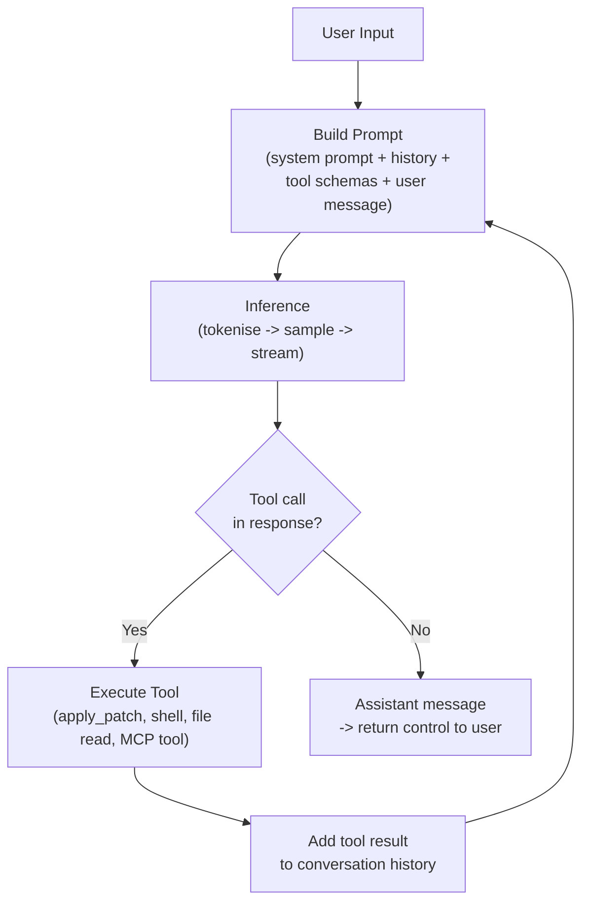
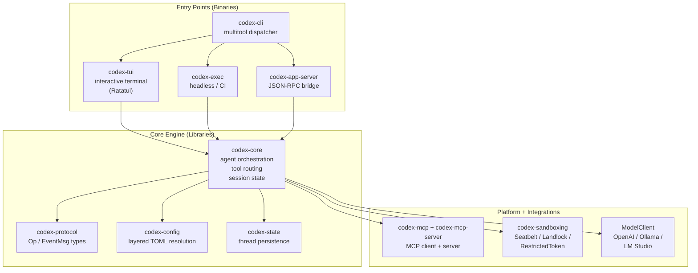
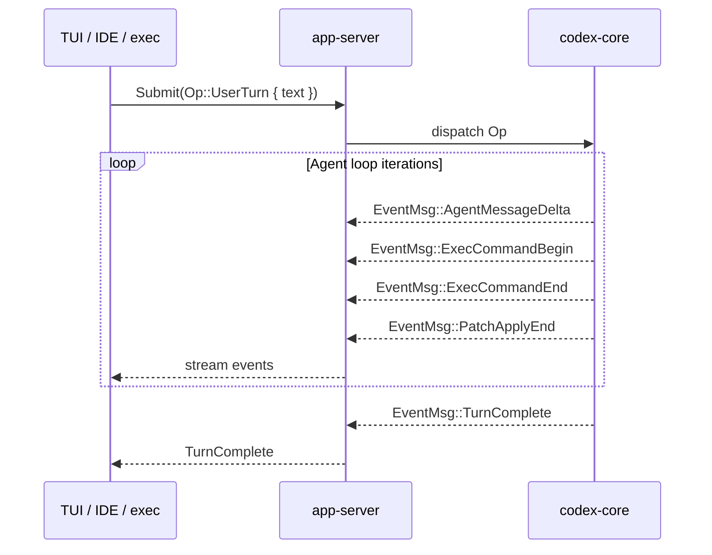
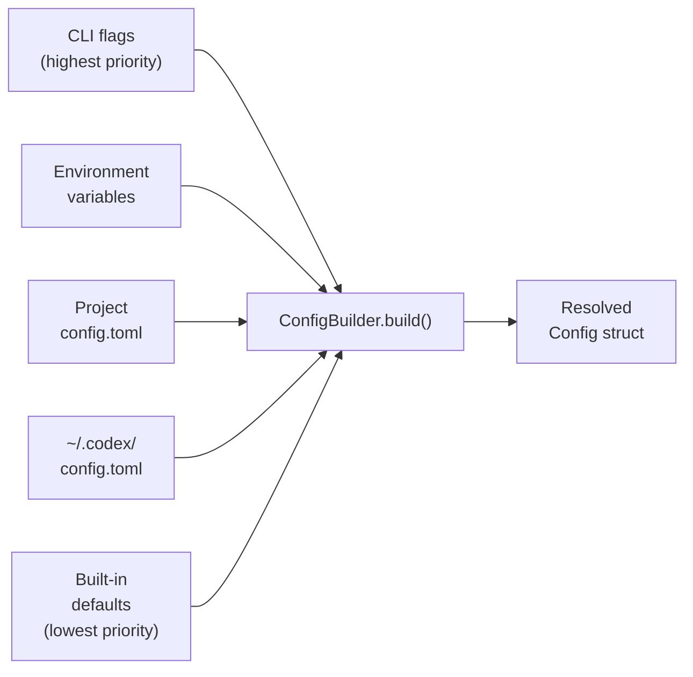
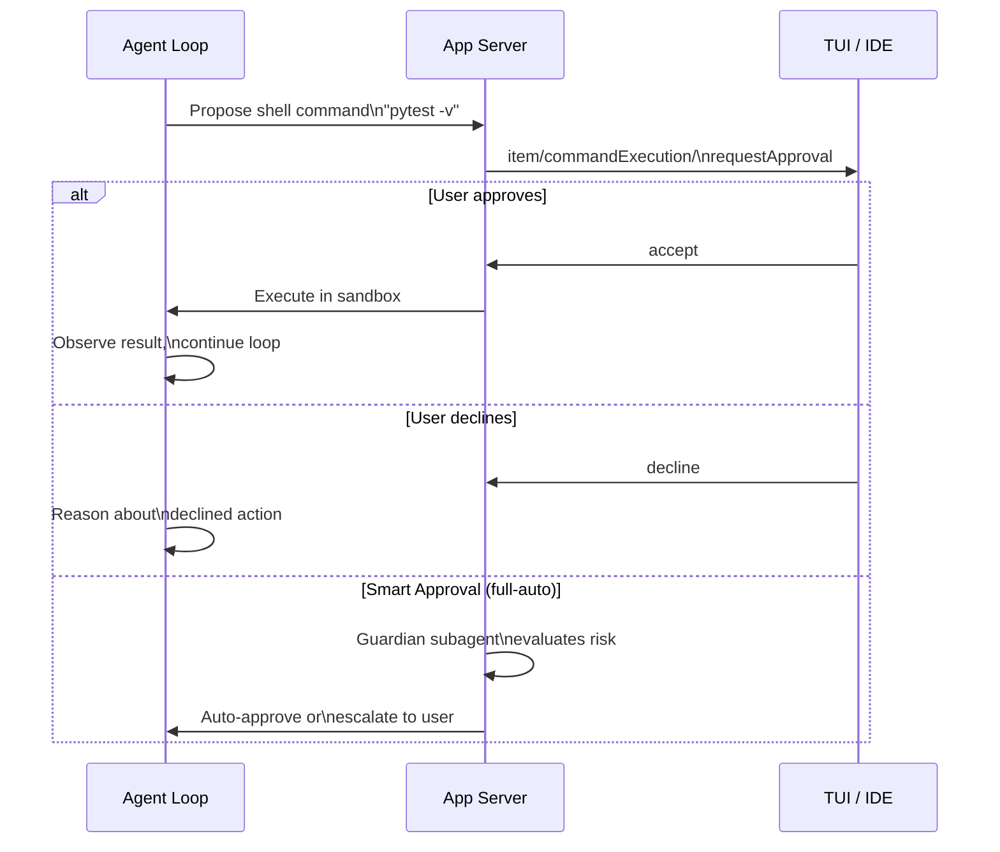
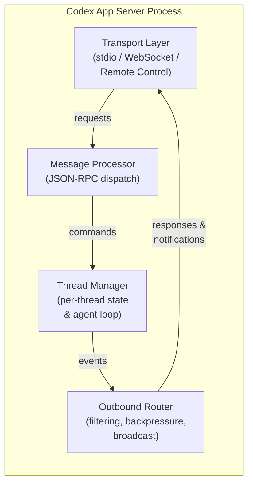
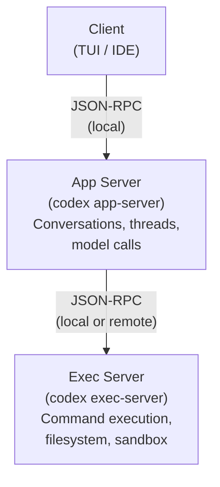
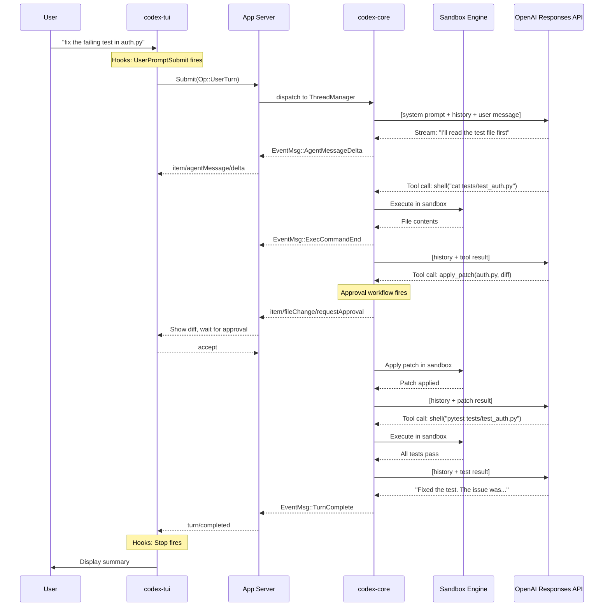

> **The Agentic Engineering Series** — From experiment to enterprise. This is article 8 of 13.
> *This article opens the engine — understanding Codex CLI's internals so you can tune, extend, and trust the machinery.*
> [Previous: AI Slopageddon](/premium/07-ai-slopageddon/) | [Next: Complete Guide to Codex Security](/premium/09-complete-guide-to-codex-security/) | [Series overview](#series)

> **Series context:** This is article 8 of 13 in *From Experiment to Factory*. Having seen the risks of ungoverned agent use, we now open **The Engine** — a deep architectural walkthrough of Codex CLI's internals. Understanding the agent loop, sandbox, and hooks system is essential for any enterprise that wants to tune, extend, and trust its factory machinery rather than treating it as a black box.

# Inside the Machine: How Codex CLI Actually Works (Architecture Deep Dive)

When you type `codex 'fix this bug'` and press Enter, something remarkable happens in the next thirty seconds. Your prompt travels through a Rust binary, gets serialized into a JSON-RPC message, enters an agent loop that calls the OpenAI Responses API, receives a streaming response that proposes a code change, routes that change through a sandbox policy engine that decides whether your filesystem can be touched, applies a patch through a tool call, observes the result, reasons about whether more work is needed, and either loops again or hands control back to you with a summary of what changed.

All of that -- the protocol negotiation, the sandboxing, the approval workflow, the context management, the streaming -- happens in a single Rust process that starts in milliseconds and uses no garbage collector.

This article takes that thirty-second experience apart, component by component. By the end, you should understand Codex CLI's architecture well enough to read its source code, debug unexpected behaviour, or contribute to it. We will cover the agent loop, the sandbox, the Rust rewrite, the app server protocol, the hooks system, MCP integration, and context compaction. Each section includes references to the actual source files in the [openai/codex](https://github.com/openai/codex) repository.

Open the hood.

## Part 1: The Agent Loop -- The Heartbeat of Codex

Every coding agent is, at its core, a loop. Codex's loop is elegant in its simplicity and powerful in its implications. Michael Bolin, Codex's lead engineer, published a detailed walkthrough of this loop in January 2026, and it remains the best public documentation of how the system thinks.[^1]

Here is the loop in its entirety:



A "turn" is one complete pass from user input to final assistant message. But a single turn can execute dozens of iterations through this loop. When you ask Codex to fix a failing test, it might read the test file (tool call), read the implementation file (tool call), apply a patch (tool call), run the test suite (tool call), observe the failure (tool call result), apply a second patch (tool call), run the tests again (tool call), see them pass, and then produce the final assistant message. That is eight iterations of the loop within a single turn.

### Why This Matters: The Quadratic Growth Problem

Here is the insight that separates casual users from people who can predict and control Codex's behaviour: every time the loop iterates, the **entire conversation history** is sent to the model.

```text
Turn 1:   [system prompt] + [user message]                     ~2K tokens
Turn 5:   [system prompt] + 4 prior turns + tool results       ~15K tokens
Turn 20:  [system prompt] + 19 prior turns + many tool results ~80K tokens
Turn 50:  [system prompt] + 49 prior turns + hundreds of tools  potentially millions
```

The total tokens sent over a session's lifetime grows **quadratically** with the number of turns. Doubling the session length roughly quadruples total token consumption.[^1]

This is not a bug. The model needs conversation history to reason coherently about your codebase. But it means that long sessions are disproportionately expensive, that sessions doing heavy file editing exhaust context faster than light sessions, and that a single session should do one focused task rather than everything.

### The Responses API: Purpose-Built for Loops

Codex migrated from the Chat Completions API to the Responses API in v0.113.0 (early March 2026). The reasons were architectural:[^1]

- **40-80% better cache utilisation** -- the Responses API was designed for the access patterns of agentic loops, where successive calls share a long common prefix
- **3% SWE-bench improvement** -- better caching means more compute budget for reasoning
- **Parallel tool calls** -- multiple tool calls can be returned in a single model response, reducing round trips

Codex uses prefix caching aggressively. The system prompt and the bulk of conversation history form a stable prefix that gets cached on OpenAI's infrastructure. Only the latest user message and tool result are new. Cached tokens are significantly cheaper, which means the quadratic growth in tokens sent does not translate to quadratic cost growth -- the marginal cost per turn grows more slowly than you would expect.[^1]

**Design tip:** Keep your `AGENTS.md` stable during a session. Changing it mid-session invalidates the system prompt cache, which is usually the largest cached prefix.

### Tool Calls: The Real Output

Bolin makes an important clarification that reframes how you should think about Codex:

> *"Because the agent can execute tool calls that modify the local environment, its 'output' is not limited to the assistant message. In many cases, the primary output of a software agent is the code it writes or edits on your machine."*[^1]

The assistant message at the end of a turn is a termination signal, not the deliverable. The deliverable is the accumulated effect of tool calls on your filesystem, test results, and PR state.

## Part 2: The Rust Rewrite -- From TypeScript to codex-rs

When OpenAI open-sourced Codex CLI in April 2025, the codebase was TypeScript on Node.js -- a deliberate choice for development velocity. Less than a year later, the project is 95.7% Rust.[^2] Understanding why they rewrote it reveals the architectural priorities of a production coding agent.

### Why Rust?

Four structural constraints compounded as the TypeScript project matured:[^2][^3]

1. **Node.js as a hard dependency.** Requiring Node v22+ created installation friction everywhere -- enterprise environments, air-gapped machines, CI containers that did not need a JavaScript runtime.

2. **Garbage collection overhead.** GC pauses are incompatible with the latency and memory budgets of a long-running agentic process. A coding session running for hours accumulates history, tool call results, and rendered diffs. The TypeScript runtime's heap grew accordingly, with unpredictable pause spikes during streaming output.

3. **Security bindings at arm's length.** Platform sandboxing (macOS Seatbelt, Linux Landlock) required FFI shims in TypeScript. In Rust, they are first-class dependencies with memory-safety guarantees.

4. **Extensibility ceiling.** As sub-agents, plugins, and the app-server protocol matured, the TypeScript architecture struggled to provide a stable embedding surface for IDE extensions without duplicating logic.

Fouad Matin (Codex co-lead) announced the Rust rewrite in GitHub Discussion #1174, stating the goal: *"zero-dependency installation, native security bindings, no GC pauses, and a wire protocol that lets TypeScript, Python, and other languages extend the agent."*[^3]

### The Workspace: ~90 Crates

`codex-rs/` is a Cargo workspace containing approximately 90 crates, organised in layers:[^4]



The key crates:

- **`codex-core`** is the reusable library crate that OpenAI intends to publish for embedding agents in other Rust applications. It owns the `ThreadManager`, `CodexThread`, and `Session` structs that manage turn-by-turn model interactions, context compaction, and tool dispatch.[^4]

- **`codex-tui`** provides the interactive fullscreen terminal UI using [Ratatui](https://ratatui.rs/). Ratatui's immediate-mode rendering -- every frame redraws all visible widgets from scratch using intermediate buffers -- gives sub-millisecond response times with no retained state to go stale.[^4]

- **`codex-exec`** is the headless non-interactive runner (`codex exec PROMPT`). As of PR #14005, it routes through `InProcessAppServerClient` rather than wiring `ThreadManager` directly, unifying the internal plumbing with the IDE integration path.[^5]

- **`codex-app-server`** exposes the core engine over JSON-RPC 2.0 for VS Code, Cursor, JetBrains, and the web interface at chatgpt.com/codex. This is how every surface beyond the terminal talks to Codex.[^6]

### The Internal Wire Protocol: Submit/Event

Internal communication follows an asynchronous **submit/event** model, not request/response:[^4]



Operations (`Op`) include `UserTurn`, `Interrupt`, and `Shutdown`. Events (`EventMsg`) cover the full session lifecycle: `TurnStarted`, `AgentMessageDelta`, `ExecCommandBegin/End`, `PatchApplyBegin/End`, `TokenCount`, and more.[^4]

This design decouples the rendering layer completely from the agent loop. The TUI subscribes to events; it does not call into the core engine synchronously. The same holds for the app-server -- IDE extensions are pure event consumers. This is what makes it possible for VS Code, the desktop app, the web interface, and the terminal to all use the same agent implementation.

### Configuration Resolution

`codex-config` implements layered configuration merging that follows a clear precedence chain:[^4]



This is why `codex exec --model gpt-5-codex` overrides the profile default, which overrides the global config, which overrides the compiled-in default -- without any of these layers needing to know about each other.

## Part 3: The Sandbox -- Seatbelt, Landlock, and Restricted Tokens

A coding agent that can execute arbitrary shell commands on your machine is either very useful or very dangerous, depending on how well the sandbox works. Codex takes this seriously -- sandboxing is not an afterthought bolted on top; it is a first-class subsystem with platform-specific implementations.

### How Tool Execution Works

All tool execution passes through `ToolRouter` in `codex-core`, which enforces approval policies and selects the appropriate sandbox before spawning any process.[^4] The flow:

1. The model produces a tool call (e.g., `shell: "pytest -v"`)
2. `ToolRouter` checks the sandbox policy and approval mode
3. If approval is needed, the approval workflow fires (more on this below)
4. The command is spawned inside the appropriate platform sandbox
5. Output is captured and returned to the conversation history

### Three Sandbox Modes

Configurable in `~/.codex/config.toml`:[^4]

```toml
# One of: "read-only", "workspace-write", "danger-full-access"
sandbox_mode = "workspace-write"
```

| Mode | What the agent can do |
|------|----------------------|
| `read-only` | Read files, run commands that do not modify the filesystem |
| `workspace-write` | Read everywhere, write only within configured `writableRoots` |
| `danger-full-access` | No restrictions -- the agent can read, write, and execute anything |

### Platform Implementations

| Platform | Mechanism | Source |
|----------|-----------|--------|
| **macOS** | Apple Seatbelt (`/usr/bin/sandbox-exec`) | `codex-rs/sandboxing/src/seatbelt.rs` |
| **Linux/WSL2** | Bubblewrap (namespace isolation) + Seccomp (syscall filtering) | `codex-rs/sandboxing/src/landlock.rs` |
| **Windows** | Restricted token + ACLs | `codex-rs/windows-sandbox-rs/` |

The sandbox profile is applied to the **entire process tree** spawned by a tool call -- not just the direct child process. This prevents tool calls from launching background workers that escape the policy.[^3]

On Linux, the sandbox operates in two stages. The outer stage uses Bubblewrap (`bwrap`) to namespace the filesystem — standard system paths are bind-mounted read-only. The inner stage applies `PR_SET_NO_NEW_PRIVS` and Seccomp syscall filters via the `codex-linux-sandbox` binary. This is significantly stronger than process-level restrictions because it applies to all future syscalls from the process tree, regardless of how processes are spawned.

On macOS, Seatbelt profiles are generated dynamically based on the sandbox mode and writable roots. The profile is passed to `sandbox-exec`, which enforces it at the Mach kernel level. This is the same sandboxing technology that macOS uses for its own App Store applications.

### The Approval Workflow

When the agent wants to execute a shell command or apply a file change, the approval workflow determines whether to proceed:[^6]



The approval can come from three sources:

1. **The user** -- in interactive mode, the TUI presents the proposed action and waits for approval
2. **The Guardian subagent** -- in `full-auto` mode (introduced in v0.115.0), a risk-based automated reviewer evaluates commands against policy rules before execution[^1]
3. **The exec-policy** -- pre-configured rules that auto-approve safe patterns (e.g., `pytest`, `cargo test`, `git diff`)

The Guardian subagent is worth understanding in detail. It is a separate, smaller agent that receives the proposed action, the current sandbox policy, and any rules from your `AGENTS.md`. It evaluates whether the action is safe and returns approve, deny, or escalate. This means that in unattended CI runs, the workflow can run to completion without parking on an approval prompt -- but it also means that destructive actions get caught by a second model evaluation rather than being auto-approved blindly.

Key properties as of v0.117.0:[^1]

- Parallel approvals: multiple tool calls evaluated simultaneously
- Permissions persist across turns: granted once, honoured for the session
- Spawned subagents inherit sandbox and network rules from the parent

## Part 4: The App Server -- One Protocol, Every Surface

The original Codex CLI (pre-v0.117.0) was a monolith: model interaction, tool execution, sandboxing, and the terminal UI all lived in a single process. That worked for a terminal tool but created three problems as Codex expanded to VS Code, JetBrains, the macOS desktop app, and chatgpt.com/codex:[^6]

1. Every new surface reimplemented the agent
2. Remote development was impossible (the TUI was coupled to the agent process)
3. Embedding was painful (third-party tools had to reverse-engineer internal APIs)

OpenAI's solution was to extract the agent core into a standalone server process with a documented protocol. The result: a **bidirectional JSON-RPC 2.0 service** that any client can drive.

### Architecture

An app-server process consists of four cooperating async tasks:[^6]



Source: [`codex-rs/app-server/src/lib.rs`](https://github.com/openai/codex/blob/main/codex-rs/app-server/src/lib.rs).[^6]

### The Three Primitives: Thread, Turn, Item

The entire protocol is organised around three nested primitives:[^6]

**Thread** -- a durable conversation container. Threads survive process restarts, can be resumed by ID, forked into branches, or archived. The protocol provides `thread/start`, `thread/resume`, `thread/fork`, `thread/list`, `thread/read`, `thread/archive`, `thread/rollback`, and more. Threads unload from memory after 30 minutes with no subscribers and no activity.

**Turn** -- one complete exchange: user input followed by all the agent work that produces a response. Turns are the unit of interruption and rollback. `turn/start` begins agent work; `turn/steer` injects guidance mid-turn; `turn/interrupt` cancels.

**Item** -- the atomic unit of output within a turn. Item types include agent messages (streamed text), shell commands (with approval workflow), file changes (diffs/patches), tool calls (MCP invocations), and context compaction summaries. Each item has a lifecycle: `item/started` -> zero or more `item/*/delta` -> `item/completed`.

This hierarchy maps directly onto the UI. When Codex edits three files and runs `pytest`, you are watching a single turn emit multiple items, all streamed incrementally via delta notifications.

### Wire Protocol

The app server uses a "JSON-RPC lite" variant: standard JSON-RPC 2.0 structure, but with the `"jsonrpc": "2.0"` header omitted on the wire to reduce bandwidth.[^6]

```json
// Request (client -> server)
{"id": 1, "method": "thread/start", "params": {...}}

// Response (server -> client)
{"id": 1, "result": {...}}

// Notification (either direction, no id)
{"method": "item/agentMessage/delta", "params": {...}}
```

The server can also **initiate requests to the client** -- this is the mechanism for approval workflows. When Codex wants to execute a shell command, it sends an `item/commandExecution/requestApproval` and waits for the client to respond.

### Transport Options

The app server supports multiple transports:[^6]

| Transport | Flag | Use case |
|-----------|------|----------|
| **stdio** (default) | `--listen stdio://` | Child process mode. VS Code, desktop app, Python SDK all use this. Single-client, exits on close. |
| **WebSocket** | `--listen ws://127.0.0.1:9090` | Multi-client mode. Health endpoints at `/readyz` and `/healthz`. CSRF protection rejects requests with `Origin` headers. |
| **Remote Control** | Built-in | How chatgpt.com/codex reaches your local machine. The app server connects outward to OpenAI's relay via persistent WebSocket. |
| **In-process** | Internal only | Bounded in-memory channels when the TUI runs in the same process. Same protocol semantics, no socket overhead. |

### The Exec-Server Companion

Alongside the app server, Codex ships a separate **exec-server** (`codex-exec-server`) that handles the lower-level concerns: running commands in sandboxes, reading and writing files, and watching filesystem changes.[^6]

This separation enables a powerful deployment pattern: the app server runs locally (close to the user for low-latency interaction), while the exec server runs on a remote machine with fast disk I/O and network access. The developer types on a laptop; code executes on a cloud VM.



### Backpressure and Reliability

The app server is designed for graceful degradation. All four internal components communicate through bounded `mpsc` channels with a capacity of 128 messages. When ingress is saturated, requests are rejected with JSON-RPC error code `-32001` ("Server overloaded; retry later"). Clients should implement exponential backoff with jitter.[^6]

| Condition | Behaviour |
|-----------|-----------|
| Ingress queue full | Request rejected with `-32001` |
| Response/notification delivery | Awaits capacity (never dropped) |
| Slow WebSocket client | Disconnected when outbound queue fills |
| Slow stdio client | Writer blocks (never disconnected) |
| First SIGTERM | Drains running turns, then shuts down |
| Second SIGTERM | Immediate exit |

## Part 5: The Hooks System -- Extensibility Without Forking

Hooks are Codex's mechanism for letting you inject custom behaviour at key points in the agent lifecycle without modifying the agent itself. Introduced experimentally in v0.114.0 and expanded through v0.117.0, the hooks system provides five event points across two categories.[^7]

### Session-Scoped Hooks (v0.114.0--v0.116.0)

| Event | When it fires | Can block? |
|-------|--------------|------------|
| `SessionStart` | Session opens or resumes | No |
| `UserPromptSubmit` | User submits a prompt, before it enters history | Yes (exit code 2) |
| `Stop` | Agent turn completes | Yes (triggers continuation) |

### Tool-Scoped Hooks (v0.117.0)

| Event | When it fires | Can block? |
|-------|--------------|------------|
| `PreToolUse` | Before a tool call executes | Yes (exit code 2) |
| `PostToolUse` | After a tool call completes | No |

### How Hooks Execute

Hooks are configured in `hooks.json` at two levels -- `~/.codex/hooks.json` (global) and `<repo>/.codex/hooks.json` (project-specific). Both files are loaded and merged; hooks from both run concurrently.[^7]

When an event fires:

1. Codex collects all matching hook entries from all loaded `hooks.json` files
2. Each hook's command is spawned as a child process
3. A JSON payload is piped to the process's stdin (session ID, event name, working directory, model, and event-specific fields)
4. stdout is read for structured JSON responses
5. stderr is read for human-readable messages displayed in the TUI
6. The exit code determines the hook's decision

The exit code semantics are critical and a common source of mistakes:[^7]

| Exit code | Meaning |
|-----------|---------|
| **0** | Success / Allow |
| **2** | Block the triggering action |
| **Any other non-zero** | Error, but action still proceeds |

**Exit 1 does not block.** If you write a security hook that exits with code 1 when it detects a problem, the problem is logged as a warning but the action still proceeds. Always use exit code 2 for blocking.

### The Power Pattern: Secret Redaction

The highest-value hook pattern is secret redaction on `UserPromptSubmit`. Users frequently paste configuration snippets, environment variables, or log output containing API keys. A hook at this point catches secrets before they enter conversation history and reach the model:

```json
{
  "hooks": {
    "UserPromptSubmit": [
      {
        "hooks": [
          {
            "type": "command",
            "command": "~/.codex/hooks/redact-secrets.py",
            "timeout": 3,
            "statusMessage": "Scanning prompt for secrets..."
          }
        ]
      }
    ]
  }
}
```

The hook script scans for patterns like `sk-proj-*` (OpenAI keys), `AKIA*` (AWS keys), `ghp_*` (GitHub PATs), and `xox*-*` (Slack tokens). If it finds a match, it exits with code 2 and the prompt is rejected with a message asking the user to remove the secret.[^7]

### Context Injection on SessionStart

Another powerful pattern: injecting Git branch, recent commits, and ticket context when a session opens. This gives the agent awareness of what you are working on without you needing to explain it:

```bash
#!/usr/bin/env bash
# ~/.codex/hooks/inject-context.sh
INPUT=$(cat)
CWD=$(echo "$INPUT" | jq -r '.cwd // "."')
cd "$CWD" 2>/dev/null || exit 0

BRANCH=$(git symbolic-ref --short HEAD 2>/dev/null || echo "detached")
RECENT=$(git log --oneline -5 2>/dev/null || echo "no commits")
TICKET=$(echo "$BRANCH" | grep -oE '[A-Z]+-[0-9]+' | head -1)

CONTEXT="Branch: ${BRANCH}\nRecent: ${RECENT}"
[ -n "$TICKET" ] && CONTEXT="${CONTEXT}\nTicket: ${TICKET}"

echo "$CONTEXT" | jq -Rs '{additionalContext: .}'
exit 0
```

The `additionalContext` field in the JSON response gets injected into the session context, and the agent sees it alongside the system prompt.[^7]

## Part 6: MCP Integration -- The Universal Tool Socket

Model Context Protocol (MCP) is to AI agents what USB-C is to peripherals: a standard interface for connecting tools. Instead of each external system requiring bespoke integration, an MCP server exposes tools, resources, and prompts through a common protocol. Any compliant client -- Codex, Claude Code, Cursor -- can consume them without custom code.[^8]

### How Codex Uses MCP

Codex functions simultaneously as both an **MCP client** (connecting to external tool servers) and an **MCP server** (exposing Codex capabilities to orchestrating agents). The client-side MCP management lives in the `codex-mcp` library crate, while the server binary is the `codex-mcp-server` crate.[^4]

Configuration lives in `config.toml` at three levels:

```toml
# ~/.codex/config.toml (user-global)
[mcp_servers.context7]
enabled = true
command = "npx"
args = ["-y", "@upstash/context7-mcp"]

[mcp_servers.github]
enabled = true
command = "npx"
args = ["-y", "@modelcontextprotocol/server-github"]
env = { "GITHUB_PERSONAL_ACCESS_TOKEN" = "${GITHUB_TOKEN}" }
enabled_tools = ["create_issue", "list_issues", "get_file_contents"]
```

Two transport options:[^8]

- **stdio** (default) -- the MCP server runs as a child process, communicating via stdin/stdout. This covers most community servers.
- **HTTP** -- for remote MCP servers. Authentication via `bearer_token_env_var` pointing to an environment variable.

### Tool Restriction: Less Is More

The `enabled_tools` field narrows which tools the agent can see from a given server. This matters for two reasons:[^8]

1. **Blast radius** -- an agent that cannot call `delete_repository` cannot delete your repository
2. **Cognitive load** -- a shorter tool list means better tool selection by the model

### MCP vs. the App Server Protocol

A common point of confusion: MCP and the app server protocol serve different purposes. OpenAI initially experimented with exposing Codex as an MCP server for client connections, but found that MCP's tool-oriented request/response model could not accommodate streaming diffs, approval workflows, thread persistence, or server-initiated requests.[^6]

The distinction is clean:

- **MCP** connects external tools *to* Codex (e.g., a database server, GitHub, Figma)
- **The app server protocol** connects clients *to* Codex (e.g., VS Code, the desktop app, the web interface)

They coexist. An MCP tool call from within a Codex session flows through the app server protocol to the client for display, but the tool invocation itself uses MCP to talk to the external server.

### MCP in CI/CD

In non-interactive mode (`codex exec`), MCP servers start and stop alongside the agent session. If you commit `.codex/config.toml` with MCP server definitions to your repository, your CI pipeline gets the same tool access as interactive development -- the GitHub MCP server can fetch PR context, check open issues, or update comments during automated code review.[^8]

## Part 7: Context Compaction -- The Breakthrough That Made Long Sessions Possible

The quadratic growth problem we discussed in Part 1 is not merely a cost concern -- it is an absolute barrier. Every model has a finite context window. Once you exceed it, the session is over.

Context compaction is the answer, and the evolution of this capability tells the story of how Codex went from a tool that worked well for 10-minute sessions to one that can run autonomously for hours.

### The Evolution

| Era | Approach | Limitation |
|-----|----------|------------|
| GPT-5.1-Codex-Max (late 2025) | External scaffolding: harness code summarises older turns and injects the summary | The model was not trained to expect or interpret these summaries; long-range coherence suffered |
| GPT-5.2-Codex (Jan 2026) | **Native compaction** baked into the model itself | The model knows, during training, that context windows compress and resume |
| GPT-5.3-Codex (Feb 2026) | Native compaction + interactive steering without context loss | Mid-task redirects maintain coherent state |

The shift from external scaffolding to native compaction in GPT-5.2-Codex was a significant architectural change. The model was specifically optimised for Codex's compaction workflow: it produces and consumes summaries that are semantically faithful yet token-efficient. The result is genuinely coherent multi-file sessions that span thousands of file operations without losing track of what was changed and why.[^9]

### How Compaction Works in codex-rs

The `ContextManager` in `codex-core` tracks token counts per turn and triggers compaction automatically when the session approaches the model's context limit. It spawns a `CompactTask` that replaces older messages with a structured summary, preserving recent history intact.[^4]

Source: [`codex-rs/core/src/compact.rs`](https://github.com/openai/codex/blob/main/codex-rs/core/src/compact.rs)

A notable fix between v0.54.0 and v0.56.0 corrected "summaries of summaries" -- repeated compactions were recursively summarising prior summaries, which degraded long-session quality. The Rust rewrite made this bug tractable: the compaction path now uses a clean template approach that avoids recursive accumulation.[^2]

You can trigger compaction manually with the `/compact` command in the TUI. The recommended practice is to compact proactively at around 60% context utilisation rather than waiting for the automatic trigger near the limit.[^9]

### The Benchmarks Tell the Story

The impact of native compaction shows up directly in benchmarks:[^9]

| Model | SWE-Bench Pro | Terminal-Bench 2.0 |
|-------|--------------|-------------------|
| GPT-5.1-Codex-Max (external compaction) | ~50.8% | ~58.1% |
| GPT-5.2-Codex (native compaction) | 56.4% | 64.0% |
| GPT-5.3-Codex (native + steering) | 56.8% | 77.3% |

The Terminal-Bench 2.0 jump from 58.1% to 77.3% over two model generations reflects improved tool use chaining and long-horizon task completion -- exactly the capabilities that compaction unlocks.[^9]

## Part 8: Putting It All Together -- The Complete Request Lifecycle

Now that we have covered each component, let's trace a complete request through the system. You type `codex 'fix the failing test in auth.py'`:



That is the full path: user input -> hooks -> app server protocol -> agent loop (iterating through model calls and tool executions) -> sandbox enforcement -> approval workflow -> streaming output -> hooks -> user display.

Every component we covered plays a role in those thirty seconds.

## The Source Map

For contributors and the deeply curious, here is where each subsystem lives in the [openai/codex](https://github.com/openai/codex) repository:[^6][^4]

| Component | Path | Purpose |
|-----------|------|---------|
| Agent loop & core engine | `codex-rs/core/` | `ThreadManager`, `Session`, tool routing, context management |
| Context compaction | `codex-rs/core/src/compact.rs` | Compaction templates, summary generation |
| App server | `codex-rs/app-server/src/` | JSON-RPC dispatch, transports, auth, remote control |
| App server protocol types | `codex-rs/app-server-protocol/src/lib.rs` | All protocol type definitions |
| Wire protocol (JSON-RPC lite) | `codex-rs/app-server-protocol/src/jsonrpc_lite.rs` | Serialization with `jsonrpc` header omitted |
| Message processor | `codex-rs/app-server/src/message_processor.rs` | RPC method dispatch and routing |
| Thread state | `codex-rs/app-server/src/thread_state.rs` | Per-thread lifecycle and idle unload |
| Transport layer | `codex-rs/app-server/src/transport/mod.rs` | Backpressure, channel capacity (128) |
| WebSocket transport | `codex-rs/app-server/src/transport/websocket.rs` | Axum-based acceptor, CSRF protection |
| Authentication | `codex-rs/app-server/src/transport/auth.rs` | Capability tokens, JWT (751 lines) |
| Remote Control | `codex-rs/app-server/src/transport/remote_control/` | chatgpt.com relay (6 files) |
| Command execution | `codex-rs/app-server/src/command_exec.rs` | Sandboxed exec with PTY support |
| Exec server | `codex-rs/exec-server/` | Standalone command execution service |
| In-process transport | `codex-rs/app-server/src/in_process.rs` | Zero-copy channels for same-process TUI |
| TUI | `codex-rs/tui/` | Ratatui-based terminal interface |
| Headless exec | `codex-rs/exec/` | `codex exec` non-interactive runner |
| Sandbox (macOS) | `codex-rs/sandboxing/src/seatbelt.rs` | Apple Seatbelt profiles |
| Sandbox (Linux) | `codex-rs/sandboxing/src/landlock.rs` | Landlock + seccomp |
| Sandbox (Windows) | `codex-rs/windows-sandbox-rs/` | Restricted tokens + ACLs |
| MCP client library | `codex-rs/codex-mcp/` | MCP client management and tool resolution |
| MCP server | `codex-rs/mcp-server/` | MCP server binary exposing Codex as an MCP tool |
| Configuration | `codex-rs/config/` | Layered TOML resolution |
| Python SDK | `sdk/python/src/codex_app_server/client.py` | Typed Python client for the app server |
| TypeScript schema exports | `codex-rs/app-server-protocol/schema/typescript/` | Generated from Rust types |
| Contribution conventions | `AGENTS.md` | Codex-specific contribution rules |

## Key Architectural Decisions and Why They Were Made

Having traced through the entire system, several architectural decisions stand out as particularly well-considered:

**1. The submit/event model over request/response.** By making all internal communication asynchronous and event-driven, Codex decouples rendering from reasoning. The TUI, IDE extensions, and the web interface are all pure event consumers. This means a new surface can be added by writing an event renderer -- you never need to modify the agent loop.

**2. The app server as the universal integration point.** Rather than exposing different APIs for different surfaces, OpenAI extracted one bidirectional JSON-RPC protocol that serves everything from the terminal to chatgpt.com. The protocol is documented, the types are code-generated, and third-party clients can be built without reverse-engineering.

**3. Platform-native sandboxing over container-based isolation.** Instead of requiring Docker or a VM, Codex uses the kernel's own security primitives (Seatbelt, Landlock, Restricted Tokens). This means the sandbox works on a developer's laptop without additional infrastructure, and it applies to the entire process tree -- not just the direct child.

**4. Hooks as external processes, not plugins.** By spawning hooks as child processes with JSON on stdin and exit codes as the control mechanism, Codex avoids the complexity of a plugin runtime. Hooks can be written in any language. They cannot crash the agent. And the security model is simple: hooks run outside the sandbox, so enabling them is an explicit opt-in.

**5. Native context compaction over external scaffolding.** Training the model to understand and produce compaction summaries -- rather than bolting summarization on top -- was the decision that made long-horizon autonomous sessions viable. The model cooperates with the compaction system rather than being surprised by it.

## What You Need to Know to Contribute

If this article has given you the itch to contribute to Codex, here is the minimal orientation:[^10]

1. The workspace builds from `codex-rs/` -- run `cargo build` from there, not the repo root
2. All changes to `codex-rs/tui` must have corresponding `insta` snapshot tests
3. TypeScript schema exports in `codex-rs/app-server-protocol/schema/typescript/` are **generated** from Rust types -- do not edit them manually
4. The `codex-core` crate is the intended embedding surface for building agent tooling in Rust
5. Read `AGENTS.md` at the repo root -- it contains Codex-specific contribution conventions that the agent itself follows

The crate boundaries are well-defined and the source code is documented. The preceding sections should provide sufficient architectural context to orient new contributors.

The engine is understood. But understanding the machinery is only half the battle — you also need to secure it. In [Article 09: Complete Guide to Codex Security](/premium/09-complete-guide-to-codex-security/), we install the guardrails — the enterprise security layers that ensure the factory operates safely under production conditions.

## Citations

## The Agentic Engineering Series {#series}

From experiment to enterprise — building the factory for AI-assisted software engineering at scale.

| | Article | Role |
|---|---------|------|
| 1 | [Agentic Engineering Is Not Vibe Coding](/premium/01-agentic-engineering-is-not-vibe-coding/) | The Wake-Up Call |
| 2 | [Codex CLI at One Year](/premium/02-codex-cli-at-one-year/) | The Platform |
| 3 | [The AGENTS.md Playbook](/premium/03-the-agents-md-playbook/) | The Blueprint |
| 4 | [TDAD and the Testing Revolution](/premium/04-tdad-and-the-testing-revolution/) | The Quality Gate |
| 5 | [The Agentic Pod](/premium/05-the-agentic-pod/) | The Team Model |
| 6 | [Three Terminals, Three Fates](/premium/06-three-terminals-three-fates/) | The Toolchain |
| 7 | [AI Slopageddon](/premium/07-ai-slopageddon/) | The Risk |
| **8** | **[Inside the Machine](/premium/08-inside-the-machine/)** | **The Engine** |
| 9 | [Complete Guide to Codex Security](/premium/09-complete-guide-to-codex-security/) | The Guardrails |
| 10 | [Context Compaction and Memory](/premium/10-context-compaction-and-memory/) | The Efficiency Layer |
| 11 | [Token Economics and ROI](/premium/11-token-economics-and-the-roi-of-coding-agents/) | The Business Case |
| 12 | [The Scaling Playbook](/premium/12-the-scaling-playbook/) | The Rollout |
| 13 | [The Agentic Engineering Maturity Matrix](/premium/13-the-agentic-engineering-maturity-matrix/) | The Assessment |

[^1]: Michael Bolin, "Unrolling the Codex Agent Loop," OpenAI Engineering Blog, January 2026. https://openai.com/index/unrolling-the-codex-agent-loop/

[^2]: "OpenAI Rewrites Codex CLI in Rust, Saying Goodbye to Node.js," AIBase, 2026. https://www.aibase.com/news/18549

[^3]: Fouad Matin, "Codex CLI is Going Native," GitHub Discussion #1174, openai/codex. https://github.com/openai/codex/discussions/1174

[^4]: "openai/codex Architecture Overview," DeepWiki. https://deepwiki.com/openai/codex

[^5]: "Add in-process app server and wire up exec to use it," PR #14005, openai/codex. https://github.com/openai/codex/pull/14005

[^6]: OpenAI, "Unlocking the Codex Harness: How We Built the App Server," OpenAI Blog, February 2026. https://openai.com/index/unlocking-the-codex-harness/ — Source code: `codex-rs/app-server/` in the openai/codex repository. https://github.com/openai/codex/tree/main/codex-rs/app-server

[^7]: Codex CLI Hooks Documentation, OpenAI Developer Docs. https://developers.openai.com/codex/hooks — Hook events shipped in v0.116.0 (session-scoped) and v0.117.0 (tool-scoped).

[^8]: Model Context Protocol overview. https://modelcontextprotocol.io — Codex MCP configuration: https://github.com/openai/codex/blob/main/codex-rs/README.md

[^9]: OpenAI, "Introducing GPT-5.2-Codex," January 14, 2026. https://openai.com/index/introducing-gpt-5-2-codex/ — OpenAI, "Introducing GPT-5.3-Codex," February 5, 2026. https://openai.com/index/introducing-gpt-5-3-codex/

[^10]: `AGENTS.md`, openai/codex GitHub repository. https://github.com/openai/codex/blob/main/AGENTS.md
