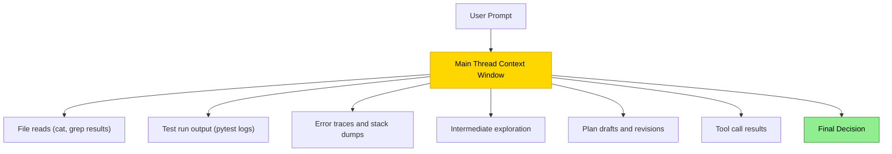
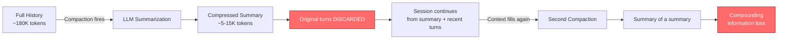
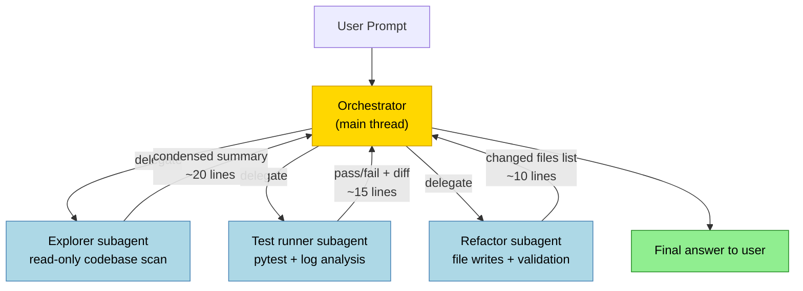
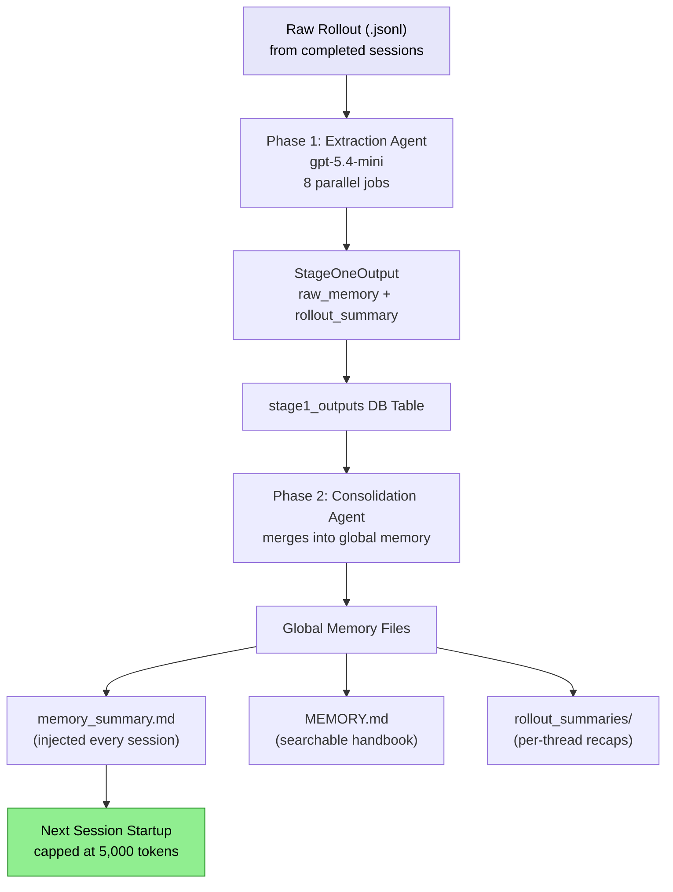
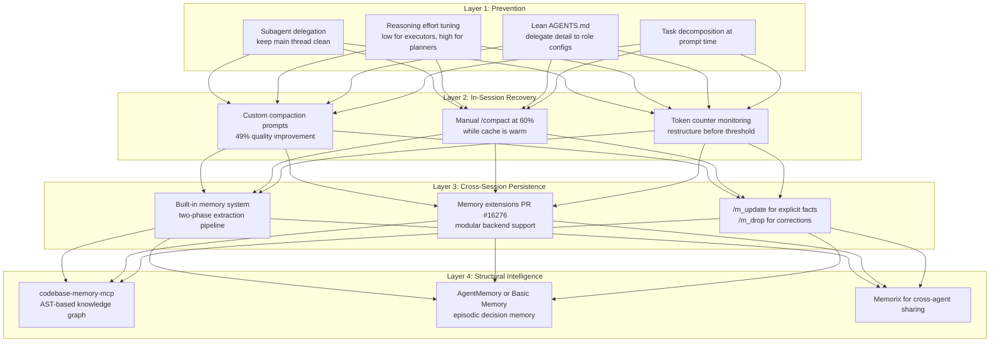

> **The Agentic Engineering Series** — From experiment to enterprise. This is article 10 of 13.
> *This article covers operations — managing context, memory, and efficiency to keep the factory running at scale.*
> [Previous: Complete Guide to Codex Security](/premium/09-complete-guide-to-codex-security/) | [Next: Token Economics and ROI](/premium/11-token-economics-and-the-roi-of-coding-agents/) | [Series overview](#series)

> **Series context:** This is article 10 of 13 in *From Experiment to Factory*. The factory is built and secured; now it must run efficiently. This article is **The Efficiency Layer** — mastering context compaction, memory, and session management so the factory can sustain long-horizon work without degradation, the operational backbone that separates a demo from a production system.

# Context Is All You Need: Mastering the 1M Token Window (And What Happens When You Hit the Wall)

---

## The $0.40 Tax You Are Already Paying

Every time your coding agent's context window fills up and compaction fires, it costs approximately **$0.40** --- equivalent to roughly 21 follow-up turns at cached rates.[^5] That is a single compaction event on a 125,000-token context. In a long refactoring session that triggers three or four compactions, you are burning $1.20-$1.60 in hidden costs before accounting for the quality degradation: lost nuance, repeated work, and an agent that forgets decisions it made twenty minutes ago.

Forty minutes into a refactor, Codex has mapped every callsite, proposed a clean migration path, and is halfway through rewriting the auth module. Then you ask it to update the route guards --- the ones it identified twenty minutes ago --- and it stares at you like a stranger.

"I don't see any route guards in the codebase. Could you point me to the relevant files?"

It found them. It listed them. It built its entire plan around them. And now they are gone --- not from your codebase, but from the agent's memory. Somewhere between the third file read and the seventh test run, the context window filled up, automatic compaction fired, and the summary that replaced your conversation history decided the route guards were not important enough to keep.

This is not a bug. It is not a hallucination in the traditional sense. It is one of the most significant design constraints in agentic coding today: **every AI coding agent has a finite context window, and what happens when it fills up determines whether your session succeeds or silently degrades**.

If you have used Codex CLI for more than a few hours, you have experienced this. If you haven't yet, you will. This article is about making sure you never lose work to it again. (For the architectural detail on how the agent loop and context management interact at the code level, see *Inside the Machine*.)

We will start with the mechanics --- how context windows actually work, what compaction does, and what it costs. Then we will move to the strategies that prevent compaction from firing in the first place: subagent delegation, reasoning effort tuning, and lean context hygiene. Finally, we will look at where context management is heading: persistent memory systems, knowledge graphs, and the architectural shifts that may make this entire problem obsolete.

---

## Part I: The Mechanics of Forgetting

### What a Context Window Actually Is

A context window is not a chat log. It is the total working memory available to the model on any given turn --- every token of every message, every tool output, every system instruction, every file read result, all rendered into a single sequence that the model processes to generate its next response.

For the GPT-5.x-Codex model family, the context window is approximately 1 million tokens. That sounds enormous. It is not. A medium-sized codebase --- say, 200 files averaging 300 lines each --- already represents roughly 600,000 tokens if the agent reads everything. Add your conversation history, AGENTS.md instructions, tool schemas, and the model's own reasoning tokens, and you are closer to the wall than you think.

The critical insight is that **context windows do not degrade gracefully**. The model does not gradually get worse as the window fills. It maintains high quality up to a threshold, then compaction fires, and you experience a discrete information loss event. The agent on the other side of that event is not the same agent you were working with before.[^1]

### How Context Fills: The Single-Thread Trap

In a standard Codex CLI session, everything accumulates in one place:



Every `cat`, every `grep`, every failing test run lands in the same context the model uses to reason about your high-level requirements. Useful signal gets buried under noise. The model starts hedging based on stale intermediate state. Token count climbs toward the compaction threshold.[^2]

Practitioners building complex multi-agent systems identified this early in 2026: *"Agents can't endlessly compact/recycle in the same context window --- we need either smarter harnesses or something which provides more delegation."*[^3]

### What Compaction Actually Does

When the context window approaches capacity, Codex CLI triggers compaction --- either automatically (when the rendered token count crosses `model_auto_compact_token_limit`) or manually (when you type `/compact`).

Here is what happens:

1. The model reads the entire conversation history
2. It generates a compressed summary of the session state
3. The original conversation turns are discarded
4. The summary replaces them, and the session continues from the summary forward

For Codex-family models (GPT-5.2-Codex and later), this process uses an **encrypted compaction path**. The CLI calls OpenAI's remote `compact()` endpoint, which returns an AES-encrypted blob containing a machine-optimized representation of the session state. The encryption key lives on OpenAI's servers. On the next turn, the server decrypts the blob and prepends a handoff prompt for the model.[^4]

For non-Codex models (open-source or third-party), compaction runs locally using a visible compaction prompt. The summary is stored with a `_summary` prefix to prevent re-summarization loops.[^5]

The critical point: **compaction is lossy**. Every compaction pass is a summary of a summary feeding into the next cycle, compounding degradation. OpenAI's own documentation includes the warning: *"Long conversations and multiple compactions can cause the model to be less accurate."*[^6]



### The Thresholds: When Compaction Fires

Codex CLI triggers automatic compaction at approximately 90% of the context window capacity. The exact threshold varies by model (roughly 180K--244K tokens) and is configurable downward --- but not upward. Since v0.100.0, values above approximately 90% of the context window are silently clamped, even if you specify a higher limit explicitly.[^7]

```toml
# ~/.codex/config.toml
model_auto_compact_token_limit = 180000   # tokens; unset = model default
```

For comparison, here is how other agents handle this:

| Agent | Threshold | Philosophy |
|-------|-----------|-----------|
| **Gemini CLI** | ~50% | Aggressive: compact early, lose less per event |
| **Claude Code** | ~89% | Balanced: multi-mechanism defense before full compaction |
| **Codex CLI** | ~90% | Late: maximize useful context, accept larger loss events |
| **OpenCode** | ~96--99% | Extreme: squeeze every token, risk quality cliffs |

Gemini CLI's 50% threshold is striking --- it fires compaction when half the window remains unused, trading context utilization for stability.[^5] OpenCode sits at the opposite extreme. For practitioners, earlier thresholds mean more frequent but smaller information losses; later thresholds mean fewer compactions but more catastrophic ones when they hit.

### The Hidden Cost: KV Cache Destruction

Every compaction event carries a cost that rarely appears in agent documentation: **KV cache invalidation**.[^5]

When an LLM provider processes your context, it builds a key-value cache of attention computations. Subsequent turns that share the same context prefix hit this cache, dramatically reducing both latency and cost. Cache reads cost substantially less than cold reads — approximately 90% or more, depending on the provider.[^5]

Compaction destroys this cache entirely. The summarized context is a new prefix that shares nothing with the previous one, forcing a complete recomputation. Research quantified this: **one compaction on a 125,000-token context costs approximately $0.40 --- equivalent to roughly 21 follow-up turns at cached rates**.[^5]

The optimal strategy is not to avoid compaction at all costs, but to **delay it as long as possible while the cache is warm**, then use it only when the quality degradation from a full window genuinely exceeds the cost of cache invalidation.

---

## Part II: The Breakthrough That Made Long Sessions Viable

### Native Compaction: The GPT-5.2-Codex Shift

Before January 2026, compaction was an external hack. GPT-5.1-Codex-Max could work across multiple context windows, but the compaction was handled by harness code outside the model: summarize older turns, inject the summary, continue. This introduced its own failure modes --- the harness might summarize poorly, the model was not trained to expect or interpret those summaries, and long-range coherence suffered.[^8]

GPT-5.2-Codex, released January 14, 2026, changed the architecture fundamentally. The model was **specifically optimized for Codex's compaction workflow during training**. It knows that context windows compress and resume. It produces and consumes summaries that are semantically faithful yet token-efficient. The result: genuinely coherent multi-file sessions spanning thousands of file operations without losing track.[^8]

The benchmark evidence is clear:

| Model | SWE-Bench Pro | Terminal-Bench 2.0 |
|-------|--------------|-------------------|
| GPT-5.1-Codex-Max | ~50.8% | ~58.1% |
| GPT-5.2-Codex | 56.4% | 64.0% |
| GPT-5.3-Codex | 56.8% | 77.3% |

GPT-5.3-Codex added interactive steering without context loss --- you can redirect the agent mid-task and it maintains coherent state, a capability that previously caused the agent to lose its thread post-compaction.[^8]

This means the `/compact` command became a genuine strategy, not a workaround. Proactively compacting at 60% utilization actually works as intended with these models. But it still is not free, and it still is not lossless.

---

## Part III: Strategies That Prevent Compaction Entirely

The best compaction is the one that never fires. Here are the four highest-leverage strategies for keeping your context clean.

### Strategy 1: Subagent Delegation

The subagent model inverts the single-thread structure. Instead of dumping everything into one context, the main thread holds the brief, requirements, and final decisions. Child threads do the noisy work and return summaries.



The main context sees three clean summaries instead of three context windows' worth of raw output. Its token usage grows slowly. The model retains full fidelity on the high-level task throughout the session.[^2]

**Codex CLI ships with three built-in agent roles:**

| Role | Purpose | Context Strategy |
|------|---------|-----------------|
| **default** | General-purpose orchestration | Holds requirements and decisions |
| **worker** | Execution-heavy implementation | Isolated write context |
| **explorer** | Read-heavy codebase scanning | Isolated read context; returns condensed results |

Custom agents live in `~/.codex/agents/` (personal) or `.codex/agents/` (project-level).

**The key: you must explicitly trigger delegation.** Codex does not spawn subagents automatically. Signals like "spawn", "delegate", "in parallel", or "one agent per point" reliably trigger the multi-agent path:[^2]

```text
I need to migrate the auth module from JWT to session cookies.

Before writing any code:
1. Spawn an explorer to catalogue every callsite that reads/writes the JWT (src/, tests/)
2. Spawn a second explorer to find all middleware and route guards that depend on auth state
3. Bring the two summaries back here before we plan the migration
```

This keeps exploration output out of the orchestrator's context entirely. The main thread receives 20 lines instead of 2,000.

**Configure the topology in `config.toml`:**

```toml
[agents]
max_depth = 1          # root = depth 0, direct children = depth 1
max_threads = 6        # concurrent agent threads
```

Keep `max_depth = 1`. Recursive fan-out with higher depth limits compounds token usage exponentially. Parallelize reads freely; serialize writes to avoid merge conflicts.[^2]

**Match models to subagent roles for cost control:**

```toml
# .codex/agents/explorer.toml
[agent]
model = "gpt-5.4-mini"
description = "Read-heavy codebase explorer"

[model_settings]
reasoning_effort = "low"

# .codex/agents/architect.toml
[agent]
model = "gpt-5.4"
description = "High-level planning and final decision agent"

[model_settings]
reasoning_effort = "high"
```

GPT-5.4-mini handles exploration, file review, and summarization --- tasks where speed and throughput matter more than deep reasoning. Use the full model where architectural judgment is required.[^2]

### Strategy 2: Reasoning Effort Tuning

Reasoning effort is the single knob that most dramatically affects how fast your context fills. Every reasoning token the model uses counts against your context budget, even though those tokens never appear in the conversation. At `xhigh`, the model may burn 8--15x more reasoning tokens than at `medium`.[^9]

The five levels:

| Level | Reasoning Token Multiplier | Best For |
|-------|---------------------------|----------|
| `minimal` | ~0.1x | Trivial: rename, format, single-line fix |
| `low` | ~0.3x | Boilerplate, well-defined transforms |
| `medium` | 1x (baseline) | Default. Everyday interactive coding |
| `high` | ~3--5x | Multi-file refactors, complex debugging |
| `xhigh` | ~8--15x | Long-horizon autonomous tasks, security audits |

**The context management insight:** running everything at `high` does not just cost more --- it fills your context window 3--5x faster, bringing compaction forward significantly.

The optimal pattern for multi-agent workflows: **orchestrator at `high` for planning and decisions; subagents at `low` or `minimal` for execution**. This can reduce overall token spend by 50--70% versus running everything at `medium`, while maintaining quality where it matters.[^9]

```toml
# ~/.codex/config.toml
model_reasoning_effort = "medium"          # everyday interactive default
plan_mode_reasoning_effort = "high"        # /plan mode always gets more thought
```

You can switch mid-session with `/effort high` or per-invocation with `codex -e high "..."`.

**Profiles make this a habit, not a per-session decision:**

```toml
[profiles.daily]
model_reasoning_effort = "medium"

[profiles.deep-work]
model_reasoning_effort = "high"
model = "gpt-5.4"

[profiles.triage]
model_reasoning_effort = "low"
model = "gpt-5.4-mini"
```

Launch with `codex --profile deep-work "..."` or set `default_profile = "daily"`.

### Strategy 3: Custom Compaction Prompts

When compaction does fire, you can control what survives. By default, the summarization model decides what to keep. With a custom compaction prompt, you make that decision:

```toml
# ~/.codex/config.toml
compact_prompt = """
Summarise the session. Preserve:
- ALL file paths touched, with the specific changes made to each
- ALL architectural decisions taken and their rationale
- The current TODO list with completion status
- Any open questions or unresolved issues
- Function signatures for any newly created or modified interfaces

Omit: raw command output, test logs, stack traces, intermediate exploration.
"""
```

Or load from a file for version-controlled team compaction prompts:

```toml
experimental_compact_prompt_file = ".codex/compact-prompt.md"
```

Research testing structured preservation checklists before compaction found that summary quality improved by **49%** (from 1,643 tokens to 2,455 tokens) at a negligible additional cost of $0.013.[^5] This is essentially free insurance.

### Strategy 4: Lean Context Hygiene

Small choices compound. Every token in your AGENTS.md, every MCP tool schema, every unnecessarily verbose file read chips away at your context budget.

**Keep AGENTS.md concise.** The file is injected at session start and counts against your budget on every turn. Delegate deep context to role-specific config files:

```markdown
# AGENTS.md (root --- keep under 500 tokens)
See .codex/agents/ for role-specific instructions.
Default model: gpt-5.4.
Test command: uv run pytest -q.
Lint command: ruff check.
```

**Instruct subagents to return summaries, not raw output:**

```text
Summarise your findings in:
- A bullet list of affected files (path only, no content)
- A one-sentence description of each module's dependency on the JWT
- Total callsite count
```

**Monitor the token counter** in the CLI footer. If it is climbing quickly on a single task, that is your signal to restructure as a delegated workflow before compaction fires.

---

## Part IV: What Happens After the Session Ends

Context compaction addresses within-session memory. But what about between sessions? Every morning, your Codex agent wakes up with amnesia. The forty minutes you spent yesterday teaching it your domain model, your deployment quirks, your team's naming conventions --- gone.

This is the **cold start problem**, and it is where the next wave of context management innovation is happening.

### The Built-In Memory System

Codex CLI's memory subsystem is more sophisticated than most users realize. It operates as a **two-phase pipeline** that transforms raw conversation rollouts into persistent, consolidated knowledge.[^10]



**Phase 1: Startup Extraction.** When Codex identifies stale threads --- sessions updated since their last memory extraction --- it spawns lightweight extraction agents using `gpt-5.4-mini` (previously `gpt-5.1-codex-mini`, which was deprecated April 2026). Each processes raw `.jsonl` rollout files and produces detailed Markdown capturing specific facts, decisions, and preferences, plus a compact session recap.[^10]

**Phase 2: Global Consolidation.** A dedicated "Memory Writing Agent" periodically merges Phase 1 outputs into global memory files. An `input_watermark` tracks which outputs have already been processed, enabling incremental updates rather than full rebuilds.[^10]

**Diff-based forgetting** (introduced v0.106.0) prevents memory bloat. Rather than treating memory as append-only, the consolidation agent performs differential comparison between existing memory and incoming extractions. Facts that are contradicted or superseded by newer information are removed or updated --- mimicking how human memory works.[^10]

**Usage-aware selection** ensures frequently referenced memories are prioritized. When the agent cites a memory, the system increments a usage counter. During consolidation, high-frequency memories survive longer while rarely accessed facts gradually fade.[^10]

**Interactive commands for direct manipulation:**

```bash
/m_update always use pytest, never unittest
/m_update this project uses pnpm, not npm
/m_drop outdated preference about npm

# Nuclear option: reset everything
codex debug clear-memories
```

The memory system is **CWD-aware**: working across multiple repositories naturally surfaces different memory contexts in each, without manual switching.[^10]

### Memory Extensions: PR #16276

The most strategically significant recent feature landed on April 9, 2026. PR #16276 adds a **memory extension system** to Codex CLI's core, enabling persistent cross-session memory with a modular architecture.[^11]

The key additions:

- **Consolidation module with extension paths** --- memory data is processed through configurable consolidation templates
- **Conditional rendering** --- memory extension prompts activate only when relevant context is available, avoiding unnecessary token consumption
- **Extension-based architecture** --- memory extensions wire through a modular prompt system, not hard-coded into the agent loop
- **Third-party backend support** --- the extension architecture means custom memory backends (databases, vector stores) can plug in

This solves the cold start problem at the infrastructure level. Agentic pods can now build institutional memory --- decisions, patterns, and domain knowledge persist across sessions, developers, and even across different agents in a team.

### MCP Memory Servers: The Ecosystem Solution

For teams that need more than built-in memory provides, a new category of MCP memory servers has emerged. These give Codex CLI a persistent, searchable memory layer that survives session boundaries and shares context across agents.[^12]

**The five leading options:**

| Server | Approach | Key Strength |
|--------|----------|-------------|
| **AgentMemory** | Full-stack: 43 tools, 4-tier consolidation | Significant token reduction vs. all-in-context baseline |
| **Basic Memory** | Markdown-first with semantic search | Portable, human-readable, cross-client |
| **codebase-memory-mcp** | AST-based knowledge graph (66 languages) | 120x fewer tokens vs. file-by-file search ([source](https://github.com/DeusData/codebase-memory-mcp)) |
| **Memorix** | Cross-agent shared memory | Works across Codex, Claude Code, Cursor |
| **Memsearch** | Markdown-first with Milvus vector search | Rebuildable index, BM25 + dense hybrid |

The optimal setup for most teams combines two complementary layers:

```toml
# ~/.codex/config.toml

# Episodic memory: decisions and discoveries
[mcp_servers.agentmemory]
type = "command"
command = ["npx", "@agentmemory/agentmemory", "--mcp"]

# Structural memory: code intelligence
[mcp_servers.codebase-memory]
type = "command"
command = ["codebase-memory-mcp", "serve"]
```

Pair with AGENTS.md instructions:

```markdown
## Memory Usage
- Before starting any task, search AgentMemory for relevant prior decisions
- Use codebase-memory `get_architecture` before making structural changes
- After completing a task, store key decisions and trade-offs in AgentMemory
- Use `trace_call_path` before refactoring to understand blast radius
```

The episodic layer captures *what you decided*. The structural layer provides *how the code actually works*. Together, they give the agent both context types without burning tokens on redundant file exploration.

### Knowledge Graphs: Structural Memory That Survives Everything

The codebase-memory-mcp server deserves special attention because it represents a fundamentally different approach to the context problem. Instead of remembering *conversations about code*, it indexes *the code itself* into a persistent knowledge graph.[^12]

Built on Tree-Sitter AST analysis, it parses source code across 66 languages and builds a graph of functions, classes, interfaces, routes, and their relationships --- who calls whom, what implements what, which tests cover which modules.

Its 14 MCP tools include:

- **`trace_call_path`** --- BFS traversal of caller/callee relationships
- **`detect_changes`** --- maps git diffs to affected symbols with risk classification
- **`get_architecture`** --- single-call overview returning languages, packages, routes, and hotspots
- **`query_graph`** --- Cypher-like read-only graph queries

According to the project's benchmarks, the Linux kernel (28M LOC, 75K files) indexes in 3 minutes, with Cypher queries completing in under 1ms.[^12]

For context management, the implication is significant. Instead of the agent reading 50 files to understand a codebase (consuming tens of thousands of tokens), it queries the knowledge graph and gets a structural map in a few hundred tokens. That is the difference between hitting compaction at minute 30 and never hitting it at all.

---

## Part V: The Complete Context Management Stack

Putting it all together, here is the layered defense against context loss:



**Layer 1 (Prevention)** stops the context from filling in the first place. This is where 80% of your effort should go. Decompose tasks before you start, delegate noisy work to subagents, keep reasoning effort appropriate to the task, and maintain a lean system prompt.

**Layer 2 (In-Session Recovery)** handles the cases where prevention is not enough. Custom compaction prompts preserve what matters. Manual compaction at 60% (rather than waiting for the 90% automatic trigger) gives you control over timing while the KV cache is still warm. Monitor the token counter and treat rapid growth as a signal to restructure.

**Layer 3 (Cross-Session Persistence)** ensures the agent remembers what it learned yesterday. The built-in memory system handles this automatically through extraction and consolidation. Memory extensions (PR #16276) open the door to pluggable backends. Use `/m_update` deliberately for facts that should persist.

**Layer 4 (Structural Intelligence)** provides the agent with code understanding that does not depend on reading files at all. Knowledge graphs, episodic memory servers, and cross-agent memory layers create a foundation that survives not just compaction but session boundaries entirely.

---

## Part VI: A Practical Playbook

Here is the concrete workflow recommended for any session expected to exceed 20 minutes:

### Before You Start

1. **Set your profile:**

   ```bash
   codex --profile deep-work "..."
   ```

2. **Prime the knowledge graph** (if using codebase-memory-mcp):

   ```
   Use get_architecture to understand the project structure before we begin.
   ```

3. **Check episodic memory:**

   ```
   Search AgentMemory for any prior decisions about [topic].
   ```

4. **Decompose the task in your first prompt:**

   ```
   I need to [objective].

   Before writing any code:
   1. Spawn an explorer to [bounded investigation]
   2. Spawn a second explorer to [bounded investigation]
   3. Return summaries here before we plan
   ```

### During the Session

1. **Watch the token counter.** If it passes 50% on a task that is not half done, restructure.

2. **If compaction seems imminent, compact manually with focus:**

   ```
   /compact
   ```

   Or invoke it proactively before the automatic trigger fires, while the cache is warm.

3. **After major milestones, save to memory:**

   ```
   /m_update We decided to use session cookies instead of JWT. Route guards in src/middleware/ need updating.
   ```

### When Things Go Wrong

1. **If the agent forgets something critical post-compaction**, do not re-explain in the same session. The compacted summary has already set the context. Instead:
   - Start a fresh subagent with a focused prompt containing the forgotten context
   - Or fork the session with `/fork` to branch from a known-good point

2. **If you are three or more compactions deep**, start a new session. Write a structured handoff note:

   ```
   /m_update Session handoff: completed auth migration for routes A, B, C.
   Remaining: routes D, E need guard updates. See src/middleware/auth.ts.
   ```

### After the Session

1. **Let the memory pipeline run.** Phase 1 extraction triggers automatically for stale threads. Phase 2 consolidation merges learnings into global memory. Your next session will start with the accumulated knowledge.

---

## Part VII: Where This Is Heading

### Latent-Space Compaction

Research from MIT and Harvard published in February 2026 introduced **Fast KV Compaction via Attention Matching** --- a technique that constructs a smaller KV set matching the attention outputs of the full set without generating any summary tokens.[^5] Crucially, this preserves cache continuity, meaning the compacted state can be served as a new cache prefix without the cold-start penalty.

This is still a research result, not a production feature. But it points toward a future where compaction does not require summarization at all --- the model simply operates on a compressed attention representation that preserves the full semantic content of the original context.

### Event-Store Architectures

OpenHands already implements an event-sourced state model where compaction marks events for suppression rather than deletion.[^5] The full history remains available for replay or audit. If this pattern spreads to Codex CLI, compaction becomes reversible --- you could "rehydrate" forgotten context on demand.

### Memory as Infrastructure

The trajectory of PR #16276 (memory extensions) suggests OpenAI views persistent memory not as a feature but as infrastructure. The extension architecture means that within a release cycle or two, we may see:

- Domain-specific consolidation templates (debugging, architecture, code review)
- Child agents inheriting parent memory in pod workflows
- Per-project memory scoping via the profile system
- CI/CD agents that learn from past failures and improve over time

### The Convergence

The memory server ecosystem is converging on common patterns: Markdown as source of truth, hybrid BM25+vector retrieval, and MCP as the transport layer. The remaining gap is standardization --- a common memory protocol would allow agents to switch memory backends without rewriting instructions or losing existing memories.[^12]

When native model compaction (GPT-5.2-Codex's breakthrough), persistent memory (PR #16276), structural knowledge graphs (codebase-memory-mcp), and latent-space compression all mature together, the context window constraint that has defined agentic coding since its inception may finally become invisible.

We are not there yet. But we are close enough that the strategies in this article --- delegation, tuning, custom compaction, persistent memory --- will carry you through the gap.

---

## The One Thing to Remember

Context management is not a feature you configure once. It is a practice --- a set of habits that determine whether your agent sessions compound into productivity or degrade into frustration.

The single highest-leverage habit: **decompose before you start**. Define the delegation boundaries in your first message. Keep the orchestrator clean. Let subagents do the noisy work. If you do nothing else from this article, do that.

Your context window is a constrained and costly resource. Treat it accordingly.

The efficiency layer is in place. But efficiency without economic accountability is still a cost centre. In [Article 11: Token Economics and ROI](/premium/11-token-economics-and-the-roi-of-coding-agents/), we build the business case — proving the factory's value in terms that finance teams and executive stakeholders can evaluate.

---

## Citations

---

## The Agentic Engineering Series {#series}

From experiment to enterprise — building the factory for AI-assisted software engineering at scale.

| | Article | Role |
|---|---------|------|
| 1 | [Agentic Engineering Is Not Vibe Coding](/premium/01-agentic-engineering-is-not-vibe-coding/) | The Wake-Up Call |
| 2 | [Codex CLI at One Year](/premium/02-codex-cli-at-one-year/) | The Platform |
| 3 | [The AGENTS.md Playbook](/premium/03-the-agents-md-playbook/) | The Blueprint |
| 4 | [TDAD and the Testing Revolution](/premium/04-tdad-and-the-testing-revolution/) | The Quality Gate |
| 5 | [The Agentic Pod](/premium/05-the-agentic-pod/) | The Team Model |
| 6 | [Three Terminals, Three Fates](/premium/06-three-terminals-three-fates/) | The Toolchain |
| 7 | [AI Slopageddon](/premium/07-ai-slopageddon/) | The Risk |
| 8 | [Inside the Machine](/premium/08-inside-the-machine/) | The Engine |
| 9 | [Complete Guide to Codex Security](/premium/09-complete-guide-to-codex-security/) | The Guardrails |
| **10** | **[Context Compaction and Memory](/premium/10-context-compaction-and-memory/)** | **The Efficiency Layer** |
| 11 | [Token Economics and ROI](/premium/11-token-economics-and-the-roi-of-coding-agents/) | The Business Case |
| 12 | [The Scaling Playbook](/premium/12-the-scaling-playbook/) | The Rollout |
| 13 | [The Agentic Engineering Maturity Matrix](/premium/13-the-agentic-engineering-maturity-matrix/) | The Assessment |

---

[^1]: OpenAI warning on long conversations and compaction accuracy: <https://community.openai.com/t/automatically-compacting-context/1376290>

[^2]: Codex CLI subagent delegation and context management: <https://developers.openai.com/codex/concepts/subagents>

[^3]: Practitioner assessment of context window coordination as a bottleneck (Feb 2026): <https://calv.info/agents-feb-2026>

[^4]: Tony Lee, "How Codex Solves the Compaction Problem Differently," tonylee.im, 2026: <https://tonylee.im/en/blog/codex-compaction-encrypted-summary-session-handover/>

[^5]: wasnotwas, "How AI Coding Agents Handle a Full Context Window," wasnotwas.com, March 2026: <https://wasnotwas.com/writing/context-compaction/>

[^6]: OpenAI compaction documentation: <https://developers.openai.com/api/docs/guides/compaction>

[^7]: Silent clamping of `model_auto_compact_token_limit` since v0.100.0: <https://github.com/openai/codex/issues/11805>

[^8]: OpenAI, "Introducing GPT-5.2-Codex" and "Introducing GPT-5.3-Codex": <https://openai.com/index/introducing-gpt-5-2-codex/>

[^9]: Codex CLI reasoning effort tuning and token economics: <https://developers.openai.com/codex/config-reference>

[^10]: Memory System architecture --- DeepWiki / openai/codex: <https://deepwiki.com/openai/codex/3.9-memories-system>

[^11]: PR #16276 --- Memory extensions system merged April 9, 2026: <https://github.com/openai/codex/pull/16276>

[^12]: MCP memory server ecosystem --- AgentMemory, Basic Memory, codebase-memory-mcp: <https://github.com/DeusData/codebase-memory-mcp>, <https://github.com/rohitg00/agentmemory>, <https://docs.basicmemory.com/integrations/codex>
