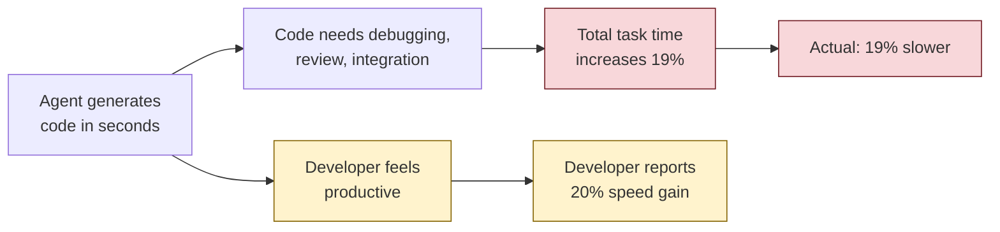
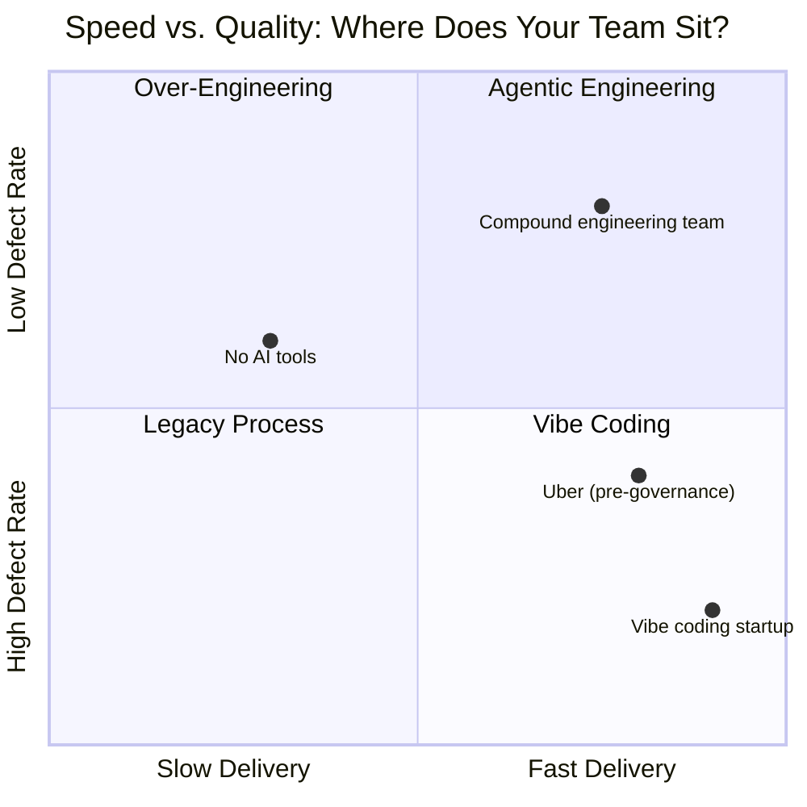
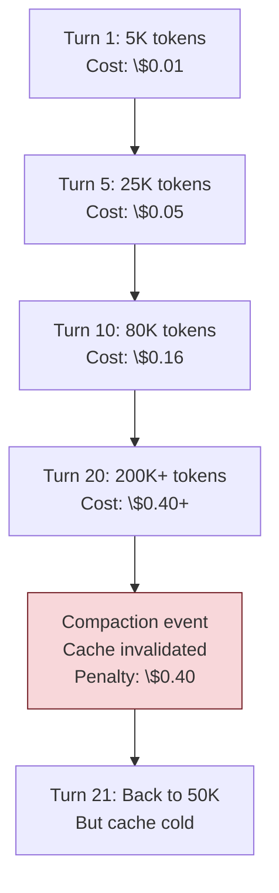
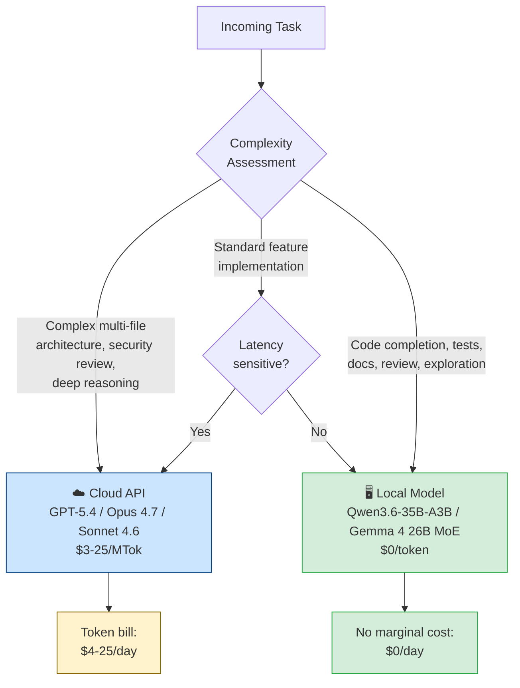
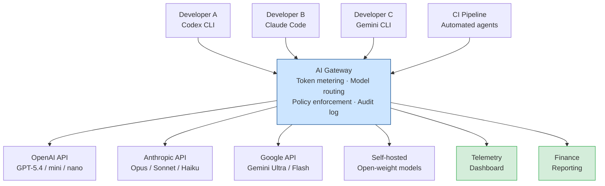

> **The Agentic Engineering Series** — From experiment to enterprise. This is article 11 of 13.
> *This article makes the business case — token economics, ROI measurement, and the governance that prevents budget surprises.*
> [Previous: Context Compaction and Memory](/premium/10-context-compaction-and-memory/) | [Next: The Scaling Playbook](/premium/12-the-scaling-playbook/) | [Series overview](#series)

> **Series context:** This is article 11 of 13 in *From Experiment to Factory*. The factory is built, secured, and running efficiently. This article is **The Business Case** — proving value in the language of token economics, ROI measurement, and governance frameworks. Without this, the factory remains an engineering experiment; with it, the factory earns its place on the enterprise balance sheet.

# Token Economics: Measuring the Real ROI of Coding Agents

In April 2026, Uber's CTO Praveen Neppalli Naga told The Information that the company had burned through its entire annual AI budget just months into the year.[^1] The cause was not a runaway experiment or an infrastructure failure. It was success. Uber had given 5,000 engineers access to Claude Code in December 2024. By February 2026, adoption had surged from 32% to 63%. By April, the budget was gone. "I'm back to the drawing board," Naga said, "because the budget I thought I would need is blown away already."[^2]

Uber spends \$3.4 billion annually on R&D.[^3] Its engineers work across 70+ countries on some of the most complex distributed systems in production, rider-driver matching, dynamic pricing, real-time dispatch. These are exactly the workloads that consume the most tokens: large codebases, deep context windows, multi-step reasoning chains. At enterprise API pricing, Claude Code runs \$100 to \$200 per developer per month on Sonnet alone.[^4] Multiply that across thousands of engineers running agentic workflows that spawn sub-agents, each maintaining their own context windows, and the math compounds fast.

This is not a story about Uber doing something wrong. It is a story about what happens when a tool delivers genuine value faster than an organisation can measure it. Uber was caught in the transition that every enterprise now faces: the shift from **Experimental AI**, "look at what this can do!", to **Economic AI**, "how do we make this sustainable and profitable?"

As ISG Principal Analyst Manoj Chandra Jha frames it, **token economics** is the science of ensuring that what you pay per token does not exceed the value it creates.[^1b] That framing redefines the conversation. The question is no longer whether to adopt AI coding agents. The question is whether you can treat tokens as a currency, with budgets, routing, governance, and measurable returns, the same way you treat compute, storage, and developer hours.

This article is the framework for making that transition.

## The Measurement Problem

The fundamental challenge of AI coding tool economics is that the cost model and the value model operate on completely different axes.

**Costs are concrete and immediate.** Every API call generates a token count. Every token has a price. Anthropic charges \$3 per million input tokens and \$15 per million output tokens for Sonnet 4.6; \$5/\$25 for Opus 4.7 (unchanged from Opus 4.6).[^5] OpenAI charges \$2/\$8 per million tokens for GPT-5.4.[^6] These are precise, auditable, and available in real time.

**Value is diffuse and delayed.** A developer who uses an agent to refactor a service might save two hours of manual work. But did that time translate into shipping a feature sooner? Did the feature generate revenue? Did the refactoring prevent a future incident? The causal chain from "tokens consumed" to "business value delivered" has too many links for simple attribution.

This asymmetry is why Uber's budget blew up. Finance teams can model \$6 per developer per day.[^7] They cannot model "our matching algorithm ships two sprints earlier because an agent handled the boilerplate." The cost is a line item. The value is a counterfactual.

Dr. Rama Srinivasan, commenting on the Uber situation, put it precisely: this is fundamentally a measurement problem, not a cost problem. Organisations need to tie usage to value.[^8]

## The Productivity Paradox

Before you can measure ROI, you must confront an uncomfortable finding.

In a randomised controlled trial conducted by METR between February and June 2025, sixteen experienced open-source developers were given real tasks from their own repositories. Those who used AI tools took **19% longer** to complete their work than those who did not.[^9]

The perception gap is the real story. Before the study, developers predicted AI would make them 24% faster. After experiencing the slowdown, they *still* believed AI had sped them up by 20%. That is a 39-percentage-point gap between reality and belief.[^9]

The mechanism is straightforward. Code generation triggers an immediate sense of progress, the screen fills with plausible-looking output in seconds. But the code still needs debugging, review, integration, and testing. The generation was fast; the total task was not. Felt velocity increased. Measured velocity decreased.



This is not an argument against AI coding tools. It is an argument against naive measurement. The METR researchers noted that by early 2026, participants likely *were* seeing genuine speed-ups as tools improved.[^9] And GitHub's own controlled experiments show Copilot users completing an HTTP server task 55% faster.[^10] The difference is in *how* the tools are used. Developers who treat agent output as a first draft to be verified perform differently from those who accept it wholesale.

The agentic engineering framework, 40% planning, 10% execution, 40% review, 10% knowledge codification, exists precisely to close this gap.[^11] The compound engineering model does not optimise for generation speed. It optimises for *delivery* speed, which includes all the verification work that naive adoption skips. (See [Article 01: Agentic Engineering Is Not Vibe Coding](/premium/01-agentic-engineering-is-not-vibe-coding/) for the full framework.)

The implication for ROI measurement is direct: if you measure "lines generated per hour," you will conclude that agents are wildly productive. If you measure "features shipped per sprint with fewer than N defects," you will get a very different, and far more useful, answer.

## The Token Cost Landscape

Understanding token economics requires understanding that AI coding tools use fundamentally different pricing models, and the choice between them changes the maths dramatically.

### Subscription vs. Token-Based Pricing

| Model | How It Works | Who Benefits |
|-------|-------------|-------------|
| **Subscription** (ChatGPT Plus, Claude Pro) | Fixed monthly fee (\$20), rate-limited usage | Light users, predictable budgets |
| **Tiered subscription** (Claude Max, ChatGPT Pro) | Higher fee (\$100-200/mo), higher limits | Power users who hit rate limits |
| **API pay-as-you-go** | Per-token billing, no rate limits | Teams needing predictable per-task costs |
| **Enterprise seat** (Claude Premium, Copilot Enterprise) | Per-seat fee (\$100-125/mo) + usage | Organisations needing admin controls |

The critical insight is that subscription models hide token economics. A developer on Claude Max at \$200/month has no visibility into whether they consumed \$50 or \$500 worth of tokens. The budget is predictable, but the *efficiency* is invisible. API billing exposes every token, which makes optimisation possible but budgeting harder.

### Real-World Cost Per Developer

Across enterprise deployments in early 2026, the data converges on these ranges:[^4][^6]

| Usage Level | Tokens/Day | Cost/Day (API) | Monthly (API) | Subscription Equivalent |
|-------------|-----------|----------------|---------------|------------------------|
| Light (reviews, docs) | 50-150K | \$1-3 | \$20-60 | Claude Pro (\$20) |
| Moderate (feature work) | 300-600K | \$4-8 | \$80-160 | Claude Max 5x (\$100) |
| Heavy (multi-agent, complex) | 1-3M | \$10-25 | \$200-500 | Claude Max 20x (\$200) + API |
| Enterprise agentic | 3-10M | \$25-80 | \$500-1,600 | API only |

The Uber figure of ~\$6/day per developer sits squarely in the moderate range.[^7] The budget crisis came not from extreme per-developer costs but from *adoption velocity*, going from 32% to 63% of 5,000 engineers doubled the aggregate bill in weeks, against an annual budget that assumed linear growth.

### Token Efficiency Varies Dramatically Between Tools

Not all agents consume tokens equally for equivalent work. Independent benchmarks show significant differences:[^12]

| Tool | Tokens for Figma-to-Code Task | Relative Efficiency |
|------|-------------------------------|-------------------|
| Codex CLI (GPT-5.4) | ~1.5M | **1x** (baseline) |
| Claude Code (Sonnet 4.6) | ~6.2M | 4.1x more |
| Cursor (mixed models) | ~8.3M | 5.5x more |

These differences compound over time. A five-engineer team running Codex CLI at \$245/month[^6] might spend \$1,000+/month achieving equivalent output on Claude Code at API rates, not because Claude Code is worse, but because its agent architecture makes different trade-offs around context retention and sub-agent spawning.

The lesson is not "choose the cheapest tool." It is that **token efficiency should be a first-class metric in your evaluation**, alongside capability, integration, and developer experience.

## A Framework for Measuring Agent ROI

The wrong way to measure agent ROI is to count lines of code generated. The right way requires a framework that connects token spend to business outcomes across four layers.

### Layer 1: Cost Accounting (The Foundation)

Before you can calculate returns, you need accurate cost data. Most organisations do not have this.

**What to track:**

- Token consumption per developer per day (input, output, cached, reasoning)
- Cost per task category (bug fix, feature, refactor, review, documentation)
- Model tier utilisation (what percentage of tokens go to expensive models vs. cheap ones)
- Waste tokens (abandoned sessions, context blown by poor prompts, unnecessary re-generation)

**How to implement with Codex CLI:**

```toml
# profiles/cost-tracking.toml
[hooks.on_agent_turn_complete]
command = """
echo "$(date -u +%Y-%m-%dT%H:%M:%SZ),${CODEX_SESSION_ID},\
${CODEX_TASK_TYPE:-unknown},${CODEX_TOKEN_COUNT_INPUT},\
${CODEX_TOKEN_COUNT_OUTPUT},${CODEX_MODEL}" >> ~/.codex/token-log.csv
"""
```

```bash
# Weekly cost summary
awk -F',' '{
  cost = ($4 * 0.000002) + ($5 * 0.000008)  # GPT-5.4 rates
  total += cost
  tasks[$3] += cost
} END {
  printf "Total: $%.2f\n", total
  for (t in tasks) printf "  %s: $%.2f\n", t, tasks[t]
}' ~/.codex/token-log.csv
```

The [security article](/premium/09-complete-guide-to-codex-security/) covers how to implement hooks as enterprise guardrails; here we use the same hook architecture for cost telemetry.

### Layer 2: Efficiency Metrics (The Bridge)

Efficiency metrics connect raw token spend to engineering outputs.

**Key ratios:**

| Metric | Formula | Target |
|--------|---------|--------|
| **Cost per merged PR** | Total tokens ÷ merged PRs | Track trend, not absolute |
| **Token waste rate** | Abandoned session tokens ÷ total tokens | < 15% |
| **Model routing efficiency** | Expensive-model tokens ÷ total tokens | < 30% |
| **First-pass acceptance rate** | PRs merged without revision ÷ total PRs | > 60% |
| **Verification overhead ratio** | Review tokens ÷ generation tokens | 0.3-0.5x |

The verification overhead ratio deserves attention. In the compound engineering model, you should be spending significant tokens on review, running parallel review agents, security scanners, test generators. A team with a 0.05x ratio is almost certainly not verifying agent output adequately. A team above 0.5x might be over-reviewing. The sweet spot reflects the 40/10/40/10 split: roughly equal investment in planning and review tokens, with execution being the smallest share.

### Layer 3: Productivity Metrics (The Value)

This is where most organisations want to start, but should not, because productivity metrics without cost accounting are meaningless. You need both.

**Metrics that matter:**

| Metric | What It Captures | Caveat |
|--------|-----------------|--------|
| **PR turnaround time** | Cycle time from open to merge | AI-generated PRs may be faster but buggier |
| **Defect escape rate** | Bugs found in production per 100 PRs | The most important quality signal |
| **Feature lead time** | Idea to production deployment | Captures full value chain |
| **Developer satisfaction** | Survey-based, quarterly | Beware the METR paradox: feelings ≠ reality |
| **Rework rate** | PRs requiring > 2 revision cycles | High rework = agent output not reviewed |

GitHub's data shows PR turnaround dropping from 9.6 days to 2.4 days with AI tools, a 75% reduction.[^10] That is dramatic. But if those faster PRs have a 3x higher defect escape rate, the net value could be negative. Always pair speed metrics with quality metrics.



### Layer 4: Business Outcomes (The Goal)

The ultimate measure of agent ROI is business impact. This is the hardest layer but the only one that justifies the budget to your CFO.

**Business-level metrics:**

- **Revenue per engineering hour**: Total revenue ÷ total engineering hours. Track the trend after agent adoption.
- **Time-to-market delta**: Compare feature delivery timelines before and after agent adoption for similar-complexity work.
- **Incident cost avoidance**: Multiply defect escape rate reduction by average incident cost. Amazon's March 2026 outage cost an estimated 6.3 million lost orders[^13], even a small reduction in such incidents dwarfs agent costs.
- **Headcount efficiency**: Not "we replaced developers" but "we shipped X with the same team size, where X previously required a larger team."

The framing matters. As Orion Szathmary noted in the Uber discussion: at \$6/day, Claude Code costs are negligible against a developer's ~\$1,000/day fully loaded cost.[^14] If an agent makes a \$1,000/day developer even 5% more effective, that is \$50/day of value against \$6/day of cost, an 8:1 return. The challenge is proving that 5%.

## From Sledgehammers to Scalpels: The Model Routing Imperative

In the early days of enterprise AI adoption, organisations used their most expensive models for everything. GPT-4 for code search. Opus for documentation. Frontier reasoning models for formatting tasks. As Jha puts it: killing flies with a sledgehammer.[^1b]

The shift from Experimental AI to Economic AI begins with a simple principle: **use the most cost-efficient model capable of each specific task.** This is model routing, and it is the single highest-leverage cost optimisation available, yet the least implemented.

### The Principle

Not every token needs to be processed by a frontier model. A code search query does not require GPT-5.4's reasoning capability. A test generation task does not need Opus 4.7's creative depth. Routing the right task to the right model can reduce costs 3-5x without measurable quality loss.[^6]

### Codex CLI Implementation

```toml
# profiles/cost-optimised.toml - Value Engineer's config
[model_routing]
# Frontier model for complex multi-file architecture
complex = { model = "gpt-5.4", reasoning_effort = "high" }

# Mid-tier for standard feature implementation
standard = { model = "gpt-5.4-mini", reasoning_effort = "medium" }

# Lightweight for search, docs, simple edits
simple = { model = "gpt-5.4-nano", reasoning_effort = "low" }

[profiles.architect]
# Context Architect: suggest mode, high reasoning for planning
model = "gpt-5.4"
approval_mode = "suggest"
reasoning_effort = "high"

[profiles.worker]
# Implementation workers: mini model, auto-edit
model = "gpt-5.4-mini"
approval_mode = "auto-edit"
reasoning_effort = "medium"

[profiles.reviewer]
# Quality Engineer: untrusted sandbox, high reasoning
model = "gpt-5.4"
approval_mode = "untrusted"
reasoning_effort = "high"
```

### The Orchestrator/Worker Pattern

The most cost-effective team architecture uses an orchestrator running a frontier model to decompose tasks, with workers running cheaper models to execute them. From Daniel's cost analysis:[^6]

| Role | Model | Sessions/Day | Cost/Day |
|------|-------|-------------|----------|
| Orchestrator | GPT-5.4 | 2-3 | \$1.68 |
| Worker (×4) | GPT-5.4-mini | 8-10 | \$0.55 each |
| **Team total** | | | **\$3.88/dev** |

At \$3.88/day versus the unoptimised \$6-13/day, model routing alone cuts costs 35-70%. For a 50-engineer organisation, that is the difference between \$11,000/month and \$27,500/month, \$198,000/year in savings from a configuration change.[^6]

This maps directly onto the Agentic Engineering Pod structure (see [Article 05: The Agentic Pod](/premium/05-the-agentic-pod/)). The Context Architect runs suggest mode with a frontier model (high reasoning, low token waste). The Value Engineer runs auto-edit with the frontier model for planning, mini for implementation workers. The Quality Engineer runs untrusted sandbox mode with a frontier model for review. Each role's Codex configuration reflects their economic function as well as their engineering function.

## Context Economics: The Hidden Cost Multiplier

The single largest source of token waste in enterprise deployments is context accumulation, and most teams do not even know it is happening.

### How Context Costs Compound

Every message in a Codex or Claude Code session carries the entire conversation history as input tokens. A session with 20 API calls does not cost 20× the price of a single call, it costs roughly **210×**, because each call sends all previous context plus the new request.[^15]



### The Compaction Tax

When a session hits the context limit, the system compacts, summarising the conversation to free space. This destroys the KV cache, forcing all tokens to be reprocessed at full price. A single compaction event on a 125K-token context costs approximately \$0.40 in cache invalidation penalty, equivalent to 21 cached follow-up turns.[^15]

Teams that manage context proactively, using subagent delegation, early manual compaction at 60% capacity, and `.codexignore` files to exclude irrelevant code, can reduce per-session costs 40-60%.[^15] (See [Article 10: Context Is All You Need](/premium/10-context-compaction-and-memory/) for the complete context management framework.)

### Practical Cost Reduction Tactics

| Tactic | Token Savings | Implementation Effort |
|--------|--------------|----------------------|
| `.codexignore` for build artifacts, deps | 40-60% input reduction | 5 minutes |
| Subagent delegation for isolated tasks | 50-70% main context savings | Moderate |
| Reasoning effort tuning (low for workers) | 50-70% reasoning token reduction | 5 minutes |
| Early manual `/compact` at 60% | 30-40% vs. auto-compact at 90% | Discipline |
| Prompt caching (iterative work on same files) | 90% on cached inputs | Automatic |
| Model routing (nano/mini for simple tasks) | 60-80% per-task cost reduction | Configuration |

Applied together, these tactics can reduce a team's token spend by 3-5x without reducing output quality. The difference between a \$27,500/month enterprise deployment and an \$8,000/month one is almost entirely in how tokens are managed, not how many tasks are attempted.

## The Subsidy Trap: When the Music Stops

There is a cost risk that most enterprise teams have not priced in: **the AI coding tools you depend on are heavily subsidised, and that subsidy can be withdrawn at any time.**

### The Economics of Flat-Rate AI

Consider Claude Code Max at \$200/month. A power user running complex agentic workflows, spawning sub-agents, maintaining deep context windows, processing large codebases, can easily consume \$2,000-5,000/month in API-equivalent compute.[^17] Anthropic absorbs the difference. Even accounting for the gap between retail API prices and actual compute costs (estimated at roughly 10:1[^18]), heavy Max users cost Anthropic real money on every session.

This is not speculation. It is the explicit business model: subsidise early adoption to build market share, then adjust pricing once developers are locked in. Every subscription-based AI tool operates on this logic. ChatGPT Plus, Cursor Pro, GitHub Copilot, all price below the API-equivalent cost of what power users consume.

### What \$200/Month Actually Buys at API Rates

To understand the scale of the subsidy, consider what a heavy Claude Code Max session costs at Anthropic's published API rates: \$3 per million input tokens and \$15 per million output tokens for Sonnet 4.6.[^5]

A typical power-user day on Claude Code involves:

| Activity | Input Tokens | Output Tokens | API Cost |
|----------|-------------|---------------|----------|
| System prompt + tool definitions (per session) | ~30K | ~0 | \$0.09 |
| 3 deep coding sessions (context accumulation) | ~600K | ~200K | \$4.80 |
| Sub-agent spawns (4-6 per session) | ~400K | ~150K | \$3.45 |
| Code review + test generation | ~200K | ~100K | \$2.10 |
| **Daily total** | **~1.2M** | **~450K** | **\$10.35** |
| **Monthly total (22 working days)** | | | **\$227.70** |

That moderate scenario lands close to the \$200/month subscription price, which is why Anthropic can sustain it for average users. But heavy users tell a different story. Developers running autonomous multi-agent workflows, processing large codebases with deep context windows, or iterating through complex architectural changes can easily push daily consumption to 3-5M input tokens and 1-2M output tokens. At API rates:

- **3M input + 1M output per day**: \$9 + \$15 = **\$24/day = \$528/month**
- **5M input + 2M output per day**: \$15 + \$30 = **\$45/day = \$990/month**
- **10M input + 3M output per day** (enterprise agentic): \$30 + \$45 = **\$75/day = \$1,650/month**

A developer consistently hitting the upper range is receiving a **\$1,450/month subsidy** on a \$200/month plan. Multiply that across a 50-engineer team and Anthropic is absorbing \$72,500/month in excess compute costs from a single customer. No business sustains that indefinitely.

### The Precedent: Subsidies Always End

The history of AI tool pricing is a graveyard of subsidised models that were repriced once adoption was secured.

**Cursor's 20x Silent Price Increase (June 2025).** In June 2025, Cursor shifted from a simple request-based model to usage-based credits.[^25] Under the old system, \$20/month bought roughly 500 fast requests. Under the new system, the same \$20 bought closer to 225 requests when using Claude models. For developers running agentic, long-context coding workflows, the effective price increase was 20x or more.[^25] Billing complaints dominated Cursor's Reddit, Trustpilot, and G2 pages for months. Some users reported exhausting their monthly allowance after just a few prompts with Anthropic's Claude models. Cursor acknowledged the communication failure and issued refunds, but the repricing stuck.

**OpenAI's "Accidental" Pricing Admission (March 2026).** In March 2026, OpenAI's VP and Head of ChatGPT, Nick Turley, publicly called their subscription pricing model "accidental" and confirmed it will "significantly evolve."[^26] Turley noted that per-user token consumption is accelerating as ChatGPT evolves from a simple chatbot into a proactive agent handling complex multi-step tasks. His exact analogy: "It's possible that in the current era, having an unlimited plan is like having an unlimited electricity plan."[^26] OpenAI has already introduced a \$100/month Pro Lite tier between Plus (\$20) and Pro (\$200), and stripped GPT-4o access from the free tier in August 2025.[^27] The direction is unmistakable: more tiers, more metering, less subsidy.

**GitHub Copilot's Premium Request Metering (2025-2026).** GitHub slashed Copilot Individual's headline price from $19 to $10/month in early 2025, but simultaneously introduced premium request limits with $0.04 per-request overages for advanced features like agent mode and premium model access.[^28] The price dropped; the effective cost for power users rose. This is the classic subsidy withdrawal pattern: lower the visible price, meter the actual usage.

**The OpenClaw Shock (April 2026).** On 4 April 2026, Anthropic announced that Claude Pro and Max subscriptions would no longer cover usage through third-party agent frameworks, starting with OpenClaw.[^19] The change was immediate, no grace period, no phased rollout. Over 135,000 OpenClaw instances were running at the time. The price gap between what heavy users paid under flat subscriptions and what equivalent API usage would cost was more than 5x.[^19] Monthly bills jumped from \$20 to \$500+ overnight, a 25x increase.[^20] OpenClaw's creator called it "a betrayal of open-source developers."[^19] But from Anthropic's perspective, a single autonomous OpenClaw instance running for a full day could consume \$1,000-5,000 in API-equivalent compute against a \$200/month subscription.[^19]

### The Enterprise Risk: Budgets Built on Sand

The pattern across all four precedents is identical: introduce subsidised pricing to drive adoption, then reprice once users are locked in. Enterprise teams building their AI budgets on subscription pricing are constructing their cost models on someone else's marketing decision.

The specific risks for enterprise teams:

1. **Sudden repricing.** As the OpenClaw precedent showed, pricing changes can be announced and enforced within days. There is no contractual guarantee that Claude Code Max will remain at $200/month, or that its usage limits will not be tightened.

2. **Metering shifts.** Following Cursor's playbook, providers can keep the headline subscription price constant while changing what counts against your quota. A "5x usage" plan today might cover half as much work tomorrow if the definition of a "request" changes.

3. **Tier proliferation.** OpenAI's trajectory, Free, Go, Plus, Pro Lite, Pro, Business, Enterprise, shows how providers segment users into ever-finer tiers, extracting more revenue from power users while maintaining the appearance of affordable entry-level pricing.

4. **API fallback costs.** If subscription plans are withdrawn or repriced beyond budget, the fallback is API pricing. For a 50-engineer team averaging 1.5M tokens/day per developer, the API fallback cost is approximately **$16.50/day per developer = $363/month per developer = $217,800/year**, compared to $120,000/year at current Max subscription rates. That is an 80% budget increase with zero change in usage.

The lesson for enterprise teams is not that any specific provider acted unfairly. It is that **any pricing model where your usage exceeds your payment is a subsidy, and subsidies end.** The question is not *whether* your flat-rate plan will be repriced, it is *when*, and whether your budget model survives the transition.

The prudent response is not to avoid subscriptions, they remain excellent value while they last. The prudent response is to **build your financial model on API rates, treat subscriptions as a discount, and invest in the local model safety net described in the next section** so that when the music stops, your team keeps coding.

## The Local Model Safety Net

When cloud pricing is high, when subsidies are withdrawn, or when privacy requirements prohibit sending code off-network, local models are not a hobbyist curiosity, they are a critical component of enterprise cost resilience.

### Why Local Models Matter Now

The subsidy trap described above creates a binary dependency: your team either pays what the cloud provider charges, or stops working. Local models break that dependency. They provide a **floor of capability that costs nothing per token** after the initial hardware investment, a safety net that ensures your engineers can keep shipping code regardless of what happens to cloud pricing.

This was not viable twelve months ago. Before April 2026, open-weight models were dramatically inferior to cloud models for agentic coding tasks. Gemma 3's tool-calling benchmark score was a dismal 6.6% on τ2-bench, effectively useless for driving a coding CLI.[^21] The gap between open and closed models was so wide that local inference was relegated to toy experiments.

Google's Gemma 4 family changed the calculus. Released on 2 April 2026 under the Apache 2.0 licence, Gemma 4 is the first open-weight model family with genuinely competitive agentic tool-calling capabilities.[^21] The 26B Mixture-of-Experts variant scores 85.5% on τ2-bench with only 3.8 billion active parameters, meaning it runs on consumer hardware while delivering 97% of the flagship 31B Dense model's agentic capability. The 31B Dense scores 86.4%, competitive with cloud models on structured tool-calling tasks.[^21]

For a detailed walkthrough of running Gemma 4 locally with Codex CLI, including exact configuration, benchmarks, and known limitations, see ["Running Gemma 4 as a Local Model in the Codex CLI Harness"](../articles/2026-04-10-gemma-4-local-model-codex-cli.md) and the [comparison with Claude Code's local model support](../articles/2026-04-12-gemma-4-codex-cli-vs-claude-code-local-model-comparison.md).

**Qwen3.6-35B-A3B is the strongest evidence yet that local models are viable for production agentic work.** Released under the Apache 2.0 licence, this Mixture-of-Experts model has 35 billion total parameters but activates only 3 billion at inference time — just 8.6% activation — meaning it runs at speeds comparable to a 3B dense model while delivering frontier-class results.[^30] On SWE-bench Verified, the standard benchmark for autonomous coding agents, Qwen3.6-35B-A3B scores **73.4**, nearly matching its dense 27B sibling (75.0) and massively outperforming Gemma 4's 31B Dense (52.0 on SWE-bench) and Gemma 4's 26B MoE (17.4 on SWE-bench).[^30] On Terminal-Bench 2.0, a benchmark specifically measuring terminal-based agentic coding, it scores **51.5**, actually *exceeding* the dense Qwen 27B model's 41.6.[^30] Its MCPMark score of 37.0 dwarfs Gemma 4 31B's 18.1, confirming dramatically superior tool-calling reliability for MCP-based workflows.[^30]

What makes this transformative for cost economics is the hardware requirement. With Q4 quantization, the model compresses to approximately 18-20 GB, fitting comfortably on any machine with 24 GB of VRAM — or on an M5 Pro Mac with 36 GB of unified memory with room to spare for the operating system, editor, and tooling.[^30] The 256K native context window (extensible to 1M) means it can handle substantial codebases without truncation. It supports tool calling, MCP integration, and multi-token prediction for speculative decoding, and ships with a dedicated terminal coding agent called Qwen Code.[^30]

The cost implication is stark: **73.4 on SWE-bench Verified, at \$0 per token, running locally at 3B-model speeds.** That is frontier-class autonomous coding performance — the kind of score that would have been headline news from a cloud provider twelve months ago — running on a developer's laptop.

### The Hardware: What to Buy

The hardware required to run competitive local models has reached a tipping point where the investment pays for itself within months.

| Hardware | Price | Unified Memory | Memory Bandwidth | Local Model Capacity | Use Case |
|----------|-------|---------------|-----------------|---------------------|----------|
| **MacBook Pro M5 Pro (14")** | From $2,199 | Up to 64 GB | 307 GB/s | Gemma 4 26B MoE or Qwen3.6-35B-A3B (Q4) comfortably | Developer workstation |
| **MacBook Pro M5 Pro (16")** | From $2,699 | Up to 64 GB | 307 GB/s | Qwen3.6-35B-A3B (Q4) + editor + tools | Developer workstation |
| **Mac Studio M5 Max** | ~$4,500 | Up to 128 GB | 546 GB/s | Gemma 4 31B Dense, Qwen3.6-35B-A3B (FP16), multiple models | Team inference server |
| **Dell Pro Max GB10** | ~$3,500 | 128 GB unified | ~273 GB/s | 200B parameter models | Enterprise AI workstation |
| **2x Dell GB10 (linked)** | ~$7,000 | 256 GB unified | ~546 GB/s | 400B+ parameter models | On-premise inference cluster |

**The Apple M5 Pro** deserves special attention. Apple's March 2026 refresh embedded a Neural Accelerator inside every GPU core rather than maintaining a single centralised unit, delivering up to 4x faster LLM prompt processing than the M4 Pro.[^22] With 307 GB/s memory bandwidth and up to 64 GB of unified memory, it runs Gemma 4 26B MoE at approximately 7 tokens/second via Metal offloading, not cloud-speed, but genuinely usable for focused coding sessions.[^21] Qwen3.6-35B-A3B at Q4 quantization (~18-20 GB) fits on the 36 GB configuration with room to spare, and because only 3B parameters are active per forward pass, inference speed is comparable to running a 3B dense model — significantly faster than Gemma 4 26B MoE while delivering dramatically better SWE-bench scores (73.4 vs. 17.4).[^30] The 14-inch model starts at $2,199, making it accessible as a standard developer workstation that happens to double as a local inference machine.

**The Dell Pro Max GB10** takes a different approach: NVIDIA Grace Blackwell architecture with 128 GB of unified memory and 1,000 FP4 TOPS, capable of loading a 200-billion parameter model entirely into memory.[^23] At ~$3,500, it costs less than three months of a heavy Claude Code API habit. Testing with Codex CLI showed the GB10 running the 31B Dense model completed a benchmark task in just 3 clean tool calls, compared to 10 messy calls on the Mac's 26B MoE, demonstrating that for agentic coding, model quality matters more than raw token generation speed.[^29]

For teams that need more capacity, two Dell GB10 units can be linked for 256 GB of unified memory, enough to run 400B+ parameter models locally. This creates an on-premise inference cluster competitive with cloud offerings for all but the most demanding frontier tasks.

### What Local Models Handle Well

Local models are not a replacement for cloud APIs for everything. They are a **cost-reduction layer for specific, high-volume workloads** that do not require frontier reasoning. That said, Qwen3.6-35B-A3B's 73.4 on SWE-bench Verified blurs this boundary — a local model scoring within striking distance of frontier cloud models can handle substantially more complex tasks than was previously assumed for the local tier:

**Code completion and generation.** Gemma 4 26B scores 77.1% on LiveCodeBench[^21], competitive with much larger cloud models for routine coding tasks. Boilerplate generation, implementing well-defined interfaces, writing CRUD operations, and filling in standard patterns are all tasks where local inference produces equivalent quality at zero marginal cost.

**Code review assistance.** Running a local model as a first-pass reviewer catches formatting issues, obvious bugs, naming convention violations, and missing edge cases before code reaches a human reviewer or an expensive cloud-based security scan. The model does not need to be perfect — it needs to catch the straightforward majority so human reviewers can focus on the genuinely hard issues.

**Test generation.** Unit tests, integration test scaffolding, and test data generation are high-volume, pattern-driven tasks. A local model generating test cases at zero cost means teams can afford to generate far more tests than they would at $3-15/MTok cloud rates. Even if a significant fraction of generated tests need manual adjustment, the net productivity gain is substantial.

**Documentation.** API documentation, code comments, README updates, changelog entries, these are high-token, low-complexity tasks where local models excel. Documentation is also the task most likely to be deferred when every generation costs money. At zero marginal cost, teams document more.

**Exploratory coding and research.** When a developer is experimenting with an approach, "would this architecture work?", they may iterate through dozens of prompts before settling on a direction. At cloud API rates, exploration is expensive. Locally, it is free, which means developers explore more and make better architectural decisions.

### The Hybrid Stack: Frontier Cloud + Local Volume

The optimal cost architecture is not "cloud or local", it is a **hybrid stack** that routes tasks to the most cost-efficient execution layer:



**Run locally when:**

- Simple code generation, formatting, documentation
- Privacy-sensitive work that cannot leave the network
- Test generation and review assistance (high-volume, pattern-driven)
- Focused single-task sessions (Gemma 4 is reliable for 3-4 chained tool calls[^21]; Qwen3.6-35B-A3B supports extended tool-calling chains via MCP[^30])
- Weekend/evening work where latency tolerance is higher
- CI/CD tasks where each run is a cost event at API rates
- Exploratory coding where iteration count is unpredictable

**Stay on cloud when:**

- Complex multi-file architecture requiring deep reasoning
- Long autonomous sessions beyond 4-5 chained operations
- Production CI/CD where reliability matters more than cost
- Tasks requiring frontier model capabilities (security review, complex refactoring)
- Large codebase exploration requiring very deep context (though Qwen3.6-35B-A3B's 256K native window, extensible to 1M, narrows this gap)

### The Cost Comparison: Hardware vs. Cloud

The economic case is built on a simple comparison: **hardware is a one-time cost; cloud tokens are a recurring cost.**

| Scenario | Cloud API Cost (Monthly) | Local Cost (Monthly) | Break-Even |
|----------|------------------------|---------------------|------------|
| Solo developer, moderate usage | $227/mo (API) or $200/mo (Max) | $0 after hardware | M5 Pro: 10-14 months |
| Solo developer, heavy usage | $528-990/mo (API) | $0 after hardware | M5 Pro: 3-6 months |
| 5-engineer team, mixed usage | $2,500-5,000/mo (API) | $0 after hardware | GB10 shared server: 1-2 months |
| 50-engineer team, 30% local offload | Saves $5,000-10,000/mo | 10x M5 Pros: $22,000 once | 2-4 months |

A MacBook Pro M5 Pro at $2,199 pays for itself in 5-10 months if it displaces even 30% of a developer's cloud API usage from the $13/day enterprise average. A Dell GB10 serving a team of five as a shared inference server pays for itself in 1-2 months at heavy usage rates. And critically, **hardware costs do not increase when your team adopts the tool faster than expected**, which, as Uber demonstrated, is the real budget risk.

After the break-even point, every token generated locally is pure savings. A team that runs 40% of its workload locally for two years after break-even saves the equivalent of 16-20 months of cloud API costs, enough to fund the next hardware upgrade and still come out ahead.

### Configuring the Hybrid Stack

For teams running Codex CLI, the hybrid stack is a configuration change, not an architecture change:

```toml
# ~/.codex/config.toml - Hybrid local + cloud profiles

[model_providers.local_mac]
name = "Local (M5 Pro + llama.cpp)"
base_url = "http://localhost:8089/v1"

[model_providers.local_gb10]
name = "Local (Dell GB10 + Ollama)"
base_url = "http://gb10-server.local:11434/v1"

[profiles.local]
model = "qwen3.6-35b-a3b"
model_provider = "local_mac"
web_search = "disabled"

[profiles.local_gemma]
model = "gemma-4-26b"
model_provider = "local_mac"
web_search = "disabled"

[profiles.cloud]
model = "gpt-5.4"
reasoning_effort = "high"

[profiles.review]
model = "gpt-5.4"
approval_mode = "untrusted"
reasoning_effort = "high"
```

```bash
# Routine coding: local, zero cost
codex --profile local "Add pagination to the user list endpoint"

# Complex architecture: cloud, frontier reasoning
codex --profile cloud "Refactor the payment service to support multi-currency"

# Security review: cloud, high reasoning, sandboxed
codex --profile review "Review the authentication middleware for vulnerabilities"
```

For teams running the Agentic Pod model (see [Article 05](/premium/05-the-agentic-pod/)), the natural split is: the **Value Engineer** runs implementation workers on local models for routine coding, reserving cloud API budget for the **Context Architect's** planning sessions and the **Quality Engineer's** security reviews where frontier model capability matters most.

The local model safety net does not eliminate cloud dependency. It **reduces it to the tasks where cloud models genuinely earn their cost**, and ensures that when the next pricing change arrives, your team has a floor of capability that no provider can reprice.

## The \$1,000/Month Myth: Why High Spend Signals Poor Workflow, Not Professional Usage

Everything above, model routing, context management, local inference, subscription arithmetic, converges on a conclusion that contradicts one of the loudest narratives in the AI developer community. That narrative says: if you are not spending \$1,000 or more per month on AI tools, you are not really using them. The data says the opposite. Spending \$1,000+ per month on AI coding tools is not a badge of professional usage. It is a red flag for workflow problems.

### The Spending Narrative Problem

In April 2026, Neil Dave posted on LinkedIn: "Unpopular opinion: if you're not spending \$1,000+/month on AI — you're not actually using it."[^24] The post is representative of a growing genre: influencer-driven spending benchmarks that treat token consumption as a proxy for sophistication.

This framing is not just wrong, it is actively harmful. It creates a false cost barrier that discourages the very adoption it claims to champion. Every post like it reaches a manager calculating headcount budgets, a solo developer weighing whether to start, or an enterprise leader deciding whether to pilot AI tools at all. When the implied minimum is \$1,000 per month per developer, the rational response for most organisations is not adoption, it is delay. The narrative does not signal expertise. It signals an absence of the engineering discipline this series has spent ten articles building.

### The Professional Reality

Consider a concrete counterexample. A professional solo developer running three to five complex projects simultaneously, with 100% AI-generated code, using the best available models at their highest effort settings. Their monthly stack:

- **Anthropic Max plan (5x)**: \$200/month for Claude Code with deep reasoning and architecture work
- **Codex CLI Pro (5x)**: \$100/month for autonomous execution, CI/CD integration, and parallel task running

Total: \$300 per month. And here is the critical detail, this developer rarely hits even 60% of their 5-day rolling quota on either tool.

How is that possible? Because they have built what the compound engineering model prescribes (see [Article 01](/premium/01-agentic-engineering-is-not-vibe-coding/)): a disciplined pipeline with deterministic and inferred quality checks at every stage. The 40/10/40 split, 40% planning, 10% execution, 40% review, means that the expensive part (frontier model execution) is only 10% of the workflow. Planning is token-cheap: it is structured prompts, architecture documents, and context assembly. Review can be largely automated through linting, type checking, test suites, and secondary model validation. The execution phase, where frontier models earn their cost, is a narrow, well-scoped slice of the total effort.

The developer who understands this does not need \$1,000 per month. They need \$200-300 and a well-engineered pipeline.

### Why \$1,000+/Month Is a Red Flag

When a developer consistently spends \$1,000 or more per month on AI coding tools, the spending pattern reveals specific workflow failures, each of which maps to a problem addressed earlier in this article:

**No model routing.** They are using frontier models for everything: documentation, simple refactoring, boilerplate generation, exploration. As the model routing section above demonstrated, defaulting to Sonnet or Opus for tasks that Haiku or a local model handles equally well inflates costs 4-10x with no quality improvement.

**No context management.** Sessions are bloating unchecked. There is no `.codexignore` filtering irrelevant files from context. There is no early compaction discipline (see [Article 10](/premium/10-context-compaction-and-memory/)). Conversation history accumulates exponentially, and every follow-up message pays the tax on the entire session. A developer spending $1,000/month is likely re-sending hundreds of thousands of tokens per session that contribute nothing to output quality.

**No local inference layer.** Routine edits, documentation passes, simple code generation, and exploratory research are all hitting cloud APIs at full price. As the previous section showed, a MacBook Pro M5 Pro running Qwen3.6-35B-A3B or Gemma 4 handles these tasks at zero marginal cost — and with Qwen3.6 scoring 73.4 on SWE-bench Verified, the range of tasks that qualify as "local-viable" has expanded dramatically. Not having a local layer is like paying for a taxi for every trip including the ones across the street.

**No pipeline discipline.** They are accepting first-pass output from the model and iterating through conversation rather than structured quality gates. Each "fix this" follow-up in a long session costs more than a fresh, well-prompted session with proper context. The compound engineering workflow eliminates this pattern by front-loading planning and automating review, so execution sessions are short, focused, and cheap.

In short, \$1,000/month does not buy better code. It buys the absence of the practices that make AI coding tools efficient.

### The Smart Developer's Stack

Here is what a professional-grade monthly budget actually looks like when workflow engineering is in place:

| Component | Monthly Cost | Purpose |
|-----------|-------------|---------|
| Claude Code Max 5x | \$100 | Deep reasoning, architecture, complex refactoring |
| Codex CLI Pro 5x | \$100 | Execution, CI/CD, autonomous tasks |
| Gemini CLI | \$0 | Exploration, research, free tier |
| Local models (Qwen3.6-35B-A3B / Gemma 4 on M5 Pro) | \$0 marginal | Routine edits, docs, generation, and now SWE-bench-class agentic tasks |
| OpenRouter overflow | \$0-50 | API flexibility when needed |
| **Total** | **\$200-250** | **Full professional coverage** |

Compare this to the naive approach that produces the \$1,000+ spend: a single tool at Max 20x (\$200/month) plus uncontrolled API overflow (\$800+) when the subscription quota runs out. The naive approach costs 4-5x more *and delivers worse outcomes*, because there is no cross-model review catching tool-specific blind spots (see [Article 06](/premium/06-three-terminals-three-fates/)), no local layer providing instant feedback loops, and no routing logic matching task complexity to model capability.

The \$200-250 stack is not a compromise. It is what disciplined engineering looks like when applied to AI tool economics.

### The Adoption Imperative

The damage from the "\$1,000/month minimum" narrative extends beyond individual budgets. It poisons enterprise adoption decisions at scale.

When a team lead hears "\$1,000 per developer per month," the arithmetic for a 50-person team is \$50,000/month, \$600,000 per year. That number kills pilot programmes before they start. It gives ammunition to every sceptic in the budget meeting. It makes AI coding tools sound like a luxury that only well-funded startups or big tech can afford.

The reality with smart routing: \$200-250 per developer per month for a 50-person team is \$10,000-12,500/month, \$120,000-150,000 per year. That is 4-5x less than the scary narrative implies. Against the ROI numbers in the next section (conservative 15:1 returns), it is a much more straightforward business case.

The question the AI developer community should be asking is not "how much are you spending?" but "how efficiently are you spending?" Do we want AI adoption, the kind that transforms how software is built across the entire industry, or do we want a gatekeeping narrative where people walk away thinking "I don't have that kind of money, why bother?"

Every article in this series has been built on the premise that agentic engineering is a discipline, not a spending category. The compound engineering workflow, context management, model routing, cross-model review, and local inference, these are engineering practices that make AI tools *more* effective at *lower* cost. The \$1,000/month myth gets this exactly backwards. If you are spending over \$1,000 per month on AI coding tools, you do not need a bigger budget. You need to study the practices in this series, because you are likely giving away money you do not need to spend.

## Building the Business Case

When you walk into a budget meeting to justify agent spend, here is the argument structure that works.

### The Cost Side (What You Can Prove)

1. **Per-developer daily cost**: \$4-13/day at current utilisation (cite your own telemetry)
2. **Annual team cost**: Multiply by headcount and working days
3. **Cost trajectory**: Show the adoption curve and project forward (this is what caught Uber off guard)
4. **Optimisation potential**: Show what model routing and context management would save

### The Value Side (What You Can Demonstrate)

1. **Cycle time reduction**: Before/after PR turnaround times (GitHub's data shows 75% reduction[^10])
2. **Defect rate change**: Before/after production incident rates
3. **Developer satisfaction**: Survey data (but flag the METR paradox)
4. **Capacity unlock**: Work that would not have been attempted without agents (refactoring, test coverage, documentation)

### The Risk Side (What You Must Address)

1. **Budget unpredictability**: The Uber scenario, what happens when adoption exceeds projections?
   - *Mitigation*: Per-session token limits, tiered access, model routing policies
2. **The productivity paradox**: What if we're spending more but not actually delivering faster?
   - *Mitigation*: Compound engineering methodology, paired speed+quality metrics
3. **Vendor lock-in**: What happens when token prices change?
   - *Mitigation*: Multi-tool strategy (Codex CLI + Claude Code), open-source alternatives (Gemini CLI)
4. **Security and compliance**: AI-generated code in regulated environments
   - *Mitigation*: Enterprise guardrails architecture (see [Article 09: Security](/premium/09-complete-guide-to-codex-security/))

### The ROI Calculation

```text
Annual agent cost = developers × cost/day × 250 working days
Annual value = (cycle time savings × hourly rate × developers)
             + (defect reduction × avg incident cost)
             + (capacity unlock value)

ROI = (Annual value - Annual cost) / Annual cost × 100
```

**Worked example for a 50-engineer team:**

| Line Item | Conservative | Optimistic |
|-----------|-------------|-----------|
| Annual agent cost (optimised) | \$96,000 | \$96,000 |
| Cycle time savings (10-25% faster) | \$625,000 | \$1,562,500 |
| Defect cost avoidance (20-40% reduction) | \$200,000 | \$400,000 |
| Capacity unlock (equivalent of 5-10 FTEs) | \$750,000 | \$1,500,000 |
| **Net value** | **\$1,479,000** | **\$3,366,500** |
| **ROI** | **1,540%** | **3,507%** |

Even the conservative estimate shows a 15:1 return. But these scenarios assume the productivity gains reported by early adopters (10-25%) hold at scale. If we assume productivity gains are only 2-3%, as the METR study suggests early-stage adoption may deliver[^9], the return is still approximately 3:1, a figure any CFO would approve. The business case does not depend on the optimistic numbers being right. It depends on the pessimistic numbers being positive, and they are.

The challenge is not whether agents are worth the cost, at \$4-13/day against \$1,000/day developer costs, the maths is overwhelmingly favourable. The challenge is proving it with data your CFO will accept.

## Enterprise Governance: Preventing the Uber Scenario

Uber's budget crisis was not caused by profligate spending. It was caused by the absence of a governance layer between adoption and expenditure. Here is what that layer looks like.

### Budget Controls

```toml
# requirements.toml - Enterprise cost governance
[cost_controls]
# Per-session token ceiling
max_tokens_per_session = 500000

# Daily per-developer ceiling
max_tokens_per_day = 3000000

# Alert threshold (warn at 80%)
alert_threshold_percent = 80

# Escalation: block usage above daily ceiling without manager approval
require_approval_above_daily_limit = true

[model_access]
# Default to cost-efficient model
default_model = "gpt-5.4-mini"

# Frontier model requires justification
frontier_models = ["gpt-5.4", "o4-mini"]
frontier_access = "request"  # Options: open, request, restricted
```

### Consumption Tiers

Neal Bhattacharya's governance framework, discussed in the Uber commentary, recommends three strategies:[^16]

1. **Consumption policies with escalation triggers**: Set per-developer daily limits. When a developer hits 80%, they get a warning. At 100%, usage pauses until the next day or a manager approves an override. This prevents runaway sessions while preserving developer autonomy for normal work.

2. **Workflow-aware model routing**: Route simple tasks (code search, documentation, formatting) to Haiku/nano models at \$0.25-1/MTok. Route standard implementation to Sonnet/mini at \$3-4/MTok. Reserve frontier models (Opus/GPT-5.4) for complex architecture and security review at \$5-8/MTok. This alone reduces costs 3-5x.

3. **Real-time telemetry dashboards**: Engineers and managers should see token consumption in real time, broken down by task type, model tier, and project. Visibility changes behaviour. When developers can see that their debugging session just consumed \$15 of Opus tokens, they learn to reach for cheaper models for simpler questions.

### The Quarterly Review Cadence

| Review | Frequency | Audience | Focus |
|--------|-----------|----------|-------|
| **Token telemetry** | Weekly | Engineering leads | Cost per team, anomaly detection |
| **Efficiency metrics** | Bi-weekly | Engineering + Finance | Cost per PR, model routing rates |
| **Productivity impact** | Monthly | VP Engineering | Cycle time, defect rates, capacity |
| **Business ROI** | Quarterly | C-suite + Finance | Revenue attribution, budget forecast |

### The AI Gateway: Centralised Control, Decentralised Execution

Instead of every developer managing their own subscriptions and API keys to different providers, mature enterprises are building a centralised **AI Gateway**, a single infrastructure layer through which all agent traffic flows.[^1b]

The gateway provides three capabilities that individual subscriptions cannot:

1. **Real-time spend visibility**: Every token consumed by every developer on every project is logged, attributed, and dashboarded. No more discovering in April that the annual budget is gone.

2. **Provider-agnostic routing**: When Anthropic raises Opus prices or OpenAI launches a cheaper model, the gateway switches routing without any developer changing their workflow. This is the antidote to vendor lock-in, and it is why supporting multiple tools (Codex CLI, Claude Code, Gemini CLI) through a common gateway matters more than choosing one winner.

3. **Policy enforcement at the infrastructure layer**: Token limits, model access tiers, and security controls are enforced by the gateway, not by individual developer discipline. This is the same principle behind the enterprise guardrails architecture in [Article 09](/premium/09-complete-guide-to-codex-security/): structural enforcement beats aspirational guidelines.



The gateway transforms token economics from a developer-level concern into an infrastructure concern, which is exactly where cost governance belongs in any mature engineering organisation.

## What Uber Should Have Done (And What You Should Do)

The Uber story is instructive not as a failure but as a preview. Every enterprise adopting AI coding tools at scale will face the same adoption curve. The question is whether your governance keeps pace with your engineers' enthusiasm.

**Before broad rollout:**

1. Instrument cost telemetry from day one, per-developer, per-task, per-model
2. Set consumption tiers with escalation, not hard blocks
3. Configure model routing policies that default to cost-efficient models
4. Establish baseline productivity metrics (cycle time, defect rate, feature lead time)

**During scaling:**
5. Track the adoption curve weekly, if it goes exponential, your budget model is already wrong
6. Run monthly efficiency reviews, are tokens being spent on valuable work?
7. Pair every speed metric with a quality metric
8. Invest in context management training (`.codexignore`, subagent patterns, compaction discipline)

**At maturity:**
9. Build the business case from telemetry, not assumptions
10. Present ROI at the quarterly board level with the four-layer framework
11. Negotiate volume pricing with vendors based on actual consumption data
12. Open-source your cost governance tooling to attract talent who want to work this way

The enterprise that treats token economics as a first-class engineering concern, not an afterthought managed by finance, will be the one that scales AI coding tools without Uber's budget surprise. And the developers who understand their own token economics will be the ones whose agents actually deliver on the productivity promise, because they will know the difference between felt velocity and measured value.

## Key Takeaways

1. **The Uber precedent is universal**: Any enterprise giving thousands of engineers access to AI coding tools will face exponential adoption curves that break annual budgets. Plan for it.

2. **The productivity paradox is real**: METR's study found developers are 19% slower with AI tools despite *feeling* 20% faster. Compound engineering methodology closes this gap by investing 80% of effort in planning and review.

3. **Token efficiency varies 4-5x between tools**: Codex CLI uses roughly 4x fewer tokens than Claude Code for equivalent tasks. This is not a quality judgement, it is a cost variable that belongs in your evaluation.

4. **Model routing is the highest-leverage optimisation**: Defaulting to mini/nano models and reserving frontier models for complex work cuts costs 35-70% with no quality loss on routine tasks.

5. **Context management is the hidden multiplier**: Conversation history accumulates exponentially. `.codexignore`, subagent delegation, and early compaction can reduce session costs 40-60%.

6. **Measure at four layers**: Cost accounting → efficiency metrics → productivity metrics → business outcomes. Skip layers and your ROI case collapses under scrutiny.

7. **The ROI is real but must be proven**: At \$4-13/day against \$1,000/day developer costs, even a 5% productivity gain returns 8:1. The challenge is measurement, not economics.

8. **Build the AI Gateway**: Centralised token metering, provider-agnostic routing, and policy enforcement at the infrastructure layer, not at the individual developer level, is how you prevent the Uber scenario while preserving developer autonomy.

9. **Subscription pricing is a subsidy with an expiry date**: The OpenClaw precedent proved it, flat-rate plans can be repriced overnight. Build your cost model on API rates, not subscription hopes.

10. **Local models are a strategic hedge, not a hobby**: Qwen3.6-35B-A3B scores 73.4 on SWE-bench Verified — frontier-class performance — while running on an M5 Pro Mac at Q4 quantization (~18-20 GB) with only 3B active parameters. A MacBook Pro M5 Pro pays for itself in 5-10 months if it displaces 30% of cloud API usage. Hardware costs do not spike when adoption exceeds projections.

11. **The transition is Experimental → Economic**: The "wow, look what AI can do" phase is over. The organisations that win in 2026 are the ones asking "how do we make this sustainable?" Token economics is the discipline that answers that question.

The business case is made. Now comes the question every enterprise faces: how do you take a proven pilot and scale it across the organisation? In [Article 12: The Scaling Playbook](/premium/12-the-scaling-playbook/), we assemble all the components from this series into a phased enterprise rollout — from first pod to factory at scale.

## The Agentic Engineering Series {#series}

From experiment to enterprise — building the factory for AI-assisted software engineering at scale.

| | Article | Role |
|---|---------|------|
| 1 | [Agentic Engineering Is Not Vibe Coding](/premium/01-agentic-engineering-is-not-vibe-coding/) | The Wake-Up Call |
| 2 | [Codex CLI at One Year](/premium/02-codex-cli-at-one-year/) | The Platform |
| 3 | [The AGENTS.md Playbook](/premium/03-the-agents-md-playbook/) | The Blueprint |
| 4 | [TDAD and the Testing Revolution](/premium/04-tdad-and-the-testing-revolution/) | The Quality Gate |
| 5 | [The Agentic Pod](/premium/05-the-agentic-pod/) | The Team Model |
| 6 | [Three Terminals, Three Fates](/premium/06-three-terminals-three-fates/) | The Toolchain |
| 7 | [AI Slopageddon](/premium/07-ai-slopageddon/) | The Risk |
| 8 | [Inside the Machine](/premium/08-inside-the-machine/) | The Engine |
| 9 | [Complete Guide to Codex Security](/premium/09-complete-guide-to-codex-security/) | The Guardrails |
| 10 | [Context Compaction and Memory](/premium/10-context-compaction-and-memory/) | The Efficiency Layer |
| **11** | **[Token Economics and ROI](/premium/11-token-economics-and-the-roi-of-coding-agents/)** | **The Business Case** |
| 12 | [The Scaling Playbook](/premium/12-the-scaling-playbook/) | The Rollout |
| 13 | [The Agentic Engineering Maturity Matrix](/premium/13-the-agentic-engineering-maturity-matrix/) | The Assessment |

[^1]: Bratton, L., "Uber CTO Shows How Claude Code Can Blow Up AI Budgets," The Information, April 2026. <https://www.theinformation.com/newsletters/applied-ai/uber-cto-shows-claude-code-can-blow-ai-budgets>

[^1b]: Jha, M.C., "Enterprise AI Token Economics and Cost Optimisation," LinkedIn, April 2026. Jha is a Principal Analyst at ISG covering enterprise AI economics. <https://www.linkedin.com/posts/manoj-chandra-jha-b5ab0a13_enterpriseai-tokeneconomics-aicostoptimization-activity-7450117976927653888-6HWR>

[^2]: Gardizy, A., reporting Neppalli Naga's quote: "I'm back to the drawing board, because the budget I thought I would need is blown away already." X/Twitter, April 2026. <https://x.com/anissagardizy8/status/2044107716298453036>

[^4]: "Claude Code Pricing 2026: Plans, Token Costs, and Real Usage Estimates," Verdent Guides. <https://www.verdent.ai/guides/claude-code-pricing-2026>; SSD Nodes, "Claude Code Pricing in 2026: Every Plan Explained." <https://www.ssdnodes.com/blog/claude-code-pricing-in-2026-every-plan-explained-pro-max-api-teams/>

[^5]: Anthropic API Pricing, April 2026. <https://platform.claude.com/docs/en/about-claude/pricing>

[^6]: Vaughan, D., "Codex CLI Cost Management and Token Strategy," codex-resources, March 2026; Book Chapter 17: Cost Management. Per-token rates, orchestrator/worker pattern costs, and enterprise projections drawn from these analyses.

[^7]: Gupta, A., analysis of Uber AI adoption citing ~\$6/day average developer cost for Claude Code. X/Twitter, April 2026. <https://x.com/aakashgupta/status/2044235027383492803>

[^8]: Dr. Rama Srinivasan, comment on Manoj Chandra Jha's LinkedIn post discussing the Uber AI budget situation, April 2026.

[^9]: METR, "Measuring the Impact of AI Tools on Developer Productivity," randomised controlled trial, February-June 2025. Updated analysis: "We are Changing our Developer Productivity Experiment Design," February 2026. <https://metr.org/blog/2026-02-24-uplift-update/>

[^10]: GitHub, "Research: Quantifying GitHub Copilot's impact on developer productivity and happiness." PR turnaround reduction from 9.6 to 2.4 days cited in multiple enterprise analyses. HTTP server completion time: 1h11m with Copilot vs. 2h41m without.

[^11]: "Compound Engineering: How Every Codes With Agents," every.to. <https://every.to/chain-of-thought/compound-engineering-how-every-codes-with-agents>

[^12]: Token efficiency comparisons from independent benchmarks cited in Builder.io, "Codex vs Claude Code: which is the better AI coding agent?" <https://www.builder.io/blog/codex-vs-claude-code>; Particula Tech, "Codex vs Claude Code: Which CLI Agent Wins." <https://particula.tech/blog/codex-vs-claude-code-cli-agent-comparison>

[^13]: Palmer, A., "Amazon AI outage costs estimated 6.3 million lost orders," CNBC, March 2026. Cross-referenced in [Article 01: Agentic Engineering Is Not Vibe Coding](/premium/01-agentic-engineering-is-not-vibe-coding/).

[^14]: Szathmary, O., comment on the Uber CTO discussion, LinkedIn, April 2026. The \$1,000/day fully loaded developer cost is a standard industry benchmark (salary + benefits + overhead + tooling).

[^15]: Vaughan, D., "Context Is All You Need: Mastering the 1M Token Window," premium article series; Book Chapter 17: Cost Management. Compaction penalty calculations and context optimisation tactics drawn from these analyses.

[^16]: Bhattacharya, N., three-strategy governance framework, comment on Manoj Chandra Jha's LinkedIn post, April 2026.

[^17]: "No, it doesn't cost Anthropic \$5k per Claude Code user," Alderson, M., March 2026. <https://martinalderson.com/posts/no-it-doesnt-cost-anthropic-5k-per-claude-code-user/> Analysis of retail API prices vs. actual compute costs for heavy Claude Code Max users.

[^19]: "Anthropic Blocks Third-Party Claude Access," multiple sources, April 2026. TechCrunch: <https://techcrunch.com/2026/04/04/anthropic-says-claude-code-subscribers-will-need-to-pay-extra-for-openclaw-support/>; TNW: <https://thenextweb.com/news/anthropic-openclaw-claude-subscription-ban-cost>; Kingy AI: <https://kingy.ai/news/anthropic-openclaw-pricing-change-claude-ai/>

[^20]: Freitag, T., "OpenClaw Pricing Shock: How to Avoid the \$50+/day Trap," April 2026. <https://till-freitag.com/en/blog/openclaw-pricing-shock-en>; ShareUHack, "OpenClaw + Claude Code Costs 2026." <https://www.shareuhack.com/en/posts/openclaw-claude-code-oauth-cost>

[^21]: Vaughan, D., "Running Gemma 4 as a Local Model in the Codex CLI Harness," codex-resources, April 2026; also published on Medium. Benchmark scores, hardware requirements, and tool-calling reliability data from hands-on testing.

[^22]: Apple, "Apple debuts M5 Pro and M5 Max to supercharge the most demanding pro workflows," March 2026. <https://www.apple.com/newsroom/2026/03/apple-debuts-m5-pro-and-m5-max-to-supercharge-the-most-demanding-pro-workflows/> Neural Accelerator in every GPU core, 4x LLM prompt processing improvement, 307 GB/s memory bandwidth.

[^23]: Dell, "Dell Pro Max with GB10: Purpose-built for AI Developers," 2026. <https://www.dell.com/en-us/blog/dell-pro-max-with-gb10-purpose-built-for-ai-developers/> 128 GB unified memory, 1,000 FP4 TOPS, supports models up to 200B parameters.

[^24]: Dave, N., "Unpopular opinion: if you're not spending \$1,000+/month on AI — you're not actually using it," LinkedIn, April 2026. <https://www.linkedin.com/posts/neil-dave_unpopular-opinion-if-youre-not-spending-activity-7449704769490763776-oSo->

[^25]: "When Cursor silently raised their price by over 20x," Jimeng, Medium, February 2026. <https://medium.com/@jimeng_57761/when-cursor-silently-raised-their-price-by-over-20-and-more-what-is-the-message-the-users-are-6af93385f362>; "Cursor apologizes for unclear pricing changes that upset users," TechCrunch, July 2025. <https://techcrunch.com/2025/07/07/cursor-apologizes-for-unclear-pricing-changes-that-upset-users/>; "Cursor Faces Backlash Over Pro Plan Pricing Shift," FinTech Weekly. <https://www.fintechweekly.com/magazine/articles/cursor-pricing-change-user-backlash-refund>

[^26]: "OpenAI Rethinks ChatGPT Pricing, Calls Current Model 'Accidental'," WinBuzzer, March 2026. <https://winbuzzer.com/2026/03/18/openai-rethinks-chatgpt-pricing-accidental-model-xcxwbn/>; "OpenAI is rethinking ChatGPT pricing — and 'unlimited' plans may not last," Yahoo Finance. <https://finance.yahoo.com/news/openai-rethinking-chatgpt-pricing-unlimited-143826057.html>

[^27]: "ChatGPT Pricing 2026: Free vs Plus vs Pro Explained," UserJot. <https://userjot.com/blog/chatgpt-pricing-2025-plus-pro-team-costs>; "OpenAI Pricing in 2026 for Individuals, Orgs & Developers," Finout. <https://www.finout.io/blog/openai-pricing-in-2026>

[^28]: "GitHub Copilot Pricing 2026: Complete Guide to All 5 Tiers," UserJot. <https://userjot.com/blog/github-copilot-pricing-guide-2025>; GitHub Copilot Plans & Pricing. <https://github.com/features/copilot/plans>

[^29]: Vaughan, D., "Gemma 4 on Codex CLI vs Claude Code: Same Model, Different Results," codex-resources, April 2026. GB10 benchmark: 31B Dense completed task in 3 clean tool calls vs. 10 messy calls on Mac 26B MoE. Quality > speed finding for agentic coding.

[^30]: Qwen Team, "Qwen3.6-35B-A3B," Hugging Face model page. <https://huggingface.co/Qwen/Qwen3.6-35B-A3B> MoE architecture: 35B total parameters, 3B active (8.6% activation). SWE-bench Verified: 73.4; Terminal-Bench 2.0: 51.5; MCPMark: 37.0. 256K native context (extensible to 1M). Apache 2.0 licence. Supports tool calling, MCP, multi-token prediction. Dedicated terminal agent: Qwen Code.
