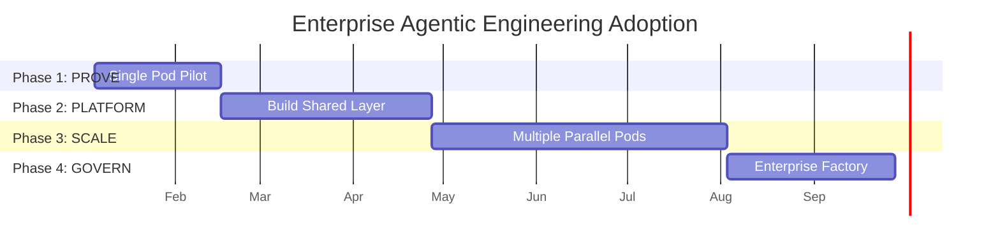
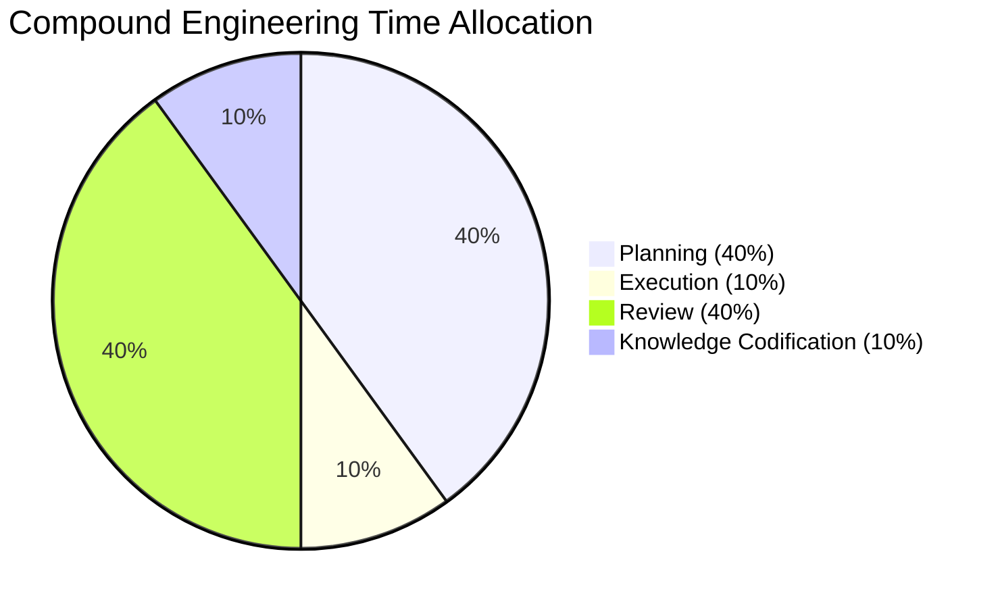
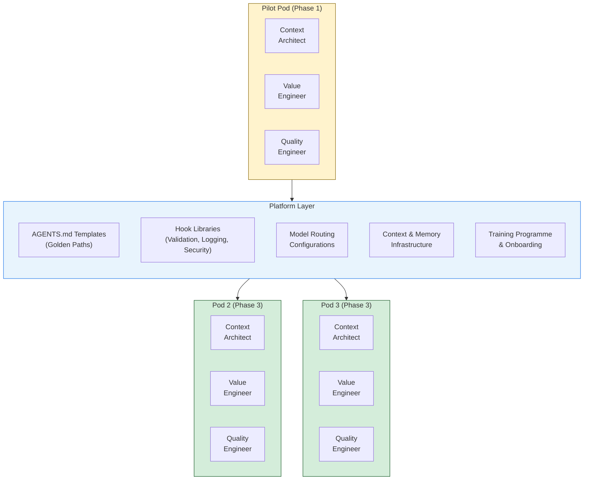
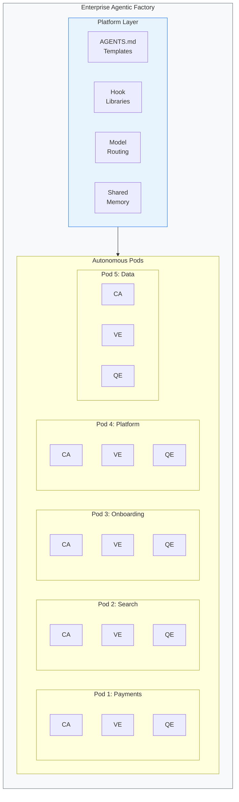
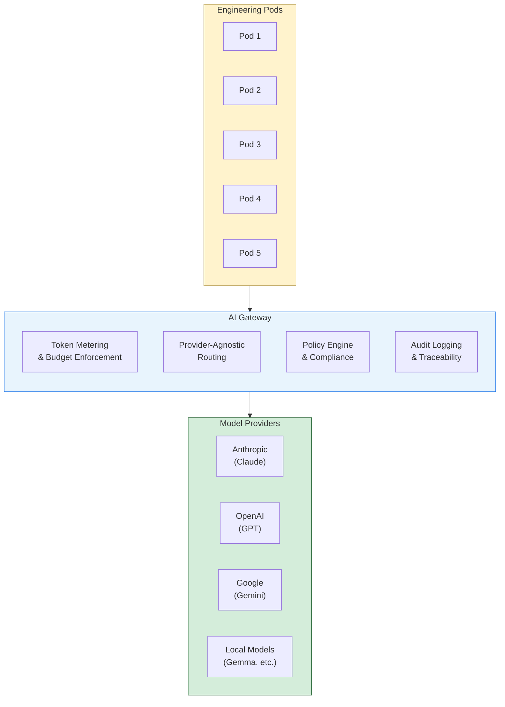
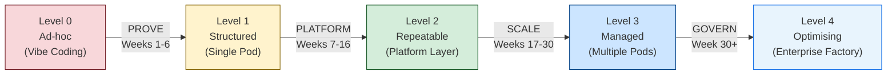
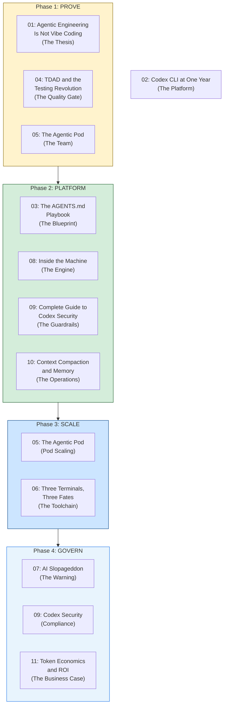

> **The Agentic Engineering Series** — From experiment to enterprise. This is article 12 of 13.
> *This article is the capstone — how to assemble all the components into a phased enterprise adoption journey, from first pilot to factory at scale.*
> [Previous: Token Economics and ROI](/premium/11-token-economics-and-the-roi-of-coding-agents/) | [Next: The Agentic Engineering Maturity Matrix](/premium/13-the-agentic-engineering-maturity-matrix/) | [Series overview](#series)

> **Series context:** This is article 12 of 13 in *From Experiment to Factory*. Every preceding article addressed a component — the thesis, the platform, the blueprint, the quality gate, the team, the toolchain, the risks, the engine, the guardrails, the efficiency layer, and the business case. This article is **The Rollout** — how to assemble those components into a phased enterprise adoption journey that takes you from first experiment to factory at scale.

# The Scaling Playbook: From Pilot Pod to Enterprise Factory

In April 2026, Uber's CTO told The Information that the company had burned through its entire annual AI budget just months into the year, after giving 5,000 engineers access to Claude Code and watching adoption surge from 32% to 63%. The budget was gone before the ROI framework existed to justify it. That is the failure mode this article is designed to prevent.

[Article 01](/premium/01-agentic-engineering-is-not-vibe-coding/) established the thesis. [Article 05](/premium/05-the-agentic-pod/) defined the team. [Article 03](/premium/03-the-agents-md-playbook/) codified the blueprint. [Article 11](/premium/11-token-economics-and-the-roi-of-coding-agents/) made the business case. Each piece is necessary. None is sufficient. Uber had the adoption. What it lacked was the phased scaling discipline that connects pilot success to enterprise economics.

The question this article answers is: **how do you assemble these components into a phased adoption journey that takes an enterprise from first experiment to factory at scale, without blowing through your budget before you can prove the return?**

The answer is not a technology rollout. It is an organisational transformation with four distinct phases, each with its own objectives, failure modes, and exit criteria. Organisations that try to skip phases, standing up twenty pods before proving the model works with one, or imposing governance before understanding what needs governing, fail in predictable ways. The scaling playbook exists to make those failure modes visible before they become expensive.

This playbook is framework-agnostic. The examples reference Codex CLI because this series is built around it, but the phases, structures, and governance patterns apply regardless of whether your agents run on Codex CLI, Claude Code, Gemini CLI, or a combination of all three. The principles are about how humans organise around agents, not which agents they use.

## The Four Phases

| Phase | Weeks | Objective | Exit Criteria |
|-------|-------|-----------|--------------|
| **PROVE** | 1–6 | Demonstrate the model works with one team | Baseline vs. pilot metrics show measurable improvement |
| **PLATFORM** | 7–16 | Extract reusable patterns into a shared layer | Platform supports onboarding a new pod in < 1 week |
| **SCALE** | 17–30 | Launch 3–5 autonomous parallel pods | Cross-pod knowledge sharing is operational; metrics are consistent |
| **GOVERN** | 30+ | Establish enterprise factory operations | AI Gateway live; token budgets enforced; quarterly ROI reviews running |

Each phase builds on the last. The exit criteria for one phase are the entry conditions for the next. Skipping ahead is how Uber burned through its annual AI budget in months.[^1]

## Phase 1: PROVE (Weeks 1–6) — Single Pod Pilot

The purpose of Phase 1 is not to transform the organisation. It is to generate evidence. You are running a controlled experiment: can a single Agentic Engineering Pod, operating under compound engineering methodology, deliver measurably better outcomes than the same team working without agents?

### Select the Pilot

The pilot project must be neither too simple nor too complex. A greenfield CRUD application generates no signal, agents handle simple boilerplate well regardless of methodology. A legacy system with millions of lines of undocumented code generates no success, the team will spend six weeks fighting context limits rather than demonstrating the model.

The ideal pilot has these characteristics:

- **Active development**: the team is shipping features, not in maintenance mode
- **Moderate complexity**: multiple services, real business logic, existing test coverage
- **Measurable outputs**: PRs, deployments, defect rates, cycle times that are already being tracked or can be
- **Willing team**: three engineers who are curious, not coerced

### Stand Up the Pod

The Agentic Engineering Pod is three humans wielding agents. Not one developer wearing three hats. Not a team of six with a project manager. Three people, three roles, zero coordinators.[^2]

| Role | Human | Owns |
|------|-------|------|
| **Context Architect** | Owns the "Why" and the standards | Standards, reference architectures, AGENTS.md (standing context), architectural patterns, spec quality criteria, knowledge codification |
| **Value Engineer** | Owns the "What" and the "How" | Product value decisions, feature specifications (SPEC.md with RFC 2119 requirements), ExecPlan (PLANS.md for multi-hour tasks), agent orchestration, implementation details |
| **Quality Engineer** | Owns the "Trust" | Validation infrastructure that honours the specification, test contracts derived from MUST requirements, security verification, production readiness |

Every person is a producer. Agents handle the routine execution, boilerplate, scaffolding, test generation, CI runs. The humans handle judgment: what to build, how to build it well, and whether it is safe to ship. (For the full pod model, roles, and lifecycle, see [Article 05: The Agentic Pod](/premium/05-the-agentic-pod/).)

### Establish Baselines

Before agents touch a single line of code, measure everything the team currently produces. You need the "before" to prove the "after."

Baseline metrics to capture:

| Metric | What to Measure | Why It Matters |
|--------|----------------|---------------|
| **Cycle time** | Commit to production (median, P90) | The end-to-end delivery speed |
| **PR turnaround** | PR opened to PR merged | The review bottleneck indicator |
| **Defect rate** | Bugs per feature shipped | Quality signal |
| **Feature lead time** | Requirement to production | Business-visible delivery speed |
| **Developer hours per feature** | Effort tracking | The denominator for ROI calculations |

GitHub's own data shows Copilot reduced PR turnaround from 9.6 days to 2.4 days in controlled studies.[^3] Your pilot will generate your organisation's version of that number, and it will be more credible to your leadership than any vendor benchmark.

### Adopt Compound Engineering

The methodology is the 40/10/40/10 split from compound engineering:[^4]

This is counterintuitive. If agents are doing the coding, why spend 80% of time on everything except coding? Because the METR study demonstrated that developers using AI tools took 19% longer on tasks despite *feeling* 20% faster.[^5] The perception gap exists because generation feels productive while the debugging, review, and integration work that follows does not. Compound engineering closes the gap by investing the time where it actually matters: upstream (planning) and downstream (review).

In practice, the 40/10/40/10 split means:

- **40% Planning**: The Context Architect ensures the standards, reference architectures and AGENTS.md standing context are current. The Value Engineer writes the feature specification (`SPEC.md`) — the feature contract with RFC 2119 requirements (`MUST`, `SHOULD`, `MAY`) and a high-level design — deciding what is most valuable to build and detailing how agents should implement it. For multi-hour features, the Value Engineer produces an ExecPlan (`PLANS.md`) — a self-contained document an agent can resume from cold. The Quality Engineer derives test contracts from the `MUST` requirements and defines the validation infrastructure that will prove the spec was honoured.
- **10% Execution**: Agents generate code. The Value Engineer orchestrates, delegates to subagents, manages context windows. They run `/plan` against the spec before switching to execute mode. This is the part that feels like the whole job but is not.
- **40% Review**: Every output is reviewed as if a capable but unsupervised junior engineer submitted it. The Quality Engineer runs TDAD cycles (see [Article 04: TDAD and the Testing Revolution](/premium/04-tdad-and-the-testing-revolution/)) and validates output against the test contracts derived from the spec. The Value Engineer verifies alignment with the original specification — did the implementation honour the `MUST` requirements? Did it stay within the design boundaries? The Context Architect checks for architectural drift against reference patterns.
- **10% Knowledge Codification**: What did the team learn? What patterns should be captured in AGENTS.md? What context should persist for future sessions? This is the compounding mechanism, the investment that makes every subsequent cycle more effective than the last.

### Write the First AGENTS.md

The boundary file governs agent behaviour. In Phase 1, it is a single file at the repository root. It does not need to be comprehensive, the ETH Zurich research shows that a focused, specific AGENTS.md outperforms a sprawling manifesto.[^6]

Start with:

- **Project context**: what the system does, who uses it, what matters
- **Coding standards**: language version, framework conventions, naming patterns
- **Testing requirements**: test-first mandates, coverage expectations, forbidden shortcuts
- **Boundary rules**: what agents must NOT do (delete databases, modify production configs, bypass security gates)
- **Tool configuration**: which commands to run for linting, testing, building

This first AGENTS.md is a draft. It will be revised weekly as the team discovers what agents actually need to know. By the end of Phase 1, it will be the seed for the platform templates in Phase 2. (For the complete AGENTS.md authoring guide, see [Article 03: The AGENTS.md Playbook](/premium/03-the-agents-md-playbook/).)

### Configure the Toolchain

Select and configure the agent toolchain. This series recommends Codex CLI, but the playbook is framework-agnostic. What matters is that the tool supports:

- Structured instructions via AGENTS.md or equivalent
- Hook systems for pre-commit validation and post-task logging
- Sandboxed execution to prevent destructive operations
- Cost tracking at the session level

(For toolchain selection criteria and comparison, see [Article 06: Three Terminals, Three Fates](/premium/06-three-terminals-three-fates/).)

### Run and Measure

Run the pod for four to six weeks. Collect the same metrics you baselined. The comparison is your proof.

**What to expect**: initial productivity may not improve. The Microsoft research on GitHub Copilot adoption found that consistent productivity gains take approximately 11 weeks to materialise.[^7] Your six-week pilot may show marginal improvement, flat performance, or even a temporary dip. This is normal. The signal you are looking for is not "agents made us faster immediately", it is "the methodology is sustainable, the team is learning, and the trajectory is positive."

**Phase 1 exit criteria**:

- Baseline and pilot metrics collected and compared
- AGENTS.md written and iterated at least three times
- Pod roles are functioning (no one has collapsed into "everyone does everything")
- The team can articulate what worked, what failed, and what should be standardised

## Phase 2: PLATFORM (Weeks 7–16) — Build the Shared Layer

Phase 1 produced evidence and experience. Phase 2 extracts the reusable patterns from that experience into a platform layer that other pods can adopt without repeating the pilot's learning curve.

### The Platform Engineering Team's Role

The platform team in agentic engineering does not build features. It builds the factory floor. Its job is to make the next pod's onboarding take days, not weeks.

The critical anti-pattern to avoid: the platform team building in isolation. Every template, hook, and configuration should be extracted from the pilot pod's actual experience, not designed in the abstract. The ivory tower platform, built without consulting the teams who will use it, is Phase 2's most common failure mode.

### Shared AGENTS.md Templates

The pilot pod's AGENTS.md becomes the seed for golden path templates. Create variants for common project types:

- **Backend service template**: API conventions, database migration rules, error handling patterns
- **Frontend application template**: component structure, state management, accessibility requirements
- **Data pipeline template**: schema validation, idempotency requirements, backfill safety rules
- **Monorepo template**: hierarchical AGENTS.md with workspace-level overrides (as documented in [Article 03](/premium/03-the-agents-md-playbook/))

Each template is a starting point, not a mandate. Pods adopt a template and customise it for their project. The platform team maintains the templates based on feedback from all pods.

### Hook Libraries

Hooks are the enforcement mechanism for the standards that AGENTS.md declares. Build shared libraries for:

- **Pre-commit validation**: lint checks, type checking, forbidden pattern detection, secret scanning
- **Post-task cost logging**: token usage per session, model tier used, task duration
- **Security scanning**: dependency audit, SAST integration, compliance verification
- **Quality gates**: test coverage thresholds, PR size limits, documentation requirements

These hooks run automatically. They do not depend on the developer remembering to follow the process. (For the security-specific hook patterns, see [Article 09: Complete Guide to Codex Security](/premium/09-complete-guide-to-codex-security/).)

### Model Routing Configurations

The orchestrator/worker pattern, using a frontier model for planning and reasoning, and smaller models for routine execution, is the highest-leverage cost optimisation available.[^8] The platform layer standardises this:

- **Orchestrator tier**: Frontier models (Claude Opus 4, GPT-5.4) for architectural decisions, complex refactoring, multi-file reasoning
- **Worker tier**: Mid-range models (Claude Sonnet 4, GPT-5.4-mini) for implementation, test generation, documentation
- **Local tier**: On-device models (Gemma 4 on M5 Pro, Dell GB10) for rapid iteration, offline work, cost-sensitive tasks

The routing logic lives in the platform configuration, not in individual developer setups. When a new model becomes available or pricing changes, the platform team updates the routing once and every pod benefits. (For the technical details of model routing and engine internals, see [Article 08: Inside the Machine](/premium/08-inside-the-machine/).)

### Context Architecture

Context is not just a per-session concern. At the platform level, it becomes organisational memory.

- **Shared memory systems**: codebase-memory-mcp or equivalent tools that maintain persistent knowledge across sessions and across team members
- **Knowledge graphs**: relationships between services, ownership boundaries, dependency maps that agents can query
- **Context templates**: pre-built context packages for common tasks (onboarding to a service, debugging a production issue, implementing a standard pattern)

The Context Architects from each pod form a network. They share patterns, identify gaps, and feed improvements back to the platform. This network is the seed of what becomes the organisational knowledge layer in Phase 3. (For deep coverage of context management, compaction, and memory systems, see [Article 10: Context Compaction and Memory](/premium/10-context-compaction-and-memory/).)

### Training Programme

The Microsoft research on Copilot adoption found that consistent productivity gains take approximately 11 weeks to materialise.[^7] This is not a tool adoption curve, it is a methodology adoption curve. Engineers must learn:

- How to write effective specifications — the Value Engineer's `SPEC.md` with RFC 2119 requirements, guided by the Context Architect's standards[^15]
- How to review agent output critically (the 40% review investment)
- How to structure context for agents (the AGENTS.md discipline)
- How to recognise when agents are confidently wrong
- How to use the compound engineering methodology (the 40/10/40/10 split)

Plan for the 11-week onboarding period. Do not measure a new pod's performance during its first two months and conclude the model does not work. The pilot pod's experienced members should pair with new adopters, one experienced pod member per new pod during the first four weeks.

The skill matrix for agentic engineering differs from traditional development:

| Competency | Traditional Development | Agentic Engineering |
|-----------|------------------------|-------------------|
| **Core skill** | Writing code | Specifying intent (Value Engineer writes SPEC.md guided by Context Architect's standards) and reviewing output (Quality Engineer validates against spec) |
| **Planning** | Nice to have | 40% of the work |
| **Review rigour** | Code review as gate | Code review as primary quality mechanism |
| **Context management** | Implicit (in the developer's head) | Explicit (structured, versioned, shared) |
| **Testing philosophy** | Write tests after code | Tests define the contract agents must satisfy |
| **Cost awareness** | Infrastructure budgets | Token budgets, model selection, routing decisions |

**Phase 2 exit criteria**:

- Platform layer deployed with templates, hooks, and routing configurations
- Training programme documented and tested with at least one new-to-agentic engineer
- Platform supports onboarding a new pod in under one week
- Pilot pod is consuming platform services (not bypassing them)

## Phase 3: SCALE (Weeks 17–30) — Multiple Parallel Pods

Phase 2 built the factory floor. Phase 3 puts multiple production lines on it.

### Launch Parallel Pods

The scaling model is explicit: **launch parallel pods, do not expand existing ones.** A four-person pod has a coordinator. A five-person pod has a traditional team's handoff problems. A six-person pod is a committee. The three-person constraint is structural, not arbitrary.[^2]

Each pod is autonomous. It owns its domain, its backlog, and its delivery cadence. The platform layer provides shared infrastructure; it does not provide shared management.

The 37signals principle applies at the pod level: **fix time, flex scope.**[^9] Each pod operates on fixed-length cycles (one or two weeks). The scope of each cycle adjusts to fit the time, not the reverse. This prevents the coordination overhead that kills throughput when multiple pods share a timeline.

### The Context Architect Network

As pods multiply, the Context Architects from each pod form a cross-cutting network. This is not a committee and does not have meetings with agendas. It is a communication channel, a Slack channel, a shared knowledge base, a weekly 15-minute sync, where Context Architects share:

- Patterns that worked (or failed) in their pod
- AGENTS.md innovations worth propagating
- Context management techniques for specific problem types
- Edge cases where agents produced surprising failures

This network is how the "context layer" evolves from project memory to organisational memory. When Pod 3's Context Architect discovers that agents handle database migration tasks better with a specific reference architecture — say, migration patterns that include a rollback requirement as a `MUST` standard and a data-loss prevention clause — that architectural pattern propagates to all pods through the network and eventually into the platform templates. Similarly, when a Value Engineer discovers that decomposing a spec into three parallel subagent tasks instead of one sequential chain cuts delivery time in half, that execution pattern feeds back through the same channel.

### Local Model Deployment

At scale, local models become a strategic cost hedge, not an experiment. The hardware available in mid-2026 makes this practical:[^10]

- **Apple M5 Pro MacBook Pro**: 307 GB/s memory bandwidth, Neural Accelerator in every GPU core, 4x LLM prompt processing improvement over M4. Running Gemma 4 26B MoE locally handles routine coding tasks at zero marginal token cost.
- **Dell GB10**: 128 GB unified memory, 1,000 FP4 TOPS, supports models up to 200B parameters. Deployed as a team inference server, it serves an entire pod's routine workload.

The economics are straightforward: a MacBook Pro M5 Pro pays for itself in 5–10 months if it displaces 30% of cloud API usage. A Dell GB10 serving a team of five pays back in 2–3 months.[^11] At Phase 3 scale (15–25 engineers across 5 pods), the hardware investment offsets a significant fraction of API costs while providing a capability that does not spike when adoption exceeds projections.

### Cross-Pod Metrics

With multiple pods running, you can now measure variance. Single-pod metrics tell you whether agents help. Multi-pod metrics tell you whether the methodology is *repeatable*.

| Metric | Single Pod | Multiple Pods |
|--------|-----------|--------------|
| Cycle time | "Did we improve?" | "Is improvement consistent across pods?" |
| Defect rate | "Are we shipping quality?" | "Does quality correlate with pod maturity?" |
| Token cost per feature | "What does this cost?" | "Is cost predictable across different domains?" |
| Onboarding time | "How long for the pilot?" | "Does the platform actually accelerate new pods?" |

Variance between pods is diagnostic. If Pod 2 consistently underperforms, the question is whether it has a harder domain, a less experienced team, or a platform gap that needs closing. Without the multi-pod comparison, you cannot distinguish these causes.

**Phase 3 exit criteria**:

- 3–5 pods operational and delivering
- Cross-pod metrics dashboard live and reviewed bi-weekly
- Context Architect network operational
- Platform layer supporting all pods without bottlenecks
- Local model deployment covering at least 20% of routine workload

## Phase 4: GOVERN (Week 30+) — Enterprise Factory

Phase 3 proved the model scales. Phase 4 makes it sustainable. This is where the enterprise machinery, governance, compliance, vendor strategy, financial controls, wraps around the factory without strangling it.

### The AI Gateway

The AI Gateway is the central infrastructure component for enterprise-scale agentic engineering. It sits between all pods and all model providers, providing:

**Token metering**: Every API call passes through the gateway. Token consumption is attributed to the pod, the project, and the individual session. This is how you avoid the Uber scenario, not by restricting usage, but by making usage visible in real time.[^1]

**Provider-agnostic routing**: The gateway routes requests to the optimal provider based on task type, cost, and availability. When Anthropic adjusts pricing or a new model launches, routing updates happen at the gateway level. Pods do not need to change their configurations.

**Policy enforcement**: Compliance rules (no PII in prompts, no proprietary code sent to certain providers, model version pinning for regulated workloads) are enforced at the gateway, not at the developer's terminal.

**Audit logging**: Every agent action is logged. Every decision is traceable. For regulated industries, this is not optional, it is the prerequisite for using AI coding tools at all. (For the full security and compliance framework, see [Article 09: Complete Guide to Codex Security](/premium/09-complete-guide-to-codex-security/).)

### Token Budgets

Token budgets operate at multiple levels:

- **Per-team budgets**: each pod has a monthly token allocation based on its domain complexity and delivery targets
- **Per-project budgets**: large initiatives have dedicated budgets that track against ROI projections
- **Escalation triggers**: when a pod reaches 80% of its monthly budget, visibility increases; at 90%, the pod and platform team review usage patterns together; at 100%, frontier model access requires explicit approval while mid-range and local models remain unrestricted

The escalation model is crucial. Hard cutoffs create perverse incentives, developers route around them, use personal accounts, or stop using agents entirely for the last week of the month. Soft escalation with visibility preserves autonomy while preventing budget surprises.

### The Quarterly ROI Review Cadence

Measurement operates on four nested timescales:[^12]

| Cadence | Measures | Audience |
|---------|---------|----------|
| **Weekly** | Token consumption, session counts, model tier distribution | Pod leads, platform team |
| **Bi-weekly** | Efficiency metrics: cycle time, PR turnaround, defect rates | Engineering management |
| **Monthly** | Productivity metrics: features per sprint, developer hours per feature | Directors, VP Engineering |
| **Quarterly** | Business outcomes: revenue impact of faster delivery, cost of quality improvements, total ROI | C-suite, Finance |

The weekly telemetry feeds the bi-weekly analysis, which feeds the monthly review, which feeds the quarterly business case. Skip a layer and the ROI story collapses under scrutiny. (For the full ROI measurement framework, see [Article 11: Token Economics and ROI](/premium/11-token-economics-and-the-roi-of-coding-agents/).)

### Vendor Strategy

Enterprise-scale agentic engineering requires multi-tool, multi-vendor capability. No single vendor dependency.

- **Primary agent**: Codex CLI, Claude Code, or Gemini CLI, whichever the organisation standardises on
- **Secondary agents**: at least one alternative for redundancy and competitive benchmarking
- **Local models**: Gemma 4, Llama, or equivalent for cost-sensitive and offline workloads
- **Routing intelligence**: the AI Gateway manages provider selection, so individual developers do not need to

The strategic principle: **own the abstraction layer, rent the models.** The platform layer, AGENTS.md templates, hook libraries, and context architecture are proprietary assets. The models are interchangeable commodities. When a provider changes pricing (as Anthropic did with the OpenClaw situation[^13]) or a new model achieves better performance, the organisation switches at the gateway level without disrupting any pod's workflow.

### The Governance Paradox

This is the tension that defines Phase 4: too little governance produces the Uber budget crisis.[^1] Too much governance produces developer revolt.

The Uber story is the canonical example of too-little governance. Five thousand engineers with unrestricted access to Claude Code. Adoption surging from 32% to 63%. Budget gone before mid-year. No metering, no routing optimisation, no visibility into which workloads were consuming the most tokens.

The opposite failure is equally destructive. Organisations that impose token limits so tight that developers spend more time managing their budget than doing their work. Teams that require approval workflows for every agent session. Security policies that block agents from accessing the code they need to be useful. In these environments, developers route around the restrictions, using personal accounts, switching to unmonitored tools, or simply stopping agent use altogether.

The balance point is **visibility without friction**. Developers see their usage. They understand the cost model. They have autonomy to choose when and how to use agents. Governance operates at the infrastructure level (gateway routing, budget escalation, audit logging) rather than at the individual action level (approval per session, hard cutoffs, usage quotas).

**Phase 4 exit criteria**:

- AI Gateway deployed and routing all agent traffic
- Token budgets enforced with escalation (not hard cutoff) model
- Quarterly ROI review completed with business outcome metrics
- Multi-vendor strategy operational
- Compliance and audit requirements met for all regulated workloads

## Change Management

The scaling playbook is a technology adoption plan wrapped around a culture change programme. The culture change is harder.

### The 11-Week Onboarding Curve

Microsoft's research on Copilot adoption found that consistent productivity gains materialise after approximately 11 weeks of regular use.[^7] During those 11 weeks, developers are learning a new way of working, not learning a new tool.

The implication for scaling is direct: every new pod goes through this curve. A pod launched in Week 17 will not be performing at the pilot pod's level until approximately Week 28. Planning for this avoids the premature conclusion that "it's not working" when the real diagnosis is "it's not working *yet*."

Mitigation strategies:

- **Pair experienced with new**: assign one member from an established pod to each new pod for the first four weeks
- **Protect the learning period**: do not evaluate new pod performance against established pod benchmarks until Week 11
- **Celebrate process adoption, not output metrics**: in the first six weeks, measure whether the pod is following compound engineering methodology, not whether it is shipping faster

### The Productivity Paradox

METR's randomised controlled trial found that experienced developers using AI tools took 19% longer on tasks while believing they were 20% faster.[^5] This 39-percentage-point perception gap is the single most dangerous dynamic in agentic engineering adoption.

It is dangerous because it cuts both ways. Enthusiasts overestimate the benefit and resist measurement. Sceptics observe the slowdown and resist adoption. Neither group is wrong, they are each seeing one side of a phenomenon that only resolves with methodology, not with the tool alone.

The compound engineering framework resolves the paradox by redefining what "productive" means. Raw generation speed is not the metric. Delivery speed, from requirement to production, with quality gates passed, is the metric. When the 40/10/40/10 split is followed, the 40% review investment catches the defects that naive adoption ships to production. The delivery metric improves even when the generation metric does not.

Communicating this to leadership is essential. If the executive sponsor expects "agents make developers 10x faster on day one," the pilot will be judged a failure when it shows modest improvement after six weeks. Set the expectation correctly: the benefit is compounding, not immediate. The 11-week curve is real. The methodology investment is what makes the eventual gains sustainable.

### The Compound Engineering Mindset

Adopting agentic engineering is not a tool adoption. It is a mindset shift with these characteristics:

- **From writing code to specifying intent**: the Context Architect's primary output is standards and reference architectures that shape every specification. The Value Engineer's primary output is the feature specification (`SPEC.md`) and orchestrated delivery against it. The Quality Engineer's primary output is the validation infrastructure that proves the spec was honoured.
- **From trusting your own code to verifying someone else's**: code review becomes the primary quality mechanism, not a gate at the end
- **From implicit knowledge to explicit context**: what you know must be written down because agents cannot read your mind
- **From individual productivity to pod throughput**: the unit of measurement is the pod's delivery, not the individual's output
- **From cost-unaware to token-conscious**: every agent interaction has a cost, and cost-effectiveness is a professional skill

This shift takes time. It requires practice, mentorship, and an environment where the old habits are gently replaced rather than forcefully prohibited. The training programme from Phase 2 provides the structure. The experienced pod members provide the role modelling. The metrics provide the feedback loop.

## The Factory Maturity Model

The four phases map to a maturity model that describes where an organisation sits on the adoption journey:

| Level | Name | Characteristics | Risk Profile |
|-------|------|----------------|-------------|
| **0** | Ad-hoc | Individual developers using AI tools without shared methodology. Prompt-and-accept workflow. No review discipline, no context management, no cost tracking. | High: Amazon outage territory.[^14] Confident wrong output ships to production. |
| **1** | Structured | Single pod operating compound engineering. AGENTS.md governs agent behaviour. Baselines established. 40/10/40/10 methodology followed. | Medium: contained to one team. Quality is high but not yet scalable. |
| **2** | Repeatable | Platform layer extracts patterns from the pilot. Templates, hooks, and routing configurations enable new pods to onboard quickly. Training programme in place. | Low-Medium: methodology is codified but not yet proven at scale. |
| **3** | Managed | Multiple autonomous pods sharing the platform layer. Cross-pod metrics enable comparison. Context Architect network shares organisational knowledge. Governance is emerging. | Low: methodology is proven repeatable. Risk shifts from quality to cost management. |
| **4** | Optimising | AI Gateway provides centralised control. Token budgets enforced. Quarterly ROI reviews drive continuous improvement. Multi-vendor strategy eliminates single-provider dependency. | Managed: risks are known, measured, and governed. Continuous improvement is operational. |

Most enterprises in April 2026 are at Level 0 or transitioning to Level 1. The organisations that will lead their industries by the end of the year are the ones that start the Phase 1 pilot now and commit to the full journey.

## Failure Modes at Each Phase

Every phase has a characteristic failure mode. Knowing them in advance is cheaper than discovering them in production.

### Phase 1: Wrong Pilot Selection

**Too simple**: the pilot project is a greenfield CRUD application or an internal tool with trivial business logic. Agents handle this well regardless of methodology. The pilot "succeeds" but generates no evidence that the model works on real-world complexity. Leadership approves scaling based on a false signal. Phase 3 pods hit complex codebases and fail.

**Too complex**: the pilot project is a legacy monolith with millions of lines, no documentation, and no test coverage. The team spends six weeks fighting context limits, debugging hallucinated imports, and rewriting agent output from scratch. The pilot "fails" but the failure was in the selection, not the methodology.

**The fix**: choose a project with moderate complexity, active development, and measurable outputs. The pilot should be hard enough to be representative and tractable enough to succeed within six weeks.

### Phase 2: The Ivory Tower Platform

The platform team builds templates, hooks, and configurations without consulting the pilot pod. The templates encode assumptions the pilot team never validated. The hooks enforce standards the pilot team discovered were counterproductive. The training programme teaches theory the pilot team learned to ignore.

**The fix**: every platform artefact is extracted from the pilot pod's actual experience. The platform team's first customer is the pilot pod. If the pilot pod does not adopt the platform's output, the platform has failed, not the pod.

### Phase 3: Expanding Pods Instead of Launching Parallel Ones

A pod is performing well. Leadership's instinct is to add people to it. The pod grows to four, then five, then six. A coordinator emerges to manage the complexity. Handoffs appear. Context fragments. The throughput that made the pod successful erodes under coordination overhead.

**The fix**: enforce the three-person constraint structurally. When demand exceeds a pod's capacity, launch a parallel pod. Scale the factory floor, not the production line. The platform layer exists to make parallel pods cheap to launch.[^2]

### Phase 4: Over-Governance

Token limits are so restrictive that developers cannot complete complex tasks without requesting budget increases. Approval workflows add hours to every agent session. Security policies prevent agents from accessing the repositories they need to work on. Developers route around the restrictions using personal accounts, unmonitored tools, or shadow IT.

**The fix**: governance operates at the infrastructure level (gateway routing, budget escalation, audit logging), not at the individual action level (approval per session, hard cutoffs). Visibility, not restriction, is the governance mechanism. When developers can see their usage and understand the cost model, they self-govern more effectively than any policy can enforce.

## The Series Map

This article is the orchestration layer. Every article in the series maps to one or more phases of the scaling playbook:

| Phase | Articles | What They Contribute |
|-------|----------|---------------------|
| **PROVE** | [01](/premium/01-agentic-engineering-is-not-vibe-coding/), [04](/premium/04-tdad-and-the-testing-revolution/), [05](/premium/05-the-agentic-pod/) | The thesis, the testing methodology, the pod structure |
| **PLATFORM** | [03](/premium/03-the-agents-md-playbook/), [08](/premium/08-inside-the-machine/), [09](/premium/09-complete-guide-to-codex-security/), [10](/premium/10-context-compaction-and-memory/) | The blueprint, the engine internals, the security guardrails, the memory systems |
| **SCALE** | [05](/premium/05-the-agentic-pod/), [06](/premium/06-three-terminals-three-fates/) | Pod scaling principles, toolchain selection |
| **GOVERN** | [07](/premium/07-ai-slopageddon/), [09](/premium/09-complete-guide-to-codex-security/), [11](/premium/11-token-economics-and-the-roi-of-coding-agents/) | What happens without governance, compliance framework, token economics |
| **Foundation** | [02](/premium/02-codex-cli-at-one-year/) | Platform maturity context — applicable across all phases |
| **Capstone** | **[12](/premium/12-the-scaling-playbook/)** | **This article — the assembly and scaling journey** |

[Article 02: Codex CLI at One Year](/premium/02-codex-cli-at-one-year/) is the foundation layer, it provides the platform maturity context that informs decisions at every phase. [Article 07: AI Slopageddon](/premium/07-ai-slopageddon/) is the cautionary counterweight, it documents what the factory is designed to prevent, and what happens when organisations skip the engineering.

## The First 30 Days

For organisations ready to begin, here is the concrete action plan for the first month:

**Week 1: Assemble and Align**

- Identify the pilot team (three engineers, one project, moderate complexity)
- Assign pod roles: Context Architect (owns standards, reference architectures + AGENTS.md), Value Engineer (owns feature specs + agent orchestration), Quality Engineer (owns validation that honours the spec)
- Context Architect writes the first AGENTS.md with standards and architectural guardrails; Value Engineer writes the first `SPEC.md` for the pilot feature
- Baseline current metrics (cycle time, defect rate, PR turnaround, feature lead time)
- Set up the tool of choice with default configuration

**Week 2: Instrument and Configure**

- Write the first AGENTS.md (start focused, iterate weekly)
- Configure basic hooks (pre-commit linting, post-task cost logging)
- Establish the compound engineering cadence (40/10/40/10)
- Begin the first sprint under the new methodology

**Week 3–4: Execute and Measure**

- Run two full sprints
- Collect metrics and compare against baselines
- Revise AGENTS.md based on what the team learns
- Document patterns worth extracting (the seeds of the platform layer)

**Week 5–6: Evaluate and Decide**

- Compare pilot metrics to baselines
- Document the team's experience: what worked, what failed, what surprised them
- Produce the Phase 1 report for leadership
- Make the go/no-go decision for Phase 2

This is not a transformation programme that requires executive buy-in before a single line of code is written. It is a six-week experiment that generates its own evidence. The evidence is the buy-in.

## Key Takeaways

1. **Four phases, sequential, no skipping**: PROVE → PLATFORM → SCALE → GOVERN. Each phase generates the conditions for the next. Skipping ahead produces the failures this article documents.

2. **The pod is the unit of scale**: three humans, three roles, zero coordinators. Scale by launching parallel pods, not by expanding existing ones. The three-person constraint is structural, not aspirational.[^2]

3. **The platform layer is the multiplier**: without it, every new pod repeats the pilot's learning curve. With it, onboarding drops from weeks to days. The platform team builds the factory floor, not the features.

4. **The 11-week curve is real**: expect it, plan for it, protect new pods from premature judgement during it. Pair experienced members with new adopters.[^7]

5. **The productivity paradox resolves with methodology**: the METR study's 19% slowdown is a finding about naive adoption, not about AI tools. Compound engineering's 40/10/40/10 split closes the gap by investing in the work that generation skips.[^5]

6. **Governance is visibility, not restriction**: the AI Gateway provides metering, routing, and audit logging at the infrastructure level. Budget escalation, not hard cutoffs. Autonomy preserved, surprises prevented.[^1]

7. **Own the abstraction, rent the models**: AGENTS.md templates, hook libraries, context architecture, and the platform layer are proprietary assets. Models are interchangeable. No single vendor dependency.

8. **The culture shift is the hard part**: agentic engineering is not a tool adoption. It is a change in how developers think about their work. The Context Architect defines standards and reference architectures instead of writing code. The Value Engineer writes feature specifications and orchestrates agents instead of implementing alone. The Quality Engineer builds validation infrastructure that honours those specifications instead of manual testing. The shift from individual productivity to pod throughput is the hardest adjustment — and the most valuable.

9. **Start now, start small, start measuring**: a six-week pilot with three people and one project generates the evidence to justify everything that follows. The evidence is the buy-in.

10. **This is the assembly**: the other eleven articles are the components. This playbook is how they fit together. No component works in isolation. The factory is the sum of all parts, assembled in the right order.

The rollout plan is complete. The final piece is knowing where you stand today — and where you need to go next. In [Article 13: The Agentic Engineering Maturity Matrix](/premium/13-the-agentic-engineering-maturity-matrix/), we provide the assessment framework that maps your organisation's current capabilities across ten dimensions and five maturity levels, giving you a concrete starting point for the journey from experiment to factory.

## The Agentic Engineering Series {#series}

From experiment to enterprise — building the factory for AI-assisted software engineering at scale.

| | Article | Role |
|---|---------|------|
| 1 | [Agentic Engineering Is Not Vibe Coding](/premium/01-agentic-engineering-is-not-vibe-coding/) | The Wake-Up Call |
| 2 | [Codex CLI at One Year](/premium/02-codex-cli-at-one-year/) | The Platform |
| 3 | [The AGENTS.md Playbook](/premium/03-the-agents-md-playbook/) | The Blueprint |
| 4 | [TDAD and the Testing Revolution](/premium/04-tdad-and-the-testing-revolution/) | The Quality Gate |
| 5 | [The Agentic Pod](/premium/05-the-agentic-pod/) | The Team Model |
| 6 | [Three Terminals, Three Fates](/premium/06-three-terminals-three-fates/) | The Toolchain |
| 7 | [AI Slopageddon](/premium/07-ai-slopageddon/) | The Risk |
| 8 | [Inside the Machine](/premium/08-inside-the-machine/) | The Engine |
| 9 | [Complete Guide to Codex Security](/premium/09-complete-guide-to-codex-security/) | The Guardrails |
| 10 | [Context Compaction and Memory](/premium/10-context-compaction-and-memory/) | The Efficiency Layer |
| 11 | [Token Economics and ROI](/premium/11-token-economics-and-the-roi-of-coding-agents/) | The Business Case |
| **12** | **[The Scaling Playbook](/premium/12-the-scaling-playbook/)** | **The Rollout** |
| 13 | [The Agentic Engineering Maturity Matrix](/premium/13-the-agentic-engineering-maturity-matrix/) | The Assessment |

[^1]: Bratton, L., "Uber CTO Shows How Claude Code Can Blow Up AI Budgets," The Information, April 2026. Uber gave 5,000 engineers access to Claude Code; adoption surged from 32% to 63%; annual AI budget exhausted within months. <https://www.theinformation.com/newsletters/applied-ai/uber-cto-shows-claude-code-can-blow-ai-budgets>

[^2]: The Agentic Engineering Pod model is defined in Chapter 32 of *Codex CLI: The Complete Guide* and documented in detail in [Article 05: The Agentic Pod](/premium/05-the-agentic-pod/). Three humans (Context Architect, Value Engineer, Quality Engineer), each wielding agents, zero coordinators. Scale by launching parallel pods, not expanding existing ones.

[^3]: GitHub, "Research: Quantifying GitHub Copilot's impact on developer productivity and happiness." PR turnaround reduction from 9.6 to 2.4 days. HTTP server completion time: 1h11m with Copilot vs. 2h41m without.

[^4]: "Compound Engineering: How Every Codes With Agents," every.to. The 40/10/40/10 split: 40% planning, 10% execution, 40% review, 10% knowledge codification. <https://every.to/chain-of-thought/compound-engineering-how-every-codes-with-agents>

[^5]: METR, "Measuring the Impact of AI Tools on Developer Productivity," randomised controlled trial, February–June 2025. Sixteen experienced open-source developers took 19% longer with AI tools while believing they were 20% faster. Updated analysis: "We are Changing our Developer Productivity Experiment Design," February 2026. <https://metr.org/blog/2026-02-24-uplift-update/>

[^6]: ETH Zurich, controlled experiment on AGENTS.md files. LLM-generated context files reduce agent success rates by 3% and inflate costs by 20%. Human-written files improve success by 4% at 19% cost premium. Focused, specific instructions outperform comprehensive manifestos. Cited in [Article 03: The AGENTS.md Playbook](/premium/03-the-agents-md-playbook/).

[^7]: Microsoft internal research on GitHub Copilot enterprise adoption. Consistent productivity gains observed after approximately 11 weeks of regular use, reflecting methodology adoption rather than tool familiarity.

[^8]: Model routing economics documented in [Article 11: Token Economics and ROI](/premium/11-token-economics-and-the-roi-of-coding-agents/). Defaulting to mini/nano models and reserving frontier models for complex work cuts costs 35–70% with no quality loss on routine tasks.

[^9]: Fried, J. and Heinemeier Hansson, D., 37signals. "Fix time, flex scope" — the principle that delivery cycles should have fixed durations with variable scope, not the reverse. Applied at the pod level to prevent cross-pod coordination overhead.

[^10]: Apple, "Apple debuts M5 Pro and M5 Max to supercharge the most demanding pro workflows," March 2026. Neural Accelerator in every GPU core, 4x LLM prompt processing improvement, 307 GB/s memory bandwidth. <https://www.apple.com/newsroom/2026/03/apple-debuts-m5-pro-and-m5-max-to-supercharge-the-most-demanding-pro-workflows/>; Dell, "Dell Pro Max with GB10: Purpose-built for AI Developers," 2026. 128 GB unified memory, 1,000 FP4 TOPS. <https://www.dell.com/en-us/blog/dell-pro-max-with-gb10-purpose-built-for-ai-developers/>

[^11]: Hardware ROI calculations documented in [Article 11: Token Economics and ROI](/premium/11-token-economics-and-the-roi-of-coding-agents/). MacBook Pro M5 Pro payback: 5–10 months at 30% API displacement. Dell GB10 team server payback: 2–3 months serving five engineers.

[^12]: Four-layer measurement cadence (weekly telemetry → bi-weekly efficiency → monthly productivity → quarterly business outcomes) documented in [Article 11: Token Economics and ROI](/premium/11-token-economics-and-the-roi-of-coding-agents/).

[^13]: "Anthropic Blocks Third-Party Claude Access," multiple sources, April 2026. TechCrunch: <https://techcrunch.com/2026/04/04/anthropic-says-claude-code-subscribers-will-need-to-pay-extra-for-openclaw-support/>. The OpenClaw pricing incident demonstrated that subscription pricing is a subsidy with an expiry date.

[^14]: Palmer, A., "Amazon AI outage costs estimated 6.3 million lost orders," CNBC, March 2026. AI-assisted code deployed without adequate review. Cross-referenced in [Article 01: Agentic Engineering Is Not Vibe Coding](/premium/01-agentic-engineering-is-not-vibe-coding/).

[^15]: Spec-driven development (SDD) methodology. The Value Engineer authors `SPEC.md` with RFC 2119 requirements (`MUST`/`SHOULD`/`MAY`) and `PLANS.md` (ExecPlan) for multi-hour features, guided by the Context Architect's standards and reference architectures. The Quality Engineer derives test contracts from `MUST` requirements to validate the specification is honoured. See [Article 05: The Agentic Pod](/premium/05-the-agentic-pod/) for the full role breakdown and 'Spec-Driven Development with Codex: Writing Specifications Before Code,' codex-resources, 28 March 2026, for the methodology and tooling ecosystem.
