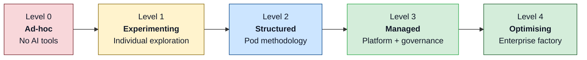
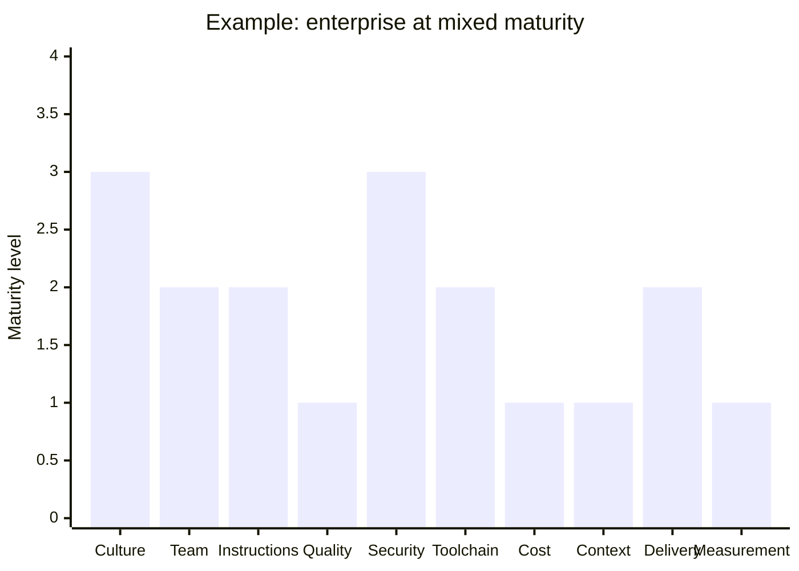
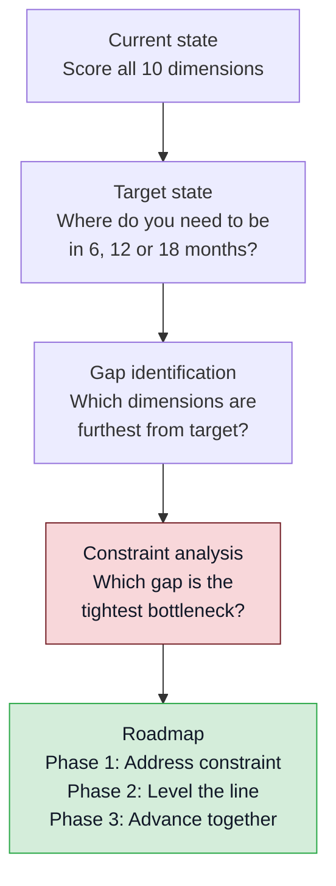
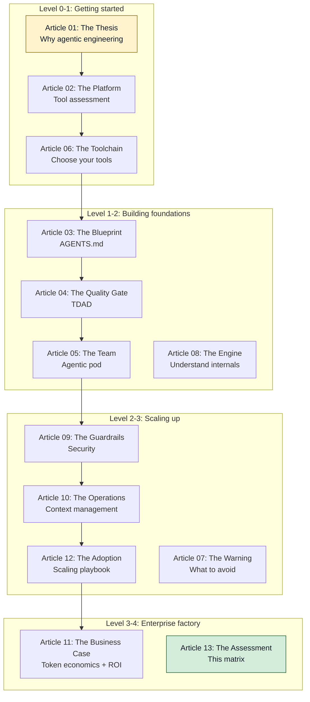

<p class="premium-pdf-download"><a href="/premium-pdfs/13-the-agentic-engineering-maturity-matrix.pdf"><strong>Download PDF</strong></a></p>

# The Agentic Engineering Maturity Matrix: Assessing Your Organisation's AI Readiness

> **The Agentic Engineering Series**. From experiment to enterprise. This is article 13 of 13.
> *This article gives you the assessment frame: a maturity matrix that shows where your organisation stands now and what has to improve next.*
> [Previous: The Scaling Playbook](/premium/12-the-scaling-playbook/) | [Series overview](#series)

> **Series context:** This is article 13 of 13 in *From Experiment to Factory*. The series has covered the thesis, platform, blueprint, quality gate, team model, toolchain, risk, engine, guardrails, efficiency, business case and rollout. This final piece is the assessment layer: how to score what is actually in place, find the bottleneck and choose the next move.

Container Solutions changed cloud consulting with a single grid: the Cloud Native Maturity Matrix.[^1] It gave clients a shared way to answer two practical questions. Where are we now? What has to improve next?

Agentic engineering needs the same thing. Most organisations can list the tools they have tried. Far fewer can say whether those tools sit inside a repeatable system or inside a growing pile of cognitive debt.

That is the short answer. The Agentic Engineering Maturity Matrix gives you a common language for scoring how disciplined your adoption really is. It measures 10 dimensions across five levels and forces you to look for the weakest point, because that point limits everything else.

If you remember one rule from this article, remember this one: do not score intention. Score observable evidence. A team is not 'managed' because it plans to formalise `AGENTS.md` next quarter. It is managed when shared templates, governance and upkeep already exist.

## Quick self-assessment

Before you work through the full matrix, use these checks to find your likely floor. Count the yes answers at each level. The highest level where every answer is yes is your approximate current position.

**Level 1, experimenting**

- Do fewer than three developers use AI coding tools regularly?
- Is there no `AGENTS.md` file in any repository?
- Is there no token or cost tracking for AI tool usage?

If the answer is yes to all three, you are at Level 0 or early Level 1.

**Level 2, structured**

- Does at least one team have a versioned `AGENTS.md` with boundary rules such as Always, Ask First and Never?
- Are tests written before agent execution on critical paths?
- Is there a defined pod or team structure for agentic work, rather than isolated individuals using tools?

If the answer is yes to all three, you have reached Level 2.

**Level 3, managed**

- Do multiple teams share a common `AGENTS.md` template library or platform layer?
- Are per-team token budgets in place with escalation triggers?
- Is agent output subject to automated security scanning through hooks, SAST or equivalent controls?

If the answer is yes to all three, you have reached Level 3.

**Level 4, optimising**

- Is cost per merged PR tracked and trending down?
- Does a knowledge codification cycle feed lessons back into `AGENTS.md` and memory systems?
- Are A/B experiments run on methodology changes, with ROI reported at board level?

If the answer is yes to all three, you are at Level 4.

The quick check is only a starting point. The full matrix matters because organisations rarely mature evenly.

## The matrix

The matrix scores organisations across 10 dimensions and five maturity levels. Each cell should describe something an assessor can verify. It is not a wish list.

### The five levels

| Level | Name | Description |
|-------|------|-------------|
| **0** | **Ad-hoc** | No systematic approach. AI tools are absent or used opportunistically. |
| **1** | **Experimenting** | Individual developers explore AI tools. Team standards do not exist yet. |
| **2** | **Structured** | One or more teams use a defined agentic engineering method. |
| **3** | **Managed** | Multiple teams share platform, governance and measurement. |
| **4** | **Optimising** | The organisation runs an enterprise factory with continuous improvement and ROI tracking. |



The dimensions below come from the whole series. Each one maps to an article that explains how to move it forward.

## The complete matrix

### 1. Engineering culture

*How does the organisation think about AI-assisted development?*

| Level | State | Observable evidence |
|-------|-------|-------------------|
| **0 — Ad-hoc** | No AI awareness | Developers are unaware of or openly resistant to AI tools |
| **1 — Experimenting** | Curiosity-driven | Individuals try tools, there is no policy and vibe coding is common |
| **2 — Structured** | Method-led | A team adopts compound engineering, planning and review matter more than generation speed |
| **3 — Managed** | Engineering discipline | The organisation recognises that code generation is cheap and verification, design and context are the bottleneck |
| **4 — Optimising** | Continuous learning | Knowledge codification is standard, lessons feed back into the system and skill matrices are maintained |

*Key series reference*: [Article 02 — The Thesis](/premium/02-agentic-engineering-is-not-vibe-coding/)

### 2. Team structure

*How are humans and agents organised?*

| Level | State | Observable evidence |
|-------|-------|-------------------|
| **0 — Ad-hoc** | Traditional teams | No role differentiation for AI work, standard dev/QA/PM structure |
| **1 — Experimenting** | Solo plus agent | Individual developers use agents as personal assistants |
| **2 — Structured** | Agentic pod | Three-person pods, Context Architect, Value Engineer and Quality Engineer, each using agents and each accountable for output |
| **3 — Managed** | Multiple pods | Parallel pods share a platform layer, Context Architects share knowledge across pods and there are no passive coordinators |
| **4 — Optimising** | Pod ecosystem | Pods self-organise around work, a platform team maintains shared infrastructure and scale comes from launching pods rather than growing them |

*Key series references*: [Article 03 — The Team](/premium/03-the-agentic-pod/), [Article 12 — The Adoption](/premium/12-the-scaling-playbook/)

### 3. Agent instructions

*How are agents governed and directed?*

| Level | State | Observable evidence |
|-------|-------|-------------------|
| **0 — Ad-hoc** | No instructions | Developers prompt agents ad hoc, with no persistent configuration |
| **1 — Experimenting** | Personal prompts | Developers keep private prompt templates, nothing is versioned |
| **2 — Structured** | `AGENTS.md` | Each project has a versioned boundary file defining constraints, forbidden actions and workflow rules |
| **3 — Managed** | Template library | Teams share `AGENTS.md` templates, organisational golden paths and an ETH Zurich-aligned structure |
| **4 — Optimising** | Living documents | `AGENTS.md` files are updated through the knowledge codification cycle and agent behaviour improves from project to project |

*Key series reference*: [Article 05 — The Blueprint](/premium/05-the-agents-md-playbook/)

### 4. Quality and testing

*How is agent-generated code verified?*

| Level | State | Observable evidence |
|-------|-------|-------------------|
| **0 — Ad-hoc** | Manual testing | Tests are written afterwards, if at all, and there are no AI-specific quality gates |
| **1 — Experimenting** | Basic tests | Some unit tests exist, agents sometimes write tests and verification remains inconsistent |
| **2 — Structured** | TDAD | Test-Driven Agent Development is in use, tests are written before agent execution and agents must prove correctness |
| **3 — Managed** | Quality gates | Pre-commit hooks enforce passing tests, parallel review agents cover security, performance and correctness and the Quality Engineer can veto structurally weak output |
| **4 — Optimising** | Continuous verification | Edge-case generation, mutation testing and escape-rate tracking are standard and trend data improves quarter by quarter |

*Key series references*: [Article 04 — The Quality Gate](/premium/04-tdad-and-the-testing-revolution/), [Article 10 — The Warning](/premium/10-ai-slopageddon/)

### 5. Security and guardrails

*How is AI-generated code secured structurally?*

| Level | State | Observable evidence |
|-------|-------|-------------------|
| **0 — Ad-hoc** | No AI security policy | Agent output is treated exactly like human output, with no extra controls |
| **1 — Experimenting** | Awareness | Teams know about sandbox modes, some developers use `suggest` mode and enforcement is absent |
| **2 — Structured** | Structural enforcement | Sandbox controls, hooks and `requirements.toml` boundaries are in place and the Quality Engineer runs untrusted mode where appropriate |
| **3 — Managed** | Enterprise guardrails | MDM-deployed configs, network controls, pre-commit security scanning, audit logs and compliance documentation are present |
| **4 — Optimising** | Continuous protection | Vulnerability scanning, real-time detection, policy-as-code and regular red-team exercises cover agent workflows |

*Key series reference*: [Article 07 — The Guardrails](/premium/07-complete-guide-to-codex-security/)

### 6. Toolchain and platform

*What tools are in use and how are they managed?*

| Level | State | Observable evidence |
|-------|-------|-------------------|
| **0 — Ad-hoc** | No AI tools | Or individual subscriptions with no standardisation |
| **1 — Experimenting** | Single-tool trial | One tool, such as Copilot or Cursor, is used informally and there is no evaluation frame |
| **2 — Structured** | Evaluated selection | A primary tool is chosen through structured evaluation, a backup exists and a local model option has been tested |
| **3 — Managed** | Multi-tool strategy | A primary CLI agent, local models and IDE integration coexist, model routing is configured and no single vendor is a hard dependency |
| **4 — Optimising** | AI gateway | A central gateway routes agent traffic, supports provider switching, exposes telemetry and enforces policy at infrastructure level |

*Key series references*: [Article 09 — The Toolchain](/premium/09-three-terminals-three-fates/), [Article 06 — The Engine](/premium/06-inside-the-machine/), [Article 11 — The Business Case](/premium/11-token-economics-and-the-roi-of-coding-agents/)

### 7. Cost governance

*How are AI costs tracked, managed and optimised?*

| Level | State | Observable evidence |
|-------|-------|-------------------|
| **0 — Ad-hoc** | No tracking | AI costs are buried in general software spend and nobody has per-developer visibility |
| **1 — Experimenting** | Subscription-based | Flat-rate plans dominate, task-level cost awareness is absent and subsidy assumptions remain untested |
| **2 — Structured** | Token awareness | API billing is active, hooks log per-session cost, developers can see their own consumption and model routing reduces cost |
| **3 — Managed** | Budget governance | Per-team budgets, escalation triggers, weekly telemetry, access tiers and quarterly efficiency reviews are in place |
| **4 — Optimising** | ROI-driven | The organisation measures cost, efficiency, productivity and business outcomes together, tracks cost per merged PR and balances hardware and cloud spend deliberately |

*Key series reference*: [Article 11 — The Business Case](/premium/11-token-economics-and-the-roi-of-coding-agents/)

### 8. Context management

*How is the agent's working memory managed across sessions and teams?*

| Level | State | Observable evidence |
|-------|-------|-------------------|
| **0 — Ad-hoc** | No management | Sessions run until context exhausts, `.codexignore` is absent and compaction regressions are common |
| **1 — Experimenting** | Basic hygiene | `.codexignore` exists, developers know context limits and manual compaction happens sometimes |
| **2 — Structured** | Active management | Teams use subagent delegation, early compaction, role-tuned reasoning effort and structured memory extraction |
| **3 — Managed** | Organisational memory | Codebase memory systems, knowledge graphs, cross-session persistence and documented context architecture are in place |
| **4 — Optimising** | Compounding knowledge | Every cycle codifies lessons, memory systems measurably improve outcomes and context cost is treated as part of token economics |

*Key series reference*: [Article 08 — The Operations](/premium/08-context-compaction-and-memory/)

### 9. Delivery and process

*How does the engineering process incorporate AI agents?*

| Level | State | Observable evidence |
|-------|-------|-------------------|
| **0 — Ad-hoc** | Traditional process | Standard Agile or Scrum continues with no AI-specific integration and no distinction in review practice |
| **1 — Experimenting** | Agent-augmented | Agents generate code, the surrounding process barely changes and PR scrutiny often weakens because 'the AI wrote it' |
| **2 — Structured** | Compound engineering | Teams plan before implementation, review as rigorously as they would review junior output and codify what they learn |
| **3 — Managed** | Automated gates | CI/CD enforces AI-specific checks, pre-merge hooks are active, review agents run in parallel and cadence improves without sacrificing quality |
| **4 — Optimising** | Continuous delivery | Lead time, defect escape rate and delivery capacity are tracked and used to refine the process continuously |

*Key series references*: [Article 02 — The Thesis](/premium/02-agentic-engineering-is-not-vibe-coding/), [Article 01 — The Platform](/premium/01-codex-cli-at-one-year/)

### 10. Measurement and learning

*How does the organisation measure impact and learn from the data?*

| Level | State | Observable evidence |
|-------|-------|-------------------|
| **0 — Ad-hoc** | No measurement | 'It feels faster' is the only signal, there are no baselines and no before-and-after comparison |
| **1 — Experimenting** | Anecdotal | Satisfaction surveys and informal speed comparisons exist, but the productivity paradox remains invisible |
| **2 — Structured** | Baseline plus delta | Cycle time, defect rate and PR turnaround are measured before and after adoption, with speed paired to quality |
| **3 — Managed** | Four-layer metrics | Cost, efficiency, productivity and business outcomes are connected and reviewed quarterly, with the METR paradox considered in the design |
| **4 — Optimising** | Data-driven improvement | Telemetry drives process changes, methodology experiments run regularly and ROI is reported at board level |

*Key series references*: [Article 11 — The Business Case](/premium/11-token-economics-and-the-roi-of-coding-agents/), [Article 12 — The Adoption](/premium/12-the-scaling-playbook/)

## How to assess an organisation

The matrix works because it is simple to run and hard to fake.

### Step 1: score each dimension

For each of the 10 dimensions, choose the level that best matches the current observable state. Score what exists now, not what is planned. If an `AGENTS.md` file exists but nobody maintains it, that remains Level 2 rather than Level 3.

### Step 2: draw the line

Plot the scores and look at the shape. This is the Container Solutions insight applied directly: do not average the result away, look at the unevenness.[^1]



### Step 3: identify the constraint

The Theory of Constraints applies cleanly here.[^2] Your overall maturity is capped by the weakest dimension. In the example above, Quality, Cost, Context and Measurement all sit at Level 1. It does not matter that Culture is at Level 3 if the organisation still cannot measure whether the tools are helping.

This is why the goal is not to maximise everything at once. The goal is to level the line. Raise the weakest dimensions first, because that is where the leverage is.

### Step 4: map the path

Once you know the weak points, you can map them to the practices in this series.

| Move | What you need | Primary reference |
|------|---------------|-------------------|
| **1 → 2** | Compound engineering, `AGENTS.md`, a first pod and TDAD basics | Articles 01, 03, 04, 05 |
| **2 → 3** | A shared platform layer, enterprise guardrails, multiple pods, token governance and four-layer metrics | Articles 09, 11, 12 |
| **3 → 4** | An AI gateway, ROI-led optimisation, continuous learning and knowledge compounding | Articles 10, 11, 12 |

## A consulting assessment protocol

If you are using the matrix as a consulting or leadership tool, run it as a short evidence-led engagement rather than a survey.

### Pre-assessment, one day

1. Interview the core stakeholders: CTO, VP engineering, two or three team leads and two or three developers.
2. Collect the artefacts: `AGENTS.md` files, hook configurations, CI/CD pipelines, cost reports and team-structure documents.
3. Request the baseline metrics: cycle time, defect rate, PR turnaround and AI-tool adoption data.

### Assessment workshop, half a day

Run a facilitated workshop with six to 10 people from leadership, team leads and frontline developers.

For each dimension:

1. Read the five level descriptions aloud.
2. Ask participants to score independently.
3. Discuss the gaps in scoring, because those disagreements reveal the real state fastest.
4. Agree a consensus score and record the evidence behind it.

### Gap analysis



### Roadmap generation

Use the four adoption phases from [Article 12 — The Scaling Playbook](/premium/12-the-scaling-playbook/) to turn the scores into a plan.

| Current move | Target phase | Timeline | Key actions |
|--------------|-------------|----------|-------------|
| **0 → 1** | PROVE prep | 2–4 weeks | Select tools, train the pilot group and identify the first team |
| **1 → 2** | PROVE | 4–6 weeks | Stand up the first pod, adopt compound engineering, write `AGENTS.md` and establish baselines |
| **2 → 3** | PLATFORM + SCALE | 10–20 weeks | Build the shared layer, launch more pods, deploy governance and run the 11-week training cycle |
| **3 → 4** | GOVERN + OPTIMISE | 20+ weeks | Add the AI gateway, formal ROI measurement and a continuous improvement loop |

## What good looks like

Not every organisation needs Level 4 everywhere. The right target depends on scale and risk.

| Organisation type | Recommended target | Rationale |
|-------------------|-------------------|-----------|
| **Startup, under 50 engineers** | Level 2 across all dimensions | One pod, a structured method and basic governance are enough |
| **Scale-up, 50–200 engineers** | Level 3, with a few dimensions at Level 4 | Multiple pods, a platform layer and managed governance become necessary |
| **Enterprise, 200+ engineers** | Level 3–4 across all dimensions | At this point you need a full factory, an AI gateway and ROI-led management |
| **Regulated industry** | Security and Quality at Level 4 minimum | Compliance pressure makes those dimensions non-negotiable |

### Anti-patterns to watch

**The spiky profile**

One dimension sits at Level 4 and several others sit at Level 1. Usually one strong internal champion has pushed a single area forward without broader support. The result looks impressive in a slide deck and brittle in practice.

**The Level 1 plateau**

Everybody is experimenting and nobody is structuring. This is one of the most common profiles in early 2026. Teams feel faster, but because they are not measuring properly they do not see the productivity paradox.[^3]

**The security lag**

Culture and Delivery reach Level 3 while Security stays at Level 1. This is the Amazon pattern.[^4] Sophisticated use arrives before governance, and the production incident becomes the forcing function.

**The measurement gap**

Everything else advances while Measurement stays at Level 0 or 1. Without measurement you cannot prove ROI. Without ROI you cannot defend budget. That is how programmes die when cost pressure arrives.[^5]

## Put the matrix into your regular review cycle

The matrix is not a one-off workshop. It belongs inside the engineering cadence.

### Quarterly maturity review

| Activity | Frequency | Participants | Output |
|----------|-----------|-------------|--------|
| **Full matrix reassessment** | Quarterly | Engineering leadership and pod leads | Updated scores and trend analysis |
| **Constraint review** | Quarterly | The same group plus relevant dimension owners | Updated roadmap and resource decisions |
| **Dimension deep-dives** | Monthly, rotating | Dimension owner and assessment team | Specific improvement actions |
| **Score tracking** | Continuous | Automated where possible | A dashboard showing dimension trends |

### Tracking template

Maintain a simple working document like this:

```md
# Agentic Engineering Maturity Assessment — Q2 2026

| Dimension          | Q1 Score | Q2 Score | Target (EOY) | Trend | Bottleneck? |
|--------------------|----------|----------|--------------|-------|-------------|
| Culture            | 2        | 2        | 3            | →     |             |
| Team Structure     | 1        | 2        | 3            | ↑     |             |
| Agent Instructions | 1        | 2        | 3            | ↑     |             |
| Quality & Testing  | 1        | 1        | 3            | →     | ⚠           |
| Security           | 2        | 2        | 3            | →     |             |
| Toolchain          | 2        | 2        | 3            | →     |             |
| Cost Governance    | 0        | 1        | 3            | ↑     | ⚠           |
| Context Management | 0        | 1        | 2            | ↑     |             |
| Delivery           | 2        | 2        | 3            | →     |             |
| Measurement        | 0        | 1        | 3            | ↑     | ⚠           |

**Primary constraint**: Quality & Testing (Level 1)
**Secondary constraints**: Cost Governance (Level 1), Measurement (Level 1)
**Q3 focus**: Advance Quality to Level 2 (TDAD adoption), deploy cost telemetry hooks
```

## The matrix as a map of the series

Every cell in the matrix points back to the series. The matrix tells you where to focus. The surrounding articles tell you how to move.



## The shift

The matrix gives you a better sentence than 'we are using AI tools'. You can say, for example, that Delivery is Level 2, Quality is Level 1 and the testing gap is the current bottleneck. That is a management statement. It names the problem and implies the next action.

It also forces honesty. If `AGENTS.md` exists but nobody keeps it current, you are not further along because the file exists. If cost telemetry is partial and nobody trusts it, you have not solved cost governance. If leadership says the programme is working but nobody can show the delta in cycle time and defect rate, you do not have measurement.

That is why the constraint matters more than the average. A flat Level 2 profile is healthier than a flashy profile that mixes Level 4 ambition with Level 1 discipline. The weak point always sets the pace.

This closes *From Experiment to Factory*. The series has argued that agentic engineering is not a tool rollout but an organisational system. This final article turns that claim into an assessment instrument. Use it to find the weakest dimension. Use the linked article to improve it. Run the review again next quarter. The factory is not finished when the matrix appears balanced. It is finished only when the organisation stops learning, and that is the point at which it starts to decay.

## The Agentic Engineering Series {#series}

From experiment to enterprise, building the factory for AI-assisted software engineering at scale.

| | Article | Role |
|---|---------|------|
| 1 | [Codex CLI at One Year](/premium/01-codex-cli-at-one-year/) | The Platform |
| 2 | [Agentic Engineering Is Not Vibe Coding](/premium/02-agentic-engineering-is-not-vibe-coding/) | The Wake-Up Call |
| 3 | [The Agentic Pod](/premium/03-the-agentic-pod/) | The Team Model |
| 4 | [TDAD and the Testing Revolution](/premium/04-tdad-and-the-testing-revolution/) | The Quality Gate |
| 5 | [The AGENTS.md Playbook](/premium/05-the-agents-md-playbook/) | The Blueprint |
| 6 | [Inside the Machine](/premium/06-inside-the-machine/) | The Engine |
| 7 | [Complete Guide to Codex Security](/premium/07-complete-guide-to-codex-security/) | The Guardrails |
| 8 | [Context Compaction and Memory](/premium/08-context-compaction-and-memory/) | The Efficiency Layer |
| 9 | [Three Terminals, Three Fates](/premium/09-three-terminals-three-fates/) | The Toolchain |
| 10 | [AI Slopageddon](/premium/10-ai-slopageddon/) | The Risk |
| 11 | [Token Economics and ROI](/premium/11-token-economics-and-the-roi-of-coding-agents/) | The Business Case |
| 12 | [The Scaling Playbook](/premium/12-the-scaling-playbook/) | The Rollout |
| **13** | **[The Agentic Engineering Maturity Matrix](/premium/13-the-agentic-engineering-maturity-matrix/)** | **The Assessment** |

[^1]: Container Solutions, "Cloud Native Maturity Matrix." Ten dimensions, Culture, Product, Delivery, Process, Team, Architecture, Reliability, Provisioning, Infrastructure and Security, across five maturity levels. <https://info.container-solutions.com/cloud-maturity-matrix>

[^2]: Goldratt, E.M., *The Goal* (1984). The Theory of Constraints holds that any system's throughput is limited by its tightest constraint. Improving non-constraints does not improve the system until that constraint moves.

[^3]: METR, "Measuring the Impact of AI Tools on Developer Productivity", randomised controlled trial, February to June 2025. Developers predicted a 24 per cent speed-up, experienced a 19 per cent slowdown and still reported feeling 20 per cent faster. A 39-percentage-point perception gap. Cross-referenced in [Article 11](/premium/11-token-economics-and-the-roi-of-coding-agents/). <https://metr.org/blog/2026-02-24-uplift-update/>

[^4]: Palmer, A., "Amazon AI outage costs estimated 6.3 million lost orders", CNBC, March 2026. AI-assisted code reached production without senior review. Cross-referenced in [Article 02](/premium/02-agentic-engineering-is-not-vibe-coding/).

[^5]: Bratton, L., "Uber CTO Shows How Claude Code Can Blow Up AI Budgets", *The Information*, April 2026. Uber exhausted its annual AI budget by April. Cross-referenced in [Article 11](/premium/11-token-economics-and-the-roi-of-coding-agents/). <https://www.theinformation.com/newsletters/applied-ai/uber-cto-shows-claude-code-can-blow-ai-budgets>
