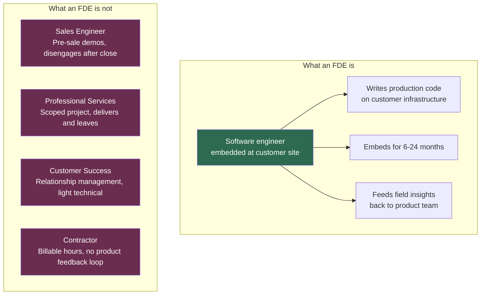
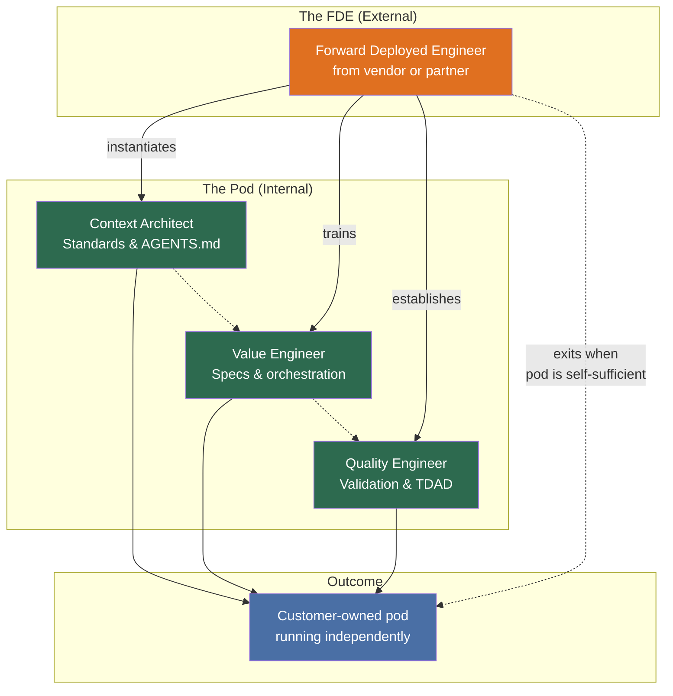
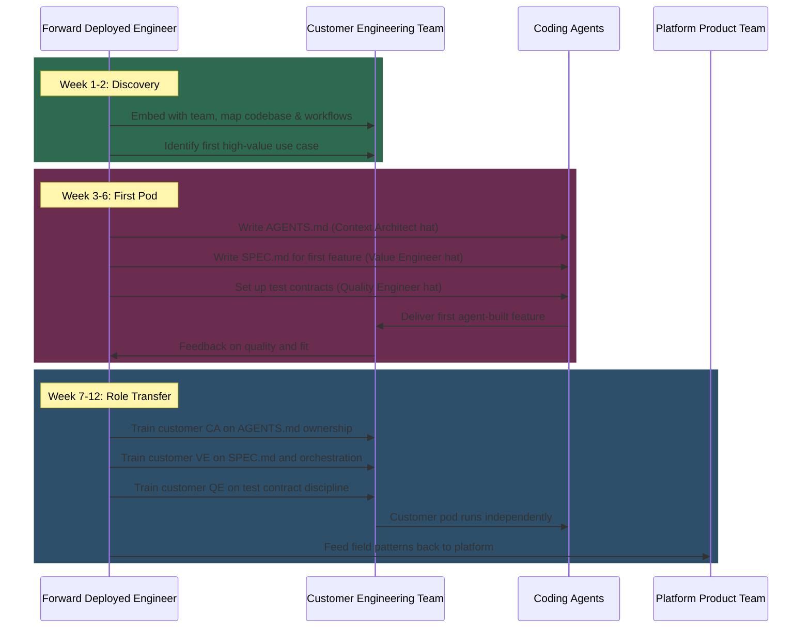
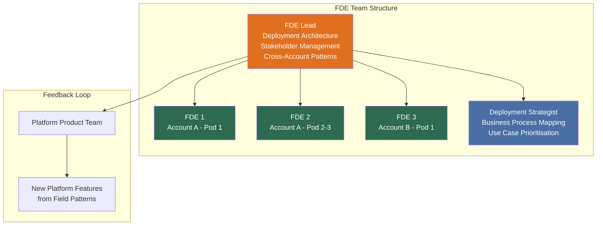
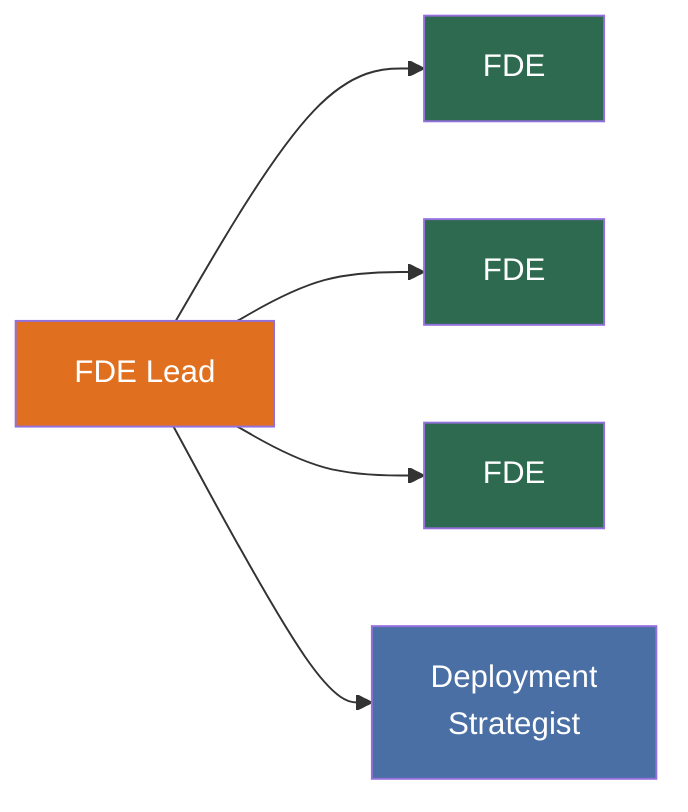
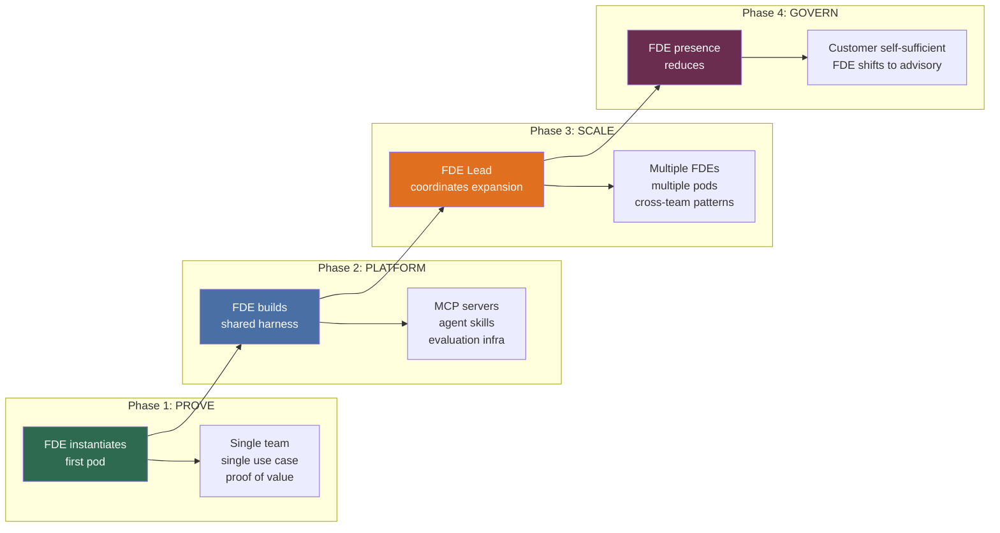
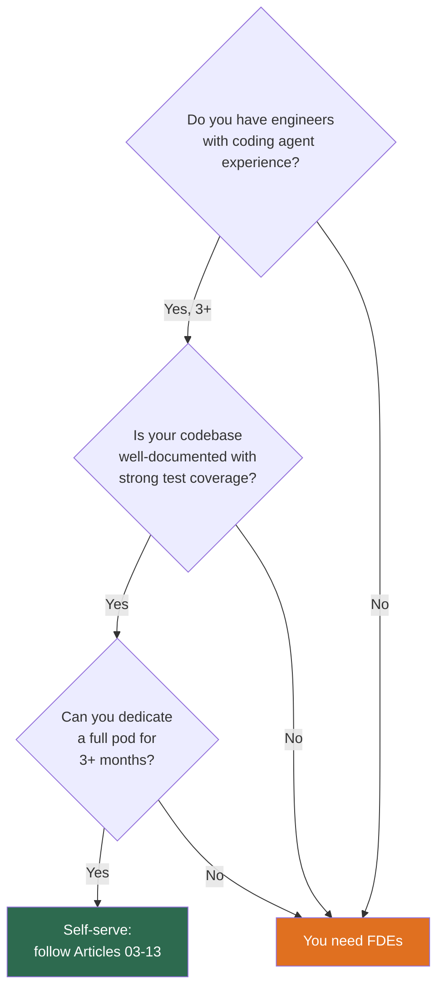
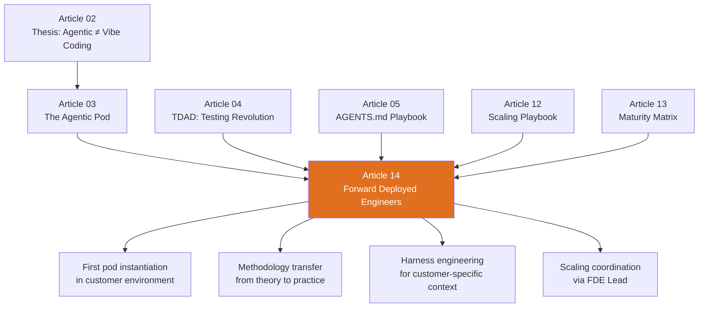

> **From Experiment to Enterprise: The Agentic Engineering Playbook**. This is article 14 of 14.
> *This article names the role that carries agentic pod methodology into organisations that did not invent it: the forward deployed engineer.*
> [Previous: The Agentic Engineering Maturity Matrix](/premium/13-the-agentic-engineering-maturity-matrix/) | [Series overview](#series)

> **Series context:** This is article 14 of 14 in *From Experiment to Enterprise: The Agentic Engineering Playbook*. Articles 1 to 13 built the system: thesis, team model, testing, toolchain, security, economics, scaling and maturity. The missing question was simpler and harder: who carries that method into organisations that do not already have it? This article covers the forward deployed engineer, and the FDE lead who scales that work across accounts.

# Forward Deployed Engineers: The Human Bridge Between Agentic Pods and Enterprise Reality

<a href="/premium-pdfs/14-forward-deployed-engineers.pdf"><strong>Download PDF</strong></a>

## The adoption gap nobody talks about

Uber gave 5,000 engineers access to coding agents and burned through its annual AI budget within months[^uber]. Article 12 explained how to avoid that outcome. Article 13 gave organisations a maturity matrix to measure their progress. Both answered what an enterprise should do. Neither answered who does the work when the expertise is not already in the building.

That gap is where the forward deployed engineer appears. Constellation Research says agentic AI projects lack playbooks and are full of nuance[^constellation]. OpenAI's Harness Engineering case study describes five months of deep contextual work before a three-person team could operate at scale[^harness]. That context did not arrive through a sales demo or a documentation page.

The role has older roots and a very current market. Palantir created it in the early 2010s. Between January and September 2025, job postings for forward deployed engineers grew by more than 800 per cent, according to the Financial Times[^ft_fde]. By April 2026, OpenAI, Anthropic, Palantir, Salesforce and Scale AI all had dedicated FDE functions[^openai_fde][^anthropic_fde][^salesforce_fde][^scale_fde]. Anthropic's partnership with Accenture aims to extend that capacity to 30,000 engineers for enterprise Claude deployments[^nextword].

This article defines the FDE role, separates it from the agentic pod, maps the two together, introduces the FDE lead and lays out a practical engagement model for enterprise adoption.

## The Palantir origin: where the FDE was invented

Palantir created the forward deployed engineer role because its software was too flexible, too complex and too domain-specific to deploy through a standard implementation playbook[^palantir_origin]. Gotham and, later, Foundry needed engineers who could work inside the customer's environment, adapt the platform to the use case and send what they learned back to the product team.

The phrase itself comes from military language. 'Forward deployed' means close to the operational front rather than at headquarters. That framing matters. Palantir did not want a remote support function. It wanted engineers at the point of friction.

Its answer was direct. Send strong software engineers to the customer. Not sales engineers. Not traditional consultants. Engineers who could write production code, understand the customer's data landscape and modify the deployment under real operational pressure.

Palantir's internal language split the work into two tracks: **Devs**, product engineers who build the core platform, and **Deltas**, forward deployed software engineers focused on customer deployments[^palantir_blog]. Deltas work alongside **Deployment Strategists**, Palantir's business analysts who map workflows and prioritise use cases. That pairing, one technically deep FDE and one business-facing strategist, is the template much of the industry has since copied[^fde_academy].

By 2023, Palantir had compressed the model into the **AIP Bootcamp**. These are intensive, usually five-day workshops in which FDE teams work directly with customer executives and engineers to prototype AI use cases on Palantir AIP. The reported bootcamp-to-contract conversion rate is 75 per cent[^yahoo_finance][^palantir_bootcamp]. That is the modern pattern in one line: embed engineers with customers, prove value quickly and use field learning to sharpen the product.

Palantir's original definition still holds up: **an engineer embedded with the customer, writing production code to deploy and customise a platform, while sending field intelligence back to the product team**. That definition maps neatly to agentic engineering in 2026.

## What a Forward Deployed Engineer is, and is not

A forward deployed engineer is a software engineer who embeds with a customer to deploy, customise and operationalise a technology platform inside that customer's environment[^palantir_blog].

Three characteristics separate FDEs from adjacent roles.

**They write production code.** Not demo code. Not throwaway proof-of-concept scripts. An FDE writes code that runs in the customer's production environment, integrates with the customer's systems and has to survive the customer's operational reality. At Scale AI, FDEs 'design custom integrations, build data pipelines, deploy AI models within customer security boundaries, and architect multi-agent systems'[^scale_fde]. A former Baseten FDE described spending 75 per cent of their time on software engineering and model optimisation, which is a ratio that would look strange in a solutions engineering role[^baseten].

**They embed for months, not days.** A solutions engineer works the sales cycle. A professional services consultant delivers a scoped project. An FDE stays for six months to two years and operates as a de facto member of the customer's engineering team. They sit in the stand-ups, learn the technical debt and work out which systems are fragile and which stakeholders matter.

**They send insights back to product.** That is the decisive difference between an FDE and a contractor. Every recurring field pattern, missing feature or awkward integration point should flow back into the platform roadmap. Andreessen Horowitz describes this as 'services-led growth': companies sacrifice short-term margin to build a stronger long-term moat[^a16z]. The FDE is not only deploying the product. They are teaching the product what it should become.

### The role comparison

| Dimension | FDE | Solutions Engineer | Professional Services | Customer Success |
|-----------|-----|--------------------|-----------------------|------------------|
| **Engaged** | Post-sale, long-term | Pre-sale | Post-sale, scoped | Post-deployment, ongoing |
| **Duration** | 6–24 months | Deal cycle (weeks) | Project (weeks–months) | Ongoing, lighter touch |
| **Code** | Production, daily | Demos and POCs | Scoped deliverables | Troubleshooting |
| **Domain depth** | Very deep, becomes domain expert | Moderate | Variable | Moderate |
| **Product feedback** | Core responsibility | Occasional | Rare | Feature requests |

## The agentic pod vs the FDE: two different things

This distinction matters because teams keep blurring it. The agentic pod and the forward deployed engineer are not rival models. They solve different problems at different layers.

The **agentic pod** (from [Article 03](/premium/03-the-agentic-pod/)) is an internal team structure. It organises engineers around coding agents through three roles: Context Architect, Value Engineer and Quality Engineer. The pod is the unit of production. It sits inside the organisation and is staffed by the organisation's own engineers.

The **forward deployed engineer** is an external enabler. It is a person from the vendor, or from a consulting partner, who embeds with the customer long enough to stand up the first pod, build the first harness and transfer the method to the customer's own team. The FDE is the unit of adoption.

| Dimension | Agentic Pod | Forward Deployed Engineer |
|-----------|-------------|--------------------------|
| **What it is** | Internal team structure | External enablement role |
| **Staffed by** | Customer's own engineers | Vendor or consulting partner |
| **Duration** | Permanent, this is how the team works | Temporary, 6–24 months until self-sufficiency |
| **Purpose** | Produce agent-built software | Enable the customer to produce agent-built software |
| **Scales by** | Standing up more pods (Phase 3: Scale) | FDE lead coordinating multiple FDE engagements |
| **Success metric** | Features shipped, agent output quality | Customer pod autonomy, the FDE is no longer needed |

The relationship is generative rather than substitutive. FDEs create pods in client environments. They do not replace the pod model. They carry it across the boundary from vendor method to customer reality. An organisation with strong platform engineering culture and real coding-agent experience may not need outside FDE help. Most enterprises still do.

## FDEs and the agentic pod: the mapping

The practical point is simple. An FDE does not replace pod roles. An FDE instantiates the first pod, teaches the method by doing the work and then steps back as customer engineers take ownership.

### Phase 1: The FDE as the first pod

In the first stage of an enterprise engagement, the FDE often acts as a one-person pod and temporarily wears all three hats.

The job is not to become a permanent extra engineer on the team. The job is to demonstrate the pod method on the customer's codebase, under the customer's constraints, with the customer's stakeholders watching. Then the FDE hands each role to a customer engineer who will own it long term.

That is the difference between reading Article 03 and living it. The FDE shows what an AGENTS.md looks like when agents actually respect it, what a SPEC.md with RFC 2119 language looks like when it drives real execution and what happens when test contracts are too loose or too tight. Theory turns into habit.

### Phase 2: The FDE as pod coach

Once the first customer pod is operating, the FDE shifts from doing to coaching.

- **Context Architect coaching:** Review the customer's AGENTS.md, identify missing guardrails and compare their standards with patterns the FDE has seen work, and fail, elsewhere.
- **Value Engineer coaching:** Review SPEC.md quality, teach the customer how to write specifications agents can execute without ambiguity and introduce the 40/10/40/10 compound engineering split.
- **Quality Engineer coaching:** Make sure test contracts derive from MUST requirements in the SPEC.md, introduce TDAD from [Article 04](/premium/04-tdad-and-the-testing-revolution/) and review the validation pipeline.
- **Cross-pod patterns:** When the customer stands up a second pod, help create shared standards, AGENTS.md inheritance and shared test infrastructure, the platform layer from [Article 12](/premium/12-the-scaling-playbook/).

### Phase 3: The FDE as harness engineer

In mature engagements, the highest-value work is rarely building features. It is building the *harness*, the infrastructure, constraints and feedback loops that make agentic engineering reliable at the customer's actual scale[^harness].

That usually includes:

- **Custom MCP servers** that connect agents to internal systems such as ticketing, CI/CD, observability and deployment pipelines
- **Agent skills** tailored to the customer's domain, including industry-specific patterns, regulatory rules and proprietary APIs
- **Entropy management agents** that detect documentation drift, constraint violations and stale AGENTS.md files
- **Evaluation infrastructure** that measures agent output against the customer's own definition of production quality

The harness is what turns a team that can use agents into an organisation that can rely on them. It is also deeply customer-specific, which is exactly why it needs an embedded engineer rather than a generic template.

## The FDE lead: the scaling mechanism

Individual FDEs do not scale enterprise adoption by themselves. One FDE can stand up one pod, coach a few teams and build one customer's harness. If you want to scale across a large enterprise, or across several enterprise accounts, you need an FDE lead.

### What the FDE lead owns

The FDE lead is not there to add a classic management layer. They are a **deployment architect** who owns the technical adoption strategy for an engagement, or sometimes a portfolio of engagements.

| Responsibility | Detail |
|----------------|--------|
| **Engagement architecture** | Designs the phased adoption plan, which teams get pods first, in what order and with what success criteria |
| **FDE staffing** | Decides which FDEs deploy to which accounts and workstreams, matching skills to customer needs |
| **Cross-account pattern recognition** | Identifies deployment patterns that recur across customers and pushes them back to the product team as platform features |
| **Stakeholder management** | Interfaces with customer executives and budget owners and translates technical progress into business language |
| **Quality bar** | Sets the standard for FDE deliverables, including AGENTS.md quality, SPEC.md rigour and harness completeness |
| **Escalation path** | Acts as the technical escalation point when FDEs encounter problems they cannot solve alone |

### Why a shallow structure works

The FDE function works best with a flat reporting structure rather than a deep hierarchy. Most engagements need only two levels.

The **FDE** is the individual contributor embedded with the customer. The **FDE lead** is the only leadership layer most programmes need. They coordinate multiple FDEs, own the engagement architecture and maintain the loop back to product. More layers quickly recreate the consulting bureaucracy the model was meant to avoid.

The market is still standardising around this shape. Anthropic is hiring a head of forward deployed engineering to build the function[^anthropic_head]. OpenAI is hiring FDEs across six cities, plus dedicated government roles[^openai_fde][^openai_gov]. In both cases, the operational unit is a small autonomous team reporting to one lead, not an elaborate org chart.

## The FDE engagement lifecycle

The timelines below are illustrative. They draw on patterns from Palantir's AIP Bootcamps, OpenAI's Harness Engineering case study and practitioner accounts. Actual durations vary with the codebase, the customer's readiness and the scope of the deployment.

### Discovery (Weeks 1–4)

The FDE embeds with the customer team and maps the terrain.

- **Codebase audit:** Repository structure, test coverage, CI/CD maturity, dependency landscape and documentation quality. This gives you the starting point for the maturity matrix in [Article 13](/premium/13-the-agentic-engineering-maturity-matrix/).
- **Workflow mapping:** How code moves from requirement to production today, where the hand-offs sit and where the bottlenecks really are.
- **Stakeholder mapping:** Who needs to see results, who can block the work and who will champion it internally.
- **Use case identification:** Which team, project and workflow can prove value most clearly in the least time.

The output is a **deployment plan**. It should map directly to Phase 1, Prove, of the scaling playbook and identify the first pod, the first use case and the success measures that justify expansion.

### Build (Weeks 3–12)

The FDE instantiates the first agentic pod:

1. Write the first AGENTS.md with the customer's architectural standards and guardrails.
2. Write the first SPEC.md for the chosen use case and model the RFC 2119 discipline for the customer team.
3. Set up the first test-contract infrastructure using TDAD from [Article 04](/premium/04-tdad-and-the-testing-revolution/).
4. Run the first agent session live, with the customer team watching.
5. Review and refine until the pod rhythm stops feeling artificial.

This is the moment when the value becomes visible. The customer sees a three-person pod, with clear role boundaries and a spec-driven workflow, ship a feature through agent execution. The effect mirrors Palantir's AIP Bootcamp model: compress months of hesitant adoption into weeks of hands-on proof[^palantir_bootcamp]. Palantir reports a 75 per cent bootcamp-to-contract conversion rate[^yahoo_finance].

### Transfer (Weeks 8–24)

The FDE then hands each role to a customer engineer in stages.

| Week | Transfer |
|------|----------|
| 8–10 | Customer engineer takes over QE role and owns test contracts and validation |
| 10–14 | Customer engineer takes over CA role and maintains AGENTS.md and architectural drift reviews |
| 14–20 | Customer engineer takes over VE role and writes SPEC.md and orchestrates agent sessions |
| 20–24 | FDE shifts to coaching mode and advises rather than drives |

This is not a single hand-off meeting. It is a gradual increase in customer autonomy. The FDE reduces direct involvement as customer confidence grows, but remains available for harder architectural work and for the next pod instantiation.

### Steady state

In steady state, the FDE's presence becomes lighter:

- **Weekly or fortnightly check-ins** with the customer pod leads
- **Quarterly harness reviews** that assess AGENTS.md freshness, test coverage and output quality
- **Expansion support** when the customer stands up new pods using patterns established during the initial engagement
- **Escalation** when agents hit failure modes the customer team has not seen before

Some high-value accounts keep an FDE presence for much longer. Others transition to a lighter advisory model. The goal stays the same: maximum customer self-sufficiency.

## Mapping FDEs to the scaling playbook

The engagement lifecycle maps neatly onto the four phases from [Article 12](/premium/12-the-scaling-playbook/).

| Scaling phase | FDE role | FDE lead role |
|--------------|----------|---------------|
| **Phase 1: Prove** | Instantiates first pod and delivers proof of value | Designs the engagement plan and identifies the first team |
| **Phase 2: Platform** | Builds the shared harness, MCP servers, skills and evaluation | Makes sure harness patterns can be reused across pods |
| **Phase 3: Scale** | Coaches new pods and trains customer engineers | Manages multiple FDEs across the account and works with customer leadership |
| **Phase 4: Govern** | Reduces to advisory work and focuses on novel problems | Captures repeatable patterns for the product team and transitions to the next account |

Without an FDE, or an internal engineer with equivalent skill, Phase 1 depends on the customer teaching themselves from documentation alone. That can work in organisations with strong platform engineering culture and previous coding-agent experience. It fails much more often in enterprises with legacy codebases, strict security boundaries, organisational politics and teams that have never worked this way before.

## Why the FDE model matters more for agentic AI

The role was invented for a world in which complicated software platforms needed human translation before they became useful in a customer's environment. Agentic AI makes that need sharper, not weaker, for five reasons.

**1. Agents are deeply contextual.** A coding agent does not work 'out of the box' on a customer codebase. AGENTS.md has to encode architecture, naming, security and testing expectations. Writing an AGENTS.md that agents actually respect takes weeks of embedded understanding.

**2. Trust requires demonstration.** Enterprise teams do not trust coding agents because a vendor tells them to. They trust them when they see an agent work on their code, in their repository, under their constraints. FDEs create that moment.

**3. Evaluation is domain-specific.** 'Good enough' generated code means different things in fintech, games and defence. The FDE calibrates the quality gates to the customer's real standard rather than an abstract benchmark.

**4. Adoption is sociotechnical.** The hardest part is rarely the technology. It is the human resistance around it: engineers who fear replacement, managers who do not understand the new workflow and security teams that see agents as a new attack surface. The FDE handles that because they are in the room.

**5. The harness is the hard part.** NxCode put it plainly: 'the agent isn't the hard part, the harness is'[^nxcode]. Building a harness that fits a customer's systems, data flows, security boundaries and operating culture is FDE work by definition.

## What happens without FDEs

The best way to understand the value of an FDE is to look at the failures you get without one.

| Failure mode | What goes wrong | How an FDE prevents it |
|-------------|----------------|----------------------|
| **Budget blowout** (Uber model) | Annual AI budget disappears in months because every engineer experiments without constraints[^uber] | FDE designs a phased rollout with token budgets and guardrails at each stage |
| **Shelfware** | Platform is purchased and then sits unused because no one knows where to start | FDE embeds with a team, proves value in weeks and creates internal champions |
| **Bad first impression** | Agent produces poor output on the first attempt and the team loses trust | FDE writes the first AGENTS.md and SPEC.md and makes the first session succeed |
| **Methodology drift** | Team adopts agents without discipline and ships poor code faster | FDE instantiates the pod model and establishes role boundaries before scale |
| **Security incident** | Agent reaches systems it should not reach and data leaks | FDE configures sandboxing and security guardrails from day one, see [Article 07](/premium/07-complete-guide-to-codex-security/) |

Palantir's AIP Bootcamp model is the clearest proof point. Seventy-five per cent of bootcamp participants become paying customers[^yahoo_finance]. The broader pattern is the important one: organisations that learn the method by doing it, next to someone who has already done it, adopt faster and with fewer self-inflicted wounds than those who rely on documentation alone.

## The broader landscape: who is hiring FDEs

The model moved from Palantir curiosity to industry standard in less than 18 months.

| Company | FDE programme | Focus |
|---------|--------------|-------|
| **Palantir** | The originator. Hundreds of FDEs globally. AIP Bootcamps as the primary go-to-market motion[^palantir_bootcamp] | Government and enterprise AI/ML platform deployment |
| **OpenAI** | FDE roles in SF, NYC, London, Tokyo and Singapore, plus a dedicated government FDE in Washington DC[^openai_fde][^openai_gov] | Codex and ChatGPT enterprise deployment |
| **Anthropic** | FDE team hiring, plus head of FDE role open. Accenture partnership for 30,000 FDE capacity[^anthropic_fde][^anthropic_head][^nextword] | Claude and Claude Code enterprise adoption |
| **Salesforce** | Launched FDE Partner Network for Agentforce deployments[^salesforce_fde] | CRM and business process agent deployment |
| **Scale AI** | FDEs designing custom integrations and multi-agent architectures[^scale_fde] | Data labelling, model evaluation and AI infrastructure |
| **Accenture** | Launched a dedicated Microsoft FDE practice in 2026[^accenture] | Enterprise AI transformation at consulting scale |
| **Anduril** | FDE-style roles for the Lattice platform, with up to 80 per cent travel and security clearance[^anduril] | Defence and autonomous systems |
| **Datadog** | FDE-titled roles for large customer observability deployments | Infrastructure and application monitoring |

The Accenture entries matter because they show the idea crossing the line from startup tactic to enterprise operating model. Once the largest consulting firm in the world builds dedicated FDE practices for Microsoft and Anthropic, the role is no longer niche.

## FDEs are not DevRel, and not community advocates

This confusion is common and expensive. FDEs, Developer Relations teams and community advocate programmes all connect technically capable people to an external audience. They do not solve the same problem.

### The three models compared

| Dimension | FDE | Developer Relations | Community Advocate (GDE, MVP, AWS Hero) |
|-----------|-----|--------------------|-----------------------------------------|
| **Scaling model** | One-to-one, embedded with a single customer | One-to-many, talks, docs and demos reach thousands | Many-to-many, unpaid experts extend reach across communities |
| **Employment** | Full-time employee of the vendor | Full-time employee of the vendor | External volunteer, keeps their own employer |
| **Code they write** | Production code on customer infrastructure | Sample apps, codelabs, quickstarts and demos | Educational content, blog posts, tutorials and talks |
| **Engagement** | Months-long embedding with one customer | Ongoing but broad, no single customer relationship | Ongoing community contribution, periodically renewed |
| **Customer focus** | Deep, knows the customer's codebase, debt and politics | None, serves the developer ecosystem as a whole | None, serves the broader community |
| **Product feedback** | Direct and daily, based on production deployment | Indirect, based on community signals | Indirect, based on personal experience and community conversation |
| **Success metric** | Customer deployment succeeds and pod becomes self-sufficient | Community growth, adoption metrics and content reach | Community impact and knowledge-sharing volume |

Palantir's internal shorthand is still the best distinction: a product engineer focuses on 'one capability, many customers', while an FDE focuses on 'one customer, many capabilities'[^palantir_blog]. DevRel and community advocates operate in the first mode. FDEs operate in the second.

### Why the distinction matters for agentic engineering

Two mistakes follow when teams blur the models.

**Mistake 1: expecting DevRel to do FDE work.** A developer advocate can give a strong talk about agentic pods and AGENTS.md. They cannot then embed with a financial services team for six months, write production AGENTS.md files for that firm's regulatory constraints and wire them into that firm's delivery pipeline. The skills overlap. The engagement model does not.

**Mistake 2: expecting community advocates to replace FDEs.** A Google Developer Expert or Microsoft MVP may write an excellent blog post about enterprise coding agents. They are still external volunteers with no contractual obligation, no access to the customer's production systems and no direct product-feedback loop back to the vendor. Community advocacy creates awareness. FDEs create production deployments.

At Anthropic, the separation is explicit. The FDE team sits inside Applied AI and embeds with strategic customers to build production Claude deployments. Developer Relations is a separate function aimed at tutorials, cookbooks and ecosystem content[^anthropic_fde][^anthropic_devrel]. OpenAI, Palantir and Salesforce make the same distinction.

If you are deciding how to accelerate agentic engineering adoption, the question is not 'FDE or DevRel?' The question is which one you need at this stage. DevRel builds awareness. FDEs build reality.

## The five skills of an agentic FDE

Salesforce describes five core FDE skills[^salesforce_fde]. In agentic engineering, they look like this.

**1. Full-stack engineering.** The FDE has to work across frontend, backend, infrastructure and CI/CD. Agents do not respect team boundaries, and neither can the person deploying them.

**2. AI agent orchestration.** The FDE needs fluency with AGENTS.md, SPEC.md, MCP servers, agent skills, subagent configuration, approval modes and the compound engineering workflow.

**3. Customer empathy.** The FDE has to understand the customer's business domain as well as the stack. A technically correct SPEC.md that misses business intent is still a failed specification.

**4. Rapid prototyping.** The first agent-built feature should ship in weeks rather than months. Palantir's bootcamp model proves why. AIP use cases are often prototyped in one to five days[^palantir_bootcamp]. Speed is how you build trust.

**5. Field-to-product feedback.** The FDE should capture recurring field patterns and feed them back to the platform team. A repeated customer pain point is a roadmap signal.

## Anti-patterns: when FDE engagements fail

The model is powerful. It is not foolproof. These are the failure modes to watch.

**The permanent crutch.** The FDE embeds so deeply that the customer never develops self-sufficiency. The fix is an explicit transfer plan with handover milestones and a target end date.

**The hero FDE.** One unusually strong engineer carries the whole deployment. When they leave, it collapses. The fix is knowledge distribution across the customer team, enforced by the FDE lead.

**The misaligned incentive.** If success is measured by time on site rather than customer outcomes, the incentive is to stay too long. Tie the engagement to outcomes such as maturity-matrix scores, pod autonomy or output-quality thresholds.

**The feature factory FDE.** The FDE starts building features for the customer instead of building the customer's ability to build features with agents. The first SPEC.md should be written by the FDE. The rest should increasingly belong to the customer.

**The feedback black hole.** Field lessons disappear into chat channels and never shape the product roadmap. The fix is a structured feedback loop with weekly field reporting, monthly product syncs and quarterly roadmap input.

## Do you need FDEs? A decision framework

Not every organisation needs external FDE help. Four signals usually decide the answer.

| Signal | Self-serve (no FDE needed) | FDE recommended |
|--------|---------------------------|-----------------|
| **Agent experience** | Team has shipped features through coding agents | Team has experimented but not shipped |
| **Codebase readiness** | Strong test coverage, CI/CD and documented standards | Legacy codebase, limited tests and tribal knowledge |
| **Platform engineering** | Mature internal platform team | No platform team or early-stage platform work |
| **Security posture** | Clear agent sandboxing and access policies | Undefined agent security boundaries |
| **Organisational buy-in** | Engineering leadership committed and budget allocated | Pilot stage, sceptics still in the room |
| **Scale ambition** | One team experimenting | Multiple teams or enterprise-wide rollout planned |

The buyer's question is not really 'can we hire an FDE?' It is 'how long will it take us to discover all of this ourselves, compared with working beside someone who has already done it 20 times?' An FDE compresses time to value from quarters to weeks. For any organisation aiming at enterprise rollout, that acceleration often decides whether year one produces a scalable method or a stalled experiment.

## Connecting the dots: where the FDE fits in the series

The FDE is the field mechanism for the whole series.

- **Article 02's thesis:** The FDE shows that agentic engineering is not vibe coding by making disciplined agent work visible in a live deployment.
- **Article 03's pod model:** The FDE instantiates the first pod and trains the customer team into each role.
- **Article 04's TDAD:** The FDE sets up test-driven agentic development and calibrates the quality bar.
- **Article 05's AGENTS.md:** The FDE writes the first version against the customer's real standards and constraints.
- **Article 07's security model:** The FDE configures sandboxing and guardrails for the customer's environment.
- **Article 12's scaling playbook:** The FDE executes Phase 1 and builds the platform layer for Phase 2.
- **Article 13's maturity matrix:** The FDE uses it as the baseline assessment and progress tracker.

Without FDEs, the series remains a method. With them, it becomes an adoption engine.

## Key takeaways

1. **Pods and FDEs solve different problems.** The pod is the internal structure for producing agent-built software. The FDE is the external role that helps a customer stand the first pod up.

2. **FDEs do not replace pod roles.** They create the initial conditions in which those roles can exist, then hand them over.

3. **The FDE lead is the scaling layer.** Individual FDEs work at team level. FDE leads coordinate the engagement architecture across teams and accounts.

4. **The alternative is usually slower and messier.** Without embedded expertise, organisations are more likely to burn budget, create shelfware and lose trust after one bad first impression.

5. **The model is now mainstream.** OpenAI, Anthropic, Palantir, Salesforce, Scale AI, Accenture and Anduril all run FDE functions. According to the Financial Times, job postings grew by more than 800 per cent in 2025[^ft_fde].

## From Experiment to Enterprise: The Agentic Engineering Playbook {#series}

A 14-part premium series on moving from first experiments to enterprise-scale agentic engineering.

| | Article | Role |
|---|---------|------|
| 1 | [Codex CLI at One Year](/premium/01-codex-cli-at-one-year/) | The Platform |
| 2 | [Agentic Engineering Is Not Vibe Coding](/premium/02-agentic-engineering-is-not-vibe-coding/) | The Wake-Up Call |
| 3 | [The Agentic Pod](/premium/03-the-agentic-pod/) | The Team Model |
| 4 | [TDAD and the Testing Revolution](/premium/04-tdad-and-the-testing-revolution/) | The Quality Gate |
| 5 | [The AGENTS.md Playbook](/premium/05-the-agents-md-playbook/) | The Blueprint |
| 6 | [Inside the Machine](/premium/06-inside-the-machine/) | The Engine |
| 7 | [Complete Guide to Codex Security](/premium/07-complete-guide-to-codex-security/) | The Guardrails |
| 8 | [Context Compaction and Memory](/premium/08-context-compaction-and-memory/) | The Efficiency Layer |
| 9 | [Three Terminals, Three Fates](/premium/09-three-terminals-three-fates/) | The Toolchain |
| 10 | [AI Slopageddon](/premium/10-ai-slopageddon/) | The Risk |
| 11 | [Token Economics and ROI](/premium/11-token-economics-and-the-roi-of-coding-agents/) | The Business Case |
| 12 | [The Scaling Playbook](/premium/12-the-scaling-playbook/) | The Rollout |
| 13 | [The Agentic Engineering Maturity Matrix](/premium/13-the-agentic-engineering-maturity-matrix/) | The Assessment |
| **14** | **[Forward Deployed Engineers](/premium/14-forward-deployed-engineers/)** | **The Bridge** |

## Citations

[^ft_fde]: [Forward deployed engineers: the new hot job in Silicon Valley — Financial Times](https://www.ft.com/content/forward-deployed-engineers-silicon-valley), 2025. Reports 800%+ growth in FDE job postings between January and September 2025.
[^uber]: Article 12 of this series; original source: The Information, April 2026.
[^constellation]: [Forward deployed engineers: The promise, peril in AI deployments — Constellation Research](https://www.constellationr.com/insights/news/forward-deployed-engineers-promise-peril-ai-deployments)
[^harness]: [Harness engineering: leveraging Codex in an agent-first world — OpenAI](https://openai.com/index/harness-engineering/)
[^openai_fde]: [Forward Deployed Software Engineer, SF — OpenAI Careers](https://openai.com/careers/forward-deployed-software-engineer-sf-san-francisco/)
[^openai_gov]: [Forward Deployed Engineer, Gov — OpenAI Careers](https://openai.com/careers/forward-deployed-engineer-gov-washington-dc/)
[^anthropic_fde]: [Forward Deployed Engineer, Applied AI — Anthropic (Greenhouse)](https://job-boards.greenhouse.io/anthropic/jobs/4985877008)
[^anthropic_head]: [Head of Forward Deployed Engineering — Anthropic](https://jobs.generalcatalyst.com/companies/anthropic/jobs/62065791-head-of-forward-deployed-engineering)
[^nextword]: [Anthropic just dropped a nuke, and it's called 30,000 FDEs — Nextword (Substack)](https://nextword.substack.com/p/anthropic-accenture-partnership-why)
[^salesforce_fde]: [Forward Deployed Engineer: 5 Skills — Salesforce Blog](https://www.salesforce.com/blog/forward-deployed-engineer/)
[^scale_fde]: [Forward Deployed AI Engineer, Enterprise — Scale AI Careers](https://scale.com/careers/4597399005)
[^palantir_origin]: [How Palantir Invented the Forward Deployed Engineer Model — FDE Academy](https://fde.academy/blog/how-palantir-invented-the-forward-deployed-engineer-model). See also: Palantir S-1 Filing (SEC, 2020), which discusses the FDE model as a core go-to-market strategy.
[^fde_academy]: [Forward Deployed Engineer Guide: Role, Salary & Career Path — FDE Academy](https://fde.academy/blog/forward-deployed-engineer). Maps career progression and pod structure: 1 Deployment Strategist + 2 FDEs per customer.
[^palantir_blog]: [Dev versus Delta: Demystifying engineering roles at Palantir — Palantir Blog](https://blog.palantir.com/dev-versus-delta-demystifying-engineering-roles-at-palantir-ad44c2a6e87)
[^palantir_bootcamp]: [Deploying Full Spectrum AI in Days: How AIP Bootcamps Work — Palantir Blog](https://blog.palantir.com/deploying-full-spectrum-ai-in-days-how-aip-bootcamps-work-21829ec8d560)
[^yahoo_finance]: [Palantir: How Bootcamps Could Drive 2026 AI Dominance — Yahoo Finance](https://finance.yahoo.com/news/palantir-bootcamps-could-drive-2026-161320305.html). 75% bootcamp-to-contract conversion rate.
[^a16z]: [Trading Margin for Moat: Why the Forward Deployed Engineer Is the Hottest Job in Startups — a16z](https://a16z.com/services-led-growth/)
[^baseten]: [What I learned as a forward-deployed engineer working at an AI startup — Baseten](https://www.baseten.co/blog/what-i-learned-as-a-forward-deployed-engineer-working-at-an-ai-startup/)
[^nxcode]: [Harness Engineering Complete Guide: AI Agent Codex 2026 — NxCode](https://www.nxcode.io/resources/news/harness-engineering-complete-guide-ai-agent-codex-2026)
[^accenture]: [Accenture Launches Microsoft Forward Deployed Engineering Practice — Accenture Newsroom](https://newsroom.accenture.com/news/2026/accenture-launches-microsoft-forward-deployed-engineering-practice-to-help-organizations-scale-ai-across-the-enterprise)
[^anduril]: [Forward Deployed Engineer, Air Defense — Anduril Industries (Greenhouse)](https://job-boards.greenhouse.io/andurilindustries/jobs/5057206007)
[^anthropic_devrel]: [Developer Relations Lead — Anthropic (Greenhouse)](https://job-boards.greenhouse.io/anthropic/jobs/4781798008). Separate function from the FDE team, focused on developer ecosystem content and community.
